# Mark Schemes — Waves & The Electromagnetic Spectrum
**5. Waves** · Edexcel IGCSE Physics (Modular) (4XPH1) — 24/Unit 2

## Q1 — easy — 1 marks · exam-questions

### 3() — 1 marks
**Correct answer: C** — Speed in free space

**The correct answer is ****C** because:

- All waves on the electromagnetic spectrum travel with the same speed in a vacuum, which is sometimes referred to as 'free space'

  - This speed is called 'the speed of light' and has the value 3.0 × 10−8 m s−1

**A** is incorrect as amplitude changes depending on how much energy a wave has - larger amplitude indicates a brighter light, or louder sound, for example

**B** is incorrect as frequency means how many waves pass a point per second and can change depending on the source of the wave

**D** is incorrect as the wavelength of electromagnetic waves can be as small as an electron or as long as the height of a mountain!

## Q2 — easy — 1 marks · exam-questions

### 10() — 1 marks
**Correct answer: C** — Microwaves and radio waves travel at the same speed in a vacuum.

**The correct answer is ****C** because:

- All waves on the electromagnetic spectrum travel with the same speed in a vacuum

  - This is called 'the speed of light' and has the value 3.0 × 10−8 m s−1

**A** and **B** are incorrect as all electromagnetic waves travel at the same speed in a vacuum

**D** is incorrect as electromagnetic waves slow down by different amounts which depend on their wavelength when they enter other materials. Therefore microwaves and radio waves only have the same speed in a vacuum, but not in other materials

## Q3 — easy — 1 marks · exam-questions

### 1() — 1 marks
**Correct answer: A** — Option  A

The correct answer is **A** because:

- The amplitude is the distance from the mean (rest) position to the maximum displacement

**B** is incorrect as this is the wavelength

**C** is incorrect as this is one half of a full wavelength

**D** is incorrect as this is the height of the wave, from trough to crest

## Q4 — easy — 1 marks · exam-questions

### 1() — 1 marks
**Correct answer: B** — 2 cm

**The correct answer is ****B** because:

- Amplitude means the distance from the equilibrium position to the maximum displacement
- From the graph this can be seen to be 2 cm

> *Sometimes people confuse 'amplitude' with 'the height of the wave'. If you want to think of it as height then you must remember that it is the height **from the equilibrium position**, not from the bottom of the wave shape.*

## Q5 — easy — 1 marks · exam-questions

### 2() — 1 marks
**Correct answer: D** — x-rays

**The correct answer is ****D** because:

- X-rays can be used to check for broken bones because the easily penetrate the skin and tissue but are absorbed by the dense bone structure

## Q6 — easy — 3 marks · exam-questions

### 4() — 1 marks
**Correct answer: C** — ultraviolet

**The answer is ****C** because:

- From the electromagnetic waves listed, ultraviolet has the shortest wavelength

> *It's a good idea to memorise the order of the parts of the e.m. spectrum. This mnemonic may help you to imagine a spy, who is a grandmother and carries a fairly useless umbrella... :)*

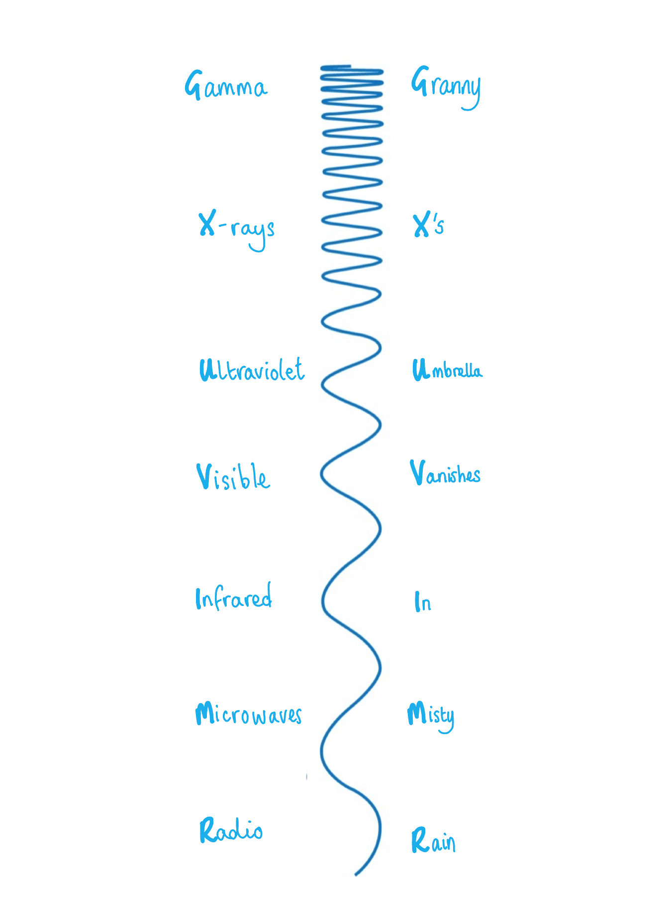

### 4() — 1 marks
**Correct answer: A** — electromagnetic waves are longitudinal

**The correct answer is ****A** because:

- Electromagnetic waves are transverse waves, not longitudinal

**B** is incorrect as all waves transfer energy without transferring matter

**C** is incorrect as electromagnetic waves can travel in a vacuum, which is why we can see the light from stars

**D** is incorrect as all electromagnetic waves travel at the speed of light in free space

### 4() — 1 marks
**Correct answer: C** — looking at the internal structure of objects

**The correct answer is ****C**** **because:

- X-rays are used for looking at internal structures such as bones, or inside luggage at security gates

**A** is incorrect as television signals are broadcast using radio waves

**B** is incorrect as food can be cooked using microwaves or infrared (heat)

**D** is incorrect as night vision goggles use infrared (heat), ultraviolet and visible light, and amplify them to improve vision in the dark or near-dark

## Q7 — easy — 2 marks · exam-questions

### 1() — 1 marks
**Correct answer: C** — speed

**The correct answer is ****C** because:

- All electromagnetic waves travel at the speed of light in a vacuum (free space)

**A** is incorrect as waves have different amplitude depending on how energetic they are

**B** and **D** are incorrect as the Sun emits radiation from all parts of the e-m spectrum, having a range of different frequencies and wavelengths

### 1() — 1 marks
**Correct answer: D** — ultraviolet

**The correct answer is ****D** because:

- Ultraviolet rays can be energetic enough to cause damage to the skin and eyes

**A** is incorrect as gamma rays are more ionising, causing cancers

**B** is incorrect as infrared waves transfer heat energy

**C** is incorrect as radio waves have very low frequency and do not transfer much energy, meaning they don't cause damage to the cells

## Q8 — easy — 1 marks · exam-questions

### 1((b)) — 1 marks
**Correct answer: C** — the same speed

**The correct answer is ****C**** **because:

- All electromagnetic waves travel at the speed of light in a vacuum (free space)

**A** is incorrect as waves have different amplitude depending on how energetic they are

**B** and **D** are incorrect as the Sun emits radiation from all parts of the e-m spectrum, having a range of different frequencies and wavelengths

## Q9 — easy — 1 marks · exam-questions

### 1((a)) — 1 marks
**Correct answer: C** — Option C

**The correct answer is ****C** because:

- Amplitude means the distance from the equilibrium to the maximum displacement

  - Option **C **shows this measurement

**A** is incorrect as this is half of one full wavelength

**B** is incorrect as this is the full height of the wave

**D** is incorrect as the arrow is from one trough to the next, so this is one full wavelength

## Q10 — easy — 5 marks · exam-questions

### 2((b)) — 3 marks
Describe one difference between transverse and longitudinal waves, with a labelled diagram:

![Hand-drawn diagram comparing two types of wave. At the top, a smooth wave with rounded peaks and troughs, with vertical double-headed arrows drawn between a peak and a trough labelled oscillations. Below it, a long horizontal arrow pointing right, labelled direction of travel. At the bottom, a row of short vertical lines with alternating closely spaced and widely spaced regions, and horizontal double-headed arrows beneath them labelled oscillations, pointing along the same line as the direction of travel arrow.](assets/046-hand-drawn-diagram-comparing-two-types-of-wave-a.jpeg)

**[3 marks]**

> **[mark-scheme]**
> 1 mark for stating that a transverse wave vibrates perpendicular to the direction of the wave
> 
> 1 mark for stating that a longitudinal wave vibrates parallel to the direction of the wave
> 
> 1 mark for a named freehand sketch of either wave showing both directions
> 
> Either difference may be shown with labels on the diagram rather than written out

> **[exam-tip]**
> Practise standard diagrams like this one as part of your revision. Do not find yourself drawing it for the first time in the exam.
> 
> Label two things on your sketch: the direction the wave travels, and the direction the particles vibrate. A drawing without both directions marked cannot score.

### 2((c)) — 2 marks
> **[mark-scheme]**
> State two properties that are the same for all electromagnetic waves:
> 
> Any **two** from (1 mark each):
> 
> - They can travel through a vacuum / they need no medium
> - They travel at the same speed in a vacuum / at 3 × 108 m/s
> - They obey the laws of reflection and refraction
> - They obey the wave equation, speed = frequency × wavelength
> - They carry energy / information
> - They are transverse
> 
> **[2 marks]**

> **[exam-tip]**
> Give two genuinely different properties. Two ways of saying the same thing earn one mark between them.
> 
> If you write about speed, say "in a vacuum". That single phrase covers two of the properties at once, because travelling through a vacuum is itself one of them.

## Q11 — easy — 7 marks · exam-questions

### 2((a)) — 1 marks
(a)

A correctly completed table looks like:

- All three correct for **[1 mark]**

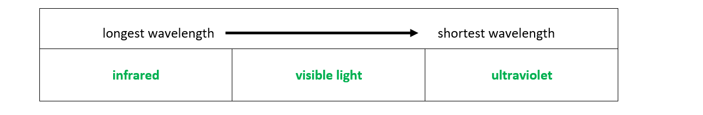

**[Total: 1 mark]**

### 2((b)) — 2 marks
(b)

Two other types of electromagnetic wave include:

Any **two **from:

- Radio (waves); **[1 mark]**
- Microwaves; **[1 mark]**
- x-rays; **[1 mark]**
- Gamma/γ rays/waves; **[1 mark]**

**[Total: 2 marks]**

> *Notice that you were asked for two **other **types of electromagnetic waves, so you cannot repeat the waves already mentioned in the question.*

### 2((c)) — 4 marks
(c)

(i) Two uses of ultraviolet waves:

Any **two **from:

- Killing bacteria e.g. in water purification OR in hand driers in toilets OR sterilisation of equipment; **[1 mark]**
- Named examples of medical uses, e.g.: setting dental fillings OR detection of bacteria OR treatment of (named) skin diseases; **[1 mark]**
- Security markings e.g. for checking banknotes; **[1 mark]**
- Examples of uses of fluorescent lamps e.g. tanning machines, black-light, crime scene/health officer detection of blood/other body fluids; **[1 mark]**
- Data reading e.g. blu-ray devices; **[1 mark]**

(ii) Two dangers of ultraviolet waves:

Any **two **from:

- Cell damage e.g. (skin) cancer, cell mutation; **[1 mark]**
- Sunburn/skin aging; **[1 mark]**
- Eye damage e.g. cataracts, blindness; **[1 mark]**

**[Total: 4 marks]**

> *Be very specific with answer like this one. Don't fall into vague generalisations like 'they are used in hospital'.*

> *State exactly how they are used, naming any devices or procedures.*

## Q12 — easy — 7 marks · exam-questions

### 1((a)) — 2 marks
Complete the table with the names of the missing parts:

|   | **Name** |
|---|---|
| **A** | **microwaves** **[1]** |
| **B** | **X-rays** **[1]** |

> **[exam-tip]**
> Write each name out in full. "Micro" and "X" on their own are not enough, although X-rays may be written with a capital or a lower-case x, with or without the hyphen.

### 1((a)) — 2 marks
> **[mark-scheme]**
> State two similarities between visible light, infrared and ultraviolet:
> 
> Any **two** from (1 mark each):
> 
> - They are electromagnetic waves / part of the electromagnetic spectrum
> - They are transverse waves
> - They travel through a vacuum / they do not require a medium
> - They travel at the same speed in a vacuum
> - They carry information
> - They transfer energy
> 
> **[2 marks]**

> **[exam-tip]**
> Give a property that all three waves share as members of the electromagnetic spectrum. Effects on the body are not a similarity of that kind and earn nothing here — the damage these waves cause is what the next part asks about.
> 
> Be precise about energy. Say that they transfer energy, rather than that they "have energy".

### 1((b)) — 2 marks
> **[mark-scheme]**
> State the damage that each can cause:
> 
> - Infrared can cause skin burns **[1 mark]**
> - Ultraviolet can cause damage to surface cells **OR** blindness **[1 mark]**

> **[exam-tip]**
> Think about what each wave does when the body absorbs it. Infrared transfers thermal energy, so it burns the skin. Ultraviolet carries more energy than visible light, so it damages cells.

### 1((c)) — 1 marks
> **[mark-scheme]**
> Which colour has the longest wavelength:
> 
> - Red **[1 mark]**

## Q13 — easy — 2 marks · exam-questions

### 1((b)) — 2 marks
To calculate frequency from time period:

Time period is the time for one full wave to pass a point:

- Therefore time period,* T *= 5 s

Use the equation linking frequency and time period:

- $f=\frac{1}{T}$
- $f=\frac{1}{5}$ **[1 mark]**

Write the answer in decimals:

- Frequency = 0.2 Hz; **[1 mark]**

**[Total: 2 marks]**

> *In your physics exam, never leave an answer as a fraction. Always convert to decimals.*

> *Another part of maths to avoid in physics is recurring numbers. Always round up your answer to two or three significant figures.*

## Q14 — medium — 1 marks · exam-questions

### 10() — 1 marks
**Correct answer: B** — radio waves

**The correct answer is ****B** because:

- Radio waves have the longest wavelength of the whole electromagnetic spectrum

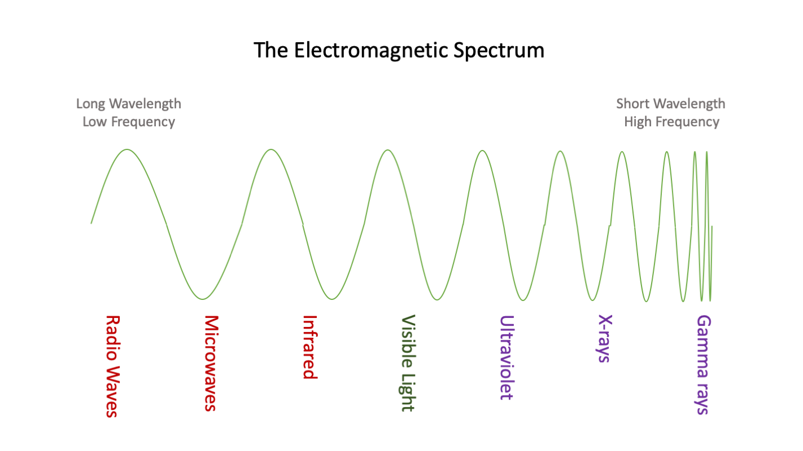

## Q15 — medium — 1 marks · exam-questions

### 1() — 1 marks
**Correct answer: B** — Option B

**The correct answer is ****B** because:

- The wavelength is the distance from one crest to the next crest

**A** is incorrect as this is the amplitude

**C** is incorrect as this is one half of a full wavelength

**D** is incorrect as this is the height of the wave, from trough to crest

## Q16 — medium — 1 marks · exam-questions

### 1() — 1 marks
**Correct answer: C** — 8 cm

**The correct answer is ****C** because:

- Wavelength means the distance between successive crests of the wave (from one crest to the next one)
- From the graph this can be seen to be 8 cm

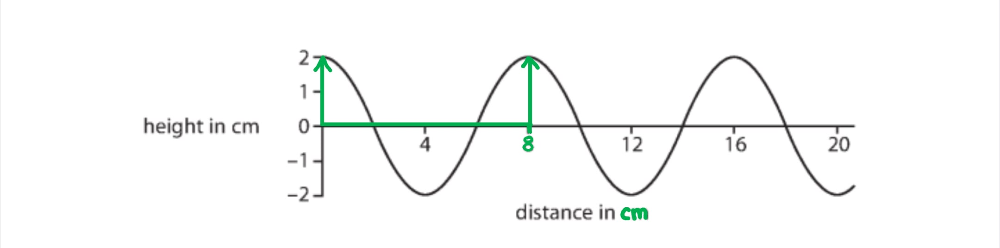

> *You can also say that the wavelength is from trough to trough. It is often defined as simply the length of one full wave. The easiest way to see it is to choose one clear point on the wave (such as the crest) and then look for the next identical point along the wave.*

## Q17 — medium — 1 marks · exam-questions

### 1((b)) — 1 marks
**Correct answer: D** — increasing wavelength

**The correct answer is D** because:

- Wavelength is shortest in gamma rays and increases up to radio waves, which are the longest

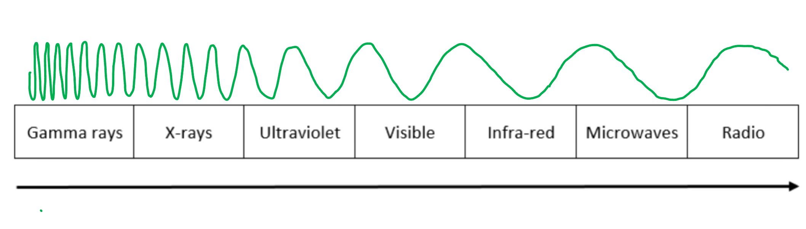

## Q18 — medium — 1 marks · exam-questions

### 3() — 1 marks
**Correct answer: B** — gamma rays

**The correct answer is ****B** because:

- Gamma waves have the highest frequency on the e-m spectrum
- The others listed all have lower frequency than ultraviolet

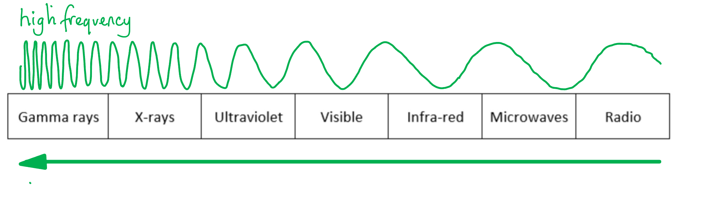

## Q19 — medium — 1 marks · exam-questions

### 1((a)) — 1 marks
**Correct answer: D** — Option D

**The correct answer is ****D** because:

- Wavelength is the distance between two successive peaks or troughs

  - Option **B** shows the distance between two successive troughs

**A** is incorrect as this is half of one full wavelength

**B** is incorrect as this is the full height of the wave

**C** is incorrect as this is the distance from the equilibrium to the maximum displacement, which is the amplitude

## Q20 — medium — 7 marks · exam-questions

### 1((a)) — 2 marks
(a)

State one similarity between transverse and longitudinal waves:

Any **one **from:

- Both transfer energy; **[1 mark]**
- Both undergo reflection, refraction and diffraction; **[1 mark]**
- Both propagate due to particles oscillating about an equilibrium position; **[1 mark]**

State one difference between transverse and longitudinal waves:

- The particles in longitudinal waves oscillate parallel to the direction of travel/energy transfer, while transverse waves oscillate perpendicular to the direction of travel/energy transfer; **[1 mark]**

**[Total: 2 marks]**

### 1((b)) — 5 marks
(b)

A correctly complete table looks like:

| **Sentence** | **Correction** |
|---|---|
| Electromagnetic waves travel at <u>3 × 10</u><u>−2</u> m/s in a vacuum. | 3 × 108 |
| <u>Sound</u> waves are electromagnetic. | gamma **OR **x-ray **OR  **uv **OR **visible light **OR **infra-red **OR ** microwave **OR **radio |
| <u>Infra-red</u> waves are the most harmful to people. | gamma |
| <u>Gamma</u> waves are used for heating up food. | microwave |
| <u>Radio waves</u> have the highest frequency. | gamma |
| <u>Gamma</u> waves have the longest wavelength. | radio |

**One mark** for each correct answer

**[Total: 5 marks]**

> *Don't worry if you think there is more than one answer. When lists are involved, there may be! For the first answer any wave at all from the electromagnetic spectrum is a correct answer.*

> *Gamma rays are the most harmful to people, as they are the most energetic form of radiation and are therefore the most ionising to cells.*

> *Microwaves are used in microwave ovens, but remember that conventional ovens use 'heat', which travels by infra-red waves.*

> *On the electromagnetic spectrum radio waves are at the long-wavelength/ low frequency end, which gamma rays are at the short-wavelength/high frequency end.*

## Q21 — medium — 5 marks · exam-questions

### 4() — 2 marks
(a)

Give a use of gamma radiation in hospitals and a supporting statement:

Any **one pair** from:

- Sterilising medical equipment;**[1 mark]**

**AND**

- Gamma rays kill bacteria; **[1 mark]**

- Treating cancer/radiotherapy; **[1 mark]**

**AND**

- Gamma rays mutate cancer cells;**[1 mark]**

- Detecting cancer/PET scanners; **[1 mark]**

**AND**

- By using radioactive) tracers/gamma camera; **[1 mark]**

**[Total: 2 marks]**

> *Since the first part of the question asks you to **describe **but offers two marks, it is important to give first a** fact **(a named use of gamma rays in hospital) and then a **supporting statement** for that fact.*

> *You might have come up with a good answer that isn't listed on the mark scheme (or even in our model answers). In questions like this one the examiner is usually told to accept 'any sensible suggestion'. That means if you thought of something good which they hadn't put on the list, you will still get the mark.*

> *Be careful of that word 'sensible' though - exams are not the time to invent anything or start quoting odd corners of the internet - stick to what you covered in class. For example, CT and MRI scanners sound like they connect to this topic, but actually use electromagnets, not radiation. And lead shielding does protect against radiation, but by comparing doctors to patients the examiner hopes you are thinking about time of exposure, rather than protection which is already in place (by law).*

### 4() — 3 marks
(b)

(i) The risks to patients and doctors of using gamma radiation include:

Any **two **marks from:

- Increased risk of cancer/mutation of cells **OR **damage to neighbouring/good/healthy cells; **[1 mark]**

Further details include:

- Because radiation is ionising/ gamma has high/highest energy; **[1 mark]**

Compare the amount of risk to doctors and patients:

- Patients are only exposed for a short time **AND **doctors have a daily (low level) exposure; **[1 mark]**

(ii) To reduce the risks to a doctor who uses gamma radiation:

- Limit the amount of time **OR **work in another room/keep a distance from the radioactive source; **[1 mark]**

**[Total: 3 marks]**

## Q22 — medium — 8 marks · exam-questions

### 1((a)) — 4 marks
(a)

(i) Two sections of the spectrum that are used for communications:

Any **two** from:

- Radio; **[1 mark]**
- Microwaves; **[1 mark]**
- Infrared; **[1 mark]**
- Visible; **[1 mark]**

(ii) Two sections of the spectrum that are used for cooking:

- Microwaves; **[1 mark]**
- Infrared; **[1 mark]**

**[Total: 4 marks]**

> *With long lists of information, don't try to memorise the entire list. Usually two is enough, or three at most. That way if the question said, for example, '**microwaves are used for communication, name one other em wave used for communications**', you would still be able to easily answer.*

> *In this question you are asked for two. At GCSE you will never be asked to list more than three possible items from any list.*

### 1((c)) — 4 marks
(b)

(i) The equation linking wave speed, frequency and wavelength:

- $v=fλ$ **OR **speed = frequency × wavelength; **[1 mark]**

(ii) To calculate the wave speed:

List the known quantities:

- Frequency, *f* = 200 kHz
- Wavelength, *λ* = 1500 m

Convert kHz into Hz:

- Frequency, *f* = 200 kHz = 200 × 103 Hz

Using the equation from part (i), substitute the values:

- `v space equals space f lambda space equals space open parentheses 200 cross times 10 cubed close parentheses cross times 1500 space equals space 300 space 000 space 000`; **[1 mark]**

Give the answer and the units:

- Speed, *v* = 300 000 000 **OR **300 × 106 **OR **3 × 108; **[1 mark]**
- Units = m/s;** [1 mark]**

**[Total: 4 marks]**

> *There are other ways to give the final answer for speed.*

> *For example, you may have said that 300 000 000 m/s is actually 300 000 km/s, or even 3.0 × 10**5** km/s*

> *You might even have converted to km/h, in which case the answer is 1.08 × 10**12** km/h*

> *Any correct answer will get full marks, **as long as** the value and the units match up. If they don't then you will only get one mark, for the value, but lose the units mark.*

> *So be careful! *

## Q23 — medium — 5 marks · exam-questions

### 1((a)) — 3 marks
(a)

A correctly completed table looks like:

**One **mark for each line correct:

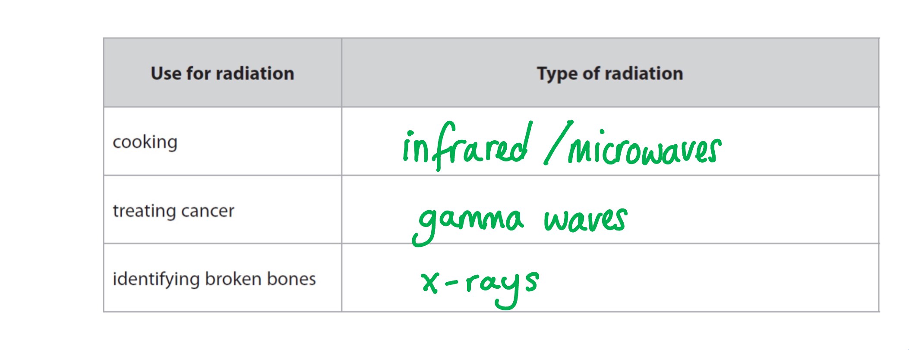

**[Total: 3 marks]**

### 1((c)) — 2 marks
(b)

A correctly annotated diagram looks like:

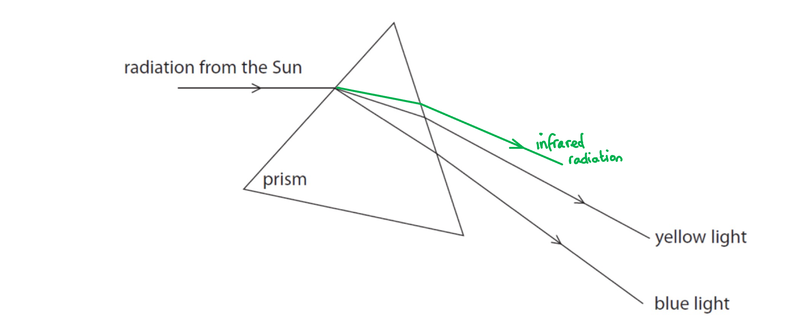

- Ray of infrared radiation is <u>refracted</u> in the <u>same general direction</u> as the light; **[1 mark]**
- The infrared ray is positioned <u>above the yellow light</u>;**[1 mark]**

**[Total: 2 marks]**

## Q24 — medium — 7 marks · exam-questions

### 8((a)) — 3 marks
(a)

(i) A property of waves that is the same for radio waves and x-rays:

Any **one **from:

- They are electromagnetic waves; **[1 mark]**
- Transverse waves; **[1 mark]**
- Travel in a vacuum/without a medium; **[1 mark]**
- Travel at the speed of light in a vacuum; **[1 mark]**
- They can carry information; **[1 mark]**
- They <u>transfer</u> energy;**[1 mark]**

(ii) Two properties of waves that are different for radio waves and x-rays:

Any **two **from:

- Frequency; **[1 mark]**
- Wavelength; **[1 mark]**
- Amount of energy;** [1 mark]**

**[Total: 3 marks]**

### 8((b)) — 4 marks
(b)

(i) The average time between each pulse:

- There are five peaks, therefore there are <u>four complete pulses</u> shown (the time period of one pulse is the time from peak-peak);**[1 mark]**

Calculate the total time passed over the course of these four complete pulses:

- The first peak occurs at *t* = 0.3 s
- The final peak occurs at *t* = 5.7 s
- Time between first and final peak = 5.7 − 0.3 = 5.4 s

Divide the time passed by the number of complete pulses to calculate the average:

- There are four gaps between these peaks, so divide by 4
- $t=\frac{5.4}{4}=1.35s$ **[1 mark]**

(ii) Calculate the frequency of the pulses:

- Frequency:  $f=\frac{1}{T}$ where *T* = time period

Substitute the value and calculate:

- $f=\frac{1}{1.35}=0.74$ [1 mark] Hz / Hertz; **[1 mark]**

**[Total: 4 marks]**

## Q25 — medium — 10 marks · exam-questions

### 4((a)) — 2 marks
(a)

(i) A correct pair of arrows on the diagram would look like:

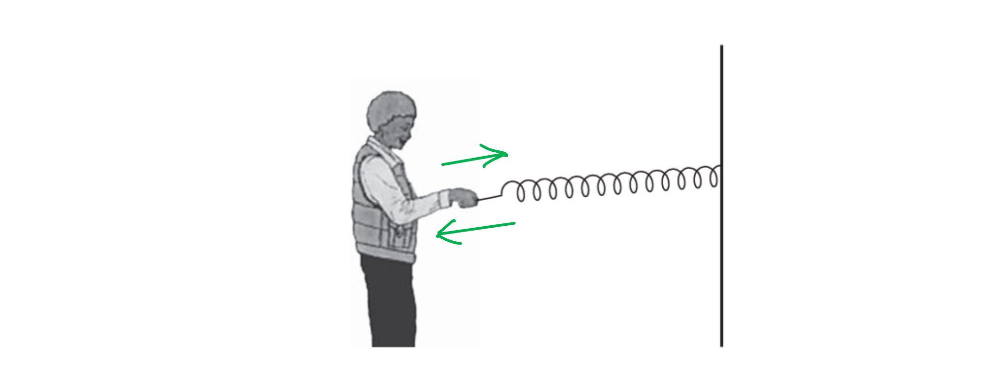

- <u>Two</u> arrows in opposite directions/one double-headed arrow **AND **parallel (by eye) with the spring; **[1 mark]**

(ii) Examples of longitudinal waves:

Any **one** from:

- Sound; **[1 mark]**
- Ultrasound;** [1 mark]**
- p-waves/ earthquake pressure wave; **[1 mark]**

**[Total: 2 marks]**

### 4((b)) — 8 marks
(b)

(i) A correct diagram looks like:

Any **one **of the lines shown:

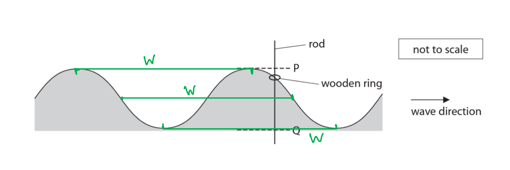

- A line connecting two adjacent places which are in phase (i.e the same point on an adjacent wave); **[1 mark]**

(ii) To find amplitude:

Recall that amplitude is the distance from the equilibrium position to the maximum:

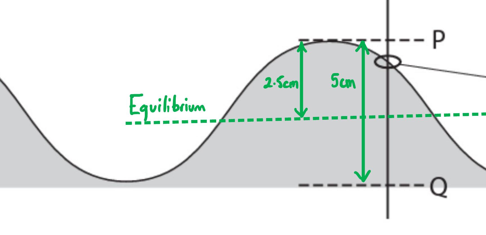

- The distance from P to Q is 5.0 cm
- Therefore amplitude = 5.0 ÷ 2 = 2.5 cm; **[1 mark]**

(iii) To find frequency:

List the known quantities:

- The time period, *T* = 15 s

Use the equation for frequency:

- $f=\frac{1}{T}$

Substitute the value for *T* and calculate:

- $f=\frac{1}{15}$ **[1 mark]**
- $f=0.067$  **[1 mark]**

Recall the units for frequency:

- Units = Hertz/Hz; **[1 mark]**

(iv)  How the movement of the wooden ring demonstrates a transverse wave:

Recall the definition of a transverse wave:

- In transverse waves the particles oscillate perpendicular to the direction of travel of the wave

Describe the wooden ring and the wave:

- The wooden ring moves up and down
- The wave moves from left to right

Draw a conclusion:

- Therefore the <u>ring moves perpendicular/right angles</u>; **[1 mark]**
- To the <u>direction of travel</u> of the wave; **[1 mark]**

(v) A different example of a transverse wave:

Any **one **from:

- Electromagnetic wave;** [1 mark]**
- Any named electromagnetic wave (eg: radio waves, microwaves etc); **[1 mark]**
- Earthquake s-waves/ seismic waves; **[1 mark]**
- Wave on a rope or slinky; **[1 mark]**

**[Total: 8 marks]**

## Q26 — medium — 4 marks · exam-questions

### 7((a)) — 1 marks
(a)

The term wavelength means:

- The distance travelled by a wave in one time period **OR **the distance between two successive peaks/troughs; **[1 mark]**

**[Total: 1 mark]**

### 7((b)) — 3 marks
(b)

(i) The equation linking wave speed, frequency and wavelength:

- $v=fλ$ **OR **speed = frequency × wavelength; **[1 mark]**

(ii) To calculate the wavelength of the waves:

List the known quantities:

- Wave speed, *v* =  3.0 m/s
- Frequency,* f *= 1.5 Hz

Rearrange the equation from part (i) to make wavelength the subject:

- $λ=\frac{v}{f}$

Substitute the quantities into the rearranged equation:

- $λ=\frac{3.0}{1.5}$ **[1 mark]**

Calculate the final answer:

- $λ=2.0m$ **[1 mark]**

**[Total: 3 marks]**

## Q27 — medium — 6 marks · exam-questions

### 6() — 2 marks
(a)

(i) To calculate the wavelength of this microwave:

Count the number of complete waves shown:

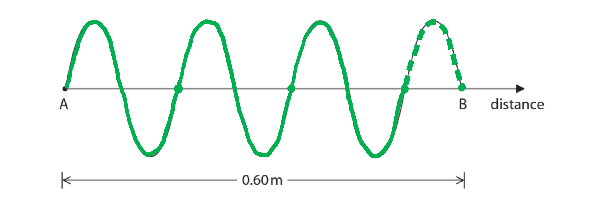

- Number of waves = 3 full one waves and one half (shown as a dashed line) = 3.5 waves; **[1 mark]**

Divide the measurement shown by the number of waves:

- Wavelength = $\frac{0.6}{3.5}=0.17m$ **[1 mark]**

**[Total: 2 marks]**

### 6() — 4 marks
(b)

(i) The equation linking wave speed, frequency and wavelength:

- $v=fλ$ **OR **velocity = frequency × wavelength;** [1 mark]**

(ii) To calculate frequency:

List the known quantities:

- Velocity of microwaves, *v *= 3.0 × 108 m/s
- Wavelength, *λ* = 0.17 m

Rearrange the equation from part (ii):

- $f=\frac{v}{λ}$**[1 mark]**

Substitute the values and calculate:

- $f=\frac{3.0\times10^{8}}{0.17}$ **[1 mark]**

- $f=1.8\times10^{9}\mathrm{Hz}$**[1 mark]**

**[Total: 4 marks]**

## Q28 — medium — 5 marks · exam-questions

### 2((a)) — 3 marks
(a)

(i) The number of time periods shown on the trace is:

Count the number of complete waves:

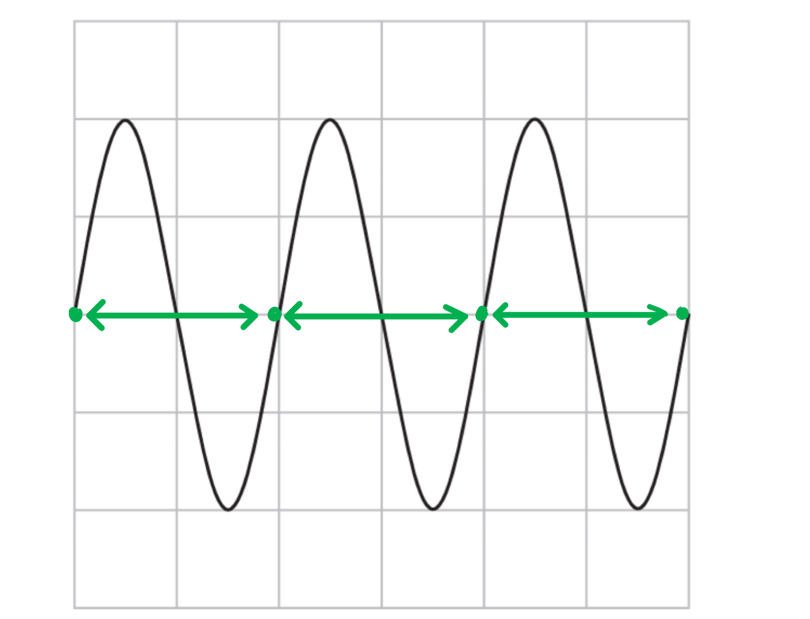

- <u>Three</u> time periods are shown; **[1 mark]**

(ii) To determine the frequency of the sound wave:

Use the graph to find time period:

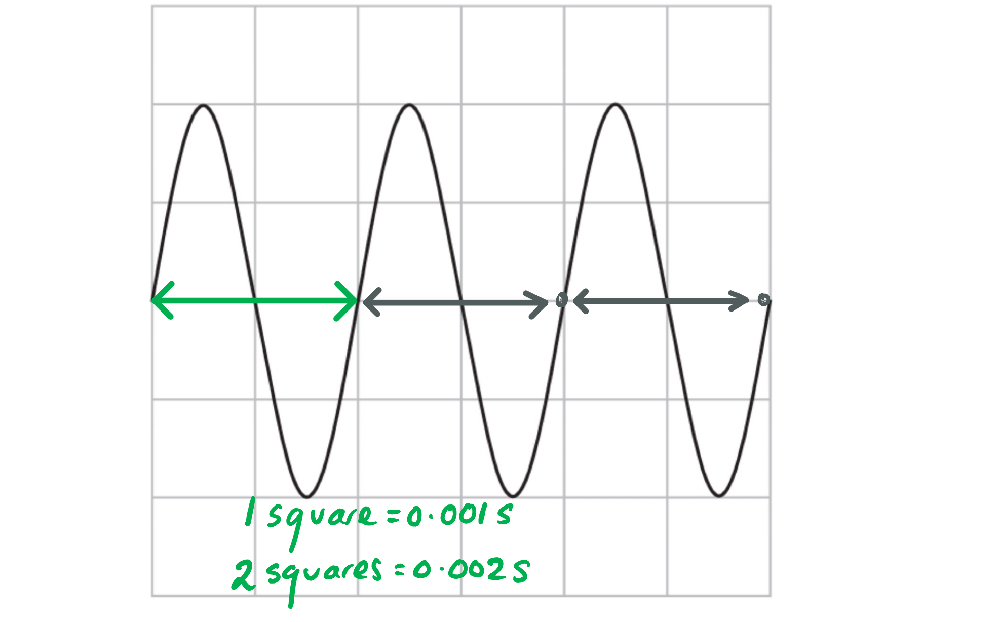

- Time period, *T* = 0.002 s; **[1 mark]**

Use the equation for frequency:

- $f=\frac{1}{T}=\frac{1}{0.002}$
- *f *= 500 Hz; **[1 mark]**

**[Total: 3 marks]**

### 2((b)) — 2 marks
(b)

A correct trace with smaller amplitude and higher frequency looks like:

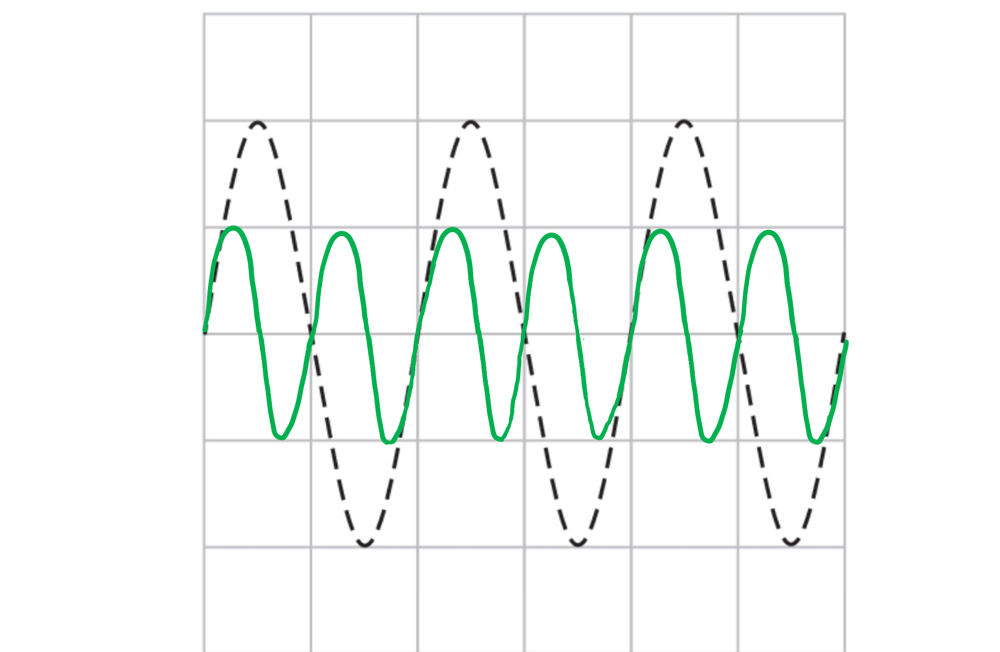

- Wave has shorter distance to peaks and troughs from equilibrium; **[1 mark]**
- More waves fit into the space; **[1 mark]**

**[Total: 2 marks]**

> *Your solution does not need to look exactly like our worked example, as long as it fulfils the criteria;*

- *lower amplitude = less height from rest position*
- *higher frequency = more complete waves fit on the page*

> *The diagram below shows two other ways of getting full marks for this question.*

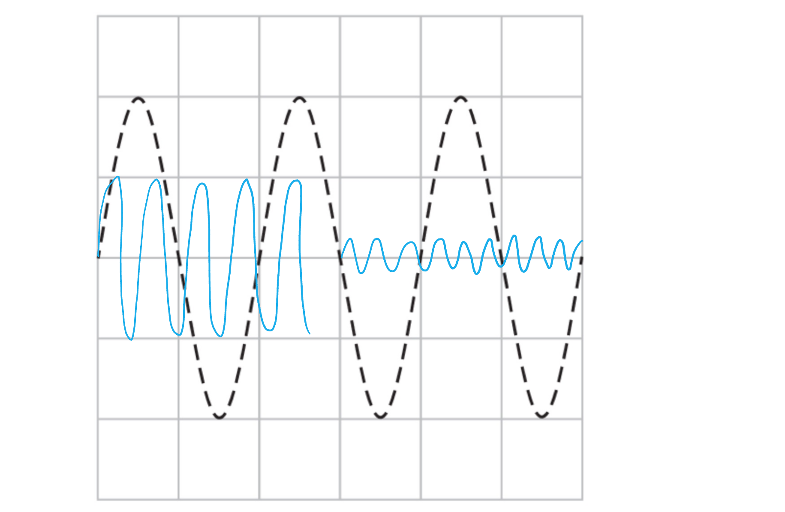

## Q29 — medium — 7 marks · exam-questions

### 6((b)) — 3 marks
(a)

(i) The equation linking wave speed, frequency and wavelength:

- $v=fλ$ **OR **velocity = frequency × wavelength; **[1 mark]**

(ii) The speed of the radio waves:

List the known quantities:

- Frequency, *f *= 820 kHz
- Wavelength, *λ* = 366 m

Convert kHz to Hz:

- f = 820 kHz = 820 000 Hz; **[1 mark]**

Substitute the values into the equation from part (i):

- $v=820000\times366=300120000$

Round to two significant figures:

- *v* = 3.0 × 108 m/s; **[1 mark]**

**[Total: 3 marks]**

### 6((c)) — 1 marks
(b)

The wavelength of radio waves Marconi may have received:

Recall the equation from part (a):

- $v=fλ$

Recall that all e-m waves travel at the same speed:

- Therefore wavelength is inversely proportional to frequency

Explain the consequence of frequency doubling:

- If frequency has doubled, wavelength must halve
- Therefore wavelength = $\frac{1}{2}\times366=183m$; **[1 mark]**

**[Total: 1 mark]**

### 6((d)) — 3 marks
(c)

When a storm cloud discharges:

Any **three **from:

- Electrons move **OR **there is a current **OR **negative charges move; **[1 mark]**
- (Current) discharges to earth **OR **across cloud **OR **to an object (tree, house, lightning conductor); **[1 mark]**
- Air conducts (electricity); **[1 mark]**
- (Followed by) thunder clap **OR **lightning flash; **[1 mark]**

**[Total: 3 marks]**

## Q30 — medium — 16 marks · exam-questions

### 1() — 2 marks
> **[mark-scheme]**
> (i) A longitudinal wave is:
> 
> - A wave where oscillations are parallel to energy transfer **[1 mark]**
> 
> (ii) The relationship between time period and frequency is:
> 
> - Time period is inversely proportional to frequency **[1 mark]**

### 2() — 5 marks
> **[mark-scheme]**
> (i) The formula linking speed, distance and time is:
> 
> - $\mathrm{speed}=\frac{\mathrm{distance}}{\mathrm{time}}$ **OR** $v=\frac{d}{t}$ **[1 mark]**

(ii) Calculate the distance of the object from the bat:

- List the known quantities:

  - Time, $t=2.4s$
  - Speed, $v=340m/s$
- Rearrange the speed equation for total distance travelled by the wave:

$d=v\timest$ **[1 mark]**

- Substitute the known quantities:

$d_{tot}=340\times2.4$ **[1 mark]**

- Calculate the total distance:

$d_{tot}=816m$ **[1 mark]**

- Determine the distance of the object from the bat:

  - The distance of the object from the bat is half the distance travelled by the wave

$d=\frac{816}{2}$

$d=408m$** ****[1 mark]**

> **[exam-tip]**
> Watch out for questions involving distances and reflected waves. Often, the value for time in the question is for the **return** journey but you must give the distance of only one half of that return journey.

### 3() — 9 marks
> **[mark-scheme]**
> (i) A human would:
> 
> - Not hear this sound **[1 mark]**
> 
> Explain your answer:
> 
> - Human hearing range goes up to 20 kHz **OR** 25 kHz is above the limit of human hearing / 20 kHz **[1 mark]**

- List the known quantities:

  - Frequency, $f=25\mathrm{kHz}$
  - Wave speed, $v=340m/s$

(ii) Calculate the time period of this wave:

- Convert frequency to Hz:

$f=25\mathrm{kHz}=25000\mathrm{Hz}$ **[1 mark]**

- Rearrange the formula relating frequency and time period:

$f=\frac{1}{T}$

$T=\frac{1}{f}$ **[1 mark]**

- Substitute the frequency into the formula:

$T=\frac{1}{25000}$

- Evaluate the formula to calculate the time period:

$T=4\times10^{-5}s$** ****[1 mark]**

> **[mark-scheme]**
> (iii) The formula linking speed, frequency and wavelength of a wave is:
> 
> - $\mathrm{speed}=\mathrm{frequency}\times\mathrm{wavelength}$ **OR** $v=f\timesλ$** [1 mark]**

(iv) To calculate the wavelength of the sound wave:

- Substitute the known quantities into the wave speed formula:

$v=f\timesλ$

$340=25000\timesλ$ **[1 mark]**

- Rearrange the formula for wavelength:

$λ=\frac{340}{25000}$** [1 mark]**

- Evaluate the formula to calculate wavelength:

$λ=0.014m$** [1 mark]**

> **[mark-scheme]**
> The final answer can be given as 0.0136 m, or any correctly converted unit, such as 1.4 cm or 14 mm.

## Q31 — hard — 1 marks · exam-questions

### 2() — 1 marks
**Correct answer: A** — absorbed by the bone

**The correct answer is ****A** because:

- Dense structures such as bone absorb x-rays, which are then <u>not</u> transmitted to the detection part of the scanner

## Q32 — hard — 1 marks · exam-questions

### 2() — 1 marks
**Correct answer: B** — reflected

**The correct answer is ****B** because:

- The waves are described as <u>bouncing off</u> the fetus
- This is one way of describing reflection

## Q33 — hard — 1 marks · exam-questions

### 5() — 1 marks
**Correct answer: C** — the same speed in free space

**The correct answer is**** C**** **because:

- All the colours of the spectrum are all formed from different wavelengths of light

  - This eliminates option **D **
- The frequency and wavelength of each colour are related by the wave speed equation

  - *v *= *f*λ
- Hence, when the wavelength increases the frequency decreases

  - Frequency and wavelength are inversely proportional to each other
  - This eliminates option **B **
- From the wave speed equation, it is possible to see that because frequency and wavelength are inversely proportional then the wave speed remains constant
- We also know that the speed of light in a vacuum is constant at 3 × 108 m/s
- Hence, the correct answer is **C **

## Q34 — hard — 1 marks · exam-questions

### 2((a)) — 1 marks
**Correct answer: B** — light

**The correct answer is ****B** because:

- The correct order for the electromagnetic spectrum from highest frequency to lowest is:

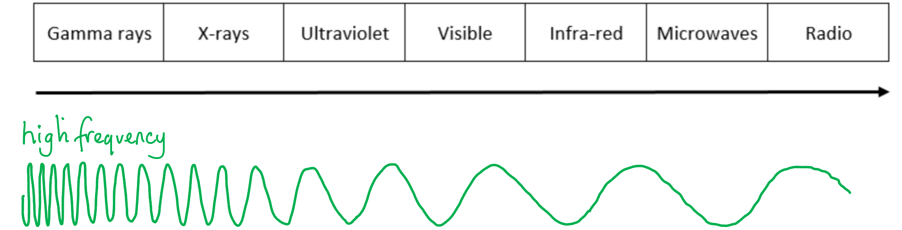

- Options **A** and **C** are eliminated
- Audible sound waves fall in the range 20 - 20 000 Hz
- This is similar to the lowest frequency radio waves

  - Therefore option **D** is eliminated

## Q35 — hard — 6 marks · exam-questions

### 7((a)) — 1 marks
(a)

Direct current:

- Is current which flows in one direction only; **[1 mark]**

**[Total: 1 mark]**

### 7((b)) — 5 marks
(b)

(i) A property of radio waves that makes them suitable for use in communication:

Any **one** from:

- (Radio waves can) travel quickly;**[1 mark]**
- (Radio waves can) code information (in their frequency); **[1 mark]**
- (Radio waves can) pass through the human body <u>without causing any harm</u>; **[1 mark]**
- (Radio waves can) travel long distances / through objects / through walls (thanks to their large wavelength); **[1 mark]**
- (Radio waves can) diffract / reflect (in hilly terrain);**[1 mark]**

(ii) A complete table looks like:

- **One mark **for each correct answer

| **Part of the electromagnetic spectrum** | **Use** | **Possible harmful effect on people ** |
|---|---|---|
| Microwaves | can be used for <u>cooking</u> | <u>heating effect</u> can be dangerous |
| Gamma | Used to <u>sterilise equipment</u> by killing bacteria | Can cause <u>skin cancer</u> through  ionisation of skin particles |

**[Total: 5 marks]**

## Q36 — hard — 9 marks · exam-questions

### 2((a)) — 3 marks
(a)

(i) A diagram with the correct links looks like:

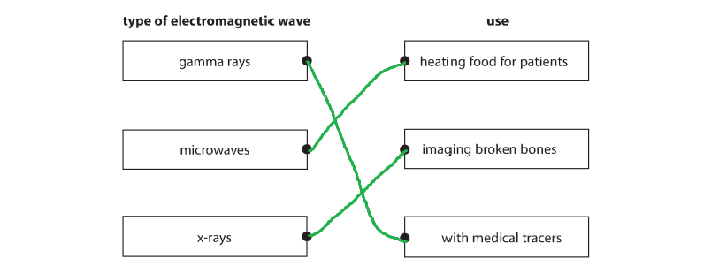

- Three answers correct;** [2 marks]**
- Two answers correct; **[1 mark]**

(ii) To describe how the vibrations of a transverse wave relate to the direction in which the wave travels:

- (The vibrations of a transverse wave take place) <u>perpendicular</u> to the direction in which the wave is travelling; **[1 mark]**

**[Total: 3 marks]**

### 2((b)) — 4 marks
(b)

(i) The technician halves the equation because:

Recall the distance-speed equation:

- Speed is calculated using $speed=\frac{distance}{time}$

Rearrange to make distance the subject:

- $distance=speed\timestime$; **[1 mark]**

Explain why the distance must be halved:

- The total distance travelled is twice the depth, since the ultrasound has reflected and returned
- Therefore $depth=\frac{1}{2}distance\,$; **[1 mark]**

(ii)  How a change in speed affects the wavelength:

Recall the wave equation:

- $velocity=frequency\timeswavelength$

State that frequency is a constant:

- Since frequency is the number of oscillations per second it is caused at the source of the wave and does not change; **[1 mark]**

Evaluate the equation:

- Velocity is directly proportional to wavelength **OR **as speed increases, wavelength increases; **[1 mark]**

**[Total: 4 marks]**

### 2((c)) — 2 marks
(c)

A  wave that is used in cancer treatment:

- Gamma-rays; **[1 mark]**
- They ionise cancerous cells, causing them to die; **[1 mark]**

**[Total: 2 marks]**

## Q37 — hard — 10 marks · exam-questions

### 3((a)) — 4 marks
(a)

(i) The frequency of the ultrasound emitted by the cleaner:

List the known quantities:

- There are 96 million vibrations per second

Recall the definition and units of frequency:

- Frequency is the number of complete oscillations per second and it is measured in Hertz (Hz)

State the answer and correct units:

- Frequency of the ultrasound = 96 000 000 **[1 mark]**
- Units are Hertz/Hz; **[1 mark]**

(ii)  How the cleaner removes plaque:

Describe the vibrations being passed along:

- (The vibrations of the cleaner) make the plaque vibrate/shakes the plaque (off the teeth)/breaks the plaque down; **[1 mark]**

(iii) Water is sprayed on the tip of the cleaner to:

Any **one **from:

- Clean off the debris/plaque; **[1 mark]**
- Cool the tip of the cleaner; **[1 mark]**
- Reduce friction/damage to the tooth; **[1 mark]**

**[Total: 4 marks]**

> *You may have given the value for frequency in a different format.*

> *For example:*

- *96 million = 96 000 000 = 96 × 10**6** Hz*

> *Or using prefixes:*

- *96 million Hz = 96 000 **k**Hz = 96 **M**Hz*

> *It is important to practice using standard form and prefixes, and any correct answer will get the full marks. Just be sure that your value and units match.*

> *Parts (ii) and (iii) of this question are asking you to use your 'scientific common sense' to work out what a likely answer is. Thinking about how vibrations get passed along in waves will hopefully give you the idea of the plaque being shaken off the tooth. Then the water is there to wash away the debris (which otherwise would stay in the mouth or be swallowed). You might also think of the heat generated by all that motion and realise that the water has a cooling effect.*

> *Avoid reaching for ideas which are not connected to the relevant physics.** For example, a toothbrush scrapes off plaque, but that isn't what is happening here. If sound has been mentioned, think vibrations, not friction!*

### 3((b)) — 4 marks
(b)

(i) The equation linking wave speed, frequency and wavelength is:

- $v=fλ$ **OR **velocity = frequency × wavelength; **[1 mark]**

(ii) To calculate the frequency, in MHz, of the ultrasound waves:

List the known quantities:

- Wavelength, *λ* = 0.00044 m
- Speed, *s* = 1540 m/s

Rearrange the equation stated in part (i) to make frequency the subject:

- $f=\frac{v}{λ}$ **[1 mark]**

Substitute the values and calculate:

- $f=\frac{1540}{0.00044}=3.5\times10^{6}\mathrm{Hz}$ **[1 mark]**

State the final answer in MHz:

- Frequency = 3.5 MHz;** [1 mark]**

**[Total: 4 marks]**

### 3((c)) — 2 marks
(c)

Any **two **from:

Differences between ultrasound and ultraviolet waves include:

- Ultrasound is longitudinal **OR **ultraviolet is transverse;** [1 mark]**
- Ultrasound needs a medium **OR **ultraviolet is electromagnetic; **[1 mark]**
- Ultraviolet has a much higher frequency than ultrasound; **[1 mark]**
- Ultraviolet has a much higher speed than ultrasound; **[1 mark]**
- Ultraviolet travels at the speed of light; **[1 mark]**

**[Total: 2 marks]**

> *Here you have to infer some information about ultrasound waves. You are not told they are longitudinal, but you **are** told that they are caused by a vibrating tip. You should also have a rough idea of the frequency of electromagnetic radiation and how this compares with your answer to part (b).*

## Q38 — hard — 8 marks · exam-questions

### 4((a)) — 2 marks
(a)

**An example of a diagram that would score 2 marks:**

** **

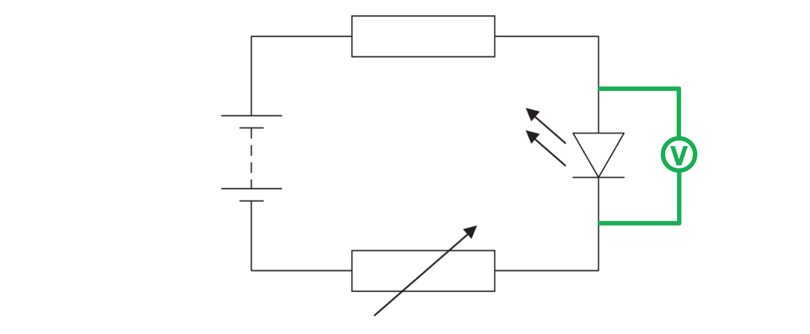

- The voltmeter must be connected in parallel with any circuit component; **[1 mark]**
- The component chosen is the LED; **[1 mark]**

**[Total: 2 marks]**

### 5() — 4 marks
(b)

A graph that would score 4 marks is shown below:

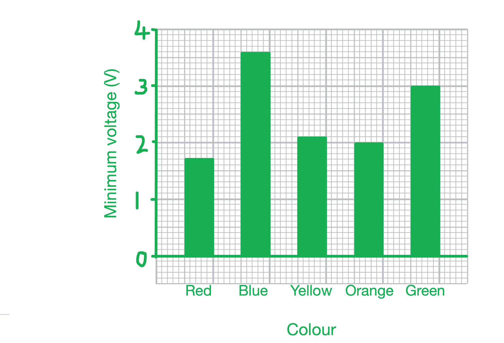

- Both axes are labelled with quantity and unit if required:

  - Minimum voltage with units of V **AND **Colour(s); **[1 mark]**
- A linear scale has been used so that the longest bar occupies at least half of the grid;** [1 mark]**
- At least 3 bars are plotted correctly; **[1 mark]**
- 2 more bars are plotted correctly; **[1 mark]**

**[Total: 4 marks]**

> *While the first mark does not require you to put a certain label on a certain axis, and you could gain a mark for placing colours on the Y axis, one way is more correct than the other. *

*Typically in science, the independent variable (the variable we are changing as the experimenter) is placed on the X axis and the dependent variable (the one being measured) is placed on the Y axis. This is a convention in science and it means more people are more likely to find it easy to interpret your graph.*

### 5() — 2 marks
(c)

- The student is right

Any **two **from:

- The visible spectrum is a sequence consisting of: red, orange, yellow, green, blue, indigo and violet;** [1 mark]**
- (The) wavelength of the visible light directly relates to the colour (red has the longest wavelength); **[1 mark]**
- (The) colour directly relates to voltage (blue has the highest (minimum) voltage); **[1 mark]**

**[Total: 2 marks]**

## Q39 — hard — 14 marks · exam-questions

### 13((a)) — 3 marks
(a)

(i) State the wavelength of the wave shown.

Recall the definition of wavelength:

- One wavelength is the distance from one peak to the next/ between points which are in phase

Use the graph:

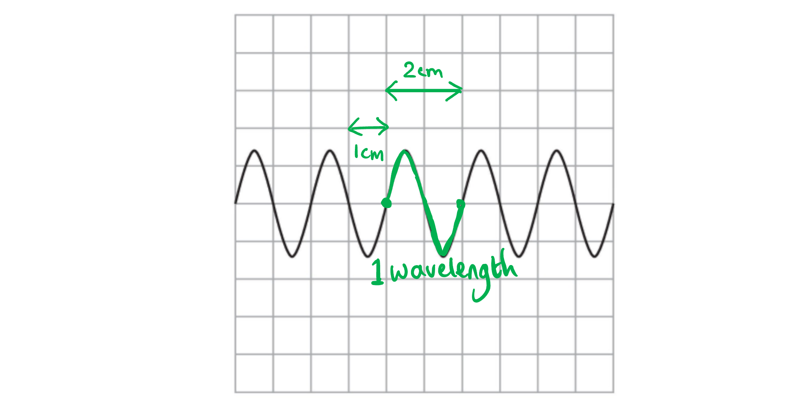

- Wavelength = 2 cm;** [1 mark]**

(ii)  **An example of a graph that would gain 2 marks:**

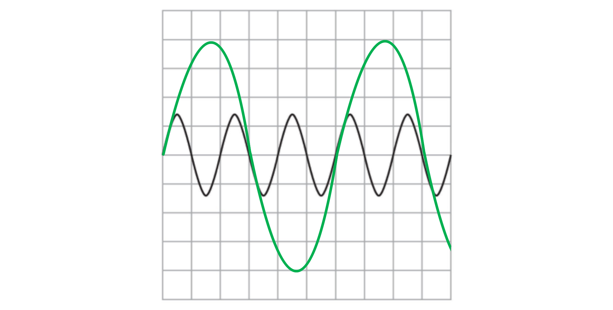

- Amplitude is larger than the original; **[1 mark]**
- Wavelength is longer than the original;** [1 mark]**

**[Total: 3 marks]**

> *With the second part of the question, you may have wondered how to represent a wave moving at 'the same speed'. Since time isn't on the graph, but only amplitude and wavelength measurable, this is something you can safely ignore.*

> *It always pays to carefully check the axes of a graph!*

### 13((b)) — 5 marks
(b)

To obtain an experimental value for the speed of sound:

Any **five **points from:

- Using a method to make a loud sound (which can be heard 100 m away); **[1 mark]**
- Use of the equation for speed, $s=\frac{d}{t}$; **[1 mark]**
- Doing the experiment in still air/where there is no wind/repeating in opposite direction to account for wind speed;**[1 mark]**
- Repeat readings and taking the average/ignore outliers; **[1 mark]**
- Check for zero error on the stopwatch; **[1 mark]**
- Using a clear visual signal to the person starting the stopwatch; **[1 mark]**
- Measure the time between seeing signal and hearing sound; **[1 mark]**
- Take into account reaction time;**[1 mark]**

**An example answer which would score full marks is:**

- Two groups of students stand 100 m apart on a still day; **[1 mark]**
- One student makes a loud sound ... **[1 mark]**
- ...by clapping together two wooden blocks held over their head; **[1 mark]**
- At the other end of the track, another student starts the watch on seeing the blocks bang together and stops it when they hear the sound; **[1 mark]**
- The students perform this until they have five similar results, and then calculate the average time; **[1 mark]**
- Finally they calculate the speed of sound using the equation $s=\frac{d}{t}$, where* s *is the speed in m/s, *d* is the distance (100 m) and* t *is their average time in seconds; **[1 mark]**

**[Total: 5 marks]**

> *Did you notice that the model answer actually includes more than five marking points? It will still only score 5 marks though. No matter how good your answer, you will only get the maximum marks offered!*

> *However, on a long written answer like this one, be as clear and comprehensive as you are able.*

> *It will help you to organise your thoughts if you write in bullet points. Many students think they must write in prose in their science exams, but this is incorrect. Scientists, including your examiner, are very happy to read a bullet-pointed list.*

### 13((c)) — 4 marks
(c)

(i) The equation linking wave speed, frequency and wavelength:

- $v=fλ$ **OR **(wave) speed = frequency × wavelength;** [1 mark]**

(ii) To calculate the wavelength of this radio wave:

List the known quantities:

- Wave speed, *s* = 300 000 000 m/s
- Frequency, *f* = 31 MHz

Convert MHz to Hz:

- *f* = 31 000 000 Hz **OR ***f *= 31 × 106 Hz; **[1 mark]**

Rearrange the equation from part (i) to make wavelength the subject and substitute the values:

- $λ=\frac{v}{f}=\frac{300000000}{31000000}$ **[1 mark]**

Calculate the final answer:

- `lambda equals fraction numerator 300 space up diagonal strike 000 space 000 end strike over denominator 31 space up diagonal strike 000 space 000 end strike end fraction equals 9.68`
- Wavelength, λ = 9.7 m; **[1 mark]**

**[Total: 4 marks]**

> *Before starting any calculation first check that all the values are in normal units. Look for prefixes like M (mega) and change the number immediately - or you may forget later!*

> *Only by doing this at the start will the equations give you the correct answer.*

### 13((d)) — 2 marks
(d)

To state why the waves have different frequencies:

Recall the speeds of sound and radio waves:

- Sound travels at 330 m/s while radio waves travel at 3.0 × 108 m/s

Draw a conclusion:

- Since the two waves travel at different speeds;** [1 mark]**
- They travel the same distance/one wavelength in different times; **[1 mark]**

**[Total: 2 marks]**
