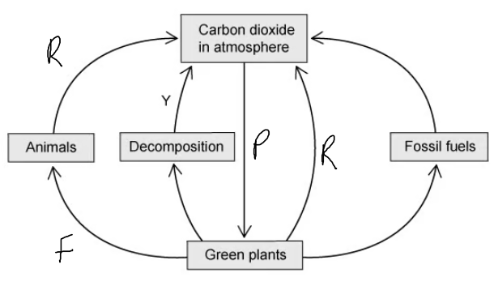
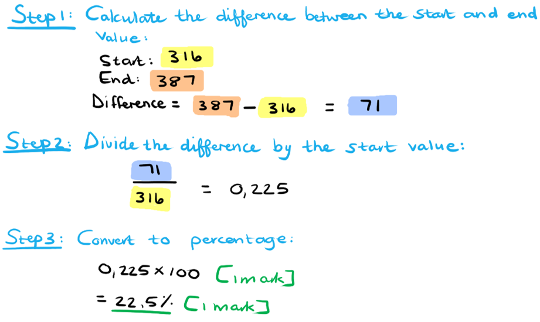
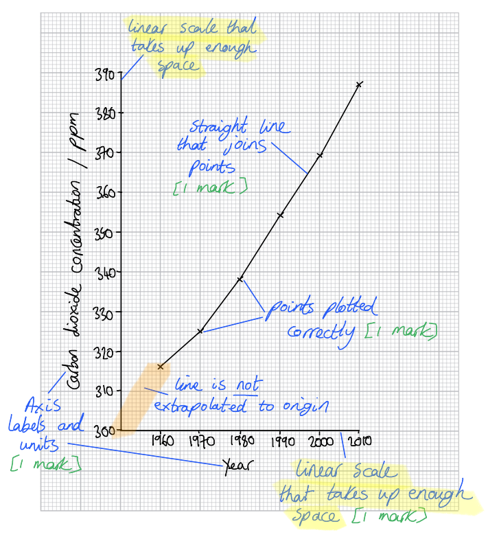
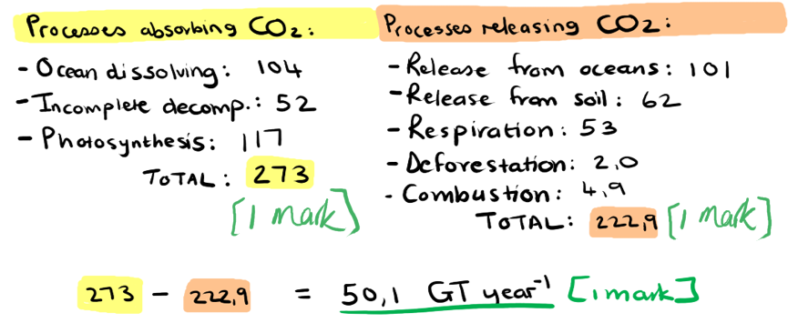

# Mark Schemes — Cycles within Ecosystems
**4. Ecology & the Environment** · Edexcel IGCSE Science (Double Award) (4SD0) — 17/Biology

## Q1 — easy — 7 marks · exam-questions

### 1() — 1 marks
**The correct answer is ****B**** because...**

Photosynthesis converts CO2 from the air into glucose. The carbon atoms are incorporated into plant biomass, for example as cellulose in plants.

**A **is incorrect because decomposition releases carbon from biomass back into the atmosphere as a result of the respiration of decomposers such as bacteria. This also explains why **C** is incorrect.

**D** is a nonsense answer because carbon does not evaporate during the carbon cycle.

**[Total: 1 mark]**

### 2() — 2 marks
Processes **X** and **Y** are...

- X = combustion/burning;** [1 mark]**
- Y = decomposition/decay;** [1 mark]**

*Accept respiration for Y.*

**[Total: 2 marks]**

> *Respiration is an acceptable answer for Y as it is the respiration of decomposers that releases carbon dioxide during decomposition.*

### 3() — 2 marks
Carbon is released during process Y as follows...

Any **two** of the following

- Decomposers/bacteria/fungi release enzymes; **[1 mark]**
- Decomposers/bacteria/fungi break down the molecules in dead tissue; **[1 mark]**
- Carbon is released in the form of carbon dioxide; **[1 mark]**
- Carbon dioxide is the product of respiration (in decomposers); **[1 mark]**

**[Total: 2 marks]**

> *Decomposers such as fungi gain their nutrition by secreting enzymes onto their food. These enzymes break down the molecules in their food which can then be absorbed and used by the decomposers in respiration. Carbon dioxide is a product of respiration and it is released into the atmosphere.*

### 4() — 2 marks
Elements other than carbon that are present in protein molecules are...

Any **two** of the following:

- Hydrogen/H; **[1 mark]**
- Oxygen/O; **[1 mark]**
- Nitrogen/N; **[1 mark]**

**[Total: 2 marks]**

## Q2 — easy — 8 marks · exam-questions

### 1() — 2 marks
Carbon is returned to the atmosphere at Y as follows...

Any **two** of the following:

- (Carbon-containing) molecules in dead tissue/plants are broken down; **[1 mark]**
- (By the action of) decomposers/bacteria/fungi; **[1 mark]**
- Release of carbon dioxide; **[1 mark]**
- During respiration; **[1 mark]**

**[Total: 2 marks]**

### 2() — 3 marks
(i) Respiration can be labelled as follows...

- Anywhere on the arrow between 'animals' and 'carbon dioxide in the atmosphere'; **[1 mark]**
- Anywhere on the arrow between 'plants' and 'carbon dioxide in the atmosphere'; **[1 mark]**

*Accept a label between 'decomposition and 'carbon dioxide in the atmosphere'.*

(ii) Photosynthesis can be labelled as follows...

- Anywhere on the arrow between 'carbon dioxide in the atmosphere' and 'green plants'; **[1 mark]**

(iii) Feeding can be labelled as follows...

- Anywhere on the arrow between 'green plants' and 'animals'; **[1 mark]**

**[Total: 3 marks]**

### 3() — 3 marks
(i) Fossil fuel combustion contributes to rising average global temperatures because...

Any **two** of the following:

- Carbon dioxide is released;** [1 mark]**
- Carbon dioxide is a greenhouse gas; **[1 mark]**
- Greenhouse gases trap heat energy inside the earth's atmosphere; **[1 mark]**

(ii) Deforestation increases the problem of global warming because...

- Less carbon dioxide will be removed if there are fewer trees / if trees are cut down / if trees are carrying out less photosynthesis; **[1 mark]**

**[Total: 3 marks]**

> *This content is not covered until the next topic in the specification, but it is essential that you are able to make the connection between the carbon cycle and the impact of human activities on global warming. The combined impact of burning fossil fuels and cutting down trees is an increase in atmospheric carbon dioxide concentration, which has been linked by scientific research to rising global temperatures.*

## Q3 — medium — 10 marks · exam-questions

### 3((a)) — 1 marks
The cycle is...

- The carbon cycle; **[1 mark]**

**[Total: 1 mark]**

### 3((b)) — 2 marks
(i) **The correct answer is ****A ****because...**

Combustion is the scientific word for burning and the factory is burning fuel.

**B** is incorrect because decomposition occurs in dead organisms and organic waste materials.

**C** is incorrect because feeding allows organisms to pass carbon along a food chain and does not occur in factories.

**D** is incorrect because respiration is how animals and plants return carbon to the atmosphere.

(ii) **The correct answer is ****D ****because...**

Respiration is how animals and plants return carbon to the atmosphere in the form of carbon dioxide.

**A** is incorrect because combustion happens when fossil fuels are burnt causing the release of carbon dioxide.

**B** is incorrect because decomposition occurs in dead organisms and organic waste materials.

**C** is incorrect because feeding allows organisms to pass carbon along a food chain and does not occur in factorie*s. *

**[Total: 2 marks]**

### 3((c)) — 1 marks
A group of organisms responsible for decomposition are...

- Bacteria / fungi; **[1 mark]**

*Accept names of specific examples of bacteria or fungi.*

**[Total: 1 mark]**

### 3((d)) — 6 marks
An investigation to find out if changing the pH of organic material affects the rate of decomposition would be...

Any **six **of the following:

- C = different pH of organic material / add acid / alkali / add buffers; **[1 mark]**
- O = <u>same</u> organic material / plant / age / species / type / mass / volume / state of decay of organic material; **[1 mark]**
- R = repeat (at each different pH); **[1 mark]**
- M1 = measure <u>change</u> / <u>loss</u> in mass of organic material / initial mass – final mass / volume of carbon dioxide released / change in hydrogen-carbonate indicator / change in limewater; **[1 mark]**
- M2 = after stated time period / 1 hour +; **[1 mark]**
- S1 = same temperature / oxygen; **[1 mark]**
- S2 = same water / same mineral ions / same humidity / same volume of each acid /alkali/ buffer / same (number of) bacteria / fungi / decomposer added; **[1 mark]**

**[Total: 6 marks]**

> *Remember that with **CORMS** questions you will not be expected to know anything about the experiment you're presented with. You just have to apply your knowledge of experimental design to a new scenario. *

> *Remember that **CORMS** stands for: **C**hange, **O**rganism, **R**epeat, **M**easure, **S**ame. There are always two marks available for **M**easure and two for **S**ame. *

> *The most difficult mark to get is the **O**rganism because you need to remember to include the word **same** in your answer, e.g. "same species". The point for **O**rganism needs to be **different** to the two points in **S**ame. *

> *Remember to write your answers in full sentences, as stated in the question stem, but you are welcome to make a quick bullet point plan in a blank space somewhere else on your page. Use your plan to tick off and make sure you've hit all the marking points.*

## Q4 — medium — 9 marks · exam-questions

### 1() — 2 marks
The percentage increase in carbon dioxide levels can be calculated as follows...

- (71 ÷ 316) x 100; **[1 mark]**
- 22.5; **[1 mark]**

*Full marks can be awarded for the correct answer in the absence of other calculations.*

**[Total: 2 marks]**

### 2() — 4 marks
Marks can be awarded for a graph drawn as follows...

- Scale is linear **AND** fills at least half of the area provided; **[1 mark]**
- Line is straight **AND** neat **AND** joins the points; **[1 mark]**
- Axes are labelled correctly **AND** relevant units are given; X axis = year and Y axis = carbon dioxide concentration / ppm; **[1 mark]**
- Points are plotted correctly to within 1 small square; **[1 mark]**

*Accept a Y axis scale that starts at 0 or that starts closer to 300 (as shown below).*

**[Total: 4 marks]**

> *Edexcel iGCSE follows the same marking requirements for all questions relating to drawing graphs. There are usually 5 points and 5 marks available, unless one of the criteria is not relevant, e.g. if a key is not required the graph may be worth a maximum of 4 marks. The 5 possible mark points are as follows: *

> *S - Scale **should be **linear**, increasing in **regular increments**. It should take up more than half the grid (and not be squashed into one corner of the graph paper)*

> *L - The line** should **join the points**. It is important that you use a ruler to join your points together. Don't extrapolate (join your line) to the origin (0,0) unless your data includes this point. *

> *A - Axes** should be **labelled correctly** and include **units.** These can usually be taken directly from the table. It is also worth remembering that the Y axis is usually used for the dependent variable which is found on the right hand side of a table and the X axis is used to represent the independent variable which is found in the left column of the table.*

> *P - Points** should be plotted carefully and accurately as you will only be awarded the mark if all points are** within 1 small square** of where they are supposed to be.*

> *K - Keys** are sometimes necessary but** not always**. If there are multiple lines on a line graph or sets of bars on your bar chart then you might like to distinguish the different data sets using a **key or a label on the lines.*

### 3() — 3 marks
Human activities could be contributing to the trend shown in the data in parts (a) and (b) as follows...

Any **three** of the following:

- Combustion/burning of fossil fuels is releasing carbon dioxide into the atmosphere; **[1 mark]**
- Deforestation / loss of plant cover is reducing the carbon dioxide removed from the atmosphere by photosynthesis; **[1 mark]**
- Increased burning of trees/plant matter releases carbon dioxide into the atmosphere; **[1 mark]**
- Increased food waste / dead plant matter releases carbon dioxide into the atmosphere due to decomposition/decay; **[1 mark]**
- Increasing populations of humans/livestock increases the release of carbon dioxide by respiration; **[1 mark]**

*Accept peat instead of fossil fuels for marking point 1.*

*Accept references to draining of peat bogs and release of carbon dioxide for 1 mark.*

*Accept references to release of dissolved carbon dioxide from the oceans due to rising sea temperatures for 1 mark.*

**[Total: 3 marks]**

> *This question is slightly tricky because it requires you to come up with 3 separate marking points. You are likely to be well aware of issues around the burning of fossil fuels and deforestation, but coming up with a third point may present more of a challenge. You need to think about the carbon cycle diagram that you know and consider which other stage might have caused an increase in the release of carbon dioxide into the atmosphere since 1960. Here the suggested answers relate to carbon stored in plant matter being released by burning, to a possible increase in global rates of decay, and to possible global increases in rates of animal respiration.*

> *Note that the points in italics are all correct, but these are ideas that you would not be expected to come up with unless you had knowledge beyond the specification.*

## Q5 — hard — 11 marks · exam-questions

### 1() — 5 marks
(i) The difference between the amount of carbon entering the atmosphere and the amount of carbon leaving the atmosphere can be calculated as follows...

- Carbon leaving the atmosphere = 273 (GT yr-1); **[1 mark]**
- Carbon entering the atmosphere = 222.9 (GT yr-1); **[1 mark]**
- (273 - 222.9 =) 50.1 (GT yr-1); **[1 mark]**

*Full marks can be awarded for the correct answer in the absence of other calculations.*

> *Here you need to apply your knowledge of the carbon cycle to the data provided to allow you to calculate the total carbon absorbed and released. Sometimes it will be obvious whether a process releases or absorbs carbon, e.g. 'release from the oceans' refers to carbon being released into the atmosphere, while sometimes you will require background knowledge, e.g. 'respiration'.*

(ii) The net flux of carbon is important at a global level because...

Any **two** of the following:

- Increased carbon dioxide in the atmosphere increases the greenhouse effect / increases absorption of heat energy in the atmosphere; **[1 mark]**
- An overall increase in atmospheric carbon increases global warming; **[1 mark]**
- (To reduce global warming) carbon needs to be removed from the atmosphere faster than it enters the atmosphere; **[1 mark]**

> *This question draws on your knowledge of the impact of carbon dioxide on the environment. If carbon enters the atmosphere faster than it is absorbed then atmospheric carbon will increase, enhancing the greenhouse effect and leading to global warming.*

**[Total: 5 marks]**

### 2() — 2 marks
The combustion of fossil fuels has a large impact on the carbon balance in the atmosphere because...

Any **two** of the following:

- The combustion of fossil fuels releases carbon dioxide into the atmosphere; **[1 mark]**
- This carbon was removed from the atmosphere by photosynthesis a very long time ago / over a long time period;** [1 mark]**
- The methods by which carbon is removed from the atmosphere are much slower / cannot compensate; **[1 mark]**

**[Total: 2 marks]**

> *Fossil fuel reserves have developed over millions of years, and have been sitting under the ground for millions more, so burning them releases carbon that was converted into plant tissue over many years in a very short space of time. This disrupts the carbon cycle, releasing carbon into the atmosphere significantly faster than it can be removed.*

### 3() — 4 marks
(i) It is difficult to make accurate measurements when studying carbon fluxes because...

Any **two** of the following:

- Carbon can be transferred in both directions at the same time / can be released by respiration and taken in by photosynthesis at the same time; **[1 mark]**
- The rate of carbon transfer is affected by changes in the environment / example of carbon transfer affected by the environment, e.g. the rate of photosynthesis is affected by light intensity / some processes may be taking place at a faster/slower rate than scientists expect; **[1 mark]**
- Some deforestation / burning of fossil fuels / other named human activity that releases carbon may be illegal/unmonitored/not measured; **[1 mark]**
- Equipment may only be able to measure carbon fluxes at a local level / in one place which may not be representative of global fluxes; **[1 mark]**
- Natural disasters/large events (e.g. volcanic eruptions) may have a sudden impact on global carbon transfer **OR** it may take time to work out the impact of natural disasters/large events; **[1 mark]**

> *This question requires you to use your** reasoning skills** to consider why it might be difficult to measure something like global carbon fluxes. There are several marking points to choose from here, none of which require any prior knowledge of the methods involved in measuring carbon transfer.*

(ii) It is important to estimate carbon fluxes because....

Any **two** of the following:

- It enables scientists to calculate/estimate atmospheric carbon increases / the rate at which atmospheric carbon is increasing; **[1 mark]**
- It allows for the prediction of global warming / climate change effects in the future; **[1 mark]**
- It provides data to back up the science around global warming / to persuade people to change/decrease their use of fossil fuels; **[1 mark]**
- It shows whether measures taken to reduce global warming/climate change are working **OR** it allows scientists to demonstrate the impact of human activities on global carbon dioxide levels; **[1 mark]**

> *It is important for scientists to have an indication of carbon fluxes that add and remove carbon from the atmosphere in order to make future predictions about global warming and the effects this may have on the global climate. Climate change will affect ecosystems in different ways and predictions made by scientists can be useful to make changes to our carbon footprint today in order to limit the negative impact in the future.*

**[Total: 4 marks]**
