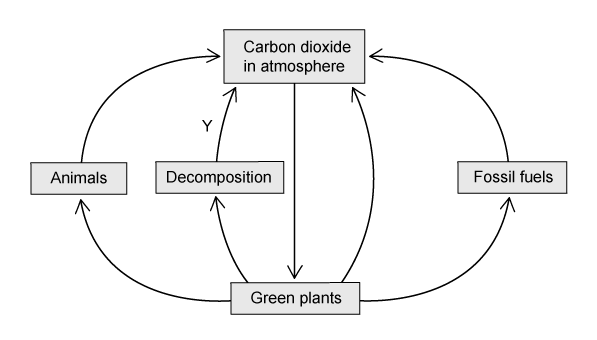
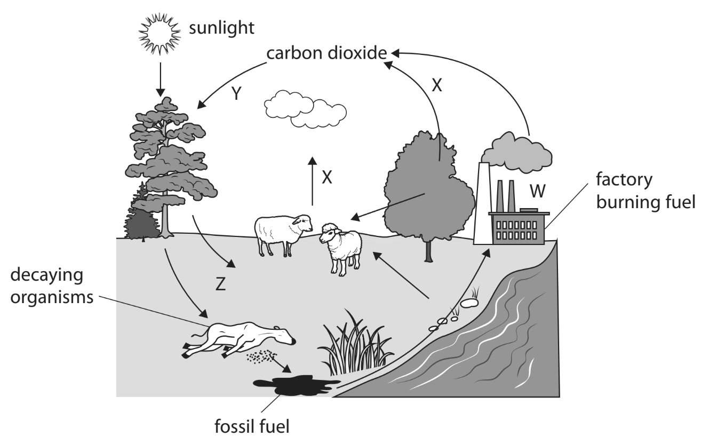

# Exam Questions — Cycles within Ecosystems
**4. Ecology & the Environment** · Edexcel IGCSE Science (Double Award) (4SD0) — 17/Biology
> Source: [https://www.savemyexams.com/igcse/science/edexcel/double-award/17/biology/topic-questions/ecology-and-the-environment/cycles-within-ecosystems/exam-questions/](https://www.savemyexams.com/igcse/science/edexcel/double-award/17/biology/topic-questions/ecology-and-the-environment/cycles-within-ecosystems/exam-questions/) · 5 questions · total 45 marks

## Q1 — easy — 7 marks · exam-questions

### 1() — 1 mark — command: which — structured
Which of **A - D** is the carbon cycle process by which carbon enters the tissues of living organisms from the atmosphere?

| ☐ | **A** | Decomposition |
|---|---|---|
| ☐ | **B** | Photosynthesis |
| ☐ | **C** | Aerobic respiration |
| ☐ | **D** | Evaporation |

### 2() — 2 marks — command: name — structured
Part of the carbon cycle is shown in the diagram below.

Name processes **X** and **Y** in the diagram.

### 3() — 2 marks — command: describe — structured
Describe how carbon is released during process **Y** in part (b).

### 4() — 2 marks — command: name — structured
Carbon is an element that is present in biological molecules such as proteins.

Name two other elements that are present in all protein molecules.

## Q2 — easy — 8 marks · exam-questions

### 1() — 2 marks — command: explain — structured
The diagram below shows a representation of the carbon cycle.

Explain how carbon is returned to the atmosphere at the stage labelled **Y**.

### 2() — 3 marks — command: label — structured
The diagram in part (a) is missing many details of the carbon cycle.

Label the diagram as follows to show where each of the processes occurs within the carbon cycle.

(i) Use a letter **R** to show where respiration occurs.

**(1)**

(ii) Use a letter **P** to show where photosynthesis occurs.

**(1)**

(iii) Use a letter **F** to show where feeding occurs.

**(1)**

### 3() — 3 marks — command: explain — structured
Carbon from fossil fuels enters the atmosphere during combustion.

(i) Explain how this process contributes to rising average global temperatures.

**(2)**

(ii) Explain how cutting down trees during deforestation increases the problem described in part (i).

**(1)**

## Q3 — medium — 10 marks · exam-questions

### 3((a)) — 1 mark — command: give — structured — from paper Jan 2022 · 4BI1/1B
The diagram shows a cycle found in ecosystems.

Give the name of the cycle.

### 3((b)) — 2 marks — command: which — structured — from paper Jan 2022 · 4BI1/1B
(i) In the image in part (a), which process is represented by the letter W?

**(1)**

| ☐ | **A** | Combustion |
|---|---|---|
| ☐ | **B** | Decomposition |
| ☐ | **C** | Feeding |
| ☐ | **D** | Respiration |

(ii) In the image in part (a), which process is represented by the letter X?

**(1)**

| ☐ | **A** | Combustion |
|---|---|---|
| ☐ | **B** | Decomposition |
| ☐ | **C** | Feeding |
| ☐ | **D** | Respiration |

### 3((c)) — 1 mark — command: name — structured — from paper Jan 2022 · 4BI1/1B
Name a group of organisms that is responsible for decomposition.

### 3((d)) — 6 marks — command: design — structured — from paper Jan 2022 · 4BI1/1B
Carbon dioxide is released into the atmosphere by the decomposition of organic material.

The rate of this decomposition depends on a number of factors.

Design an investigation to find out if changing the pH of organic material affects the rate of decomposition.

Include experimental details in your answer and write in full sentences.

## Q4 — medium — 9 marks · exam-questions

### 1() — 2 marks — command: calculate — structured
The following table shows changes in atmospheric carbon dioxide levels over time.

| **Year** | **Carbon dioxide concentration / ppm** |
|---|---|
| 1960 | 316 |
| 1970 | 325 |
| 1980 | 338 |
| 1990 | 354 |
| 2000 | 369 |
| 2010 | 387 |

Calculate the percentage increase in carbon dioxide concentration between 1960 and 2010. Give your answer to one decimal place.

### 2() — 4 marks — command: plot — structured
Use the data provided in part (a) to plot a graph that shows the change in atmospheric carbon dioxide levels over time.

Use a ruler to join the points with straight lines.

### 3() — 3 marks — command: suggest — structured
Use your understanding of the carbon cycle to suggest how human activities are contributing to the trend shown in the data in parts (a) and (b).

## Q5 — hard — 11 marks · exam-questions

### 1() — 5 marks — command: multiple — structured
'Carbon flux' is a term used to describe the transfer of carbon from one store to another in the carbon cycle.

The following data show fluxes in carbon between different storage reserves in an ecosystem, measured in gigatonnes per year (GT yr-1). A gigatonne equals 1 billion tonnes.

| **Process of carbon transfer** | **Flux / GT yr****-1** |
|---|---|
| Release from the oceans | 101 |
| Dissolving in the ocean | 104 |
| Release from soil | 62 |
| Fossil fuel formation during incomplete decomposition | 52 |
| Respiration of terrestrial organisms | 53 |
| Photosynthesis | 117 |
| Deforestation and burning of plant matter | 2.0 |
| Combustion of fossil fuels | 4.9 |

(i) Calculate the difference between the amount of carbon entering the atmosphere and the amount of carbon leaving the atmosphere over the course of a year in this ecosystem.

**(3)**

(ii) The figure calculated in part (i) is known as the 'net flux' of carbon in the ecosystem; this refers to the overall direction of carbon transfer.

Explain why the net flux of carbon is important at a global level.

**(2)**

### 2() — 2 marks — command: explain — structured
Explain why the combustion of fossil fuels can have a large impact on the carbon balance in the atmosphere.

### 3() — 4 marks — command: suggest — structured
Estimating global carbon fluxes is of great interest to scientists, even though it may be challenging to make accurate measurements.

(i) Suggest why it is difficult to make accurate measurements when studying the transfer of carbon.

**(2)**

(ii) Suggest why estimating carbon fluxes is of such interest to scientists.

**(2)**
