# Mark Schemes — Feeding Relationships
**4. Ecology & the Environment** · Edexcel IGCSE Science (Double Award) (4SD0) — 17/Biology

## Q1 — easy — 8 marks · exam-questions

### 2((a)) — 1 marks
The primary consumer in this food chain is...

- Small fish;** [1 mark]**

**[Total: 1 mark]**

### 2((b)) — 5 marks
(i) The process can be described as follows...

Any **three** from the following:

- (The process is) photosynthesis; **[1 mark]**
- Light (energy) is absorbed/trapped; **[1 mark]**
- (By the) chloroplasts/chlorophyll; **[1 mark]**
- (Light energy is converted to) starch/glucose/carbohydrate; **[1 mark]**

(ii) Some energy is not converted to chemical energy because...

- (Energy is lost in) respiration/from heat loss (by the plant); **[1 mark]**
- (The small fish) cannot digest some parts / some material is egested / some parts are not absorbed (during digestion); **[1 mark]**
- (Some microscopic plants are) not eaten / die (before being eaten) / decomposed; **[1 mark]**
- (Energy is lost through) excretion;** [1 mark]**

**[Total: 5 marks]**

> *Make sure you are clear about which organism you are referring to as it is important to correctly identify which organism is responsible for the energy loss. For example, the plant is losing energy through respiration, it would not be correct to refer to respiratory losses of the fish because this shows a transfer of energy from the microscopic plant.*

> *Similarly, the mark points 2 and 3 must refer to the fish as they are about the consumption and digestion process.*

### 2((c)) — 2 marks
Crushing the fish in the gizzard helps digestion because...

- (Crushing will) increase surface area;** [1 mark]**
- (For) enzymes; **[1 mark]**

**[Total: 2 marks]**

> *Enzyme action relies on enzyme-substrate (E-S) complex formation. A larger surface area increases the likelihood of collisions leading to E-S complexes forming and therefore increasing the rate at which the enzymes can digest the food substances.*

## Q2 — easy — 11 marks · exam-questions

### 9((a)) — 6 marks
(i) The producers in the food web are...

- Algae; **[1 mark]**
- Bladder wrack; **[1 mark]**

*Take a mark away for every ****extra**** incorrect answer, e.g.*

- *Algae, bladder wrack, and sea urchins will gain 1 mark (one incorrect extra answer). *
- *Algae, bladder wrack, sea urchins, and limpets will gain 0 marks (two incorrect extra answers).*
- *Algae and sea urchins will gain 1 mark (the incorrect answer is not an ****extra ****answer in this case).*

(ii) Two secondary consumers in this food web are...

Any **two** of the following:

- (Common) seal;** [1 mark]**
- Crab; **[1 mark]**
- Lobster; **[1 mark]**
- (Herring) gull; **[1 mark]**

*Take a mark away for every ****extra**** incorrect answer as above.*

(iii) A food chain from this food web that contains four organisms and includes the herring gull is...

- Bladder wrack **AND** winkle **AND** crab **AND** gull; **[1 mark]**
- An arrow between each organism pointing from left to right ($\rightarrow$); **[1 mark]**

*The organisms must be in the sequence given for marking point 1.*

**[Total: 6 marks]**

> *Remember the arrows in a food chain (or web) show the direction of energy flow, rather than what is eating what. The arrows always point to the right. *

### 9((b)) — 5 marks
(i) A pyramid of energy for this food chain is...

- Organisms in the correct order;** [1 mark]**
- The shape is correct; **[1 mark]**

(ii) The amount of energy available to the organisms changes along this food chain because...

Any **three** of the following:

- Energy is lost (between each stage/level);** [1 mark]**
- In the form of heat / due to respiration / due to movement; **[1 mark]**
- (Energy is lost to the environment) in urine / during excretion; **[1 mark]**
- (Energy is lost to the environment) as some parts of organisms (e.g. fur and teeth) are not eaten/digested / are egested / lost in faeces;** [1 mark]**
- (Energy is lost to the environment when organisms) decompose / die; **[1 mark]**

**[Total: 5 marks]**

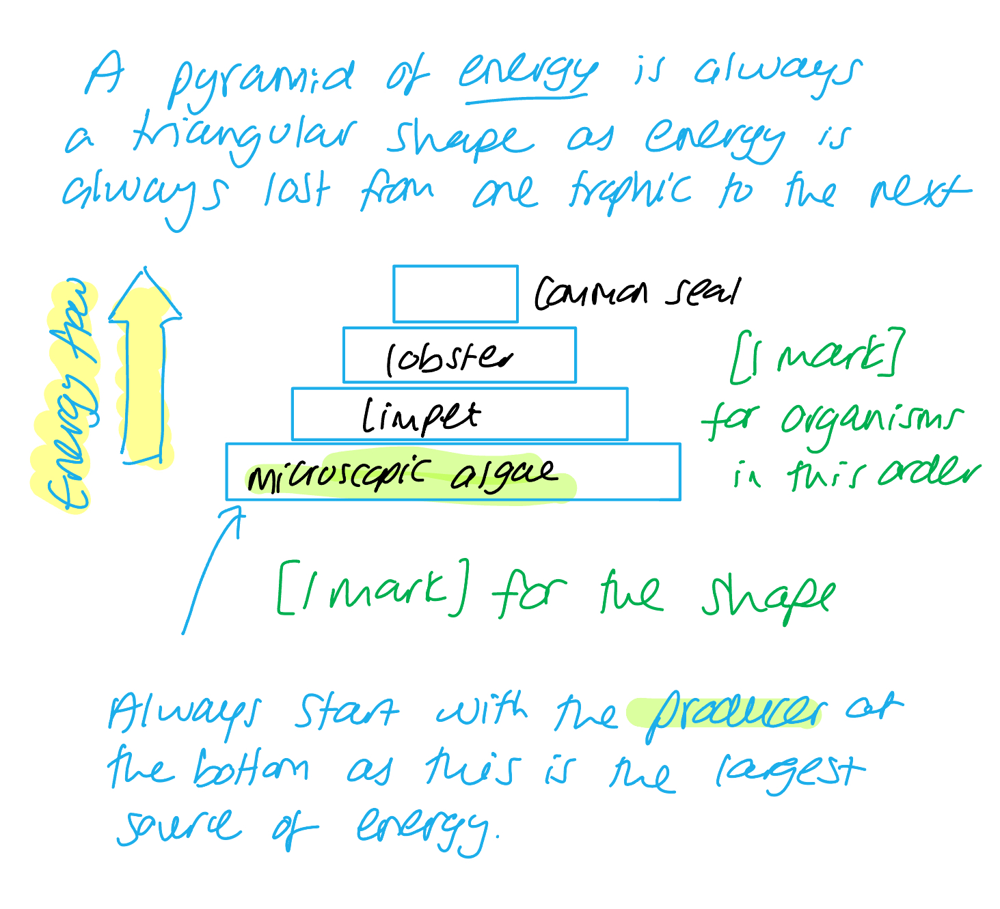

## Q3 — easy — 8 marks · exam-questions

### 1() — 2 marks
(i)**The correct answer is ****A**** because...**

All of the secondary consumers in the food web consume shrimps, and the shrimps consume plankton, which are tiny organisms that can be photosynthetic (so are producers). So it is correct to say that the secondary consumers are carnivores that consume herbivores.

**B** describes the primary consumers.

**C** and **D **could refer to secondary consumers in some food webs, but not this one. There are no omnivores included in this food web, and the seal is the apex predator.

(ii) ** The correct answer is ****C ****because...**

A pyramid of **biomass** is always wider at the base and gets narrower towards the top. This is because of energy losses at each trophic level which result in a smaller biomass.

> *All other options are incorrect shapes for a pyramid of biomass.*

**[Total: 2 marks]**

### 2() — 2 marks
A food chain rarely has more than five trophic levels because...

Any **two **of the following:

- Energy is lost at each trophic level **OR** only a small amount/10% of the energy from each trophic level is passed on; **[1 mark]**
- Energy is lost to the environment due to, e.g. movement / heat / incomplete digestion / excretion of waste; **[1 mark]**
- There is not enough energy to support more than five trophic levels; **[1 mark]**

**[Total: 2 marks]**

### 3() — 2 marks
The biomass that is gained by the penguin in this food chain is calculated as follows...

- 800 kg (passed on to the shrimp); **[1 mark]**
- 56 kg (passed on to the penguin); **[1 mark]**

**[Total: 2 marks]**

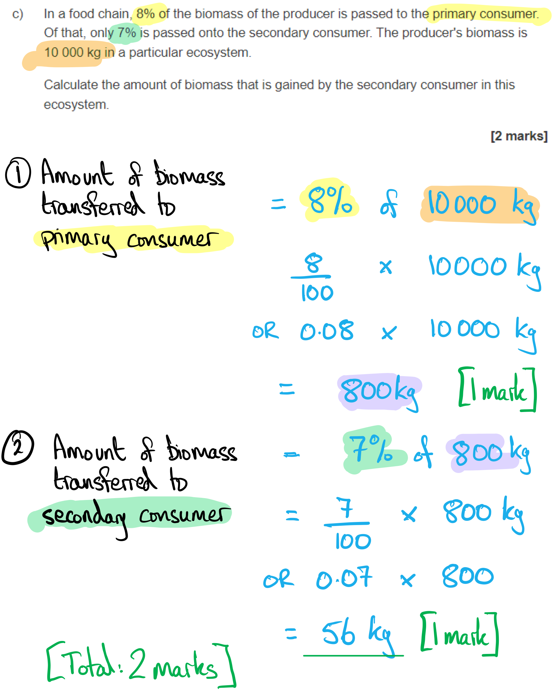

### 4() — 2 marks
A decrease in the penguin population would have the following effects...

- Seal numbers would decrease **BECAUSE** they would have less food / fewer penguins to eat; **[1 mark]**
- Shrimp numbers would increase **BECAUSE** they have fewer predators / fewer penguins to be eaten by; **[1 mark]**

**[Total: 2 marks]**

> *Note that this is an **explain** question, so you will not gain full marks for just describing the effects; you need to **explain why** these effects would occur.*

## Q4 — medium — 9 marks · exam-questions

### 1((a)) — 5 marks
(i) **The correct answer is ****A****.**

Secondary consumers are the organisms in a food chain that consume primary consumers, which themselves consume producers. The monitor lizard and the fennec fox are both secondary consumers in the food web shown, and there are no other secondary consumers present.

(ii) The longest food chain is...

- Acacia/plant → (desert) rat → (fennec) fox → (monitor) lizard → hawk; **[1 mark]**

(iii) Most of the energy in the producers is not transferred to the hawk because...

Any **three **of the following:

- (Energy is lost due to) some parts of organisms are not digestible / are indigestible **OR** (the energy stored in indigestible material is lost in) faeces / not absorbed; **[1 mark]**
- (Energy is lost due to) excretion / metabolic waste / urine; **[1 mark]**
- (Energy is lost due to) parts of organisms that are not consumed / are lost to death/decay (e.g. predators may not eat the bones or fur of their prey, so these remains decompose); **[1 mark]**
- (Energy is released to the environment due to) respiration / heat loss / active transport / metabolism; **[1 mark]**
- (Energy is lost due to) movement; **[1 mark]**

**[Total: 5 marks]**

> *Remember that faeces are not removed from the body by excretion (the removal of metabolic waste), but by egestion (the removal of solid waste from incomplete digestion). This means that the marking points about energy lost in faeces and those lost in excretion are separate. *

### 1((b)) — 4 marks
The body shape of the fennec fox has evolved by natural selection by...

Any **four **of the following:

- A mutation (occurs) / genetic variation (exists in a population); **[1 mark]**
- (The fox's ears have) a large surface area to lose heat / keep the body cool; **[1 mark]**
- (The ability to lose heat) enables survival; **[1 mark]**
- Breeding occurs / the fox reproduces / has offspring; **[1 mark]**
- (The breeding fox) passes on alleles / genes (for ear shape to the next generation);** [1 mark]**

**[Total: 4 marks]**

> *Questions like this about natural selection come up often in exams, usually requiring you to write about different examples of natural selection in action. Pay attention to key words here; words such as mutation, variation, reproduction, and alleles are always good when describing natural selection in any context.*

## Q5 — medium — 13 marks · exam-questions

### 4((a)) — 2 marks
A food web showing these feeding relationships is as follows...

- Arrows pointing from the consumed organism to the consumer (e.g. from primary consumer → secondary consumer); **[1 mark]**
- Food web includes all four organisms (in correct places);** [1 mark]**

***Allow ****1 mark if only one food chain is drawn and the arrows are pointing in the correct direction, e.g. plants → caterpillars → mice → owls.*

***Reject**** both marks if more than one web is drawn and one is incorrect.*

**[Total: 2 marks]**

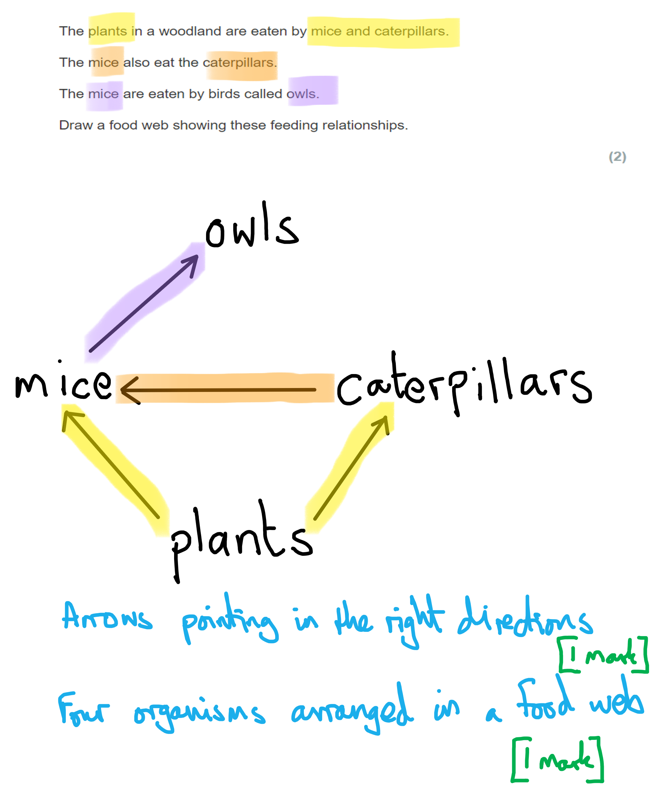

### 4((b)) — 1 marks
The term that describes the trophic level of a caterpillar is...

- <u>Primary</u> consumer / <u>1°</u> consumer; **[1 mark]**

**[Total: 1 mark]**

### 4((c)) — 10 marks
(i) The number of mice in the total area of woodland in year 3 is calculated as follows...

- x 5 **OR** 3 000 (mice per km2); **[1 mark]**
- 15 000 **OR** 1.5 × 104;** [1 mark]**

*Award full marks for the correct numerical answer of 15 000 or 1.5 x 10**4 **without working.*

***Allow**** incorrectly-written standard form if expressed as 15 × 10**3**.*

(ii) There were more mice in year 4 than in the other years because...

Any **three **of the following:

- There were more food/plants/caterpillars / were other sources of food available to the mice;** [1 mark]**
- Warmer weather; **[1 mark]**
- There were fewer other predators / owls that ate other species; **[1 mark]**
- Less disease/infection among the mice population; **[1 mark]**
- Higher birth rate than death rate (of mice); **[1 mark]**

***Ignore**** 'fewer owls' because the table shows that there were more owls in year 4.*

(iii) The number of owls was fairly constant each year because...

Any **two** of the following:

- The owls feed on other prey;** [1 mark]**
- There is insufficient food/energy to maintain a higher number of / more owls; **[1 mark]**
- Owls are the top predator / have no predators (of their own); **[1 mark]**
- The owls' birth rate = death rate / birth rate and death rate are similar;** [1 mark]**
- Owls produce few offspring (so population will not increase rapidly); **[1 mark]**

(iv) A method to estimate the number of mice in the woodland is...

Any** three** of the following:

- Use a trap / filming/a camera trap / a sample area / a quadrat; **[1 mark]**
- Random sampling within the sample area; **[1 mark]**
- Repeat readings / collect multiple samples; **[1 mark]**
- Count the number of mice / (mouse) faeces (in quadrat); **[1 mark]**
- Calculate average/mean; **[1 mark]**
- Multiply up to total area; **[1 mark]**

**[Total: 10 marks]**

> *(i) The biggest hazard in the question is converting from standard form to regular number notation; make sure you're aware that 10**3** is 1 followed by 3 zeros, or (10 × 10 × 10), i.e. 1 000. You can always leave your answer in standard form though (1.5 × 10**4**), because the question does not specify the number format to use in your answer. *

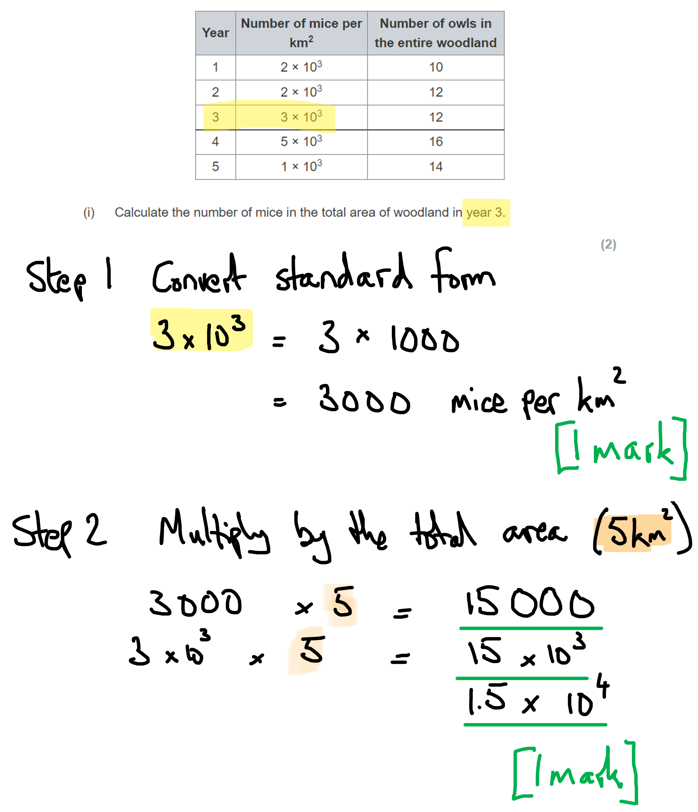

> *(ii) When writing about the reproduction rate this must be linked to the death rate to give a meaningful explanation of population changes (i.e. an increased birth rate will have no effect if the death rate also increases); make sure to relate births and deaths together. *

> *(iv) This question is about sampling and the techniques necessary to sample correctly; it would be impossible/impractical to count the entire mouse population, hence the need for sampling techniques such as quadrats or humane trapping.*

## Q6 — medium — 10 marks · exam-questions

### 6((a)) — 1 marks
**Final answer:** ** The correct answer is ****C ****because...**

A community refers to all the populations of different species living in an area.

**A** is incorrect as a community does not include the non-living environment.

**B** is incorrect as the area where organisms live is known as their habitat.

**D** is incorrect as it does not only refer to organisms of one species, but all species in an area.

**[Total: 1 mark]**

### 6((b)) — 5 marks
(i) The mean mass of a single primary consumer can be calculated as follows...

- 2.5 ÷ 15 000 **OR** 2.5 ÷ (1.5 x 104); **[1 mark]**
- 0.00017; **[1 mark]**
- 1.7 x 10-4; **[1 mark]**

*Award full marks for the correct answer of 1.7 x 10**-4** in the absence of any calculations.*

***Accept ****1.66 recurring x 10**-4** ****OR**** 1.67 x 10**-4** ****OR**** 1.7 x 10**-4*

***Accept**** a final answer of 17 x 10**-5**.*

(ii) The mark allocation for the pyramid of biomass would be...

- The correct order/names of trophic levels;** [1 mark]**
- The correct pyramid shape; **[1 mark]**

**[Total: 5 marks]**

The calculation for (b) (i):

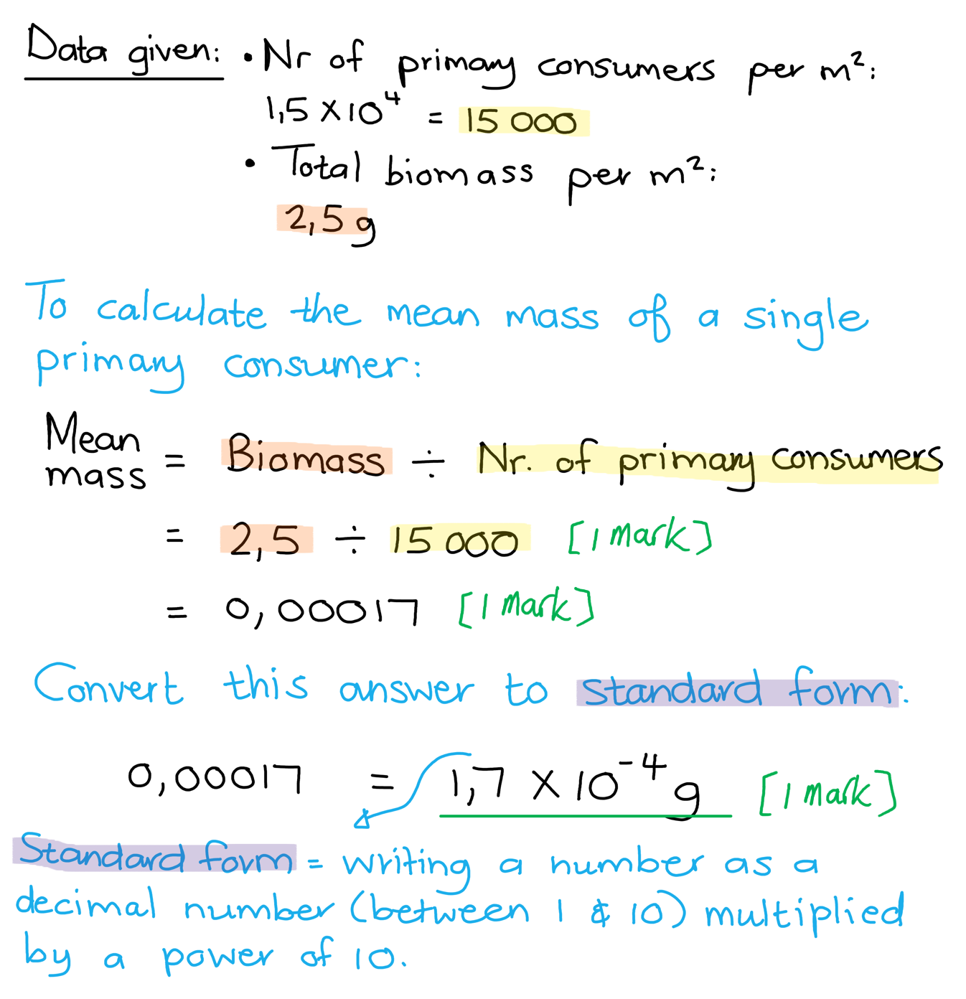

The pyramid of biomass for (b)(ii):

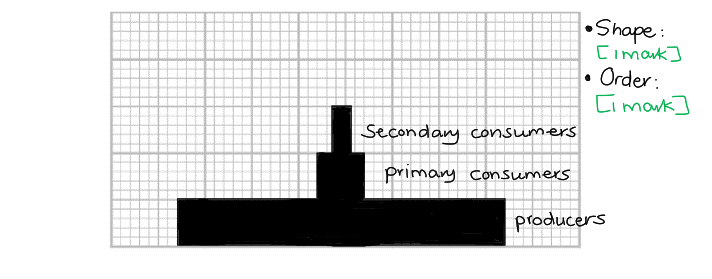

> *Remember that producers will always form the base of any biological pyramid, followed by the primary, secondary, tertiary and quaternary consumers. You are provided with a grid which means that you will have to draw the width of the bars for each trophic level according to scale.*

### 6((c)) — 4 marks
(i) Egestion is one reason why energy transfer in a food chain is not 100 % efficient because...

- (Some food is) undigested / not absorbed / forms waste/faeces / are not assimilated (into cells/tissues); **[1 mark]**
- (These food that is egested in faeces) contains energy / cellulose;** [1 mark]**

*It is possible to award*** [2 marks] ***for reference to cellulose not being digested ****OR**** that energy is trapped in faeces, as these statements combine marking points 1 and 2.*

(ii) Other reasons why energy transfer is not 100 % efficient include...

Any** two** of the following:

- (Energy is lost through) respiration / heat loss; **[1 mark]**
- (Energy is used for) movement; **[1 mark]**
- (Some parts of an organism remains) uneaten / are not consumed **OR** (parts of) dead organisms are broken down by decomposers; **[1 mark]**
- (Energy is lost through) excretion (of the waste products of metabolism); **[1 mark]**

**[Total: 4 marks]**

## Q7 — hard — 5 marks · exam-questions

### 6((a)) — 3 marks
(i) The efficiency of the transfer of biomass from producers to primary consumers in the coral reef can be calculated as follows...

- (132 ÷ 703 x 100) = 19%; **[1 mark]**

*Allow an answer of 18.8 / 18.78 / 18.777 or 18.7767.*

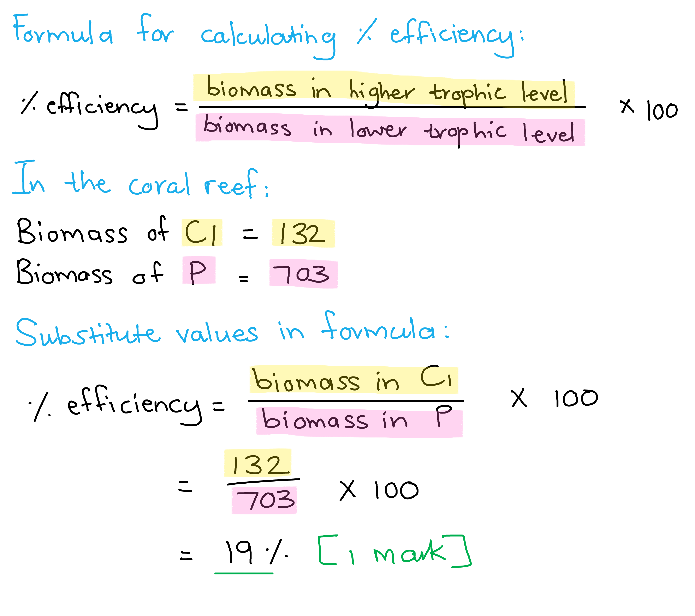

(ii) The biomass of the secondary consumers in the crop field can be calculated as follows...

- (1% of 1) = 0.01; **[1 mark]**

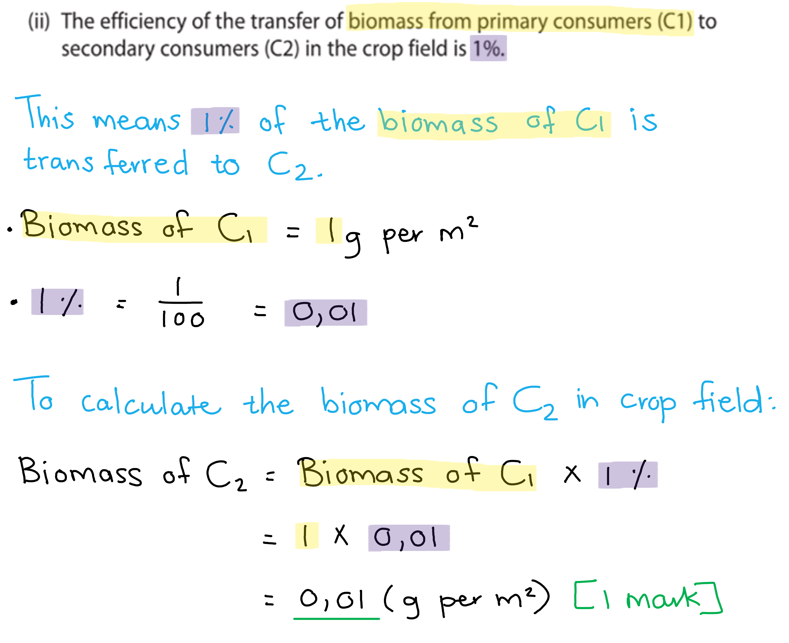

(iii) The biomass transfer is different for the coral reef compared to the crop field because...

- More energy is transferred / less energy lost / less heat loss / less movement in aquatic / more of the producer eaten **OR** less energy is transferred / more energy lost / more heat loss (in crop field) / not all the crops are eaten; **[1 mark]**

**[Total: 3 marks]**

### 6((b)) — 2 marks
The shape of the pyramid of biomass for the ocean can be explained as follows...

Any **two** of the following:

- (There is) less biomass in the producers than the consumers / the consumers have more biomass (than the producers);** [1 mark]**
- However, the producers have more energy (than the consumers);** [1 mark]**
- (The) producers have a low mass at any one point in time / (they) are continually being consumed/replaced / (they have a) high reproduction rate;** [1 mark]**
- (The) consumers feed in other areas; **[1 mark]**

*Ignore an answer given as a number for marking point 1.*

**[Total: 2 marks]**

> *In habitats where producers are consumed at a high rate (such as the ocean), their biomass will be lower than that of the consumers at any given moment in time. In order to support consumers with a larger biomass, the producers would need to reproduce at a rapid rate in order to replace the consumed individuals.*

## Q8 — hard — 12 marks · exam-questions

### 7((a)) — 2 marks
(i) **The correct answer is ****D ****because...**

The producer must be an organism that can carry out photosynthesis. In this case only the tree can do this.

**A**,** B** and** C** are incorrect because they cannot carry out photosynthesis and so do not act as a producer. They must get their nutrition from other means.

(ii) **The correct answer is ****A ****because...**

When the blackbird eats the earthworm it is a secondary consumer, but when it eats the centipede or the ground beetle it is a tertiary consumer.

**B** is incorrect because the earthworm is a primary consumer.

**C** is incorrect because the ground beetle is a secondary consumer.

**D** is incorrect because the sparrowhawk is a tertiary consumer and a quaternary consumer.

**[Total: 2 marks]**

### 7((b)) — 4 marks
(i) The plants cannot absorb all of this energy because...

- Some light / colours / wavelengths (are) reflected; **[1 mark]**
- (Some of the) light falls on flowers / not on leaves / some does not fall on chloroplasts / chlorophyll;** [1 mark]**

*Ignore reference to some parts of the plant is in the shade.*

(ii) The student is incorrect because...

Any **pair **of the following:

- Producer to primary consumer: (1.4 x104 / 8.7 x105) x 100 = 1.61 %; **[1 mark]**
- Primary consumer to secondary consumer: (1.6 x103 / 1.4 x104) x 100 = 11.4 %; **[1 mark]**

**OR**

- ENERGY LOST from producer to primary consumer is 98.4%; **[1 mark]**
- ENERGY LOST from primary consumer to secondary consumer is 88.6%; **[1 mark]**

**[Total: 4 marks]**

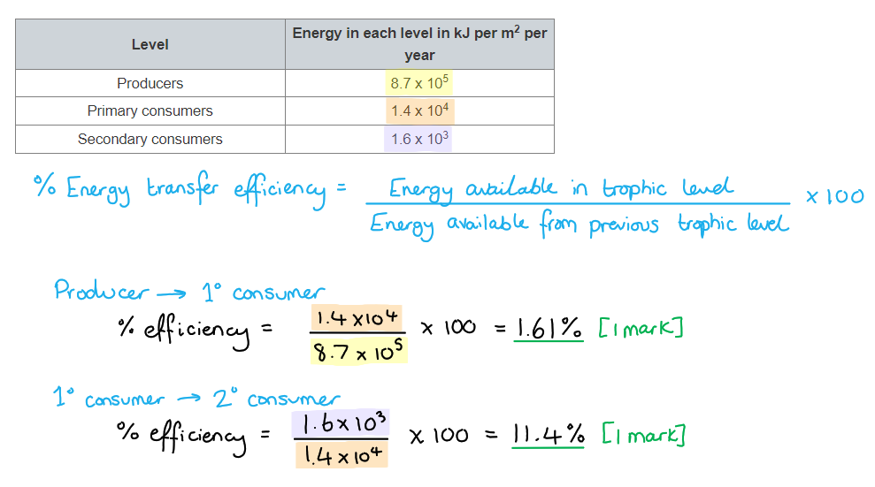

### 7((c)) — 6 marks
(i) A reflex response is...

- Involuntary / automatic / does not involve the brain / spontaneous / without thinking / unconscious;** [1 mark]**

(ii) This reflex response benefits the woodlouse by...

- Protects it from predators / only exposes the hard shell; **[1 mark]**

*Ignore mention of protection against danger / harm or injury.*

(iii) This reflex response could have evolved by natural selection by...

Any **four **of the following:

- (Gene) mutation / mutated gene (for rolling trait); **[1 mark]**
- Variation (exists in the woodlice population - some can roll and some can't); **[1 mark]**
- Woodlice that roll up survive / are not eaten (by predators) **OR **woodlice that cannot roll are more likely to die / get eaten; **[1 mark]**
- These woodlice are able to reproduce **OR **non-rolling woodlice cannot reproduce; **[1 mark]**
- Pass on <u>alleles/genes</u> (for rolling behaviour);** [1 mark]**

**[Total: 6 marks]**

> *Remember that it is the DNA that enables the behaviour that gets passed on, not just the behaviour.*

> *This question is likely to come up in your exams with a different example. Pay attention to the key words here. Words like mutation, variation, reproduce, and allele are in **all** the mark schemes for this style of question. *

## Q9 — hard — 13 marks · exam-questions

### 4() — 3 marks
(i) **The correct answer is ****C**** (primary consumer).**

**A **is incorrect because the predator is the whale. Furthermore, 'predator' is not a trophic level, making **A** the wrong answer on two counts.

**B** is in incorrect despite the fact that the krill *is* prey (to the whale). However, the question asks specifically for the *trophic level* of the krill, not the generic description of 'prey'.

**D** is incorrect because the whale is the secondary consumer.

(ii) The pyramid of biomass should have the following features...

- An upright pyramid shape (wide at the bottom, narrow at the top);** [1 mark]**
- The names of each level in the correct order; plants at the bottom / lowest level, krill in the middle level, whale at the top level; **[1 mark]**

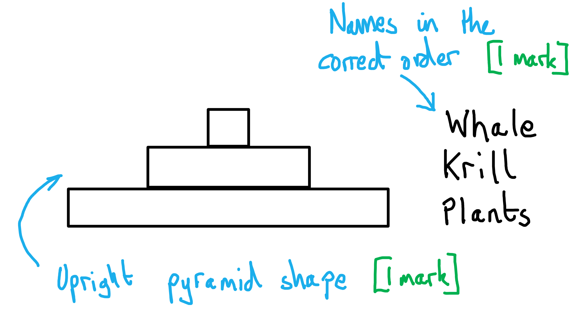

> *The relative widths of the layers in your pyramid is not important, so long as each layer is narrower than the one below it, forming a stepped pyramid shape. This is because we are not given any data in the question about how much biomass there is at each trophic level. *

**[Total: 3 marks]**

### 4((b)) — 2 marks
The time taken for the krill to remove microscopic plants from one square metre of ice is calculated as follows...

- 1m2 = 10 000cm2
- 10 000 ÷ 1.6 = 6 250 seconds; **[1 mark]**
- 6 250 s ÷ 60 = 100 / 104 / 104.2 / 104.17 / 104.16 / 104.167 minutes; **[1 mark]**

**OR**

- 1m2 = 10 000cm2
- 1.6 × 60 = 96cm2; **[1 mark]**
- 10 000 ÷ 96 = 100 / 104 / 104.2 / 104.17 / 104.16 / 104.167 minutes; **[1 mark]**

*Allow any level of precision in the number of minutes.*

**[Total: 2 marks]**

> *Because the crux of this question is to realise that 1 square metre needs to be converted to 10 000cm**2** , it is helpful to visualise a 1 metre square (like a quadrat) divided into 100 ×1cm divisions along all four sides - this means that there are 10 000 small squares in total. Then, imagine the krill clearing 1.6 of these small squares per second. The calculation remains to work out how long the krill would need to clear the whole quadrat-sized area. For this, 10 000cm**2** has to be divided by 1.6 cm**2**s**-1** to get 6 250 seconds. A straightforward division by 60 gives the number of minutes of 104.2 (approx). *

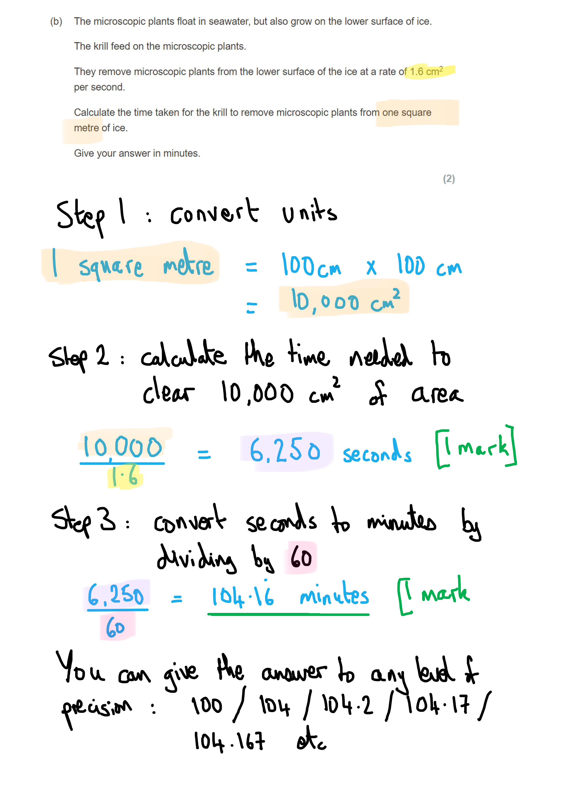

### 4((c)) — 4 marks
The student could conduct this investigation as follows...

Any **four **of the following...

- Use a container of sea water; **[1 mark]**
- Add the same / stated number/ amount/ count number / mass of microscopic plants (to the sea water); **[1 mark]**
- Add stated number / mass of krill (to the sea water); **[1 mark]**
- Leave for same / stated length of time / measure time taken to clear a set area; **[1 mark]**
- (Re)measure number / amount/mass / percentage change in plants; **[1 mark]**
- Repeat the investigation (for reliable results); **[1 mark]**

**[Total: 4 marks]**

> *The key to this question is to state that a **known mass** of the microscopic plants is added, and the effect of the krill in reducing this mass over time would need to be measured. Also stating that a **known mass** of krill is used would help to access all four marks. *

### 4((d)) — 4 marks
Global warming could affect the whale population in the Antarctic ocean as follows...

Any **four** of the following:

- There would be fewer whales / whales would die / migrate; **[1 mark]**
- The ice melts; **[1 mark]**
- There would be no / less surface for microscopic plants to grow/live; **[1 mark]**
- So there would be fewer microscopic plants (available to krill); **[1 mark]**
- This would cause fewer krill / krill die / migrate ; **[1 mark]**
- Carbon dioxide could cause acidification; **[1 mark]**
- Acidification could affect krill's eggs;** [1 mark]**

** ****[Total: 4 marks]**

> *They key to this question is to recognise that melting ice would result in fewer habitats for microscopic plants, therefore causing a knock-on effect all along the food chain, ultimately affecting the whales negatively. *
