# Mark Schemes — Inheritance
**3. Reproduction & Inheritance** · Edexcel IGCSE Science (Double Award) (4SD0) — 17/Biology

## Q1 — easy — 4 marks · exam-questions

### 10((d)) — 4 marks
The decrease in body hair of modern humans has been brought about by the following process...

Any **four** of the following:

- (There was) variation in the amount of body hair (within the ancestral human population); **[1 mark]**
- (This was) caused by mutation; **[1 mark]**
- Less hair increased heat loss in the sun/warm/hot climate / while chasing animals **OR** less hair resulted in humans starting to wear clothes; **[1 mark]**
- (Individuals with less hair therefore) survived and reproduced; **[1 mark]**
- (They) passed on (their) alleles/genes to (their) offspring; **[1 mark]**

**[Total: 4 marks]**

> *It is essential that you always include the following ideas in any extended answers requiring an explanation of natural selection:*

- *Variation** due to **mutation*
- *A **survival advantage** for some individuals that increases their chance of **surviving** and **reproducing*
- *Passing on favourable **genes**/**alleles** to offspring*

> *Remember to adapt the general steps in the process of natural selection to the specific example given in the exam paper. In this case, you have to specifically mention how a decrease in body hair could have led to a survival advantage in ancestral human populations.*

## Q2 — easy — 6 marks · exam-questions

### 1() — 1 marks
The term *allele* means:

- The (two) versions of a gene / the two or more alternative forms of a gene; **[1 mark]**

**[Total: 1 mark]**

> *It is really important you learn the definitions of the key words in inheritance. In this example, all pea plants will have the gene for coloured seeds, but there will be two forms of this gene: one for yellow seeds and one for green seeds. This is defined as the allele of the gene. *

### 2() — 1 marks
The dominant allele is:

- (Allele for) yellow; **[1 mark]**

**[Total: 1 mark]**

> *You can tell that the yellow allele is the dominant one because all the plant's offspring (F**1**) had yellow seeds, meaning that this allele was expressed over the green version, which would be recessive in this case. *

### 3() — 3 marks
(i) A Punnet square for the diagram is:

|   | Yy |   |   |
|---|---|---|---|
| **Final answer:** **Y** | **Final answer:** **y** |   |   |
| Yy | Y | **Final answer:** **YY** | **Final answer:** **Yy** |
| y | **Final answer:** **Yy** | **Final answer:** **yy** |   |

- All alleles (parent genotypes) correct; **[1 mark]**
- All offspring genotypes correct; **[1 mark]**

(ii) The phenotypic ratio is:

- 3 <u>yellow</u> : 1 <u>green</u> (colours must be stated); **[1 mark]**

**[Total: 3 marks]**

> *Yy could be shown as yY and still be correct. *

### 4() — 1 marks
The term used to describe traits determined by multiple genes is...

- Polygenic: **[1 mark]**

**[Total: 1 mark]**

> *Some traits, such as eye colour, are determined by several genes which can lead to a range in different phenotypes rather than a limited number. 'Poly' means many so polygenic literally means 'many genes'.*

## Q3 — easy — 13 marks · exam-questions

### 1() — 2 marks
(i) The type of variation shown in the graph is:

- Discontinuous variation;** [1 mark]**

(ii) The graph shows that blood group is an example of discontinuous variation because:

Any **one **from the following:

- Limited number of phenotypes / categories / groups; **[1 mark]**
- No intermediates; **[1 mark]**

**[Total: 2 marks]**

> *There is a common misconception that discontinuous variation describes a type of characteristic that cannot change throughout an individual's lifetime. Remember that discontinuous variation is always plotted as a bar chart because the data is always split into categories. *

### 2() — 4 marks
The examples of continuous variation are:

| Arm length | ✓; **[1 mark]** |
|---|---|
| Skin colour | ✓; **[1 mark]** |
| Eye colour |   |
| Height | ✓;**[1 mark]** |
| Tongue rolling |   |
| Weight | ✓; **[1 mark]** |

**[Total: 4 marks]**

> *All the features that are influenced by both genes and environment would be classed as continuous variation. It usually applies to characteristics where measurements of the feature can be taken along a scale rather than fitting into categories.*

### 3() — 3 marks
(i)** The correct answer is ****D**

The reason for this is that a mutation is a change in the DNA base sequence which results in a new variant of a gene. Mutations may alter the protein which is coded for by the DNA, but don't always.

Moving genes from one organism to another is an example of genetic engineering. Therefore option** A** is incorrect. Option **B** is incorrect because continuous variation is caused by a combination of genetic and environmental influences. Mutations sometimes lead to non-functional proteins but not always, but the word mutation refers directly to the changes in nucleotide bases and not the proteins, so option C is incorrect.

(ii) Mutations in pathogenic bacteria are of particular concern because...

Any **two **from the following:

- There is a risk of antibiotic resistance / that bacteria will develop resistance to antibiotics; **[1 mark]**
- So bacteria will not be destroyed/killed by antibiotics / antibiotics will no longer be effective; **[1 mark]**
- This may increase deaths as a result of (simple) bacterial infections **OR** doctors may be unable to treat certain diseases; **[1 mark]**

**[Total: 3 marks]**

> *The risk of not being able to treat simple bacterial infections using antibiotics is of particular concern as there are limited other alternative treatments. In hospitals, the risk is even more prominent as this is where the most at risk individuals are likely to be.*

### 4() — 4 marks
The sentences should be completed as follows

In addition to new alleles which form as a result of mutation, variation is introduced into populations through other mechanisms.

The process of **meiosis**; **[1 mark]** creates genetic variation between gametes of an individual.

Random fusion of gametes at **fertilisation**; **[1 mark]** also leads to genetic variation between **zygotes**; **[1 mark]**.

Phenotype is also influenced by **environmental**; **[1 mark]** factors such as climate, diet or lifestyle.

**[Total: 4 marks]**

## Q4 — easy — 6 marks · exam-questions

### 1() — 1 marks
Mitosis is important in multicellular organisms because...

- It allows growth / repair of damaged tissues;** [1 mark]**

*Allow descriptions of specific growth/repair processes*

**[Total: 1 mark]**

### 2() — 1 marks
The diploid number of chromosomes for a body cell in a frog would be....

- 26: **[1 mark]**

**[Total: 1 mark]**

> *Remember that a gamete shows the haploid number of chromosomes which is half the total number of chromosomes found in a diploid cell.*

> *When the sperm cell fertilises the egg cell, the chromosome number from the egg is added to the sperm to make the diploid number, in this case 13 + 13 = 26.*

### 3() — 4 marks
The table should be completed as follows:

| **Statement** | **True** | **False** |
|---|---|---|
| Mitosis produces genetically identical cells | ✓ |   |
| A cell divides twice in the process of mitosis |   | ✓ |
| Daughter cells from mitosis are haploid |   | ✓ |
| DNA is replicated before a cell can divide | ✓ |   |

**[Total: 4 marks]*** *

> *Make sure you know the difference between mitosis and meiosis as the false options here are both relating to features of meiosis and not mitosis.*

## Q5 — medium — 8 marks · exam-questions

### 1() — 6 marks
(i) **The correct answer is ****C** **- cytoplasm because.**..

All cells possess cytoplasm, which is the liquid medium in which cellular reactions take place.

**A** is incorrect because cellulose is not found in bacterial cells, it features in plant cells as plant cell walls.

**B** is incorrect because chitin is not found in bacteria; it features, for example, in the hard exoskeletons of insects and in fungi.

**D **is incorrect because prokaryotes like bacteria do not possess a nucleus; their DNA is held in a single loop, loose in the cytoplasm.

(ii) **The correct answer is ****C**** because...**

'Neutralises' means returning the pH to neutral, which is pH7.

**A **and **B **are both incorrect because pH 1 and 2 are both strongly acidic pH values.

**D **is incorrect because pH12 is a strongly alkaline pH value.* *

(iii) *H. pylori* bacteria could have evolved to produce urease by...

Any **four** of the following:

- (The bacterium / *H. pylori*) mutating / undergoing a mutation;** [1 mark]**
- (Which) caused/introduced variation / new allele (into the species); **[1 mark]**
- Only certain cells <u>survive</u>d / were able to <u>survive</u>; **[1 mark]**
- (So) were the only ones able to reproduce/breed/have offspring; **[1 mark]**
- (And) pass on their (advantageous) allele / gene;** [1 mark]**

**[Total: 6 marks]**

> *The sequence of events is important here, as it is so often in longer questions of this kind. Your answer needs to be clear that a mutation is the first event, and that gives rise to a new allele. That new allele gives the bacterium an advantage in that the bacterium is now able to neutralise stomach acid, so is not killed by the acid conditions of the stomach. Finally, you should get the idea across to the examiner that this new allele will endure because the bacteria without it cannot survive so will not be able to reproduce and pass on that advantageous allele. *

### 1((b)) — 2 marks
Two conclusions from these results are...

Any **two **of the following:

- (That) probiotic / cranberry juice reduces bacteria on their own / are better/more effective than the control;** [1 mark]**
- (That) there is a greater effect / reduction in bacteria of taking probiotic and cranberry juice together / at the same time;** [1 mark]**
- (That) cranberry juice (on its own) is (slightly) more effective / reduces bacteria more than probiotics (on their own);** [1 mark]**

**[Total: 2 marks]**

## Q6 — medium — 14 marks · exam-questions

### 5((a)) — 5 marks
(i) Some of the molecules from the mother's blood allow active transport to occur in cells of the fetus as follows...

Any** three** of the following:

- Oxygen; **[1 mark]**
- Glucose; **[1 mark]**
- (Oxygen and glucose are needed for) respiration; **[1 mark]**
- Which releases energy / produces ATP (required for active transport); **[1 mark]**

(ii) One type of molecule from the mother that helps to protect the fetus from infection, is as follows...

Any** two** of the following:

- Antibodies (from mother); **[1 mark]**
- (Bind to) antigens;** [1 mark]**
- To kill/destroy pathogens / bind to pathogens / clump pathogens together / mark/label pathogens (for destruction by other cells); **[1 mark]**

***Allow**** bacteria or virus for pathogen.*

**[Total: 5 marks]**

> *(i) It isn't enough to just list the molecules; your answer must be an explanation that makes reference to named molecules like glucose and oxygen and explains their significance in releasing the necessary energy required for active transport. A description of active transport is not required, so avoid launching into a definition, which won't earn you any marks in this question. *

> *Be careful when describing the role of respiration; it is correct to say that respiration** releases** **energy** or that it **produces ATP**, but you should **never** say that energy is produced!*

> *(ii) It's easy to confuse the terms **antigen**, **antibiotic** and **antibody**; despite looking similar they all mean very different things. Precise, accurate use of terminology is essential when answering exam questions like these.*

### 5((b)) — 2 marks
Two conclusions that can be made from this karyotype are...

Any **two** from the following:

- The foetus is female/girl; **[1 mark]**
- The cells contain 46 chromosomes / 23 pairs of chromosomes / has a diploid number / has two sets of chromosomes / normal number of chromosomes; **[1 mark]**
- The chromosomes have different lengths/sizes/shapes;** [1 mark]**

***Allow ****"the foetus does not have Down's syndrome" for marking point 2.*

**[Total: 2 marks]**

### 5((c)) — 7 marks
(i) A woman who is pregnant requires more of each of the dietary components listed in the table because...

Any **four** of the following:

- Calcium for bone/teeth growth/development / to prevent rickets;** [1 mark]**
- Protein to grow / for enzymes / antibodies;** [1 mark]**
- Iron for haemoglobin / red blood cells / to prevent anaemia; **[1 mark]**
- Vitamin D for bone growth/development / calcium absorption / strong bones; **[1 mark]**
- More energy as baby is heavy / mother becomes heavy / for fetal development / for the mother to carry baby; **[1 mark]**

(ii) The actual total mass of iron needed by the pregnant woman is calculated as follows...

- 9 mg = 50 % more / 0.5/½ as much again / twice the amount; **[1 mark]**
- 9 x 2 = 18 **OR** 18;** [1 mark]**
- 27 (mg per day); **[1 mark]**

*Award full marks for correct numerical answer of 27 mg without working.*

**[Total: 7 marks]**

> *(i) The largest pitfall in a question like this is to not give sufficient detail in your answers; if you were to simply state that the nutrients were necessary for the growth of the baby, that is true, but too vague to earn marks. The question presents you with a table with specific substances, so it's a good idea to give a detailed function for each, for example, the use of iron for red blood cell growth. *

> *(ii) This question needs careful reading and thought before launching into calculations. It requires you to recognise that the extra 9.0 mg of iron required by a pregnant woman represents 50 % of the mass of iron needed by a woman who is not pregnant. The important word to spot in the question is **additional**; if you fail to take on the significance of that word, you'll work out the wrong answer. Remember to add the 9.0 mg to the 18.0 mg that a non-pregnant woman would need.*

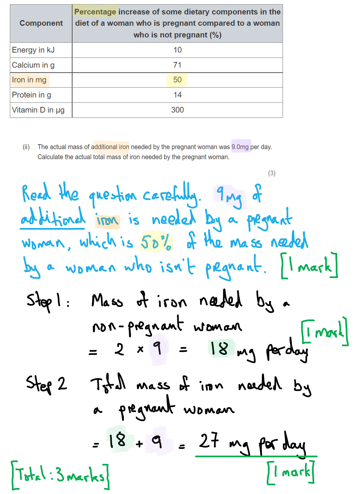

## Q7 — medium — 13 marks · exam-questions

### 9((a)) — 3 marks
(i) The phenotype is...

- Whether the person has a cleft chin or not / the appearance of the person''s chin;** [1 mark]**

(ii) A gene is...

Any **one** of the following**:**

- (The section of) DNA that determines whether the individual has a cleft chin or not / codes for the cleft chin characteristic; **[1 mark]**
- Section of DNA that codes for a protein; **[1 mark]**

(iii) An allele is...

- Different versions / alternative forms of the (cleft chin) gene;** [1 mark]**

**[Total: 3 marks]**

### 9((b)) — 7 marks
(i)  A genetic diagram is awarded marks as follows...

- Both parents are heterozygous/Nn; **[1 mark]**
- Their gametes both produce N or n;** [1 mark]**
- All offspring genotypes shown: NN **AND** Nn **AND** Nn **AND** nn; **[1 mark]**
- Offspring phenotypes shown: 3 with a cleft chin **AND** 1 without cleft chin; **[1 mark]**

***Allow**** full marks if all of the marking points can be clearly seen in a Punnett square.*

***Allow**** error carried forward, meaning that if the wrong parental genotypes are used for marking point 1, marks can still be awarded for correct gametes and offspring genotypes for marking points 2 and 3.*

(ii) The probability that the couple's second child will be female and not have a cleft chin is calculated as follows...

- 0.25 **OR** 25 % **OR** 1/4; **[1 mark]**
- 0.125 **OR** 1/8 **OR** 12.5%; **[1 mark]**

*Full marks can be awarded for correct answer in the absence of calculations.*

(iii) A cleft chin may not develop even if the individual inherits the dominant allele because...

Any **one** of the following:

- The environment that the child grows up in / its diet may mean that the chin shape develops differently / without a cleft;** [1 mark]**
- The child may have a mutation that changes the chin shape;** [1 mark]**

**[Total: 7 marks]**

> *(i) *

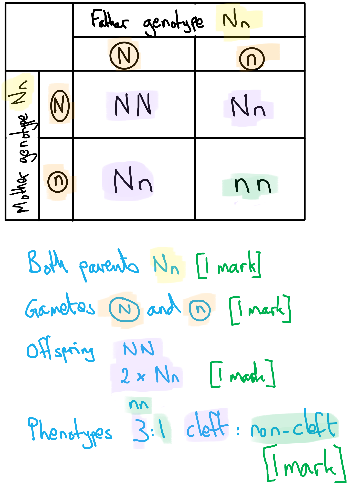

> *(ii) Because the events are independent of each other, we MULTIPLY the probabilities for being female and not having a cleft chin together:*

- *Probability that child is female = **1**/**2** = 0.5*
- *Probability that child will not have a cleft chin = **1**/**4 **= 0.25*
- *0.5 x 0.25 = 0.125*

> *The punnett square from part (i) can be used here to find the probability of having a child without a cleft chin. Remember that the probabilities do not change from one child to the next when the parents remain the same. Having a first child with a particular characteristic does not alter the probabilities for the second child.*

### 9((c)) — 3 marks
A scientist could distinguish between a genetic condition in rats controlled by a single gene and one controlled by many genes as follows...

Any **three** of the following:

- Use crosses between different rats / do a test cross pedigree analysis to predict outcomes / look at pedigree diagrams / family trees / family history;** [1 mark]**
- If the condition is controlled by single gene the offspring will show a simple pattern (pattern of inheritance) / show a 3:1 ratios / look like one parent; **[1 mark]**
- The single gene inheritance shows discontinuous variation / two or three phenotypes; **[1 mark]**
- Polygenic traits show continuous variation / intermediate expression has many different phenotypes / show much more variation / three or more phenotypes; **[1 mark]**

**[Total: 3 marks]**

> *Traits controlled by a single gene often show simple patterns of inheritance, such as that seen in a normal monohybrid cross. Carrying out a test cross with another individual should therefore show a simple pattern of inheritance in the offspring, such as the well known 3:1 ratio that occurs when two heterozygous parents are crossed.*

> *Single gene traits can often be identified due to the presence of fewer phenotypes, e.g. for cleft chins there are two; cleft vs no cleft.*

> *Polygenic traits are controlled by many genes, so we would expect to see a range of different phenotypes.*

## Q8 — medium — 11 marks · exam-questions

### 7((a)) — 2 marks
(i) The term gene means...

- A section/length/part (of a molecule) of DNA that codes for a specific protein/polypeptide;** [1 mark]**

(ii) The phenotype coded for by the dominant allele is...

- Grey (hair); **[1 mark]**

**[Total: 2 marks]**

> *The definition of a gene is a really important one to learn; it is a common question and can often confuse students so make sure you spend some time learning this one. *

> *All of the offspring have grey hair, indicating that the allele for grey hair is dominant over the allele for white hair:*

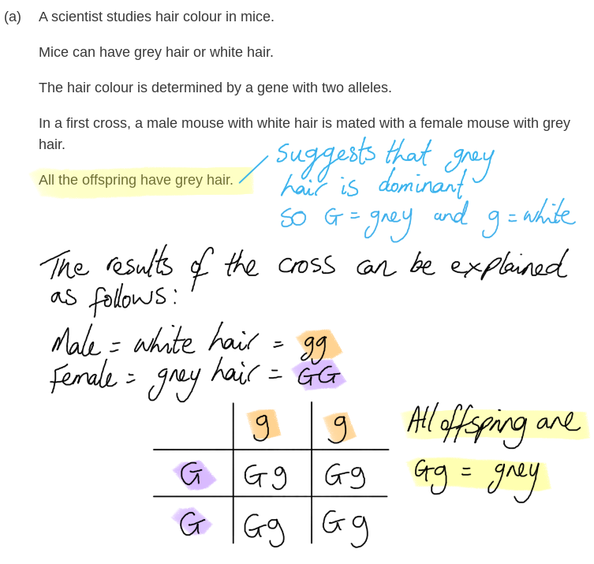

### 7((b)) — 4 marks
A genetic diagram for the second cross should contain the following...

- (The parental genotypes =) Gg **AND** Gg;** [1 mark]**
- (The gametes from the parental gentypes =) G or g  **AND** G or g;** [1 mark]**
- (The offspring genotypes =) GG **AND** Gg **AND** Gg **AND** gg; **[1 mark]**
- (The offspring phenotype ratios =) 3 grey **AND** 1 white ;** [1 mark]**

***Allow**** letters other than G or g provided that the alleles are clearly distinguishable, e.g. Ww or GW*

*Gamete letters must be clearly separated or in circles for marking point 2.*

*The ratio must be stated with the phenotype or clearly labelled as part of the diagram for marking point 4.*

***Allow ****75 % or 3/4 instead of 3 for marking point 4.*

***Allow**** 25 % or 1/4 instead of 1 for marking point 4.*

**[Total: 4 marks]**

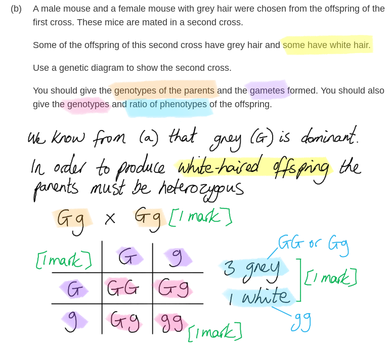

### 7((c)) — 2 marks
The scientist could use a cross to determine the genotype of a mouse with grey hair by...

Any **two** of the following:

- Carry out a cross with a mouse with white hair / gg/homozygous recessive / do a back cross / test cross;** [1 mark]**
- If all the offspring are grey the parent is homozygous/GG;** [1 mark]**
- If some/any/half of the offspring are white the parent is heterozygous/Gg;** [1 mark]**

***Allow ****different letters for geneotypes, e.g. Ww*

**[Total: 2 marks]**

> *A test cross or back cross involves crossing an individual of an unknown genotype with an individual of a known genotype in order to determine the unknown genotype. An individual with the recessive phenotype will always be homozygous recessive, so a test cross involves crossing an individual with the dominant phenotype with an individual with the recessive phenotype.*

> *If any of the offspring of such a cross have the recessive phenotype then the individual of unknown genotype must be heterozygous, as the offspring must have inherited a recessive allele from each parent.*

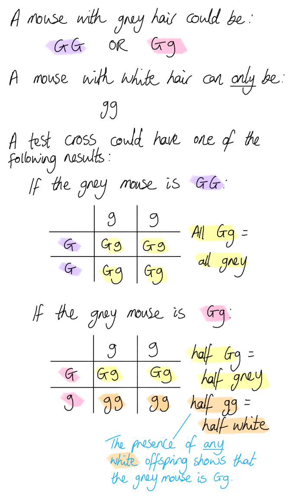

> * *

### 7((d)) — 3 marks
The genetic control of most phenotypic features differs from the example by...

Any **three** of the following:

- Most features are polygenic;** [1 mark]**
- (polygenic) features are controlled by many / more than one gene; **[1 mark]**
- Each (gene) has a small effect (on the phenotype);** [1 mark]**
- (Such features) show continuous variation / (a polygenic feature is) height / mass;** [1 mark]**
- Most single genes / features with monohybrid inheritance only affect one phenotypic trait/characteristic; **[1 mark]**

**[Total: 3 marks]**

## Q9 — medium — 7 marks · exam-questions

### 4((a)) — 1 marks
The control solution differs from the GH solution by...

- No GH / water / saline; **[1 mark]**

**[Total: 1 mark]**

### 4((b)) — 2 marks
The average rate of growth of the rat given GH solution from 100 days to 500 days is...

- Divide by 400 = g per day;** [1 mark]**
- 485 - 230 = 255 255 ÷ 400 = <u>0.6375</u> / <u>0.638</u> / <u>0.64</u> *(award 2 marks for the correct answer without any calculations*); **[1 mark]**

**[Total: 2 marks]**

Allow any answer between 0.6375 and 0.65.

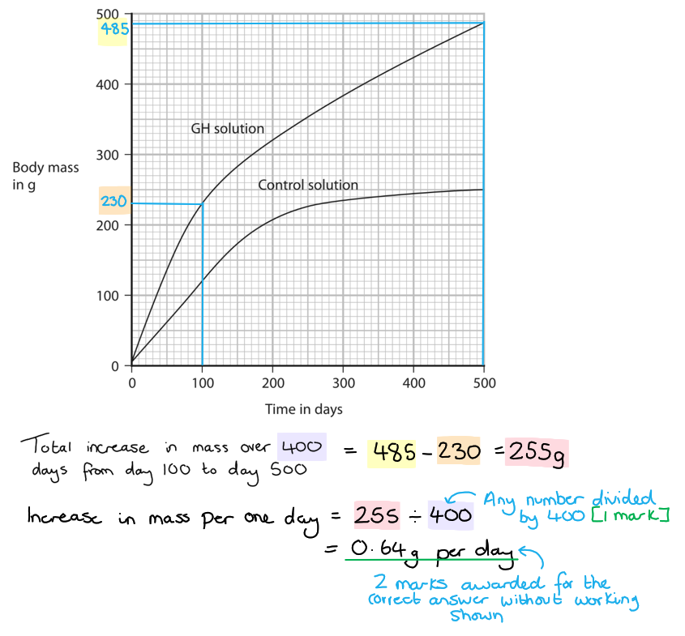

### 4((c)) — 2 marks
Two abiotic variables he controls are...

Any **two **of the following:

- Temperature; **[1 mark]**
- (Mass of) food / diet / type of food; **[1 mark]**
- Water;** [1 mark]**
- Size of cage;** [1 mark]**
- Time; **[1 mark]**
- Volume of solution;** [1 mark]**

**[Total: 2 marks]**

> *Remember that abiotic means 'non-living' and biotic means 'living'. *

### 4((d)) — 2 marks
Using more rats improves his investigation by...

Any **two **of the following**:**

- Avoids making wrong conclusion based on only a small number of result(s) / (so the) conclusion is valid; **[1 mark]**
- (In order to) calculate the mean / average; **[1 mark]**
- Results are reliable / to increase reliability; **[1 mark]**
- Anomalous results are recognised / to spot anomalous results; **[1 mark]**

**[Total: 2 marks]**

## Q10 — medium — 1 marks · exam-questions

### 6((a)) — 1 marks
**The correct answer is ****A ****because...**

Asexual reproduction involves the cells of the plant dividing by mitosis and making a new genetically identical copy of themselves. This does not lead to an increase in genetic variation.

**B** and **D** are incorrect because they both allow for the transfer of pollen for the process of sexual reproduction. When the gametes fuse the offspring are genetically different to both parent plants.

**C** is incorrect because mutation causes the DNA of the plant to change, increasing genetic variation.

**[Total: 1 mark]**

## Q11 — hard — 10 marks · exam-questions

### 7((a)) — 8 marks
(i) Cats with hypertrophic myopathy are unable to run quickly because...

Any **two **of the following**:**

- Less pressure / reduced heart volume / less blood pumped (with each beat) / lower stroke volume; **[1 mark]**
- Less oxygen pumped to <u>muscles</u>; **[1 mark]**
- Less respiration (can occur); **[1 mark]**

*It is possible to gain two marks within a single statement here, e.g. "less oxygenated blood pumped to muscles" covers marking points 1 and 2 together. *

(ii) A dominant allele is...

- Only one copy of an allele is needed to affect the phenotype / an allele that is always expressed; **[1 mark]**

(a) (iii) The genetic diagram showing the possible genotypes and phenotypes of the offspring produced by individuals 6 and 7 should appear as follows...

- Parent genotypes of Hh **AND** hh; **[1 mark]**
- Gametes as H or h **AND** h (or h); **[1 mark]**
- Offspring as Hh **AND** hh; **[1 mark]**
- Offspring in correct ratios (of 1:1) **AND** phenotypes correctly identified; **[1 mark]**

***Accept ****answers that use different letters with the correct use of upper and lower case.*

***Accept ****error carried forward for marking points 2 and 3 here, meaning that if the parent genotypes are identified incorrectly it is still possible to be credited for the correct gametes and offspring of those incorrect parent genotypes.*

(a) (iv) The probability that the next offspring produced by individuals 6 and 7 is male and has hypertrophic myopathy is...

- 0.25 / 1⁄4 / 25 %; **[1 mark]**

**[Total: 8 marks]**

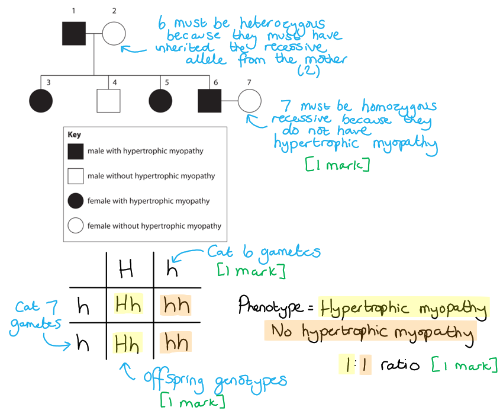

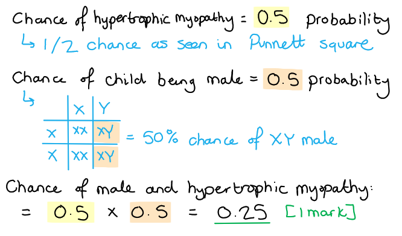

### 7((b)) — 2 marks
It is more difficult to remove harmful recessive alleles from populations than harmful dominant alleles from populations because...

Any **two **of the following:

- Recessive alleles are not always expressed (in the phenotype) / not expressed in heterozygous individuals / only expressed when individuals are homozygous (recessive) / hidden when a dominant allele is present; **[1 mark]**
- Dominant alleles are always expressed (in the phenotype) / are expressed when (the dominant allele is) present / dominant alleles are always identified in the phenotype; **[1 mark]**
- Cats with a dominant allele can be prevented from breeding / cats with a recessive allele cannot always be stopped from breeding; **[1 mark]**

**[Total: 2 marks]**

## Q12 — hard — 14 marks · exam-questions

### 9((a)) — 1 marks
A recessive allele is...

Any **one **of the following:

- Only expressed in the phenotype of homozygous individual; **[1 mark]**
- Requires two copies in order to be expressed in phenotype; **[1 mark]**
- Only seen / expressed / shown if no dominant allele present; **[1 mark]**
- Not expressed if the dominant allele is present; **[1 mark]**

**[Total: 1 mark]**

> *It is really important to learn key definitions such as this. If you are struggling, I'd recommend making a flashcard from this question. *

### 9((b)) — 5 marks
(i) The genetic diagram should include the following information...

- Parents Aa and Aa; **[1 mark]**
- Gametes A and a; **[1 mark]**
- Offspring genotypes AA  Aa  aa; **[1 mark]**
- Offspring phenotypes or ratio 3 no symptoms to 1 alkaptonuria; **[1 mark]**

(ii) The probability that the second child is male and does not have the condition is...

- 0.375 / 37.5% / 3/8; **[1 mark]**

**[Total: 5 marks]**

> *If you used a different letter other than A then you can also get the marks. Be careful when choosing your letters. Always choose a letter that has a big difference in appearance between the upper and lower case letter, for example, A and a are very different but C and c or S and s are not. This could lead to you losing marks if it is not clear which letter you've used.*

> *The most common mistake here would be to draw the Punnett square but forget to include the offspring phenotypes. Make sure to read the question stem carefully so that you include all the information that is asked for. *

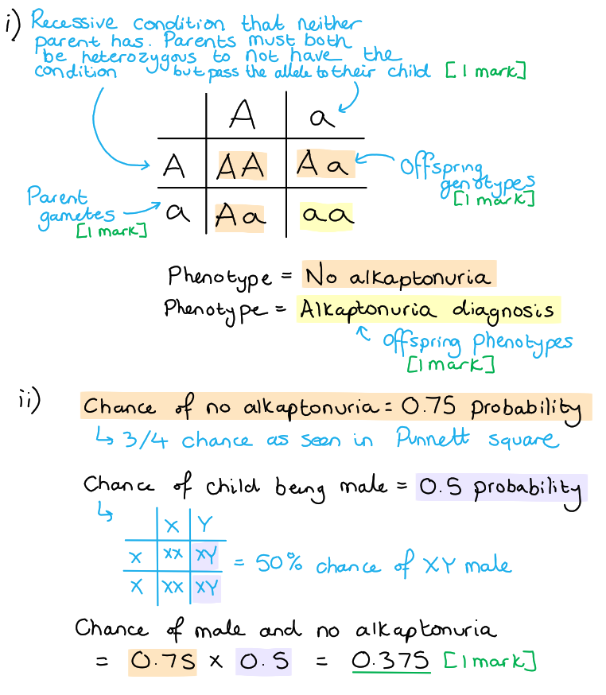

### 9((c)) — 6 marks
(i) The control group...

- Did not receive the drug / received no treatment / received a pre-existing treatment / received a placebo; **[1 mark]**

(ii) An evaluation of whether the drug should be recommended is...

Any **five **of the following:

*Points in favour of the drug being recommended:*

- (The study had a) control group so (it was a) valid study; **[1 mark]**
- (Those receiving treatment) showed an improvement / reduced symptoms / activity / life; **[1 mark]**
- (The treatment group were) quicker to stand up; **[1 mark]**
- (The treatment group showed an) improved distance walked; **[1 mark]**

*Allow the converse for discussing the control group.*

*Points against recommending the drug:*

- (The study had a) small group size / should be tested on more people / repeat the study; **[1 mark]**
- Not everyone finished the study; **[1 mark]**
- (Some experienced) adverse / side effects; **[1 mark]**
- One died in the drug group; **[1 mark]**
- (The study provided) no information on age / mass / sex / other health conditions / activity / exercise; **[1 mark]**

**[Total: 6 marks]**

> *Evaluate is an important command words that requires you to discuss both points in favour and against the statement in the question. You need to make sure to have points from both sides to be able to gain full marks in this question. *

### 9((d)) — 2 marks
Eating fewer of these proteins may be difficult because...

Any **two **of the following:

- Patients may not know what foods contain these / what proteins contain these; **[1 mark]**
- (These amino acids may be) present in many / most foods / most proteins; **[1 mark]**
- Proteins are required for growth / repair / provide essential amino acids; **[1 mark]**

**[Total: 2 marks]**

## Q13 — hard — 8 marks · exam-questions

### 7((a)) — 3 marks
The completed table would be as follows...

| **Individual** | **Genotype** |
|---|---|
| P | Dd; **[1 mark]** |
| Q | Dd; **[1 mark]** |
| R | Dd |
| S | dd; **[1 mark]** |

**[Total: 3 marks]**

> *You can deduce that this particular inherited condition is caused by a recessive allele (d).*

> *This can be deduced because individual **S** is affected by the condition while neither one of her parents are, even though they each carry an allele for the condition. The presence of a dominant allele (D) masks the expression of the recessive allele (d) in the phenotype of each parent. If the condition had been caused by a dominant allele (D), then both her parents would have also been affected by the condition, as well as her brother (**R**).*

> *Both parents (**P** and **Q**) are therefore heterozygous (Dd) for the condition and individual **S** must have inherited a recessive allele (d) from each of them in order to have the condition, which means that her genotype will be dd.*

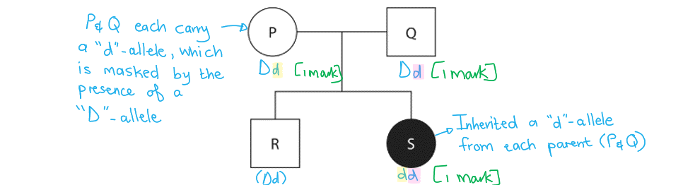

> *Note that another way of deducing that this is a recessive condition is by looking at the genotype of individual **R** that has been provided in the table. He is heterozygous but does not have the condition, meaning that the dominant allele (D) must be masking the condition-causing recessive allele (d).*

### 7((b)) — 1 marks
The probability that a third child would be a female with the inherited condition is...

- 1/8 **OR** 0.125 **OR** 12.5 %; **[1 mark]**

**[Total: 1 mark]**

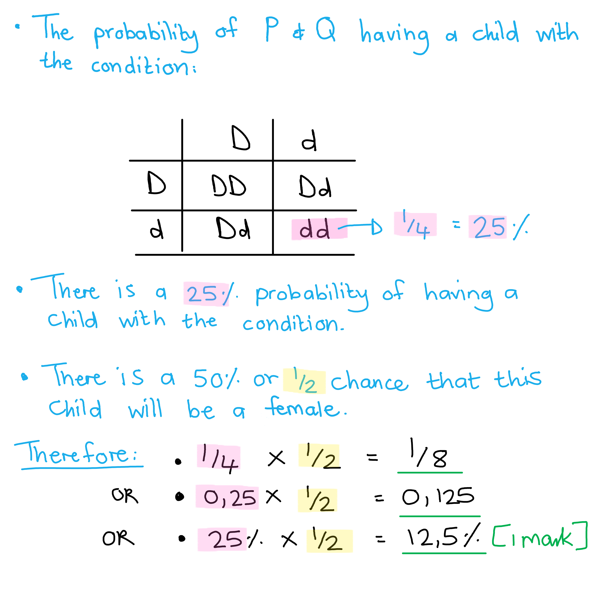

### 7((c)) — 4 marks
The changes in hormone concentrations will affect the development of each child in the following ways...

Any **four** of the following:

- (There is a) greater increase in testosterone in child R / (there is a) smaller increase in testosterone in child S; **[1 mark]**
- (There is a) greater increase in oestrogen in child S / (there is a) smaller increase in oestrogen in child R; **[1 mark]**
- Child R is male **AND** child S is female; **[1 mark]**
- Child R has more muscle / a deeper voice / a beard; **[1 mark]**
- Child S has wider hips / breasts; **[1 mark]**
- Both child R and S will develop body hair / undergo a growth spurt; **[1 mark]**
- (Both will) start producing gametes / (R will) produce sperm / (S will) produce eggs / (S will) start to menstruate; **[1 mark]**
- (Both child R and S will develop) <u>secondary sexual characteristics</u>; **[1 mark]**

**[Total: 4 marks]**

> *Between the ages of 11 and 15 most children will become adolescents as they enter puberty. This involves the development of secondary sexual characteristics which are driven by the release of oestrogen in females and testosterone in males, as illustrated in the graphs of the question stem. Make sure that you familiarise yourself with the changes that occur in both males and females during puberty.*

## Q14 — hard — 4 marks · exam-questions

### 3((a)) — 1 marks
After the brain, the other part of the central nervous system is...

- (The) spinal cord; **[1 mark]**

*Allow misspelling: 'chord'*

**[Total: 1 mark]**

### 3((b)) — 3 marks
(i) The answer is **C**, the probability of this child having HD is 0.5 because...

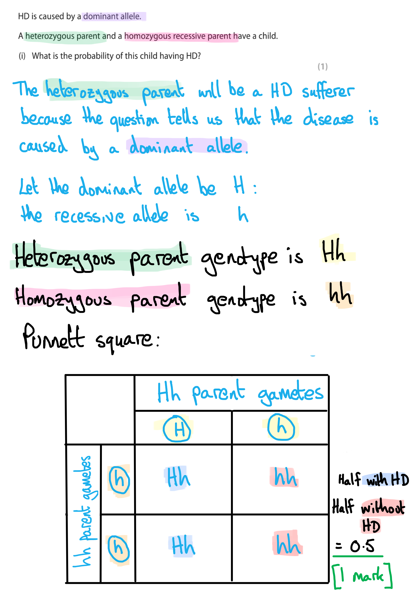

(ii) The completed family pedigree with the predicted sex ratio and predicted phenotype ratio for the other two children is as follows...

- One circle and one square; **[1 mark]**
- Both shapes unshaded; **[1 mark]**

**[Total: 3 marks]**

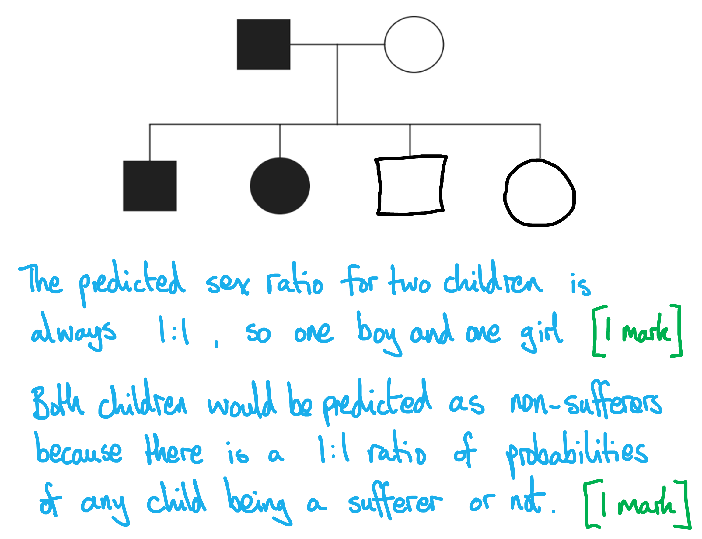
