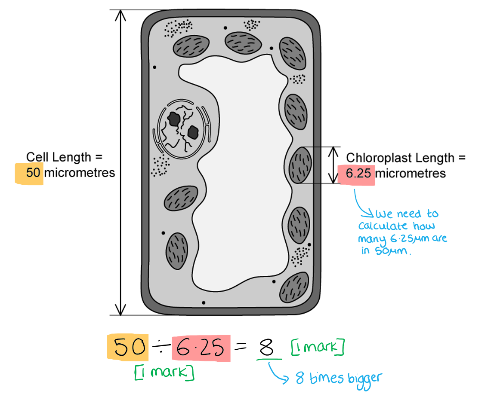
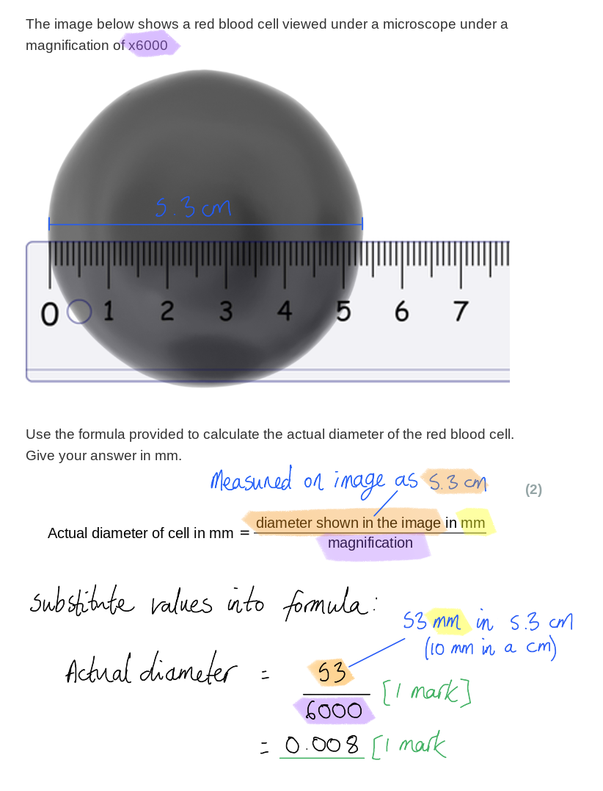
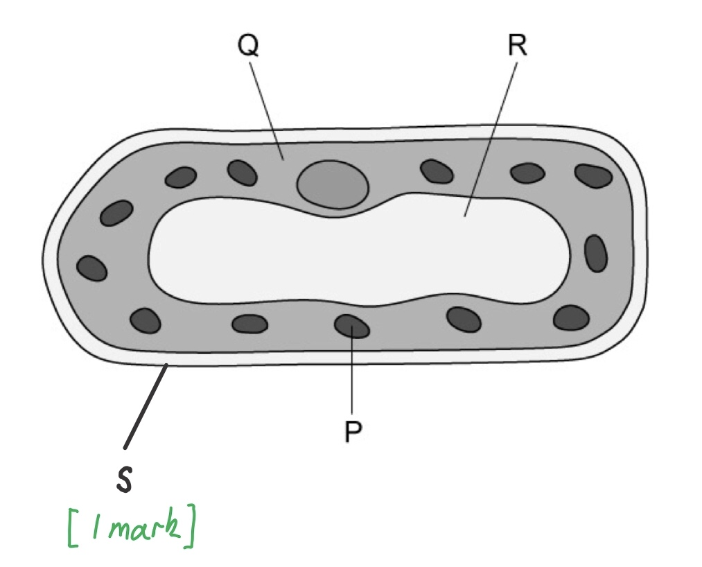
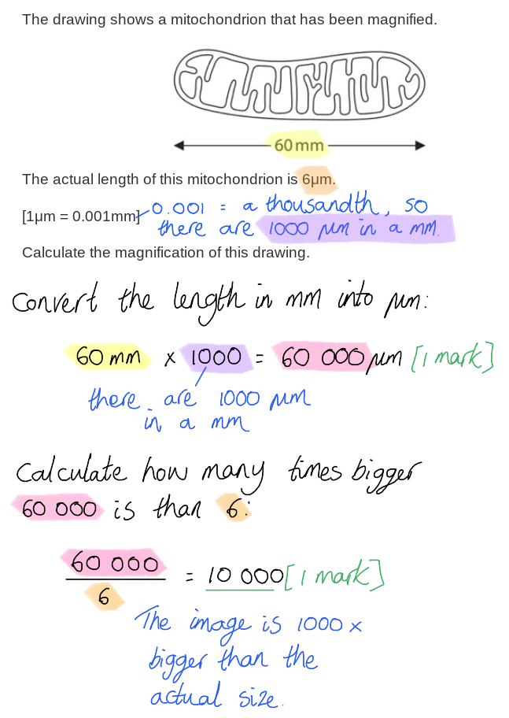
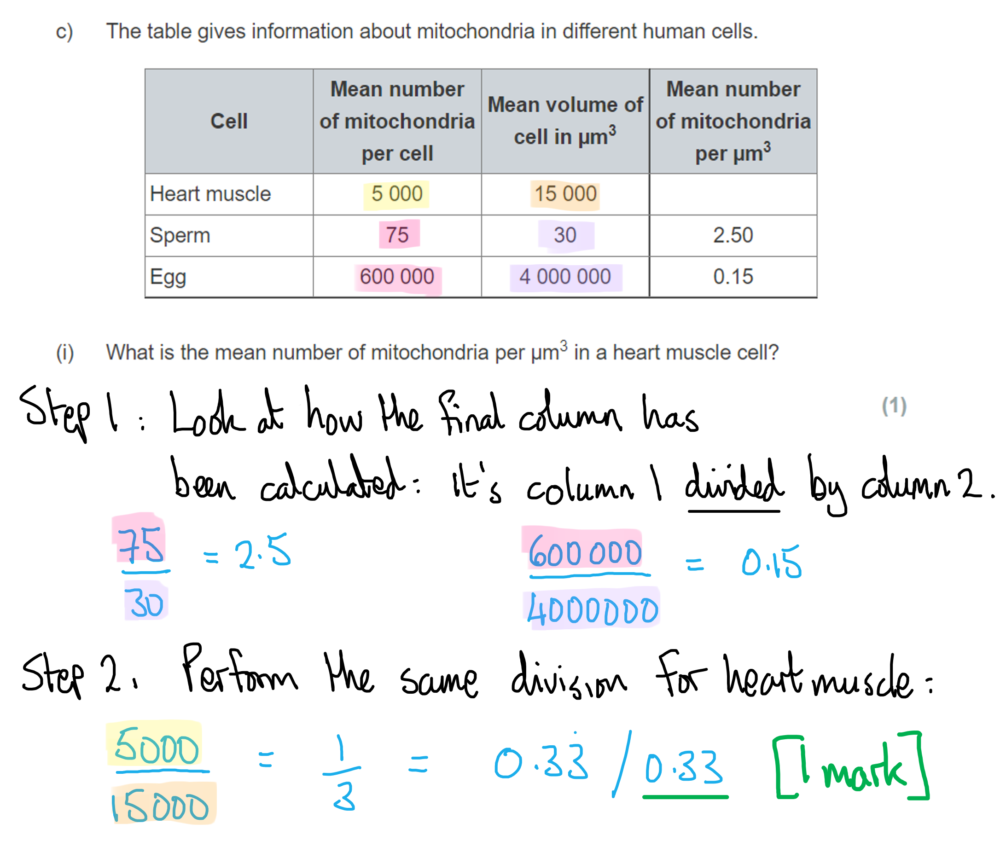
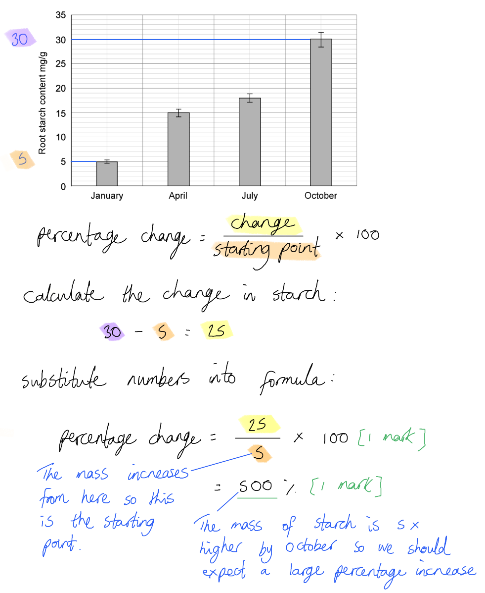

# Mark Schemes — Cell Structure
**2. Structure & Function in Living Organisms** · Edexcel IGCSE Science (Double Award) (4SD0) — 17/Biology

## Q1 — easy — 6 marks · exam-questions

### 1() — 3 marks
Structures P, Q and R are....

- P = Chloroplast **OR** mitochondria; **[1 mark]**
- Q = Cytoplasm; **[1 mark]**
- R = Vacuole; **[1 mark]**

**[Total: 3 marks]**

> *In a simplistic diagram, such as that shown, the organelle labelled P could be either mitochondria (the site of respiration) or a chloroplast (the site of photosynthesis).*

### 2() — 2 marks
(i) A structure** **visible in the diagram that was not identified in part (a) could be...

Any **one** of the following:

- Cell wall; **[1 mark]**
- Cell (surface) membrane; **[1 mark]**
- Nucleus; **[1 mark]**

> *Note that the question asks you to name a structure that is **visible in the diagram**, so you will not be credited for naming ribosomes or mitochondria. These structures are too small to be visible in the diagram shown.*

(ii) The role of the structure named in part (i) is...

**One relevant** point from the following:

- (Cell wall =) provides strength/support/shape to the cell (and to the plant as a whole); **[1 mark]**
- (Cell membrane =) controls what passes into and out of the cell **OR** separates the cell contents from its surroundings; **[1 mark]**
- (Nucleus =) contains the DNA/genetic material/chromosomes (which controls the cell); **[1 mark]**

***Do not accept**** 'controls the cell' without reference to DNA for the role of the nucleus.*

**[Total: 2 marks]**

### 3() — 1 marks
**Final answer:** **The structure not present in prokaryotic cells is ****B****.**

Prokaryotic cells do not contain internal membranes, so they cannot contain chloroplasts, which are surrounded by membrane.

Prokaryotic cells do have a cell wall (A), though the cell wall is different to plant cell walls as it is not made of cellulose.

Prokaryotic cells do contain plasmids (C), small loops of DNA.

Prokaryotic cells do contain circular DNA (D), though this DNA is not contained inside a nucleus but floats free in the cytoplasm.

## Q2 — easy — 4 marks · exam-questions

### 1() — 2 marks
The following calculation shows how much longer the cell length is compared to the chloroplast...

- 50 ÷ 6.25;** [1 mark]**
- 8 (times longer); **[1 mark]**

*Full marks to be awarded for correct answer without calculation*

**[Total: 2 marks]**

### 2() — 2 marks
An animal cell would be different to the cell shown in part (a) as follows...

Any **two** of the following:

- It would not contain chloroplasts; **[1 mark]**
- It would not contain a (permanent) vacuole; **[1 mark]**
- It would not have a cell wall;** [1 mark]**

***Ignore**** references to mitochondria.*

**[Total: 2 marks]**

## Q3 — easy — 2 marks · exam-questions

### 1() — 2 marks
The actual diameter of the cell is...

- 53 ÷ 6000; **[1 mark]**
- 0.008 (mm); **[1 mark]**

*Allow 1 mark for 8 μm.*

**[Total: 2 marks]**

> *The question asks you to give the answer in mm, and the formula states that the values should be in mm, so be sure to covert the measurement on the diagram (which is in cm) into mm before completing the calculation.*

## Q4 — medium — 6 marks · exam-questions

### 1((a)) — 2 marks
(i) **The correct answer is ****B ****because...**

A cell wall is only found in plant cells and some microorganisms.

> *Structures A, C and D** **are found in all animal (and plant) cells. *

(ii)** The correct answer is ****D ****because..**.

Starch is the storage compound used by plants; starch is stored in small granules inside chloroplasts.

> *A is incorrect because chlorophyll is not a storage compound, it is the pigment that captures light energy for photosynthesis.*

> *B is incorrect because glucose is very soluble so cannot easily be stored in plant cells*

> *C is incorrect because glycogen is a storage compound, but in animals, not plants. *

### 1((b)) — 4 marks
The functions of parts labelled **A**, **B**, **C** and **D** are as follows...

- A = (chloroplasts) absorb light for photosynthesis / to make carbohydrate/starch/glucose/sugar / store starch granules; **[1 mark]**
- B = (nucleus) controls protein synthesis / contains DNA/genes / controls cell; **[1 mark]**
- C = (vacuole) contains cell sap / maintains turgor / stores water/salts/pigments/toxins; **[1 mark]**
- D = (cytoplasm) where chemical reactions occur / protein synthesis occurs / respiration occurs / provides a medium for chemical reactions (within the cell);** [1 mark]**

**[Total: 4 marks]**

> *When answering questions about structure and function be sure to explain exactly how each structure aids overall function.*

## Q5 — medium — 9 marks · exam-questions

### 1() — 3 marks
The functions of structures P, Q and R are...

- P (chloroplast) = site of photosynthesis / sugar/carbohydrate production **OR** absorption of (sun)light energy; **[1 mark]**
- Q (cytoplasm) = jelly-like fluid containing dissolved substances **OR** where chemical reactions take place; **[1 mark]**
- R (permanent vacuole) = store of water/sugars/sap **OR** keeps cell turgid / allows the cell to keep its shape; **[1 mark]**

**[Total: 3 marks]**

### 2() — 2 marks
(i) The diagram should be labelled as follows to show the location of the cell wall...

- The outermost layer surrounding the cell labelled with the letter **S**; **[1 mark]**

(ii) The function of the cell wall is to...

- To provide structure/support for the cell / enable the cell to maintain its shape; **[1 mark]**

*Accept references to maintaining turgor pressure.*

**[Total: 2 marks]**

### 3() — 2 marks
(i) Another group of eukaryotes in which you might find structure P (chloroplasts) is...

- Protoctists; **[1 mark]**

*Accept algae or chlorella.*

> *The protoctists can have either animal- or plant-like features, so some protoctists contain chloroplasts.*

(ii) Another feature of the protoctists is...

Any **one **of the following:

- They are single-celled organisms (though they can group together into colonies);** [1 mark]**
- They are (mostly) aquatic; **[1 mark]**
- They can have features of animal or plant cells;** [1 mark]**

*Ignore references to general eukaryotic features as the question states that the group is eukaryotic.*

**[Total: 2 marks]**

### 4() — 2 marks
Possible conclusions about the activities of the salivary gland cell from the image above include...

- They are metabolically active / carry out activities that require energy; **[1 mark]**
- They produce many proteins;** [1 mark]**

*Accept a reference to secretion of substances for 1 mark.*

**[Total: 2 marks]**

> *It is possible to make suggestions about the **role** of a cell by looking at its **structure**. The salivary gland cell has **many mitochondria**, organelles responsible for releasing energy; this suggests that the cell is **metabolically active**. The cell also contains **many ribosomes**, the organelles responsible for protein synthesis; this tells us that the cell **produces lots of proteins**.*

> *In reality, the role of the salivary gland cell is to produce amylase enzymes (which are made of protein). The process of protein synthesis requires energy, hence the high metabolic requirements of the cell.*

> *The proteins are secreted from the cell into the mouth once the protein synthesis process is finished; the evidence for this is the presence of structures known as secretory vesicles near the top of the cell.*

## Q6 — hard — 7 marks · exam-questions

### 3((a)) — 1 marks
The organelle showing in the student's drawing is the...

- Nucleus;** [1 mark]**

**[Total: 1 mark]**

### 3((b)) — 2 marks
The magnification of the drawing is...

- 60 mm = 60 000 μm; **[1 mark]**
- (60 000 ÷ 6 =) 10 000 / x10 000; **[1 mark]**

*Award full marks for correct numerical answer without working.*

**[Total: 2 marks]**

### 3() — 4 marks
(i) **The correct answer is ****A ****because...**

The table tells us that there are 5 000 mitochondria in a typical heart muscle cell, the volume of which is 15 000 µm3. To calculate the number of mitochondria per µm3, we divide 5 000 by 15 000 µm3, which gives an answer of 0.33 mitochondria per µm3.

**B** is incorrect because the division has been performed the wrong way around.

**C** and **D** are also mathematically incorrect.

(ii) The differences in the data for the sperm and for the egg are...

Any **three **of the following:

- The sperm is smaller (than the egg) / sperm is a small cell; **[1 mark]**
- The sperm has fewer (total) mitochondria (per cell);** [1 mark]**
- The sperm has more mitochondria per unit volume / per μm3; **[1 mark]**
- The sperm needs <u>energy</u> to swim/move / get to/fertilise the egg; **[1 mark]**

*Accept converse arguments in each case. *

**[Total: 4 marks]**

## Q7 — hard — 10 marks · exam-questions

### 1() — 2 marks
(i) The group of organisms from which the cell shown in the image has been taken is...

- Plants;** [1 mark]**

*Accept 'plant cell'.*

(ii) The cell is a plant cell because...

Any **one** of the following:

- A cell wall is visible; **[1 mark]**
- It contains chloroplasts; **[1 mark]**

**[Total: 2 marks]**

> *You may be presented with nice, clear diagrams in an exam, but it is also possible that you could be given microscope images of real cells to interpret; practice at viewing these less predictable images will help you learn about the real-life appearance of cell organelles.*

### 2() — 3 marks
Structure Y is present inside structure X in the image in part (a) because...

- Photosynthesis takes place inside chloroplasts (structure X); **[1 mark]**
- Photosynthesis produces glucose; **[1 mark]**
- Plants store glucose in the form of starch;** [1 mark]**

**[Total: 3 marks]**

> *Plants store the **glucose** that they produce during **photosynthesis** in the form of **starch**. Photosynthesis occurs **inside chloroplasts**, so we would expect the plant cells to store some of the glucose that they produce close to the location where it is made.*

### 3() — 3 marks
Structures that are not identifiable in the image in part (a) that you would expect to find in this cell include...

Any **three** of the following:

- Mitochondria; **[1 mark]**
- Ribosomes; **[1 mark]**
- Cell membrane; **[1 mark]**
- (Large permanent) vacuole; **[1 mark]**

*Accept references to other cell organelles that are not visible, e.g. endoplasmic reticulum, golgi apparatus.*

*Ignore vesicles/lysosomes.*

**[Total: 3 marks]**

> *While there are some small structures visible inside the cell in part (a) that could perhaps be identified as ribosomes, it is not clear that this is what they are, so credit is available for this answer.*

### 4() — 2 marks
The actual diameter of the nucleus is...

- 65 000 ÷ 7 500/7.5 x 103; **[1 mark]**
- 8.7/8.67 (μm); **[1 mark]**

*Award full marks for the correct answer in the absence of other calculations.*

**[Total: 2 marks]**

> *You have been asked to give your answer in μm. The best way to ensure this is to convert any measurements given in cm/mm into μm at the start of the calculation; this will ensure that you don't forget to do the conversion at the end!*

## Q8 — hard — 5 marks · exam-questions

### 1() — 2 marks
The size ratio of the bacterial cell compared to the liver cell and mesophyll cell is...

- 1 : 30; **[1 mark]**
- 1 : 50; **[1 mark]**

**OR**

- 1 : 30 : 50; **[2 marks]**

**[Total: 2 marks]**

> *The crucial piece of knowledge here is that there are 1000 μm in a mm; knowing this will allow you to convert the units given in mm into μm.*

### 2() — 3 marks
(i) The organelles indicated by X are...

- Ribosomes; **[1 mark]**

> *The labels indicating organelle X are pointing to structures that look like tiny dots inside the cell. Ribosomes are usually too small to be viewed at the magnifications that you will have used, but can just be seen with an electron microscope.*

(ii) Possible activities that could be taking place inside the cell include...

- Respiration / metabolism / the cell is metabolically active / the cell activities requires lots of energy; **[1 mark]**
- Production of proteins/enzymes; **[1 mark]**

*Accept other examples of proteins for marking point 2.*

> *The section of the cell shown in the image contains many large organelles which you should recognise as mitochondria (in animal cells these are the next-largest organelles after the nucleus). Mitochondria are the site of respiration, releasing energy for use in cellular activities.*

> *The ribosomes identified in part (i) are involved with protein production, so their presence in the cell shows that protein production is taking place.*

**[Total: 3 marks]**

## Q9 — hard — 9 marks · exam-questions

### 1() — 4 marks
(i) The grass roots contain starch because...

Any **two** of the following:

- Plants carry out photosynthesis to produce glucose/sugars; **[1 mark]**
- Sugars/sucrose are transported from the leaves to the roots; **[1 mark]**
- Glucose is stored in the form of starch; **[1 mark]**

(ii) Starch found in the roots of grass supports growth as follows...

Any **two** of the following:

- Starch is broken down into glucose; **[1 mark]**
- Energy is released from glucose in respiration; **[1 mark]**
- Energy is required for growth / building of new molecules **OR** energy is required for active transport of mineral ions / nitrates into the root; **[1 mark]**

**[Total: 4 marks]**

> *This question draws on knowledge gained from topic 1 of the specification. You should be aware that plants are **autotrophic,** producing their own glucose in the process of **photosynthesis**. This glucose is then stored in the form of starch which can be broken down to release the glucose again for **respiration**. Respiration releases** energy** which can be used for growth.*

### 2() — 5 marks
(i) The percentage change between January and October is...

- (25 ÷ 5) x 100;** [1 mark]**
- 500 (%); **[1 mark]**

(ii) This change could be due to...

- During the summer/autumn there are more hours of sunlight / the temperatures are higher; **[1 mark]**
- More photosynthesis occurs in summer/autumn **SO** plants produce lots of glucose; **[1 mark]**
- Plants produce more glucose than they can (immediately) use **SO** excess glucose is stored / used to build up starch stores / transported to roots for storage; **[1 mark]**

**[Total: 5 marks]**
