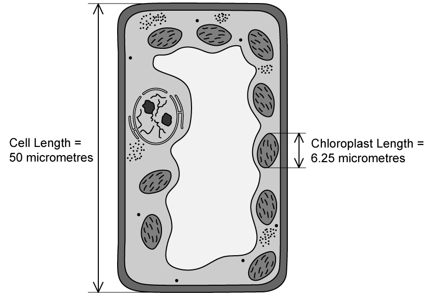
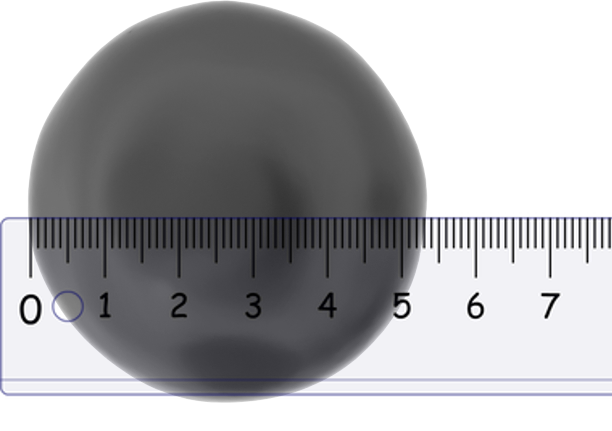
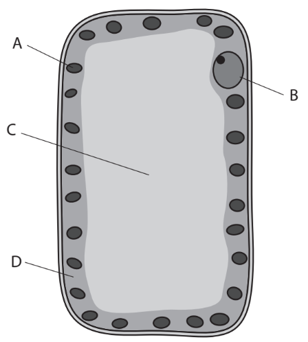
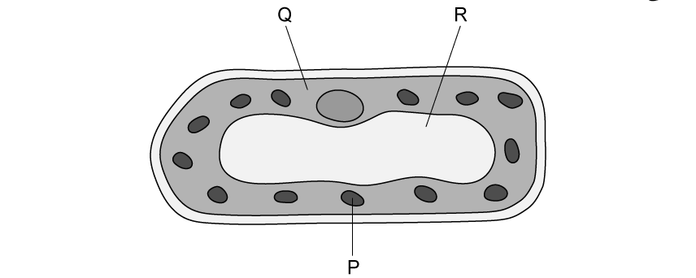
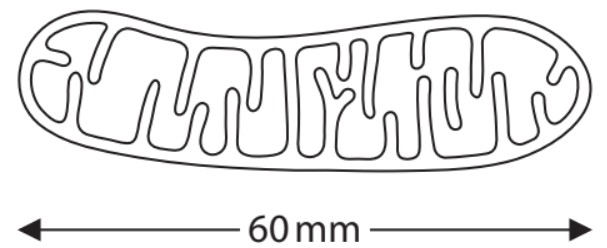
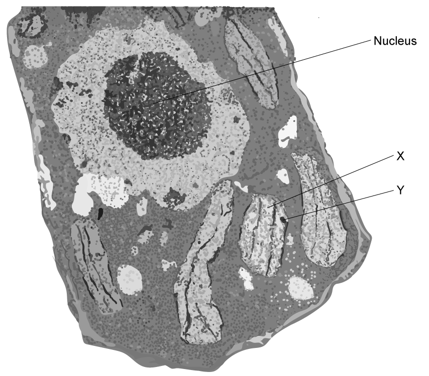
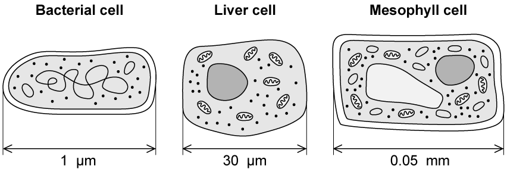

# Exam Questions — Cell Structure
**2. Structure & Function in Living Organisms** · Edexcel IGCSE Science (Double Award) (4SD0) — 17/Biology
> Source: [https://www.savemyexams.com/igcse/science/edexcel/double-award/17/biology/topic-questions/structure-and-function-in-living-organisms/cell-structure/exam-questions/](https://www.savemyexams.com/igcse/science/edexcel/double-award/17/biology/topic-questions/structure-and-function-in-living-organisms/cell-structure/exam-questions/) · 9 questions · total 58 marks

## Q1 — easy — 6 marks · exam-questions

### 1() — 3 marks — command: name — structured
The diagram below shows an image of a plant cell.

Name structures **P**, **Q** and **R.**

### 2() — 2 marks — command: multiple — structured
(i) Name** **one structure that is** **visible in the diagram that you did not** **identify in your answer to part (a).

**(1)**

(ii) State the function of the structure named in part (i)

**(1)**

### 3() — 1 mark — command: which — structured
Which of the following structures is not found in a prokaryotic cell?

| ☐ | **A** | A cell membrane |
|---|---|---|
| ☐ | **B** | Chloroplasts |
| ☐ | **C** | Plasmids |
| ☐ | **D** | Circular DNA |

## Q2 — easy — 4 marks · exam-questions

### 1() — 2 marks — command: calculate — structured
The diagram below shows a plant cell drawn to scale.

Calculate how many times longer the cell length is than the chloroplast length.

### 2() — 2 marks — command: state — structured
State two ways in which an animal cell would be different to the cell shown in part (a).

## Q3 — easy — 2 marks · exam-questions

### 1() — 2 marks — command: calculate — structured
The image below shows a red blood cell viewed under a microscope using a magnification of x6000

Use the formula provided to calculate the actual diameter of the red blood cell. Give your answer in mm.

$\mathrm{Actual} \mathrm{diameter} \mathrm{of} \mathrm{cell} \mathrm{in} \mathrm{mm}=\frac{\mathrm{diameter} \mathrm{shown} \mathrm{in} \mathrm{the} \mathrm{image} \mathrm{in} \mathrm{mm}}{\mathrm{magnification}}$

## Q4 — medium — 6 marks · exam-questions

### 1((a)) — 2 marks — command: which — structured — from paper Nov 2020 · 4BI1/1BR
Plant and animal cells have some features in common and some differences.

(i) Which of these structures is not found in animal cells?

**(1)**

| ☐ | **A** | cell membrane |
|---|---|---|
| ☐ | **B** | cell wall |
| ☐ | **C** | mitochondrion |
| ☐ | **D** | nucleus |

(ii) Which of these substances is a carbohydrate stored in plant cells?

**(1)**

| ☐ | **A** | chlorophyll |
|---|---|---|
| ☐ | **B** | glucose |
| ☐ | **C** | glycogen |
| ☐ | **D** | starch |

### 1((b)) — 4 marks — command: describe — structured — from paper Nov 2020 · 4BI1/1BR
The diagram shows a leaf palisade mesophyll cell.

Describe the function of the parts labelled **A**, **B**, **C **and **D**.

## Q5 — medium — 9 marks · exam-questions

### 1() — 3 marks — command: describe — structured
The diagram below shows a representation of a plant cell.

Describe the functions of structures **P** **Q**, and **R**.

### 2() — 2 marks — command: multiple — structured
(i) Label the diagram in part (a) with an **S** to indicate the location of the cell wall.

**(1)**

(ii) Describe the function of the cell wall.

**(1)**

### 3() — 2 marks — command: multiple — structured
Plants are one of the five groups of eukaryotes.

(i) Name another group of eukaryotes in which you might find structure **P** labelled in part (a).

**(1)**

(ii) State one other feature of the group named in part (i).

**(1)**

### 4() — 2 marks — command: suggest — structured
The cell shown below is found inside a salivary gland.

Suggest what can be concluded about the activities of the salivary gland cell from the image above.

## Q6 — hard — 7 marks · exam-questions

### 3((a)) — 1 mark — command: name — structured — from paper Nov 2020 · 4BI1/1B
A student uses a light microscope to look at a human cheek cell.

The student makes this drawing of the cell.

Name the organelle shown in the drawing.

### 3((b)) — 2 marks — command: calculate — structured — from paper Nov 2020 · 4BI1/1B
Mitochondria are organelles that are too small to be seen using a light microscope.

The drawing shows a mitochondrion that has been magnified.

The actual length of this mitochondrion is 6 μm.

[1 μm = 0.001 mm]

Calculate the magnification of this drawing.

### 3() — 4 marks — command: multiple — structured — from paper Nov 2020 · 4BI1/1B
The table gives information about mitochondria in different human cells.

| **Cell** | **Mean number of mitochondria per cell** | **Mean volume of cell in µm****3** | **Mean number of mitochondria per µm****3** |
|---|---|---|---|
| Heart muscle | 5 000 | 15 000 |   |
| Sperm | 75 | 30 | 2.50 |
| Egg | 600 000 | 4 000 000 | 0.15 |

(i) What is the mean number of mitochondria per μm3 in a heart muscle cell?

**(1)**

| ☐ | **A** | 0.33 |
|---|---|---|
| ☐ | **B** | 3 |
| ☐ | **C** | 10 000 |
| ☐ | **D** | 75 000 000 |

(ii) Comment on the differences in the data for the sperm and for the egg.

**(3)**

## Q7 — hard — 10 marks · exam-questions

### 1() — 2 marks — command: multiple — structured
The image below is an electron microscope photograph of a cell.

(i) Name the group of organisms from which the cell shown in the image has been taken.

**(1)**

(ii) Explain how you identified the group of organisms in part (i).

**(1)**

### 2() — 3 marks — command: explain — structured
Structure **Y** in part (a) is a starch granule.

Explain why structure **Y** is present inside structure **X** in the image in part (a).

### 3() — 3 marks — command: name — structured
Name** three** structures that are not clearly identifiable in the image in part (a) that you would expect to find inside cells from this group of organisms.

### 4() — 2 marks — command: calculate — structured
The cell in part (a) has been magnified 7.5 x 103 times, and the image of the nucleus has a diameter of 6.5 cm.

Use the formula below to calculate the actual diameter of the nucleus. Give your answer in μm.

$\mathrm{Actual} \mathrm{diameter}=\frac{\mathrm{image} \mathrm{diameter}}{\mathrm{magnification}}$

Note that 1 μm = 0.001 mm

## Q8 — hard — 5 marks · exam-questions

### 1() — 2 marks — command: calculate — structured
The diagram below shows three different cells.

Calculate the size ratio of the bacterial cell compared to the liver cell and mesophyll cell.

### 2() — 3 marks — command: multiple — structured
The electron microscope image below shows a section from the inside of a liver cell...

Bochimoto H, Matsuno N, Ishihara Y, Shonaka T, Koga D, Hira Y, et al., CC BY 4.0 <https://creativecommons.org/licenses/by/4.0>, via Wikimedia Commons

(i) Name the organelles indicated by **X**.

**(1)**

(ii) Use information in the image to suggest the possible cell activities that take place inside a liver cell.

**(2)**

## Q9 — hard — 9 marks · exam-questions

### 1() — 4 marks — command: explain — structured
A group of scientists carried out a study to investigate the starch content of roots in a species of grass at four points throughout the year.

Their results can be seen in the graph below.

(i) Explain why the grass roots contain starch.

**(2)**

(ii) Explain how the starch found in the roots of grass species helps to support growth of the grasses.

**(2)**

### 2() — 5 marks — command: multiple — structured
(i) Calculate the percentage change in stored starch from January to October in the graph in part (b).

**(2)**

(ii) Suggest an explanation for the change calculated in part (i).

**(3)**
