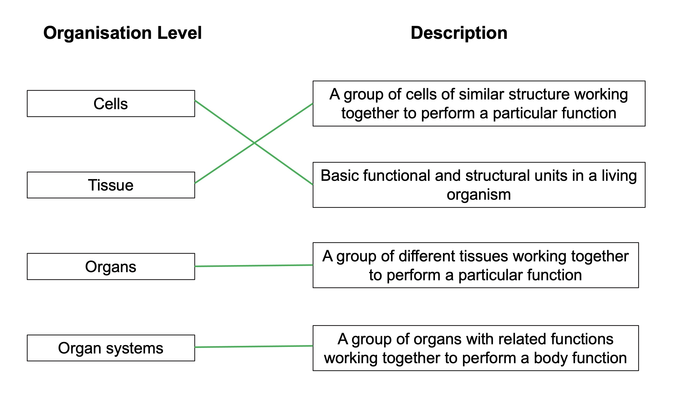
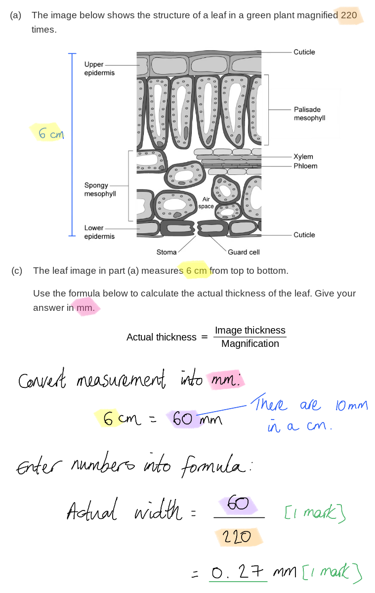

# Mark Schemes — Levels of Organisation
**2. Structure & Function in Living Organisms** · Edexcel IGCSE Science (Double Award) (4SD0) — 17/Biology

## Q1 — easy — 7 marks · exam-questions

### 1() — 1 marks
The levels of organisation from the smallest to the largest is **B**.

This is because organelles are found within cells, a group of cells makes up a tissue, a group of tissues makes up an organ, and several organs make up an organ system.

**[Total: 1 mark]**

### 2() — 2 marks
The term organ can be defined as follows...

- A group/collection of tissues...; **[1 mark]**
- ...working together to carry out a function;** [1 mark]**

**[Total: 2 marks]**

> *The term organ is one that you will be very familiar with, but it is essential that you can give the biological definition; an organ is a group of tissues that work together to perform a particular function, E.g. the heart contains muscle tissue, elastic tissue and connective tissue, all of which work together to pump the blood.*

### 3() — 2 marks
(i) An example of an organ found in plants is...

Any **one** of the following:

- Stem; **[1 mark]**
- Root; **[1 mark]**
- Flower; **[1 mark]**
- Bulb; **[1 mark]**
- Tuber; **[1 mark]**
- Leaf; **[1 mark]**
- Fruit;** [1 mark]**

(ii) An example of an organ found in animals is...

Any **one** of the following:

- Brain; **[1 mark]**
- Skin; **[1 mark]**
- Heart; **[1 mark]**
- Lung; **[1 mark]**
- Liver; **[1 mark]**
- Kidney; **[1 mark]**
- Small / large intestine; **[1 mark]**
- Stomach; **[1 mark]**
- Eye; **[1 mark]**
- Ear;

*Accept other examples of animal organs, e.g. from the reproductive system.*

**[Total: 2 marks]**

> *There are many examples to choose from here, so make sure that you can name a few examples of organs in both plants and animals.*

### 4() — 2 marks
Differences between organisms in the plant and animal groups include...

Any **two** of the following**:**

- Plants carry out photosynthesis / have chloroplasts / make their own food **WHILE** animals do not / feed on other organisms; **[1 mark]**
- Plants have (cellulose) cell walls **WHILE** animals do not; **[1 mark]**
- Plants store carbohydrates as starch **WHILE** animals store carbohydrates as glycogen; **[1 mark]**
- Plants do not have a nervous system / nervous co-ordination **WHILE** animals do; **[1 mark]**
- Plants (usually) grow in one place / are immobile / not motile **WHILE** animals can (usually) move from place to place / are mobile/motile; **[1 mark]**

**[Total: 2 marks]**

> *This question covers content from section 1 on the variety of living organisms.*

## Q2 — easy — 7 marks · exam-questions

### 1() — 2 marks
The term tissue can be defined as follows...

- A group/collection of similar cells...; **[1 mark]**
- ...working together to carry out a particular function;** [1 mark]**

**[Total: 2 marks]**

> *The term **tissue** is one that we use frequently in biology, but many students struggle to define it. Make sure that you are confident about giving a definition for this term.*

### 2() — 2 marks
(i) The tissue in the image is...

- Blood;** [1 mark]**

> *The cells visible in the image work together to carry out the function of transport, so they can be described as tissue. The cells of the blood are suspended with a liquid (the blood plasma), so blood is an unusual example of a tissue.*

(ii) The organ system associated with blood is...

- The circulatory/circulation system; **[1 mark]**

> *The blood is transported within blood vessels and pumped by the heart; these are the organs of the circulatory system.*

**[Total: 2 marks]**

### 3() — 2 marks
Two examples of tissues found in animals include...

Any **two** of the following:

- Muscle / a named example, e.g. smooth muscle / cardiac muscle / skeletal muscle; **[1 mark]**
- Epithelial / a named example, e.g. ciliated epithelium / the epidermis / the lining of the small intestine; **[1 mark]**
- Connective / a named example, e.g adipose / cartilage / elastic / bone; **[1 mark]**
- Nerve/nervous /  a named example, e.g. the retina; **[1 mark]**

*Reject 'blood' for marking point 3 as this was covered in part (b).*

**[Total: 2 marks]**

> *Note that blood (covered in part (b) is technically a type of connective tissue, but you would not be expected to know this, so **connective** is an acceptable answer here.*

### 4() — 1 marks
It is not possible for prokaryotes to have tissues because...

- Prokaryotes are single-celled organisms (and tissues are made up of many cells); **[1 mark]**

**[Total: 1 mark]**

## Q3 — easy — 10 marks · exam-questions

### 1() — 4 marks
The table should be completed as follows...

| **Structure** | **Level of organisation** |
|---|---|
| Shoots | Organ system |
| Leaf | Organ; **[1 mark]** |
| Chloroplast | Organelle; **[1 mark]** |
| Palisade mesophyll | Tissue; **[1 mark]** |
| Flower | Organ; **[1 mark]** |

**[Total: 4 marks]**

> *A leaf is a **group of tissues**, e.g. palisade mesophyll, spongy mesophyll and epidermis, that work together to carry out photosynthesis, and a flower is a **group of tissues** that work together to enable the plant to reproduce; they are therefore examples of **organs**.*

> *Chloroplasts are structures found **within plant cells** that carry out photosynthesis. Structures within cells are known as **organelles**.*

> *Palisade mesophyll is a **collection of cells** (known as palisade cells) that work together to carry out photosynthesis; it is therefore a **tissue**.*

### 2() — 2 marks
Organ systems found in animals include...

Any **two** of the following:

- Nervous; **[1 mark]**
- Digestive; **[1 mark]**
- Circulatory/cardiovascular; **[1 mark]**
- Respiratory/breathing; **[1 mark]**
- Immune; **[1 mark]**
- Lymphatic; **[1 mark]**
- Musculoskeletal/muscular/skeletal; **[1 mark]**
- Reproductive; **[1 mark]**
- Urinary/excretory;** [1 mark]**

**[Total: 2 marks]**

### 3() — 1 marks
The ability to respond to water in the soil demonstrates that plants are living organisms because...

Any **one** of the following:

- It shows sensitivity / the ability to sense the environment/surroundings; **[1 mark]**
- It shows the ability to respond to the environment/surroundings;** [1 mark]**

**[Total: 1 mark]**

> *Sensitivity is one of the characteristics of living organisms. It involves the ability to determine information about the surroundings and to respond to this information.*

### 4() — 3 marks
Other characteristics of living organisms include...

Any **three** of the following:

- Movement; **[1 mark]**
- Respiration;
- Control (of the internal environment); **[1 mark]**
- Growth; **[1 mark]**
- Reproduction; **[1 mark]**
- Excretion; **[1 mark]**
- Nutrition;** [1 mark]**

**[Total: 3 marks]**

> *Remember the 'MRS C GREN' mnemonic here; it is essential that you can list the characteristics of living things.*

## Q4 — easy — 6 marks · exam-questions

### 1() — 2 marks
The completed lines should be as follows...

- 3 or 4 lines correct;** [2 marks]**
- 1 or 2 lines correct;** [1 mark]**

***Reject*** *any mark when more than one line has been drawn from an organisation level.*

**[Total: 2 marks]**

### 2() — 1 marks
**The correct answer is ****D****.**

Organelles are structures within cells that carry out specific roles, such as the nucleus and chloroplasts.

Bacterial cells are prokaryotic so do not contain any internal membrane-bound organelles. This means that they have fewer types of organelle than eukaryotic plant cells.

**[Total: 1 mark]**

### 3() — 3 marks
The correct completed table is as follows...

| **Organ System** | **Organ** |
|---|---|
| Digestive system | Oesophagus / stomach / pancreas / small intestine / gall bladder / large intestine; **[1 mark]** |
| Circulatory system | Heart / arteries / veins / blood vessels; **[1 mark]** |
| Respiratory system | Lung / diaphragm / trachea / bronchi / bronchioles; **[1 mark]** |

**[Total: 3 marks]**

## Q5 — medium — 9 marks · exam-questions

### 1() — 5 marks
(i) One type of organelle visible is...

Any **one** of the following:

- Nucleus;** [1 mark]**
- Chloroplast;** [1 mark]**
- Vacuole;** [1 mark]**

*Ignore cell wall, cell membrane and cytoplasm.*

> *An organelle is a cellular structure found within a cell. Here the **visible** internal structures are the nucleus, chloroplasts, and vacuoles; other organelles that you may have come across are not visible here.*

> *Note that structures such as the cell wall and the cell membrane are not organelles, as they are not structures **within** the cells. The cytoplasm is not a **structure** so this is also not an organelle.*

(ii) Types of cell visible include...

Any **two** of the following:

- Palisade (mesophyll) <u>cell</u>;** [1 mark]**
- Guard cell;** [1 mark]**
- Epidermis <u>cell</u>;** [1 mark]**
- Spongy mesophyll <u>cell</u>;** [1 mark]**
- Xylem <u>cell</u>/<u>vessel</u>;** [1 mark]**

*Ignore phloem as this is not a cell type.*

> *Any cell type visible in the diagram is an acceptable answer. You must make it clear that you are referring to the **individual cells** rather than the tissue type to which the cells belong.*

(iii) Types of tissue visible include...

Any **two** of the following:

- Epidermis/dermal (tissue); **[1 mark]**
- Palisade mesophyll (tissue); **[1 mark]**
- Spongy mesophyll (tissue); **[1 mark]**

**[Total: 5 marks]**

### 2() — 2 marks
The leaf is an example of an organ because...

- It contains a group/collection of / several <u>tissues</u>; **[1 mark]**
- Which work together to carry out <u>photosynthesis</u>;** [1 mark]**

**[Total: 2 marks]**

> *Here you need to apply your knowledge of the term 'organ' to the specific example of a leaf.*

> *Leaves are the organs of the plant that are adapted to maximise photosynthesis. They contain **several tissues** which **work together** to carry out this particular function.*

### 3() — 2 marks
The actual leaf thickness is...

- 60 ÷ 220; **[1 mark]**
- 0.27 (mm);** [1 mark]**

*Full marks can be awarded for the correct answer in the absence of other calculations.*

**[Total: 2 marks]**

## Q6 — medium — 13 marks · exam-questions

### 1() — 4 marks
(i) Structures P, Q and R are...

- P = nucleus; **[1 mark]**
- Q = cell membrane; **[1 mark]**
- R = cytoplasm;** [1 mark]**

(ii) The function of one other structure visible in the diagram is...

Any **one** of the following:

- (Mitochondria) release energy / carry out aerobic respiration; **[1 mark]**
- (Cilia) sweep mucus out of the airways / towards the throat; **[1 mark]**

> *Note that this subpart asks for the function of one **additional** structure that is **visible** in the diagram. No marks will be awarded for describing structures that are not visible, or for describing functions of organelles already named in part (i).*

**[Total: 4 marks]**

### 2() — 4 marks
The table can be completed as follows...

| **Level of organisation** | **Example from diagram** |
|---|---|
| Cell | Ciliated epithelial cell (found in the epithelium) |
| Cell | Goblet cell; **[1 mark]** |
| Tissue | Epithelium / basement membrane / lamina propria / (smooth) muscle / cartilage / gland; **[1 mark]** |
| Organ | Larynx / trachea / bronchus / lung; **[1 mark]** |
| Organ system; **[1 mark]** | Respiratory system |

**[Total: 4 marks]**

> *This question requires you to **apply your understanding **of levels of organisation to the **unfamiliar structures **presented in the diagram. Remember that **cells** can only ever be **individual cell types**, so any label that indicates a structure containing multiple cells must be a tissue or larger.*

> *Don't panic if you come across questions that involve unfamiliar contexts in an exam; you will never be tested on something that expects you to **know** the content that goes beyond your specification, though it is likely that you will be expected to use your knowledge together with reasoning skills to work out answers.*

### 3() — 3 marks
The cells and tissues of the trachea are affected as follows during an asthma attack......

Any **three** of the following:

- <u>More</u> mucus is produced; **[1 mark]**
- The basement membrane/muscle layer becomes thick<u>er</u>/<u>thickens</u>; **[1 mark]**
- <u>More</u> cell types are present (in the lamina propria); **[1 mark]**
- Mast cells / macrophages / neutrophils appear/arrive/are present; **[1 mark]**
- <u>More</u> glands are present;** [1 mark]**

**[Total: 3 marks]**

> *This is a **describe** question, so once again you are not expected to **know** anything about this scenario, just to use your powers of observation and skills of comparison. Make sure that when you are describing how something **changes**, that you use **comparative language** such as **more**, thick**er**, etc.*

### 4() — 2 marks
The changes would affect the function of the breathing system as follows...

Any **two** of the following:

- The airways/trachea would be narrower/reduced in diameter; **[1 mark]**
- Airflow/(volume of) air entering lungs/gas exchange would be reduced; **[1 mark]**
- Mucus would trap more pathogens/dust/bacteria; **[1 mark]**
- An increased rate of infections (due to trapped pathogens); **[1 mark]**
- The cilia may be immobilised / unable to waft/move/beat mucus (due to increased mucus); **[1 mark]**
- More coughing (in the attempt to remove mucus);** [1 mark]**

*Accept references to reduced volumes of air *leaving* the lungs for marking point 2.*

**[Total 2 marks]**

> *This is a **suggest** question, meaning that you are not expected to **know **the answer, but that you are expected to use your knowledge and the information provided to **work out what the answer could be**.*

> *Here your observations from part (c) include changes that would result in the **narrowing** of the trachea, so this will **reduce the space available for air to move** in and out of the lungs.*

> *If you have studied the structure of the breathing system later in topic 2 then you may be aware of the function of the mucus in the airways, so you could work out that an increase in mucus would result in **more trapped dust and bacteria**, which could lead to **infection**. The increased volume of mucus may **prevent the cilia from functioning** to remove the mucus, so could lead to **coughing** in the attempt to remove mucus from the airways.*

## Q7 — medium — 13 marks · exam-questions

### 1() — 6 marks
The table should be completed as follows...

| **Organ system** | **Function** | **Example of organ** | **Example of cell** |
|---|---|---|---|
| Circulatory | Pumping blood / oxygen / nutrients around the body; **[1 mark]** | Heart / blood vessel / artery / vein; **[1 mark]** | Red blood cell |
| Reproductive | Enabling the production of offspring | Uterus | Sperm / egg cell; **[1 mark]** |
| Nervous | Sensing the environment / coordinating the body; **[1 mark]** | Brain / spinal cord / sense organ, e.g. tongue / ear / skin; **[1 mark]** | Neurone |
| Digestive | The breakdown of food and absorption of nutrients | Oesophagus / stomach / pancreas / small intestine / large intestine; **[1 mark]** | Epithelial cell |

*Accept other correct organs of the digestive system, e.g. mouth, salivary glands, liver, gall bladder, rectum.*

**[Total: 6 marks]**

> *It is a good idea to have some overall knowledge of the main organ systems of the body, their functions, and the organs and specialised cells involved.*

> *While you are not necessarily expected to have details of all of these systems at your fingertips at this early point in the spec, you should hopefully have covered all of these systems to some extent at key stage 3. *

### 2() — 2 marks
(i) The multicellular level of organisation that is missing from the table in part (a) is...

- Tissue;** [1 mark]**

(ii) An example of an animal tissue is...

Any **one** of the following:

- Epithelial / named example, e.g. epidermis / lining of the airways / lining of the intestine; **[1 mark]**
- Muscle / named example, e.g. cardiac muscle / skeletal muscle / smooth muscle; **[1 mark]**
- Connective / named example, e.g. blood / elastic tissue / bone / cartilage / fat; **[1 mark]**
- Nervous; **[1 mark]**

***Accept ****any other correctly named tissue*

**[Total: 2 marks]**

### 3() — 3 marks
(i) Structures X and Y are...

- X = nucleus; **[1 mark]**
- Y = cell membrane; **[1 mark]**

> *This question requires you to **apply** your basic knowledge of cell structure to this possibly unfamiliar type of cell.*

> *The only real challenge here is likely to be the unusual shape of the nucleus. This shape allows the phagocyte to have increased flexibility and means that it can move around the body to the site of an infection.*

(ii) Phagocytes contain many lysosomes because...

Any **one** of the following:

- The enzymes (inside the lysosome) can break down/digest pathogens; **[1 mark]**
- It enables them to digest pathogens quickly / digest multiple pathogens at the same time;** [1 mark]**

> *The question stem tells us that the role of phagocytes is to engulf and digest pathogens, and we are told in part (ii) that lysosomes contain many enzymes. All that is required here is to **notice and link these two ideas**. Credit is also available for considering how the presence of **many** lysosomes could be an advantage.*

> *Note that if you have studied the section of the specification relating to the role of white blood cells in the immune system then you would be expected to **know** the role of the digestive enzymes inside a phagocyte without being supplied with this information in the question.*

**[Total: 3 marks]**

### 4() — 2 marks
The function of the immune system is to...

- Fight/defend against infection/infectious disease; ** [1 mark]**

**AND**

Any **one** of the following:

- Kill/destroy/engulf pathogens/bacteria/viruses; ** [1 mark]**
- Produce antibodies; ** [1 mark]**
- Produce antitoxins;** [1 mark]**

**[Total: 2 marks]**

> *Again this is a topic that isn't covered until later in the specification, but you should be aware that the role of the immune system is to fight infectious disease. It does this by killing pathogens and by producing antibodies and antitoxins.*

## Q8 — hard — 11 marks · exam-questions

### 1() — 2 marks
The basidiocarp can be described as an organ because...

- It contains several different tissues; **[1 mark]**
- (The tissues) work together to carry out the function of spore production / reproduction; **[1 mark]**

**[Total: 2 marks]**

### 2() — 3 marks
(i) A tissue from part (a) is...

Any **one** of the following:

- Trama; **[1 mark]**
- Hymenium; **[1 mark]**

> *While several structures are labelled on the diagram, such as the stipe and the gills, the only places where groups of cells can clearly be seen together are in the trama and the hymenium.*

(ii) A cell from part (a) is...

Any **one** of the following:

- Basidium; **[1 mark]**
- Basidiospore; **[1 mark]**

> *The basidia (singular basidium) are stalk-like cells that support the basidiospore cells.*

(iii) An organelle from part (a) is...

- Nucleus; **[1 mark]**

> *Nuclei are the only cell organelles visible in the diagram in part (a). Note that each cell contains more than one nucleus; this is a feature of fungal hyphae.*

**[Total: 3 marks]**

### 3() — 3 marks
The thread-like structures of the trama can be described as follows...

Any **three** of the following:

- The structures are cells called hyphae; **[1 mark]**
- They are multinucleate / contain multiple nuclei; **[1 mark]**
- They have cell walls made of chitin; **[1 mark]**
- They can be organised into a mycelium / mycelia; **[1 mark]**

**[Total: 3 marks]**

> *You will have learned about the features of thread-like fungal cells in topic 1.*

### 4() — 3 marks
Haustoria function as follows...

- Haustoria grow/extend into the cells of another/ a host organism / plant cells; **[1 mark]**
- Enzymes are released from the fungus into their surroundings **AND **extracellular digestion occurs; **[1 mark]**
- The haustoria absorb the digested/broken down molecules; **[1 mark]**

**[Total: 3 marks]**

> *This is a suggest question,and is based on assumed knowledge of fungal nutrition from topic 1. You should be aware that fungi carry out extracellular digestion, so you need to apply this knowledge to the possible mechanism of haustoria function here.*

## Q9 — hard — 15 marks · exam-questions

### 1() — 3 marks
(i) Chlamydomonas belongs to the following group of organisms...

- Protoctists; **[1 mark]**

(ii) Chlamydomonas is classified this way because...

- It is unicellular / single celled / a single celled organism; **[1 mark]**
- It has internal membranes / a nucleus / a chloroplast; **[1 mark]**

> *Protoctists are single-celled organisms that do not fit clearly into any other group of organisms.*

> *The fact that Chlamydomonas is **single-celled** tells us that it is not a plant (plants are multicellular organisms) and the fact that it has **internal cell membranes** tells us that it is not a bacterium.*

### 2() — 4 marks
(i) *Volvox* is not considered to have tissues or organs because...

Any **two** of the following:

- The somatic cells form a hollow ball (so do not have the structure of a tissue); **[1 mark]**
- The somatic cells are spaced out / connected to each other only by strands of cytoplasm (so do not have the structure of a tissue); **[1 mark]**
- Gonidia cells are not found in groups (so they do not count as a tissue); **[1 mark]**
- The two cell types do not work together to carry out a common function (so they do not form an organ); **[1 mark]**
- Two different cell types are not enough to form an organ; **[1 mark]**

> *This is a tricky question that requires you to **consider the features of tissues and organs** carefully before thinking about why it is that **Volvox** does not meet the criteria for tissues or organs.*

> *A tissue is a group of similar cells carrying out a single function. While it could be argued that the somatic cells and gonidial cells work with other cells of their type to carry out a specific function (somatic cells = motion and gonidial cells = reproduction), the structural arrangement of these cells do not match what we would expect from a tissue.*

> *Organs consist of several tissues working together to carry out a single function. The two groups of cells do not work together, and it could be argued that two cell types are not enough to form an organ.*

(ii) *Volvox* is thought to be a useful model for studying the evolutionary transition between single-celled and multi-cellular organisms because...

Any **two** of the following:

- The cells of *Chlamydomonas* and *Volvox* are very similar; **[1 mark]**
- *Chlamydomonas* cells could have started working together to form a multicellular organism/*Volvox*; **[1 mark]**
- *Volvox* is a very simple multicellular organism / only has two cell types **SO** is easy to study (compared to, e.g. a mammal); **[1 mark]**

> *This is another tricky question, and you are not required to know anything about evolution at this stage in your studies. Provided that you understand the concept of uni- vs multicelled organisms, you should be able to grasp the idea that at some stage in the history of life **single-celled organisms came together to form multicellular organisms**. **Volvox** is considered to be a useful organism in the study of how this might have happened due to its similarity to existing single-celled organisms and its simple structure.*

**[Total: 4 marks]**

### 3() — 3 marks
The structural organisation of kelp can be contrasted with that of *Volvox* as follows...

- Kelp has organs (e.g. holdfast / stipe etc.) **WHILE** *Volvox* does not; **[1 mark]**
- Kelp has several layers of cells **WHILE** *Volvox* is a hollow ball / has only one (outer) layer of cells; **[1 mark]**
- Kelp has several tissue types (e.g. epidermis / medulla) **WHILE** *Volvox* does not have tissues; **[1 mark]**

**[Total:3 marks]**

> *When a question asks you to give contrasting features of two items, you should be sure that each statement contains a **direct comparison**. For example, here you would not get credit for simply stating that 'kelp has organs'; you need to say **how this is different** to **Volvox**.*

### 4() — 5 marks
(i) The hyphae in the medulla are crucial to the growth of the kelp because...

Any **four** of the following:

- The frond/leaf is the only part of the kelp located near to the water's surface (due to flotation provided by the air bladder); **[1 mark]**
- The leaf/frond absorbs light energy from the sun **SO** can carry out photosynthesis; **[1 mark]**
- Photosynthesis produces glucose; **[1 mark]**
- Glucose must be transported **SO** that the cells (in other parts of the kelp) can carry out respiration; **[1 mark]**
- Respiration releases energy that allows the kelp to grow; **[1 mark]**

> *This question requires you to use your knowledge of the role of photosynthesis in photosynthesising organisms, together with information about kelp nutrition and structure provided in the question.*

> *The key with extended questions like this is to ensure that you **continue your line of reasoning to its conclusion**. You have been asked to** link** the ideas of transport and growth, so you should consider what will need to be transported (glucose), why transport is necessary (photosynthesis only occurs in the light), and why the transported substance is needed for growth (respiration releases energy).*

(ii) Hyphae can also be found in...

- Fungi; **[1 mark]**

**[Total: 5 marks]**
