# Mark Schemes — Movement of Substances Into & Out of Cells
**2. Structure & Function in Living Organisms** · Edexcel IGCSE Science (Double Award) (4SD0) — 17/Biology

## Q1 — easy — 4 marks · exam-questions

### 1() — 1 marks
A substance that cells must transport across the cell membrane might include:

Any **one **from the following**:**

- Carbon dioxide / oxygen; ** [1 mark]**
- Glucose / amino acids / fatty acids + glycerol; ** [1 mark]**
- Mineral ions / water;** [1 mark]**

**[Total: 1 mark]**

> *There are many substances that cells need which exceed the list given in this mark scheme. The substances named in this question are key to the most fundamental processes that take place in cells, including photosynthesis and respiration.*

### 2() — 1 marks
The gas particles should appear as follows:

- The particles should be evenly distributed in the space; **[1 mark]**

**[Total: 1 mark]**

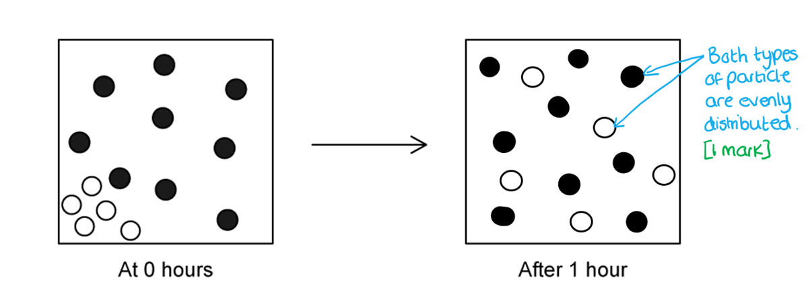

### 3() — 1 marks
The process in part (b) is...

- (Simple / gaseous) <u>diffusion</u>;** [1 mark]**

**[Total: 1 mark]**

> *This couldn't be osmosis as there are no water particles or partially permeable membrane.*

### 4() — 1 marks
**Final answer:** **The correct answer is ****C****, movement of oxygen into the leaf of a plant.**

**B** and** D** are both examples of where substances move from a low concentration to a higher concentration requiring the process of active transport.

**A** is referring to water molecules passing across a partially permeable membrane and therefore relates to osmosis.

**[Total: 1 mark]**

## Q2 — easy — 9 marks · exam-questions

### 1() — 4 marks
The table** **should be completed as follows:

| **Feature** | **✓ / ✕** |
|---|---|
| Involves the movement of gases | **Final answer:** **✕** |
| Requires energy from respiration | **Final answer:** **✕** |
| Movement occurs through a partially permeable membrane | **Final answer:** **✓** |
| Particles move down a concentration gradient | **Final answer:** **✓** |

Allow **[1 mark]** for each correct ✓ or ✕

**[Total: 4 marks]**

### 2() — 1 marks
The water particles will move...

- From left to right; **[1 mark]**

**[Total: 1 mark]**

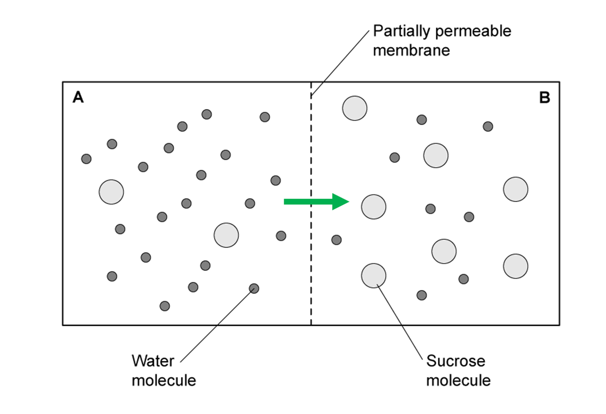

### 3() — 3 marks
An example of where diffusion of gases are important in multicellular organisms may include...

Any **three **from the following:

- Gas exchange in the lungs (of animals) for <u>respiration</u> **OR** gas exchange in the leaves for <u>respiration</u> **OR **gas exchange in the gills for respiration; **[1 mark]**
- <u>Oxygen</u> moves from alveoli into the blood (animals) **OR **in** **from the air (spaces) into the spongy mesophyll cells (plants) **OR** from water in into the blood (fish); **[1 mark]**
- <u>Carbon dioxide</u> moves from the blood into the alveoli (animals) **OR **out from the spongy mesophyll cells into the air spaces (plants) **OR **from the blood to the water (fish); **[1 mark]**

**OR**

- Gas exchange in the leaves for <u>photosynthesis</u>; **[1 mark]**
- <u>Oxygen</u> moves out from the spongy mesophyll/palisade cells into the air (spaces); **[1 mark]**
- <u>Carbon dioxide</u> moves in** **from the air (spaces) into the palisade/spongy mesophyll cells; **[1 mark]**

**[Total: 3 marks]**

### 4() — 1 marks
A gas exchange surface may have the following features to maximise diffusion...

Any **one** from the following:

- Thin/short diffusion distance; **[1 mark]**
- Steep concentration gradient; **[1 mark]**
- Large surface area (to volume ratio) for gas exchange; **[1 mark]**

**[Total: 1 mark]**

## Q3 — easy — 7 marks · exam-questions

### 1() — 2 marks
The cell better adapted for diffusion is...

- Cell X; **[1 mark]**
- (Because) it has a larger surface area to volume ratio / a folded membrane which gives a bigger surface for diffusion; **[1 mark]**

*Allow any description of the folded membrane*

*Do not allow 'X has villi'*

**[Total: 2 marks]**

### 2() — 2 marks
The lines should be drawn as follows:

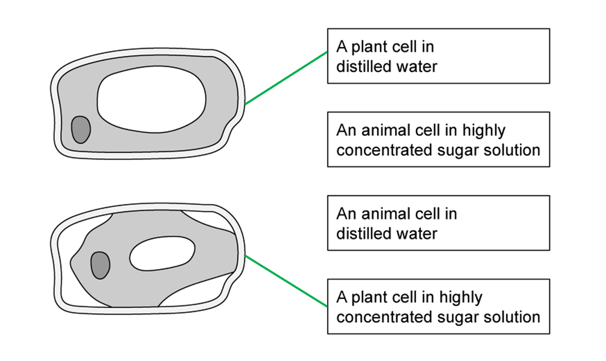

Award **[1 mark]** for each correct line

**[Total: 2 marks]**

### 3() — 2 marks
The potato disks in Beaker 5 decreased in mass because...

Any **two **from the following:

- <u>Water</u> moved out of the potato; **[1 mark]**
- By <u>osmosis</u>; **[1 mark]**
- From a high water potential (in the potato) to a low water potential (in the sucrose solution); **[1 mark]**

**[Total: 2 marks]**

### 4() — 1 marks
**Final answer:** **The correct answer is ****C**** because.. **

Keeping the potato pieces the same size (and the same total mass) makes this a fair test, which is what a control variable should do.

**A** is incorrect because the sugar concentration is the independent variable, the thing that the student is deliberately changing to examine the effects of changing it.

**B** is incorrect because repeating the experiment will add reliability but does not control any of the variables of the experiment.

**D** is incorrect because calculating an average (the mean) does not control the variables that might affect the results.

**[Total: 1 mark]**

## Q4 — easy — 5 marks · exam-questions

### 1() — 2 marks
The table** **should be completed as follows:

| **1** | Measure out 100ml of each salt solution into 5 different test tubes |
|---|---|
| **Final answer:** **5** | Remove the chips, pat dry and reweigh |
| **Final answer:** **2** | Cut 5 potato chips of similar size and dimensions |
| **Final answer:** **4** | Place 1 chip into each concentration of salt solution and leave for 1 hour |
| **Final answer:** **3** | Record the mass of the potato chips |

Allow **[2 marks]** for a correct order as shown above.

Allow** [1 mark]** for answers with 1 step out of place

*No marks should be awarded for answers with more than 1 step in the wrong order*

**[Total: 2 marks]**

> *You don't necessarily need to be familiar with the practical method to answer this question, but you should be careful to ensure that the steps are in a logical order.*

### 2() — 1 marks
The mass of the chip increased in

- 0 mol dm-3 / distilled water; **[1 mark]**

**[Total: 1 mark]**

### 3() — 1 marks
**Final answer:** **The correct answer is C because...**

The water moved from a high water concentration (distilled water is pure water) to a low water concentration (in the potato).

The mass gained comes from the water that moves into the potato, therefore **A** cannot be correct.

The salt does not move so **B** is not correct.

There is no reaction so **D** is not correct.

**[Total: 1 mark]**

### 4() — 1 marks
The scientist could tell this from the results in the graph because...

- The mass (of the chip in 0.5 mol dm-3 salt solution) remained the same after 1 hour; **[1 mark]**

**[Total: 1 mark]**

## Q5 — medium — 9 marks · exam-questions

### 1() — 2 marks
The percentage change of the egg placed in the 0.4 mol dm-3 salt solution is:

- (1.3 / 74.2) x 100 = 1.75; **[1 mark]**** **
- = 1.8%;** ****[1 mark] **

*Full marks awarded for the correct answer only*

**[Total: 2 marks]**

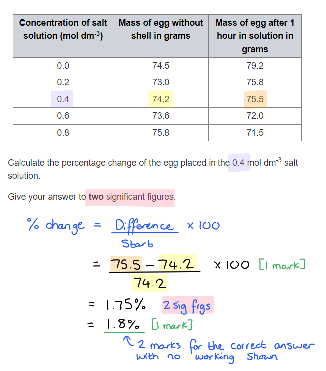

### 2() — 3 marks
The mass of the eggs in some solutions decreased because:

- The mass decreased when water moved out of the egg by <u>osmosis</u>;** [1 mark]**
- Through a partially permeable membrane; **[1 mark]**
- Because the solution it was in was more concentrated (and the solution in the egg was more dilute); **[1 mark]**

**[Total: 3 marks]**

### 3() — 3 marks
In order to determine an estimate of the concentration of the solution inside an egg, the student will need to:

Any **three** of the following:

- Calculate the percentage change of each egg placed in a salt solution; **[1 mark]**
- Plot the percentage change in mass on a (scatter) graph; **[1 mark]**
- Draw a line of best fit;** [1 mark]**
- Determine the concentration where the line crosses the zero percentage change (in mass); **[1 mark]**

**[Total: 3 marks]**

> *You may be asked to plot a graph and work this out for yourself. Make sure you feel confident with your understanding of this process. *

### 4() — 1 marks
One safety precaution would be...

- Goggles / lab coat / tongs / tie hair / tuck tie away / gloves; **[1 mark]**

**[Total: 1 mark]**

## Q6 — medium — 6 marks · exam-questions

### 1() — 1 marks
The expected result would be...

- The colour/pigment of the beetroot would diffuse out into the water (changing it to purple/red/pink); **[1 mark]**

**[Total: 1 mark]**

### 2() — 2 marks
One** **variable that must be controlled to make the results comparable is...

Any **two **of the following:

- The cubes/pieces of beetroot must have the same dimensions / be the same size (and shape) / have the same length on each side of the cube; **[1 mark]**
- (So that they all have) equal surface areas and volumes / surface area to volume ratio; **[1 mark]**
- (Because) this could affect the rate at which the pigment diffuses out into the water; **[1 mark]**

**[Total: 2 marks]**

> *Remember that control variables are factors that must be kept the same in an experiment in order to make sure that only the independent variable causes the results to vary. *

### 3() — 3 marks
The result was different at higher temperatures compared to room temperature because...

Any **three** of the following:

- At higher temperatures particles have more (kinetic) energy; **[1 mark]**
- This results in the faster movement of particles (compared to when they have less energy); **[1 mark]**
- The pigment particles diffuse across the membrane faster at higher temperatures; **[1 mark]**
- The cell membrane of the beetroot cells may become damaged at higher temperatures (so more pigment can diffuse out); **[1 mark]**

**[Total: 3 marks]**

## Q7 — medium — 9 marks · exam-questions

### 1() — 3 marks
The statement is incorrect due to the following errors...

Any **three** of the following:

- Osmosis is a passive process (not active); **[1 mark]**
- The student does not specify that the membrane is partially permeable; **[1 mark]**
- The student does not specify water molecules; **[1 mark]**
- The student does not specify what the concentration relates to (i.e. whether it is the solute or the water);** [1 mark]**

**[Total: 3 marks]**

### 2() — 1 marks
The changes to cell **B** are...

Any **one** of the following:

- The cell has decreased/reduced in size; **[1 mark]**
- The cell appears to be shrivelled / spiky / crenated; **[1 mark]**
- The cell has lost its biconcave shape; **[1 mark]**

**[Total: 1 mark]**

> *Here you have been asked to describe the changes to a biological structure; no marks are available for explaining what you can see.*

### 3() — 2 marks
The cell labelled **B** has changed shape because...

Any **two** of the following:

- There is (net) movement of water out of the cell; **[1 mark]**
- (Movement is) by <u>osmosis</u>;** [1 mark]**
- There are fewer water molecules / is a low water potential / a higher solute concentration outside the cell **OR **there are more water molecules / is a higher water potential / a lower solute concentration inside the cell;** [1 mark]**

***Accept**** water concentration for water potential*

**[Total: 2 marks]**

### 4() — 3 marks
After being in water the red blood cells are likely to have...

Any **three **from the following:

- Burst/lysed (as the cell membrane ruptured); **[1 mark]**
- As there was a movement of water into the cell by <u>osmosis</u>; **[1 mark]**
- There are fewer water molecules / is a low water potential / a higher solute concentration inside the cell **OR **there are more water molecules / is a higher water potential / a lower solute concentration outside the cell; **[1 mark]**

***Accept**** water concentration for water potential*

**[Total: 3 marks]**

> *Again, take care to note the command words used here. For parts (c) and (d) you need to **explain** what happens to the red blood cell, therefore, use your knowledge of osmosis to give answers that explain **why**.*

## Q8 — medium — 12 marks · exam-questions

### 1() — 1 marks
Diffusion is...

- The movement of molecules/liquid/gas from a region of higher concentration to a region of lower concentration (until evenly distributed); **[1 mark]**

**[Total: 1 mark]**

### 2() — 4 marks
(i) Two other factors that affect the rate of diffusion are...

Any **two** of the following:

- The concentration gradient **OR **the difference in concentration between the two regions; **[1 mark]**
- The temperature; **[1 mark]**
- The thickness of the membrane separating the two regions /** **the diffusion distance; **[1 mark]**

(ii) These two factors affect the rate of diffusion as follows...

Any **relevant two** answers from the following:

- The greater the difference in concentration / the steeper the concentration gradient, the quicker the rate of diffusion; **[1 mark]**
- The greater the temperature, the quicker the rate of diffusion; **[1 mark]**
- The thinner the membrane / shorter the diffusion distance, the quicker the rate of diffusion; **[1 mark]**

*The description must match the factors given in part (i).*

**[Total: 4 marks]**

### 3() — 3 marks
The completed table is as follows:

| **Length of one side of the cube (cm)** | **Surface area of cube (cm****2****)** | **Volume of cube (cm****3****)** | **Surface area : Volume Ratio** |
|---|---|---|---|
| 1 | 6 | 1 | 6:1 |
| 2 | 24 | **8**; **[1 mark]** | **3:1**; **[1 mark]** |
| 3 | **54**; **[1 mark]** | 27 | 2:1 |

*Allow error carried forward if volume of 2cm cube is calculated incorrectly*

**[Total: 3 marks]**

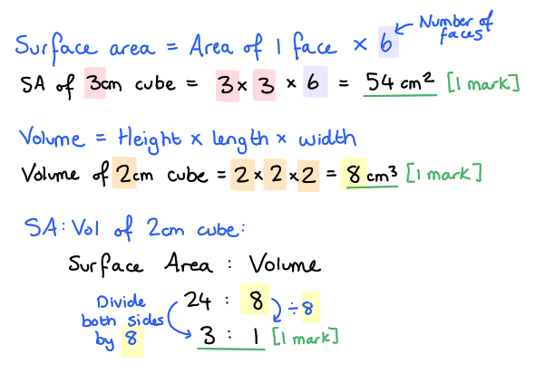

### 4() — 4 marks
(i) An explanation of the results of the experiment is...

- As the surface area : volume ratio increases, it takes longer for the diffusion to occur / the cube to turn colourless;** [1 mark]**
- This is because the acid has to diffuse through more jelly/further distance to travel (to reach the centre of the cube);** [1 mark]**

(ii) The results support this conclusion by...

Any **one **of the following:

- Bacteria cells are small/large SA: vol ratio, the smallest cube in the experiment took the shortest time to diffuse; **[1 mark]**
- Humans are too big/SA: vol ratio too small to rely on just diffusion, the largest cube took the longest time to diffuse; **[1 mark]**

(iii) The student could improve the experiment by...

- Repeating the experiment / testing more than one of each size cube; **[1 mark]**

**[Total: 4 marks]**

> *Sometimes it can be tricky to get your head around an unfamiliar experiment but this is something that you will be asked to do in your exams. Remember that you will never be asked about something that you haven't covered the theory for. *

## Q9 — medium — 11 marks · exam-questions

### 1() — 2 marks
Adaptations of this cell for the transportation of nutrients are...

- Large surface area due to folded membrane / microvilli; **[1 mark]**
- Mitochondria (carry out respiration) to provide energy for active transport; **[1 mark]**

**[Total: 2 marks]**

> *If you are asked to explain you cannot just list the adaptations, you also need to link them to cell transport. *

### 2() — 2 marks
The epithelial cell needs to be able to carry out both forms of transport because...

- If there was only diffusion, then transport would stop when concentrations of nutrients were the same both inside and outside the cell **OR **diffusion only transports substances/nutrients from an area of high concentration to low (this is not always the case in the intestine); **[1 mark]**
- Active transport is needed to transport substances/nutrients when they are in low concentration in the intestine / against the concentration gradient; **[1 mark]**

**[Total: 2 marks]**

> *This is important to prevent valuable nutrients from being lost in faeces! *

### 3() — 3 marks
The process of active transport of glucose is as follows...

Any **three **of the following:

- Glucose enters the carrier protein (from area of low glucose concentration);** [1 mark]**
- (The carrier protein uses) energy/ATP; ** [1 mark]**
- Carrier protein changes shape; ** [1 mark]**
- The glucose is released on the other side of the membrane (area of high glucose concentration); ** [1 mark]**

**[Total: 3 marks]**

### 4() — 4 marks
A comparison of osmosis and active transport is...

*Similarities*

Minimum** **of **one** of the following:

- **Both** involve transporting substances; **[1 mark]**
- **Both** take place across a membrane; **[1 mark]**

*Differences*

Minimum** **of **two** of the following:

- Active transport is from low to high concentration/against a concentration gradient **whereas **osmosis is from high to low water potential; **[1 mark]**
- Active transport involves a carrier protein** whereas** osmosis does not; **[1 mark]**
- Osmosis is the transport of water only** whereas **active transport involves the transport of many other things; **[1 mark]**

*Accept water concentration for water potential*

**[Total: 4 marks]**

> *Don't forget to use your comparative language. *

## Q10 — medium — 9 marks · exam-questions

### 10((a)) — 5 marks
Factors that affect the rate of movement of substances into and out of cells include...

Any **five** of the following:

- Temperature increases (kinetic) energy / particle movement / more collisions; **[1 mark]**
- A (bigger) difference in concentration / concentration gradient increases the rate of movement;** [1 mark]**
- A short(er) distance increases diffusion / a short diffusion distance increases the rate of movement;** [1 mark]**
- Larger surface area to (volume ratio) increases diffusion;** [1 mark]**
- Lower mass / if the size of the particle is smaller particles move faster; **[1 mark]**
- Larger particles / charged particles cannot pass through the cell membrane;** [1 mark]**
- (Increased) oxygen / ATP / respiration / energy for active transport;** [1 mark]**

**[Total: 5 marks]**

### 10((b)) — 4 marks
Differences between diffusion and active transport are as follows...

Any **four** of the following:

- Diffusion is <u>passive</u>; **[1 mark]**
- Diffusion is the movement (of particles) from high concentration to low / requires concentration gradient;** [1 mark]**
- Active transport requires ATP / energy / oxygen / respiration; **[1 mark]**
- Active transport requires membrane / carrier proteins; **[1 mark]**
- Diffusion can take place in non-living systems; **[1 mark]**

*Accept converse points where appropriate*

**[Total: 4 marks]**

> *Converse points can be accepted for the majority of the marking points in this mark scheme, but note that you cannot be awarded a mark for saying that active transport is 'active' alone, it must be qualified by explaining the need for ATP to move particles against the concentration gradient.*

## Q11 — hard — 8 marks · exam-questions

### 6((a)) — 1 marks
The independent variable in this investigation is...

- Salt/sodium chloride <u>concentration</u> / <u>concentration</u> of salt/sodium chloride / <u>percentage</u> salt/sodium chloride solution / <u>water potential</u> of solution ; **[1 mark]**

**[Total: 1 mark]**

> *The independent variable is the variable **changed** by the investigator.*

### 6((b)) — 1 marks
A variable that the teacher controls in this investigation is...

Any **one** of the following:

- Concentration of (diluted) blood sample/plasma (i.e. how much the blood is diluted before starting the experiment); **[1 mark]**
- Volume of (diluted) blood/solution (this is always 1 cm3); **[1 mark]**
- Time that solution is left for (this is always 5 mins); **[1 mark]**

***Reject**** volume of water for marking point 3; water on its own is only used as a variant of the independent variable (salt solution concentration).*

***Ignore**** amount used instead of volume.*

**[Total: 1 mark]**

### 6((c)) — 4 marks
(i) The differences in the teacher’s observations are due to...

Any **two** of the following:

- There are no cells / the cells have burst/exploded in (distilled) water/A; **[1 mark]**
- Haemoglobin dissolves (producing a clear red colour in A); **[1 mark]**
- Cells are present / remain unchanged / do not burst in tubes B and C / the 1 % and 5 % tubes (giving a cloudy red appearance); **[1 mark]**

(ii) The differences between the teacher’s observations of the slides from each tube are due to...

Any **two** of the following:

- Water enters red cells in A/(distilled) water; **[1 mark]**
- Water both enters and leaves / there is no (overall) movement of water in B/1 % solution; **[1 mark]**
- Water leaves red cells in C/5 % solution; **[1 mark]**
- (Movement of water is due to) osmosis; **[1 mark]**

**[Total: 4 marks]**

> *The cells in tube A have been placed into a solution with a higher water potential than the cell contents, so water moves down a water potential gradient **into **the red blood cells by osmosis, causing them to swell and eventually burst, releasing their haemoglobin contents into the surrounding water. This means that there are no cells present and causes the water to have a clear, red colour.*

> *Tube B has been placed into a solution with a water potential that is the same as the cell contents, so there is no overall movement of water (the same amount moves into and out of the cells) and the red blood cells do not change their appearance.*

> *Tube C has been placed into a solution with a lower water potential than the cell contents, so water moves down its concentration gradient **out of** the red blood cells by osmosis, causing them to shrink and have wrinkled edges.*

> *The presence of red blood cells in tubes B and C gives the tubes a cloudy, red appearance.*

### 6((d)) — 2 marks
The blood in tubes A, B and C from the teacher’s demonstration would have the following appearance after they had been spun in a centrifuge...

- Tube A would have no red cell (layer) / bottom layer / no (separation into) layers / would be red throughout **OR** would have more plasma / no platelets;** [1 mark]**
- Tube B/C would have normal cell layers / a normal (layer) of red cells **OR** would (only) have slightly fewer red cells / a slightly smaller red cell layer than normal; **[1 mark]**

**[Total: 2 marks]**

> *Make sure that you describe the appearance of tube A as well as tubes B and C for both marks here.*

## Q12 — hard — 7 marks · exam-questions

### 1() — 1 marks
The following sugars are absorbed by active transport:

- A and D; **[1 mark]**

**[Total: 1 mark]**

### 2() — 3 marks
The evidence that supports that sugars A and D were absorbed via active transport is:

Any **three **of the following:

- The absorption (rate) of both sugars (A and D) is reduced in the poisoned intestine;** [1 mark]**
- The poison prevents respiration so that there is less / no energy available; **[1 mark]**
- Active transport requires energy; **[1 mark]**
- To move substances against a concentration gradient; **[1 mark]**

**[Total: 3 marks]**

### 3() — 2 marks
The statement "All four of the sugars we investigated can be absorbed by diffusion" is:

- Correct as all four sugars were absorbed by the intestine poisoned with cyanide, even though respiration had been stopped; **[1 mark]**
- Diffusion is a passive process that does not require energy from respiration; **[1 mark]**

**[Total: 2 marks]**

> *Initially sugars A and D most likely could be absorbed via diffusion as the sugar concentration outside the intestine (lumen) was higher. Once the concentration of sugar was lower outside the intestine it would have to be taken up via active transport (as it is against the concentration gradient) which was prevented in the intestine poisoned with cyanide.*

### 4() — 1 marks
Xylose is not absorbed by active transport because:

Any **one **of the following:

- Active transport is selective;** [1 mark]**
- Transport/carrier proteins in the cell membrane can distinguish between glucose and xylose; **[1 mark]**
- There is no transporter protein specific for xylose;** [1 mark]**

**[Total: 1 mark]**

## Q13 — hard — 17 marks · exam-questions

### 1() — 2 marks
The beaker after 15 minutes would look like this...

- The liquid level will be higher on the right hand side than the left; **[1 mark] **
- There will be more water on the right hand side than the left / fewer than 12 water molecules drawn on the left side of the membrane; **[1 mark]**

**[Total: 2 marks]**

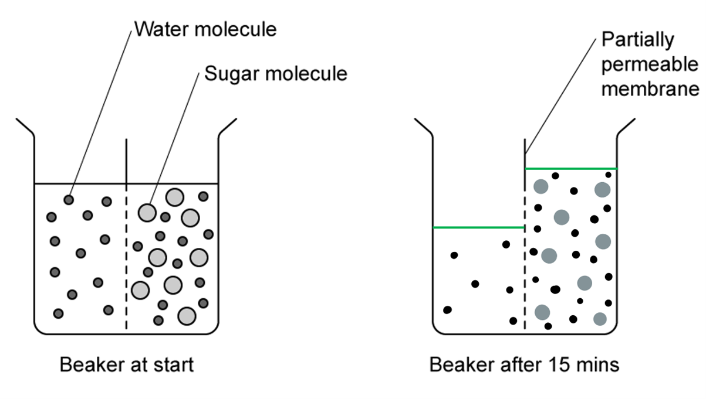

> *Remember that the sugar molecules cannot move through the membrane so the water will move into the region of the beaker where the sugar concentration is higher. This will result in the volume of liquid increasing in that region of the beaker.*

### 2() — 2 marks
The reason that the beaker would look as drawn in part **(a)** is..

- The water particles move by <u>osmosis </u>from an area of low solute / sugar concentration to an area of high / sugar solute concentration **OR **Water particles move by osmosis from an area of high water potential to an area of low water potential; **[1 mark]**
- The sugar particles are <u>too large</u> to move through the small holes in the partially permeable membrane; **[1 mark]**

**[Total: 2 marks]**** **

### 3() — 5 marks
The graph can be described as follows:

- As time increases, the mass of the potato cube increases; **[1 mark]**
- The increase is not proportional **OR** the increase in mass occurs more quickly in the first 15/20 minutes and then more slowly after 20 minutes / the graph levels off; **[1 mark]**

This is because...

A maximum of **three** from the following:

- The water potential outside of the potato is higher than inside the potato; **[1 mark]**
- (So) water moves into the potato cells by osmosis; **[1 mark]**
- The rate occurs more quickly when the water potential gradient is steepest (between 0 and 15/20 minutes); **[1 mark]**
- The rate of increase slows / graph levels off because there is no longer a water potential gradient / the water potential of water inside the potato is the same as / similar to the water potential outside of the potato; **[1 mark]**
- The rate of increase slows / graph levels off when the cell is turgid/full / cannot absorb any more water; **[1 mark]**

**[Total: 5 marks]**

> *This is a 'describe and explain' question so you are required to do both parts in order to achieve full marks.*

### 4() — 2 marks
The percentage increase at 10 minutes can be calculated as follows:

- (0.17 ÷ 2.3) x 100;** [1 mark]**
- 7.4 % (increase); **[1 mark]**

**[Total: 2 marks]**

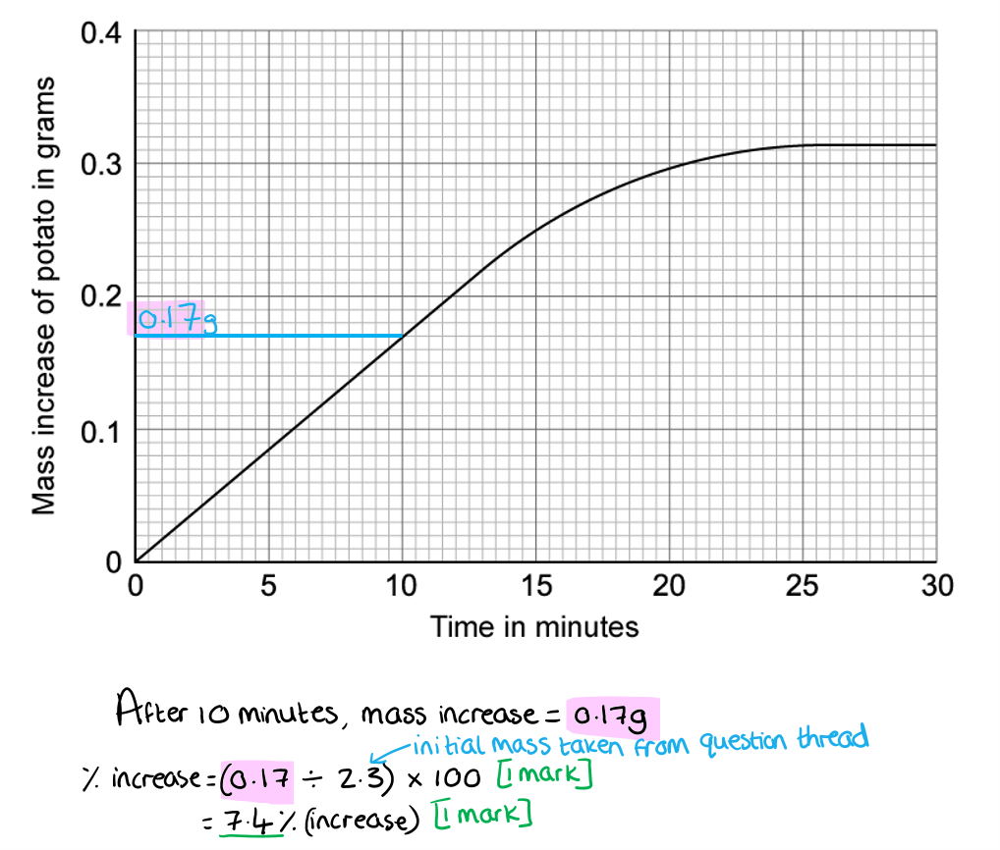

### 5() — 2 marks
The line on the graph should look as follows:

- The mass of the potato would increase faster; **[1 mark]**
- The graph would level off at the same value of mass increase; **[1 mark]**

**[Total: 2 marks]**

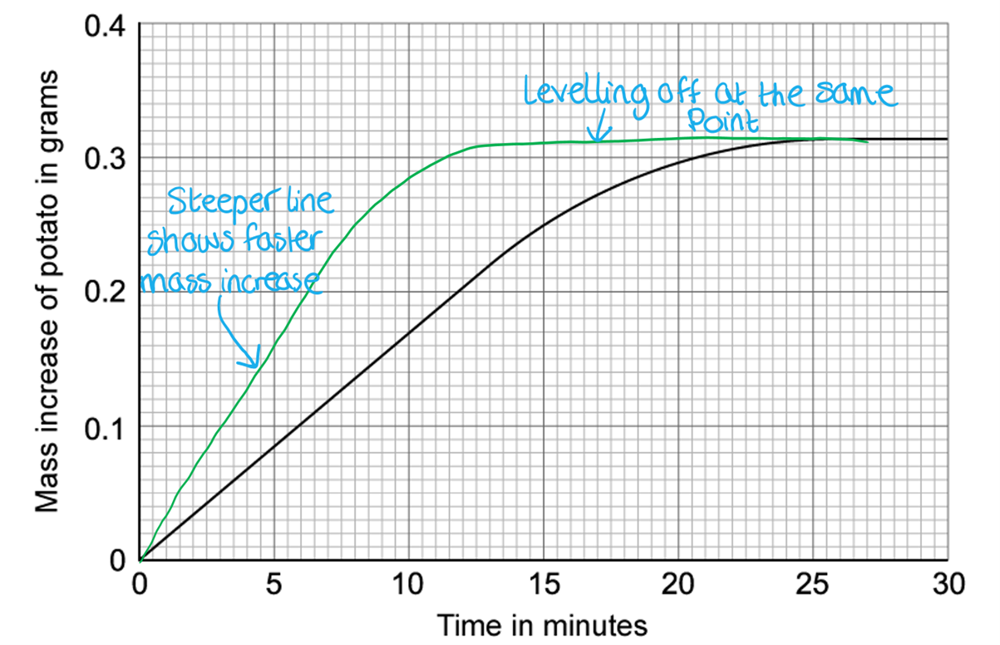

### 6() — 4 marks
The trend drawn can be explained as follows:

- (The increase in mass occurs faster / rate of mass increase is faster because) a higher temperature means increased kinetic energy of particles / particles move more; **[1 mark]**
- Therefore the rate of osmosis is faster (into the potato); **[1 mark]**
- (The final mass levels off after the same mass increase) because the solute / water potential gradient is the same in both investigations; **[1 mark]**
- So osmosis will continue to happen until the water potential inside the potato is the same on the inside and the outside **OR** the same mass of water will move by osmosis into the potato until the water potential inside the potato is the same on the inside and the outside;** [1 mark]**

**[Total: 4 marks]**

## Q14 — hard — 8 marks · exam-questions

### 1() — 2 marks
The absorption of monoglycerides in a person suffering from coeliac disease would be affected as follows...

- Less monoglycerides would be absorbed by the small intestine / there will be a decrease in the absorption of monoglycerides; **[1 mark]**
- (This is because) there is a decreased/smaller surface area (caused by shortened villi); **[1 mark]**

**[Total: 2 marks]**

> *One of the reasons that the small intestine is very efficient at absorbing nutrients is because the villi creates a large surface area for diffusion to occur. It is clear that people suffering from coeliac disease would not have the same surface area available due to the fact that their villi is much shorter than in a healthy person.*

### 2() — 3 marks
The graph shows...

- As the concentration of monoglycerides increases, the rate of uptake of epithelial cells increases; **[1 mark]**
- The relationship is proportional / linear;** [1 mark]**
- (This is because) the steeper the concentration gradient, the faster the rate of diffusion; **[1 mark]**

**[Total: 3 marks]**

### 3() — 3 marks
A body temperature of 37 °C maximises transport because...

Any **three **from the following:

- Temperatures lower than 37 °C would result in less kinetic energy of particles (to be transported);** [1 mark]**
- Less kinetic energy would mean slower rate of diffusion / osmosis / active transport;** [1 mark]**
- Higher temperatures may result in damage to carrier proteins / cell membranes;** [1 mark]**
- This could reduce the rate of transport across the membrane **OR** prevent transport across the membrane; **[1 mark]**

**[Total: 3 marks]**

## Q15 — hard — 15 marks · exam-questions

### 1() — 3 marks
(i) The % change in mass for the 0.6 mol dm-3 sugar solution is...

- (-0.07 ÷ 2.08) x 100; **[1 mark]**
- -3.37 (%); **[1 mark]**

> *Make sure that your answer is rounded correctly!*

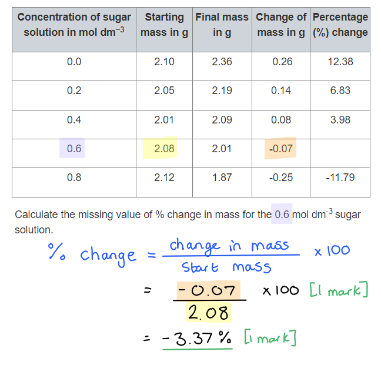

(ii) The student calculated the percentage change in mass as well as the change in mass in grams because...

Any **one **of the following:

- To allow results to be compared to each other; **[1 mark]**
- (Because) they had different start masses; **[1 mark]**

**[Total: 3 marks]**

### 2() — 6 marks
(i) The graph should be drawn as follows...

- Scale: linear and filling at least half of the area provided; **[1 mark]**
- Line: straight, neat and through the points; **[1 mark]**
- Axes 1: labelled correctly; X = concentration of sugar solution and Y = percentage change in mass; **[1 mark]**
- Axes 2: with units; X = mol dm-3 and Y = %; **[1 mark]**
- Points: plotted correctly; **[1 mark]**

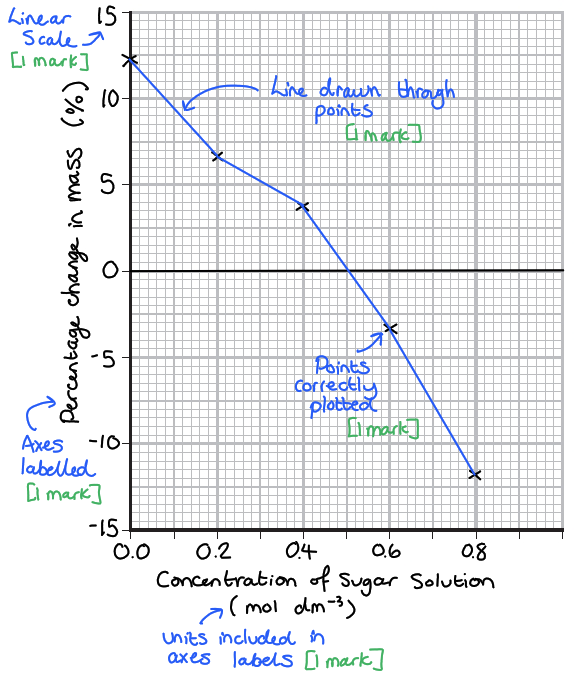

> *Edexcel iGCSE follows the same marking requirements for all questions relating to drawing graphs. There are 5 points and 5 marks available, unless one of the criteria is not relevant e.g. if a key is not required the graph may be worth a maximum of 4 marks. The 5 possible mark points are as follows: *

> *S - Scale **should be **linear**, increasing in **regular increments**. It should take up more than half the grid (and not be squashed into one corner of the graph paper)*

> *L - The line** should be **through the points** (as we do not know the intermediate values). It is important that you use a ruler to join your points together. Don't extrapolate (join your line) to the origin (0,0) unless your data includes this point. *

> *A - Axes** should be **labelled correctly** and include **units.** These can usually be taken from the table directly. It is also worth remembering that the Y axis is usually used for the dependent variable which is found in the right hand side of a table and the X axis is used to represent the independent variable which is found in the left column of the table.*

> *P - Points** should be plotted carefully and accurately as you will only be awarded the mark if all points are** within 1 small square** of where they are supposed to be.*

> *K - Keys** are sometimes necessary but** not always**. If there are multiple lines on a line graph or sets of bars on your bar chart then you might like to distinguish the different data sets using a **key or a label on the lines.*

(ii) The concentration of the solution inside the potato cells is...

- 0.5 (mol dm-3); **[1 mark]**

> *When the % change in mass is 0%, that means there is no net water movement in or out of the potato. This means that the concentration is the same both inside and outside the cell. *

> *Remember that no net movement doesn't mean that no water moves, but it just means that the same quantity of water moves both into and out of the cell.*

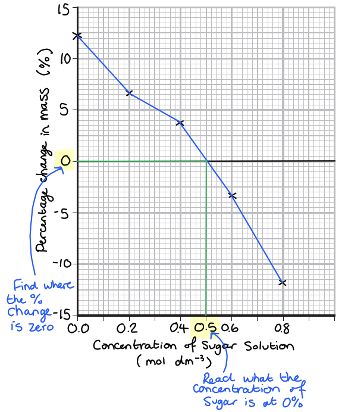

**[Total: 6 marks]**

### 3() — 6 marks
The experiment would be as follows...

- C = Change the type/species of potato - sweet/normal potato; **[1 mark]**
- O = <u>Same</u> sized potato pieces; **[1 mark]**
- R = Repeat with several pieces of potato at each solute concentration; **[1 mark]**
- M = Measure the percentage change in mass for pieces of potato placed in a range of solute concentrations; **[1 mark]**
- M = Measure the solute concentration at which each piece of potato has a % change in mass of zero; **[1 mark]**
- S = Same surface area of potato / temperature of the solution; **[1 mark]**
- S = Same time the potatoes are left in solution / all potatoes are dried before mass measured; **[1 mark]**

**[Total: 6 marks]**

> *Remember that with **CORMS** questions you will not be expected to know anything about the experiment you're presented with. You just have to apply your knowledge of experimental design to a new scenario. *

> *Remember that **CORMS** stands for: **C**hange, **O**rganism, **R**epeat, **M**easure, **S**ame. There are always two marks available for **M**easure and two for **S**ame. *

> *The most difficult mark to get is the **O**rganism because you need to remember to include the word **same** in your answer, eg. "same species". The point for **O**rganism needs to be different to the two points in **S**ame. *

> *Remember to write your answers in full sentences, as stated in the question stem, but you are welcome to make a quick bullet point plan in a blank space somewhere else on your page. Use your plan to tick off and make sure you've hit all the marking points.*
