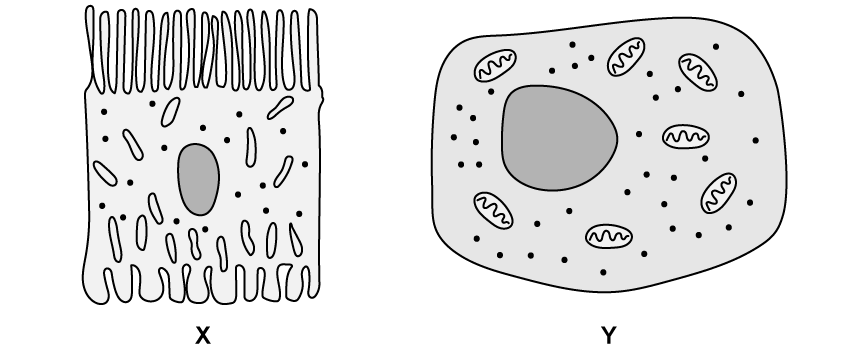
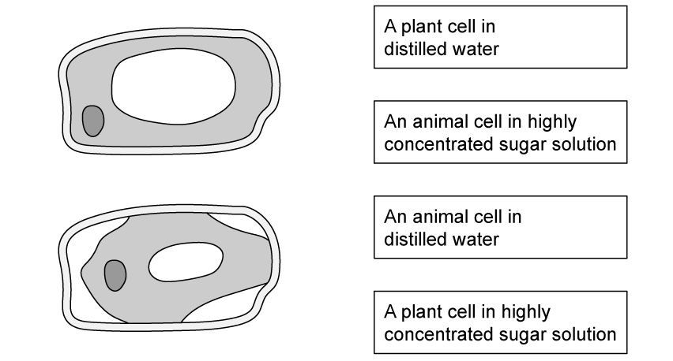
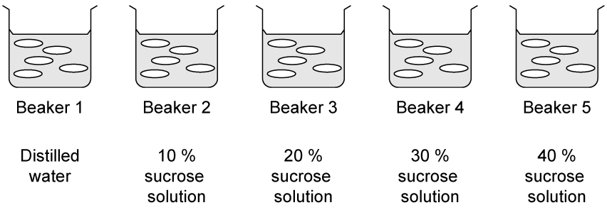
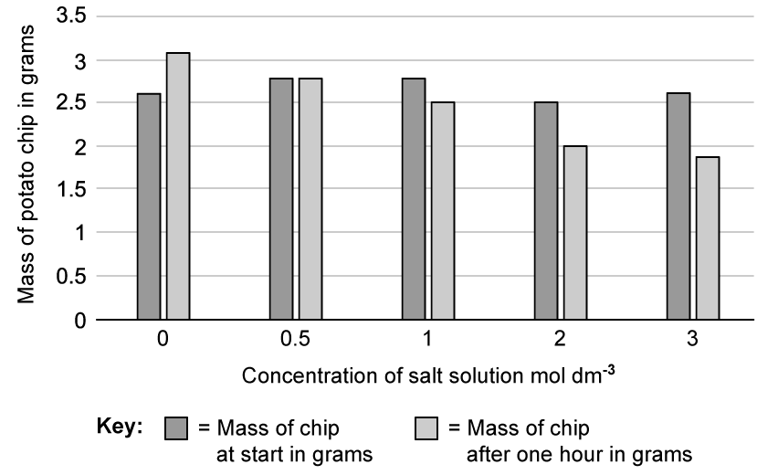
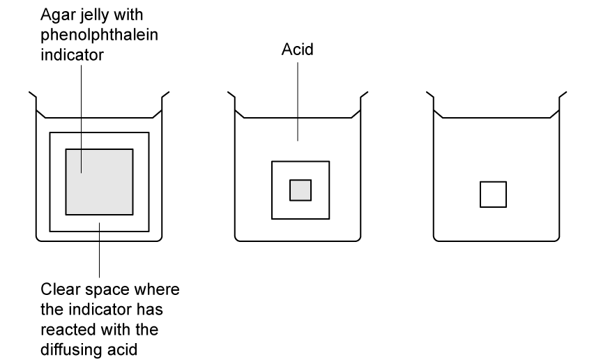
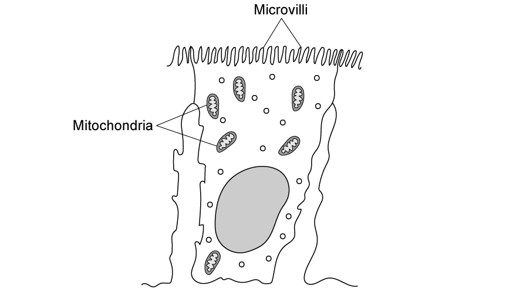
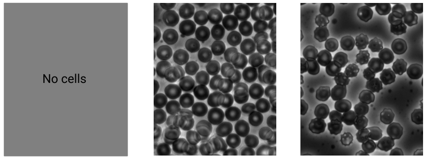
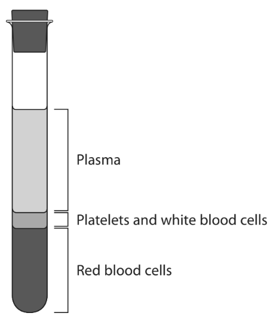
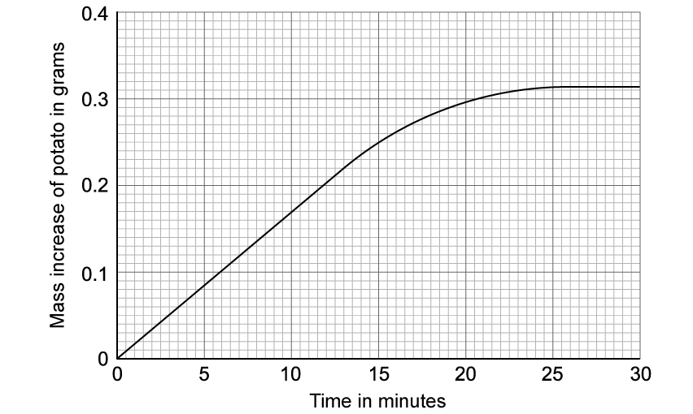
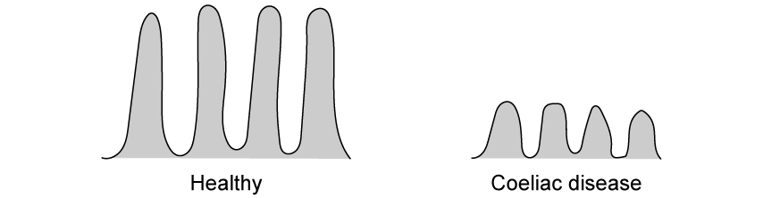

# Exam Questions — Movement of Substances Into & Out of Cells
**2. Structure & Function in Living Organisms** · Edexcel IGCSE Science (Double Award) (4SD0) — 17/Biology
> Source: [https://www.savemyexams.com/igcse/science/edexcel/double-award/17/biology/topic-questions/structure-and-function-in-living-organisms/movement-of-substances-into-and-out-of-cells/exam-questions/](https://www.savemyexams.com/igcse/science/edexcel/double-award/17/biology/topic-questions/structure-and-function-in-living-organisms/movement-of-substances-into-and-out-of-cells/exam-questions/) · 15 questions · total 136 marks

## Q1 — easy — 4 marks · exam-questions

### 1() — 1 mark — command: identify — structured
Organisms must transport substances to and from the external environment.

Identify** one** substance which cells must transport across the cell membrane to support cell functions.

### 2() — 1 mark — command: draw — structured
The diagram shows particles of two gases.

Complete the diagram by drawing the arrangement of the gas particles after 1 hour.

### 3() — 1 mark — command: name — structured
Name the process shown in** **part (b).

### 4() — 1 mark — command: which — structured
Which of the following is an example of simple diffusion?

| ☐ | **A** | Movement of water into the root of a plant |
|---|---|---|
| ☐ | **B** | Movement of mineral ions into the root of a plant |
| ☐ | **C** | Movement of oxygen into the leaf of a plant |
| ☐ | **D** | Movement of glucose into the epithelial cells of villi in the small intestine |

## Q2 — easy — 9 marks · exam-questions

### 1() — 4 marks — command: complete — structured
Complete each row of the table with a  tick (✓) or a cross ( ✕ ) to indicate whether it is a feature of osmosis.

| **Feature** | **✓ /  ✕** |
|---|---|
| Involves the movement of gases |   |
| Requires energy from respiration |   |
| Movement occurs through a partially permeable membrane |   |
| Particles move down a concentration gradient |   |

### 2() — 1 mark — command: draw — structured
Draw an arrow on the diagram to show the overall direction that the water particles will move in (net water movement).

### 3() — 3 marks — command: describe — structured
Describe an example of where diffusion of gasses is important in multicellular organisms.

### 4() — 1 mark — command: identify — structured
Identify **one** feature of a gas exchange surface which maximises the rate of diffusion.

## Q3 — easy — 7 marks · exam-questions

### 1() — 2 marks — command: suggest — structured
The diagram** **shows two cells.

Suggest which cell (**X** or **Y**) is better adapted to carry out diffusion and give a reason for your choice.

### 2() — 2 marks — command: draw — structured
The diagram shows two cells after the effects of osmosis.

Draw a line from each cell to the correct description.

### 3() — 2 marks — command: explain — structured
A student carried out an experiment into osmosis in plant tissue. They set up their investigation as shown below.

Each beaker contained potato discs in a solution of sugar (sucrose) or distilled water.

The student found that the potato discs in Beaker 5 decreased in mass.

With reference to osmosis, explain why this is.

### 4() — 1 mark — command: which — structured
Which of the following is a suitable control variable for the investigation carried out by the student in part **(c)**?

| ☐ | **A** | Maintain the same sugar concentration in each beaker |
|---|---|---|
| ☐ | **B** | Repeat the experiment 3 times |
| ☐ | **C** | Use the same size potato pieces in each beaker |
| ☐ | **D** | Calculate an average of the results |

## Q4 — easy — 5 marks · exam-questions

### 1() — 2 marks — command: place — structured
Pre-cut potato chips can be stored in salt solution before being cooked in restaurants. To avoid the chips becoming too salty, it is important to make sure that water does not move in or out of the chips as they are stored.

A scientist wanted to collect some data about the salt content of potato chips to inform the restaurants of the best storage concentration.

The steps in** **the table refer to the method that the scientist used to collect his results.

| **1** | Measure out 100ml of each salt solution into 5 different test tubes |
|---|---|
|   | Remove the chips, pat dry and reweigh |
|   | Cut 5 potato chips of similar size and dimensions |
|   | Place 1 chip into each concentration of salt solution and leave for 1 hour |
|   | Record the mass of the potato chips |

Place the steps in the correct order by adding numbers** 2** to **5** into the left hand column of the table. The first stage has been labelled for you.

### 2() — 1 mark — command: which — structured
The graph shows the results obtained by the scientist when completing the investigation from part **(a).**

In which salt solution did the mass of the chip increase after one hour?

### 3() — 1 mark — command: explain — structured
Explain what led to this increase in mass of the chip identified in part **(b)**.

| ☐ | **A** | Water moved out of the chip by osmosis |
|---|---|---|
| ☐ | **B** | Salt moved into the chip by diffusion |
| ☐ | **C** | Water moved into the chip by osmosis |
| ☐ | **D** | The chip reacted with the salt in the solution |

### 4() — 1 mark — command: suggest — structured
The scientist concluded that the best solution for storing chips in would be 0.5 mol dm-3 salt solution because there would be no net (overall) movement of water into or out of the potato chips.

Suggest how the scientist can tell this from the results in the graph in part** (b)**.

## Q5 — medium — 9 marks · exam-questions

### 1() — 2 marks — command: calculate — structured
A student decided to investigate the effect of different salt solutions on the mass of chicken eggs.

They used the following method:

1. 5 eggs were placed in acid for 24 hours to dissolve the eggshell.
2. The mass of each egg was measured and recorded.
3. Five beakers were set up; four with 200 cm3 of a salt solution of a particular concentration and one with water (0.0 mol dm-3).
4. An egg was placed in each of the beakers.
5. After 1 hour, the eggs were removed and dried with a paper towel.
6. The mass of each egg was measured and recorded.

Their results are shown in the table below:

| **Concentration of salt solution (mol dm****-3****)** | **Mass of egg without shell in grams** | **Mass of egg after 1 hour in solution in grams** |
|---|---|---|
| 0.0 | 74.5 | 79.2 |
| 0.2 | 73.0 | 75.8 |
| 0.4 | 74.2 | 75.5 |
| 0.6 | 73.6 | 72.0 |
| 0.8 | 75.8 | 71.5 |

Calculate the percentage change of the egg placed in the 0.4 mol dm-3 salt solution.

Give your answer to **two **significant figures.

**(2)**

### 2() — 3 marks — command: explain — structured
Explain why in some of the solutions the mass of the eggs decreased.

### 3() — 3 marks — command: explain — structured
Explain what the student would need to do to determine an estimate of the concentration of the solution inside an egg.

### 4() — 1 mark — command: state — structured
State **one **safety precaution the student would need to carry out during this experiment.

## Q6 — medium — 6 marks · exam-questions

### 1() — 1 mark — command: describe — structured
A student carried out an experiment to study diffusion.

A cube of beetroot was placed in a test tube of distilled water at room temperature as shown in the diagram.

The beetroot was left in the water for ten minutes.

Describe what the student should expect to see.

### 2() — 2 marks — command: explain — structured
Give **one **variable that must be controlled and explain why this control is necessary to provide valid results.

### 3() — 3 marks — command: explain — structured
The student found that more of the beetroot pigment leaked out at higher temperatures.

Explain why this result was different at higher temperatures compared to room temperature.

## Q7 — medium — 9 marks · exam-questions

### 1() — 3 marks — command: suggest — structured
During a science lesson a student writes down the following statement about osmosis.

| The active movement of molecules through a membrane from a region of low concentration to a region of high concentration. |
|---|

Using your knowledge of osmosis, suggest what is wrong with this statement.

### 2() — 1 mark — command: describe — structured
The diagram shows two human red blood cells. The cell labelled **B **had been placed in concentrated salt solution.

Describe the changes to the cell labelled **B**.

### 3() — 2 marks — command: explain — structured
Explain why the cell labelled **B** has changed shape.

### 4() — 3 marks — command: explain — structured
A student placed a sample of red blood cells into pure water for 30 minutes. When they checked the blood/water solution under a microscope they could not identify any intact cells.

Explain what is likely to have happened to the red blood cells after being in water.

## Q8 — medium — 12 marks · exam-questions

### 1() — 1 mark — command: define — structured
Define the term diffusion.

### 2() — 4 marks — command: multiple — structured
Substances diffuse into simple organisms, like bacteria, across their cell surface. The rate of diffusion is affected by surface area to volume ratio.

(i) State** two** other factors that affect the rate of diffusion.

**(2)**

(ii) Explain how these two factors affect the rate of diffusion.

**(2)**

### 3() — 3 marks — command: calculate — structured
A student was investigating the effect of surface area to volume ratio on cubes of agar jelly containing phenolphthalein indicator. Phenolphthalein indicator turns from pink to colourless in acidic conditions.

The student cut the cubes into the following size.

Complete the table by calculating the missing numbers showing the dimensions of the three cubes.

| **Length of one side of the cube (cm)** | **Surface area of cube (cm****2****)** | **Volume of cube (cm****3****)** | **Surface area : Volume Ratio** |
|---|---|---|---|
| 1 | 6 | 1 | 6:1 |
| 2 | 24 |   |   |
| 3 |   | 27 | 2:1 |

### 4() — 4 marks — command: multiple — structured
The student placed each of the cubes in beakers of acid, as shown in the diagram.

The acid diffused into the cubes and reacted with the phenolphthalein indicator, changing it to colourless.

The student timed how long it took for the three cubes to become fully colourless.

The results are as follows:

| **Length of one side of the cube (cm)** | **Time taken to turn colourless (s)** |
|---|---|
| 1 | 24 |
| 2 | 157 |
| 3 | 584 |

(i) Explain the results of the experiment shown in the table.

**(2)**

(ii) The student concluded that the experiment explains why bacteria can rely on diffusion to transfer waste and nutrients, but larger organisms, such as humans, require complex transport systems.

Explain how the results support this conclusion.

**(1)**

(iii) How could the student improve their experiment to increase the reliability of the conclusion?

**(1)**

## Q9 — medium — 11 marks · exam-questions

### 1() — 2 marks — command: explain — structured
The cell shown in the diagram below is an epithelial cell found in the lining of the small intestine.

It is specially adapted to transport nutrients from the digested food into the blood.

Explain **two **adaptations of this cell for the transportation of nutrients.

### 2() — 2 marks — command: explain — structured
This cell carries out both diffusion and active transport.

Explain why it is necessary for the epithelial cell to be able to carry out both types of transport, and not just diffusion.

### 3() — 3 marks — command: explain — structured
Glucose is an example of a nutrient that is transported by active transport through the epithelial cell.

Explain what is happening along the folded membrane of the epithelial cell during the process of active transport of glucose.

### 4() — 4 marks — command: contrast — structured
Compare and contrast active transport and osmosis.

## Q10 — medium — 9 marks · exam-questions

### 10((a)) — 5 marks — command: explain — structured — from paper Jan 2021 · 4BI1/1B
Substances can move into and out of cells by a variety of mechanisms.

Explain the factors that affect the rate of movement of substances into and out of cells.

### 10((b)) — 4 marks — command: describe — structured — from paper Jan 2021 · 4BI1/1B
Describe the differences between diffusion and active transport.

## Q11 — hard — 8 marks · exam-questions

### 6((a)) — 1 mark — command: state — structured — from paper Jan 2022 · 4BI1/2BR
A teacher carries out a demonstration to show the effect of different concentrations of salt solution on red blood cells.

This is the teacher’s method.

- Dilute a sample of blood using a salt solution that has the same concentration as blood plasma
- Place 1 cm3 of the diluted blood into each of three test tubes labelled A, B and C
- Add 10 cm3 of water to tube A
- Add 10 cm3 of 1 % sodium chloride solution to tube B
- Add 10 cm3 of 5 % sodium chloride solution to tube C
- Leave each tube for 5 minutes
- Compare the cloudiness of the solutions in the three test tubes
- Take a drop of liquid from each tube and put on separate microscope slides
- Observe each slide under a microscope

State the independent variable in this investigation.

### 6((b)) — 1 mark — command: give — structured — from paper Jan 2022 · 4BI1/2BR
Give one variable that the teacher controls in this investigation.

### 6((c)) — 4 marks — command: explain — structured — from paper Jan 2022 · 4BI1/2BR
After 5 minutes, these are the teacher’s observations.

- Tube A – a clear red solution
- Tube B – a cloudy red suspension
- Tube C – a cloudy red suspension

(i) Explain the differences in the teacher’s observations.

**(2)**

(ii) When the teacher looks down a microscope for cells on each slide, these are the teacher’s observations.

- Slide from tube A – no cells are seen
- Slide from tube B – normal biconcave red cells are seen
- Slide from tube C – red cells are seen but the cells have shrunken edges

The photographs show the teacher’s observations.

| Tube A | Tube B | Tube C |
|---|---|---|

Zephyris, CC BY-SA 3.0 <https://creativecommons.org/licenses/by-sa/3.0>, via Wikimedia Commons

Explain the differences between the teacher’s observations of the slides from each tube.

**(2)**

### 6((d)) — 2 marks — command: describe — structured — from paper Jan 2022 · 4BI1/2BR
Blood samples can be separated into different layers using a centrifuge.

This is a machine that spins blood at a high speed.

A new sample of blood is shown after it has been spun in a centrifuge.

Describe how the blood in tubes A, B and C from the teacher’s demonstration would look after they had been spun in a centrifuge.

## Q12 — hard — 7 marks · exam-questions

### 1() — 1 mark — command: which — structured
A group of scientists investigated the rates of absorption of different sugars using two pieces of the intestine.

One piece of the intestine was poisoned with cyanide which stops cellular respiration.

The results are shown in** **the table below.

| **Sugar** | **Absorption rate (arbitrary units)** |   |
|---|---|---|
| **Healthy intestine** | **Intestine poisoned with cyanide** |   |
| A | 108 | 56 |
| B | 31 | 30 |
| C | 33 | 32 |
| D | 84 | 23 |

Which of the sugars in the table are absorbed by active transport?

### 2() — 3 marks — command: explain — structured
Explain why you chose these sugars, using evidence from** **the table in part (a).

### 3() — 2 marks — command: justify — structured
One of the scientists states ‘All four of the sugars we investigated can be absorbed by diffusion.

Is this statement correct or incorrect? Justify your answer.

### 4() — 1 mark — command: suggest — structured
One of the sugars absorbed by active transport is glucose.

Xylose is a sugar that is the same size as glucose, but it is not absorbed by active transport.

Suggest a reason why.

## Q13 — hard — 17 marks · exam-questions

### 1() — 2 marks — command: complete — structured
A student wanted to investigate the transport of water across a partially permeable membrane. The diagram shows how the student prepared the beaker at the start of the investigation.

** **

Complete the diagram to show what the student would observe after 15 minutes.

### 2() — 2 marks — command: explain — structured
Explain your answer to part **(a).**

### 3() — 5 marks — command: explain — structured
The student carried out a further investigation into the effect of osmosis on plant tissue.

They cut a potato into cubes and recorded the change in mass over a 30 minute period.

The graph shows the results the student obtained from one cube of potato.

Describe and explain the trend shown on the graph.

### 4() — 2 marks — command: calculate — structured
The potato cube from the graph in part (c) had an initial mass of 2.3g.

Calculate the percentage increase that the potato cube had shown after 10 minutes.

### 5() — 2 marks — command: draw — structured
The student repeated the investigation but with the beaker placed in a water bath at 30°C.

Draw a second line on the graph to show the trend expected from these results.

### 6() — 4 marks — command: explain — structured
Explain your line drawn for part **(e)**

## Q14 — hard — 8 marks · exam-questions

### 1() — 2 marks — command: explain — structured
Monoglycerides are molecules made up of glycerol and one fatty acid tail. They are absorbed into the epithelial cells of the small intestine by diffusion across the cell membrane.

Some people suffer from coeliac disease that affects the lining of their small intestine.

The diagram compares the lining of the small intestine of a healthy person and a person suffering from coeliac disease.

Based on the information provided, explain the effect that coeliac disease would have on the absorption of monoglycerides.

### 2() — 3 marks — command: explain — structured
The graph shows the rate of uptake of monoglycerides in the small intestine.

Describe and explain what the graph shows.

### 3() — 3 marks — command: suggest — structured
Human body temperature is approximately 37 °C, which provides the optimum temperature for activity of protein molecules such as enzymes.

Suggest why a temperature of 37 °C helps to maximise the rate of transport of substances across the cell membrane.

## Q15 — hard — 15 marks · exam-questions

### 1() — 3 marks — command: multiple — structured
A student investigated the effect of different concentration of sugar solution on osmosis in potato tissue.

This is the method they used:

1. Add 20 cm3 of distilled water to a boiling tube.
2. Repeat step **1** with equal volumes of 0.2, 0.4, 0.6 and 0.8 mol dm−3 sugar solutions.
3. Cut five cylinders of potato of equal size using a cork borer, cutting off the ends to remove the skin.
4. Weigh each potato cylinder and place one in each tube.
5. Remove the potato cylinders from the solutions after 12 hours.
6. Dry each potato cylinder with a paper towel.
7. Reweigh the potato cylinders.

The table below shows the results:

| **Concentration of sugar solution in mol dm****−3** | **Starting mass in g** | **Final mass in g** | **Change of mass in g** | **Percentage (%) change** |
|---|---|---|---|---|
| 0.0 | 2.10 | 2.36 | 0.26 | 12.38 |
| 0.2 | 2.05 | 2.19 | 0.14 | 6.83 |
| 0.4 | 2.01 | 2.09 | 0.08 | 3.98 |
| 0.6 | 2.08 | 2.01 | -0.07 |   |
| 0.8 | 2.12 | 1.87 | -0.25 | -11.79 |

(i) Calculate the missing value of % change in mass for the 0.6 mol dm-3 sugar solution.

**(2)**

(ii) Explain why the student calculated the percentage change in mass as well as the change mass in grams.

**(1)**

### 2() — 6 marks — command: multiple — structured
The student analysed the data from the experiment.

(i) In the space below, plot a graph of the results from this experiment.

**(5)**

(ii) Use your graph to estimate the concentration of the solution inside the potato cells.

Give your answer in mol dm-3.

**(1)**

### 3() — 6 marks — command: design — structured
Design an investigation to compare the sugar content of sweet potato to the sugar content of normal potato.

Your answer should include experimental details and be written in full sentences.
