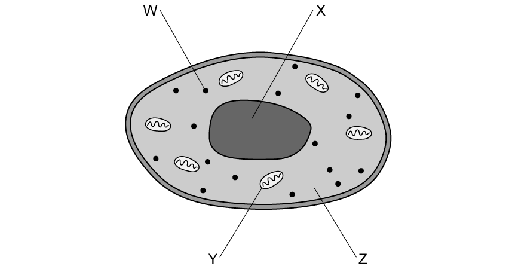
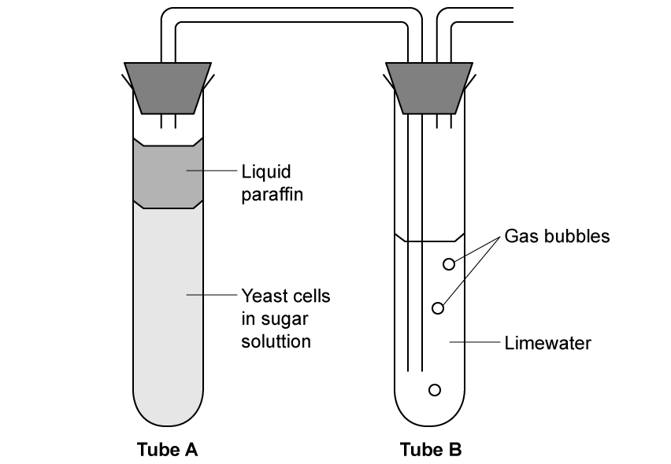
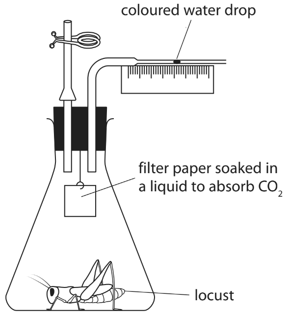
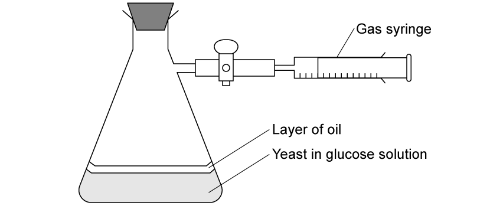
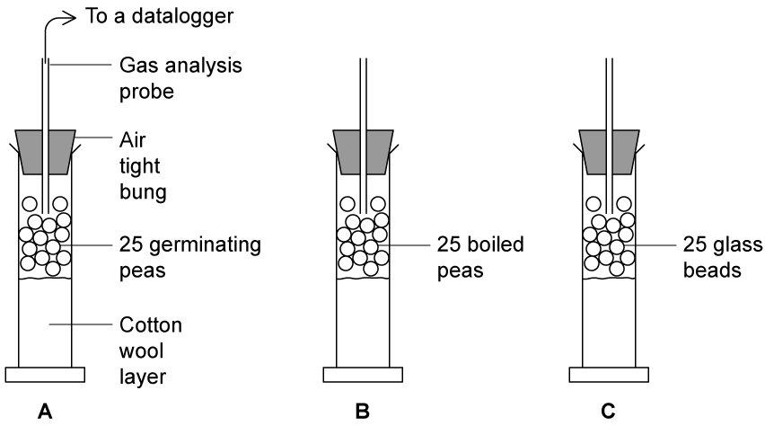

# Exam Questions — Respiration
**2. Structure & Function in Living Organisms** · Edexcel IGCSE Science (Double Award) (4SD0) — 17/Biology
> Source: [https://www.savemyexams.com/igcse/science/edexcel/double-award/17/biology/topic-questions/structure-and-function-in-living-organisms/respiration/exam-questions/](https://www.savemyexams.com/igcse/science/edexcel/double-award/17/biology/topic-questions/structure-and-function-in-living-organisms/respiration/exam-questions/) · 9 questions · total 103 marks

## Q1 — easy — 9 marks · exam-questions

### 1() — 1 mark — command: which — structured
Which of the following statements relating to respiration is **not** correct?

| ☐ | **A** | Respiration produces ATP |
|---|---|---|
| ☐ | **B** | Respiration involves the breaking of bonds within biological molecules |
| ☐ | **C** | Respiration occurs in animals but not in plants |
| ☐ | **D** | Respiration releases energy in the form of heat |

### 2() — 2 marks — command: multiple — structured
The diagram shows an animal cell.

(i) Identify the letter, from **W**-**Z**, that indicates the sub-cellular structure where respiration takes place.

**(1)**

(ii) Name the sub-cellular structure identified in part (i),

**(1)**

### 3() — 4 marks — command: complete — structured
Complete the following sentence about respiration:

| glucose    chemical    protein    cell    muscle    temperature    nerve |
|---|

Respiration releases energy from ............... . The energy release can be used in life processes such as ............... reactions, ............... contraction and maintaining a constant body ............... .

### 4() — 2 marks — command: complete — structured
Complete** **the table** **with a (✓) or a (**X**) to show the products and reactants of aerobic respiration in animals.

|   | **Product** | **Reactant** |
|---|---|---|
| Oxygen |   |   |
| Carbon dioxide |   |   |
| Lactic acid |   |   |
| Glucose |   |   |
| Water |   |   |
| Ethanol |   |   |

## Q2 — easy — 7 marks · exam-questions

### 1() — 2 marks — command: state — structured
In respiration energy is released from glucose.

State **two **uses, in an animal cell, of the energy released from glucose.

### 2() — 1 mark — command: which — structured
Earthworms are known as detritivores; they break down dead plant and animal material in the soil.

Which statement best describes how oxygen from the soil move into the body fluids of the earthworm to be used in respiration.

| ☐ | **A** | By diffusion down a concentration gradient |
|---|---|---|
| ☐ | **B** | By diffusion from a low concentration to a high concentration |
| ☐ | **C** | By osmosis down the concentration gradient |
| ☐ | **D** | By active transport from a low concentration to a high concentration |

### 3() — 1 mark — command: state — structured
If the ground becomes waterlogged then less oxygen will be available in the soil and the earthworm will need to respire anaerobically. This process is represented by the equation below.

Glucose → Lactic Acid

State why this process is described as anaerobic.

### 4() — 1 mark — command: suggest — structured
Earthworms cannot survive for very long in heavily waterlogged soil.

Suggest why this is the case.

### 5() — 2 marks — command: describe — structured
An oxygen debt is often associated with anaerobic respiration.

Describe the process that occurs in the human body during an oxygen debt.

## Q3 — easy — 9 marks · exam-questions

### 1() — 2 marks — command: state — structured
The diagram** **shows some apparatus set up to investigate respiration in yeast cells. Note that paraffin is impermeable to oxygen.

(i) State the type of respiration being investigated in this experiment.

**(1)**

(ii) State how you reached your answer to part (i).

**(1)**

### 2() — 1 mark — command: identify — structured
Identify the gas in the bubbles produced by the yeast in part (a).

### 3() — 2 marks — command: give — structured
A group of students wanted to use the apparatus in part (a) to investigate the effect of temperature on respiration in yeast.

They set up the test tubes containing the yeast and sugar solution in water baths at a range of temperatures and counted the number of bubbles produced to give a measure of the rate of respiration.

Give two factors that the students would need to control in their investigation.

### 4() — 4 marks — command: indicate — structured
Complete the table to indicate whether the statements apply to **aerobic respiration**, **anaerobic respiration** or **both**.

The first statement has been completed for you.

| **Statement** | **Respiration Type** |
|---|---|
| Produces lactic acid as a waste product | Anaerobic respiration |
| Produces ethanol when it occurs in yeast |   |
| Produces lots of ATP |   |
| Releases energy from glucose |   |
| Increases during intense exercise |   |

## Q4 — medium — 13 marks · exam-questions

### 6((a)) — 1 mark — command: which — structured — from paper Nov 2020 · 4BI1/1B
Which of these is the balanced chemical symbol equation for aerobic respiration?

| ☐ | **A** | C6H12O6 + 6O2 → 6CO2 |
|---|---|---|
| ☐ | **B** | C6H12O6  → 2C2H5OH + 2CO2 |
| ☐ | **C** | C6H12O6 + 6CO2 → 6O2 + 6H2O |
| ☐ | **D** | C6H12O6 + 6O2 → 6CO2 + 6H2O |

### 6((b)) — 8 marks — command: explain — structured — from paper Nov 2020 · 4BI1/1B
A student uses this apparatus to investigate aerobic respiration in a locust.

(i) The coloured water drop moves during the investigation.

Explain why the coloured water drop moves during the investigation.

**(2)**

(ii) The student compares the aerobic respiration of male and female locusts.

He uses three male locusts and three female locusts.

He uses locusts of the same age and the same species.

Explain **three** other variables that the student needs to control.

**(6)**

### 6((c)) — 4 marks — command: multiple — structured — from paper Nov 2020 · 4BI1/1B
The table shows the student's results.

|   | **Distance moved by coloured water drop in mm** |   |
|---|---|---|
|   | **Male** | **Female** |
| Trial 1 | 5.0 | 5.4 |
| Trial 2 | 4.9 | 5.2 |
| Trial 3 | 2.0 | 5.2 |
| Mean | 5.0 |   |

(i) Complete the table by giving the missing mean value.

**(1)**

(ii) Comment on the reliability of the data in the table.

**(3)**

## Q5 — medium — 13 marks · exam-questions

### 1() — 4 marks — command: explain — structured
A student reads the following statement in a textbook:

*‘Respiration and metabolic reactions are intrinsically linked to temperature.’*

Explain why this statement is true.

### 2() — 3 marks — command: identify — structured
Identify **three** different ways in which animals use the energy released by aerobic respiration.

### 3() — 3 marks — command: compare — structured
Compare the processes of aerobic and anaerobic respiration in animals.

### 4() — 3 marks — command: explain — structured
In animals exercise cannot be sustained for long periods by anaerobic respiration.

Explain why this is the case.

## Q6 — medium — 10 marks · exam-questions

### 1() — 3 marks — command: compare — structured
In the absence of sufficient oxygen, cells respire anaerobically.

Compare anaerobic respiration in the muscle cell of an animal with anaerobic respiration in a yeast cell.

### 2() — 2 marks — command: calculate — structured
A student used the equipment shown in the diagram to investigate the rate of anaerobic respiration in yeast.

The student measured the volume of carbon dioxide produced by 5 g of yeast over a 60 minute period. His results are shown in the table below.

| **Time / minutes** | **Total volume of gas collected / cm****3** |
|---|---|
| 10 | 0.5 |
| 20 | 0.7 |
| 30 | 1.6 |
| 40 | 2.8 |
| 50 | 5.9 |
| 60 | 6.3 |

Rate can be calculated using the following equation:

$\mathrm{Rate}=\frac{\mathrm{Volume} \mathrm{of} \mathrm{product} \mathrm{produced}}{\mathrm{Time}}$

Use the equation to calculate the average rate of carbon dioxide production per minute between 30 and 60 minutes in the investigation.

### 3() — 3 marks — command: suggest — structured
Suggest why the rate of carbon dioxide production shown in part (b) decreased between 50 and 60 minutes.

### 4() — 2 marks — command: explain — structured
Explain how the student could have ensured the reliability of the results.

## Q7 — hard — 11 marks · exam-questions

### 1() — 2 marks — command: write — structured
Write the balanced symbol equation for respiration

### 2() — 3 marks — command: calculate — structured
Some scientists wanted to investigate respiration rates in different areas of a plant.

They measured carbon dioxide production in the roots and leaves of a plant at night time.

The table shows the rate of carbon dioxide production that they measured.

| **Part of the plant** | **Mean rate of carbon dioxide production / cm****3 ****m****-2 ****s****-1** |
|---|---|
| Leaves | 0.042 |
| Root | 0.056 |

Calculate the percentage difference in carbon dioxide production in the leaves compared to the roots.

### 3() — 3 marks — command: suggest — structured
The carbon dioxide readings shown in the table in part (b) were all taken during the night time.

Suggest a reason for this.

### 4() — 2 marks — command: suggest — structured
Suggest an explanation for the results shown in the table in part (b).

### 5() — 1 mark — command: suggest — structured
In order to collect the data about carbon dioxide produced by the roots of the plant, scientists took samples of the air from the soil around the plant roots and adjusted it to account for atmospheric carbon dioxide levels.

Suggest why the readings they took may still be higher than the actual rate of carbon dioxide production in the plant roots.

## Q8 — hard — 15 marks · exam-questions

### 1() — 3 marks — command: give — structured
Give a definition of the term 'respiration'.

### 2() — 2 marks — command: calculate — structured
In an investigation, a person ran at different speeds.

The graph** **shows the concentration of lactic acid in the runner's blood and the runner's heart rate (in beats per minute) during the run.

When the running speed is 22 km h-1, the stroke volume of the runner is 0.18 dm3.

Calculate the cardiac output of the runner using the equation. State the appropriate units.

| **cardiac output = stroke volume × heart rate** |
|---|

### 3() — 1 mark — command: state — structured
Referring to the data in the graph in part (b), state the concentration of lactic acid in the blood when the heart rate has reached its maximum level.

### 4() — 3 marks — command: explain — structured
Explain why the concentration of lactic acid changes at running speeds greater than 18 km h-1.

### 5() — 6 marks — command: explain — structured
Once the person has finished running they begin their recovery.

(i) Explain the changes that occur in the lactic acid levels during their recovery.

**(3)**

(ii) Describe and explain how this process differs between fit people and unfit people.

**(3)**

## Q9 — hard — 16 marks · exam-questions

### 1() — 2 marks — command: explain — structured
The image shows three respirometers set up for an investigation into respiration in peas.

- Respirometer **A** contained germinating peas.
- Respirometer **B** contained peas that had been boiled and cooled before the experiment.
- Respirometer **C** contained glass beads.

All other aspects of each respirometer were kept constant.

All three respirometers were placed in a water bath at 25°C for 30 minutes. The reduction in oxygen levels inside each respirometer was measured using a data logger.

Explain why the respirometers were placed in a water bath at 25°C for 30 minutes.

### 2() — 2 marks — command: draw — structured
The scientist carrying out the study recorded the change in oxygen levels within the 3 respirometers over a 30-minute period.

The results are shown below

**A**  10 minutes (-0.8) cm3, 20 minutes (-1.6) cm3, 30 minutes (-2.4) cm3

**B**  10 minutes (-0.1) cm3, 20 minutes (-0.1) cm3, 30 minutes (-0.1) cm3

**C ** No change

Draw a table to show these results.

### 3() — 3 marks — command: calculate — structured
Calculate the rate of oxygen consumption per second for the peas in Respirometer **A**.

Include the units in your answer.

### 4() — 3 marks — command: explain — structured
(i) Explain why glass beads were used in Respirometer **C**.

**(1)**

(ii) Explain why Respirometer **A** has the highest rate of oxygen consumption of the three respirometers.

**(2)**

### 5() — 6 marks — command: design — structured
The student wanted to adjust this investigation to measure the heat given off by respiration in germinating peas.

Design an investigation to find out if germinating peas release heat energy from respiration.

Your answer should include experimental details and be written in full sentences.
