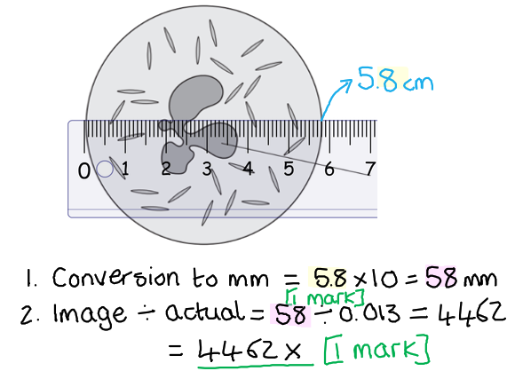
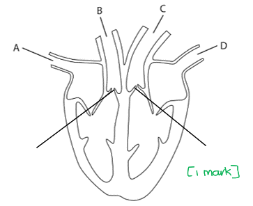
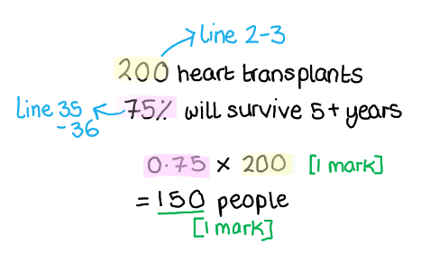
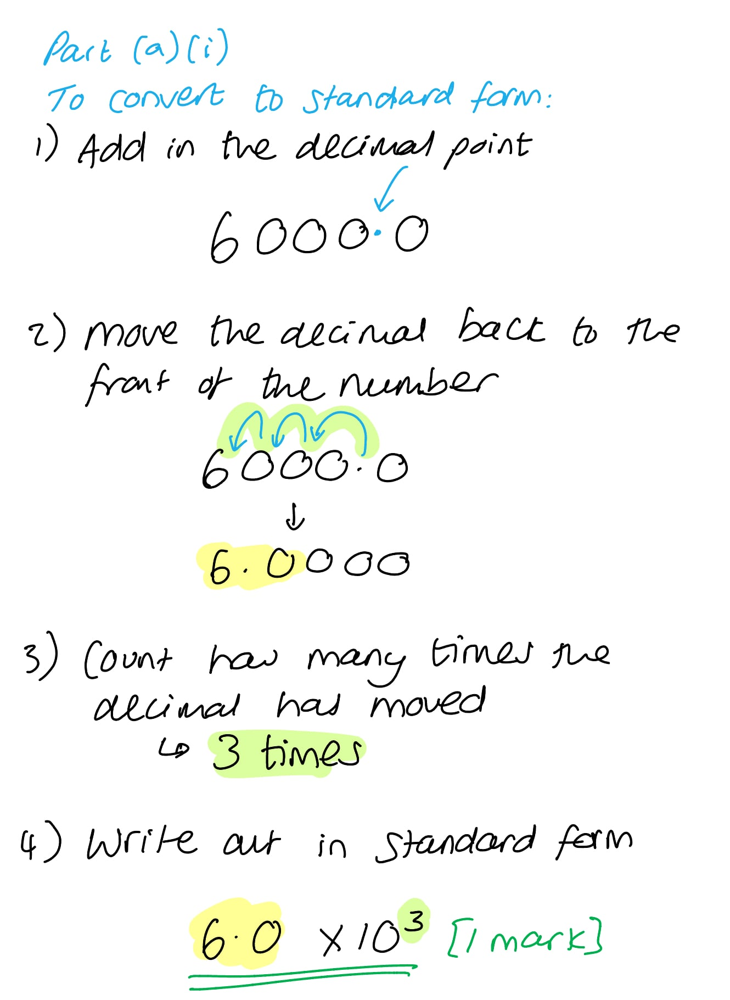
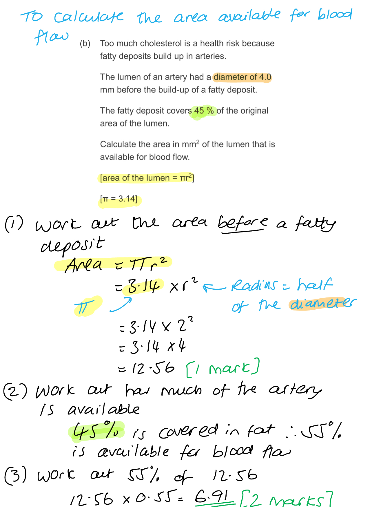
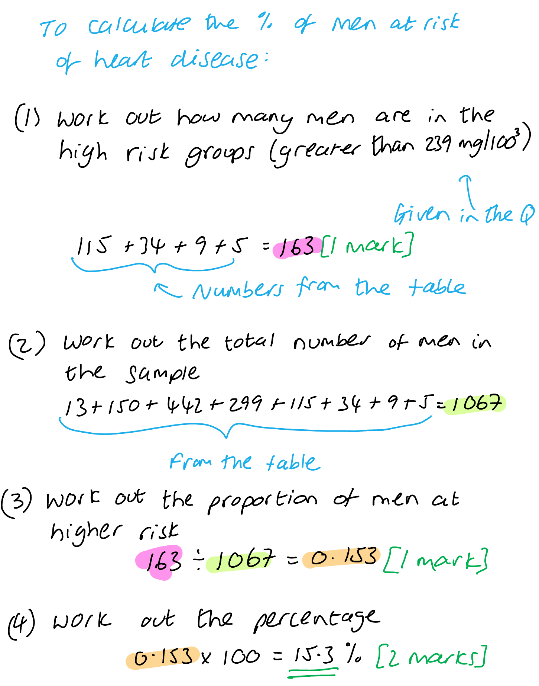

# Mark Schemes — Transport Systems
**2. Structure & Function in Living Organisms** · Edexcel IGCSE Science (Double Award) (4SD0) — 17/Biology

## Q1 — easy — 4 marks · exam-questions

### 3((a)) — 1 marks
**Final answer:** ** The correct answer is ****D ****because...**

Osmosis is always how water moves from the soil into the roots. Osmosis involves the movement of water from a high water potential area to a low water potential across a partially permeable membrane.

**A** is incorrect because water is not transported by the process of active transport.

**B** is incorrect because osmosis is a form of diffusion but water specifically moves by osmosis.

**C** is incorrect because water does not evaporate from the soil into the roots of the plant. The water in the roots of the plant is liquid, not a gas.

**[Total: 1 mark]**

### 3((b)) — 1 marks
The tissue that transports water to the leaves is...

- Xylem/xylem vessels; **[1 mark]**

**[Total: 1 mark]**

### 3((e)) — 2 marks
Two uses of water in a plant are...

Any **two **of the following:

- Support/turgor / maintaining the rigid structure of plant cells; **[1 mark]**
- Photosynthesis; **[1 mark]**
- Cooling; **[1 mark]**
- Reactions/solvent / transport of mineral ions/named mineral ion; **[1 mark]**

**[Total: 2 marks]**

> *Transpiration is not a **use** of water in the plants because it is how plants lose water, although it does contribute to cooling. *

## Q2 — easy — 10 marks · exam-questions

### 10((a)) — 4 marks
The function of plasma in transporting substances is as follows...

Any **four** of the following:

- Glucose (transported) from intestine / ileum / liver **OR** Glucose (transported) to body cells / to liver; **[1 mark]**
- Amino acids (transported) from ileum / liver **OR** amino acids (transported) to body cells / liver;**[1 mark]**
- Fatty acids / vitamins / minerals / other named product of digestion (transported) from intestine **OR** fatty acids / vitamins / minerals / other product of digestion (transported) to cells; **[1 mark]**
- Hormones (transported) from (endocrine) glands **OR** hormones (transported) to organs / tissues; **[1 mark]**
- Urea (transported) from liver **OR** urea (transported) to the kidney
- Carbon dioxide (transported) from cells **OR** carbon dioxide (transported) to lungs; **[1 mark]**
- Antibodies (transported) to the site of infection / to combat pathogens; **[1 mark]**
- Fibrinogen / clotting proteins (transported) to wound / damaged tissue; **[1 mark]**

**[Total: 4 marks]**

> *To gain full marks in this question you must do a bit more than just name substances carried in the plasma.  The function of the plasma is to carry these substances from A to B, so you should ensure that you have described where the substances are carried from or to gain full marks.*

### 10((b)) — 5 marks
(i) The calculation should be completed as follows...

- 58 ÷ 0.013; **[1 mark]**
- = 4462; **[1 mark]**

*Full marks should be awarded for the correct answer in the absence of any calculations*

*Award 1 mark for dividing an incorrect cell measurement by 0.013*

> *Note that **all of the units within the equation need to be the same**. You have been given the actual size of the cell in mm, so you need to convert the size of the cell in the image into mm to match this.*

> *A ruler has been added to the diagram here to account for the differences experienced when viewing the question on different screens or printing, which may alter the sizing. In the exam, you would be expected to bring a ruler and take measurements by hand to use in your calculations.*

(ii) Structure A is...

- The nucleus;** [1 mark]**

(iii) The function of this cell is...

Any **two** from the following:

- To engulf/ingest bacteria/pathogen/microbe;** [1 mark]**
- (Then) digests / breaks down (the pathogen);** [1 mark]**
- (Using) (digestive/hydrolytic) enzymes;** [1 mark]**

**[Total: 5 marks]**

### 10((c)) — 1 marks
You could test the plasma for protein as follows...

- Add biuret (reagent) / NaOH **AND** CuSO4 / albustix; **[1 mark]**

**[Total: 1 mark]**

> *In this test, the reagent would change from blue to lilac in the presence of protein. You learn this in the context of food tests but the biuret test can also detect proteins in non-food samples like blood plasma. *

## Q3 — medium — 6 marks · exam-questions

### 3((a)) — 4 marks
The names of structures labelled W, X, Y and Z are...

- W = nucleus; **[1 mark]**
- X = cell sap/vacuole; **[1 mark]**
- Y = (cellulose) cell wall; **[1 mark]**
- Z = cytoplasm; **[1 mark]**

**[Total: 4 marks]**

### 3((b)) — 2 marks
The magnification of this drawing is...

- (A-B =) 8 <u>cm</u> / 80 <u>mm</u> / 80 000 μm / 80 (mm) × 1000 / 8 (cm) × 10000 **OR **(magnification =) 80 000 ÷ 1000; **[1 mark]**
- (Magnification = ×) 80; **[1 mark]**

*For length A-B allow answers in the range of 7.9-8.2 cm / 79-82 mm.*

*For the final answer allow answers in the range of 79-82 (this will depend on the measurement of line A-B.*

*Full marks can be awarded for the correct answer of 79-82 in the absence of other calculations.*

**[Total: 2 marks]**

> *As ever it is always a good idea to show your workings in calculation questions; marks are often available for correct steps in the process even if your final answer is incorrect.*

## Q4 — medium — 2 marks · exam-questions

### 2((a)) — 2 marks
Structures in the bacterium that are also found in eukaryotic cells include...

Any **two** of the following:

- Cytoplasm; **[1 mark]**
- Ribosomes; **[1 mark]**
- Cell membrane; **[1 mark]**
- DNA;** [1 mark]**

**[Total: 2 marks]**

> *You should be able to compare the basic structure of a prokaryotic cell with a eukaryotic cell. Remember that prokaryotes (such as bacteria) do not have membrane-bound organelles such as mitochondria, chloroplasts or a nucleus.*

## Q5 — medium — 10 marks · exam-questions

### 2((a)) — 2 marks
(i)** ****The correct answer is ****D ****because...**

Oxygenated blood from the lungs is returned to the heart by the pulmonary vein, indicated here by the letter D.

**A** is incorrect as it indicates the vena cava which brings deoxygenated blood from the body cells back to the heart.

**B** is incorrect as it indicates the pulmonary artery which transports deoxygenated blood from the heart to the lungs.

**C** is incorrect as it indicates the aorta which transports oxygenated blood away from the heart towards the body cells.

(ii)** The correct answer is ****C ****because...**

Blood enters the aorta at a very high pressure (generated by the thick muscular wall of the left ventricle) because it needs to travel around the entire body.

**A** is incorrect as the vena cava returns blood to the heart at low pressure.

**B** is incorrect as the pulmonary arteries will transport blood at relatively low pressure to avoid damage to the delicate capillaries of the lungs.

**D** is incorrect as blood is transported back to the heart via the pulmonary veins at low pressure.

**[Total: 2 marks]**

### 2((b)) — 3 marks
(i) The semi-lunar valves are located as follows...

- A line drawn on the diagram to indicate a set of valves located between the ventricles and the arteries; **[1 mark]**

*Allow other forms of indication of location. *

(ii) The function of the semi-lunar valves includes...

- Preventing the backflow of blood / flow of blood back into heart / ensures one-way flow (of blood); **[1 mark]**
- (from arteries) into <u>ventricle</u>/<u>ventricles</u>; **[1 mark]**

**[Total: 3 marks]**

### 2((c)) — 5 marks
(i) The hole would normally close before the baby is born so that...

- Oxygenated and deoxygenated blood do not mix / as the left hand side (of the heart) now contains oxygenated blood from the lungs; **[1 mark]**
- Oxygenated blood can be pumped around the body / so that deoxygenated blood does not go round the body / so that oxygenated blood does not go to the lungs; **[1 mark]**

(ii) The effect of a hole in the wall separating the two atria on the baby would be...

Any **three** of the following:

- (The baby) may appear blue / lack colour / may not survive / (may experience) shortness of breath; **[1 mark]**
- (This is due to) less oxygen (being transported from the heart to the body) / deoxygenated blood goes/is transported to the body; **[1 mark]**
- (This results in) less/lower rate of (aerobic) respiration; **[1 mark]**
- (Which delivers) less energy/ATP (to the cells); **[1 mark]**

**[Total: 5 marks]**

> *It is very important that oxygenated blood from the left side of the heart does not mix with deoxygenated blood from the right side of the heart as this would decrease the overall oxygen content of the blood reaching the body cells. Oxygen is required for aerobic respiration to occur, releasing energy in the form of ATP that is needed for various processes in the cells. Low levels of oxygen in the blood will impair these processes.*

## Q6 — medium — 11 marks · exam-questions

### 9((a)) — 4 marks
(i) Blood vessels may become blocked because...

- Sickle shaped red blood cells get caught/trapped / stick to each other **OR **Sickle shaped red blood cells get caught/trapped / stick to the walls of blood vessels; **[1 mark]**

(ii) Symptoms may get worse because...

Any **three** of the following:

- Cold temperatures reduce blood flow / cause more sickling (of cells); **[1 mark]**
- There is also less oxygen (at high altitude); **[1 mark]**
- Therefore less (aerobic) respiration / (more) anaerobic respiration; **[1 mark]**
- (Anaerobic respiration releases) more lactic acid (leading to joint pain); **[1 mark]**
- (Less) energy / ATP (leading to feelings of tiredness); **[1 mark]**

**[Total: 4 marks]**

### 9((b)) — 3 marks
(i) Recessive means...

- (The allele is) only expressed when homozygous / there are two copies (of the recessive allele) **OR** (The allele is) only expressed when no dominant allele present **OR** (The allele is) not expressed in heterozygote; **[1 mark]**

(ii) The probability can be calculated as follows...

- 0.75 x 0.5 **OR **3/4 x 1/2; **[1 mark]**
- 0.375 **OR **3/8 **OR **37.5%; **[1 mark]**

*If the answer is incorrect, allow a maximum of ***[1 mark]*** for any of the following shown in the calculations:*

*3**/**4** / 0.75 / 75% ****OR ****1**/**2** / 0.5 / 50%*

**[Total: 3 marks]**

> *Note that this is a **synoptic** question, meaning that this question part addresses content that is not directly related to the transport topic and that is covered later in the specification in the inheritance topic.*

### 9((c)) — 1 marks
**Final answer:** **The correct answer is**** D****.**

Malaria is caused by a parasitic protist which is carried and spread by mosquitoes.

**A** and** B** are incorrect as they are not pathogens which cause malaria.

**C** is incorrect as it is not a pathogen.

### 9((d)) — 1 marks
**Final answer:** **The correct answer is ****B.**

**A** is the pigment found in plants which is responsible for absorbing sunlight

**C** and **D** are mineral ions

### 9((e)) — 2 marks
Differences between red and white blood cells include...

Any **two** of the following:

- Red (blood) cells are smaller; **[1 mark]**
- Red cells have no nucleus; **[1 mark]**
- Red cells are biconcave / flattened disk; **[1 mark]**

***Allow**** converse statements for white blood cells*

***Ignore ****references to haemoglobin*

**[Total: 2 marks]**

> *Note that any reference to haemoglobin is ignored as this has been given to you in the thread of an early question subpart (9d).*

## Q7 — medium — 18 marks · exam-questions

### 1((a)) — 1 marks
Cardiomyopathy can cause heart failure because...

- (The heart is) less able to contract / pump / beat; **[1 mark]**

***Allow**** the heart has to work harder to push/pump blood*

**[Total: 1 mark]**

> *This is a suggest question so requires you to apply your knowledge to the given scenario to reach a logical answer (you should not simply repeat wording directly from the passage). The term 'cardiomyopathy' is not one from the specification, however, the information in the text leads you to consider how it might affect the pumping of the heart. *

### 1((b)) — 3 marks
The functions of the atria include...

- To pump/push/move blood into ventricles (from the atria); **[1 mark]**
- To receive deoxygenated blood / blood from body / blood from vena cava; **[1 mark]**
- To receive oxygenated blood / blood from lungs / blood from pulmonary vein; **[1 mark]**

***Allow *****[1 mark]*** for the idea that the atria receive blood, only if no mark is awarded for MP2 or MP3*

**[Total: 3 marks]**

> *Remember that blood returns to the heart in veins and leaves the heart in arteries.*

### 1((c)) — 2 marks
Blood in the pulmonary artery...

Any **two** from the following:

- Is at a low(er) pressure; **[1 mark]**
- Contains a low(er) oxygen (concentration) / less oxygenated blood / more deoxygenated blood; **[1 mark]**
- Contains a high(er) carbon dioxide (concentration); **[1 mark]**

***Allow ****converse statements for the aorta*

**[Total: 2 marks]**

### 1((d)) — 3 marks
The function of the heart-lung bypass machine is...

Any **three** from the following:

The machine mimics lung function because...

- It oxygenates blood / adds oxygen to the blood; **[1 mark]**
- It removes carbon dioxide (from the blood); **[1 mark]**

The machine mimics heart function because...

- It transports/pumps blood around body; **[1 mark]**
- (This therefore enables tissues/cells to) respire; **[1 mark]**
- This then allows surgeon to operate on heart / connect new heart (without tissues dying); **[1 mark]**

**[Total: 3 mark]**

> *You must be specific about the functions required of a heart-lung bypass machine to gain full marks here. It is not enough to simply state that it keeps the patient alive whilst they are having their operation. *

### 1((e)) — 2 marks
Immunosuppressants are required because...

Any **two** from the following:

- It prevents rejection (of the transplanted heart); **[1 mark]**
- (Rejection happens) because antigens (on the cells) are recognised / are different (to the patients cells); **[1 mark]**
- (Immunosuppressants) stop the action of the immune system / reduces immune response / reduces lymphocyte action / stops antibody production / prevents white blood cells activity; **[1 mark]**

**[Total: 2 marks]**

> *All cells have markers on them called antigens, if your white blood cells find a 'non-self' antigen, they will respond in the same way as if it were a pathogen and will try to kill the cells. It is important to stop this if the transplanted organ is going to successfully carry out its function. Immunosuppressants will reduce the likelihood of rejection, but it does come at a cost to the immune system of the patient meaning they may struggle to fight off invading pathogens.*

### 1((f)) — 2 marks
The patient should not smoke because...

Any **two** from the following:

- (Smoking leads to) less oxygen in blood / less efficient gas exchange; **[1 mark]**
- (Smoking also) narrows arteries / damages artery walls / increased risk of fat in artery walls / atheroma / increased risk of heart disease; **[1 mark]**
- Carbon monoxide (from the smoke) binds with haemoglobin / red blood cells; **[1 mark]**
- (Smoking leads to increased risk of) blood clotting / strokes; **[1 mark]**
- (Smoking increases the risk of) higher blood pressure; **[1 mark]**

**[Total: 2 marks]**

> *Specific descriptions of damage caused by smoking must be given to obtain full marks. It is important to keep in mind the theme of the question, this will help you to apply the correct knowledge to the question.*

### 1((g)) — 1 marks
A balanced diet...

- Contains all required nutrients/food groups in the correct proportion/amounts/quantities; **[1 mark]**

***Allow ****contains carbohydrates, protein, fats, vitamins, minerals, fibre (and water) in the right amounts.*

**[Total: 1 mark]**

> *You must have mentioned the required nutrients **and** the correct proportions to obtain this mark.*

### 1((h)) — 2 marks
The number of patients can be calculated as follows...

- (75 x 200) ÷ 100; **[1 mark]**
- = 150; **[1 mark]**

***Allow**** ***[1 mark] ***for use of 75 ****and**** 200*

***Award ****full marks for the correct answer in the absence of calculations*

**[Total: 2 marks]**

### 1((i)) — 1 marks
(i) Patients are advised to avoid strenuous exercise because...

- (Exercise) puts more pressure on heart / (increased risk of) heart attack / causes heart rate to increase / makes heart beat harder / increases blood pressure;** [1 mark]**

**[Total: 1 mark]**

### 1((j)) — 1 marks
Patients may be more at risk of food poisoning because...

- The immune system is weaker / less able to produce antibodies / less immune response; **[1 mark]**

***Allow**** because they are taking immunosuppressants.*

**[Total: 1 mark]**

## Q8 — medium — 12 marks · exam-questions

### 9((a)) — 2 marks
The word equation for aerobic respiration should include...

- glucose
- carbon dioxide
- water

Award **[2 marks] **for all 3 correctly placed

Award **[1 mark]** for 2 or 1 correctly placed

**[Total: 2 marks]**

> *This question asks for the word equation, although it is possible to gain full marks with the correct chemical formula instead.*

### 9((b)) — 3 marks
The mouse uses more oxygen per gram than a human because...

Any **three** of the following:

- The mouse is smaller / less body mass;** [1 mark]**
- It has a larger surface area to volume ratio; **[1 mark]**
- (Therefore there will be more) heat loss / mice lose heat faster; **[1 mark]**
- (Mice need to) maintain body temperature;** [1 mark]**
- (Therefore more) respiration / higher metabolic rate; **[1 mark]**

**[Total: 3 marks]**

> *A large surface area to volume ratio will result in a larger heat loss than a small surface area to volume ratio. Humans have a larger surface but because their body mass (volume) is also large, the ratio is much smaller compared to that of a mouse. All mammals rely on respiration to release heat energy to maintain optimum body temperatures.*

### 9((c)) — 7 marks
(i) **The correct answer is ****C****...**

X represents the pulmonary vein

The other answers are incorrect because X is not the aorta (A), the pulmonary artery (B) or the vena cava (D)

(ii) One difference between the structure of the frog and the human heart is...

Any **one** of the following:

- The human heart has 4 chambers **OR **frog heart has 3 chambers; **[1 mark]**
- The frog heart has one ventricle **OR** human heart has two ventricles; **[1 mark]**
- There is no septum / no division between ventricles (in the frog) **OR** human has septum ; **[1 mark]**
- The frog artery splits into two / frog only has one artery leaving the heart; **[1 mark]**
- The frog heart has no semi lunar valves; **[1 mark]**

(iii) The frog would be unable to move for long periods of time because...

Any **five** of the following:

- (It has only) one ventricle; **[1 mark]**
- This means that oxygenated and deoxygenated blood mixes / blood from body mixes with blood from lung; **[1 mark]**
- So less deoxygenated blood goes to lungs / some oxygenated blood to lungs; **[1 mark]**
- This results in less efficient gas exchange in lungs; **[1 mark]**
- (The frog heart has) no semi-lunar valves; **[1 mark]**
- So there will be backflow of blood into ventricle; **[1 mark]**
- This means less oxygenated blood to body / some deoxygenated blood to body / less oxygen (to body); **[1 mark]**
- Therefore less respiration / more anaerobic respiration; **[1 mark]**
- Lactic acid accumulation / less ATP made / less energy released ; **[1 mark]**

**[Total: 7 marks]**

## Q9 — hard — 6 marks · exam-questions

### 2((a)) — 2 marks
(i) The number of white blood cells per mm3 in standard form is…

| **Type of cell** | **Number of cells per mm****3** | **Number of cells per mm****3 ****in standard form** |
|---|---|---|
| Red blood cell | 5 000 000 | 5.0 × 106 |
| White blood cell | 6000 | <u>6.0 x 10</u><u>3</u> **[1 mark]** |

(ii)** The correct answer is ****D****. **

**[Total: 2 marks]**

### 2((b)) — 4 marks
(i) A person with anaemia is often tired because...

Any **two** of the following:

- Less oxygen (is transported);** [1 mark]**
- (Therefore there is) less respiration; **[1 mark]**
- (Therefore there is) less energy / ATP; **[1 mark]**

***Ignore**** references to fewer red blood cells as this information has been provided in the table.*

(ii) A person with leukopenia is more likely to get an infection because...

Any **two** of the following:

- <u>Fewer</u> phagocytes / lymphocytes;** [1 mark]**
- (Therefore there is) less ingestion/phagocytosis/digestion/engulfing; **[1 mark]**
- (So there are) fewer antibodies (to protect against infection); **[1**

***Allow**** less instead of fewer.*

***Ignore**** references to white blood cells where no more detail has been provided, as white blood cells are named in the table.*

***Allow**** fewer antitoxins.*

**[Total: 4 marks]**

## Q10 — hard — 15 marks · exam-questions

### 6((a)) — 1 marks
The role of the cell membrane is to...

- Control the movement (of substances) in/into and out of the cell / only allow certain substances to enter the cell;** [1 mark]**

**[Total: 1 mark]**

### 6((b)) — 2 marks
The area in mm2 of the lumen that is available for blood flow...

- 12.56 **OR** 0.55;** [1 mark]**
- <u>6.9</u>/<u>6.91</u>/<u>6.908</u> (mm2); **[2 marks]**

*Full marks can be awarded for the correct answer in the absence of other calculations.*

**[Total: 2 marks]**

### 6((c)) — 8 marks
(i) A graph for the data given should be as follows:

- **S** y axis is linear and takes up at least half the grid;** [1 mark]**
- **L** labelled bars drawn for each range (of blood cholesterol); **[1 mark]**
- **A1** Y axis labelled "number" (of men); **[1 mark]**
- **A2** X axis labelled "cholesterol concentration in mg/cm3 / mg per cm3 / mg cm-3";** [1 mark]**
- **P** bar heights need to be plotted correctly (to within half of a small square); **[1 mark]**

Remember that SLAP stands for:

- S - Scale
- L - Line (or bars in this case)
- A - Axis (there are two axes to think about here and it is good practice to use the labels given in the data table)
- P - Points or Plotting (or correct bar heights in this case)

Note that it is not necessary to write the figures on the bars as shown here, but this is a way of showing the examiner that you have plotted the bars to the right heights.

(ii) **The correct answer is ****C ****because..**.

The mode is the most frequent value in a data set and the range of 160-199 has the largest number of men.

**A** is incorrect because it does not have the largest number of men.

**B** is incorrect because it is not a range given in the data.

**D **is incorrect because it has the smallest number of men.

(iii) The percentage of men in the sample at a higher risk of heart disease is...

- 163 **OR** (163 ÷ 1067) × 100 **OR **0.153 x 100; **[1 mark]**
- 15.276/15.28/15.3/15; **[1 mark]**

*Full marks can be awarded for the correct answer in the absence of other calculations.*

**[Total: 8 marks]**

### 6((d)) — 4 marks
A discussion for the conclusion is...

Any **four** of the following:

*Points that support the conclusion*

- Statins show lower percentage of / fewer heart attacks;** [1 mark]**

*Points against the conclusion*

- Only one statin was tested; **[1 mark]**
- (The scientist) only tested (the effect of statins) for four years; **[1 mark]**
- The difference could be due to chance; **[1 mark]**
- The groups may have a small size / (there is) no information on group/sample size; **[1 mark]**
- Some (of the people) may have a pre-existing heart condition / high blood pressure (which might affect the results); **[1 mark]**
- The groups may not have the same diet / exercise / stress level / smoking (so these factors might affect the result); **[1 mark]**
- The groups may be different ages / body mass/obesity / have different genes/family history / sex / ethnicity (so these factors might affect the result); **[1 mark]**

***Ignore**** references to repeat experiments for marking point 4.*

***Ignore ****statements such as 'health' or 'lifestyle' for marking points 5-7 as these are too vague.*

**[Total: 4 marks]**

> *Where the command word is "discuss", it is important to write about points that back up the conclusion and points that argue against it. The examiners would expect this as part of your answer and it will help you achieve full marks for this type of question.*

## Q11 — hard — 12 marks · exam-questions

### 3((a)) — 7 marks
(i) The table should be completed as follows...

| **Statement** | **Letter** |
|---|---|
| Contains the least carbon dioxide | A; **[1 mark]** |
| Contains the most glucose after a meal | G; **[1 mark]** |
| Contains the least oxygen | J; **[1 mark]** |
| Contains the least urea | F; **[1 mark]** |
| Contains blood at the highest pressure | B; **[1 mark]** |

(ii) Two ways in which the structure of vessel A differs from vessel J include...

Any **two **of the following:

- (A/the pulmonary vein has) a thinner wall; **[1 mark]**
- <u>Less</u> muscle / thinner muscle layer; **[1 mark]**
- <u>Less</u> elastic tissue / thinner elastic tissue layer; **[1 mark]**
- Wider/bigger lumen; **[1 mark]**

***Accept ****converse points describing J/the pulmonary artery.*

> *Be really clear about which vessel you are referring to in part (ii) to show that you don't have them confused. It is always a good idea to start your sentence with '**A** has a.......' rather than '**It** has a.....'*

**[Total: 7 marks]**

### 3((b)) — 5 marks
This conclusion can be discussed as follows...

Any** five** of the following:

*To support the conclusion*

- (More capillaries means) More oxygen / glucose; **[1 mark]**
- This allows more (aerobic) respiration / less <u>anaerobic </u>respiration; **[1 mark]**
- Therefore more ATP/energy (is released); **[1 mark]**
- So muscles can contract more; **[1 mark]**
- Less lactic acid; **[1 mark]**

*To oppose the conclusion*

- (Increased performance) only for long distance events / ineffective in power events / the study doesn't specify the type of performance / only leg muscle is sampled; **[1 mark]**
- Other factors / age / lung capacity / heart rate / other named factor, affect performance; **[1 mark]**
- More than one person should be tested / the study should be repeated; **[1 mark]**

**[Total: 5 marks]**

> *This conclusion in the question thread is very generalised, it is impossible to say from the data given that training definitely improves athletic performance. However, the data does suggest that training resulted in an increased number of capillaries which would increased the delivery of oxygenated blood and glucose. You are required to apply your knowledge of respiration and exercise in order to explain how this may lead to better performance. *

> *However, to discuss this fully, you should also consider the weakness in the study which means it is not possible to make such a sweeping statement in the conclusion. The study has many weaknesses including the lack of repeats or the limited variables that have been tested.*

> *For mark point 6, there is also a reference to the fact that the results of this study would allow improvements in long distance events (aerobic exercise types) rather than short / power exercises.*

## Q12 — hard — 14 marks · exam-questions

### 1((a)) — 1 marks
The type of cell that produces antibodies is...

- Lymphocyte(s); **[1 mark]**

***Ignore**** references to white blood cells, e.g. a mark can be awarded for the answer 'a type of white blood cell known as a lymphocyte'*

***Reject**** any use of the term phagocyte.*

**[Total: 1 mark]**

> *The term 'white blood cell' is not an incorrect answer but is not enough on its own to gain a mark; remember to always be as specific as possible in your answers.*

### 1((c)) — 2 marks
The number of blood donations collected per year from the high‐income countries is...

- 47400000 / 47.4 million / 47 million **OR** incorrect standard form that uses the numbers 47(4); **[1 mark]**
- 4.7(4) x 107; **[1 mark]**

*Full marks can be awarded for the correct answer of 4.7(4) x 10**7 **in the absence of other numbers or calculations.*

**[Total: 2 marks]**

> *The calculation here is not very difficult but it is easy to lose marks by forgetting to convert to standard form, or by converting incorrectly. Make sure that you know how to convert numbers to and from standard form.*

### 1((d)) — 3 marks
The shape of the artificial red blood cells reduces the efficiency of oxygen transport compared to normal human red blood cells because...

Any **three** of the following:

- Red blood cells are / artificial cells are not biconcave (discs); **[1 mark]**
- Red blood cells have a larger / artificial cells have a smaller surface area/SA (:volume ratio); **[1 mark]**
- Red blood cells absorb/bind/release/carry more / artificial cells absorb/bind/release/carry less oxygen; **[1 mark]**
- Red blood cells pass / artificial cells do not pass through capillaries easily; **[1 mark]**

**[Total: 3 marks]**

### 1((f)) — 2 marks
Artificial red blood cells are suspended in sodium chloride solution instead of in water because......

Any **two** of the following:

- There is no/less water uptake / the cells do not take on/in water / there is equal inward and outward movement of water (when cells are in sodium chloride solution); **[1 mark]**
- Due to osmosis / osmotic effects / the lower water potential inside cells (if the cells were suspended in water); **[1 mark]**
- So the cells do not burst; **[1 mark]**

***Accept*** *reverse answers, e.g. 'there would be water uptake if the cells were suspended in water' for marking point 1, or 'there are no osmotic effects when the cells are suspended in sodium chloride' for marking point 2, or 'the cells would burst if they were suspended in water' for marking point 3.*

**[Total: 2 marks]**

### 1((g)) — 4 marks
(i) Stem cells can be used to make large quantities of red blood cells because...

- Stem cells can divide / perform/carry out mitosis; **[1 mark]**
- Stem cells can differentiate/specialise / become any/other cell type(s) / are undifferentiated/unspecialised; **[1 mark]**

(ii) The scientists made red blood cells with blood group O because...

Any **two** of the following:

- No antigens/surface proteins (will be present); **[1 mark]**
- So there will be no antibodies produced / immune response / rejection (of new blood cells); **[1 mark]**
- Any/more people / blood group A/B/AB can receive blood group O **OR** blood group O is a universal donor; **[1 mark]**

> *When describing the proteins on the surface of red blood cells be careful not to mix up antigens and antibodies. Anti**gens** are proteins found on the surface of red blood cells, while anti**bodies** are produced by white blood cells in response to non-self antigens.*

**[Total: 4 marks]**

### 1((h)) — 2 marks
Substances found in blood plasma that are not present in the artificial blood include...

Any **two** of the following:

- Urea; **[1 mark]**
- Digested food / named example of digested food, e.g. amino acids / glucose / fatty acids / LDLs;
- Carbon dioxide; **[1 mark]**
- Hormone / named hormone, e.g. insulin / glucagon / adrenaline / oestrogen / testosterone / progesterone / ADH / LH / FSH / thyroxine; **[1 mark]**
- Minerals / named mineral / ions, e.g. calcium/magnesium/potassium / vitamins; **[1 mark]**
- Proteins / clotting factors/fibrinogen / antibodies; **[1 mark]**

*Do not accept sodium or sodium chloride as a named mineral/ion for marking point 5 as this has already been given in part f)*

**[Total: 2 marks]**

> *Be sure to name substances that are found dissolved in the blood plasma; other blood components such as red blood cells and platelets will not be credited here.*
