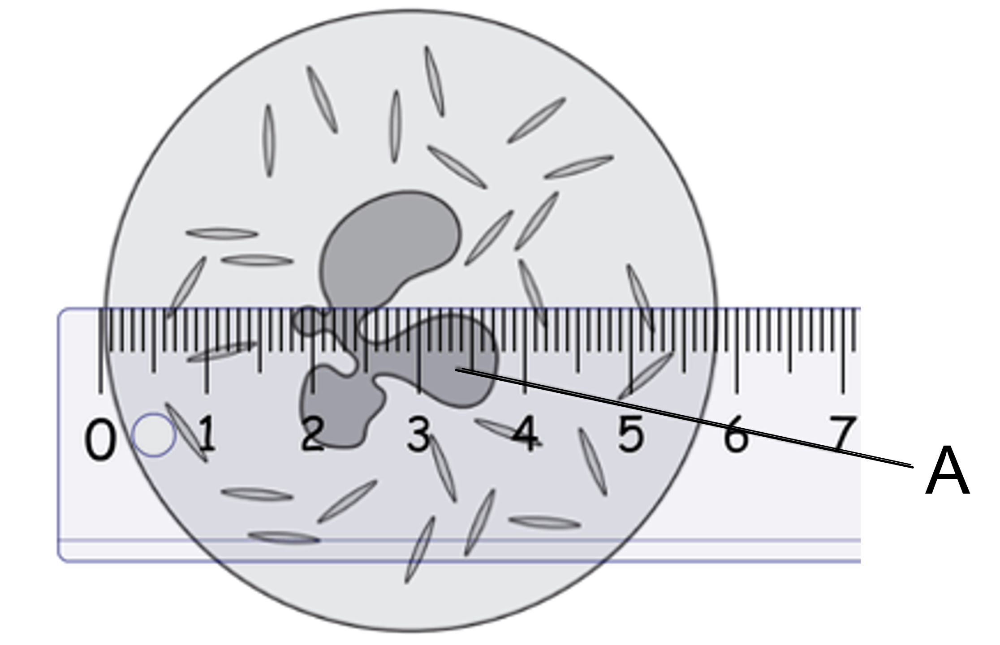
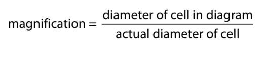
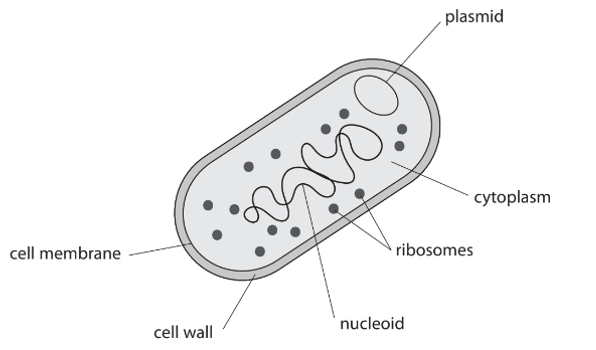
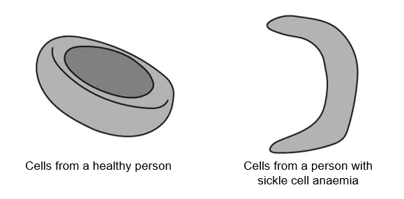
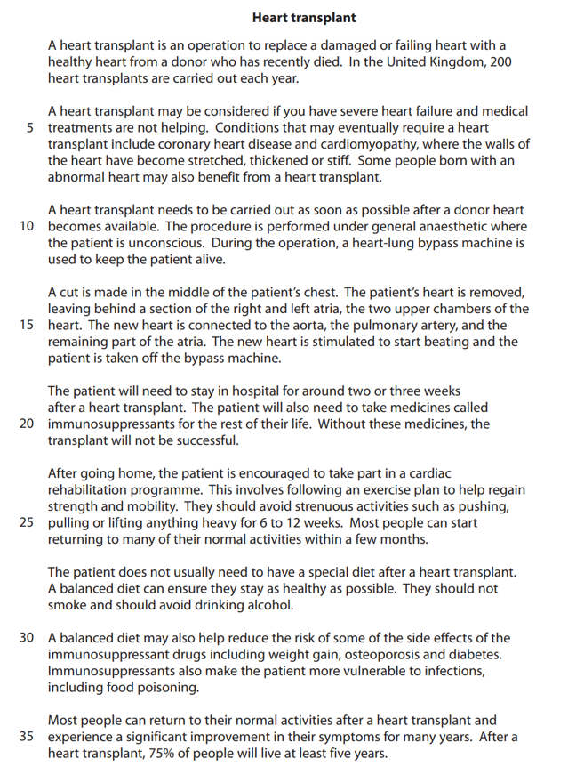
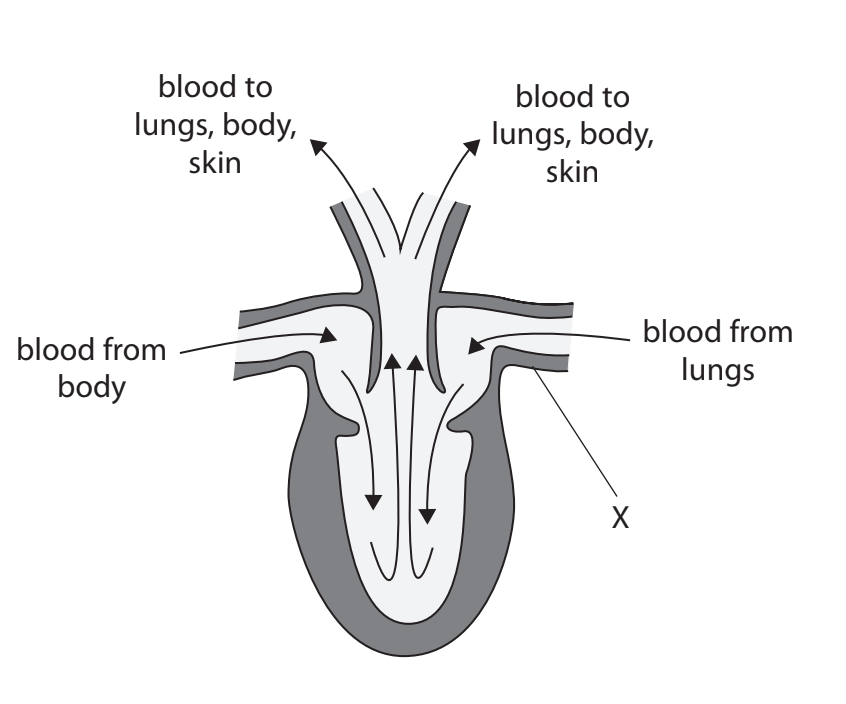
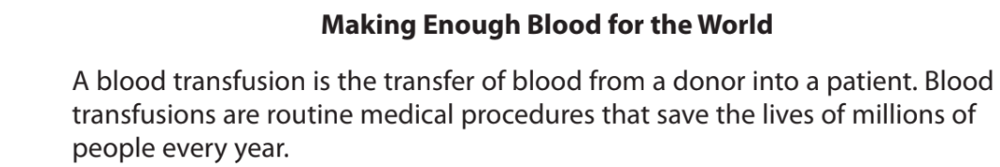
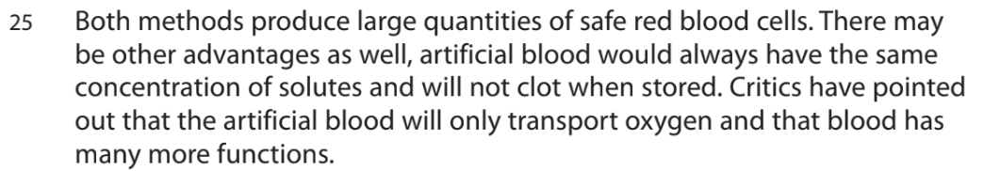

# Exam Questions — Transport Systems
**2. Structure & Function in Living Organisms** · Edexcel IGCSE Science (Double Award) (4SD0) — 17/Biology
> Source: [https://www.savemyexams.com/igcse/science/edexcel/double-award/17/biology/topic-questions/structure-and-function-in-living-organisms/transport-systems/exam-questions/](https://www.savemyexams.com/igcse/science/edexcel/double-award/17/biology/topic-questions/structure-and-function-in-living-organisms/transport-systems/exam-questions/) · 12 questions · total 120 marks

## Q1 — easy — 4 marks · exam-questions

### 3((a)) — 1 mark — command: which — structured — from paper Nov 2020 · 4BI1/2BR
Plant roots absorb water from soil.

This water is transported to the leaves and then moves into the air.

Which of these processes is used to absorb water from the soil?

| ☐ | **A** | Active transport |
|---|---|---|
| ☐ | **B** | Diffusion |
| ☐ | **C** | Evaporation |
| ☐ | **D** | Osmosis |

### 3((b)) — 1 mark — command: name — structured — from paper Nov 2020 · 4BI1/2BR
Name the tissue that transports water to the leaves.

### 3((e)) — 2 marks — command: give — structured — from paper Nov 2020 · 4BI1/2BR
Give two uses of water in a plant.

## Q2 — easy — 10 marks · exam-questions

### 10((a)) — 4 marks — command: describe — structured — from paper Jan 2021 · 4BI1/1BR
Blood consists of cells and plasma.

Plasma transports various substances to and from different parts of the body.

Describe the function of plasma in transporting named substances in the body.

### 10((b)) — 5 marks — command: multiple — structured — from paper Jan 2021 · 4BI1/1BR
The diagram shows a white blood cell called a phagocyte.

(i) The magnification of the cell is calculated using this formula.

The actual diameter of the cell is 0.013 mm.

Calculate the magnification of the cell. A ruler has been added to the diagram to help your calculations.

**(2)**

(ii) Name the structure labelled **A** in the diagram.

**(1)**

(iii) Describe the function of this cell in defending the body from infection.

**(2)**

### 10((c)) — 1 mark — command: state — structured — from paper Jan 2021 · 4BI1/1BR
Other white blood cells produce proteins called antibodies.

State how you could test a sample of plasma for protein.

## Q3 — medium — 6 marks · exam-questions

### 3((a)) — 4 marks — command: give — structured — from paper Jan 2022 · 4BI1/2BR
The diagram shows a magnified image of a root hair cell from a young plant.

Give the names of structures labelled **W**, **X**, **Y** and **Z**.

### 3((b)) — 2 marks — command: calculate — structured — from paper Jan 2022 · 4BI1/2BR
The actual length of the cell, along the line between A and B, is 1000 μm.

Calculate the magnification of this drawing.

## Q4 — medium — 2 marks · exam-questions

### 2((a)) — 2 marks — command: give — structured — from paper June 2021 · 4BI1/2B
*P. multocida* is a bacterium that causes cholera in chickens.

The diagram shows the bacterium.

Give **two** structures in this bacterium that are also found in all eukaryotic cells.

## Q5 — medium — 10 marks · exam-questions

### 2((a)) — 2 marks — command: which — structured — from paper June 2021 · 4BI1/1B
The diagram shows the human heart with four blood vessels labelled **A**, **B**, **C** and **D**.

(i) Which blood vessel brings oxygenated blood to the heart?

**(1)**

| ☐ | **A** |
|---|---|
| ☐ | **B** |
| ☐ | **C** |
| ☐ | **D** |

(ii) Which blood vessel contains blood at the highest pressure?

**(1)**

| ☐ | **A** |
|---|---|
| ☐ | **B** |
| ☐ | **C** |
| ☐ | **D** |

### 2((b)) — 3 marks — command: multiple — structured — from paper June 2021 · 4BI1/1B
(i) Draw a label line on the diagram to show the position of a semi-lunar valve.

**(1)**

(ii) Describe the function of the semi-lunar valves.

**(2)**

### 2((c)) — 5 marks — command: explain — structured — from paper June 2021 · 4BI1/1B
In the heart of a foetus, the two upper chambers (atria) are linked by a hole so that blood can pass between them.

(i) Explain why this hole is normally closed before the baby is born.

**(2)**

(ii) Sometimes the hole does not close.

Explain what effect this will have on the baby.

**(3)**

## Q6 — medium — 11 marks · exam-questions

### 9((a)) — 4 marks — command: suggest — structured — from paper Jan 2021 · 4BI1/1B
Sickle cell anaemia is a condition in which some of the person’s red blood cells develop abnormally.

The diagram shows red blood cells from a healthy person and red blood cells from a person with sickle cell anaemia.

(i) A person with sickle cell anaemia often suffers pain as some of their blood vessels become blocked by the sickle cells.

Suggest why the person’s blood vessels may become blocked.

**(1)**

(ii) People with sickle cell anaemia have symptoms of tiredness and joint pain that get worse if they are exposed to cold temperatures and high altitudes.

Suggest why these symptoms get worse.

**(3)**

### 9((b)) — 3 marks — command: multiple — structured — from paper Jan 2021 · 4BI1/1B
Sickle cell anaemia is caused by a single recessive allele.

(i) State what is meant by the term **recessive**.

**(1)**

(ii) A man and a woman who are both heterozygous for the sickle cell allele have a child.

Calculate the probability that the child will be female and** not** have sickle cell anaemia.

**(2)**

### 9((c)) — 1 mark — command: which — structured — from paper Jan 2021 · 4BI1/1B
Sickle cell anaemia is more common in countries where malaria is found. This is because having an allele for sickle cell anaemia can reduce the likelihood of developing malaria.

Which type of organism causes malaria?

| ☐ | **A** | Bacterium |
|---|---|---|
| ☐ | **B** | Fungus |
| ☐ | **C** | Plant |
| ☐ | **D** | Protoctist |

### 9((d)) — 1 mark — command: what — structured — from paper Jan 2021 · 4BI1/1B
What is the name of the pigment found in red blood cells?

| ☐ | **A** | chlorophyll |
|---|---|---|
| ☐ | **B** | haemoglobin |
| ☐ | **C** | iron |
| ☐ | **D** | magnesium |

### 9((e)) — 2 marks — command: give — structured — from paper Jan 2021 · 4BI1/1B
Give two differences in structure between red blood cells and white blood cells.

## Q7 — medium — 18 marks · exam-questions

### 1((a)) — 1 mark — command: suggest — structured — from paper Nov 2021 · 4BI1/2B
Read the passage below. Use the information in the passage and your own knowledge to answer the questions that follow.

Suggest why cardiomyopathy can cause heart failure (lines 6 to 7).

### 1((b)) — 3 marks — command: describe — structured — from paper Nov 2021 · 4BI1/2B
During the transplant procedure the patient’s heart is removed, leaving behind a section of the right and left atria.

Describe the functions of the atria in the body.

### 1((c)) — 2 marks — command: describe — structured — from paper Nov 2021 · 4BI1/2B
Describe how the blood in the pulmonary artery differs from the blood in the aorta.

### 1((d)) — 3 marks — command: explain — structured — from paper Nov 2021 · 4BI1/2B
Explain the function of the heart-lung bypass machine (lines 11 to 12).

### 1((e)) — 2 marks — command: explain — structured — from paper Nov 2021 · 4BI1/2B
Explain why the patient needs to be given immunosuppressants (lines 19 to 20).

### 1((f)) — 2 marks — command: explain — structured — from paper Nov 2021 · 4BI1/2B
Explain why patients should not smoke after their heart transplant (lines 28 to 29).

### 1((g)) — 1 mark — command: state — structured — from paper Nov 2021 · 4BI1/2B
State what is meant by the term **balanced diet.**

### 1((h)) — 2 marks — command: calculate — structured — from paper Nov 2021 · 4BI1/2B
Calculate the number of patients in the United Kingdom who have a heart transplant in one year that are still alive five years later (lines 2 to 3 and lines 35 to 36).

### 1((i)) — 1 mark — command: suggest — structured — from paper Nov 2021 · 4BI1/2B
Suggest why patients are advised to avoid strenuous activities after their heart transplant (line 24).

### 1((j)) — 1 mark — command: suggest — structured — from paper Nov 2021 · 4BI1/2B
Suggest why patients are more likely to be at risk of food poisoning after their heart transplant (lines 32 to 33).

## Q8 — medium — 12 marks · exam-questions

### 9((a)) — 2 marks — command: complete — structured — from paper Jan 2021 · 4BI1/1BR
Aerobic respiration uses oxygen and produces ATP.

Complete the word equation for aerobic respiration.

oxygen + .......................... → .......................... + .......................... + ATP

### 9((b)) — 3 marks — command: explain — structured — from paper Jan 2021 · 4BI1/1BR
A scientist investigates the rates of aerobic respiration of some animals.

The scientist calculates the rate of respiration per gram of each animal.

The results are shown in the table.

| **Animal** | **Rate of aerobic respiration per gram of animal in arbitrary units** |
|---|---|
| Frog | 150 |
| Human | 200 |
| Mouse | 1500 |

Explain why a mouse uses more oxygen per gram than a human.

### 9((c)) — 7 marks — command: multiple — structured — from paper Jan 2021 · 4BI1/1BR
The structure of a frog heart is different from the structure of a human heart.

The diagram shows a section of a frog heart with arrows showing the direction of blood flow.

(i) What is the name of the blood vessel labelled X?

**(1)**

| ☐ | **A** | aorta |
|---|---|---|
| ☐ | **B** | pulmonary artery |
| ☐ | **C** | pulmonary vein |
| ☐ | **D** | vena cava |

(ii) Give one difference between the structure of the frog heart and a human heart.

**(1)**

(iii) Humans can run for long periods of time. Frogs can only move for short periods of time.

Explain how the structure of the heart of a frog means that it is unable to move for long periods of time.

**(5)**

## Q9 — hard — 6 marks · exam-questions

### 2((a)) — 2 marks — command: multiple — structured — from paper Nov 2021 · 4BI1/1B
Human blood contains red blood cells and white blood cells.

The table shows the number of these blood cells in a sample of blood.

| **Type of cell** | **Number of cells per mm****3** | **Number of cells per mm****3 ****in standard form** |
|---|---|---|
| Red blood cell | 5 000 000 | 5.0 × 106 |
| White blood cell | 6000 |   |

(i) Complete the table to give the number of white blood cells per mm3 in standard form.

**(1)**

(ii) What is the number of red blood cells in 1000 cm3 of this person's blood?

**(1)**

| ☐ | **A** | 5.0 × 106 |
|---|---|---|
| ☐ | **B** | 5.0 × 109 |
| ☐ | **C** | 5.0 × 1011 |
| ☐ | **D** | 5.0 × 1012 |

### 2((b)) — 4 marks — command: explain — structured — from paper Nov 2021 · 4BI1/1B
The table gives names, descriptions and symptoms of two blood conditions.

| **Name of condition** | **Description** | **Symptom** |
|---|---|---|
| Anaemia | Low red blood cell count | Often tired |
| Leukopenia | Low white blood cell count | Likely to get infections |

(i) Explain why a person with anaemia is often tired.

**(2)**

(ii) Explain why a person with leukopenia is more likely to get an infection.

**(2)**

## Q10 — hard — 15 marks · exam-questions

### 6((a)) — 1 mark — command: state — structured — from paper Nov 2021 · 4BI1/1B
Cholesterol is needed in the diet for making cell membranes.

State the role of the cell membrane.

### 6((b)) — 2 marks — command: calculate — structured — from paper Nov 2021 · 4BI1/1B
Too much cholesterol is a health risk because fatty deposits build up in arteries.

The lumen of an artery had a diameter of 4.0 mm before the build-up of a fatty deposit.

The fatty deposit covers 45 % of the original area of the lumen.

Calculate the area in mm2 of the lumen that is available for blood flow.

[area of the lumen = πr2]

[π = 3.14]

### 6((c)) — 8 marks — command: multiple — structured — from paper Nov 2021 · 4BI1/1B
A scientist tests the blood cholesterol concentration in a sample of men between 25 and 34 years old.

The scientist groups the men in ranges of blood cholesterol concentration and counts the number of men in each range.

The table gives the scientist’s results.

| **Range of blood cholesterol concentration in mg per cm****3** | **Number of men in each range** |
|---|---|
| 80 to 119 | 13 |
| 120 to 159 | 150 |
| 160 to 199 | 442 |
| 200 to 239 | 299 |
| 240 to 279 | 115 |
| 280 to 319 | 34 |
| 320 to 359 | 9 |
| 360 to 399 | 5 |

(i) Plot a suitable graph on the grid to show these results.

**(5)**

(ii) Which range of blood cholesterol levels is the mode for this sample?

**(1)**

| ☐ | **A** | 80 to 119 |
|---|---|---|
| ☐ | **B** | 80 to 379 |
| ☐ | **C** | 160 to 199 |
| ☐ | **D** | 360 to 399 |

(iii) A blood cholesterol level greater than 239 mg per 100 cm3 means a person has a higher risk of heart disease.

Calculate the percentage of men in the sample at a higher risk of heart disease.

**(2)**

### 6((d)) — 4 marks — command: discuss — structured — from paper Nov 2021 · 4BI1/1B
Statins are drugs that reduce blood cholesterol levels.

A scientist investigates the use of one type of statin on the risk of having a heart attack.

He gives the statin to one group of people and gives a control substance to another group of people.

He calculates the percentage of people in each group that has a heart attack during the next four years.

The table gives the scientist’s results.

| **Group** | **Percentage (%) having** **heart attacks** |
|---|---|
| Statin | 2.2 |
| Control substance | 3.8 |

A conclusion from this data is that statins reduce the risk of heart attacks.

Discuss this conclusion.

## Q11 — hard — 12 marks · exam-questions

### 3((a)) — 7 marks — command: multiple — structured — from paper Jan 2021 · 4BI1/1B
The diagram shows the human circulation system with some blood vessels labelled A to J. The arrows show the direction of blood flow.

The table gives some statements about the content of blood vessels in this circulation system.

(i) Complete the table by giving the letter of the blood vessel that matches each statement.

**(5)**

| **Statement** | **Letter** |
|---|---|
| Contains the least carbon dioxide |   |
| Contains the most glucose after a meal |   |
| Contains the least oxygen |   |
| Contains the least urea |   |
| Contains blood at the highest pressure |   |

(ii) State two ways in which the structure of blood vessel A differs from the structure of blood vessel J.

**(2)**

### 3((b)) — 5 marks — command: discuss — structured — from paper Jan 2021 · 4BI1/1B
Muscles in the legs contain capillaries.

A scientist investigates how long-term training affects the number of capillaries in an athlete’s leg muscles.

The scientist determines the mean number of capillaries per mm2 in samples of leg muscle from the athlete before and after a period of training.

The table shows the scientist’s results.

| **Muscle sample** | **Mean number of capillaries per mm****2** |
|---|---|
| Before training | 313 |
| After training | 349 |

The scientist concludes that training improves the athletic performance.

Discuss this conclusion.

## Q12 — hard — 14 marks · exam-questions

### 1((a)) — 1 mark — command: name — structured — from paper Jan 2022 · 4BI1/2B
Read the passage below. Use the information in the passage and your own knowledge to answer the questions that follow.

César Astudillo from Collado Villalba, Spain, CC BY 2.0 <https://creativecommons.org/licenses/by/2.0>, via Wikimedia Commons. Image cropped and colour removed.

| **Blood group** | **Antigens present** |
|---|---|
| A | A |
| B | B |
| AB | A and B |
| O | Neither A nor B |

Name the type of cell that produces antibodies. (Lines 8 and 9)

### 1((c)) — 2 marks — command: calculate — structured — from paper Jan 2022 · 4BI1/2B
Calculate the number of blood donations collected per year from the high‐income countries. (Lines 14 and 15)

Give your answer in standard form.

### 1((d)) — 3 marks — command: explain — structured — from paper Jan 2022 · 4BI1/2B
Some scientists have suggested that spherical artificial red blood cells transport oxygen less efficiently than normal human red blood cells.

Explain why the shape of the artificial red blood cells reduces the efficiency of oxygen transport compared to normal human red blood cells. (Lines 18 and 19)

### 1((f)) — 2 marks — command: explain — structured — from paper Jan 2022 · 4BI1/2B
Explain why the artificial red blood cells are suspended in sodium chloride solution instead of in water. (Line 20)

### 1((g)) — 4 marks — command: multiple — structured — from paper Jan 2022 · 4BI1/2B
#### Separate: Biology Only

(i) Explain why stem cells can be used to make large quantities of red blood cells. (Lines 22 and 23)

**(2)**

(ii) Suggest why the scientists made red blood cells with blood group O. (Lines 22 and 23)

**(2)**

### 1((h)) — 2 marks — command: give — structured — from paper Jan 2022 · 4BI1/2B
Give two substances found in blood plasma that are not present in the artificial blood. (Lines 28 and 29)
