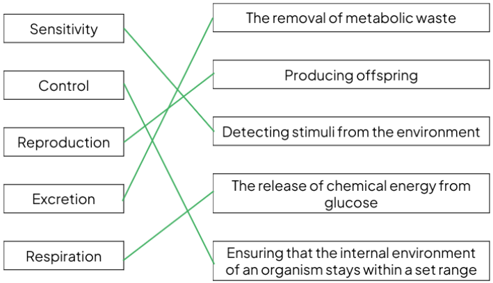
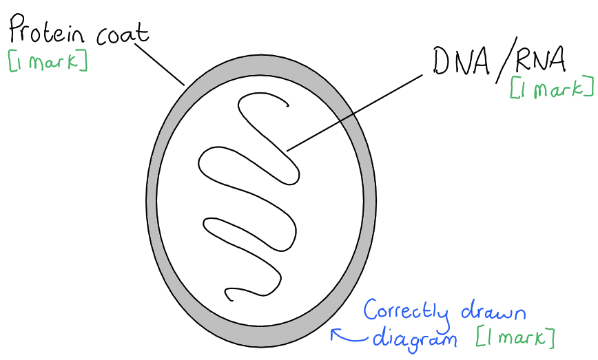
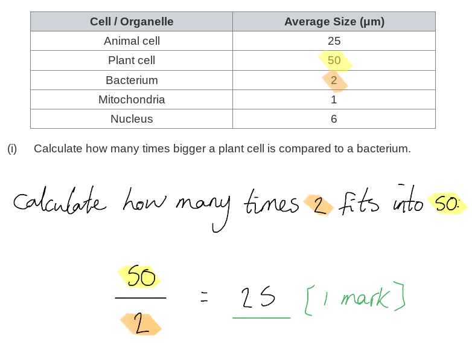
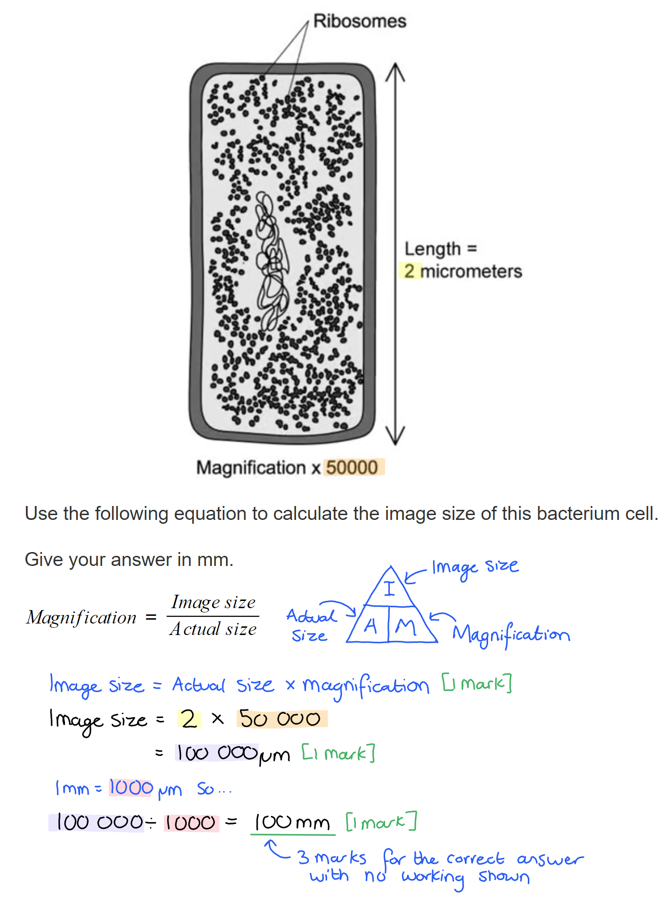
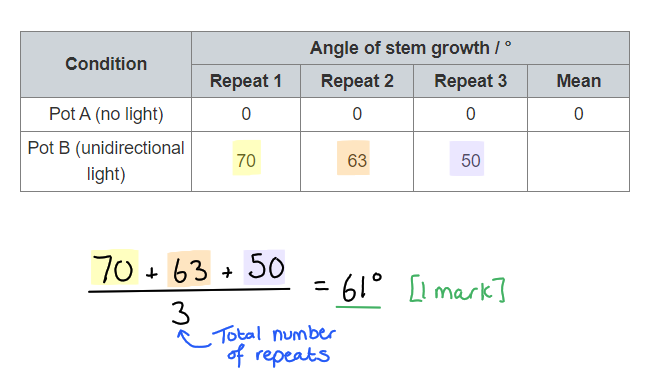
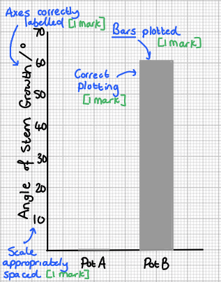
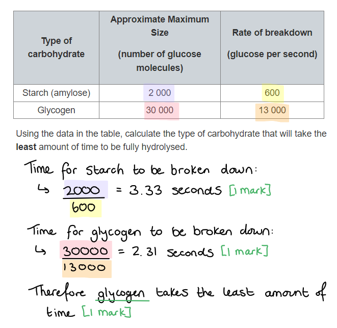

# Mark Schemes — Characteristics of Living Organisms
**1. The Nature & Variety of Living Organisms** · Edexcel IGCSE Science (Double Award) (4SD0) — 17/Biology

## Q1 — easy — 9 marks · exam-questions

### 1() — 3 marks
The completed table is as follows...

Award 1 mark for each correct **row**:

| **Group** | **Cells have a cell wall** | **Cells are eukaryotic** | **Can carry out saprotrophic nutrition** |
|---|---|---|---|
| Fungi | ✓ | ✓ | ✓ |
| Bacteria | ✓ |   | ✓ |
| Plant | ✓ | ✓ |   |

**[Total: 3 marks]**

### 2() — 4 marks
(i) Plants synthesise starch by...

- (Joining together) glucose; **[1 mark]**
- (Excess) from photosynthesis;** [1 mark]**

> *Starch is a biological molecule that is made from many **molecules of glucose joined together** in a chain. Plants **make glucose during photosynthesis** and then the molecules of glucose are **joined together to produce starch**.*

(ii) A test to identify starch in a plant cell is...

- Add <u>iodine</u>; **[1 mark]**
- Cells should turn blue/black in the (presence of starch); **[1 mark]**

**[Total: 4 marks]**

### 3() — 2 marks
Root hair cells do not contain chloroplasts because...

Any **two** of the following:

- Chloroplasts absorb light energy for photosynthesis; **[1 mark]**
- Root hair cells do not have access to light / are underground / do not carry out photosynthesis;** [1 mark]**
- Chloroplasts are not involved in the absorption of water/minerals from the soil (which is the role of root hair cells); **[1 mark]**

**[Total: 2 marks]**

> *It is also important to remember that chloroplasts are not unique to plant cells, for example, some protoctists can also contain chloroplasts. *

## Q2 — easy — 17 marks · exam-questions

### 1() — 5 marks
The correct lines would be drawn as follows...

Award 1 mark for each correct line:

*Reject marks for any characteristic that has more than one line drawn.*

**[Total: 5 marks]**

> *Make sure to always draw lines with a ruler. Any curved or sketchy lines may not be clear to the examiner and you may not be given the mark. *

### 2() — 3 marks
Viruses are not classified as living organisms because...

Any **three **of the following:

- They cannot reproduce without a host; **[1 mark]**
- They do not move; **[1 mark]**
- They do not respire; **[1 mark]**
- They do not respond to stimuli;** [1 mark]**
- They do not grow/develop; **[1 mark]**
- They do not excrete; **[1 mark]**
- They do not feed; **[1 mark]**
- They do not control their internal conditions; **[1 mark]**

**[Total: 3 marks]**

> *These are all the different categories in the MRS C GREN system of classifying living organisms. *

### 3() — 7 marks
(i) The definition of a pathogen is...

- A (micro)organism that causes (infectious) disease;** [1 mark]**

(ii) Three other groups of organisms that can contain pathogens are...

- Bacteria; **[1 mark]**
- Fungi; **[1 mark]**
- Protoctist;** [1 mark]**

(iii) A diagram of a virus is...

- Diagram that shows an outer layer surrounded by an inner strand; **[1 mark]**
- Protein coat labelled;** [1 mark]**
- DNA/RNA/genetic material labelled;** [1 mark]**

**[Total: 7 marks]**

> *Remember that viruses can come in a variety of different shapes and sizes. You would never be expected to draw anything other than the most basic structure. If your diagram doesn't look exactly the same as this one, that is OK, as long as it shows the correct parts. *

> *When labelling a diagram always use straight lines, using a ruler if possible. That will make it really clear where in the diagram you are pointing to. *

### 4() — 2 marks
TMV causes...

Any **two **of the following:

- Chloroplasts are prevented from forming / no chloroplasts are present;** [1 mark]**
- Discolouration of the leaves / a mosaic pattern on the leaves (due to lack of green pigment found in chloroplasts);** [1 mark]**
- Reduced growth (due to lack of photosynthesis); **[1 mark]**

**[Total: 2 marks]**

> *TMV is an example of a virus that is listed in your specification, alongside influenza and HIV. Make sure you have a basic knowledge of all these examples.*

## Q3 — easy — 11 marks · exam-questions

### 1() — 2 marks
An explanation of the accuracy of the statement is...

Any **two **of the following:

- Excretion is the removal of <u>metabolic</u> waste / the waste products of <u>metabolic</u> reactions; **[1 mark]**
- Faeces are not a product of metabolism / removal of faeces is not excretion (so the student is incorrect);** [1 mark]**
- There are other types of excretion, e.g. exhaling / sweating;** [1 mark]**

**[Total: 2 marks]**

> *Excretion is the removal of **metabolic waste** from the body; this refers to waste that is produced during **chemical reactions** that occur inside the cells. Faeces are made up of the undigested food that remains after digestion, so they are not the product of metabolism, and are therefore not removed from the body during **excretion**.*

> *Referring to the loss of faeces as the excretion is a really common mistake made by many students; make sure you do not fall into the same trap. The removal of faeces can instead be referred to as egestion; the removal of solid waste from the body.*

### 2() — 4 marks
(i) Two excretory products produced by plants are...

Any **two** of the following:

- Carbon dioxide;** [1 mark]**
- Oxygen; **[1 mark]**
- Water (vapour); **[1 mark]**

(ii) The processes that produce these products are...

The **relevant two** answers from the following:

- (Carbon dioxide =) respiration; **[1 mark]**
- (Oxygen =) photosynthesis; **[1 mark]**
- (Water =) respiration/metabolism; **[1 mark]**

*The processes must match the waste products for marks to be awarded in part (b) (ii).*

*Ignore references to transpiration in marking point 3 here, as water lost in this way does not come from metabolism.*

**[Total: 4 marks]**

### 3() — 5 marks
The completed passage is as follows...

Award 1 mark for each correct answer:

- Plant cells contain a nucleus and can therefore be classified as **eukaryotic/eukaryotes**; **[1 mark]**
- The cells are supported by a cell wall made of **cellulose**; **[1 mark]**
- In order to carry out **respiration**; **[1 mark] **to release energy, plants require glucose. They get this glucose by carrying out a process called **photosynthesis**; **[1 mark]** Any excess glucose can be stored in the plant cells in the form of **sucrose/starch**; **[1 mark]**

**[Total: 5 marks]**

## Q4 — easy — 7 marks · exam-questions

### 3((a)) — 2 marks
(i) **The correct answer is ****B ****because...**

Yeast are fungi, and fungal cell walls are made of chitin.

**A** is incorrect because **plant** cells walls are made of cellulose.

**C **and** D** are incorrect because these are both forms of carbohydrate storage and do not form part of cell walls.

(ii) **The correct answer is ****A ****because...**

All cells are surrounded by a cell membrane; both eukaryotic and prokaryotic.

**B**, **C** and **D** are all incorrect because they are membrane-bound (surrounded by their own membranes), meaning that they are not present in prokaryotic cells.

**[Total: 2 marks]**

### 2() — 2 marks
The parts in the diagram are...

- A = mycelium; **[1 mark]**
- B** **= hyphae; **[1 mark]**

**[Total: 2 marks]**

> *Fungal hyphae have a long, thread-like structure. Mycelium is the name given to a large network of hyphae. *

### 3() — 3 marks
Fungi get their nutrition by...

- Saprotrophic nutrition; **[1 mark]**
- (Fungi) secrete enzymes extracellularly / out of their cells; **[1 mark]**
- The cells absorb the products/nutrients from their environment; **[1 mark]**

**[Total: 3 marks]**

## Q5 — easy — 12 marks · exam-questions

### 1() — 3 marks
The correctly completed table is as follows...

Award 1 mark per correct **column**:

| **Feature** | **Eukaryotic cells only** | **Prokaryotic cells only** | **Both cell types** |
|---|---|---|---|
| Cell membrane |   |   | ✓ |
| Cell wall |   |   | ✓ |
| Nucleus | ✓ |   |   |
| Plasmid |   | ✓ |   |
| Chloroplast | ✓ |   |   |
| Cytoplasm |   |   | ✓ |
| Mitochondria | ✓ |   |   |

**[Total: 3 marks]**

> *Remember that although not all eukaryotic cells have cell walls, plants, fungi and some protoctists do have them. *

### 2() — 4 marks
(i) A comparison between the size of a plant cell and a bacterium is...

- (50 ÷ 2 =) 25; **[1 mark]**

*One mark is given for the correct answer in the absence of working shown.*

(ii) Prokaryotic cells cannot contain a nucleus because...

- Nucleus is too big / would not fit inside bacteria/prokaryotic cell **OR** bacteria/prokaryotic cell is too small; **[1 mark]**
- Quoted data from the table to support the above point, e.g. 6 μm is bigger than 2 μm; **[1 mark]**

(iii) Evidence that mitochondria could have evolved from bacteria is...

- Mitochondria and bacteria are very similar in size / 1 μm and 2 μm are very similar; **[1 mark]**

***Ignore**** references to other evidence for theory e.g. DNA in mitochondria*

> *This theory is called endosymbiotic theory and there are lots of really interesting pieces of evidence associated with it. However, the question specially asks for evidence **from the table**, so marks will not be awarded for references to other evidence.*

**[Total: 4 marks]**

### 3() — 5 marks
The correct groups are...

| **Species** | **Group of organisms** |
|---|---|
| *Mucor* | Fungi; **[1 mark]** |
| *Amoeba* | Protoctist(s); **[1 mark]** |
| Yeast | Fungi; **[1 mark]** |
| *Lactobacillus* | Bacteria; **[1 mark]** |
| *Plasmodium* | Protoctist(s); **[1 mark]** |

**[Total: 5 marks]**

> *These are all examples that are specifically listed in your specification, so you should be able to identify the groups to which they all belong. The most common mistakes are thinking that yeast and plasmodium are types of bacteria. *

## Q6 — medium — 6 marks · exam-questions

### 5((a)) — 6 marks
The different types of pathogen are...

Any **six **of the following**:**

- **Viruses **are non-living organisms / small particles / protein coat / capsid **OR** **viruses** rely on other organisms for reproduction; **[1 mark]**
- (An example of a disease viruses cause is) AIDS / TMV / any other correct example; **[1 mark]**
- **Bacteria** are microscopic single-celled organism / prokaryotic **OR** have no nucleus / have nucleoid / contain plasmids; **[1 mark]**
- (An example of a disease bacteria cause is) Pneumonia  / any other correct example;** [1 mark]**
- **Fungus** are not able to carry out photosynthesis / (use) saprotrophic nutrition **OR** are single-celled / have a structure of hyphae / their cell wall is made of chitin; **[1 mark]**
- (An example of a disease fungi cause is) Athlete’s foot / any other correct example; **[1 mark]**
- **Protoctist** / **protozoa** *Plasmodium* / are microscopic single-celled organism;** [1 mark]**
- (An example of a disease prototists cause is) Malaria / any other correct example;** [1 mark]**

**[Total: 6 marks]**

> *Remember that there is a difference between the name of the disease and the pathogen that causes the disease, for example, HIV is a virus that causes the disease AIDS, and** Plasmodium** is a protoctist that causes the disease malaria. These terms are not interchangeable. The pathogen is the organism that causes the disease, but the disease is the symptoms and the effect the pathogen has on the person's body. *

## Q7 — medium — 10 marks · exam-questions

### 1() — 6 marks
A comparison of plant cell and a bacterium is...

*Similarities*

Up to **four **of the following:

- Both have cell walls; **[1 mark]**
- Both have genetic material / DNA; **[1 mark]**
- Both have cytoplasm; **[1 mark]**
- Both have cell membranes;** [1 mark]**
- Both have ribosomes; **[1 mark]**

*Differences*

Up to **four **of the following:

- Bacteria cell wall (is made of peptidoglycan) whereas plant cell wall is made of cellulose; **[1 mark]**
- Bacteria cells can have plasmids, plant cells cannot; **[1 mark]**
- Bacteria cells can have flagella, plant cells cannot; **[1 mark]**
- Bacteria DNA is circular, plant DNA is linear; **[1 mark]**
- Plant cells have a nucleus, bacteria cells do not; **[1 mark]**
- Plant cells have a mitochondria, bacteria cells do not; **[1 mark]**
- Plant cells have a chloroplasts, bacteria cells do not; **[1 mark]**
- Plant cells have a vacuole, bacteria cells do not; **[1 mark]**
- Plant cells are much larger than bacteria cells; **[1 mark]**

**[Total: 6 marks]**

> *Remember to use comparative language in your answer. You need to include information about both similarities and differences for full marks, as well as mentioning both types of cells for each point. For example, if you wrote an answer that said bacteria have A, B and C and then plants have X, Y and Z, you haven't compared the two and cannot gain marks. *

### 2() — 1 marks
This could be possible because...

Any **one **of the following:

- Bacteria could contain <u>chlorophyll</u>;** [1 mark]**
- Bacteria could contain <u>enzymes</u> that are capable of (catalysing the reactions for photosynthesis / production of glucose);** [1 mark]**
- Bacteria could carry out a different type of photosynthesis to plant cells / not the same chemical reactions (used to produce glucose);** [1 mark]**

**[Total: 1 mark]**

> *You're not expected to know any details of how bacteria carry out photosynthesis. You simply need to apply your knowledge of components necessary for the reaction (chlorophyll and enzymes) to a new scenario. *

### 3() — 3 marks
The image size of the cell is...

- Rearrange equation: image size = actual size x magnification; **[1 mark]**
- Sub in numbers: image size = 2 x 50 000 = 100 000μm; **[1 mark]**
- Convert units: 100 000μm = 100mm; **[1 mark]**

*Full marks for correct answer with no working shown*

**[Total: 3 marks]**

## Q8 — medium — 6 marks · exam-questions

### 1() — 1 marks
*Amoeba proteus *is a...

- Protoctist; **[1 mark]**

**[Total: 1 mark]**

> *The **Amoeba** is a named example in your specification and one you need to know. *

### 2() — 4 marks
(i) A comparison of nutrition in *Amoeba* and fungi is...

Any **three **of the following:

- *Amoeba *digest their nutrients internally / fungi digest externally; **[1 mark]**
- *Amoeba *do not secrete enzymes extracellularly, unlike fungi;** [1 mark]**
- *Amoeba *do not get their nutrition from dead material and waste, unlike fungi; **[1 mark]**
- *Amoeba *move to/hunt their prey, unlike (stationary) fungi; **[1 mark]**

(ii) The other life process being demonstrated is...

- Movement;** [1 mark]**

**[Total: 4 marks]**

> *Although you can link nutrition to other life processes, such as respiration and growth, they occur after nutrition rather than simultaneously. The amoeba relies on movement in order to engulf its food, the pseudopodia move to reach around the prey.*

### 3() — 1 marks
The contractile vacuole carries out...

- Excretion;** [1 mark]**

**[Total: 1 mark]**

> *The removal of water from the cell isn't excretion because it has not been involved in metabolism in the cell, however the other waste products are excreted. *

## Q9 — medium — 13 marks · exam-questions

### 1() — 5 marks
(i) Three features that identify this mosquito as an animal are...

Any **three **of the following:

- Multicellular **OR** not unicellular; **[1 mark]**
- Do not contain chloroplasts in cells / do not carry out photosynthesis; **[1 mark]**
- Store carbohydrate as glycogen; **[1 mark]**
- No cell walls; **[1 mark]**
- Any other valid point; **[1 mark]**

> *There are many different features that are universal to all animals. It is important that you can name some and can compare to other types of organisms. *

(ii) A mosquito is not a pathogen because...

Any **two **of the following:

- A pathogen is a microorganism that causes infectious disease; **[1 mark]**
- Mosquito just spreads the pathogen (e.g. *Plasmodium*);** [1 mark]**
- Only mosquitos that carry pathogens can cause diseases;** [1 mark]**
- The bite of the mosquito doesn't directly cause any disease symptoms; **[1 mark]**

> *A mosquito in this context is classed as a vector. This is an organism that passes a pathogen from one organism to another, without having the disease itself. *

**[Total: 5 marks]**

### 2() — 3 marks
(i) *Plasmodium* is...

- A protoctist; **[1 mark]**

> *Although the cell has lots of structural similarities with an animal cell it is important to remember that some protoctists can be classified as "animal-like" and some are more "plant-like". This is a specific example that you are expected to memorise. *

(ii) The student's conclusion is incorrect because...

Any **two **of the following:

- The cell (in the diagram) contains mitochondria **AND** mitochondria carry out respiration / are the site of respiration; **[1 mark]**
- The plasmodium is single celled / has a large surface area to volume ratio **SO** oxygen can reach the mitochondria by diffusion; **[1 mark]**
- Respiration is not the same as breathing; **[1 mark]**

**[Total: 3 marks]**

### 3() — 5 marks
(i) A person with malaria might experience the following symptoms...

- Tiredness / lack of energy / fatigue / shortness of breath / difficulty exercising;** [1 mark]**
- People with less oxygen/haemoglobin in their blood will carry out less (aerobic) <u>respiration</u>; **[1 mark]**
- This will release <u>less energy</u> for the cell to use; **[1 mark]**

(ii) It is beneficial for *Plasmodium *to live inside red blood cells because...

- This will allow them to be taken into the bodies of mosquitoes when they bite / mosquitoes drink the blood; **[1 mark]**
- Can pass between humans / transmit/spread the pathogen/*Plasmodium*; **[1 mark]**

**[Total: 5 marks]**

> *With "suggest" questions you're not expected to have been taught what the answers are. You need to use your knowledge and the information in the question to apply to a new scenario. *

## Q10 — medium — 15 marks · exam-questions

### 1() — 5 marks
(i) Two structural features that are universal for all virus types are...

- Genetic material / nucleic acids; **[1 mark]**
- Protein coat / capsid; **[1 mark]**

(ii) It is necessary for the three types of virus to have different structures because...

Any **three **of the following:

- They infect different types of cell/organism/species / different cells have different structures to invade; **[1 mark]**
- Viruses have to have mechanisms to insert their genetic material/DNA/RNA into host cell / host cell will have different adaptations/barriers to prevent this;** [1 mark]**
- E.g. TMV / bacteriophage have to get past cell walls, coronavirus does not; **[1 mark]**
- Have different mechanisms for how they spread / transfer between hosts; **[1 mark]**
- Adaptations to resist actions of host organism's immune system; **[1 mark]**

**[Total: 5 marks]**

> *There is a constant arms race between the immune system of the host and the virus. Each adapting to the counteract the effects of the other. This had led to the viruses being so diverse to suit the organisms they invade. *

### 2() — 3 marks
Viruses can spread by...

Any **three **of the following:

- Insects / animals / bites / vectors; **[1 mark]**
- Contaminated food; **[1 mark]**
- Contaminated water;** [1 mark]**
- Touch; **[1 mark]**
- In the air / coughs/sneezes / droplets;** [1 mark]**

**[Total: 3 marks]**

> *Ignore** other examples of bodily fluids, such as kissing, contaminated blood transfusion, breastfeeding mothers, sexual intercourse etc. *

### 3() — 3 marks
(i) People with HIV are more susceptible to infections because...

Any **one **of the following:

- White blood cells help destroy pathogens/viruses/cells infected with viruses;** [1 mark]**
- White blood cells are part of the immune system;** [1 mark]**

(ii) Taking medication to stop HIV from replicating can prevent AIDS by...

Any **two **of the following:

- Stops viruses increasing in number (in the body);** [1 mark]**
- Stops HIV spreading to new white blood cells; **[1 mark]**
- More white blood cells are able to help destroy pathogens / immune system remains strong;** [1 mark]**

**[Total: 3 marks]**

> *Technically it's incorrect to write the term "HIV virus" because HIV stands for Human Immunodeficiency Virus so by writing HIV virus you're saying "virus" twice!  *

### 4() — 4 marks
(i) The trend of data in the graph is...

Any **two **of the following:

- Number of deaths increases from 1990 to 2003/2005;** [1 mark]**
- Number of deaths stays steady from 2005-2007; **[1 mark]**
- Number of deaths decreases from 2005/2007-2020; **[1 mark]**
- Quote data from the graph e.g. increase from 350,000 deaths to 1,700,000 deaths;** [1 mark]**

(ii) Two reasons why the numbers of deaths might have declined in recent years is because...

Any **two **of the following:

- Better understanding/education about how HIV spreads; **[1 mark]**
- More availability of drugs to prevent HIV replicating; **[1 mark]**
- More availability of mechanisms to prevent the spread of HIV (e.g. condoms); **[1 mark]**
- Better treatments for AIDS-related illnesses / more medics/healthcare in less developed parts of the world where there is a lot of HIV; **[1 mark]**

**[Total: 4 marks]**

> *There are now drugs that can mean mothers with HIV can give birth/breastfeed children that do not have HIV. HIV used to be common amongst some homosexual male communities, but has declined significantly with a cultural shift towards education and awareness about how the virus spreads. *

## Q11 — hard — 12 marks · exam-questions

### 1() — 2 marks
(i) The independent variable in this experiment is...

- Whether or not light reaches the seedlings / the presence/absence of light/the box that blocks light / whether light comes from the side or whether there is no light at all; **[1 mark]**

> *The independent variable in an experiment is the variable that you change on purpose; here pot A is in the dark while pot B receives light from one side, so the variable that is changed is the presence of light.*

(ii) Another life process being demonstrated is...

- Growth;** [1 mark]**

*Accept movement.*

> *Plants have the ability to respond to their surroundings; this is sensitivity. The mechanism used for most plant responses is a change in the pattern of plant **growth**; as seen here when seedlings grow towards the light.*

> *GCSE students may not know enough about plant responses to recognise this as a **growth** response, so movement is another acceptable answer here.*

**[Total: 2 marks]**

### 2() — 5 marks
(i) The average angle of stem growth for Pot B is...

- 61 (°); **[1 mark]**

(ii) The graph should be drawn as follows...

- Scale: the scale is linear and fills at least half of the area provided; **[1 mark]**
- Line: a bar chart has been drawn (so there is no line); **[1 mark]**
- Axes: X axis is labelled 'Pot A' and 'Pot B' **AND** Y axis is labelled 'angle of stem growth / degrees'; **[1 mark]**
- Points: points are plotted correctly **AND** only average angle is plotted; **[1 mark]**

*Accept ° for 'degrees'.*

*Accept error carried forward for plotting points, meaning that correct plotting of any answer calculated in part (i) can be credited.*

> *Edexcel iGCSE follows the same marking requirements for all questions relating to drawing graphs. There are 5 points and 5 marks available, unless one of the criteria is not relevant, e.g. if a key is not required the graph may be worth a maximum of 4 marks. The 5 possible mark points are as follows: *

> *S - Scale **should be **linear**, increasing in **regular increments**. It should take up **more than half the grid** (and not be squashed into one corner of the graph paper)*

> *L - The line** should **join the points** (as we do not know the intermediate values). It is important that you **use a ruler **to join your points together. Don't extrapolate (join your line) to the origin (0,0) unless your data includes this point. *

> *A - Axes** should be **labelled correctly** and include **units.** These can usually be taken directly from the table. It is also worth remembering that the **Y axis is usually used for the dependent variable **which is found on the right hand side of a table and the **X axis is used to represent the independent variable **which is found in the left column of the table.*

> *P - Points** should be plotted carefully and accurately as you will only be awarded the mark if all points are** within 1 small square** of where they are supposed to be.*

> *K - Keys** are sometimes necessary but** not always**. If there are multiple lines on a line graph or sets of bars on your bar chart then you might like to distinguish the different data sets using a **key or a label on the lines.*

**[Total: 5 marks]**

### 3() — 3 marks
The response benefits the plant because...

Any **three **of the following:

- The plant grows towards the light; **[1 mark]**
- A larger leaf surface area is exposed to light / plant/leaf/chlorophyll absorbs more light; **[1 mark]**
- Plants can carry out <u>more</u> photosynthesis; **[1 mark]**
- There is increased production of glucose; **[1 mark]**
- More respiration/growth in the plant;** [1 mark]**

**[Total: 3 marks]**

> *This response is called phototropism and you will study it in much more detail in the coordination and response topic later in the course. For now, precise details of the mechanism are not required for this answer, but you can gain credit for showing some understanding of plant nutrition.*

> *Note that in a real exam, when you will have covered everything in the course, your answer may require more detail about the specific mechanism of phototropism. *

### 4() — 2 marks
The students could alter their experiment by...

Any **two **of the following:

- Varying light intensity by using different types of bulbs / varying the distance between the plant and the light source; **[1 mark]**
- Repeat at (at least) three different light intensities; **[1 mark]**
- Compare/measure the angle of curvature of the plants exposed to the different light intensities; **[1 mark]**

**[Total: 2 marks]**

> *You don't need to go into all the experimental detail as with CORMS because you're only slightly adjusting an experimental method that has already been described. *

## Q12 — hard — 15 marks · exam-questions

### 1() — 5 marks
(i) A comparison of the structure of starch and glycogen includes...

Any **two **of the following:

- Starch is a helix/curled/coiled structure **whereas** glycogen is not; **[1 mark]**
- Glycogen has lots of branches/lots of strands of glucose **whereas** starch has just one strand/no branches; **[1 mark]**
- Starch is more compact **whereas** glycogen is more spread out; **[1 mark]**
- **Both** are made up of glucose only; **[1 mark]**

> *Don't forget that each statement should provide a **comparison** here, either stating a characteristic that **both structures** have, or **directly contrasting** an element of one structure with the same element of the other.*

(ii) The following organisms store their glucose as...

- Plants = starch; **[1 mark]**
- Animals = glycogen; **[1 mark]**
- Fungi = glycogen; **[1 mark]**

**[Total: 5 marks]**

> *The type of starch shown in the diagram is called amylose. This is where the enzyme amylase (which breaks down starch) gets its name!*

> *You don't need to memorise information about the specific structure of starch and glycogen at this point. You will discuss carbohydrates more in the biological molecules topic. *

### 2() — 4 marks
(i) It is beneficial for animals to store their carbohydrate in their muscle cells because...

Any **one **of the following:

- Glucose is needed for respiration (in muscle cells); **[1 mark]**
- Muscle cells require a lot of energy for contraction/exercise/movement; **[1 mark]**

(ii) Some organisms need to release their glucose faster than others because...

Any **three **of the following:

- Faster release of glucose allows <u>more</u>/<u>faster</u> respiration; **[1 mark]**
- Faster respiration means that <u>more</u> energy can be released (for use in the cells); **[1 mark]**
- Some organisms have a faster rate of metabolism / have higher energy/metabolic requirements; **[1 mark]**
- Some organisms (are more mobile so) use more energy for movement/muscle contraction; **[1 mark]**
- Some organisms (regulate their body temperature so) use more energy for thermoregulation/keeping warm / some organisms thermoregulate; **[1 mark]**

> *The rate at which glucose is released from storage limits the rate at which respiration can occur; **faster release of glucose means faster respiration**. The faster respiration can take place, the **more energy is released** and can be available for the organism's life-processes.*

> *Different groups of organisms have very **different energy requirements**, e.g*

- *A mobile animal will have higher energy requirements than a non-mobile plant.*
- *A mammal that is 'warm-blooded' will have higher energy requirements than a reptile that is 'cold-blooded'.*

> *Storing glucose in an easy-release way is useful for organisms that have high energy requirements.*

**[Total: 4 marks]**

### 3() — 3 marks
The type of carbohydrate that will take the least amount of time to be fully hydrolysed is...

- Glycogen; **[1 mark]**
- Time taken for starch to break down = 3.3/3.33 seconds; **[1 mark]**
- Time taken for glycogen to break down = 2.3/2.31 seconds; **[1 mark]**

**[Total: 3 marks]**

> *A disclaimer that the rate of breakdown data was **imagined** for the sake of this question in order to test your maths skills; the data provided here may not be factually accurate!*

### 4() — 3 marks
(i) The function of cellulose is...

- To make up the cell wall / to give the cell wall support/strength; **[1 mark]**

(ii) Two types of organism that can contain cellulose in their cells is...

- (All) plant cells;** [1 mark]**
- (Some) protoctists; **[1 mark]**

> *Remember that some protoctists are "plant-like" and some are "animal-like". **Chlorella **is an example of a protoctist with a cellulose cell wall. *

**[Total: 3 marks]**

## Q13 — hard — 12 marks · exam-questions

### 1() — 4 marks
(i) The presence of the gut flora demonstrates that not all bacteria are pathogens as follows...

Any **two **of the following:

- Pathogens cause (infectious) disease; **[1 mark]**
- (Many) gut flora bacteria do not cause disease; **[1 mark]**
- Many are useful / help with digestion;** [1 mark]**

> *It is important to remember that not all microorganisms are pathogens; the gut flora have many essential roles to play within their hosts.*

(ii) Gut flora bacteria get their nutrition by...

Any **two **of the following:

- Bacteria secrete their enzymes (extracellularly); **[1 mark]**
- Bacterial enzymes break down/digest nutrients from the human digestive system/food; **[1 mark]**
- Bacteria absorb the digested nutrients into the cell; **[1 mark]**

> *You may have come across extracellular digestion in the context of fungi, but bacteria also use this mechanism to gain their nutrients. The gut flora get their nutrients from the food consumed by their human hosts.*

**[Total: 4 marks]**

### 2() — 3 marks
Antibiotics would affect the gut bacteria as follows...

- The number of bacteria in the gut will decrease / (some) bacteria will die; **[1 mark]**

This would happen because...

- Cell wall destruction could cause the cells to burst/break open/rupture; **[1 mark]**
- Prevention of reproduction would mean that when cells/bacteria die they are not replaced / that the death rate will exceed the rate of reproduction; **[1 mark]**

*Accept references to the development of antibiotic resistance for a maximum of 1 mark.*

**[Total: 3 marks]**

> *You won't cover ideas about antibiotics until much later in the specification, but even if you are still early on in your studies this question is a good opportunity to practice making use of information provided in order to reach an answer. To gain full marks you must refer to the **mechanisms of antibiotic action described in the question**.** **You should be able to draw on your knowledge of prokaryotic cell structure here.*

> *References to other effects, such as the possible development of antibiotic resistance, may not be incorrect, but do not follow the instructions in the question, so full marks cannot be gained this way.*

### 3() — 1 marks
A species of bacteria that is used in the production of yogurt from milk is...

- *Lactobacillus bulgaricus*; **[1 mark]**

**[Total: 1 mark]**

> *This is a named example given in your specification. The process of making yogurt is covered in more detail later in the course. *

### 4() — 4 marks
(i) An explanation of the shape of the curve between point A and point B is...

- The bacteria are increasing in number / the bacterial population is growing; **[1 mark]**
- Because they are (asexually) reproducing; **[1 mark]**

> *You will have learned during your study of MRS C GREN that all living organisms reproduce, so this is a process that will be taking place inside the fermenter. The bacteria between stages A and B have everything that they need to grow and reproduce, so they will undergo cell division and increase in number.*

(ii) An explanation of the shape of the curve after point C is...

Any **two **of the following:

- The bacteria use up the nutrients/amino acids in the fermenter **SO **they cannot build new cells/tissues/molecules/proteins; **[1 mark]**
- The bacteria use up the glucose/oxygen in the fermenter **SO** they can no longer respire; **[1 mark]**
- The bacteria are excreting **SO** they poison themselves with their own waste / their waste builds up and becomes toxic; **[1 mark]**

> *After spending a certain length of time inside this closed system the bacteria will use up nutrients and oxygen, meaning that they will run out of **nutrition** and be unable to sustain **respiration**. They also** excrete** their waste into the surroundings, eventually poisoning themselves. All of this slows down bacterial reproduction, until eventually deaths occur faster than reproduction and the population declines from C onwards.*

> *In reality, many fermenters have pipes that bring in fresh nutrients and oxygen to keep the conditions optimum for the bacteria to reproduce. *

> *Note that fermenters come up again later in the course, in the food production topic. *

**[Total: 4 marks]**
