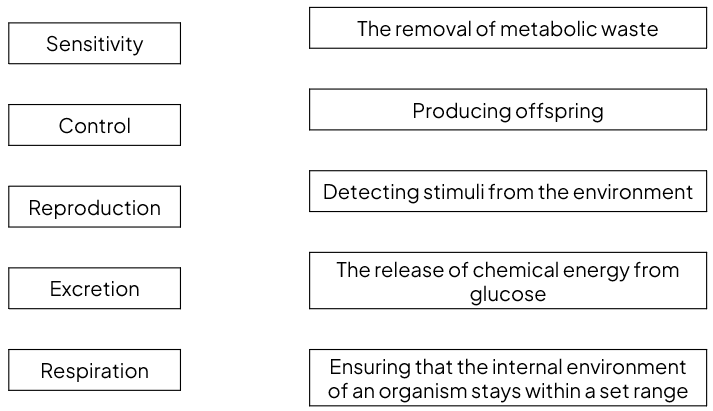
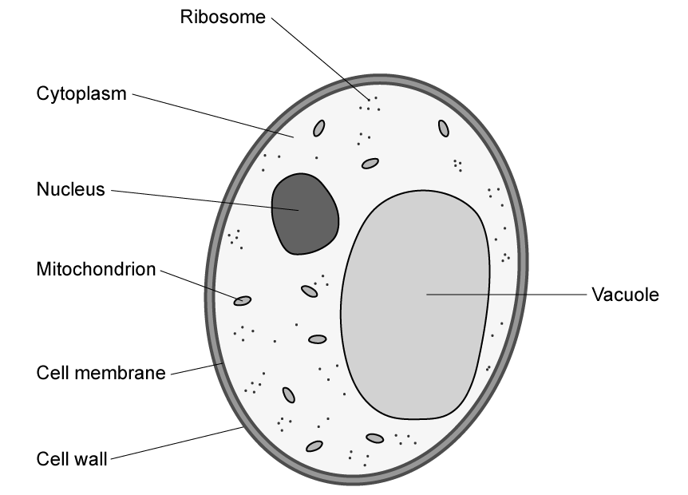
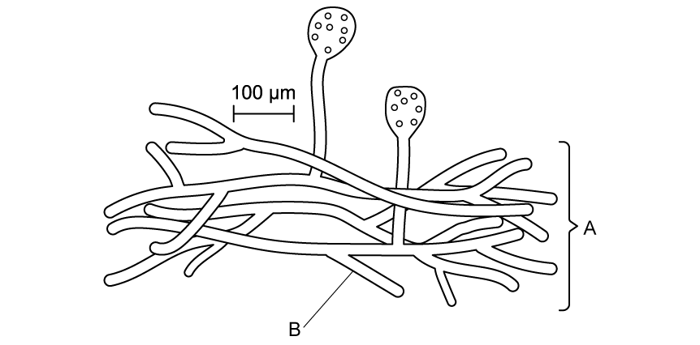
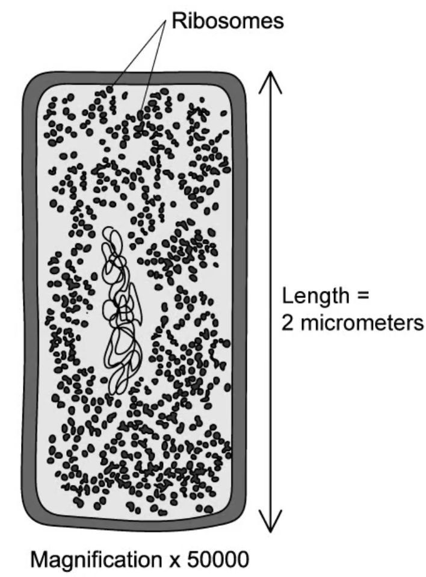
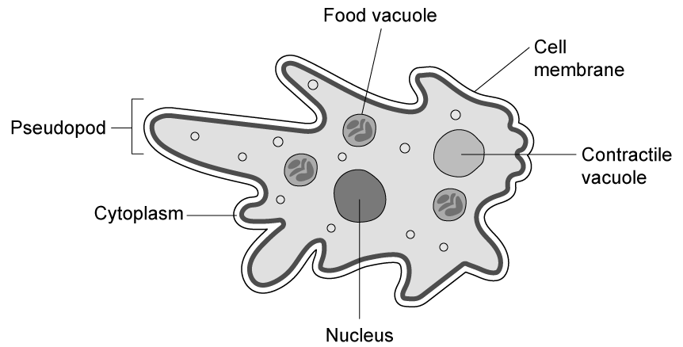
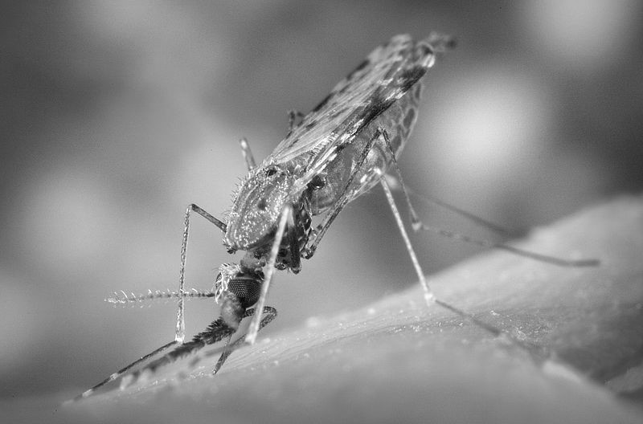
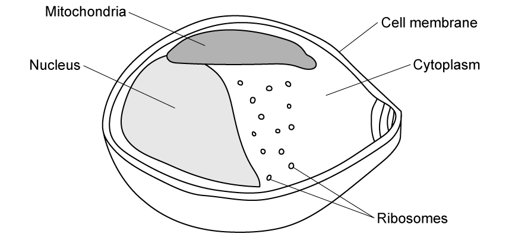
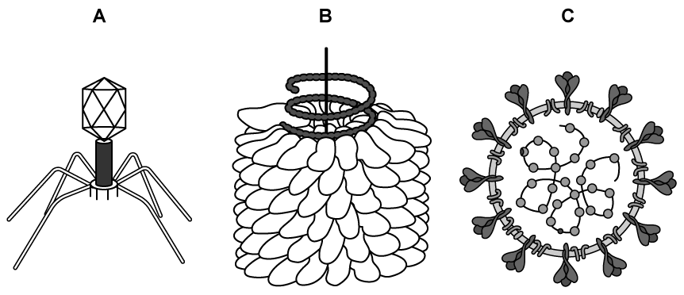
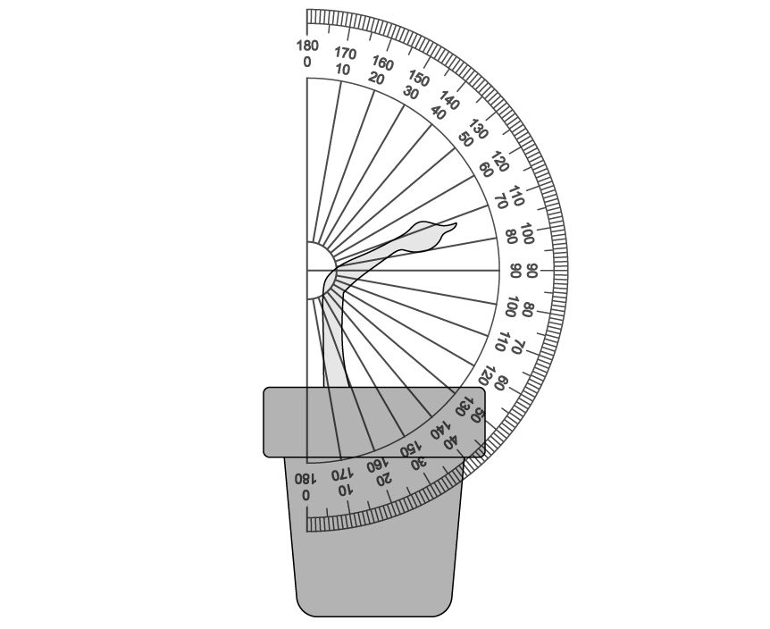

# Exam Questions — Characteristics of Living Organisms
**1. The Nature & Variety of Living Organisms** · Edexcel IGCSE Science (Double Award) (4SD0) — 17/Biology
> Source: [https://www.savemyexams.com/igcse/science/edexcel/double-award/17/biology/topic-questions/the-nature-and-variety-of-living-organisms/characteristics-of-living-organisms/exam-questions/](https://www.savemyexams.com/igcse/science/edexcel/double-award/17/biology/topic-questions/the-nature-and-variety-of-living-organisms/characteristics-of-living-organisms/exam-questions/) · 13 questions · total 145 marks

## Q1 — easy — 9 marks · exam-questions

### 1() — 3 marks — command: complete — structured
Different groups of organisms have different features.

Complete the table by placing a tick [✓] in the boxes to show which features are present in each group of organisms.

Some have been completed for you.

| **Group** | **Cells have a cell wall** | **Cells are eukaryotic** | **Can carry out saprotrophic nutrition** |
|---|---|---|---|
| Fungi |   |   |   |
| Bacteria | ✓ |   |   |
| Plant |   | ✓ |   |

### 2() — 4 marks — command: multiple — structured
Plants are able to store carbohydrates in their cells as starch or sucrose.

(i) Explain how plants are able to synthesise starch.

**(2)**

(ii) Describe the test that could be carried out to determine whether or not a plant cell contains starch.

**(2)**

### 3() — 2 marks — command: suggest — structured
One of the features of plant cells is that they contain chloroplasts.

Suggest why root hair cells in plants do not contain chloroplasts.

## Q2 — easy — 17 marks · exam-questions

### 1() — 5 marks — command: draw — structured
Draw **five** lines to connect the characteristics of a living organism with the description of each characteristic.

### 2() — 3 marks — command: explain — structured
Explain why viruses are not classified as living organisms.

### 3() — 7 marks — command: multiple — structured
Viruses can be classified as pathogens.

(i) What is the definition of a pathogen?

**(1)**

(ii) Name three** **other groups of organisms that contain pathogens.

**(3)**

(iii) In the space below, draw and label a diagram of the basic structure of a virus.

**(3)**

### 4() — 2 marks — command: explain — structured
One example of a virus pathogen is tobacco mosaic virus (TMV).

Explain the effect of TMV on the plants it infects.

## Q3 — easy — 11 marks · exam-questions

### 1() — 2 marks — command: explain — structured
A student made the following statement:

*"Excretion is when the body gets rid of waste materials, like urine and faeces". *

Explain whether the student's statement is correct.

### 2() — 4 marks — command: multiple — structured
All living organisms carry out excretion, including plants.

(i) List two examples of excretory waste produced by plants.

**(2)**

(ii) Name the processes that produce the excretory waste products named in part (i). You should make it clear which process produces each product.

**(2)**

### 3() — 5 marks — command: complete — structured
The passage describes some features of plants.

Complete the passage by writing a suitable word in each blank space.

Plant cells contain a nucleus and can therefore be classified as ........................... .

The cells are supported by a cell wall made of ....................... .

In order to carry out ........................... to release energy, plants require glucose. They get this glucose by carrying out a process called .......................... . Any excess glucose can be stored in the plant cells in the form of ............................... .

## Q4 — easy — 7 marks · exam-questions

### 3((a)) — 2 marks — command: which — structured — from paper Jan 2022 · 4BI1/1BR
The diagram shows a yeast cell.

(i) Which substance makes up the composition of the yeast cell wall?

**(1)**

| ☐ | **A** | Cellulose |
|---|---|---|
| ☐ | **B** | Chitin |
| ☐ | **C** | Glycogen |
| ☐ | **D** | Starch |

(ii) Which of these structures found in the yeast cell would also be present in a prokaryotic cell?

**(1)**

| ☐ | **A** | Cell membrane |
|---|---|---|
| ☐ | **B** | Mitochondrion |
| ☐ | **C** | Nucleus |
| ☐ | **D** | Vacuole |

### 2() — 2 marks — command: name — structured
The diagram below shows a species of multicellular fungi.

Name the structures labelled **A** and **B** on the diagram.

### 3() — 3 marks — command: describe — structured
Fungi were once classified as plants because they grow out of the soil, but they are now considered to be a separate kingdom of organisms.

One difference between plant and fungal cells is that plant cells contain chloroplasts and gain their nutrition through the process of photosynthesis, while fungal cells do not. Describe how fungi gain their nutrients.

## Q5 — easy — 12 marks · exam-questions

### 1() — 3 marks — command: complete — structured
Complete the table by placing a tick (✓) in the correct boxes to indicate which cell features can be found in eukaryotic cells only, prokaryotic cells only, or both types of cell.

| **Feature** | **Eukaryotic cells only** | **Prokaryotic cells only** | **Both cell types** |
|---|---|---|---|
| Cell membrane |   |   |   |
| Cell wall |   |   |   |
| Nucleus |   |   |   |
| Plasmid |   |   |   |
| Chloroplast |   |   |   |
| Cytoplasm |   |   |   |
| Mitochondria |   |   |   |

### 2() — 4 marks — command: multiple — structured
The table below shows the average size of different types of cells and organelles.

| **Cell / Organelle** | **Average Size (μm)** |
|---|---|
| Animal cell | 25 |
| Plant cell | 50 |
| Bacterium | 2 |
| Mitochondria | 1 |
| Nucleus | 6 |

(i)  Calculate how many times bigger a plant cell is compared to a bacterium.

**(1)**

(ii)  Using evidence from the table, suggest why prokaryotic cells cannot contain a nucleus.

**(2)**

(iii) One scientific theory suggests that mitochondria used to be a type of bacteria that entered a eukaryotic cell and became mitochondria over time.

Identify evidence from the table that suggests this could be possible.

**(1)**

### 3() — 5 marks — command: name — structured
For each of the following examples, name the group of organisms to which the species belongs.

| **Species** | **Group of organisms** |
|---|---|
| *Mucor* |   |
| *Amoeba* |   |
| Yeast |   |
| *Lactobacillus* |   |
| *Plasmodium* |   |

## Q6 — medium — 6 marks · exam-questions

### 5((a)) — 6 marks — command: describe — structured — from paper Nov 2020 · 4BI1/2BR
Human populations are at risk from infectious disease.

Describe the different types of pathogen.

Refer to a disease that each type of pathogen causes in your answer.

## Q7 — medium — 10 marks · exam-questions

### 1() — 6 marks — command: compare — structured
Compare the structure of a plant cell with the structure of a bacterial cell.

### 2() — 1 mark — command: suggest — structured
Some bacteria are able to carry out photosynthesis, despite not containing chloroplasts.

Using your knowledge of photosynthesis, suggest how this could be possible.

### 3() — 3 marks — command: calculate — structured
The diagram below shows a bacterium cell.

Use the following equation to calculate the image size of this bacterium cell.

Give your answer in mm. (1mm = 1000μm)

$Magnification=\frac{Imagesize}{Actualsize}$

## Q8 — medium — 6 marks · exam-questions

### 1() — 1 mark — command: name — structured
The diagram shows *Amoeba proteus*, a type of unicellular microorganism found in fresh water.

Name the group of organisms that this species belongs to.

### 2() — 4 marks — command: multiple — structured
The *Amoeba proteus *gets its nutrition by surrounding other unicellular organisms with its pseudopodia and engulfing the prey, digesting the nutrients internally and storing the nutrients in the food vacuole.

(i) Compare this process to saprotrophic nutrition in fungi.

**(3)**

(ii) As well as nutrition, which other life process is being demonstrated during this process?

**(1)**

### 3() — 1 mark — command: which — structured
The *Amoeba* is found in fresh water and must control its internal conditions by balancing the amount of water that moves in and out of the cell across the cell membrane.  The *Amobea* contains a structure called a contractile vacuole, which expels excess water from the cell. As well as excess water, they also remove waste materials from the cell.  Which of the life processes does the contractile vacuole carry out?

## Q9 — medium — 13 marks · exam-questions

### 1() — 5 marks — command: multiple — structured
A mosquito is an example of an animal. The image below shows an *Anopheles *mosquito.

Photo Credit: James Gathany Content Providers(s): CDC, Public domain, via Wikimedia Commons

(i) List **three **features of organisms, such as this mosquito, which allow them to be identified as animals.

**(3)**

(ii) Mosquitoes can spread diseases with their bite. Why is the mosquito not classed as a pathogen?

**(2)**

### 2() — 3 marks — command: multiple — structured
The diagram shows a simplified version of a cell of *Plasmodium falciparum. *This cell can be carried in the mouthparts of female *Anopheles *mosquitoes and can cause malaria in humans.

(i) What kind of organism is the *Plasmodium*?

**(1)**

(ii) A student reaches the conclusion:

"*Plasmodium *is not alive because it cannot respire. The evidence from this diagram shows that it does not have lungs and cannot breathe".

Using evidence from the diagram, explain why the student is incorrect in their conclusion.

**(2)**

### 3() — 5 marks — command: suggest — structured
When inside the human body Plasmodium can live inside red blood cells and get their nutrition by digesting haemoglobin and absorbing the broken down nutrients.

Haemoglobin carries oxygen around the body in the blood.

(i) Suggest what symptoms a person with malaria might experience if they have reduced haemoglobin in their blood. Explain your answer.

**(3)**

(ii) Using the information from parts (a) to (c) about Plasmodium, suggest why it is beneficial for Plasmodium to live inside red blood cells.

**(2)**

## Q10 — medium — 15 marks · exam-questions

### 1() — 5 marks — command: multiple — structured
The diagram below shows three different types of virus.

- Virus **A** is a bacteriophage, which injects its genetic material into bacterial cells
- Virus **B** is TMV, which infects the cells of certain species of plants, such as tobacco, tomatoes and peppers.
- Virus **C** is a coronavirus, such as the one that causes the disease Covid-19, and it can infect human cells.

The diagrams are not drawn to scale.

(i) Name **two **structural** **features that are universal for all types of virus.

**(2)**

(ii) Suggest why it is necessary for the three types of virus to have differences in their structure.

**(3)**

### 2() — 3 marks — command: list — structured
Another example of a virus pathogen that can infect humans is HIV.

HIV can be spread through exchange of bodily fluids.

List **three **other ways pathogens can spread between people.

### 3() — 3 marks — command: multiple — structured
When someone is infected with the HIV virus they can develop a condition called AIDS.

People with AIDS are susceptible to infections by pathogens, and can die from infections that most people without AIDS could recover from easily.

(i) HIV infects the white blood cells of the infected person and stops them from working. Why might that cause people to be more susceptible to infections?

**(1)**

(ii) One way of preventing this from occurring is for people with HIV to take medication to prevent the viruses from replicating. Explain why this can prevent the infected person from developing AIDS.

**(2)**

### 4() — 4 marks — command: multiple — structured
The graph below shows an estimation of the number of people worldwide that died from AIDS-related illnesses between the years 1990 and 2020.

(i) Describe the trend of data in the graph.

**(2)**

(ii) Suggest **two **reasons why the number of AIDS-related deaths has declined in recent years.

**(2)**

## Q11 — hard — 12 marks · exam-questions

### 1() — 2 marks — command: multiple — structured
Some students wanted to investigate sensitivity in plants.

They set up their equipment as shown in the diagram below:

The experimental method was as follows:

1. Grow two pots of plant seedlings of the same species in the same conditions.
2. Place pot A in a box to prevent light reaching the seedlings.
3. Place pot B with a unidirectional light source hitting the seedlings.
4. Leave the seedlings for three days, keeping all other conditions the same.
5. After three days measure the angle of the curvature of the seedling stems using a protractor, as shown in the diagram below.
6. Repeat the experiment three times with three different pots of seedlings

(i) Identify the independent variable in this experiment.

**(1)**

(ii) Other than sensitivity, name a life process that is being demonstrated in this experiment.

**(1)**

### 2() — 5 marks — command: multiple — structured
The results of the experiment are shown in the table below:

| **Condition** | **Angle of stem growth / °** |   |   |   |
|---|---|---|---|---|
| **Repeat 1** | **Repeat 2** | **Repeat 3** | **Mean** |   |
| Pot A (no light) | 0 | 0 | 0 | 0 |
| Pot B (unidirectional light) | 70 | 63 | 50 |   |

(i) Complete the table by calculating the mean angle of stem growth for Pot B.

**(1)**

(ii) Plot a graph of the results of the experiment in the space provided.

**(4)**

### 3() — 3 marks — command: explain — structured
The results of the experiment show that the plants exposed to unidirectional light grow towards the light.

Explain how this response benefits the plant.

### 4() — 2 marks — command: suggest — structured
The students wanted to adjust their experiment to find out if the plant response varies with different levels of light intensity.

Suggest how the students could alter their experiment method in order to carry out this investigation.

## Q12 — hard — 15 marks · exam-questions

### 1() — 5 marks — command: multiple — structured
Different types of organisms store their carbohydrates in different forms.

The images below show the structure of two of these types of carbohydrates.

(i) Using the information provided in the diagram, compare the structure of starch and glycogen.

**(2)**

(ii) For the three examples of organisms below, state whether they store their glucose as starch or glycogen.

- Plants
- Animals
- Fungi

**(3)**

### 2() — 4 marks — command: multiple — structured
The structure of the two types of carbohydrate shown in (a) are adapted for the needs of the organism.

The more exposed ends of the glucose strands in the carbohydrate, the faster it can be broken down and the faster the glucose can be made available for use in the cell.

(i) Animals store carbohydrate in their muscle cells.

State why this is beneficial to the animal.

**(1)**

(ii)Suggest why some types of organisms may need to have adaptations to release their glucose faster than other types of organisms.

**(3)**

### 3() — 3 marks — command: determine — structured
The table below shows the approximate maximum length of one molecule of the carbohydrate types shown in part (a). The size is given in terms of the number of glucose molecules present.

| **Type of carbohydrate** | **Approximate Maximum length (number of glucose molecules)** | **Rate of breakdown (glucose molecules released per second)** |
|---|---|---|
| Starch (amylose) | 2 000 | 600 |
| Glycogen | 30 000 | 13 000 |

Using the data in the table, determine the carbohydrate molecule (starch or glycogen) that will take the **least** time to be fully hydrolysed.

### 4() — 3 marks — command: multiple — structured
Another type of carbohydrate that can be found in many types of cells is cellulose.

(i) What is the function of cellulose in the cell?

**(1)**

(ii) Name **two **types of organisms that can contain cellulose in their cells.

**(2)**

## Q13 — hard — 12 marks · exam-questions

### 1() — 4 marks — command: multiple — structured
Gut flora, or the gut microbiome, is the name given to the huge number of microorganisms that live inside the digestive system of animals, such as humans.

Most of these microorganisms are bacteria.

(i) State how the presence of the gut flora demonstrates that not all bacteria are pathogens.

**(2)**

(ii) Explain how human gut bacteria get their nutrition.

**(2)**

### 2() — 3 marks — command: apply — structured
If a patient is unwell with a bacterial infection they may take a type of medication called an antibiotic.

Different types of antibiotics affect bacteria in different ways, for example some damage the cell walls of the bacteria, and some prevent bacteria from reproducing.

Use the information provided to explain how taking an antibiotic would affect the bacteria that live in the gut.

### 3() — 1 mark — command: name — structured
To increase the number of bacteria living in the gut, people are encouraged to consume probiotics, such as health yogurts.

These contain cultures of gut bacteria that can start to grow in number inside the intestines. This helps to keep the gut flora healthy.

Name **one** example of a species of bacteria that is used in the production of yogurt from milk.

### 4() — 4 marks — command: explain — structured
When manufacturers are producing probiotics they must grow cultures of bacteria in a factory. They can put a small number of bacteria in a large vat called a fermenter and provide them with nutrients such as amino acids and glucose.

The graph below shows how the number of bacteria in the fermenter changes over time when no additional nutrients are added during the growth process.

(i) Explain the shape of the curve between point A and point B.

**(2)**

(ii) Use your knowledge of the characteristics of living organisms to explain the shape of the curve after point C in the graph above.

**(2)**
