# Mark Schemes — Food Production
**5. Use of Biological Resources** · Edexcel IGCSE Science (Double Award) (4SD0) — 17/Biology

## Q1 — easy — 10 marks · exam-questions

### 7((a)) — 2 marks
A sample of cow’s milk and a sample of human milk could be tested as follows, to show they contain different masses of protein...

Any **two** of the following:

- Biuret (reagent) is added to the milk; **[1 mark]**
- The deeper/darker/higher intensity purple contains more protein; **[1 mark]**
- The same volume of milk / biuret should be used; **[1 mark]**

*Accept other correctly described methods, e.g.*

- *Solidify the milk protein by denaturing proteins (e.g. by heating) or adding an acid); ***[1 mark]**
- *Measuring the mass of the protein; ***[1 mark]**

**[Total: 2 marks]**

> *Many students will just gain 1 mark for this question and miss out on the second. The second mark would need to state **how the results could be compared** to establish **which sample had the most protein** in it, or how the tests could be controlled to ensure a valid comparison. *

> *ALWAYS take a mental note at the number of marks available in a question to work out the level of detail that you should go into in your answer. For example, just stating 'biuret test' would not be worth 2 marks by itself, so you would use that as a signal to elaborate your answer for the second mark. *

### 7((b)) — 2 marks
Antibodies in milk are useful for babies because...

Any **two** of the following:

- (Antibodies) prevent infection/disease;** [1 mark]**
- (By destroying) the virus / bacteria / pathogen that causes the disease; **[1 mark]**
- Antibodies provide immunity (to future infections); **[1 mark]**

**[Total: 2 marks]**

> *This is an example of a synoptic question, meaning that it relates to protein in milk but it covers content from elsewhere in the specification. You should have covered antibodies and their role during your study of the immune system.*

### 7((c)) — 2 marks
Two ways that lipid in milk is used by babies are as follows...

Any** two **of the following:

- A source of energy / for respiration; **[1 mark]**
- A store of energy; **[1 mark]**
- Insulation / protective fat around organs; **[1 mark]**

*Accept 'myelin sheath' as an example of insulation.*

**[Total: 2 marks]**

> *The examiners do not award a mark for stating 'for warmth' because that is too vague. Yes, fat helps keep a baby warm, but you have to use biological language; lipids function as **insulators**.*

> *This is another synoptic question that draws on your knowledge of the role of lipids from the nutrition topic.*

### 7((d)) — 4 marks
(i) The carbohydrate in milk used to make yoghurt is...

- Lactose; **[1 mark]**

(ii) The bacteria added to milk to make yoghurt is...

- *Lactobacillus */ *Streptococcus*; **[1 mark]**

> *You can also state the species name, e.g. (**Lactobacillus) bulgaricus** and (**Streptococcus) thermophilus** but just one genus name is required for the mark. *

(iii) Milk needs to be heated to a high temperature at the start of the process for making yoghurt because...

Any **two** of the following:

- (The heat will) sterilise/pasteurise milk; **[1 mark]**
- (The heat will) kill bacteria/pathogens/microorganisms; **[1 mark]**
- This prevents competition (for carbohydrate/sugar); **[1 mark]**

**[Total: 4 marks]**

## Q2 — easy — 8 marks · exam-questions

### 1() — 2 marks
The gardener should follow the advice of...

- (Friend) Y; **[1 mark]**

**AND**

Any **one** from the following:

- Opening the windows will (keep the greenhouse cool so) prevent the plant proteins/enzymes from denaturing; **[1 mark]**
- Covering the windows with black card will prevent light from reaching the plants **OR** cause light to be a limiting factor **OR **plants need the light for photosynthesis;** [1 mark]**

**[Total: 2 marks]**

### 2() — 2 marks
The term limiting factor can be defined as follows...

- An environmental factor / something present in the environment...;** [1 mark]**
- ...that limits/restricts the rate of photosynthesis; **[1 mark]**

**[Total: 2 marks]**

### 3() — 2 marks
Plant mass can be used as a measure of the rate of photosynthesis because...

Any **two** of the following:

- Photosynthesis produces glucose; **[1 mark]**
- Glucose is used by the plant in respiration; **[1 mark]**
- Respiration releases energy for growth / protein synthesis (building up plant mass); **[1 mark]**
- Glucose can be converted into starch which is stored in the plant (adding mass) **OR** glucose is converted into lipids / proteins which make up the tissues of the plant (increasing the tissue mass); **[1 mark]**

**[Total: 2 marks]**

> *The mass of a plant can be used to represent the rate of photosynthesis; this is because the more photosynthesis a plant carries out, the bigger it will be able to grow. This increased growth occurs due to the production of glucose, which can be used in respiration to fuel growth, or which can be converted into other molecules which make up the tissues of the plant.*

### 4() — 2 marks
(i)  The carbon dioxide concentration that the producer should choose is...

- (Answers in the range of) 500-600 ppm;** [1 mark]**

(ii) The reason for this is...

Any **one** of the following:

- If he chooses a concentration below this the mass/rate will be too low / carbon dioxide will limit the mass/rate;** [1 mark]**
- If he chooses a concentration above this then the cost will outweigh the benefit / the increase in mass/rate will be too small to justify the cost;** [1 mark]**

**[Total: 2 marks]**

> *Remember that in a greenhouse or polytunnel, the choice of conditions is always a balance between maximising yield and minimising cost. Above 600 ppm at 20 °C there is no increase in mass/rate, so there is no yield benefit to the increased cost of raising the carbon dioxide concentration.*

## Q3 — easy — 9 marks · exam-questions

### 1() — 2 marks
Fertilisers are needed because...

Any **two** of the following:

- To supply plants with minerals/mineral ions; **[1 mark]**
- To <u>replace</u> minerals/nutrients taken up from the soil; **[1 mark]**
- To increase the rate of growth / health of plants / crop yield/harvest; **[1 mark]**

**[Total: 2 marks]**

### 2() — 2 marks
The roles of the components of fertilisers are as follows...

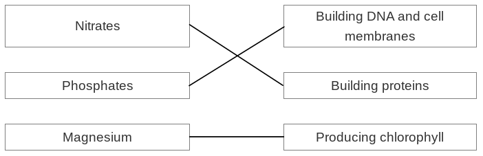

- 3 lines drawn correctly; **[2 marks]**
- 1 or 2 lines drawn correctly: **[1 mark]**

*Reject fertiliser components with more than one line drawn.*

**[Total: 2 marks]**

> *You are expected to know about the roles of nitrates and magnesium in plants from the plant nutrition topic. You may be aware that DNA and cell membranes contain phosphates, but if not then you should be able to work this out by a process of elimination.*

### 3() — 4 marks
An advantage and a disadvantage of chemical and biological pest control could be...

A **maximum of** **one** marking point from each section of the table:

|   | **Advantage** | **Disadvantage** |
|---|---|---|
| Chemical pest control | - Easily accessible / easy to use/apply; **[1 mark]** - Effective immediately / work quickly; **[1 mark]** - Kills all pests / entire pest population; **[1 mark]** | - Pests can develop resistance; **[1 mark]** - Insects/animals that are not pests can be killed **OR** chemicals can build up/accumulate in food chains; **[1 mark]** - Effects are short-lived / application needs to be repeated; **[1 mark]** - Can be washed out of the soil into waterways (killing aquatic organisms); **[1 mark]** |
| Biological pest control | - Non-polluting; **[1 mark]** - Pests do not develop resistance; **[1 mark]** - Species-specific / do not kill non-target species; **[1 mark]** - Can remain in the environment for long periods of time / do not need to be applied regularly; **[1 mark]** | - Slower-acting; **[1 mark]** - May leave the crop field for another location; **[1 mark]** - May eat non-pest species (e.g. if they eat all of their target prey); **[1 mark]** - May become a new pest; **[1 mark]** - Only kills some pests / does not kill whole pest population; **[1 mark]** |

**[Total: 4 marks]**

### 4() — 1 marks
Another type of organism that farmers may need to protect their crops against is...

Any **one** of the following**:**

- (Herbivorous) mammals/birds; **[1 mark]**
- Fungi / fungal infection; **[1 mark]**
- Bacteria / bacterial infection; **[1 mark]**
- Virus / viral infection; **[1 mark]**

**[Total: 1 mark]**

## Q4 — easy — 6 marks · exam-questions

### 1() — 1 marks
The process of anaerobic respiration in yeast cells, in the context of the food industry, is...

- Fermentation; **[1 mark]**

**[Total: 1 mark]**

> *Ensure that you study a diagram carefully to establish what it is investigating before attempting to answer the questions.*

### 2() — 1 marks
The gas in the bubbles produced is...

- Carbon dioxide; **[1 mark]**

**[Total: 1 mark]**

> *This investigation is used to demonstrate that carbon dioxide is a product of anaerobic respiration in yeast cells. Remember that limewater becomes cloudy when carbon dioxide is bubbled through it. *

### 3() — 2 marks
The yeast has been covered by paraffin to...

- Prevent oxygen from reaching the yeast; **[1 mark]**
- To ensure conditions are anaerobic / that the yeast carries out anaerobic respiration / that the yeast does not carry out aerobic respiration; **[1 mark]**

**[Total: 2 marks]**

> *Always refer back to the original question thread to help you answer all the associated questions.*

### 4() — 2 marks
Variables that would need to be kept constant in the investigation described include...

Any **two** of the following:

- Concentration/volume of yeast solution / mass of dried yeast added; **[1 mark]**
- Concentration/volume of sugar solution / mass of sugar added; **[1 mark]**
- Type of sugar/substrate provided; **[1 mark]**
- pH of solution; **[1 mark]**
- The period of time over which the number of bubbles are/volume of carbon dioxide is recorded / after which the colour of the limewater is measured; **[1 mark]**
- Depth of oil/paraffin layer; **[1 mark]**
- Depth of (delivery) tube submersion in limewater; **[1 mark]**

**[Total: 2 marks]**

> *Variables that need to be kept constant are also known as control variables. Control variables are anything outside of the variables being changed and measured that **might influence the results**. Here we are changing temperature and measuring carbon dioxide production, so all other relevant factors need to be kept the same.*

> *Be careful to avoid terms like 'amount' when describing variables, e.g. the phrase 'amount of sugar' is not credited here. Be specific instead by using terms such as concentration, volume, and mass.*

## Q5 — medium — 16 marks · exam-questions

### 5((a)) — 4 marks
(i) The air is bubbled into the fermenter because...

- <u>Oxygen</u> is required; **[1 mark]**
- For respiration; **[1 mark]**

(ii) The fermenter is cleaned using steam before the fungus and nutrients are added because...

Any **two **of the following:

- To kill pathogens/other (unwanted) microorganisms / sterilise the fermenter / remove bacteria; **[1 mark]**
- To prevent contamination (of the product) / competition (between the desired microorganisms and the contaminating microorganisms); **[1 mark]**
- Steam condenses to water so does not affect product/taste/flavour; **[1 mark]**

*It is possible to combine 2 marking points into one statement, e.g. a statement such as "to prevent bacterial contamination" covers marking points 1 and 2, so can be awarded maximum marks.*

**[Total: 4 marks]**

### 5((b)) — 12 marks
(i) The graph must have the following features...

- **S** = scales are linear **AND** use at least half the page **AND** axes are the correct way around; **[1 mark]**
- **L** = straight line joins the points (as instructed for this graph); **[1 mark]**
- **A** = axes are both labelled **AND** have units "time in days" and "mass in kg"; **[1 mark]**
- **P** = Points correctly plotted to +/- half a square; **[1 mark]**
- **K** = Key / lines are labelled GM and non-GM; **[1 mark]**

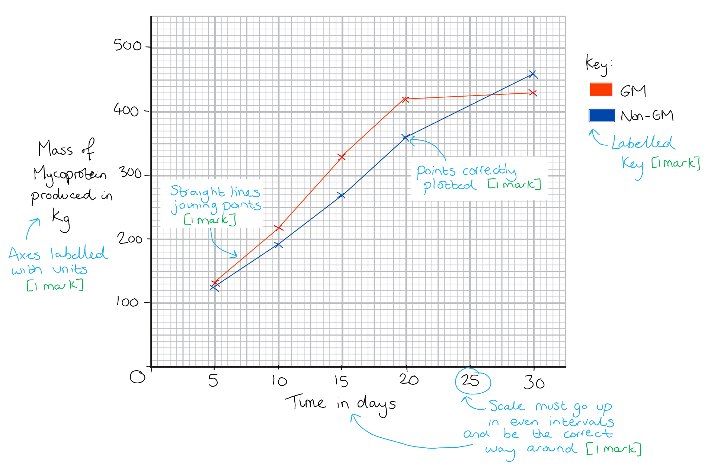

> *Edexcel iGCSE follows the same marking requirements for all questions relating to drawing graphs. There are 5 points and 5 marks available, unless one of the criteria is not relevant e.g. if a key is not required the graph may be worth a maximum of 4 marks. The 5 possible mark points are as follows: *

> *S - Scale **should be **linear**, increasing in **regular increments**. It should take up more than half the grid (and not be squashed into one corner of the graph paper)*

> *L - The line** should **join the points**. It is important that you use a ruler to join your points together. Don't extrapolate (join your line) to the origin (0,0) unless your data includes this point. *

> *A - Axes** should be **labelled correctly** and include **units.** These can usually be taken directly from the table. It is also worth remembering that the Y axis is usually used for the dependent variable which is found on the right hand side of a table and the X axis is used to represent the independent variable which is found in the left column of the table.*

> *P - Points** should be plotted carefully and accurately as you will only be awarded the mark if all points are** within 1 small square** of where they are supposed to be.*

> *K - Keys** are sometimes necessary but** not always**. If there are multiple lines on a line graph or sets of bars on your bar chart then you might like to distinguish the different data sets using a **key or a label on the lines.*

(ii) A comment on the scientist’s claim that the GM fungus will be better for large-scale production of mycoprotein than the non-GM fungus is...

Any **two **of the following:

- GM fungus grows faster / produces more mass over the first 20 days / before day 30 **OR** GM fungus produces more product in a shorter time; **[1 mark]**
- (But) above 30 days / over the last few days the non-GM fungus produces a higher final yield **OR **non-GM fungus produces more over longer time **OR **GM fungus starts to level off after 20 days; **[1 mark]**
- GM fungus is better if the product is required in a shorter time **OR** non-GM fungus is better if the product is required after a longer time period; **[1 mark]**

*Accept reverse statements for ***marking*** point 2, e.g. "above 30 days ****GM**** fungus produces a ****lower ****final yield" ****OR**** "****GM**** fungus produces ****less yield**** over a longer time period".*

(iii) A discussion on whether eating mycoprotein is more healthy than eating lamb for a growing human is...

Any **five **of the following:

*Yes, eating mycoprotein is more healthy because:*

- There is less fat in mycoprotein; **[1 mark]**
- There is less cholesterol in mycoprotein; **[1 mark]**
- Less risk of heart disease / obesity; **[1 mark]**
- There is more fibre in mycoprotein **SO** less risk of constipation / food moves through the gut easily; **[1 mark]**
- Mycoprotein has more calcium for bones/teeth; **[1 mark]**

*No, eating mycoprotein is not more healthy because:*

- Mycoprotein has less protein; **[1 mark]**
- For growth / muscle growth / other named example of protein function; **[1 mark]**
- Mycoprotein has less iron **SO** there may be a risk of anaemia / less haemoglobin / fewer red blood cells; **[1 mark]**

**[Total: 12 marks]**

## Q6 — medium — 10 marks · exam-questions

### 5((a)) — 2 marks
Increasing acidity can be used as a measure of yoghurt production because...

Any **two **of the following:

- Anaerobic respiration (occurs at low oxygen levels); **[1 mark]**
- (This is done by) bacteria / named bacteria; **[1 mark]**
- (Anaerobic respiration) produces lactic acid; **[1 mark]**

**[Total: 2 marks]**

> *An example of a named genus of bacteria used in yoghurt production is **Lactobacillus.*

### 5((b)) — 1 marks
One abiotic variable that the scientists should control in their experiment is...

- Temperature / volume / mass of milk / lactose content of milk / type of milk;** [1 mark]**

**[Total: 1 mark]**

> *Remember that abiotic means non-living and biotic means living. *

### 5((c)) — 7 marks
(i) The graph must include the following...

- S = scales are linear and at least half page and axes the correct way around time on x axis; **[1 mark]**
- A = axes are labelled (time in) minutes **and** acidity %; **[1 mark]**
- L = straight lines joining points; **[1 mark]**
- P = points correctly plotted; **[1 mark]**
- K = key to identify normal and low oxygen; **[1 mark]**

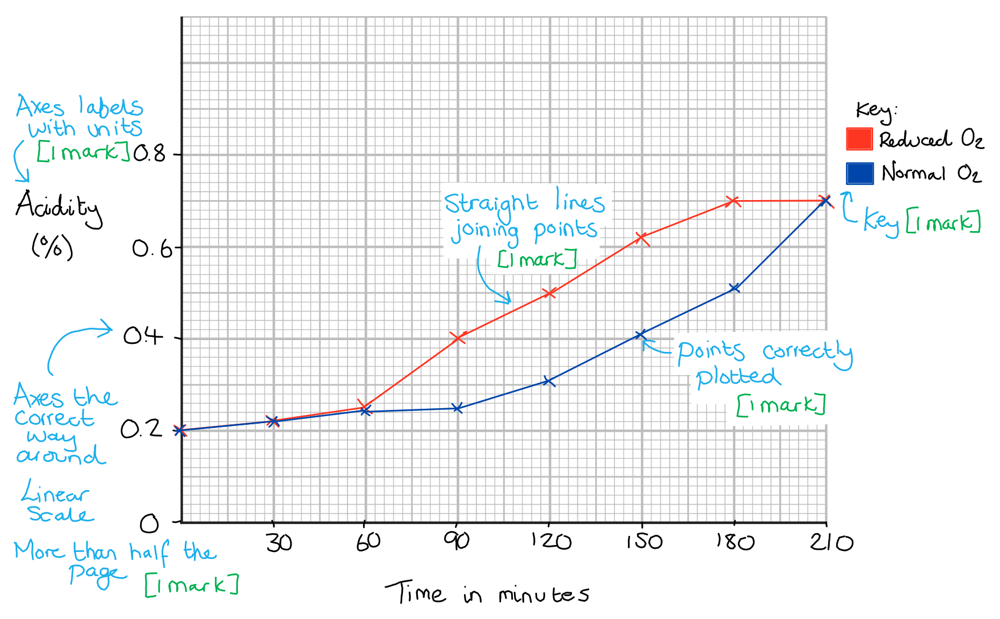

> *Edexcel iGCSE follows the same marking requirements for all questions relating to drawing graphs. There are 5 points and 5 marks available, unless one of the criteria is not relevant, e.g. if a key is not required the graph may be worth a maximum of 4 marks. The 5 possible mark points are as follows: *

> *S - Scale **should be **linear**, increasing in **regular increments**. It should take up more than half the grid (and not be squashed into one corner of the graph paper)*

> *L - The line** should **join the points**. It is important that you use a ruler to join your points together. Don't extrapolate (join your line) to the origin (0,0) unless your data includes this point. *

> *A - Axes** should be **labelled correctly** and include **units.** These can usually be taken directly from the table. It is also worth remembering that the Y axis is usually used for the dependent variable which is found in the right hand side of a table and the X axis is used to represent the independent variable which is found in the left column of the table.*

> *P - Points** should be plotted carefully and accurately as you will only be awarded the mark if all points are** within 1 small square** of where they are supposed to be.*

> *K - Keys** are sometimes necessary but** not always**. If there are multiple lines on a line graph or sets of bars on your bar chart then you might like to distinguish the different data sets using a **key or a label on the lines.*

(ii) The changes in percentage acidity are different in the reduced oxygen level and in the normal oxygen level cultures because...

- Reduced oxygen (results in more) anaerobic respiration (of milk) / less aerobic respiration; **[1 mark]**
- Acidity increases faster / sooner / more rapidly; **[1 mark]**

*Allow the converse throughout for mention of more oxygen at marking point 1.*

**[Total: 7 marks]**

## Q7 — medium — 11 marks · exam-questions

### 4((a)) — 2 marks
The correct vitamins are...

| **Function of vitamin ** | **Vitamin** |
|---|---|
| Prevents scurvy | C |
| Improves vision | A; **[1 mark]** |
| Helps bone growth | D;** ****[1 mark]** |

**[Total: 2 marks]**

### 4((b)) — 9 marks
(i) The mean rate of yeast without vitamin C is...

- 6.0 **OR** ÷ 30; **[1 mark]**
- <u>0.20</u>; **[1 mark]**

*Award 2 marks for correct answer with no working*

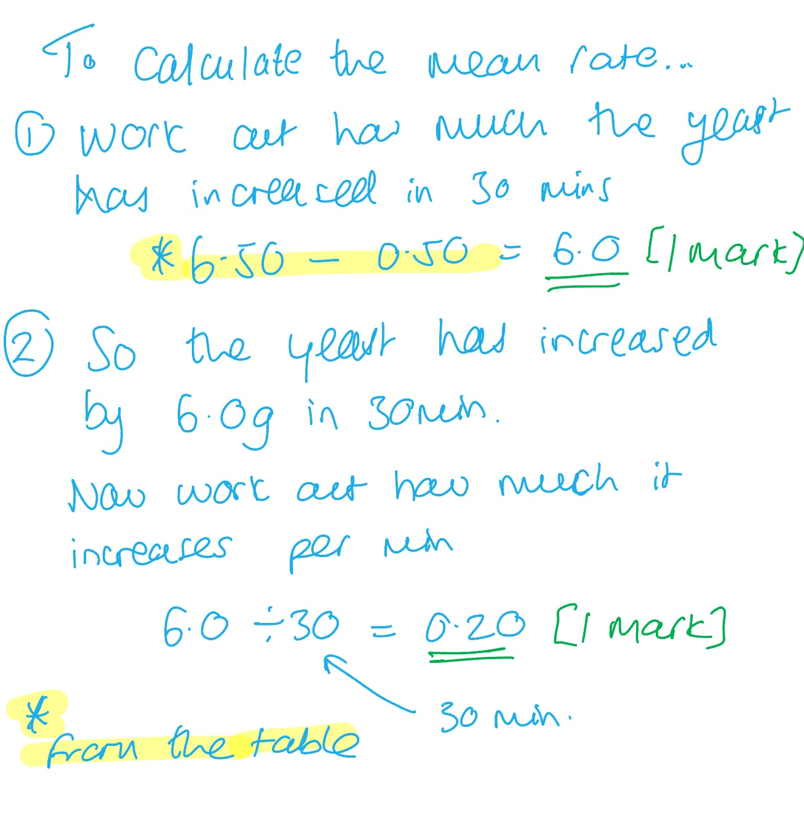

(ii)  To find the dry mass of yeast in each flask...

Any **two** of the following:

- Pour the contents onto filter paper (in a funnel) / allow contents to filter / sieve contents; **[1 mark]**
- Heat/warm (filter paper) in an oven / allow (filter paper) to dry / allow water to evaporate (from filter paper); **[1 mark]**
- Weigh the residue (using a balance); **[1 mark]**

(iii)  The dependent variable is...

- (The dry) mass of yeast; **[1 mark]**

(iv)  **Two** other variables the student should control are...

Any **two pairs of points **from the following:

- Temperature; **[1 mark]**
- Because it affects enzymes / rate of reaction / kinetic energy of molecules **OR **enzymes have an optimum temperature; **[1 mark]**

**OR**

- pH; **[1 mark]**
- Because it affects/denatures enzymes; **[1 mark]**

**OR**

- Oxygen / aerobic/anaerobic conditions; **[1 mark]**
- Because it affects respiration; **[1 mark]**

**OR**

- Species/strain/type of yeast; **[1 mark]**
- Because they may grow at different rates; **[1 mark]**

**OR**

- <u>Concentration</u> of glucose solution; **[1 mark]**
- (Glucose is) used in respiration by yeast; **[1 mark]**

***Ignore**** references to the following as they are all mentioned in the original method:*

- *Volume of glucose*
- *Mass of yeast*
- *Time*
- *Mass/concentration of vitamin C*

**[Total: 9 marks]**

## Q8 — medium — 11 marks · exam-questions

### 4((a)) — 2 marks
(i)** ****The correct answer is ****C**** because...**

Remember that yeasts are fungi which have cell walls made of chitin (not cellulose like plant cell walls) and some of them store carbohydrates as glycogen (not starch like plant cells).

**A **is incorrect as fungal cell walls are made of chitin, not cellulose.

**B** is incorrect as plant cell walls are made of cellulose and starch is the form in which plants store carbohydrates.

**D** is incorrect as yeast stores carbohydrates as glycogen, not starch.

(ii)** ****The correct answer is ****B**** because...**

A yeast cell is an example of a fungus.

**A** is incorrect as yeast is not a bacterium.

**C** is incorrect as yeast is not a plant.

**D** is incorrect as yeast is not a protoctist.

**[Total: 2 marks]**

### 4((b)) — 5 marks
(i)** ****The correct answer is ****B ****because...**

Yeast will break down glucose to form ethanol and carbon dioxide during anaerobic respiration.

**A** is incorrect as ethanol **and** carbon dioxide will form during anaerobic respiration in yeast.

**C** and **D** are incorrect as oxygen is not used during anaerobic respiration.

(ii) The enzyme used to genetically modify yeast is called...

- restriction (enzyme) / restriction endonuclease / ligase; **[1 mark]**

*Allow correctly named endonuclease. *

(iii) The term **recombinant** means...

- (An organism that) contains new/foreign/altered DNA/genes **OR** (an organism that) contains DNA/genes from another organism/species **OR** (a strain that) contains a gene for digesting cell walls/cellulose/cellulase; **[1 mark]**

(iv) Using glucose from plants to produce biofuel could reduce global warming because...

Any **two** of the following:

- (It would require) less burning of fossil fuels / petrol/diesel/coal/oil; **[1 mark]**
- (This would result in) less carbon dioxide (being released) into the air / (the process for producing biofuel would be) carbon neutral / plants use CO2 (in photosynthesis); **[1 mark]**
- (With less carbon dioxide in the air there would be) less trapping of heat / smaller greenhouse effect; **[1 mark]**
- (The process of producing biofuels) uses a renewable resource; **[1 mark]**

> *Biofuels are considered to release less carbon dioxide into the atmosphere overall, as the carbon dioxide released when they are burned is offset by the carbon dioxide that the plants take in during their lives before they are converted into biofuel. This reduction in carbon dioxide release will reduce the greenhouse effect, which in turn will reduce global warming as less heat will be trapped in the atmosphere.*

> *Fossil fuels are non-renewable because they take millions of years to form, while biofuels are produced from living plants that can be replanted at the beginning of each new growing season.*

> *It is worth noting that in reality, the production of biofuels is unlikely to be carbon neutral due to the use of machinery to farm and the potential for clearing of forest to make space to grow the fuel crop.*

**[Total: 5 marks]**

### 4((c)) — 4 marks
(i) The percentage increase in the mass of ethanol produced by GM yeast compared to normal yeast can be calculated as follows...

- 0.95 ÷ 1.25 **OR** (0.95 ÷ 1.25) x 100; **[1 mark]**
- 0.76 (%); **[1 mark]**

***Accept ****a range for the normal yeast measurement between 1.2 and 1.3.*

*Full marks awarded for the correct answer within the range of 69 to 80 % in the absence of calculations. *

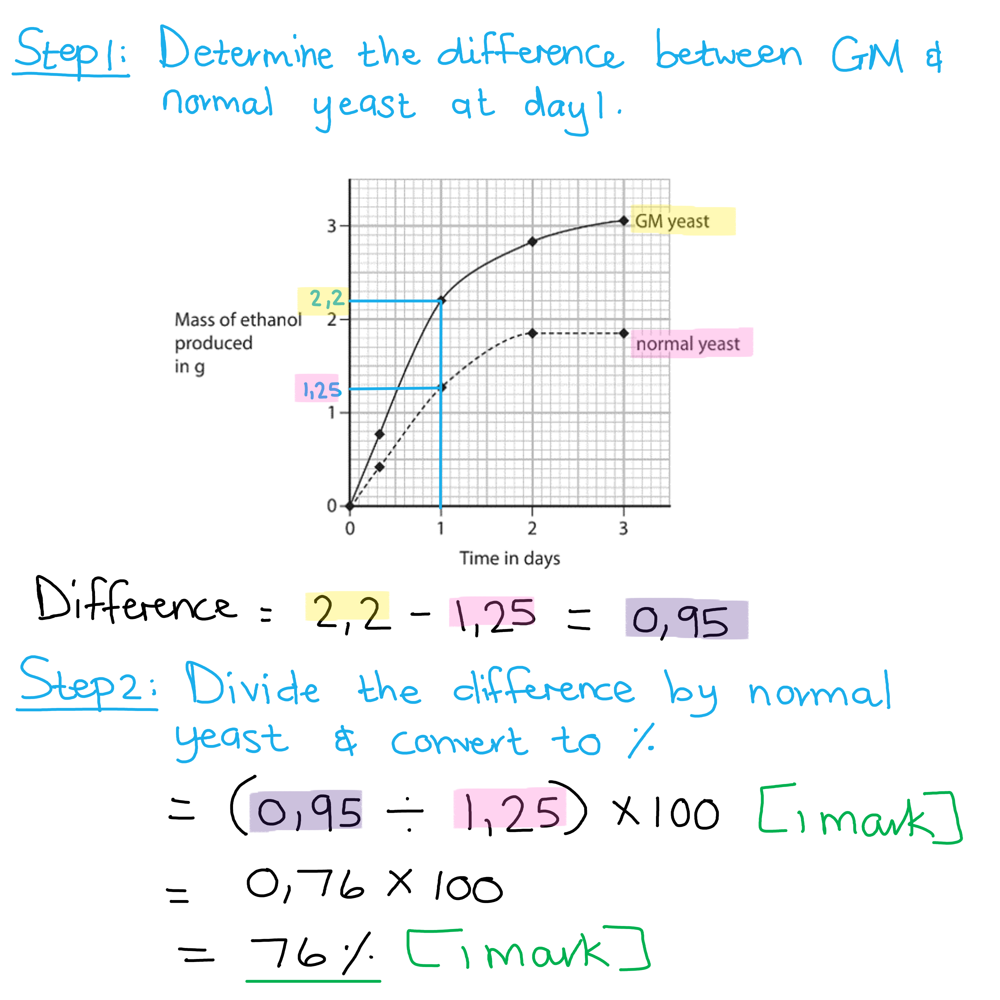

(ii) Reasons why the rate of ethanol production decreases after 1 day include...

Any **two** of the following:

- (The yeast is) running out of glucose/food **OR** oxygen becomes available (so the yeast switches to aerobic respiration); **[1 mark]**
- (There is a build-up of) ethanol; **[1 mark]**
- (The) yeast cells die; **[1 mark]**

*Award* full marks *for stating that "ethanol kills the yeast cells" as this statement includes marking points 2 and 3.*

**[Total: 4 marks]**

## Q9 — medium — 10 marks · exam-questions

### 5((a)) — 1 marks
The dependent variable is...

- Temperature; **[1 mark]**

***Accept ****heat loss / temperature loss*

**[Total: 1 mark]**

### 5((b)) — 1 marks
The student used the same volume of water because...

Any **one** from the following:

- (To prevent) volume / surface area affecting heat loss; **[1 mark]**
- (To allow) valid comparison / fair test; **[1 mark]**

**[Total: 1 mark]**

> *If different volumes were used then the surface area to volume ratio would be different for each beaker. A larger surface area to volume ratio would result in a faster rate of heat loss so this factor must be controlled to ensure it doesn't have an effect on the results.*

### 5((c)) — 2 marks
The difference between the percentage decrease in the uncovered and covered beakers can be calculated as follows...

- Covered: 40 ÷ 80 x 100 = 50 % **OR **Uncovered: 36 ÷ 80 x 100 = 45 %; **[1 mark]**
- Difference = 5 %; **[1 mark]**

***Award ****full marks for the correct answer*

**[Total: 2 marks]**

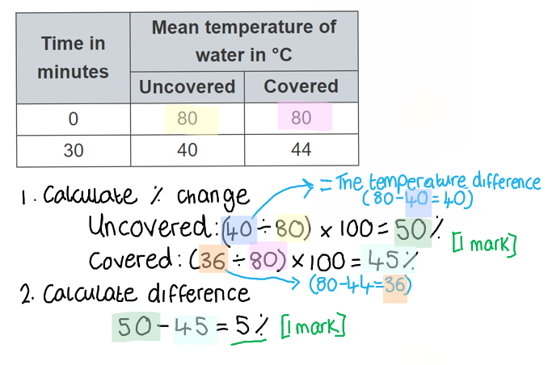

### 5((d)) — 4 marks
This conclusion can be discussed as follows...

Any **four **of the following:

- (There will be) less heat loss (from the animals) if indoors; **[1 mark]**
- However, (heat loss) depends upon outside temperature / (heat loss will be) different in a hot country; **[1 mark]**
- (Although the data shows) only small / 5% difference (covered/inside compared to uncovered/outside); **[1 mark]**
- Animals move around less (if inside); **[1 mark]**
- (This means that they will have) more energy for growth / making meat / eggs / milk **OR** less energy used (by animals kept indoors) to keep warm; **[1 mark]**
- (If enclosed) disease may spread/be transmitted more easily; **[1 mark]**
- (Animals are) protected from predators (indoors); **[1 mark]**
- There may be ethical objections / cruel / quality of life idea; **[1 mark]**
- Animals may eat (better) variety of food outdoors / they may taste better (to the consumer); **[1 mark]**

***Accept ****converse points*

**[Total: 4 marks]**

> *There are many alternative ways to describe the points noted in this mark scheme. The marks can be awarded if the points are valid and distinct from one another. Try to add detail to make it clear what you are meaning,*

> *The ideas here relate to the part of your course around energy losses in organisms and fish farming. The question is not about fish but many ideas about farming animals can apply here. This question requires you to apply your knowledge in a new context. *

### 5((e)) — 2 marks
The student could modify his investigation in the following way...

- Use beakers / containers of different sizes / different volumes; **[1 mark]**
- Keep all beakers out of the box **OR** keep all beakers under the box; **[1 mark]**

**[Total: 2 marks]**

> *In the initial experiment, the presence or absence of the box was used for the independent variable to represent the animals being kept inside or outside. After the modifications, the new independent variable is the size of the beaker which means that the use of the box now needs to be consistent with all beakers so as to act as a control variable.*

## Q10 — medium — 11 marks · exam-questions

### 8((a)) — 1 marks
Pesticide means...

- A chemical/solution/substance that kills/destroys pests/animals/plants/insects; **[1 mark]**

**[Total: 1 mark]**

### 8((b)) — 2 marks
The crop with the largest area sprayed is...

- 1 319.5 /1 320 /1 300 km2; **[1 mark]**
- Barley; **[1 mark]**

**[Total: 2 marks]**

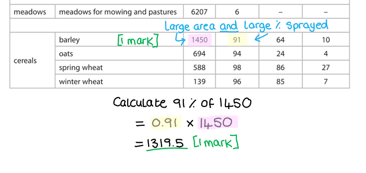

### 8((c)) — 2 marks
The spring and winter wheat have different percentages of insecticides applied because...

Any **two** of the following:

- The winter is cold / has low temperature / (there will be) less food; **[1 mark]**
- (Less food means there will be) fewer insects / pests; **[1 mark]**
- Therefore, less insecticide / pesticide needed; **[1 mark]**

**[Total: 2 marks]**

### 8((d)) — 4 marks
The different combinations of pesticides applied, can be discussed as follows...

Any **four** of the following:

- There is around 70% / an even pattern of herbicide/fungicide/ insecticide in fruit crops; **[1 mark]**
- There is a high(er) use of herbicide in cereals **OR** low(er) use of herbicide in fruit; **[1 mark]**
- As smaller plants / growing plants need to compete with weeds; **[1 mark]**
- High(er) use of insecticide in fruit crops / low(er) use of insecticide in cereals; **[1 mark]**
- More variation in fungicide use in cereals;**[1 mark]**
- High use of fungicide on (rotting) fruit; **[1 mark]**
- This is because fruits are more prone to saprophytic decay due to the high sugar content;**[1 mark]**

*Accept converse mark points for marking points 3 and 7*

**[Total: 4 marks]**

> *Saprophytic decay is generally carried out by fungi and is a way of obtaining food and nutrients by absorbing dissolved organic material, in this case, the fruit. The organisms responsible for this decay is referred to a saprophyte. *

### 8((e)) — 2 marks
An alternative to insecticide is...

- Use a biological control; **[1 mark]**
- This means to use a predator (species) (such as Encarsia) to target/eat/consume (specific) pest/insect; **[1 mark]**

***Accept**** named examples for MP2, e.g. ladybirds as a biological control for aphids*

**[Total: 2 marks]**

## Q11 — medium — 6 marks · exam-questions

### 11() — 6 marks
The investigation design should include the following...

Any **six** of the following:

- C - change the amount of starch; **[1 mark]**
- O - Use same species / strain / genotype / mass / volume / measure of yeast; **[1 mark]**
- R - Repeat (the method for) each flour type more than once; **[1 mark]**
- M1 - Measure height / volume of dough/bread **OR** use ruler to measure difference; **[1 mark]**
- M2 - (measure) after stated time / same time; **[1 mark]**
- S1 - Use same measure of flour / volume / mass of flour / volume/ mass of water; **[1 mark]**
- S2 - Ensure the same temperature **OR** knead for stated / same time; **[1 mark]**

**[Total: 6 marks]**

> *Remember that with **CORMS** questions you will not be expected to know anything about the experiment you're presented with. You just have to apply your knowledge of experimental design to a new scenario. *

> *Remember that **CORMS** stands for: **C**hange, **O**rganism, **R**epeat, **M**easure, **S**ame. There are always two marks available for **M**easure and two for **S**ame. *

> *The most difficult mark to get is the **O**rganism because you need to remember to include the word **same** in your answer, e.g. "same species". The point for **O**rganism needs to be different to the two points in **S**ame. *

> *Remember to write your answers in full sentences, as stated in the question stem, but you are welcome to make a quick bullet point plan in a blank space somewhere else on your page. Use your plan to tick off and make sure you've hit all the marking points.*

## Q12 — medium — 13 marks · exam-questions

### 9((a)) — 11 marks
(i) The graph would have the following features...

- **S** - scale linear (even gaps) and at taking up at least half the available space on each axis;** [1 mark]**
- **L** - <u>line chart</u> with straight lines through all points;** [1 mark]**
- **A** - axis labelled with crop production and year **AND** the correct way around;** [1 mark]**
- **P** - points accurately plotted;** [1 mark]**
- **U** - units thousand tonnes (and years);** [1 mark]**
- **K** - labelled or key to show barley and wheat;** [1 mark]**

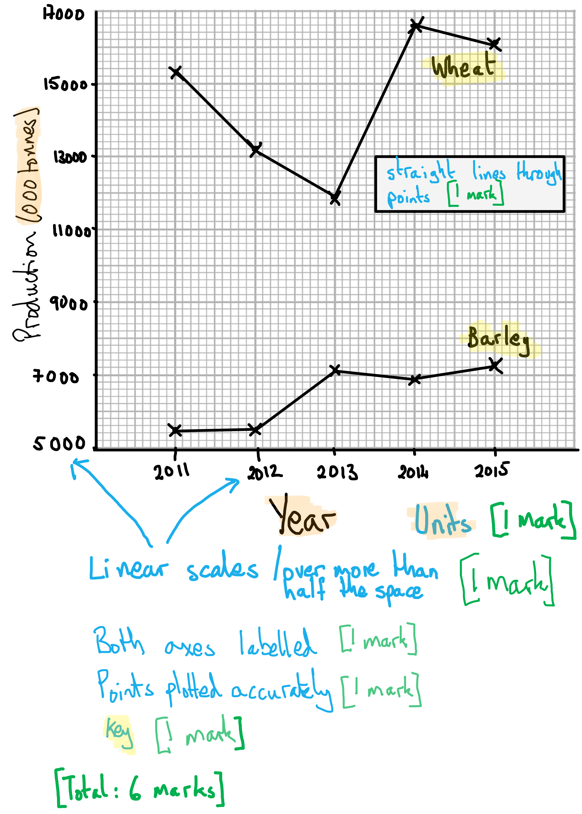

> *Edexcel iGCSE follows the same marking requirements for all questions relating to drawing graphs. There are 5 points and 5 marks available, unless one of the criteria is not relevant e.g. if a key is not required the graph may be worth a maximum of 4 marks. The 5 possible mark points are as follows: *

> *S - Scale **should be **linear**, increasing in **regular increments**. It should take up more than half the grid (and not be squashed into one corner of the graph paper)*

> *L - The line** should **join the points**. It is important that you use a ruler to join your points together. Don't extrapolate (join your line) to the origin (0,0) unless your data includes this point. *

> *A - Axes** should be **labelled correctly** and include **units.** These can usually be taken directly from the table. It is also worth remembering that the Y axis is usually used for the dependent variable which is found in the right hand side of a table and the X axis is used to represent the independent variable which is found in the left column of the table.*

> *P - Points** should be plotted carefully and accurately as you will only be awarded the mark if all points are** within 1 small square** of where they are supposed to be.*

> *K - Keys** are sometimes necessary but** not always**. If there are multiple lines on a line graph or sets of bars on your bar chart then you might like to distinguish the different data sets using a **key or a label on the lines.*

(ii) The changes in the production of each crop from 2011 to 2015 are described as follows...

- Wheat production decreases until 2013, then increases; **[1 mark]**
- Barley production stays (relatively) constant and then increases to 2013 (then fluctuates); **[1 mark]**

> *Remember, a 'describe' question only requires you to give the main highlights of the graph in words. Imagine you're describing the information from the graph to somebody who cannot see a copy of it. *

(iii) The crop that had the greatest percentage change in production from 2011 to 2015 is calculated as follows...

- Wheat change (16 100 - 15 300) ÷ 15 300 = 5.23/5.2/5%; **[1 mark]**
- Barley change (7 300 - 5 500) ÷ 5 500 = 32.73/32.7/33%; **[1 mark]**
- Barley has the greater percentage increase (from 2011 to 2015); **[1 mark]**

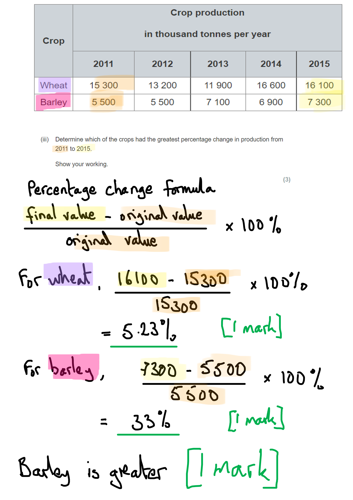

> *The percentage change formula above is very useful, because exam questions often ask you to calculate a percentage change. Read the question carefully to determine which numbers should be the 'original' and 'final' values, which is often chronological. *

**[Total: 11 marks]**

### 9((b)) — 2 marks
The mean mass, in grams, of carbohydrate produced each day by a square metre of the wheat field is calculated as follows...

- 25 000 000 ÷ 10 000 = 2 500 grammes per m2 per year; **[1 mark]**
- 2 500 ÷ 365 = 6.85 grammes per m2 per year; **[1 mark]**

*Full marks for correct answer with no working shown.*

**[Total: 2 marks]**

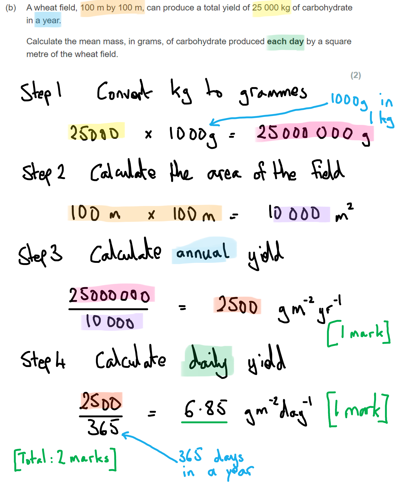

## Q13 — hard — 12 marks · exam-questions

### 10((a)) — 1 marks
**The correct answer is ****C ****because...**

The predators only target their specific prey species (the pests) and not any other species in the area, such as beneficial species. Pesticides mostly kill all insects they come into contact will, even beneficial species.

**A** is incorrect because biological control lasts a long time; the predators can reproduce and continue in the area for several generations.

**B** is incorrect because bioaccumulation is when toxins from things like pesticides build up in the tissues of organisms throughout their lifetime. This does not happen when biological control is used instead.

**D** is incorrect because biological control is slower than using chemical pesticides; it takes time for the predators to spread out and consume the pests.

**[Total: 1 mark]**

### 10((b)) — 6 marks
(i) Two substances aphids obtain from the phloem are...

- Sucrose/sugars; **[1 mark]**
- Amino acids / named amino acid; **[1 mark]**

*Ignore references to water.*

*Reject starch or glucose.*

> *Remember that water and minerals are transported in the xylem, not the phloem.*

(ii) Aphids feeding from the phloem of crop plants can lead to a reduction in yield because...

Any **four **of the following:

- Less respiration (will occur); **[1 mark]**
- Less ATP is produced / less energy is released; **[1 mark]**
- Less active transport (occurs) / fewer minerals are absorbed; **[1 mark]**
- Less carbohydrate/sucrose/sugars / fewer amino acids (are available); **[1 mark]**
- Less growth (of leaves / tubers / bulbs / grain / fruit); **[1 mark]**
- Less starch is stored / less protein (synthesis); **[1 mark]**
- Less photosynthesis (occurs); **[1 mark]**
- Less nectar (produced); **[1 mark]**
- Fewer (insects for) pollination; **[1 mark]**
- (Aphids may) spread disease / infection; **[1 mark]**

*Reject references to energy being produced for marking point 2.*

**[Total: 6 marks]**

### 10((c)) — 5 marks
A discussion of the scientists' conclusion that the hoverfly is the most effective biological control agent for aphids includes the following...

*The conclusion is correct because...*

- Hoverflies eat / consume more aphids at all temperatures; **[1 mark]**
- (Therefore) fewer hoverflies need to be used; **[1 mark]**
- Greatest/most difference (×3) is at 12 °C / least/smallest difference is at 18 °C (×1.9); **[1 mark]**

*The conclusion is incorrect because...*

A **maximum of** **three **of the following:

- Only one larvae was used / the scientists should use more larvae / (the experiment was) not repeated; **[1 mark]**
- (Less valid because it was) not (carried out in a) natural habitat / was carried out in a laboratory setting; **[1 mark]**
- Only 1 species (each) of hoverfly and silverfly were compared; **[1 mark]**
- (Both) flies consume more at higher temperatures (so temperature is also an important factor); **[1 mark]**

**[Total: 5 marks]**

> *Whenever you get asked to **discuss** a conclusion you must always discuss points that both **agree and disagree** with the conclusion. *

> *Always make sure to **refer to the data** as well as your own knowledge.*

## Q14 — hard — 16 marks · exam-questions

### 7((a)) — 10 marks
(i) Marks should be awarded for your graphs as follows...

- **S:** scale linear and uses at least half the grid; **[1 mark]**
- **L:** line straight, neat and through points; **[1 mark]**
- **A/U:** axes labelled with units ‘mean height in mm’ and ‘time in weeks’; **[1 mark]**
- **P:** points plotted correctly; **[1 mark]**
- **K:** each line labelled with correct temperature; **[1 mark]** 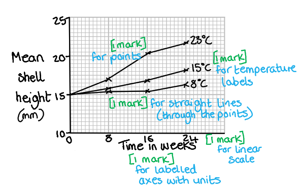

> *Edexcel iGCSE follows the same marking requirements for all questions relating to drawing graphs. There are 5 points and 5 marks available, unless one of the criteria is not relevant e.g. if a key is not required the graph may be worth a maximum of 4 marks. The 5 possible mark points are as follows: *

> *S - Scale **should be **linear**, increasing in **regular increments**. It should take up more than half the grid (and not be squashed into one corner of the graph paper)*

> *L - The line** should **join the points**. It is important that you use a ruler to join your points together. Don't extrapolate (join your line) to the origin (0,0) unless your data includes this point. *

> *A - Axes** should be **labelled correctly** and include **units.** These can usually be taken directly from the table. It is also worth remembering that the Y axis is usually used for the dependent variable which is found on the right hand side of a table and the X axis is used to represent the independent variable which is found in the left column of the table.*

> *P - Points** should be plotted carefully and accurately as you will only be awarded the mark if all points are** within 1 small square** of where they are supposed to be.*

> *K - Keys** are sometimes necessary but** not always**. If there are multiple lines on a line graph or sets of bars on your bar chart then you might like to distinguish the different data sets using a **key or a label on the lines.*

(ii) The effect of temperature on growth can be explained as follows...

Any **three** of the following:

- The higher temperatures produce more growth / faster growth; **[1 mark]**
- (This is because of the) enzymes (activity); **[1 mark]**
- (Increased temperature gives) more kinetic energy; **[1 mark]**
- This means more frequent collisions / enzyme substrate complexes form faster; **[1 mark]**
- Therefore a faster (rate of) respiration; **[1 mark]**

(iii) The dependent variable is...

- (Shell) height / growth of shell; **[1 mark]**

(iv) They made their results reliable by...

- Using groups/many (snails) / repeating the method several times **OR** calculating a mean; **[1 mark]**

**[Total: 10 marks]**

### 7((b)) — 4 marks
(i) The assimilation efficiency can be calculated as follows...

- 1.2 – 0.3 = 0.9; **[1 mark]**
- 0.9 ÷ 1.2 × 100 = 75; **[1 mark]**

*Full marks can be awarded for the correct answer without calculations*

*If no others answers are given then award 1 mark for the following seen in the calculations 0.9**** OR**** 0.75**** OR**** ÷ 1.2*

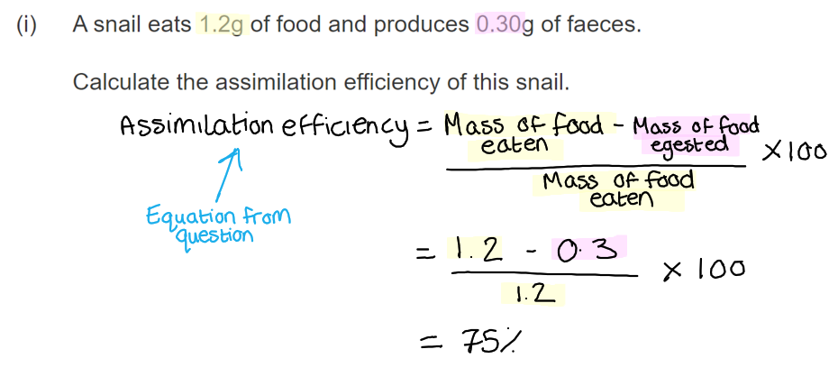

(ii) The assimilation efficiency is less for a primary consumer because...

- Primary consumers eat plants / are producers; **[1 mark]**
- Primary consumers cannot digest parts of their food / produce/egest more faeces; **[1 mark]**

***Accept**** converse statements for secondary consumers*

**[Total: 4 marks]**

### 7((c)) — 2 marks
There is a difference in the production efficiency of the mammal and the snail because...

Any **two** of the following:

- (The mammal carries out) more respiration / (the mammal has a) higher metabolic rate; **[1 mark]**
- (This is because the mammal needs to) maintain body temperature / carry out more movement; **[1 mark]**
- Mammals lose more heat (energy to their environment); **[1 mark]**

***Accept**** converse statements for snails*

**[Total: 2 marks]**

> *Mammals are 'warm blooded' organisms and so a higher rate of respiration is required to maintain an optimum body temperature.*

> *Respiration is an exothermic reaction and as a result, energy is released from the organism to the surrounding environment. *

> *Snails are cold blooded so respiration is not required at such high rates and consequently, less heat energy is lost to the surrounding environment from the snail.*

## Q15 — hard — 2 marks · exam-questions

### 4((a)) — 2 marks
Selective breeding can be used to produce fish that grow rapidly as follows...

Any **two** of the following:

- (Select and) mate/breed from fish that grow quickly / do not waste food / that grow efficiently / have desired characteristics; **[1 mark]**
- (Select and) mate /breed offspring that grow quickly **OR** repeat (point 1) over several generations / with offspring; **[1 mark]**
- (This ensures that) genes/alleles for fast growth are passed on (to the next generation); **[1 mark]**

***Ignore**** references to large fish.*

**[Total: 2 marks]**

> *This is a synoptic question, meaning that it covers content from the section of the specification on selective breeding, which comes immediately after the section on food production.*
