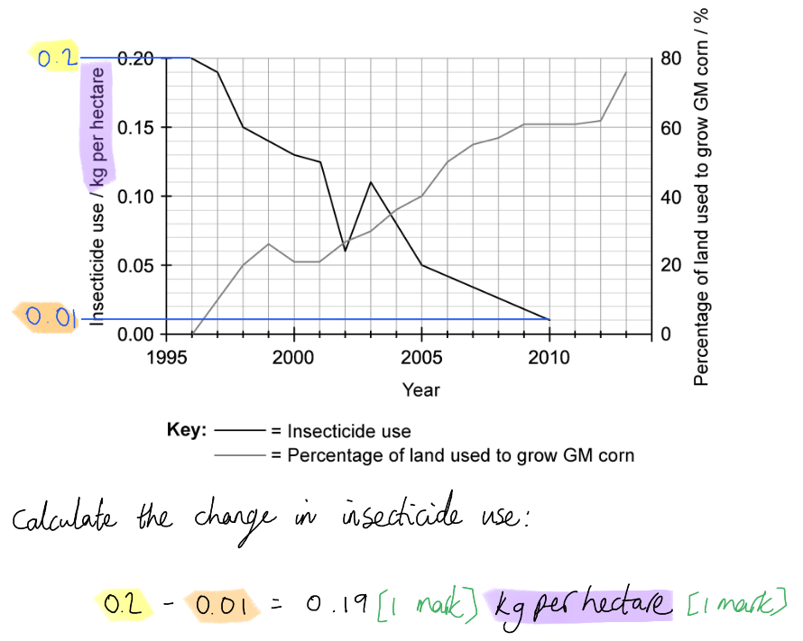
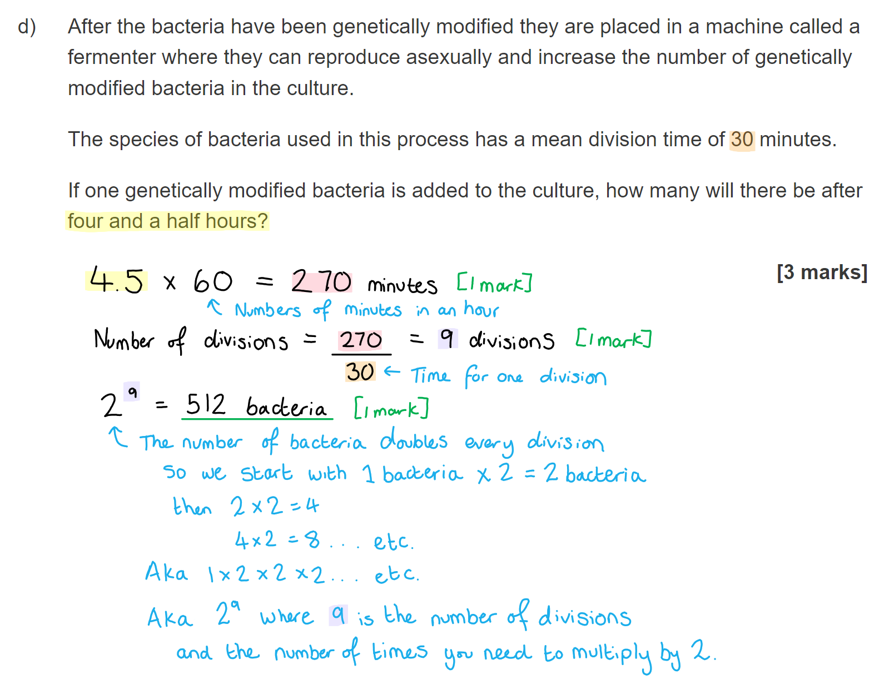
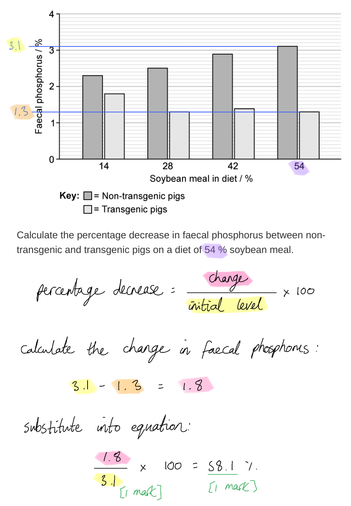

# Mark Schemes — Genetic Modification (Genetic Engineering)
**5. Use of Biological Resources** · Edexcel IGCSE Science (Double Award) (4SD0) — 17/Biology

## Q1 — easy — 7 marks · exam-questions

### 2((a)) — 1 marks
**Final answer:** ** The correct answer is ****C ****because...**

A plasmid is a small, circular loop of bacterial DNA that is useful in carrying genes between one organism and another during genetic modification.

**A **is incorrect because the bacterial cell wall would have no use in genetic modification.

**B **is incorrect because the nucleoid is the approximate area of a bacterial cell that contains the majority of their genetic information. As such it is too big (contains too much DNA) to be of use in genetic modification.

**D** is incorrect because RNA is not exchanged during genetic modification (DNA is).

### 2((b)) — 6 marks
The completed passage would have the following words in the gaps...

- Insulin / glucagon; **[1 mark]**
- Steam/hot water / disinfectant/bleach/sterilising fluid/alcohol/ethanol; **[1 mark]**
- Competition / contamination/infection; **[1 mark]**
- Mix/stir/agitate/distribute; **[1 mark]**
- Oxygen/O2; **[1 mark]**
- Temperature; **[1 mark]**

**[Total: 6 marks]**

## Q2 — easy — 7 marks · exam-questions

### 1() — 2 marks
(i) The term 'vector', when used in genetic engineering, can be defined as follows...

- A mechanism/method by which genes/sections of DNA are inserted/carried into cells; **[1 mark]**

(ii) An example of a vector is...

Any **one** of the following:

- Plasmid; **[1 mark]**
- Virus/phage/bacteriophage;** [1 mark]**

*Accept alternative examples, e.g. bacteria / gene gun.*

**[Total: 2 marks]**

### 2() — 3 marks
The completed table** **listing the second to sixth steps in the correct sequence is as follows...

| **Step** | **Corresponding letter from the table above** |
|---|---|
| 1 | A |
| 2 | D |
| 3 | E |
| 4 | C |
| 5 | B |

- 4 correct; **[3 marks]**
- 2 correct;** [2 marks]**
- 1 correct; **[1 mark] **

*A maximum**** ****of 2 marks*** ***can be awarded if only 3 letters are entered*

**[Total: 3 marks]**

### 3() — 2 marks
The benefits of producing insulin by the method described in part (b) include...

Any **two** of the following:

- Human insulin is produced **SO** it will be effective / will function correctly / will not cause side effects; **[1 mark]**
- There are no ethical considerations (unlike earlier methods which involved the use of insulin from pigs); **[1 mark]**
- Large quantities can be produced very quickly / the risk of insulin shortages is reduced; **[1 mark]**
- No risk of transfer of infection (as there might be with animal insulin); **[1 mark]**

**[Total: 2 marks]**

> *Insulin is used for the treatment of diabetes, so it is essential that enough insulin can be produced, and that the insulin is effective and does not cause any side effects. The removal of ethical issues surrounding the use of animals in medicine is another large benefit.*

## Q3 — easy — 8 marks · exam-questions

### 1() — 2 marks
The term transgenic can be defined as follows...

- Transfer of genetic material/genes/DNA...; **[1 mark]**
- ...from one <u>species</u> to another species; **[1 mark]**

**OR**

- An organism that has genetic material/genes/DNA...; **[1 mark]**
- ...taken from another species; **[1 mark]**

**[Total: 2 marks]**

### 2() — 4 marks
(i) The change in insecticide use between 1996 and 2010 is...

- (0.2 - 0.01 =) 0.19; **[1 mark]**
- kg per hectare / kg hectare-1 / kg/hectare; **[1 mark]**

*Accept Ha for hectare.*

It is a good idea to get into the habit of always **including units** in your answers to calculation questions. Here it shows that you have been able to read the correct line and the correct axis from the graph that has two lines and two Y axes.

(ii) The data shows the following about insecticide use and the percentage of corn fields used to grow GM corn between 1996 and 2013...

Any **two** of the following:

- Insecticide use shows an overall decrease **WHILE** the percentage of land used to grow GM corn shows an overall increase; **[1 mark]**
- The percentage of land used to grow crops increases from 0 to 76 % between 1996 and 2013 / any correctly quoted <u>pair</u> of data points and <u>corresponding years</u>; **[1 mark]**
- There is an increase in insecticide use between 2002-2003; **[1 mark]**
- There is a decrease in GM crop percentage between 1999 and 2000; **[1 mark]**

*Ignore numbers quoted for the overall insecticide use decrease, as this has already been credited in part (i).*

> *Note that you are **describing** data here; no marks are available for attempts to **explain** your observations.*

> *When describing data you should always aim to:*

- *Describe overall **trends**.*
- *Describe any points in the data that **don't fit with trends**, e.g. a period of increase or levelling of within an overall decreasing trend.*
- *Give **numbers** to back up your statements.*

**[Total: 4 marks]**

### 3() — 2 marks
Benefits of GM corn include...

- Pesticide use can be reduced / fewer pesticides are needed; **[1 mark]**
- Farmers no longer have to pay for pesticides **OR **biodiversity will increase / non-target species will not be killed / only pest species will be killed; **[1 mark]**

**OR**

- Pests do not eat/kill the crop; **[1 mark]**
- Increased yield / a bigger harvest; **[1 mark]**

*Accept insecticide for pesticide throughout.*

**[Total: 2 marks]**

> *Note that the question asks you to **explain** one benefit, so to gain full marks here you need to state **why** the benefit that you identify is a good thing.*

> *The graph in part (b) does give a large clue here that GM corn is linked to reduced pesticide use, but simply stating this will not gain you full marks. You need to include additional information; why is it good to reduce pesticide use?*

## Q4 — medium — 8 marks · exam-questions

### 6((a)) — 4 marks
(i) Transgenic means...

- (The transfer of a) gene / allele / DNA; **[1 mark]**
- From another species / a different species;** [1 mark]**

(ii) Two enzymes used in production of GM organisms are...

- <u>Restriction</u> enzyme/endonuclease cuts DNA/gene/allele; **[1 mark]**
- <u>Ligase</u> joins DNA/gene/allele/plasmid; **[1 mark]**

**[Total: 4 marks]**

### 6((b)) — 4 marks
The opinions for an against GM crops can be discussed as follows...

Any **four** of the following:

*Points in favour of GM crops*

- Less insecticide / pesticide used/required (on GM crops);** [1 mark]**
- This means less bioaccumulation of pesticides / less evolution of resistance to pesticides / no pesticide remaining in soil; **[1 mark]**
- Pest resistant (GM) crops do not (negatively) affect non-target species / pollinators; **[1 mark]**
- Weedkiller kills weeds but not (GM) crops / easier to remove weeds; **[1 mark]**
- Less spread of viruses to other species / crops; **[1 mark]**

*Points against GM*

- GM genes may be transferred to other species / (cross) pollinate with other species;** [1 mark]**
- (GM crops may) outcompete native species / affect food chains; **[1 mark]**
- This could lead to a reduction in insect populations;** [1 mark]**
- Could lead to more herbicide use (on unwanted plants containing GM genes); **[1 mark]**

**[Total: 4 marks]**

> *This is a discussion question and therefore requires you to explore all aspects surrounding the concept given. It is also important that you relate your answer to the detail given in the question thread.*

## Q5 — medium — 9 marks · exam-questions

### 1() — 4 marks
Structures W-Z are...

- W = desired gene; **[1 mark]**
- X = bacterial plasmid; **[1 mark]**
- Y = recombinant DNA; **[1 mark]**
- Z = transgenic organism; **[1 mark]**

**[Total: 4 marks]**

> *Structure W shows the desired gene being removed from a length of (human) DNA.*

> *Structure X shows a bacterial plasmid being cut open using restriction enzymes.*

> *Structure Y shows the bacterial plasmid now containing the desired gene; this bacterial DNA containing a human gene is known as recombinant DNA.*

> *The bacterial cell has taken up the recombinant plasmid which is now present inside the cell alongside the circular chromosome of the bacterium. This bacterial cell is now a transgenic organism.*

### 2() — 1 marks
The vector shown in this diagram is...

- The plasmid; **[1 mark]**

*Accept X/Y.*

**[Total: 1 mark]**

### 3() — 2 marks
The role of the restriction enzyme at W and X is to...

- Cut the DNA at a specific base sequence; **[1 mark]**
- Create/leave sticky ends;** [1 mark]**

**[Total: 2 marks]**

### 4() — 2 marks
In order to produce many copies of the protein coded for by the desired gene, the following needs to happen to structure Z...

Any **two** of the following:

- Placed into a fermenter; **[1 mark]**
- Temperature is controlled / nutrients are provided / oxygen is provided; **[1 mark]**
- Allowed to reproduce/divide/clone themselves; **[1 mark]**

**[Total: 2 marks]**

> *The process shown in part (a), while presented as a general process rather than specifically relating to insulin production, is the same as the process used to manufacture human insulin. You can therefore apply your knowledge of insulin production here; once the bacteria have taken up the plasmid with the new gene they are placed into a fermenter, provided with the correct conditions, and allowed to reproduce. Every new cell produced will contain the desired gene, and the bacterial cells will therefore produce the required protein.*

## Q6 — medium — 8 marks · exam-questions

### 1() — 3 marks
(i) The enzymes used to cut DNA are...

- Restriction enzymes; **[1 mark]**

(ii) Restriction enzymes are useful in genetic modification because...

Any **two** of the following:

- They cut DNA at specific/known locations; **[1 mark]**
- They leave sticky ends that can be easily joined together;** [1 mark]**
- Cutting DNA with the same (restriction) enzyme always leaves matching/corresponding/complementary ends; **[1 mark]**

**[Total: 3 marks]**

### 2() — 3 marks
(i) Reasons for inserting genes from other species into crop plants include...

Any **two** of the following:

- Disease resistance; **[1 mark]**
- Herbicide/weedkiller resistance; **[1 mark]**
- Frost resistance; **[1 mark]**
- Drought resistance; **[1 mark]**
- Improved shelf life of product; **[1 mark]**
- Improve nutritional content/value of product; **[1 mark]**

*Accept other correct reasons.*

*Accept correct named examples of any of the reasons above.*

(ii) Inserting DNA into plant cells can be a challenge because...

Any **one** of the following:

- Plant cells have cell walls / plant cell walls form a physical barrier; **[1 mark]**
- Plants do not pass DNA from cell to cell / plant cells do not have plasmids (as bacteria do); **[1 mark]**

Plant cells have a cellulose cell wall, a layer that provides them with their rigid structure, but also provides a physical barrier against the insertion of DNA into the cell.

While bacterial cells also have a cell wall (though it is not made of cellulose), bacteria frequently pass genetic material to each other so they have the mechanisms required to take in DNA plasmids, while plant cells do not.

**[Total: 3 marks]**

### 3() — 2 marks
Some are concerned about the insertion of genes from other species, such as the gene for Bt toxin, into crop plants because...

Any **two** of the following:

- The new genes might enter wild plant populations; **[1 mark]**
- Insects other than the pest species might be killed;** [1 mark]**
- There could be a loss of biodiversity / the animals that rely on insects for food will have less food to eat / food chains/webs will be disrupted;** [1 mark]**
- There could be unknown (long-term) health effects on humans (who eat the crops);** [1 mark]**
- Seeds of resistant varieties are more expensive / poorer farmers cannot afford the seeds of GM varieties; **[1 mark]**
- Farmers might grow only this crop / a monoculture (of GM crop) **SO** leading to loss of other/rarer crop varieties; **[1 mark]**
- Insects might develop resistance to the Bt toxin **SO** leading to increased pesticide use; **[1 mark]**

**[Total: 2 marks]**

> *This is a **suggested** question, meaning that you are not expected to **know** the answer, but that you need to use your knowledge of the topic and of other areas of biology, along with your reasoning skills, to work out a possible answer. Here, for example, you can link to ideas about biodiversity and feeding relationships.*

> *The advantages and disadvantages of genetic modification are not required by your specification, but **suggest** questions come up all the time in exams so it is a good idea to practice reasoning skills like this.*

## Q7 — medium — 9 marks · exam-questions

### 5((a)) — 3 marks
The plasmid is modified to contain recombinant DNA as follows...

Any **three** of the following:

- The same restriction enzyme is used to cut / remove the gene / open the plasmid/DNA; **[1 mark]**
- A plasmid / vector <u>and</u> target gene / gene coding for insect poison; **[1 mark]**
- Ligase enzyme is used to join / stick / insert a gene into the plasmid; **[1 mark]**
- The gene and plasmid have complementary shapes / sticky ends to allow accurate joining; **[1 mark]**

**[Total: 3 marks]**

### 5((b)) — 6 marks
A discussion about the farmer's decision could include the following...

*The decision made by the farmer to use GM can be regarded as a *<u>*good*</u>* decision because...*

A **maximum of four** of the following:

- GM plants are specific / kill specific insects / pesticides kill other insects / plants **WHEREAS** pesticide kills non-specific insects and could harm pollinators like bees, for example; **[1 mark]**
- Using GM plants reduces need for pesticides; **[1 mark]**
- Using GM is a one-time process **WHEREAS **pesticide needs reapplication / do not last long; **[1 mark]**
- Insects can become resistant to pesticides; **[1 mark]**
- Pesticides can enter food chains / bioaccumulation; **[1 mark]**
- Pesticides can lead to health problems / affect human health / poison humans eg. organophosphates and the human nervous system; **[1 mark]**

*The decision made by the farmer to use GM can be regarded as a *<u>*poor*</u>* decision because...*

A **maximum of four** of the following:

- Pesticides are quick to kill **WHEREAS** GM takes time to have its effect; **[1 mark]**
- GM plants could result in cross pollination of other species; **[1 mark]**
- GM pollen may kill insect pollinators; **[1 mark]**
- Insects may develop resistance to poison produced by GM crops; **[1 mark]**
- Customers may not buy GM crops / regard them as 'unnatural' or synthetic; **[1 mark]**
- Patents held by large companies may mean that farmers become dependent on those companies for their seed; **[1 mark]**

**[Total: 6 marks]**

> *This question requires you to draw on your understanding of GM crops, as well as other ideas about human impacts on the environment and food production.*

> *Even though the command word is discussed, this question requires an **evaluation** of the choices facing this farmer. As with many difficult business choices the person in charge has to weigh up many different factors for and against a particular course of action. Make sure you bring in an element of balance to your answer, outlining some of the pros and cons of each choice (pesticides or GM). Only taking a fully one-sided view will not allow you to gain full marks.*

> *Avoid vague references to 'pollution' here; these won't earn you any marks. *

## Q8 — hard — 14 marks · exam-questions

### 1() — 2 marks
The function of insulin is as follows...

Any **two **of the following:

- Lowers blood glucose concentration; **[1 mark]**
- Causes glucose to move into muscle/liver cells;** [1 mark]**
- Causes glucose to be converted to / stored as glycogen;** [1 mark]**

**[Total: 2 marks]**

### 2() — 4 marks
The process used to produce genetically modified bacteria that contain the gene for human insulin is...

Any **four** of the following:

- The insulin gene is located (within the human genome);** [1 mark]**
- Restriction enzymes are used to cut out the human insulin gene;** [1 mark]**
- A bacterial plasmid is cut open using the same restriction enzyme; ** [1 mark]**
- The gene is inserted into the bacterial plasmid;** [1 mark]**
- DNA ligase is used to join the pieces of DNA; **[1 mark]**
- The modified/recombinant plasmid is inserted into / taken up by bacteria;** [1 mark]**

**[Total: 4 marks]**

> *Note that the question only asks you to describe the process up to the point at which the **bacteria contain the human gene**, so references to fermenters and bacterial reproduction will not be credited here. It is always good in questions like this to pay close attention to **exactly which parts of a sequence** the question wants you to cover; this will allow you to avoid wasting time describing stages that are not relevant.*

### 3() — 2 marks
It is better to obtain insulin by genetic engineering than from animals because...

Any **two **of the following:

- Bacteria produce human insulin / the insulin will not be rejected / will be effective / will not cause side effects; **[1 mark]**
- Insulin** **can be made in large quantities / more quickly / fast enough to treat everyone with diabetes; **[1 mark]**
- There are no religious**/**cultural concerns; ** [1 mark]**
- There will be no transfer of infection between animals and humans;** [1 mark]**

*Accept converse answers relating to animal insulin for marking point 1, e.g. 'animal insulin will be rejected / may not be as effective' etc.*

**[Total: 2 marks]**

> *The benefits of producing insulin using GM bacteria are not covered in your spec, but this is a **suggest **question, meaning that you are expected to use your reasoning skills to work out possible answers.*

> *Using bacteria containing the human insulin gene means that the insulin they produce is actually **human insulin**, not bacterial insulin. This insulin is more likely to be effective and will not cause any adverse reaction or transmit any infection. Bacteria can be cultured very quickly in a fermenter, so large quantities of insulin can be produced very fast.*

### 4() — 6 marks
(i) The number of bacterias cells present after 4.5 hours will be...

- 270 (minutes);** [1 mark]**
- 9 (divisions);** [1 mark]**
- 512 bacteria cells;** [1 mark]**

*Full marks can be awarded for the correct answer of 512 in the absence of other calculations.*

(ii) Conditions inside the fermenter are controlled to maximise the reproduction of genetically modified bacteria as follows...

Any **three** of the following:

- Temperature kept at optimum / at a suitable level for bacteria; **[1 mark]**
- pH kept at optimum / at a suitable level for bacteria;** [1 mark]**
- Nutrients provided;** [1 mark]**
- Oxygen provided; **[1 mark]**
- Waste products removed;** [1 mark]**

> *Industrial fermenters are covered in the food production topic, so you must apply this knowledge to the scenario provided.*

**[Total: 6 marks]**

## Q9 — hard — 17 marks · exam-questions

### 1() — 4 marks
(i) A plasmid vector is not a suitable way of inserting the desired genes into the fertilised pig egg cell in step 2 because...

- Plasmids are (mainly) found in bacterial cells / are not a feature of animal cells; **[1 mark]**
- The pig cells will not take up plasmids / will not express/transcribe genes located on plasmids; **[1 mark]**

(ii) All of the cells in the pig embryo that develops in step 3 contain the new genes because...

- The cells divide by mitosis; **[1 mark]**
- (Mitosis) produces genetically identical cells / cells that contain the same genes (as the parent cell) / cells that are clones of the original; **[1 mark]**

**[Total: 4 marks]**

> *This is a heavily synoptic question that requires you to apply your knowledge of several different topic areas (cell structure, mitosis, and protein synthesis) to an unfamiliar example of genetic modification.*

### 2() — 5 marks
The potential benefits of 'Enviropig' could include...

Any **five** of the following:

*Improving food production*

- The pigs will grow faster / produce more muscle/tissue **AS** they will be able to digest/absorb more phosphorus from their diet; **[1 mark]**
- Farmers will be able to sell more pig meat / more pig meat will be available for consumers to eat; **[1 mark]**
- Farmers will not have to pay for enzyme / nutrient supplements for the pigs; **[1 mark]**
- The environmental cost of meat/pork production will be reduced / meat/pork production will be more sustainable; **[1 mark]**

*Environmental benefits*

- Pig faeces/waste will contain fewer nutrients/minerals; **[1 mark]**
- There will be less nutrient run-off into ponds/lakes/rivers; **[1 mark]**
- Eutrophication will not occur / the impact of eutrophication will be reduced / correct description of an aspect of eutrophication that will be avoided, e.g. overgrowth of algae; **[1 mark]**

**[Total: 5 marks]**

> *This question requires you to use the information provided, along with your own reasoning skills and your knowledge of problems that can result from agricultural pollution.*

> *The question stem tells us that non-transgenic pigs cannot digest phosphorus (a mineral that they need in their diet), even when they are given an enzyme supplement to help them do this. We can therefore reason that by allowing the pigs to produce phytase enzymes, this will increase the availability of phosphorus to the pigs, aid their growth, and allow the farmers to increase their profits.*

> *The increased ability of the transgenic pigs to digest and absorb phosphorus means that there will be less phosphorus in their waste. Given that phosphorus is a chemical found in fertilisers, removing it from pig waste is a huge environmental benefit. You should be aware of the problem of eutrophication that can result when fertilisers run off into water bodies; by reducing the phosphorus in pig waste, the problem of eutrophication can be reduced.*

### 3() — 5 marks
(i) The percentage decrease in faecal phosphorus between non-transgenic and transgenic pigs on a diet of 54 % soybean meal is...

- (1.8 ÷ 3.1) x 100; **[1 mark]**
- 58/58.1 (%); **[1 mark]**

(ii) The results show the following about the impact of the addition of the new genes on faecal phosphorus in pigs...

- Transgenic pigs have lower levels of faecal phosphorus than non-transgenic pigs at all levels of soybean meal; **[1 mark]**
- The difference in faecal phosphorus (between transgenic and non-transgenic pigs) is greater at higher levels of soybean meal; **[1 mark]**
- Two pairs of data points quoted from graph to support either of the above points, e.g. at 14 % soybean meal the faecal phosphorus decreases from 2.3 to 1.8 % and/but at 42 % soybean meal the faecal phosphorus decreases from 2.9 to 1.4 %; **[1 mark]**

*Ignore data quoted from 54 % soybean meal as these data points were used to gain credit in part (i).*

When describing data you should always consider the following:

- What has the question asked you to describe? Here you will only be credited for answers that describe the impact of the new gene, e.g. you will not be credited for just describing the impact of soybean meal content on faecal phosphorus.
- Describe **overall trends**, e.g. the new gene decreases faecal phosphorus.
- Describe **other patterns** present in the data, e.g. the decrease in faecal phosphorus is different at different levels of soybean meal.
- **Use numbers** from the data!

**[Total: 5 marks]**

### 4() — 3 marks
Evaluation points relating to the conclusion "In the future, 'Enviropigs' will provide a solution to the sustainability issues around pig farming worldwide" could include...

*In support of the conclusion:*

- Enviropigs show reduced levels of phosphorus/minerals in their faeces; **[1 mark]**
- Enviropigs will improve the sustainability of / reduce water pollution resulting from (some) pig farming (due to their reduced faecal phosphorus); **[1 mark]**
- Enviropigs will improve the efficiency of pig farming / increase the rate of pig growth / reduce the inputs required, e.g. enzyme supplements / reduce the amount of land needed for pig farming; **[1 mark]**

*Against the conclusion:*

A maximum of **two** of the following:

- The impact of enviropigs differs depending on the soybean meal content of their food / some farmers may feed their pigs less soybean meal and this reduces the impact of enviropigs; **[1 mark]**
- Enviropigs still have some phosphorus in their faeces so could still cause water pollution/eutrophication; **[1 mark]**
- Phosphorus in their waste is not the only environmental impact of pig farming / named example of another environmental impact of pig farming, e.g. the land required for pigs to live / the growth of food to feed pigs; **[1 mark]**
- Not all farmers around the world will be able to afford to buy enviropigs / enviropigs may be too expensive for farmers in some parts of the world; **[1 mark]**
- The (phytase) enzymes in enviropig saliva may function differently/less effectively in different climates; **[1 mark]**
- More studies like this would be needed to back up these findings / the results of a single study are not enough to support this conclusion; **[1 mark]**

**[Total: 3 marks]**

> *Remember that in **evaluate** questions you should always aim to give a balanced answer. Here there are more arguments against the given conclusion, but you still need to give at least one argument in favour of the conclusion in order to gain full marks.*
