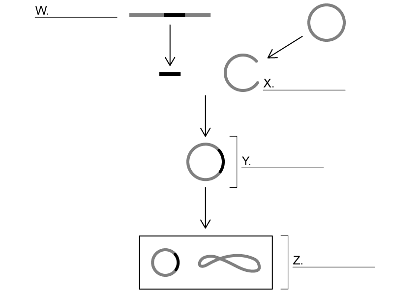
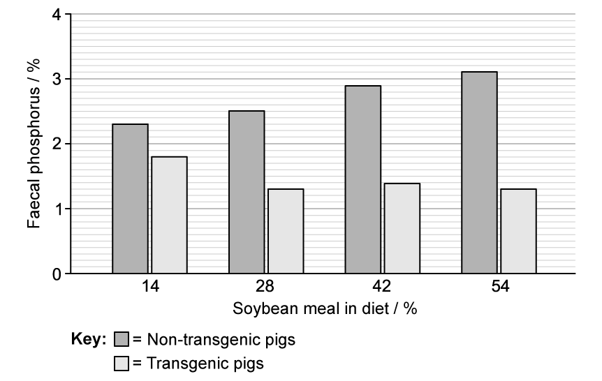

# Exam Questions — Genetic Modification (Genetic Engineering)
**5. Use of Biological Resources** · Edexcel IGCSE Science (Double Award) (4SD0) — 17/Biology
> Source: [https://www.savemyexams.com/igcse/science/edexcel/double-award/17/biology/topic-questions/use-of-biological-resources/genetic-modification-genetic-engineering/exam-questions/](https://www.savemyexams.com/igcse/science/edexcel/double-award/17/biology/topic-questions/use-of-biological-resources/genetic-modification-genetic-engineering/exam-questions/) · 9 questions · total 87 marks

## Q1 — easy — 7 marks · exam-questions

### 2((a)) — 1 mark — command: which — structured — from paper Nov 2020 · 4BI1/1BR
Bacteria are genetically modified to make human proteins.

Which part of a bacterium is used in genetic modification?

| ☐ | **A** | cell wall |
|---|---|---|
| ☐ | **B** | nucleoid |
| ☐ | **C** | plasmid |
| ☐ | **D** | RNA |

### 2((b)) — 6 marks — command: complete — structured — from paper Nov 2020 · 4BI1/1BR
The passage describes the use of an industrial fermenter to grow genetically modified bacteria. Complete the passage by writing a suitable word in each blank space.

The hormone called ............................................ is needed to control the blood glucose levels in humans.

Bacteria have been genetically modified to produce this hormone.

The fermenter is cleaned with ............................................ before adding a nutrient broth that contains the genetically modified bacteria.

This cleaning provides aseptic conditions that prevent ............................................ from other bacteria.

Paddles are used to ............................................ the contents.

A gas called ............................................ is bubbled into the fermenter.

The ............................................ is controlled by using a cooling jacket.

## Q2 — easy — 7 marks · exam-questions

### 1() — 2 marks — command: multiple — structured
The process of genetic engineering involves the use of vectors.

(i) Define the term **vector** when used in the context of genetic engineering.

**(1)**

(ii) Name one example of a vector used in genetic engineering.

**(1)**

### 2() — 3 marks — command: complete — structured
The table below** **sets out a number of steps in the production of human insulin in a process that involves genetically-engineered bacteria.

The statements are in the wrong order.

| **A** | A plasmid is cut using restriction enzymes. |
|---|---|
| **B** | The transgenic bacterial cells are grown in a fermenter. |
| **C** | The recombinant plasmid is taken up by bacterial cells. |
| **D** | The cut plasmids are mixed with copies of the human insulin gene. |
| **E** | The plasmid and the human insulin gene are joined by DNA ligase. |

Complete the blank table below** **to list the steps in the correct sequence.

The first step has been completed for you.

| **Step** | **Corresponding letter from the table above** |
|---|---|
| 1 | A |
| 2 |   |
| 3 |   |
| 4 |   |
| 5 |   |

### 3() — 2 marks — command: describe — structured
Describe the benefits of producing insulin by the method described in part (b).

## Q3 — easy — 8 marks · exam-questions

### 1() — 2 marks — command: define — structured
Define the term **transgenic**.

### 2() — 4 marks — command: multiple — structured
The graph below shows insecticide use and the percentage of land used to grow GM corn in US cornfields between 1996 and 2013.

(i) Calculate the change in insecticide use between 1996 and 2010.

**(2)**

(ii) Describe what the data shows about insecticide use and the percentage of corn fields used to grow GM corn between 1996 and 2013.

**(2)**

### 3() — 2 marks — command: explain — structured
One way in which the corn in part (b) has been genetically modified is to provide the corn with resistance to pests.

Explain one benefit of pest resistant GM corn.

## Q4 — medium — 8 marks · exam-questions

### 6((a)) — 4 marks — command: multiple — structured — from paper Jan 2021 · 4BI1/1BR
Scientists have developed genetically modified (GM) crops in order to increase food production by increasing crop yields.

Some GM crops are described as transgenic.

(i) Explain what is meant by the term **transgenic.**

**(2)**

(ii) Give the role of **two** named enzymes in the production of GM organisms.

**(2)**

### 6((b)) — 4 marks — command: discuss — structured — from paper Jan 2021 · 4BI1/1BR
Some GM crops that are available to farmers are resistant to herbicides (weedkillers).

Other GM crops are resistant to diseases caused by viruses and to damage by insects.

Some people support the use of GM crops because they may be beneficial to ecosystems.

Some people oppose the use of GM crops because they could harm ecosystems.

Discuss these opinions for and against the use of GM crops.

## Q5 — medium — 9 marks · exam-questions

### 1() — 4 marks — command: identify — structured
The diagram shows the process of genetic modification used to produce multiple copies of a protein from a desired gene.

Identify structures **W**-**Z** in the diagram using the words below. Note that more words have been provided than are needed.

**Recombinant DNA     DNA Ligase      Transgenic organism     **

**Bacterial plasmid      Desired gene      Insulin protein      **

### 2() — 1 mark — command: identify — structured
Identify the vector used in this genetic modification process.

### 3() — 2 marks — command: describe — structured
The enzyme used at both **W** and **X** in the diagram in part (a) is a restriction enzyme.

Describe the role of the restriction enzyme at **W** and **X**.

### 4() — 2 marks — command: describe — structured
Describe what needs to happen to structure **Z** in part (a) in order to produce many copies of the protein coded for by the desired gene.

## Q6 — medium — 8 marks · exam-questions

### 1() — 3 marks — command: multiple — structured
The process of genetic modification involves the use of enzymes that cut DNA.

(i) Name the enzymes that are used to cut DNA.

**(1)**

(ii) Explain why the enzymes named in part (i) are so useful in genetic modification.

**(2)**

### 2() — 3 marks — command: multiple — structured
Genes can be extracted from other species and inserted into crop plants. For example, a gene that codes for the bacterial toxin known as Bt provides resistance to insect pests in crops.

(i) Other than pest resistance, give two reasons for inserting genes from other species into crop plants.

**(2)**

(ii) Suggest why inserting DNA into plant cells can be a challenge.

**(1)**

### 3() — 2 marks — command: suggest — structured
Some environmentalists are concerned about inserting Bt toxin genes into crop plants.

Suggest why some are concerned about the insertion of genes from other species, such as the gene for Bt toxin, into crop plants.

## Q7 — medium — 9 marks · exam-questions

### 5((a)) — 3 marks — command: describe — structured — from paper Nov 2020 · 4BI1/1B
Plants can be genetically modified (GM) to produce insect poison.

They are modified using a bacterium called *Agrobacterium*.

This bacterium has a plasmid that contains recombinant DNA.

Describe how the plasmid is modified to contain recombinant DNA.

### 5((b)) — 6 marks — command: discuss — structured — from paper Nov 2020 · 4BI1/1B
A farmer can use either of these methods to improve his crop yield.

- Grow GM plants that produce the insect poison
- Grow non-GM plants and use pesticides

The farmer decides to grow the GM plants rather than using pesticides.

Discuss the decision made by the farmer.

## Q8 — hard — 14 marks · exam-questions

### 1() — 2 marks — command: describe — structured
Insulin is a hormone that is used to treat people with type 1 diabetes.

Describe the function of insulin in the body.

### 2() — 4 marks — command: describe — structured
The insulin used by diabetic patients is produced by genetically modified bacteria.

Describe the process used to create bacteria that contain the gene for human insulin.

### 3() — 2 marks — command: suggest — structured
Before the process in part (b) was developed, insulin for the treatment of diabetes could only be obtained from sheep and pigs.

Suggest two** **reasons, other than preventing the exploitation of animals, why it is better to obtain insulin by genetic engineering than from animals.

### 4() — 6 marks — command: multiple — structured
After the bacteria have been genetically modified they are placed in a machine called a fermenter where they can reproduce asexually and increase the number of genetically modified bacteria in the culture.

Bacteria reproduce by dividing into two identical cells. The species of bacteria used in this process has a division time of 30 minutes.

(i) One genetically modified bacterial cell is added to a fermenter.

Calculate the number of bacteria that will be present in a fermenter after four and a half hours.

**(3)**

(ii) Describe how conditions inside the fermenter could be controlled to maximise the reproduction of genetically modified bacteria.

**(3)**

## Q9 — hard — 17 marks · exam-questions

### 1() — 4 marks — command: explain — structured
As part of a global scientific push to improve the efficiency and sustainability of agriculture, scientists have developed a transgenic pig. The process used to create the transgenic pig, known as 'Enviropig', is summarised below.

1. Genes are taken from *E. coli* bacteria and also from mice.
2. The combined *E. coli* and mouse genes are inserted into a fertilised pig egg cell nucleus using a microscope and a very small, sharp, pipette.
3. The newly modified egg cell divides and develops into an embryo.
4. The embryo is implanted into the uterus of a surrogate pig and allowed to develop to maturity.
5. The resulting piglet is a transgenic 'Enviropig' that is able to produce *E. coli* and mouse proteins.

(i) Explain why a plasmid vector is not a suitable way of inserting the desired genes into the fertilised pig egg cell in step 2.

**(2)**

(ii) Explain why all of the cells in the pig embryo that develops in step 3 contain the new genes.

**(2)**

### 2() — 5 marks — command: discuss — structured
The genes inserted into the genome of 'Enviropig' allow pigs to produce an enzyme called phytase in their saliva. Phytase enables the pigs to digest phosphorus, a mineral that is required in the diet of pigs, but that would otherwise be egested by pigs in their faeces.

Pigs that are unable to produce their own phytase need to take phytase supplements in their food, and still egest a large amount of phosphorus in their waste.

Note that phosphorus is a mineral often found in industrial fertilisers.

Use the information provided and your own knowledge to discuss the potential benefits of 'Enviropig'.

### 3() — 5 marks — command: multiple — structured
The graph below shows the phosporus levels in the faeces of pigs with different percentages of soybean meal in their diet.

(i) Calculate the percentage decrease in faecal phosphorus between non-transgenic and transgenic pigs on a diet of 54 % soybean meal.

**(2)**

(ii) Describe what the results show about the impact of the addition of the new genes on faecal phosphorus in pigs. Avoid repeating any data points used in part (i).

**(3)**

### 4() — 3 marks — command: evaluate — structured
An environmental science student read the results of the study shown in part (c) and reached the following conclusion:

"In the future, 'Enviropigs' will provide a solution to the sustainability issues around pig farming worldwide"

Evaluate the student's conclusion.
