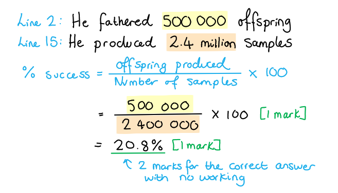

# Mark Schemes — Selective Breeding
**5. Use of Biological Resources** · Edexcel IGCSE Science (Double Award) (4SD0) — 17/Biology

## Q1 — easy — 5 marks · exam-questions

### 1() — 2 marks
(i) **The correct answer is ****C**** because...**

Selecting plants for their desirable characteristics is **selective breeding**. This is an example of** artificial selection **carried out by humans.

The other options are incorrect because:

**Evolution** is a change in the adaptive features of a population over time as a result of natural selection.

**Adaptations** are inherited features that help an organism to survive and reproduce in its environment.

**Natural selection** is the process by which organisms best suited to their environment are more likely to survive and reproduce.

(ii) Another characteristic that farmers may select might include:

Any **one** of the following:

- Pesticide/herbicide resistance; **[1 mark]**
- Drought/flood/frost resistance **OR **hardiness to weather conditions; **[1 mark]**
- Disease resistance:** [1 mark]**
- Bigger size / better taste of fruit; **[1 mark]**

**[Total: 2 marks]**

### 2() — 2 marks
(i) A gene pool is...

- All of the different genes/alleles in a population; **[1 mark]**

(ii) A reduced gene pool may have a negative affect on a population because...

Any **one** of the following:

- It makes the population more susceptible to disease; **[1 mark]**
- Faulty alleles/genes are more likely to be passed on / inherited by offspring; **[1 mark]**

**[Total: 2 marks]**

### 3() — 1 marks
This will increase the size of the gene pool because...

- New genes / alleles will be introduced (in the offspring); **[1 mark]**

**[Total: 1 mark]**

> *Different populations will have different types of alleles in the populations due to random pollination and mutations. Cross-pollination between populations will allow these alleles to spread between populations and increase the size of the gene pool. *

## Q2 — easy — 6 marks · exam-questions

### 1() — 3 marks
Selective breeding was used in the following way:

- Animals / a cow and a bull with high meat/muscle content were bred together; **[1 mark]**
- Offspring with high meat/muscle content were bred together; **[1 mark]**
- This process was repeated over many generations; **[1 mark]**

**[Total: 3 marks]**

> *It is important to reference that selective breeding takes part across many generations as the desired characteristics are reinforced through each selection process. It takes time to reach the desired end result.*

### 2() — 2 marks
One **benefit **of breeding from a bull such as the one in part (a) might include....

Any **one** of the following:

- More beef / meat per animal / greater productivity; **[1 mark]**
- More income per generation of cattle; **[1 mark]**
- More food to supply growing human population; **[1 mark]**
- Favourable characteristics / alleles will be passed to the next generation herd/population; **[1 mark]**
- More consistent quality (of meat) produced; **[1 mark]**

One **drawback **of breeding from a bull such as the one in part (a)** **might include...

Any **one** of the following:

- Risk of inbreeding; **[1 mark]**
- Health problems / animal welfare issues e.g. bull's legs not being able to support the extra mass; **[1 mark]**
- Reduced gene pool / whole herd is more susceptible to disease/new infections; **[1 mark]**

**[Total: 2 marks]**

### 3() — 1 marks
One advantage of farmers using artificial insemination (AI) during selective breeding is...

Any **one** from the following:

- Removes the need for bulls and cows to mate / be transported to each other / less costly; **[1 mark]**
- (Farmers have) more control over which cows and bulls breed successfully; **[1 mark]**
- It gives farmers a much bigger choice of breeding partners for their cows; **[1 mark]**
- Better chance of desired characteristics / advantageous alleles / genes for high beef content to be passed on to the next generation; **[1 mark]**

**[Total: 1 mark]**

## Q3 — easy — 7 marks · exam-questions

### 1() — 1 marks
This process is...

- Selective breeding / artificial selection; **[1 mark]**

**[Total: 1 mark]**

### 2() — 3 marks
(i) The trend can be described as follows...

- As the number of generations increases the percentage protein content of kernels also increases; **[1 mark]**
- The percentage of protein fluctuates;** [1 mark]**

*Allow descriptions for MP2*

(ii) The percentage of protein found in kernels after 50 generations is...

- 18%; **[1 mark]**

*Allow 17-19%*

**[Total: 3 marks]**

### 3() — 1 marks
**The correct answer is**** A****.**

The reason for this is that protein contains nitrogen which is a key component for building amino acids and therefore proteins (which are built from chains of amino acids).

> *The other answers are incorrect because **B** describes carbohydrates, **C** describes fibre and **D **describes lipids/fats. This is synoptic but the information contained in the question is taken from the key stage 3 syllabus.*

**[Total: 1 mark]**

### 4() — 2 marks
It may be appealing to farmers to grow high protein maize because...

Any **two** from the following:

- It is more sought after / there is a bigger market for high protein maize / they can sell more; **[1 mark]**
- Profit margins may be higher / farmers can earn more; **[1 mark]**
- To reduce malnutrition;** [1 mark]**

**[Total: 2 marks]**

> *Farming practices balance the demand for a particular product with the cost of producing it, with the aim of maximising their profits. There are other considerations which will have to be taken into account, including the impact on the ecosystem and sustainability.*

## Q4 — medium — 12 marks · exam-questions

### 1((a)) — 1 marks
Genex waited until Toystory was four years old before beginning to collect his semen because...

- So the semen contained sperm / the bull is sexually mature / the bull had gone through puberty / the bull was fully developed; **[1 mark]**

**[Total: 1 mark]**

### 1((b)) — 2 marks
The semen from the bull is used to fertilise cows using artificial insemination by...

Any **two **of the following:

- Collect semen / sperm from <u>penis</u> of bull; **[1 mark]**
- Inject <u>straw</u> / semen into a cow;** [1 mark]**
- Put semen/sperm in <u>vagina</u> / <u>uterus</u> / womb / cervix; **[1 mark]**

**[Total: 2 marks]**

### 1((c)) — 2 marks
(i) The semen is stored in liquid nitrogen because...

- It preserves sperm / keeps the sperm alive / prevents the growth of microorganisms;** [1 mark]**

(ii) Dairy farmers would prefer to used sexed semen because...

- The sexed sperm provide females (which produce milk) / will produce cows (not bulls); **[1 mark]**

**[Total: 2 marks]**

### 1((d)) — 2 marks
The percentage success of Toystory’s semen samples that produce offspring are...

- 500 000 ÷ 2.4 million = 0.2083; **[1 mark]**
- 0.2083 × 100 = 20.83% / 21.0% / 20.8%; **[1 mark]**

*Full marks awarded for the correct answer only.*

**[Total: 2 marks]**

Dividing any number by 2.4 million would allow you to gain 1 mark.

### 1((e)) — 3 marks
Scientists could investigate which of two bulls is the best to use as a father in dairy farming by...

Any **three **of the following:

- Use semen (from each bull) to fertilise (many / similar) cows;** [1 mark]**
- Collect / measure milk yields;** [1 mark]**
- From each daughter / offspring of these cows / mother of bull;** [1 mark]**
- Select the bull with the highest (average) milk yield (across all daughters); **[1 mark]**

**[Total: 3 marks]**

### 1((f)) — 2 marks
The composition of milk is important to consumers because...

Any **two **of the following:

- (Milk that contains) (most) fat; **[1 mark]**
- (Most) protein; **[1 mark]**
- (Most) vitamins; **[1 mark]**
- (Milk that contains) (most) calcium;** [1 mark]**

**[Total: 2 marks]**

## Q5 — medium — 7 marks · exam-questions

### 1() — 3 marks
Selective breeding resulted in the development of Dorper sheep as follows...

Any **three** of the following:

- Humans selected (individuals showing) desired characteristics of high fertility in Dorset Horn sheep **AND** (fast growth and) heat/aridity tolerance in Blackhead Persian sheep; **[1 mark]**
- (They) bred Dorset Horn and Blackhead Persian / the two breeds of sheep together; **[1 mark]**
- The offspring that displayed the desired characteristics (of fast growth rate, high fertility, and tolerance to heat/arid conditions) were bred together; **[1 mark]**
- This process was repeated over many generations; **[1 mark]**

**[Total: 3 marks]**

> *In selective breeding, humans act as the selective agent instead of selection pressures in nature. By selecting and crossbreeding individuals with the desired characteristics over many generations a new breed is established. Most individuals in that population will display the favourable characteristics that were chosen.*

### 2() — 2 marks
Other characteristics that may be selected for in sheep include...

Any **two** of the following:

- Docility / good natured personality; **[1 mark]**
- High quality wool / fast wool growth; **[1 mark]**
- High quality / fast meat production; **[1 mark]**
- Disease resistance; **[1 mark]**

**[Total: 2 marks]**

### 3() — 2 marks
The negative impacts of inbreeding include the following...

Any **two** of the following:

- The population may become vulnerable to diseases; **[1 mark]**
- There is a greater chance that harmful recessive alleles will be inherited together / expressed** OR** increased chance that genetic faults will be passed to the next generation; **[1 mark]**
- There will be less genetic variation **OR** no new alleles will be introduced into the population; **[1 mark]**

**[Total: 2 marks]**

## Q6 — medium — 15 marks · exam-questions

### 1() — 5 marks
Selective breeding of the two varieties of potato plants can produce new potato plants that are all faster growing and produce many, large potatoes because...

- Select variety A because it has large potatoes; **[1 mark]**
- Select variety B because is faster growing and produces many potatoes; **[1 mark]**
- Crossbreed variety A with variety B **OR** transfer pollen from flower of variety A to flower of variety B; **[1 mark]**
- Select the offspring that are fast growing and produce many large potatoes; **[1 mark]**
- Repeat the process over many generations / until all offspring are fast growing and produce many large potatoes; **[1 mark]**

**[Total: 5 marks]**

### 2() — 3 marks
The benefits of breeding potato plants that are resistant to fungal diseases can be explained as follows:

Any **three** of the following:

- Potato plants are not damaged; **[1 mark]**
- The spread of the disease / blight would be reduced; **[1 mark]**
- So there is a greater yield / profit **OR **prevents food/potato shortages; **[1 mark]**
- Allows for reduced use of fungicides / pesticides; **[1 mark]**
- The offspring of the potato plants would also be resistant to potato blight; **[1 mark]**

**[Total: 3 marks]**

### 3() — 2 marks
The graph shows the following:

- Variety A has a lower level of heterozygosity / fewer heterozygous genotypes than variety B; **[1 mark]**
- There is more variation in the data collected for variety B than variety A; **[1 mark]**

**[Total: 2 marks]**

### 4() — 2 marks
The issues associated with low heterozygosity are...

Any** two **from the following:

- Reduced genetic variation; **[1 mark]**
- Leading to vulnerability (of the population) to disease; **[1 mark]**
- Increased inheritance of faulty/damaging alleles; **[1 mark]**

**[Total: 2 marks]**

> *Low numbers of heterozygous genotypes occur due to inbreeding of populations. *

### 5() — 3 marks
Breeding varieties** **A and B together will reduce the effects described because...

Any **three** from the following:

- New alleles of genes will be introduced into the populations; **[1 mark]**
- This will increase heterozygous genotypes/heterozygosity; **[1 mark]**
- Genetic variation/diversity will increase; **[1 mark]**
- Vulnerability to diseases may decrease; **[1 mark]**

**[Total: 3 marks]**

> *The idea that heterozygous genotypes have more variation than homozygous genotypes is described earlier on in the question. You need to link that idea into what you know about the affect of inbreeding on populations. If new alleles can then be introduced e.g. by crossbreeding with a new population, then inbreeding is reduced and the population has an increased supply of alleles which may provide resistance to certain diseases etc.*

## Q7 — hard — 7 marks · exam-questions

### 1() — 3 marks
Artificial selection is different to natural selection because...

- In artificial selection, human intervention is required **WHEREAS** in natural selection, no human intervention is required / it occurs naturally **OR **humans provide the selection pressure in artificial selection whereas in natural selection, the selection pressure comes from environmental changes; **[1 mark]**
- Artificial selection takes a shorter amount of time / smaller number of generations; **[1 mark]**
- Artificial selection favours characteristics which are desirable to humans **WHEREAS** in natural selection, characteristics which provide a survival advantage are favoured; **[1 mark]**

**[Total: 3 marks]**

### 2() — 4 marks
Viable wild populations are important to maintain because...

Any **four **from the following:

- (Wild populations) provide genetic variation **OR** provide new alleles; **[1 mark]**
- (Wild populations) can be cross bred with crop varieties;**[1 mark]**
- Allows introduction of different traits; **[1 mark]**
- Unknown future requirements (so wild populations need to be maintained) **OR** any example of future situations e.g. Potentially useful in changing climate; **[1 mark]**
- Prevention of inbreeding depression **OR** prevents dwindling gene pool; **[1 mark]**
- (Wild populations are a) source of replacement if cultivated population is in danger; **[1 mark]**

**[Total: 4 marks]**

> *It is important to be precise with your terminology; some common mistakes students make are interchanging the terms genes with alleles, referring to resistance as immunity, suggesting that selective breeding causes mutations, interchanging genetic diversity and biodiversity, and misusing the term ‘species’ to mean ‘variety’. Poor understanding of biological terms means the upper mark within a level would not be credited.*

## Q8 — hard — 11 marks · exam-questions

### 1() — 4 marks
It is possible for humans to develop varieties of bananas without seeds by:

Any **four **from the following:

- Selective breeding; **[1 mark]**
- Growers select the banana plants with the fewest / smallest seeds; **[1 mark]**
- Breed them together; **[1 mark]**
- Select the offspring with the fewest / smallest seeds and breed them together; **[1 mark]**
- Repeat this process over several generations;** [1 mark]**

**[Total: 4 marks]**

### 2() — 3 marks
It reduces the yield because:

Any **three **from the following:

- Plants/leaves have less chlorophyll; **[1 mark]**
- Less photosynthesis; **[1 mark]**
- Less glucose so less energy is released from respiration; **[1 mark]**
- Less protein synthesis / less biomass; **[1 mark]**

**[Total: 3 marks]**

> *The fungi secrete enzymes which digest the cells in the leaf, causing the black streaks. *

### 3() — 4 marks
The solutions can be compared as follows:

Any **four **from the following:

- Selective breeding is slow / takes several generations **whereas **genetic engineering is much quicker in comparison; **[1 mark]**
- There is a concern that with genetic engineering the genes will be transferred to wild populations **whereas **this is not a concern with selective breeding; **[1 mark]**
- Genetic engineering is more expensive than selective breeding; **[1 mark]**
- **Both **reduce the need for fungicides / reduce plants dying from Black Sigatoka / saves the farmers money; **[1 mark]**
- **Both **reduce the size of the gene pool / less genetic diversity in the populations; **[1 mark]**

**[Total: 4 marks]**

> *It is important to discuss both strategies and compare them directly to each other. It is sometimes tempting to write a big chunk of text about one option and then separately write about the second option. When comparing you need to discuss both options at the same time. *

## Q9 — hard — 9 marks · exam-questions

### 1() — 2 marks
Two other reasons why dogs might be selectively bred might include...

Any **two** from the following:

- To produce dogs with a gentle nature or so that they are docile / not aggressive; **[1 mark]**
- For aesthetic reasons (e.g. a particular colour coat / fur pattern / size etc.);** [1 mark]**
- So that they don’t have certain genetic defects (e.g. deafness in Dalmatians); **[1 mark]**

***Accept**** any other valid response*

**[Total: 2 marks]**

### 2() — 4 marks
Crossbreed Dalmatians without genetic defects can be selected as follows:

- Dalmatian and pointer are initially selected; **[1 mark]**
- Cross-breed offspring produced; **[1 mark]**
- Those without gene mutation are selected (and) bred with pure-breed Dalmatians (to re-establish characteristics of Dalmatian); **[1 mark]**
- Over-time the crossbreed is genetically more Dalmatian than pointer but without the gene mutation; **[1 mark]**

**[Total: 4 marks]**

> *Selective breeding is a form of artificial selection by which humans breed plants and animals for particular genetic characteristics. Often not all of the offspring will show the characteristics that is desired, so the process has to be repeated for many successive generations before a ‘new breed’ is developed. In this example the first generation lost many of the Dalmatian characteristics but after five successive generations the offspring resembled Dalmatians closely whilst lacking the mutation.*

### 3() — 3 marks
A change in one amino acid in the protein could stop it from functioning normally because...

- The protein made is different / has a different structure **or** different shape; **[1 mark]**
- Uric acid/substrate no longer fits/binds to the protein/active site; **[1 mark]**
- As they are no longer complementary to each other;** [1 mark]**

**[Total: 3 marks]**
