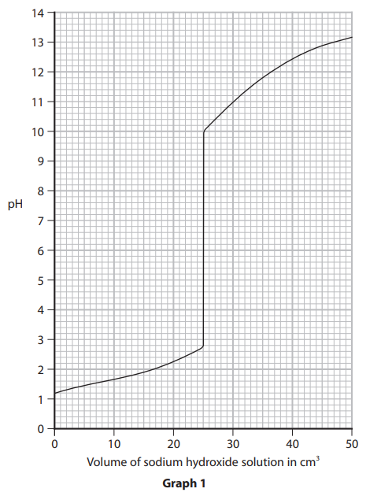

# Exam Questions — Acids, Alkalis & Titrations
**2. Inorganic Chemistry** · Edexcel IGCSE Science (Double Award) (4SD0) — 17/Chemistry
> Source: [https://www.savemyexams.com/igcse/science/edexcel/double-award/17/chemistry/topic-questions/inorganic-chemistry/acids-alkalis-and-titrations/exam-questions/](https://www.savemyexams.com/igcse/science/edexcel/double-award/17/chemistry/topic-questions/inorganic-chemistry/acids-alkalis-and-titrations/exam-questions/) · 6 questions · total 28 marks

## Q1 — easy — 7 marks · exam-questions

### 1((a)) — 1 mark — multiple_choice — from paper 2022 · Jan1CR
Which of these is the colour of litmus indicator in an acidic solution?
- **A.** blue
- **B.** orange
- **C.** red
- **D.** yellow

### 1((b)) — 1 mark — multiple_choice — from paper 2022 · Jan1CR
Which of these is the pH value of a neutral solution?
- **A.** 0
- **B.** 4
- **C.** 7
- **D.** 14

### 1((c)) — 1 mark — multiple_choice — from paper 2022 · Jan1CR
Which of these describes a solution with a pH value of 9?
- **A.** Strongly acidic
- **B.** Strongly alkaline
- **C.** Weakly acidic
- **D.** Weakly alkaline

### 1((d)) — 1 mark — multiple_choice — from paper 2022 · Jan1CR
Which of these is the chemical formula of an acid?
- **A.** HNO3
- **B.** H2O
- **C.** NaCl
- **D.** NaOH

### 1((e)) — 1 mark — command: name — structured — from paper 2022 · Jan1CR
Name the type of reaction that occurs when an acid reacts with an alkali.

### 1((f)) — 2 marks — command: name — structured — from paper 2022 · Jan1CR
Name the two products of the reaction between hydrochloric acid and potassium hydroxide.

## Q2 — medium — 1 marks · exam-questions

### 1() — 1 mark — multiple_choice
A student added some sulfuric acid gradually to a solution of ammonia until it was in excess.

What happens to the pH during this reaction?
- **A.** pH of ammonia at start: 11
pH after excess sulfuric acid: 7
- **B.** pH of ammonia at start: 7
pH after excess sulfuric acid: 13
- **C.** pH of ammonia at start: 11
pH after excess sulfuric acid: 2
- **D.** pH of ammonia at start: 3
pH after excess sulfuric acid: 8

## Q3 — medium — 9 marks · exam-questions

### 7((a)) — 2 marks — command: multiple — structured — from paper 2020 · Ja1CR
A student investigates the reaction between sodium hydroxide solution and hydrochloric acid.

He uses this method:

**Step 1** add 50 cm3 of dilute hydrochloric acid to a conical flask

**Step 2** add a 5 cm3 portion of sodium hydroxide solution to the conical flask

**Step 3** test the pH of the mixture using both universal indicator paper and a pH meter

The student repeats step 2 and step 3 until a total of 50 cm3 of sodium hydroxide solution has been added.

i) State the piece of apparatus that should be used to measure 50 cm3 of hydrochloric acid.

(1)

ii) Name the type of reaction that occurs between hydrochloric acid and sodium hydroxide.

(1)

### 7((b)) — 4 marks — command: multiple — structured — from paper 2020 · Ja1CR
Graph 1 shows how the pH of the mixture changes as the sodium hydroxide solution is added.

i) Determine the pH after 40 cm3 of sodium hydroxide solution has been added.

(1)

ii) Suggest the colour of the universal indicator paper when these volumes of sodium hydroxide solution have been added.

(2)

15 cm3: ............................................................ 
30 cm3: ............................................................

iii) Give the formula of the ion that causes sodium hydroxide to be alkaline.

(1)

### 7((c)) — 3 marks — command: explain — structured — from paper 2020 · Ja1CR
Another student investigates how the temperature changes when the sodium hydroxide solution is added to the hydrochloric acid. The hydrochloric acid and the sodium hydroxide solution are at the same temperature at the start of the investigation. The student records the temperature of the mixture after adding each 5 cm3 portion of sodium hydroxide solution.

Graph 2 shows her results.

Explain the shape of graph 2.

## Q4 — medium — 1 marks · exam-questions

### 1() — 1 mark — multiple_choice
#### Separate: Chemistry Only

A student carried out a titration to investigate the volume of sulfuric acid needed to neutralise 25.0 cm3 of potassium hydroxide.

The diagram shows the equipment they used.

Which piece of apparatus would the student use to measure out 25.0 cm3 of potassium hydroxide?
- **A.** Pipette
- **B.** Measuring cylinder
- **C.** Beaker
- **D.** Conical flask

## Q5 — medium — 9 marks · exam-questions

### 4((a)) — 2 marks — command: give — structured — from paper 2020 · Ja202C
#### Separate: Chemistry Only

A student investigates the reaction between sodium hydroxide solution and dilute sulfuric acid. He does a titration to find the concentration of the sulfuric acid. This is his plan for the titration. There are some mistakes and omissions in his plan.

- rinse a conical flask with the sodium hydroxide solution
- use a measuring cylinder to measure out 25 cm3 of the sodium hydroxide solution and add it to the conical flask
- add a few drops of methyl orange indicator to the conical flask
- rinse a burette with water and then fill it with the sulfuric acid
- add the acid from the burette to the conical flask until the indicator changes colour at the end‐point of the titration
- record the final burette reading

Give the colour change of the methyl orange indicator at the end‐point.

from ........................................................... to ................................................................

### 4((b)) — 4 marks — command: describe — structured — from paper 2020 · Ja202C
#### Separate: Chemistry Only

Describe four changes that the student could make to improve his plan.

### 4((c)) — 3 marks — command: calculate — structured — from paper 2020 · Ja202C
#### Separate: Chemistry Only

The student then does the titration correctly. He finds that 16.70 cm3 of the dilute sulfuric acid neutralises 25.0 cm3 of sodium hydroxide solution of concentration 0.200 mol/dm3. The equation for the reaction is

2NaOH + H2SO4 → Na2SO4 + 2H2O

Calculate the concentration, in mol/dm3, of the sulfuric acid.

## Q6 — medium — 1 marks · exam-questions

### 1() — 1 mark — multiple_choice
#### Separate: Chemistry Only

The steps below briefly describe how to carry out a titration with sodium hydroxide and hydrochloric acid.

1. Add a few drops of a suitable indicator to the solution
2. Record the final volume of HCl and repeat to obtain concordant results
3. Fill the burette with HCl and record the volume
4. Measure 25 cm3 sodium hydroxide solution into a conical flask using a pipette
5. Add the HCl to sodium hydroxide until the end point is reached

What is the correct order of steps?
- **A.** A, C, D, E, B
- **B.** D, A,C, E, B
- **C.** D, B, E, A, C
- **D.** C, A, E, B, D
