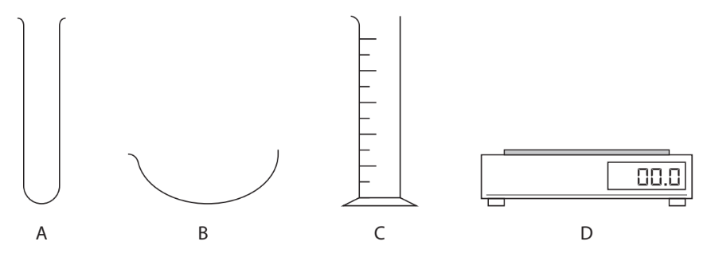
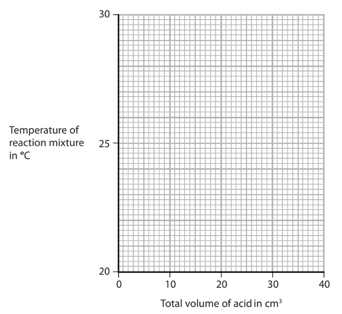

# Exam Questions — Acids, Bases & Salt Preparations
**2. Inorganic Chemistry** · Edexcel IGCSE Science (Double Award) (4SD0) — 17/Chemistry
> Source: [https://www.savemyexams.com/igcse/science/edexcel/double-award/17/chemistry/topic-questions/inorganic-chemistry/acids-bases-and-salt-preparations/exam-questions/](https://www.savemyexams.com/igcse/science/edexcel/double-award/17/chemistry/topic-questions/inorganic-chemistry/acids-bases-and-salt-preparations/exam-questions/) · 9 questions · total 48 marks

## Q1 — easy — 5 marks · exam-questions

### 1((a)) — 4 marks — command: complete — structured — from paper 2020 · N2CR
The diagram shows some pieces of apparatus.

Complete the table by giving the name of each piece of apparatus.

| **Letter** | **Name** |
|---|---|
| **A** |   |
| **B** |   |
| **C** |   |
| **D** |   |

### 1((b)) — 1 mark — multiple_choice — from paper 2020 · N2CR
Which piece of apparatus can be used to measure the volume of a liquid?
- **A.** 
- **B.** 
- **C.** 
- **D.** 

## Q2 — medium — 1 marks · exam-questions

### 1() — 1 mark — multiple_choice
A neutralisation reaction occurs between ammonia and sulfuric acid.

How does the sulfuric acid act in this reaction?
- **A.** As a proton acceptor
- **B.** As an electron acceptor
- **C.** As a proton donor
- **D.** As a neutron donor

## Q3 — medium — 14 marks · exam-questions

### 7((a)) — 8 marks — command: multiple — structured — from paper 2019 · Ju1CR
A student makes some magnesium nitrate crystals from magnesium oxide and dilute nitric acid. The equation for the reaction is

MgO (s) + 2HNO3 (aq) → Mg(NO3)2 (aq) + H2O (l)

i) Give the formula of each ion in magnesium nitrate.

......................................... and ......................................

(2)

ii) A student has a beaker containing dilute nitric acid. Describe a method that she could use to prepare a pure, dry sample of magnesium nitrate crystals from magnesium oxide.

(6)

### 7((b)) — 6 marks — command: multiple — structured — from paper 2019 · Ju1CR
Magnesium nitrate crystals contain water of crystallisation with the formula Mg(NO3)2.6H2O

i) Show by calculation that the relative formula mass of Mg(NO3)2.6H2O is 256.

(1)

ii) Show that the maximum mass of Mg(NO3)2.6H2O that could be made from 0.050 mol of nitric acid is about 6 g.

(3)

iii) The actual mass of crystals that the student obtains is 4.8 g. Calculate the percentage yield of Mg(NO3)2.6H2O in this experiment.

(2)

## Q4 — medium — 1 marks · exam-questions

### 1() — 1 mark — multiple_choice
The chemical equation for the preparation of lead(II) sulfate is written below.

Pb(NO3)2  (___) + Na2SO4 (___) → PbSO4 (___) + 2NaNO3 (___)

What are the state symbols for each substance in this reaction?
- **A.** aq, aq, s, aq
- **B.** aq, aq, s, s
- **C.** s, aq, aq, s
- **D.** s, aq, s, aq

## Q5 — medium — 9 marks · exam-questions

### 8((a)) — 4 marks — command: multiple — structured — from paper 2019 · Ju1CR
A student investigates the neutralisation reaction between sodium hydroxide and nitric acid. This is her method.

- pour 20 cm3 of sodium hydroxide solution into a polystyrene cup
- record the temperature of the sodium hydroxide solution
- add 5 cm3 of dilute nitric acid to the cup
- stir the mixture and record the highest temperature reached
- add further 5 cm3 portions of dilute nitric acid, recording the highest temperature reached each time, until a total of 40 cm3 of acid has been added

i) Give a word equation for this neutralisation reaction.

(1)

ii) Explain why a polystyrene cup is used rather than a beaker.

(2)

iii) Give a safety precaution that the student should take when using sodium hydroxide solution.

(1)

### 8((b)) — 5 marks — command: multiple — structured — from paper 2019 · Ju1CR
The table shows the student’s results.

| **Total volume of acid in cm****3** | 0 | 5 | 10 | 15 | 20 | 25 | 30 | 35 | 40 |
|---|---|---|---|---|---|---|---|---|---|
| **Temperature of** **reaction mixture in °C** | 20.5 | 22.5 | 24.4 | 26.4 | 28.5 | 28.3 | 27.5 | 26.7 | 26.0 |

i) Plot the results on the grid. Draw a straight line of best fit through the first five points and another straight line of best fit through the last four points. Make sure that the two lines cross.

ii) The point where the lines cross shows

- the volume of acid needed to exactly neutralise the alkali
- the maximum temperature reached

Use your graph to determine these values.

volume of acid = ...................................................................... cm3 maximum temperature = ............................................... °C

[2]

## Q6 — medium — 1 marks · exam-questions

### 1() — 1 mark — multiple_choice
A student making copper sulfate crystals used the method below.

Unreacted copper carbonate was left over as it had been added in excess.

What is the reason for adding it in excess and what would step 3 be of this method?
- **A.** Reason: to produce a greater amount of salt crystals
Step 3: filtration
- **B.** Reason: to improve the colour intensity of the crystals
Step 3: crystallisation
- **C.** Reason: to ensure all the acid reacts
Step 3: filtration
- **D.** Reason: to increase the rate of reaction
Step 3: evaporation

## Q7 — medium — 1 marks · exam-questions

### 1() — 1 mark — multiple_choice
Which equation does **not** show the correct reaction of an acid?
- **A.** copper oxide + hydrochloric acid → copper chloride + water
- **B.** calcium carbonate + nitric acid → calcium nitrate + carbon dioxide
- **C.** potassium hydroxide + sulfuric acid → potassium sulfate + water
- **D.** zinc + sulfuric acid → zinc sulfate + hydrogen

## Q8 — medium — 1 marks · exam-questions

### 1() — 1 mark — multiple_choice
A student was preparing the insoluble salt lead(II) sulfate from solutions of lead(II) nitrate and potassium sulfate.

Why could the student not use lead(II) carbonate to prepare this salt?
- **A.** It has a high melting point
- **B.** It is insoluble in water
- **C.** it is toxic
- **D.** It is flammable

## Q9 — hard — 15 marks · exam-questions

### 6((a)) — 4 marks — command: describe — structured — from paper 2021 · Ja2C
This question is about the insoluble salt silver chloride (AgCl). Silver chloride can be made by the reaction between copper(II) chloride and silver nitrate.

Describe how a student could prepare a pure, dry sample of silver chloride starting with copper(II) chloride solution and silver nitrate solution.

### 6((b)) — 5 marks — command: multiple — structured — from paper 2021 · Ja2C
A student investigates the quantity of silver chloride produced when different volumes of silver nitrate solution are added to copper(II) chloride solution. This is the student’s method.

- pour 5.0 cm3 of copper(II) chloride solution into a test tube
- add 1.0 cm3 of silver nitrate solution to the test tube
- allow the silver chloride precipitate to settle
- measure the height of the precipitate

The student repeats the method using different volumes of silver nitrate solution. The table shows the student’s results.

| **Volume of silver nitrate** **added in cm****3** | **Height of precipitate** **in cm** |
|---|---|
| 0.0 | 0.0 |
| 1.0 | 0.5 |
| 2.0 | 1.0 |
| 3.0 | 1.2 |
| 4.0 | 2.0 |
| 5.0 | 2.5 |
| 6.0 | 3.0 |
| 7.0 | 3.0 |
| 8.0 | 3.0 |

i) Plot the student’s results.

(2)

ii) Draw two straight lines of best fit, ignoring the anomalous result.

(1)

iii) Suggest a mistake the student made to cause the anomalous result.

(1)

iv) Give a reason why the last three heights are the same.

(1)

### 6((c)) — 6 marks — command: multiple — structured — from paper 2021 · Ja2C
The equation for the reaction between copper(II) chloride and silver nitrate is

CuCl2 (aq) + 2AgNO3 (aq) → 2AgCl (s) + Cu(NO3)2 (aq)

A student measures 25.0 cm3 of 0.500 mol / dm3 copper(II) chloride solution and reacts it with silver nitrate solution.

i) Name a piece of apparatus suitable for measuring 25.0 cm3 of copper(II) chloride solution.

(1)

ii) Calculate the maximum mass, in grams, of silver chloride that could be produced.

[*M*r of AgCl = 143.5]

(3)

maximum mass = ............................................................... g

iii) In an experiment using different solutions, the mass of silver chloride produced is 0.744 g.

The maximum mass of silver chloride that could be produced is 0.850 g. Calculate the percentage yield.

(2)

percentage yield = ............................................................... %
