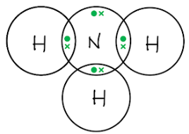

# Mark Schemes — Chemical Tests
**2. Inorganic Chemistry** · Edexcel IGCSE Science (Double Award) (4SD0) — 17/Chemistry

## Q1 — easy — 6 marks · exam-questions

### 3((a)) — 1 marks
The ion that produces the red flame is:

- Li+  **OR** Sr2+; **[1 mark]**

**[Total: 1 mark]**

- *You are expected to know the following flame colours:*

  - *Li**+** is red*
  - *Na**+** is yellow*
  - *K**+** is lilac*
  - *Ca**2+** is orange-red*
  - *Cu**2+** is blue-green*
- *Careful:** Some mark schemes might state that you cannot get the mark without including the charge of the ion*

  - *Without the charge, you are actually just writing the symbol for an element not an ion*

### 3((b)) — 1 marks
The cream precipitate is:

- Silver bromide / AgBr; **[1 mark]**

**[Total: 1 mark]**

- *Acidified silver nitrate solution is the test for the halide ions*

  - *Chloride ions form a white precipitate*
  - *Bromide ions form a cream precipitate*
  - *Iodide ions for a yellow precipitate*
- *You can remember the correct colours in one of two ways:*

  1. *Ignoring fluorine / fluoride ions, the halide ions become more coloured as you move down the group from chloride to bromide to iodide*
  2. *If you arrange the ions and the precipitate colours in alphabetical order, then you have them matched up* | > *Bromide* | > *Chloride* | > *Iodide* |
  |---|---|---|
  | > *Cream* | > *White * | > *Yellow* |

### 3((c)) — 1 marks
The white solid is:

- Lithium bromide / LiBr; **[1 mark]**

**[Total: 1 mark]**

- *From part (a), you should have identified the metal ion as lithium / Li**+** *
- *From part (b), you should have identified the non-metal ion as bromide / Br**–** *
- *This means that the white solid contained lithium and bromide and is, therefore, lithium bromide *

### 3((d)) — 3 marks
i) The wire should be clean when used in the flame test because:

- Impurities could alter / affect / interfere with the colour of the flame **OR **Impurities could contaminate the flame / results / test **OR **Impurities could alter / affect / interfere with the results of the test; **[1 mark]** *Accept other ions or other substances for impurities*

ii) The completed table of the properties of some metals is:

| **Property** |   |
|---|---|
| good conductor of electricity |   |
| high density |   |
| high melting point | ✔ |
| unreactive | ✔ |

- High melting point; **[1 mark]**
- Unreactive; **[1 mark]**

**[Total: 3 marks]**

- *The metal wire / loop should be:*

  - *Clean - so that it does not affect the results / colour seen*
  - *Unreactive - so that it does not contribute its own colour to the flame test*
  - *High melting point - so that it doesn't melt while performing the flame test*

## Q2 — medium — 9 marks · exam-questions

### 11((a)) — 2 marks
To calculate the mass of oxygen required to react with 32 g of methane:

Method 1:

- Moles of methane: $\frac{32}{16}$ = 2; **[1 mark]**
- Mass of oxygen: (32 x 2 x 2) = 128 (g); **[1 mark] ***A final answer of 128  scores both marks*

Method 2:

- 16 g of methane needs 64 g of oxygen; **[1 mark]**
- Therefore, 32 g of methane needs 128 g of oxygen**[1 mark] ***A final answer of 128  scores both marks*

**[Total: 2 marks]**

- *From the equation, 1 mole of methane reacts with 2 moles of oxygen*
- *32 g of methane is 2 moles of methane*
- *2 moles of methane will, therefore, require 4 moles of oxygen*
- *4 moles of oxygen has a mass of (4 x 32) = 128 g*

### 11((b)) — 7 marks
i) Water collects in the U-tube because:

- The water vapour / steam condenses;** [1 mark]**
- Because it is cooled (by the ice and water) **OR **Because the ice and water is at a low temperature **OR **Because the temperature of the ice and water is below 100 oC / the boiling point of water; **[1 mark] **

ii) Anhydrous copper(II) sulfate is used to test for water by:

- White anyhdrous copper(II) sulfate; **[1 mark]**
- Turning blue; **[1 mark] **

iii) The change in the appearance of the limewater is because:

- The limewater turns cloudy / milky **OR **The limewater forms a white precipitate; **[1 mark]**
- Because carbon dioxide / CO is present;** [1 mark]**
- Which forms calcium carbonate / CaCO3 / an insoluble solid;** [1 mark]  ***A correct word / chemical equation scores the second and third marks*

**[Total: 7 marks]**

- *This reaction is demonstrating the products of **complete** combustion, which are carbon dioxide and water*
- *You should know that:*

  - *Anhydrous copper(II) sulfate is white and turns blue in the presence of water*
  - *Carbon dioxide turns limewater cloudy / milky due to the formation of insoluble calcium carbonate*

## Q3 — medium — 1 marks · exam-questions

### 1() — 1 marks
**Correct answer: C** — Fe2+ and Cl-

**Final answer:** **The correct answer is C.**

- When sodium hydroxide solution is added to Fe2+ ions, a green precipitate of Fe(OH)2 is formed
- When acidified silver nitrate solution is added to Cl- ions, a white precipitate of AgCl is formed
- A and B are incorrect as Fe3+ forms a brown precipitate when sodium hydroxide solution is added
- B and D are incorrect as SO42- forms a white precipitate when barium chloride solution is added

## Q4 — medium — 9 marks · exam-questions

### 6((a)) — 3 marks
The completed table to show the results of mixing solutions of some soluble salts:

|   | **ammonium carbonate solution** | **magnesium sulfate solution** |
|---|---|---|
| **barium chloride solution** | precipitate of barium carbonate | **precipitate of barium sulfate  / BaSO****4**; **[1 mark]** |
| **potassium chloride solution** | **no precipitate**; **[1 mark]** | no precipitate |
| **calcium chloride solution** | **precipitate of calcium carbonate / CaCO****3**; **[1 mark]** | precipitate of calcium sulfate |

**[Total: 3 marks]**

- *If you had identified barium sulfate and calcium carbonate but you didn't write the term 'precipitate', you would have been awarded 1 out of 2 available marks*
- *The products of the reaction between barium chloride and magnesium sulfate are barium sulfate and magnesium chloride*

  - *All chloride salts are soluble (except silver and lead(II)) so magnesium chloride will not form a precipitate*
  - *All sulfates are soluble (except barium, calcium and lead(II) so barium sulfate will form a precipitate*
- *The products of the reaction between potassium chloride and ammonium carbonate are potassium carbonate and ammonium chloride*

  - *All chloride salts are soluble (except silver and lead(II)) so ammonium chloride will not form a precipitate*
  - *All carbonates are insoluble (except sodium, potassium and ammonium) so potassium carbonate will not form a precipitate*
- *The products of the reaction between calcium chloride and ammonium carbonate are calcium carbonate and ammonium chloride*

  - *All chloride salts are soluble (except silver and lead(II)) so ammonium chloride will not form a precipitate*
  - *All carbonates are insoluble (except sodium, potassium and ammonium) so calcium carbonate will form a precipitate*

### 6((b)) — 6 marks
Methods to identify each solution are:

Any **six **from:

Identifying sodium chloride:

- Do a flame test / description of a flame test; **[1 mark]**
- Sodium chloride produces a yellow / orange / yellow-orange flame; **[1 mark]**

Identifying potassium carbonate:

- Add acid; **[1 mark]**
- Potassium carbonate effervesces / bubbles **OR** (With potassium carbonate) carbon dioxide / gas is given off which turns limewater cloudy; **[1 mark]**

Identifying potassium chloride / iodide:

Alternative 1:

- Add dilute nitric acid; **[1 mark]**
- Add silver nitrate (solution); **[1 mark]**
- Potassium chloride gives a white precipitate; **[1 mark]**
- Potassium iodide gives a yellow precipitate; **[1 mark]**

Alternative 2:

- Add chlorine / bromine solution; **[1 mark]**
- No colour change with potassium chloride; **[1 mark]**
- Solution turns brown with potassium iodide; **[1 mark]**

**[Total: 6 marks]**

- *The alternative method to identify potassium chloride and potassium iodide uses Group 7 displacement reactions where the more reactive halogen will displace a less reactive halogen from an aqueous solution of its halide*

  - *The resulting colour of the solution is due to the less reactive halogen that has been produced*
- *Make sure that you give a test that could identify each of the four different compounds given*

  - *Be methodical in your approach and think about the differences between the compounds and what tests could distinguish them*
- *There are many tests, with positive results, that you need to learn and this type of question draws from many of these tests*

## Q5 — medium — 1 marks · exam-questions

### 1() — 1 marks
**Correct answer: D** — Test: add sodium hydroxide solutionResult: green precipitate forms

**Final answer:** **The correct answer is D.**

- Copper ions can be identified by

  - A blue-green colour in a flame test
  - A blue precipitate when sodium hydroxide solution is added as Cu(OH)2 (s) is formed
- Bromide ions can be identified by

  - A cream precipitate forming when acidified silver nitrate is added as AgBr (s) is formed

## Q6 — medium — 10 marks · exam-questions

### 8((a)) — 6 marks
The tests that the scientist could do to show that the solution is ammonium sulfate are:

Test for ammonium ions:

- Add sodium hydroxide (solution) **OR **Warm with sodium hydroxide (solution); **[1 mark]** *Other alkalis are accepted*
- Test the gas with (damp) (red) litmus paper / (damp) universal indicator paper; **[1 mark] ***Only the first mark can be scored if the solution is being tested with litmus / universal indicator*
- Litmus turns blue  / Universal indicator turns blue / purple (if ammonium ions are present); **[1 mark]**

Test for sulfate ions:

- Add (dilute hydrochloric / nitric) acid **OR **Acidify (the solution); **[1 mark]**
- Add barium chloride (solution) / barium nitrate (solution); **[1 mark]**
- A white precipitate forms (if sulfate ions are present); **[1 mark]**

**[Total: 6 marks]**

- *You need to know the various chemical tests*
- *The test for the ammonium ion is typically answered poorly*

  - *Lots of students fail to add that it is the gas being tested*
- *The test for the sulfate ion, using barium chloride more often than barium nitrate, is usually answered well*

### 8((b)) — 4 marks
i) The type of reaction that occurs between ammonia and sulfuric acid is:

- Neutralisation **OR** Acid-base / acid-alkali; **[1 mark]**

ii) The chemical equation for the reaction of ammonia with sulfuric acid is:

2NH3 + H2SO4 → (NH4)2SO4; **[1 mark]**

iii) The dot‐and‐cross diagram to show the bonding in a molecule of ammonia is:

- 3 bonding pairs (1 pair between nitrogen and each hydrogen); **[1 mark]**
- Rest of the molecule correct; **[1 mark]**

**[Total: 4 marks]**

- *Sulfuric acid is obviously an acid and ammonia is a base, so they will react in a neutralisation reaction to form ammonium sulfate*
- *To draw the ammonia molecule:*

  - *Nitrogen is in Group 5 so it needs to share 3 electrons to be considered complete*
  - *Place the nitrogen atom in the centre*
  - *Place the 3 hydrogen atoms in the south, east and west positions with shells overlapping*
  - *Add a pair of electrons to each overlap*
  
    - *Remember:** Hydrogen atoms are full / complete with 2 electrons*
  - *Add the lone pair for nitrogen in the north position*
  - *Check that the nitrogen atom now has 8 electrons*

## Q7 — medium — 1 marks · exam-questions

### 1() — 1 marks
**Correct answer: B** — Chloride ions

**Final answer:** **The correct answer is B.**

- Acidified silver nitrate is the test reagent used to identify halide ions in solution
- Chloride ions form a white precipitate of silver chloride

Ag+ (aq) + Cl- (aq) →  AgCl (s)

- A is incorrect as ammonium ion are tested using warm sodium hydroxide and red litmus paper
- C is incorrect as sulfate ions are tested using barium chloride solution
- D is incorrect as magnesium ions do not form a precipitate with silver nitrate solution

## Q8 — medium — 13 marks · exam-questions

### 6((a)) — 4 marks
i) The name of the group 7 elements is:

- The halogens; **[1 mark] **

ii) The colour of chlorine gas is:

- (Pale) green; **[1 mark] **

iii) The test for chlorine gas is:

- Test with damp litmus paper **[1 mark] **
- Which bleaches; **[1 mark] **
*Allow turns white*

**[Total: 4 marks] **

- *You will be given the mark for saying (damp) universal indicator paper turns white*
- *The litmus (universal) paper should be damp as the gas needs something to dissolve into *

### 5((b)) — 3 marks
A test to show that a solution contains iodide ions is:

A description that refers to the following three points

- Add (dilute) nitric acid (to the unknown solution);** [1 mark] **
- Add silver nitrate (solution); **[1 mark] **
- (Pale) yellow precipitate; **[1 mark] **

**[Total: 3 marks] **

- *Acidified silver nitrate solution is the test for the halide ions*

  - *Chloride ions form a white precipitate*
  - *Bromide ions form a cream precipitate*
  - *Iodide ions form a yellow precipitate*
- *You can remember the correct colours in one of two ways:*

  1. *Ignoring fluorine / fluoride ions, the halide ions become more coloured as you move down the group from chloride to bromide to iodide*
  2. *If you arrange the ions and the precipitate colours in alphabetical order, then you have them matched up* | > *Bromide* | > *Chloride* | > *Iodide* |
  |---|---|---|
  | > *Cream* | > *White * | > *Yellow* |

### 5((c)) — 6 marks
An explanation to explain how the reactions can be used to show the order of reactivity of the three elements that links the following six points is:

- Chlorine solution and potassium bromide solution (solution) turns orange; **[1 mark] **
- (Because) chlorine displaces bromine; **[1 mark]**
- (So) chlorine is more reactive than bromine; **[1 mark]**
- Bromine solution and potassium iodide solution (solution) turns brown;** [1 mark]**
- (Because) bromine displaces iodine; **[1 mark]**
- (So) bromine is more reactive than iodine If incorrect use of chloride;** [1 mark] **

**[Total: 6 marks] **

- *You can use correct word, symbol or ionic equations in your answer*

  - *Word equation: chlorine + potassium bromide → potassium chloride + bromine*
  - *Symbol equation: Cl**2** + 2KBr → 2KCl + Br**2*
  - *Ionic equation: Cl**2** + 2Br**-** → 2Cl**-** + Br**2*
  - *Word equation: bromine + potassium iodide → potassium bromide + iodine*
  - *Symbol equation: Br**2** + 2KI→ 2KBr + I**2*
  - *Ionic equation: Br**2** + 2I**-** → 2Br**-** + I**2*
- *Make sure you know the colour changes*

  - *Bromine is orange/yellow in solution, you will not be credited for red/brown*
  - *Iodine is brown in solution *

## Q9 — medium — 8 marks · exam-questions

### 9((a)) — 2 marks
Two reasons why the student should know, without doing any tests, that one of the compounds cannot be copper(II) carbonate are:

- Copper(II) carbonate is green; **[1 mark]** *Statements about not white / different colour are ignored*
- Copper(II) carbonate is insoluble / not soluble **OR **Copper(II) carbonate does not form a solution;** [1 mark]**

**[Total: 2 marks]**

- *You can be expected to know that:*

  - *Copper(II) carbonate is green*
  - *Only sodium, potassium and ammonium carbonates are soluble*

### 9((b)) — 6 marks
The tests that the student could do to show that the mixture contains potassium carbonate and potassium iodide are:

Descriptions to include six of the following points:

Potassium ion / K+:

- Flame test; **[1 mark]** *A description of the flame test is accepted*
- Lilac flame (seen for the potassium ion / K+); **[1 mark] **

Carbonate ion / CO32–:

- Add (any named) acid; **[1 mark]**
- Pass / bubble the gas into limewater; **[1 mark]** *Carbon dioxide / CO**2** can be written in place of gas This mark is dependent on the addition of acid in the previous step*
- Which goes cloudy / milky / forms a white precipitate; **[1 mark]** *This mark is dependent on the use of limewater*

Iodide ion / I–:

- Add silver nitrate (solution); **[1 mark]** *Adding dilute nitric acid before the use of silver nitrate solution is ignored*
- A yellow precipitate / solid (is seen for the iodide ion / I–); **[1 mark]** *This mark is dependent on the use of silver nitrate*

**[Total: 6 marks]**

- *Make sure you know your chemical tests for the various ions along with the associated positive results*

## Q10 — medium — 1 marks · exam-questions

### 1() — 1 marks
**Correct answer: B** — The resulting hydrated copper(II) sulfate would have the chemical formula CuSO4.H2O

**Final answer:** **The correct answer is B.**

- The correct formula for hydrated copper(II) sulfate is CuSO4.5H2O
- The anhydrous copper(II) sulfate turns from white to blue when water is added
- Pure water should boil sharply at 100 oC at atmospheric pressure

## Q11 — medium — 1 marks · exam-questions

### 1() — 1 marks
**Correct answer: A** — A gas is produced which causes cloudiness in limewater

**Final answer:** **The correct answer is A.**

- When carbonate ions react with hydrochloric acid, carbon dioxide gas is produced
- Carbon dioxide can be identified by adding limewater to the sample
- If carbon dioxide is present then the limewater will turn cloudy

## Q12 — medium — 1 marks · exam-questions

### 1() — 1 marks
**Correct answer: C** — Use dry red litmus paper to test the gas produced

**Final answer:** **The correct answer is C.**

- The test for ammonium ions is to

  - Add sodium hydroxide solution
  - Be aware that a pungent-smelling gas will evolve
  - Test the gas with damp red litmus paper
  - The damp red litmus paper should turn blue to show that ammonia gas has been produced
- It is essential that the litmus paper is damp or the test will not work

## Q13 — hard — 9 marks · exam-questions

### 15((a)) — 3 marks
The completed table to show the observations made in each test is:

| **Test** | **Observation** |
|---|---|
| Dissolve the solid in water and add acidified barium chloride solution. | white precipitate; **[1 mark]** |
| Dissolve the solid in water and add sodium hydroxide solution. | brown / red-brown / orange-brown precipitate; **[1 mark] ***Ignore red or orange on their own* |
| Add sodium hydroxide solution to the solid and warm the mixture. Test the gas given off with moist universal indicator paper. | (universal indicator) turns blue / indigo / purple; **[1 mark] ***Allow litmus turns blue* |

- *If effervescence is given as an answer in test 1 or 2, it can lose a maximum of 1 mark*

**[Total: 3 marks]**

- *Acidified barium chloride solution tests for the sulfate ion which is present in the solid*

  - *The positive result is a white precipitate*
- *The addition of sodium hydroxide solution can test for the iron(III) ion*

  - *The positive result is a brown precipitate*
- *The addition of sodium hydroxide solution with subsequent heating can evolve ammonia gas *

  - *The ammonia gas will turn universal indicator paper blue / purple*

### 15((b)) — 6 marks
i) The mass of (NH4)2SO4.Fe2(SO4)3 produced by heating is:

- 6.65 (g);** [1 mark] **

ii) The mass of water produced.

- 5.4(0) (g); **[1 mark] **

iii) To calculate the value of x:

- Moles of (NH4)2SO4.Fe2(SO4)3 = $\frac{6.65}{532}$ **OR **Moles of (NH4)2SO4.Fe2(SO4)3 = 0.0125 **[1 mark] **
- Moles of H2O = $\frac{5.40}{18}$ **OR **Moles of H2O = 0.3; **[1 mark] **
- x = $\frac{0.3}{0.0125}$;* ***[1 mark] **
- x = 24;** [1 mark] **

**[Total: 6 marks] **

- *You can calculate the value of x by doing an empirical formula type calculation*

  - *You swap:*
  
    - *The elements for the salt ((NH**4**)**2**SO**4**.Fe**2**(SO**4**)**3**) and water (H**2**O)*
    - *The atomic masses for relative formula masses*
- *Compounds* |   | > *(NH**4**)**2**SO**4**.Fe**2**(SO**4**)**3* | > *H**2**O* |
|---|---|---|
| > *Value* | > *6.65* | > *5.40* |
| > *M**r* | > *532* | > *18* |
| $\frac{\mathrm{Value}}{M_{r}}$ | > $\frac{6.65}{532}$* = 0.0125* | > $\frac{5.40}{18}$* = 0.3* |
| > *Ratio (divide by the smallest answer)* | > $\frac{0.0125}{0.0125}$* = 1* | > $\frac{0.3}{0.0125}$* = 24* |
- *You now have the ratio of (NH**4**)**2**SO**4**.Fe**2**(SO**4**)**3** to H**2**O *

  - *1 : 24*
- *Therefore, x = 24*

## Q14 — hard — 6 marks · exam-questions

### 4() — 6 marks
The technician can use chemical tests to identify the solid in the beaker:

A description that makes reference to the following six points:

Test for cation:

- Do a flame test; **[1 mark] **
- If the flame is yellow then the cation is sodium; **[1 mark]**
- If the flame is lilac then the cation is potassium;** [1 mark] **

Test for anion:

- Dissolve solid in water; **[1 mark]**

**EITHER**

- Add (dilute nitric acid and) aqueous silver nitrate;** [1 mark]**
- If a (white) precipitate forms the anion is chloride / if no precipitate forms then the anion is sulfate; **[1 mark]**

**OR**

- Add (dilute hydrochloric acid and) aqueous barium chloride; **[1 mark]**
- If a (white) precipitate forms the anion is sulfate / if no precipitate forms then the anion is chloride; **[1 mark] **

**[Total: 6 marks] **

- If asked to show how different ionic compounds can be identified, break up the compounds into cations and anions
