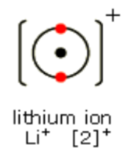
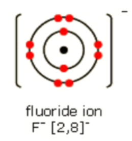

# Mark Schemes — Group 1 (Alkali Metals)
**2. Inorganic Chemistry** · Edexcel IGCSE Science (Double Award) (4SD0) — 17/Chemistry

## Q1 — medium — 9 marks · exam-questions

### 6((a)) — 1 marks
Sodium and potassium are in Group 1 of the Periodic Table because:

- The atoms of both elements have one electron in the outer shell; **[1 mark] ****Accept the highest energy level in place of the outer shell**

**[Total: 1 mark]**

- *The number of electrons in the outer shell is the same as the group number in the Periodic Table*

  - *If there is 1 electron in the outer shell, the element is in Group 1, as is the case with both sodium and potassium*

### 6((b)) — 5 marks
i) **Two** observations that you would make during this reaction are:

A description that makes reference to any **two** of the following points:

- Sodium floats / moves across the water; **[1 mark]**
- Sodium melts; **[1 mark] **
- Sodium disappears / gets smaller; **[1 mark] **
- Effervescence / fizzing / bubbles / gas given off; **[1 mark] **
- White trail; **[1 mark] **

ii) The final colour of the universal indicator is:

- (Final colour is) purple / blue; **[1 mark] **
- Because the solution is alkaline; **[1 mark] **

ii) The most likely pH value of the solution in the trough is:

- **D (12); [1 mark] **

**[Total: 5 marks] **

- *You should know the observations for when a Group 1 metal reacts with water*
- *The reaction becomes more violent down the group*

  - *This is a common demonstration and you may remember the metal floating and whizzing around the trough *

### 6((c)) — 1 marks
A Group 1 metal that is less reactive than sodium is:

- Lithium; **[1 mark]**

**[Total: 1 mark] **

- *The Group 1 metals become more reactive as you go down the group*
- *Therefore the only metal that is less reactive than sodium in Group 1 will be lithium *

### 6((d)) — 1 marks
The extra observation for potassium is:

- Catches fire;** [1 mark] ** 
*Accept lilac / purple / violet flame *

**[Total: 1 mark] **

- *The flame colour of potassium is a characteristic lilac colour *
- *The reaction of potassium and water is more exothermic than that of sodium or lithium*
- *Therefore there is enough heat to ignite the hydrogen gas given off*
- *This burns and, due to the potassium ions present, a lilac flame is seen *

### 6((e)) — 1 marks
The completed equation is:

- **2**(Rb + ) **2*****(***H2O →) **2**(RbOH + H2); **[1 mark]** *Accept multiples and fractions*

**[Total: 1 mark] **

- *This is an equation that you do not need to know, you just need to know the general equation for the reaction between Group 1 metals and water and oxygen*
- *If the Group 1 metal is M then*

  - *Reaction with **oxygen**:*
  
    - *2M + ½O**2** → M**2**O  OR*
    - *4**M + O**2** → **2**M**2**O *
  - *Reaction with **water**:*
  
    - *2**M + **2**H**2**O → **2**MOH + H**2*

## Q2 — medium — 1 marks · exam-questions

### 1() — 1 marks
**Correct answer: D** — Bubbles of hydrogen gas are produced

**Final answer:** **The correct answer is D.**

- When sodium reacts with water, hydrogen and sodium hydroxide are formed:

  - 2Na (s) + 2H2O (l) → 2NaOH (aq) + H2 (g)
- **A** is incorrect as sodium is less dense than water so it will float on the surface of water
- **B** is incorrect as it is potassium, not sodium, that burns with a lilac flame
- **C** is incorrect as sodium oxide is not produced in the reaction

## Q3 — medium — 15 marks · exam-questions

### 6((a)) — 7 marks
i) Three observations made when lithium reacts with water are:

Any **three** of the following:

- Effervescence / bubbles / fizzing; **[1 mark]**
- Moves;** [1 mark]**
- Floats; **[1 mark]** *Moves on the surface scores the marks for moving and floating*
- Disappears / dissolves / gets smaller; **[1 mark]**
- Vapour trail / steam produced; **[1 mark]**

ii) The colour of the universal indicator after it is added to the solution:

- Will turn blue / purple; **[1 mark]**
- (Because) OH– / hydroxide ions are present **OR **(Because) an alkaline solution / alkali is formed **OR **(Because) a solution of high pH is formed; **[1 mark]**

iii) The chemical equation for the reaction of lithium with water is:

2Li + 2H2O → 2LiOH + H2

- All formulae correct; **[1 mark]**
- Correct balancing; **[1 mark]**

**[Total: 5 marks]**

- *The most common observations for the reaction of any Group 1 / alkali metal are:*

  - *Fizzing *
  - *Moving *
  - *Disappearing / dissolving*
- *You need to know the equations for the reaction of Group 1 / alkali metals with water:*

  - *Metal + water → metal hydroxide + hydrogen*
  - *2M + 2H**2**O → 2MOH + H**2** (M is any Group 1 / alkali metal)*
  - *The equations show the formation of a metal hydroxide, which contains the alkaline hydroxide ion  / OH**–** *
  
    - *The hydroxide ion turns the universal indicator solution blue / purple*

### 6((b)) — 3 marks
i) The student needs to clean the platinum wire to:

- Remove any other ions / chemicals / impurities / contaminants / compounds / substances (that may be on the wire); **[1 mark]**
- (So that) they do not interfere with / affect / contaminate / mask the colour of the flame; **[1 mark]**

ii) The correct flame colour for a solid that contains sodium ions is:

- **D** / yellow; **[1 mark]**

**[Total: 3 marks]**

- *You need to know how to clean the platinum / nichrome wire loop that is used for flame tests as well as why this is necessary*
- *You should know the flame tests results for some specific metal ions:*

  - *Lithium ion = red*
  - *Sodium ion = yellow*
  - *Potassium ion = lilac*
  - *Calcium ion = orange*
  - *Copper(II) ion = green*

### 6((c)) — 5 marks
i) The formula of each ion in potassium sulfate is:

- otassium ion = K+ **AND** Sulfate ion = SO42–; **[1 mark]**

ii) Potassium sulfate has a high melting point because:

- It / potassium sulfate has a giant (ionic) structure / lattice; **[1 mark]**
- There is an electrostatic attraction between oppositely charged ions; **[1 mark]**
- Ionic bonds / forces are strong **OR **The forces / attraction between ions is strong; **[1 mark]**
- Which requires a large amount of energy to overcome these forces / break the bonds; **[1 mark]**

**[Total: 5 marks]**

- *Potassium is in Group 1 so will form 1+ ions / K**+** *
- *Since there are two potassium ions giving an overall 2+ charge to the compound, the sulfate ion must have a 2– charge to balance this out and give the overall neutral compound*

  - *So the sulfate ion is SO**4**2–*
- *If a chemical / substance has a high melting point, then it will require a large amount of energy to break bonds or overcome forces of attraction*

  - *Since potassium sulfate is ionic, this means that there are strong electrostatic forces of attraction between oppositely charged ions / particles - this is the definition of an ionic bond and scores two of the four available marks*
- *As part (ii) tells you to refer to structure and bonding, then you should talk about them both but treat them separately*

  - *Bonding - potassium sulfate undergoes strong ionic bonding (and include the explanation of what ionic bonding is)*
  - *Structure - potassium sulfate is a giant ionic lattice*

## Q4 — medium — 1 marks · exam-questions

### 1() — 1 marks
**Correct answer: B** — 2Li (s) + 2H2O (l)  →  2LiOH (aq) + H2 (g)

**Final answer:** **The correct answer is B.**

- When lithium, a solid, reacts with water, lithium hydroxide and hydrogen gas are produced
- The formula for lithium hydroxide is LiOH as lithium forms a 1+ ion and the hydroxide ion has a 1- charge
- Lithium hydroxide dissolves in water so is an aqueous solution
- The equation gives the same number of atoms of each element on both sides of the equation and is therefore balanced
- The equation is 2Li (s) + 2H2O (l)  →  2LiOH (aq) + H2 (g)

## Q5 — medium — 6 marks · exam-questions

### 2((a)) — 3 marks
The correct statements about the reaction of potassium with water are:

| **Statement** |   |
|---|---|
| potassium reacts more vigorously than sodium when added to water | ✔; **[1 mark]** |
| potassium sinks to the bottom of the water |   |
| bubbles of oxygen gas are produced |   |
| a lilac flame is seen | ✔; **[1 mark]** |
| potassium moves around | ✔; **[1 mark]** |
| a solution of potassium oxide is formed |   |

**[Total: 3 marks]**

- *Potassium is less dense than water so will float on the surface*
- *The Group 1 elements become more reactive as you go down the group, so potassium is more reactive than sodium*
- *In the reaction, potassium hydroxide and hydrogen are produced*
- *So much heat energy is released that it causes potassium to melt and it burns with a lilac coloured flame, and moves quickly across the surface of water*

### 2((b)) — 2 marks
i) A possible value for the pH of the solution is:

- Any value or range between 11 and 14; **[1 mark]**

ii) The formula of the ion responsible for this pH value is:

- OH-; **[1 mark]** *accept HO**-* *ignore any name*

**[Total: 2 marks]**

- *Potassium hydroxide is produced which forms an alkaline solution*
- *When universal indicator turned purple, the solution is around a value of 13 to 14*
- *Make sure you give the formula for the hydroxide ion as the question specifically asks for this*

### 2((c)) — 1 marks
The complete equation for the reaction of sodium burning in oxygen is:

The completed equation is:

4Na + O2 →2Na2O

- **4**Na
**AND**
**2**Na2O; **[1 mark]**

**[Total: 1 mark]**

- *Balance the oxygen atoms first; there are 2 on the left-hand side, so you need to put a 2 in front of Na**2**O to give 2 oxygen atoms on the right-hand side:*

  - *Na + O**2** →**2**Na**2**O*
- *Now there are 4 atoms of Na on the right-hand side, which can be balanced by putting a 4 in front of the Na on the left-hand side:*

  - *4**Na + O**2** →**2**Na**2**O*

## Q6 — medium — 1 marks · exam-questions

### 1() — 1 marks
**Correct answer: B** — It has a relatively high melting point

**Final answer:** **The correct answer is B.**

- Group 1 metals have the following physical properties

  - Low densities
  - Relatively low melting points
  - They are soft
  - They are very reactive

## Q7 — medium — 13 marks · exam-questions

### 9((a)) — 1 marks
Why these three elements are all stored in paraffin oil:

- To keep out of contact / prevent reaction with air / oxygen / water / moisture; **[1 mark]**

**[Total: 1 mark]**

- *You can say that the elements react with air, oxygen or water to get the mark*

### 9((b)) — 4 marks
i)   A similarity and a difference between the reactions of potassium with water and caesium with water:

- *Similarity: *both fizz / move on surface / produce flames; **[1 mark]**
- *Difference:* caesium is faster / more violent reaction; **[1 mark]**

ii)  The chemical equation for the reaction between caesium and water:

2Cs + 2H2O  → 2CsOH + H2

- All symbols/formulae correct; **[1 mark]**
- Correctly balanced; **[1 mark]**

**[Total: 4 marks]**

- *You can express your answer to part ii) in other ways; as they both:*

  - *melt, produce a gas, produce hydrogen and form an alkaline solution*
- *You can use reverse arguments and contrast how potassium is less reactive than caesium*
- *Fractions would also be acceptable in the equation, e.g. Cs + H**2**O  → CsOH + ½H**2*

### 9((c)) — 3 marks
i)  What could be added to the apparatus to improve the experiment:

- A lid / cover; **[1 mark]**

ii)  A change to the method that would improve the accuracy of the experiment is:

Any **one **of the following pairs:

Pair 1:

- You can stir the solution;** [1 mark]**
- To obtain a more accurate (maximum) temperature; **[1 mark]**

Pair 2:

- You can measure the temperature of sodium hydroxide; **[1 mark]**
- To check if it is different to / the same as the temperature of (hydrochloric) acid; **[1 mark]**

**[Total: 3 marks]**

- *You can also get credit for saying that stirring distributes the heat evenly throughout the solution*
- *You can mention that taking the temperature of both solutions allows you to obtain an average temperature of the mixture*

### 9((d)) — 5 marks
i)   The energy change, Q, in joules for this reaction is:

- Correct temperature change / Δ*T*; **[1 mark]**
- Correct substitution into Q = m x c x Δ*T*; **[1 mark]**
- Correct evaluation;** [1 mark]**

*Example calculation:*

- Δ*T* = (26.5 – 19.9) **OR** 6.6 - Q = 100 x 4.2 x 6.6 - Answer = 2800 (J)

ii)   The molar enthalpy change, Δ*H*, in kJ / mol for this reaction:

- Answer from (i) ÷ 0.05; **[1 mark]**
- Correct evaluation in kJ / mol with negative sign; **[1 mark]**

*Example calculation:*

- 2800 ÷ 0.05 **OR** 56000 (J) - Answer= - 56 (kJ / mol)

**[Total: 5 marks]**

- *You can have full marks for correct answers in both parts even without workings*
- *In part i) credit can be given for 2770 or 2772 to allow for less rounding*
- *You must have the correct sign for Δ**H** in order to get the mark*
- *Depending on rounding, your answer could be -55, -55.4 or -55.44 to get the mark*

## Q8 — medium — 1 marks · exam-questions

### 1() — 1 marks
**Correct answer: B** — Lithium is softer than potassium

**Final answer:** **The correct answer is B.**

- Group 1 metals are soft and easy to cut, getting softer as you move down the group
- Lithium is further up the group than potassium, therefore is harder to cut
- **A** is incorrect as melting point decreases as you move down the group, due to decreasing attractive forces between outer electrons and positive ions
- **C** is incorrect as Group 1 metals react with oxygen in the air forming metal oxides, which is why they tarnish when exposed to the air. The metals tarnish more rapidly as you go down the group
- **D** is incorrect as the reactivity of the Group 1 metals increases as you descend the group

## Q9 — medium — 1 marks · exam-questions

### 1() — 1 marks
**Correct answer: D** — 12

**The correct answer is D**.

- When potassium reacts with water it forms potassium hydroxide and hydrogen gas

  - Potassium hydroxide dissolves in water to form an alkaline solution
  - This solution will turn Universal indicator purple, showing it is strongly alkaline
  - A pH value of 12 is indicative of a strong alkali

## Q10 — medium — 7 marks · exam-questions

### 4((a)) — 3 marks
i) Two other observations for the reaction of sodium in water are:

Any **two **of the following:

- Sodium moves / floats (on the surface / water); **[1 mark]**
- Sodium turns into a ball / sphere **OR **Sodium melts; **[1 mark]**
- Effervescence / fizzing; **[1 mark]**
- Sodium gets smaller / disappears / dissolves; **[1 mark]**
- A white trail is seen; **[1 mark] ***References to a yellow flame are ignored*

ii) The final colour of the universal indicator will be:

- Blue / purple / violet / lilac; **[1 mark]**

**[Total: 3 marks]**

- *You need to know the expected observations for the reaction of a Group 1 metal with water *
- *You also need to be able to explain why they get more reactive as you move down the group*

### 4((b)) — 4 marks
i) One reason why lithium and sodium have similar reactions with water is:

- They have the same number of outer / valence electrons **OR **They both have one outer / valence electron; **[1 mark]**

ii) Lithium is less reactive than sodium because:

- Lithium has a smaller atomic radius / is smaller **OR **Lithium has less shells / energy levels / orbitals; **[1 mark]**
- So, the outer electron has a stronger / greater attraction to the nucleus **OR **So, the outer electron is closer to the nucleus; **[1 mark]**
- Which means that it less easily lost; **[1 mark] ***The reverse argument for sodium is accepted, i.e. sodium has more shells so the outer electron is held less tightly and more easily lost*

**[Total: 4 marks]**

- *Explaining the reactivity of groups 1 and 7 in terms of electrons and attraction is quit a common question so make sure you understand the explanation *

## Q11 — medium — 8 marks · exam-questions

### 4((a)) — 2 marks
Two other observations that can be made are:

Any **two** of the following observations:

- (Sodium) floats / moves on surface (of water); **[1 mark]**
- (Sodium) melts / forms a ball; **[1 mark]**
- (Sodium) gets smaller / disappears / dissolves; **[1 mark]**
- (Sodium) forms a white trail; **[1 mark] ***References to a yellow flame are ignored*

**[Total: 2 marks]**

- *Remember: **Sodium does not react with a flame*
- *The question also asks for observations so saying that the reaction heats up will not gain marks as it is not something you can see*
- *Even though hydrogen is produced there is no visible fizzing / effervescence, so that is why these are not allowed as observations*

### 4((b)) — 6 marks
i) The balanced equation for the reaction of lithium and fluorine is:

2Li + F2 → 2LiF

- Correct species and balancing, multiples allowed;** [1 mark]**

ii) A test to show that lithium fluoride contains lithium ions is:

- (Perform a) flame test; **[1 mark]**
- (Flame is) (crimson / scarlet) red; **[1 mark]**

iii) The dot-and-cross diagrams showing the electron arrangements for the lithium and fluoride ions are:

- Correct electron arrangement of lithium ion;** [1 mark]**

- Correct electron arrangement of fluoride ion (including the inner shell); **[1 mark]**
- Correct charges on both ions (with or without brackets);** [1 mark]**

**[Total: 6 marks]**

- *You are expected to know the formula of:*

  - *Metals - represented by the unit formula of one atom*
  - *Halogens - which are all diatomic molecules*
- *The reactions between Group 1 metals (M) and the Group 7 halogens (X) follow the same equation pattern regardless of which metal or halogen is used:*

  - *2M + X**2** → 2MX*
- *The question asks for the electronic configuration, so unless you are told otherwise assume that this means the full electronic configuration, including full inner shells*

  - *When this is required the examiners will ask you to draw small atoms or ions to minimise the time needed*
  - *You are allowed to use dots or crosses unless the exam question tells you what to use*

## Q12 — hard — 13 marks · exam-questions

### 5((a)) — 3 marks
i) Two other observations made when lithium is added to water are:

Any **two** from:

- (Lithium) moves (on the surface); **[1 mark]**
- (Lithium) gets smaller / disappears; **[1 mark]**
- Colourless solution forms; **[1 mark]**

ii) The test for hydrogen gas is:

- (When mixed with air) lit splint or flame gives (squeaky) pop; **[1 mark]**

**[Total: 3 marks]**

- *You should be able to give observations for lithium, sodium and potassium being added to water *
- *It gets smaller as it is reacting with the water to form a colourless solution*
- *With indicator, this solution would turn purple as an alkaline solution e.g. lithium hydroxide is formed *
- *Don't get the test for hydrogen confused with that of oxygen, which uses a glowing splint that relights*

### 5((b)) — 4 marks
i) One observation that would be different if potassium is used instead of lithium is:

Any **one **from:

- More rapid bubbles / fizzing / effervescence;** [1 mark]**
- Turns into a ball; ** [1 mark]**
- Moves more quickly; ** [1 mark]**
- Catches alight / burns / produces a flame. ** [1 mark]** ***IGNORE**** flame colour* ***ALLOW ****potassium melts* ***ALLOW**** potassium gets smaller more quickly*

ii) Potassium is more reactive than lithium because:

- Potassium has more shells than lithium; ** [1 mark]** ***ALLOW ****potassium atom is bigger than lithium* ***ALLOW ****outer shell / electron is further  from nucleus*
- (Therefore) there is less attraction between the outer shell/electron and the nucleus; ** [1 mark]** ***ALLOW**** more repulsion (from inner shells) or more shielding (from the nuclear attraction)* ***ALLOW**** nuclear pull for the outer shell / electron is weaker*
- So the electron in the outer shell is more easily lost; ** [1 mark]** ***ACCEPT**** answers in terms of lithium for M1, M2 and M3*

**[Total: 4 marks]**

- *Potassium is further down Group 1, so has a more vigorous reaction than lithium*
- *Make sure your answer is comparative, for example, it moves **more **quickly, not just it moves *
- *Group 1 reactivity is determined by how easily the element loses its outer electron to form a positive ion *
- *The further away the negative outer electron is from the positive nucleus, the weaker the attraction is and the more easily the electron is loset*
- *This is a common explanation you will be asked about, so make sure you learn the three points*

### 5((c)) — 6 marks
i) The volume, in cm3, of hydrogen gas produced at rtp is:

- Moles of Li= $\frac{0.500}{7}$ **OR** 0.0714; **[1 mark]**
- Moles of H2=$\frac{0.0714}{2}$ **OR** 0.0357; **[1 mark]** *Allow ecf from M1*
- Volume of H2 (= 0.0357 x 24000) = 857 (cm3); **[1 mark]**

ii) The concentration, in mol/dm3, of the lithium hydroxide solution is:

- Moles of H2SO4= 0.02485 x 0.1 **OR** 0.002485; **[1 mark]**
- Moles of LiOH = 2 x 0.002485 **OR **0.00497; **[1 mark]**
- Concentration of LiOH = 0.0331 (mol/dm3); **[1 mark]**

**[Total: 6 marks]**

- *To calculate the volume of gas *

  - *Find the number of moles of lithium using *$\frac{\mathrm{mass}}{\mathrm{molar} \mathrm{mass}}$
  - *The molar ratio of lithium to hydrogen gas is 2:1 so divide the number of moles of lithium by 2*
  - *Multiply the number of moles of hydrogen by 24 000 to find the volume it occupies *
  - *Make sure your answer is to three significant figures!*
- *To calculate the concentration of lithium hydroxide*

  - *You are able to calculate the moles of sulfuric acid using concentration x volume (making sure you have converted volume from cm**3** to dm**3**) so 0.02485 x 0.1 = 0.002485 mol*
  - *The equation tells you that the molar ratio of lithium hydroxide to sulfuric acid is 2:1 so you need to multiple the moles of sulfuric acid by 2 to give 0.00497 mol*
  - *Concentration can be found by using *$\frac{\mathrm{number} \mathrm{of} \mathrm{moles}}{\mathrm{volume}}$* so *$\frac{0.00497}{0.150}$*=  0.0331 mol / dm**3*
