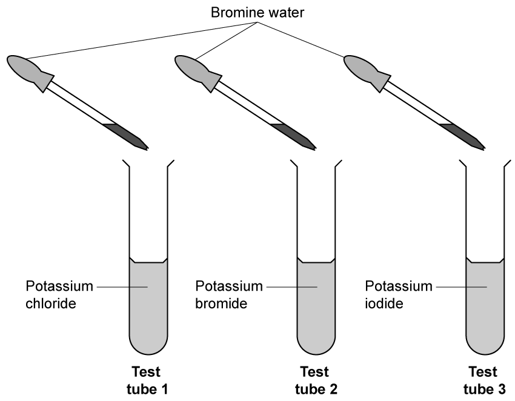

# Exam Questions — Group 7 (Halogens)
**2. Inorganic Chemistry** · Edexcel IGCSE Science (Double Award) (4SD0) — 17/Chemistry
> Source: [https://www.savemyexams.com/igcse/science/edexcel/double-award/17/chemistry/topic-questions/inorganic-chemistry/group-7-halogens/exam-questions/](https://www.savemyexams.com/igcse/science/edexcel/double-award/17/chemistry/topic-questions/inorganic-chemistry/group-7-halogens/exam-questions/) · 11 questions · total 59 marks

## Q1 — easy — 7 marks · exam-questions

### 3((a)) — 1 mark — command: predict — structured — from paper 2017 · Specimen2C
Astatine, bromine, chlorine, fluorine and iodine are all halogens. They are found in Group 7 of the Periodic Table.

Predict which halogen has the lightest colour.

### 3((b)) — 1 mark — command: name — structured — from paper 2017 · Specimen2C
Name a halogen that is a solid at room temperature.

### 3((c)) — 3 marks — command: multiple — structured — from paper 2017 · Specimen2C
Bromine can be obtained from the bromide ions in sea water. Chlorine is bubbled into sea water. The chlorine oxidises the bromide ions to bromine atoms. The bromine atoms then form bromine molecules.

i) Complete the equation to show how bromine **atoms** are formed from bromide ions.

Cl2 + ..................... Br− → 2Cl− + ..................... Br

(1)

ii) State why this reaction is described as the oxidation of bromide ions.

(1)

iii) Write an equation to show how bromine atoms form bromine molecules.

(1)

### 3((d)) — 2 marks — command: draw — structured — from paper 2017 · Specimen2C
Boron and fluorine form a covalent compound that has the molecular formula BF3

Draw a dot-and-cross diagram to show the arrangement of the outer electrons in a molecule of BF3

Use crosses (×) to represent the outer electrons of boron. Use dots (•) to represent the outer electrons of fluorine.

(2)

## Q2 — medium — 13 marks · exam-questions

### 7((a)) — 3 marks — command: which — structured — from paper 2013 · Ja1C
This question is about some of the halogens and their compounds.

i) Which element is a liquid at room temperature?

(1)

| **A** | astatine |
|---|---|
| **B** | bromine |
| **C** | chlorine |
| **D** | iodine |

ii) Which element has the palest colour?

(1)

| **A** | astatine |
|---|---|
| **B** | bromine |
| **C** | chlorine |
| **D** | iodine |

iii) Which element is the least reactive?

(1)

| **A** | astatine |
|---|---|
| **B** | bromine |
| **C** | chlorine |
| **D** | iodine |

### 7((b)) — 4 marks — command: multiple — structured — from paper 2013 · Ja1C
A teacher uses displacement reactions to demonstrate the reactivities of some halogens. She adds solutions of chlorine, bromine and iodine separately to three different sodium halide solutions. The table shows some of the teacher’s results.

|   | **sodium chloride** | **sodium  bromide** | **sodium  iodide** |
|---|---|---|---|
| ** chlorine solution** | not done | solution turns orange |   |
| ** bromine solution** | solution stays orange | not done | solution turns brown |
| ** iodine solution** |   | solution stays brown | not done |

A change in colour of the solution indicates that a reaction has occurred.

i) Complete the table by predicting the missing results.

(2)

ii) State why the teacher does not add bromine solution to sodium bromide solution.

(1)

iii) The word equation for the reaction of bromine with sodium iodide is

bromine + sodium iodide → iodine + sodium bromide

Write a chemical equation for this reaction.

(1)

### 7((c)) — 6 marks — command: describe — structured — from paper 2020 · Ja1C
A technician sees an unlabelled bottle containing a liquid. He knows that the liquid is a solution of one of these compounds.

- copper(II) chloride
- copper(II) bromide
- iron(II) chloride
- iron(II) bromide

Describe chemical tests that the technician could use to identify the compound in the solution.

## Q3 — medium — 1 marks · exam-questions

### 1() — 1 mark — multiple_choice
Which element in Group 7 is a solid at room temperature?
- **A.** fluorine
- **B.** chlorine
- **C.** bromine
- **D.** iodine

## Q4 — medium — 12 marks · exam-questions

### 8((a)) — 2 marks — command: predict — structured — from paper 2021 · Ja1C
This question is about the halogens.

The table gives some information about the halogens. Complete the table by predicting the physical state of astatine at room temperature and the colour of astatine.

| **Halogen** | **Physical state at room temperature** | **Colour** |
|---|---|---|
| fluorine | gas | yellow |
| chlorine | gas | pale green |
| bromine | liquid | red-brown |
| iodine | solid | grey |
| astatine |   |   |

### 8((b)) — 4 marks — command: multiple — structured — from paper 2021 · Ja1C
Bromine has two isotopes with mass numbers 79 and 81

i) The relative percentages of each isotope in a sample of bromine are

bromine-79 = 51.0%                   bromine-81 = 49.0%

Calculate the relative atomic mass of this sample of bromine. Give your answer to one decimal place.

(3)

relative atomic mass = ..............................................................

ii) Give a reason why both isotopes of bromine have the same chemical properties.

(1)

### 8((c)) — 6 marks — command: multiple — structured — from paper 2021 · Ja1C
A student investigates the reactivity of some halogens. She uses these solutions of halogens and their halides.

- bromine, chlorine and iodine
- sodium bromide, sodium chloride and sodium iodide

She adds each halogen solution to each halide solution. The table shows her results.

|   | **Sodium bromide** | **Sodium chloride** | **Sodium iodide** |
|---|---|---|---|
| ** Bromine** | no reaction | no reaction | reaction occurs |
| ** Chlorine** | reaction occurs | no reaction | reaction occurs |
| ** Iodine** | no reaction | no reaction | no reaction |

i) Explain how these results show the order of reactivity of bromine, chlorine and iodine.

(3)

ii) Suggest why the student does not need to add bromine solution to sodium bromide solution.

(1)

iii) The ionic equation for the reaction between bromine and sodium iodide is

Br2 (aq) + 2I− (aq) → I2 (aq) + 2Br− (aq)

Explain why this is a redox reaction.

(2)

## Q5 — medium — 1 marks · exam-questions

### 1() — 1 mark — multiple_choice
This table gives information about some of the halogens.

| **Halogen** | **Physical state at room temperature** | **Colour** |
|---|---|---|
| fluorine | gas |   |
| chlorine |   | pale green |
| bromine | liquid | red-brown |

What is the correct missing physical state and colour?
- **A.** Physical state at room temperature: gasColour: colourless
- **B.** Physical state at room temperature: liquid Colour: colourless
- **C.** Physical state at room temperature: gasColour: pale yellow
- **D.** Physical state at room temperature: liquidColour: pale yellow

## Q6 — medium — 9 marks · exam-questions

### 3((a)) — 1 mark — command: deduce — structured — from paper 2020 · Ja1CR
The Group 7 elements are called halogens. Halogens form compounds called halides. Three of the halogens are represented by the formulae X2 , Y2 and Z2 Solutions of these halogens are added separately to solutions of sodium halides, NaX, NaY and NaZ. The table shows whether or not a reaction occurs.

|   | **X****2** | **Y****2** | **Z****2** |
|---|---|---|---|
| **NaX** | no | yes | yes |
| **NaY** | no | no | yes |
| **NaZ** | no | no | no |

Use the information in the table to deduce the order of reactivity of the halogens X2 , Y2 and Z2

 most reactive ...................................           ....................................

least reactive ....................................

### 3((b)) — 1 mark — command: deduce — structured — from paper 2020 · Ja1CR
An aqueous solution of halogen Y2 is orange. This solution is decolourised when it reacts with an alkene. Deduce the identity of halogen Y2.

### 3((c)) — 4 marks — command: multiple — structured — from paper 2020 · Ja1CR
The table shows some physical properties of the halogens.

i) Complete the table by predicting a boiling point for chlorine, the state of fluorine at room temperature and the colour of astatine.

| **Halogen** | **Boiling point in °C** | **State at room temperature** | **Colour** |
|---|---|---|---|
| fluorine | -188 |   | yellow |
| chlorine |   | gas | green |
| bromine | 59 | liquid | red-brown |
| iodine | sublimes | solid | grey |
| astatine | 337 | solid |   |

(3)

ii) Why do the halogens have similar chemical properties?

(1)

| **A** | they are non-metals |
|---|---|
| **B** | they are molecules |
| **C** | they have the same number of outer shell electrons |
| **D** | they are in the same period of the Periodic Table |

### 3((d)) — 3 marks — command: multiple — structured — from paper 2020 · Ja1CR
A teacher uses this apparatus to demonstrate the reaction between chlorine gas and iron wool. The teacher does the reaction in a fume cupboard.

i) Suggest why the teacher does the reaction in a fume cupboard.

(1)

ii) The product of the reaction between iron and chlorine is iron(III) chloride. The ions in iron(III) chloride are Fe3+ and Cl−.

Use this information to give the chemical equation for this reaction.

(2)

## Q7 — medium — 1 marks · exam-questions

### 1() — 1 mark — multiple_choice
Astatine is found below iodine in Group 7 of the Periodic Table.

What is its formula and state at room temperature?
- **A.** Formula: AtState at room temperature: gas
- **B.** Formula: AtState at room temperature: solid
- **C.** Formula: At2State at room temperature: liquid
- **D.** Formula: At2State at room temperature: solid

## Q8 — medium — 1 marks · exam-questions

### 1() — 1 mark — multiple_choice
The reaction between aqueous chlorine and aqueous potassium bromide results in the formation of an orange solution.

Which is the correct statement about this reaction?
- **A.** Bromine is more reactive than chlorine
- **B.** Potassium chloride is responsible for the orange colour
- **C.** Chlorine displaces bromine from potassium bromide
- **D.** Bromide ions gain electrons from chlorine

## Q9 — medium — 4 marks · exam-questions

### 2((a)) — 3 marks — command: multiple — structured — from paper 2021 · Jan2CR
This question is about elements in Group 7 and their compounds.

The table gives information about some of these elements.

| **Element** | **Symbol** | **Melting point** | **Boiling point** **in °C** | **Colour at room** **temperature (20 °C)** |
|---|---|---|---|---|
| fluorine | F | –220 | –188 |   |
| chlorine | Cl | –101 | –35 | pale green |
| bromine | Br | –7 | 59 | red-brown |
| iodine | I | 114 | 184 | grey |

i) Predict the colour of fluorine at room temperature.

(1)

ii) How many of the elements in the table are liquids at room temperature (20 °C)?

(1)

| **A** | 0 |
|---|---|
| **B** | 1 |
| **C** | 2 |
| **D** | 3 |

iii) The element astatine is below iodine in Group 7. Predict the formula of a molecule of astatine.

(1)

### 2((c)) — 1 mark — multiple_choice — from paper 2021 · Jan2CR
Elements in Group 7 react with elements in Group 1 to form ionic compounds.

Which pair of ions both have the electronic configuration 2.8.8?
- **A.** Li+ and Cl
- **B.** K+ and F–
- **C.** Li+ and F–
- **D.** K+ and Cl–

## Q10 — medium — 1 marks · exam-questions

### 1() — 1 mark — multiple_choice
Bromine water is an aqueous solution of bromine which is orange in colour.

What would be seen if bromine water was added to the test tubes in the diagram?

|   | ** ** | **Test tube 1** | **Test tube 2** | **Test tube 3** |
|---|---|---|---|---|
| ☐ | **A** | solution stays orange | solution turns brown | solution turns brown |
| ☐ | **B** | solution turns pale green | solution stays orange | solution turns colourless |
| ☐ | **C** | solution stays orange | solution stays orange | solution turns brown |
| ☐ | **D** | solution turns colourless | solution turns colourless | solution turns brown |
- **A.** 
- **B.** 
- **C.** 
- **D.** 

## Q11 — medium — 9 marks · exam-questions

### 2((a)) — 2 marks — command: complete — structured — from paper 2019 · Ju2C
The table gives some information about the halogens, chlorine, bromine and iodine.

| **Halogen** | **Physical state at room temperature ** | **Colour** |
|---|---|---|
| chlorine | gas | pale green |
| bromine |   | red-brown |
| iodine | solid |   |

Complete the table.

### 2((b)) — 3 marks — command: calculate — structured — from paper 2019 · Ju2C
Chlorine has two isotopes of mass numbers 35 and 37. The relative percentage of each isotope in a sample of chlorine is

chlorine-35 77.78%    chlorine-37 22.22%

Calculate the relative atomic mass of this sample of chlorine. Give your answer to one decimal place.

Relative atomic mass = .........................

### 2((c)) — 4 marks — command: explain — structured — from paper 2019 · Ju2C
A student is given an aqueous solution of chlorine and an aqueous solution of potassium bromide.

Explain how he can use these two solutions to compare the reactivity of chlorine with the reactivity of bromine.
