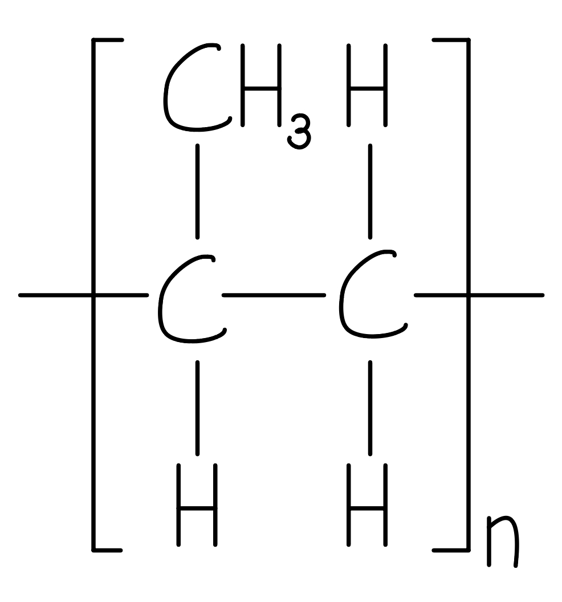
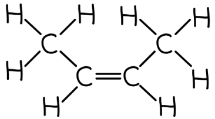
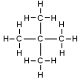

# Mark Schemes — Alkanes
**4. Organic Chemistry** · Edexcel IGCSE Science (Double Award) (4SD0) — 17/Chemistry

## Q1 — medium — 1 marks · exam-questions

### 1() — 1 marks
**Correct answer: C** — C10H22

**Final answer:** **The correct answer is C.**

- The general formula for alkanes is CnH2n+2
- The number of carbon atoms is doubled and then two added to obtain the number of hydrogen atoms
- C10H22 follows this formula

## Q2 — medium — 14 marks · exam-questions

### 6((a)) — 6 marks
i) Compound B belongs to:

- The alkanes; **[1 mark]**
- (Because) it has the general formula CnH2n+2; **[1 mark]**

ii) The compound that has the same empirical formula as its molecular formula is:

- D; **[1 mark]**

iii) Isomers are:

- (Compounds with the same molecular formula but) <u>different structural / displayed formulae</u>;** [1 mark]**

Two isomers of F are:

- **OR **CH3CH2CH2CH3; **[1 mark]**
- **OR **CH3CHCH3CH3; **[1 mark]**

**[Total: 3 marks]**

- *Homologous series and isomers are two common pieces of knowledge when talking about the alkanes, even at A-level*

  - *You should know what these mean as well as the general formulae of the alkanes (C**n**H**2n+2**) and the alkenes (C**n**H**2n**) *
- *Since you are not given any structures, you can start with the simplest isomer which will be all four carbons in a chain*

  - *Careful: **Don't forget to draw ALL of the hydrogen atoms on - you can check that you have added enough using the C**4**H**10** formula*
- *The next step is to start with the basic chain of four carbons and "snap" one carbon off*

  - *Work out where else can you put it to make a different structure*
  - *The only place is on the second carbon*
  - *Then you add all the hydrogen atoms on again, making sure your final answer matches the C**4**H**10** formula*

### 6((b)) — 4 marks
Compound D can be obtained from crude oil using the industrial process of fractional distillation by:

- Heating / boiling / vapourising crude oil; **[1 mark]**
- Letting the vapours pass into a (fractionating) column / tower;** [1 mark]**
- Fractions / compounds / molecules / hydrocarbons separate because they have different boiling points; **[1 mark]**
- Compound D will collect at top of the (fractionating) column / tower 
**OR **
Compound D will be in the refinery gas fraction; **[1 mark]** 
*Marks can be awarded to a suitably labelled diagram *
*A maximum of 3 marks can be awarded if a laboratory process is described, not an industrial one *
*Only 1 mark can be awarded if cracking is mentioned*

**[Total: 4 marks]**

- *The process of fractional distillation is a common extended response question, so make sure that you are able to describe it fully*
- *Tip: **As the mark scheme says, you can score marks from labelled diagrams so draw one to help focus your answer, as well as use bullet points rather than prose*

### 6((c)) — 4 marks
i) The type of polymer formed from compound C is:

- Addition; **[1 mark]** *Additional is not accepted*

ii) The polymer formed from compound C is:

- Poly(propene) / polypropylene / polypropene; **[1 mark]**

iii) The structure of this polymer is:

- Correct repeat unit (inside the brackets); **[1 mark]**
- Brackets 
**AND **
n outside the brackets on the right 
**AND **
Extension / continuation bonds; **[1 mark]** 
*The second mark is dependent on the first mark being awarded*

**[Total: 4 marks]**

- *Compound C is an alkene*

  - *Alkenes undergo addition polymerisation*
- *Compound C contains 3 carbons in its chain and is, therefore, propene*
- *To name polymers*

  - *Add the word poly in front of the monomer's name*
  - *Propene → polypropene / (poly)propene*
- * To draw polymers:*

  - *Draw the monomer (alkene) in pencil*
  - *Replace the double bond between the carbons with a single bond*
  - *Add brackets around the whole molecule *
  - *Add a small letter n after the brackets, at the bottom, on the right*
  - *Add one bond from the left-hand central carbon sticking out through the bracket on the left*
  - *Add one bond from the left-hand central carbon sticking out through the bracket on the right*

## Q3 — medium — 1 marks · exam-questions

### 1() — 1 marks
**Correct answer: D** — R and T

**Final answer:** **The correct answer is D.**

- Alkanes are saturated hydrocarbons

  - This means they contain only hydrogen and carbon atoms only, joined together with single bonds
- Compound P - contains C, H and only single bonds

  - This is an alkane
- Compound Q - contains C, H and only single bonds

  - This is an alkane
- Compound R - contains C, H but has a double bond

  - This is not an alkane, it is an alkene
- Compound S - contains C, H and only single bonds

  - This is an alkane
- Compound T - contains C, H and Br

  - This is not alkane, it is a haloalkane
- Compound U - contains C, H but has a double bond

  - This is not an alkane, it is an alkene
- The compounds that are not alkanes are compounds R, T and U

  - The only answer option that contains two non-alkane compounds is option D (R and T)

## Q4 — medium — 15 marks · exam-questions

### 5((a)) — 6 marks
i) The completed boxes with the missing information about the alkane with the molecular formula C2H6 is:

| **molecular formula** | C2H6 |
|---|---|
| **name** | Ethane;** [1 mark]** |
| **empirical formula** | CH3; **[1 mark]** |
| **displayed formula** |   ; **[1 mark]** |

ii) The chemical equation for the complete combustion of the alkane C2H6 is:

- 2C2H6 + 7O2 → 4CO2 + 6H2O; **[1 mark]**

iii) The names of two products of incomplete combustion are:

Any **two** of the following:

- Carbon monoxide / CO; **[1 mark]**
- Carbon / C / soot; **[1 mark]**
- Water / H2O; **[1 mark]**

**[Total: 6 marks]**

- *To name the hydrocarbon:*

  - *C**2**H**6** has two carbons which means that its name starts with eth-*
  - *It fits the general formula of alkanes, C**n**H**2n+2**, so its name ends with -ane*
  - *Combining these, you get ethane*
- *The empirical formula is the simplest whole number ratio of atoms, which for C**2**H**6** is CH**3*
- *Remember: **Displayed formulae should show all bonds and atoms*

  - *A common mistake for this would be to draw H**3**C-CH**3*
- *You should practice balancing equations as these often come up in questions, especially combustion equations*
- *This means that you would also benefit from knowing the products of complete and incomplete combustion*

  - *Complete combustion = carbon dioxide and water*
  - *Incomplete combustion = carbon monoxide / carbon and water*
  
    - *Although limited for incomplete combustion, the amount of available oxygen will determine whether carbon monoxide or carbon is formed*

### 5((b)) — 4 marks
i) This reaction is:

- A / addition;** [1 mark]**

ii) The displayed formulae for two different alkenes with the molecular formula C4H8 are:

Any **two **of the following:

|   **[1 mark]** |   **[1 mark]** |   **[1 mark]** |   **[1 mark]** |
|---|---|---|---|

iii) The term used for compounds with the same molecular formula but different structural formulae is:

- Isomers / isomerism; **[1 mark]**

**[Total: 4 marks]**

- *C**4**H**8** is the chemical formula of the alkene butene*
- *Bromine will react across the carbon-to-carbon double bond / C=C in an addition reaction to form 1,2-dibromoethane*
- *You should know the definition of an isomer*

  - *Chemicals with the same molecular formula but a different structure / arrangement of atoms*
- *The easiest way to draw two possible isomers of butene is:*

  - *Draw the four carbons in a chain*
  - *Place the carbon-to-carbon double bond first*
  
    - *It can go between carbons 1 and 2 or between carbons 2 and 3*
    - *Placing it between carbons 3 and 4 is the mirror image of carbons 1 and 2*
  - *Add the remaining single bonds to ensure that each carbon has four bonds*
  - *Then, add the eight hydrogen atoms to complete the structures*

### 55((c)) — 5 marks
i) The product of this polymerisation reaction is:

- Correct repeat unit; **[1 mark]** *If the bond between the carbons is a double bond / C=C then no marks can be scored for this question*
- Continuation / extension bonds 
**AND**
** **Brackets 
**AND **
n after the brackets; **[1 mark]**

ii) The environmental problems caused by these two methods of disposal are:

- Polymers / polypropylene will remain in landfill indefinitely;** [1 mark]**
- (Because) they are unreactive / inert / non-biodegradable; **[1 mark]**
- Burning produces toxic / greenhouse gases; **[1 mark] **

**[Total: 5 marks]**

- *To draw polymers:*

  - *Draw the monomer in pencil*
  - *Add brackets around the monomer*
  - *Add an n after the brackets*
  - *Replace the double bond / C=C with a single bond / C-C*
  - *Add continuation / extension bonds coming out of the brackets*
- *You should be aware of the environmental issues of polymer / plastic disposal*

  - *If this polymer contained chlorine, then the third mark would be specifically for toxic gases*

## Q5 — medium — 1 marks · exam-questions

### 1() — 1 marks
**Correct answer: A** — Substitution

**Final answer:** **The correct answer is A.**

- This type of reaction is Substitution
- Alkanes react with halogens in substitution reactions
- A substitution reaction is one where one atom is replaced by another
- In this case, the hydrogen atom is replaced by a bromine atom

## Q6 — medium — 1 marks · exam-questions

### 1() — 1 marks
**Correct answer: C** — Ultraviolet radiation

**Final answer:** **The correct answer is C.**

- This reaction occurs in the presence of Ultraviolet radiation
- You should know that the substitution reaction between an alkane and a halogen takes place in the presence of ultraviolet radiation

## Q7 — medium — 1 marks · exam-questions

### 1() — 1 marks
**Correct answer: D** — C4H10

**Final answer:** **The correct answer is D.**

- The correct formula of butane is C4H10
- The names of organic compounds have two parts: the prefix or stem and the end part (or suffix)
- The prefix tells you how many carbon atoms are present in the longest continuous chain in the compound
- But- indicates that four carbon atoms are present
- Alkanes have the general formula CnH2n+2
- C4H10 is therefore the formula of butane

## Q8 — hard — 7 marks · exam-questions

### 10((a)) — 4 marks
i) Isomers are:

- (Compounds / molecules) with the same molecular formula 
**OR **
(Compounds / molecules) with the same number 
**AND**
** **type of atoms; **[1 mark]** 
*Use of the word element instead of compound / molecule loses a maximum of 1 mark*
- With different structural / displayed formula 
**OR **
With different structures 
**OR **
With a different arrangement of atoms (in space); **[1 mark] ** *One mark is lost if there is a contradiction in the answer, e.g. same displayed formula but different structures*

ii) The displayed formula for another isomer of C5H12 is:

**OR**

- Correct carbon skeleton; **[1 mark]**
- <u>ALL</u> hydrogen atoms shown 
**AND** 
<u>ALL</u> bonds shown; **[1 mark] **

**[Total: 4 marks]**

- *The easiest way to draw isomers is:*

  - *Draw only the carbons *
  - *Break one carbon off the main chain and place it somewhere else on the main chain*
  - *Add all the hydrogens*

### 10((b)) — 3 marks
i) The complete equation for this reaction is:

C5H12 + Br2 → C5H11Br + HBr

- C5H11Br; **[1 mark]** *All subscripts must be correct*
- HBr; **[1 mark] ***C**5**H**12** + Br**2** → C**5**H**10**Br**2** + H**2** scores one mark*

ii) This type of reaction is:

- Substitution; **[1 mark]**

**[Total: 3 marks]**

- *This reaction is (free radical) substitution*
- *In this reaction, one hydrogen on the alkane is replaced / substituted by a bromine*
- *This leaves a hydrogen and a bromine, which react / combine to form HBr*
