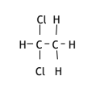
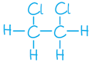
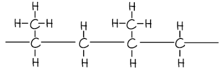

# Mark Schemes — Alkenes
**4. Organic Chemistry** · Edexcel IGCSE Science (Double Award) (4SD0) — 17/Chemistry

## Q1 — easy — 4 marks · exam-questions

### 1((a)) — 3 marks
i) The term hydrocarbon means:

- A compound / substance / molecule / chemical that contains hydrogen/ H and carbon /C; **[1 mark]**
- Only; **[1 mark] ***The second mark is dependent on the mention of carbon and hydrogen*

ii) Ethene is described as unsaturated because:

- It has a carbon-to-carbon double bond / C=C; **[1 mark]**

**[Total: 3 marks]**

- *These are fundamental definitions of Organic Chemistry, so make sure that you know them as well as saturated (contains only single bonds)*

### 1((b)) — 1 marks
**Correct answer: A** — colourless

**Final answer:** **The correct answer is A.**

- The appearance of the solution formed when ethene is bubbled through bromine water is Colourless
- When bromine water is bubbled through an alkene, the bromine adds across the carbon-to-carbon double bond / C=C and consequently removed from the bromine water which leaves colourless water

## Q2 — medium — 1 marks · exam-questions

### 1() — 1 marks
**Correct answer: C** — C5H10

**Final answer:** **The correct answer is C.**

- The alkene is C5H10
- The general formula of an alkene is CnH2n
- The formula for 5 carbons: C5H10 
- **A** is incorrect as this molecule has a general formula CnH2n-2
- **B** &** D** are incorrect as these molecules have a general formula for an alkane / CnH2n+2

## Q3 — medium — 14 marks · exam-questions

### 3((a)) — 4 marks
The completed table is:

- **1 mark** for each correct answer

**[Total: 4 marks] **

- *An acceptable answer for the name of the alkene is propylene*

### 3((b)) — 3 marks
i) The term unsaturated means:

- (Contains a carbon carbon) double bond; **[1 mark] **

ii) A test to show that a compound is unsaturated is:

- Add bromine water; **[1 mark] **
- Decolourises / changes to colourless; **[1 mark] **

**[Total: 3 marks] **

- *You will gain the mark for turns 'colourless', but the word 'clear' should not be used*
- *Many students make this mistake - colourless means the absence of colour *

### 3((c)) — 3 marks
i) The equation between methane and chlorine is:

- CH4 + Cl2 → CH3Cl + HCl; **[1 mark] **

ii) The correct choice is:

- D / substitution;** [1 mark] **

iii) The required conditions are:

- Ultraviolet radiation / light;** [1 mark] **

**[Total: 3 marks] **

- *D is the correct choice in part ii) as substitution involves the 'swapping' of an atom for another*

  - *CH**4** + Cl-**Cl **→ CH**3**Cl + **H**-Cl*
  - *Here, a hydrogen atom bonded to a carbon atom has been swapped for a chlorine atom *
- *A is incorrect as it is not an addition reaction*
- *B is incorrect as it is not a decomposition reaction*
- *C is incorrect as it is not a neutralisation reaction*
- *The reaction of an alkane and chlorine will only occur if ultraviolet radiation is present*

### 3((d)) — 4 marks
i) Isomers are:

- (Isomers have) the same molecular formula; **[1 mark] **
- (But) different structural / displayed formulae; **[1 mark] **

ii) The isomers are:

| **Isomer 1** | **Isomer 2** |
|---|---|
|  |  |

- Each correct structure scores **1 mark **

**[Total: 4 marks] **

- *You should be able to draw isomers of small organic compounds such as dichloroethane *
- *Remember**: You need to break the bonds and then redraw them in a different place*
- *Notice that the chlorine atoms are bonded to either the same carbon atom or different carbon atoms*

## Q4 — medium — 1 marks · exam-questions

### 1() — 1 marks
**Correct answer: D** — C4H8

**Final answer:** **The correct answer is D.**

- The compound that would cause decolourise the bromine solution is C4H8
- Bromine water is decolourised when shaken with an unsaturated compound

  - Alkenes are unsaturated compounds (i.e. contain the functional group C=C)
  - Alkenes have the general formula CnH2n
  - Compound **D** follows this general formula and is the alkene, butene
- **A** is incorrect as this is the formula of the alkane, propane. Alkanes are saturated compounds and do not decolourise bromine water
- **B** is incorrect as this is an alkane as it fits the general formula CnH2n+2. Alkanes are saturated compounds and do not decolourise bromine water
- **C** is incorrect as this is neither an alkane or an alkene as it has too many hydrogen atoms for the number of carbon atoms

## Q5 — medium — 13 marks · exam-questions

### 6((a)) — 1 marks
The relative formula mass (*M*r) of ocimene is:

- 136; **[1 mark]**

**[Total: 1 mark]**

- *The molecular formula of ocimene is C**10**H**16** *
- *Therefore, the relative formula mass is (12 x 10) + (1 x 16) = 136*

### 6((b)) — 2 marks
An empirical formula is:

- The simplest (whole number) ratio of atoms / elements present (in a compound);** [1 mark]**
- The empirical formula (of ocimene / C10H16) is C5H8  **OR **The C : H ratio of ocimene is 5 : 8; **[1 mark]**

**[Total: 2 marks]**

- *Empirical formula questions are quite common*
- *Although they tend to lean towards calculating the empirical formula using given data, you could just as easily be asked for the definition and an application such as this question*

### 6((c)) — 3 marks
Ocimene is described as an unsaturated hydrocarbon because:

Unsaturated:

- It contains (carbon to carbon) double bonds; **[1 mark]**

Hydrocarbon:

- It contains carbon and hydrogen (atoms); **[1 mark]** *The word molecules does not score this mark*
- Only;** [1 mark]** *This mark is dependent on saying carbon and hydrogen for the previous mark*

**[Total: 3 marks]**

- *Three basic definitions that you should know for organic chemistry are:*

  - *Hydrocarbon = a compound that contains **only **carbon and hydrogen*
  
    - *The word **only **is often missed and costs you a mark*
  - *Saturated = contains only carbon to carbon single bonds / C-C*
  - *Unsaturated = contains at least one carbon to carbon double bond / C=C*
  
    - *Unsaturated compounds can also / actually contain at least one carbon to carbon triple bond / C*$\equiv$*C*

### 6((d)) — 2 marks
i) The type of reaction that occurs between ocimene and bromine is:

- A / addition; **[1 mark] **

ii) Ocimene does not have the alkene general formula because:

- It contains more than one double bond **OR **It contains 3 double bonds; **[1 mark]**

**[Total: 2 marks]**

- *Bromine reacts with the carbon to carbon double bond / C=C of unsaturated compounds, breaking them open and adding across them*
- *The C**n**H**2n** general formula is for an alkene containing one carbon to carbon double bond / C=C*

  - *It does not account for compounds that contain multiple carbon to carbon double bonds / C=C or carbon to carbon triple bonds / C*$\equiv$*C*

### 6((e)) — 2 marks
The equation for the complete combustion of ocimene is:

C10H16 + 14O2 → 10CO2 + 8H2O

- Correct products / CO2 + H2O; **[1 mark]**
- Correct balancing; **[1 mark]**

**[Total: 2 marks]**

- *Remember: **Complet combustion forms carbon dioxide and water*
- *To balance the equation:*

  - *C**10**H**16** suggests the formation of 10CO**2**  C**10**H**16** + ..........O**2** → 10CO**2** + ....................*
  - *C**10**H**16** suggests the formation of 8H**2**O C**10**H**16** + ..........O**2** → 10CO**2** + 8H**2**O*
  - *This then means that there are 28 oxygen atoms on the products side, which corresponds to 14O**2**  C**10**H**16** + 14O**2** → 10CO**2** + 8H**2**O*

### 6((f)) — 3 marks
i) The two products from the incomplete combustion of ocimene are:

- Carbon / C / soot; **[1 mark]**
- Carbon monoxide / CO; **[1 mark]**

ii) The gas produced is poisonous because:

- It reduces the ability / capacity of blood to carry oxygen **OR **Combines irreversibly with haemoglobin / forms carboxyhaemoglobin which stops / prevents oxygen binding to the haemoglobin; **[1 mark]**

**[Total: 3 marks]**

- *You are expected to know the products of complete and incomplete combustion *
- *The effect of carbon monoxide is a common question for the Edexcel exam board*

## Q6 — medium — 1 marks · exam-questions

### 1() — 1 marks
**Correct answer: D** — Addition

**Final answer:** **The correct answer is D.**

- Converting compound R to compound T by reacting it with bromine is Addition
- The reaction between ethene and bromine is an example of an addition reaction
- The bromine is added across the carbon-to-carbon double bond / C=C
- The resulting compound, T, is called 1,2-dibromoethane

## Q7 — medium — 1 marks · exam-questions

### 1() — 1 marks
**Correct answer: C** — Butene

**Final answer:** **The correct answer is C.**

- Compound Y is called butene
- The number of carbon atoms determines the prefix of the alkene name
- Four carbon atoms indicate that the alkene is butene
- A is incorrect as ethene has two carbon atoms
- B is incorrect as propene has three carbon atoms
- D is incorrect as pentene has five carbon atoms

## Q8 — medium — 1 marks · exam-questions

### 1() — 1 marks
**Correct answer: C** — Dichloroethane

**Final answer:** **The correct answer is C.**

- The product formed from the reaction between ethene and chlorine is Dichloroethane
- When ethene and chlorine the chlorine molecule adds across the carbon-to-carbon double bond / C=C
- The product formed is:

- Due to presence of two chlorine atoms and the fact that the compound is now saturated it is called dichloroethane

## Q9 — hard — 15 marks · exam-questions

### 8((a)) — 5 marks
i) The letter of the compound that is not shown as a displayed formula is:

- A; **[1 mark]**

ii) The letter of the saturated compound with the general formula CnH2n is:

- C; **[1 mark]**

iii) Compound E is called:

- Propene; **[1 mark]**

iv) Compounds A and D are isomers because:

- They have the same molecular formula; **[1 mark]**
- But, a different structure / structural formula / different arrangement of atoms; **[1 mark]**

**[Total: 5 marks]**

- *Remember:** Displayed formulae have all atoms and bonds showing*

  - *Compound A has a CH**3** group which is not showing the three hydrogen atoms or the C-H bonds*
- *Compounds C and E both have the general formula C**n**H**2n** *

  - *Compound C is saturated as it contains only carbon-to-carbon single bonds / C-C*
  - *Compound E is unsaturated as it contains one carbon-to-carbon double bond / C=C*
- *Compound E is an alkene as it contains a carbon-to-carbon double bond / C=C*

  - *It contains three carbons, so its name starts with prop-*
  - *Combining these ideas gives propene*
- *You need to know the definition of isomers*

  - *You can be asked to state what isomers are*
  - *You can be asked to apply the definition to explain how / why given compounds are isomers*
  - *You can be asked to draw possible isomers*

### 8((b)) — 2 marks
i) The completed equation for the reaction of compound F with bromine in the presence of ultraviolet radiation is:

- CH3Br + HBr; **[1 mark]**

ii) This type of reaction is:

- Substitution; **[1 mark]**

**[Total: 2 marks]**

- *Compound F is methane, which is relatively unreactive*
- *In the presence of high energy ultraviolet radiation, methane (and other alkanes) can react with halogens to replace / substitute a hydrogen atom for a halogen atom*

  - *This process can happen multiple times, but at GCSE the focus is typically on a single substitution *

### 8((c)) — 5 marks
i) To show by calculation that the empirical formula of compound G is C2H4Cl:

Method 1:

- Carbon: $\frac{37.8}{12}$  
**AND **
Hydrogen: $\frac{6.3}{1}$ 
**AND **
Chlorine: $\frac{55.9}{35.5}$; **[1 mark]**
- Carbon: 3.15 
**AND**
** **Hydrogen: 6.3
 **AND **
Chlorine: 1.575; **[1 mark]**
- Carbon: $\frac{3.15}{1.575}$ = 2 
**AND **
Hydrogen: $\frac{6.3}{1.575}$ = 4 
**AND **
Chlorine: $\frac{1.575}{1.575}$ = 1; **[1 mark]**

Method 2:

- *M*r of C2H4Cl = 63.5;** [1 mark]**
- Mass of carbon in compound G = 2 x 12 = 24 
**AND **
Mass of hydrogen in compound G = 4 x 1 = 4 
**AND **
Mass of chlorine in compound G = 1 x 35.5 = 35.5; **[1 mark]**
- Carbon: $\frac{24}{63.5}\times100$ = 37.8% 
**AND **
Hydrogen: $\frac{4}{63.5}\times100$= 6.3% 
**AND **
Chlorine: $\frac{35.5}{63.5}\times100$ = 55.9%; **[1 mark]**

ii) The molecular formula of G is:

- $\frac{127}{63.5}$ = 2;** [1 mark]**
- Molecular formula = C4H8Cl2; **[1 mark]**

**[Total: 5 marks]**

- *Empirical formula calculations follow the same steps regardless of the compound*
- 1 |   | > *Write the elements* | > *C* | > *H* | > *Cl* |
|---|---|---|---|---|
| > *2* | > *Write the values from the question* *(can be % or g)* | > *37.8* | > *6.3* | > *55.9* |
| > *3* | > *Write the atomic mass* | > *12* | > *1* | > *35.5* |
| > *4* | $\frac{\mathrm{Value}}{\mathrm{Atomic} \mathrm{mass}}$ | > *3.15* | > *6.3* | > *1.575* |
| > *5* | > *Ratio (divide the answers by the smallest value)* | > $\frac{3.15}{1.575}$* = 2* | > $\frac{6.3}{1.575}$* = 4* | > $\frac{1.575}{1.575}$* = 1* |
| > *6* | > *Write the empirical formula* | > *C**2* | > *H**4* | > *Cl* |
- *Edexcel like to give questions asking you to prove an empirical formula and these are answered surprisingly badly, even though you have the final answer to work towards*
- *Once you have calculated the empirical formula, you calculate its mass*

  - *C**2**H**4**Cl = (2 x 12) + (4 x 1) + 35.5 = 63.5*
- *To determine the molecular formula, you divide the molecular mass by the mass of the empirical formula*

  - $\frac{127}{63.5}$* = 2*
- *Then you apply this number to the empirical formula*

  - *C**2**H**4**Cl x 1 = C**4**H**8**Cl**2*

### 8((d)) — 3 marks
i) The polymer formed from two molecules of compound E is:

- Two carbon atoms with two hydrogens; **[1 mark]**
- Two carbon atoms with one hydrogen atom and one methyl / CH3 group attached 
**AND** 
Nothing attached to the continuation / trailing / joining bonds; **[1 mark]**

ii) One problem caused by the disposal of addition polymers is:

- Landifll sites are getting full 
**OR **
Toxic / greenhouse gases are released when they are burned; **[1 mark]**

**[Total: 3 marks]**

- *Take your time drawing polymers*
- *For this polymer:*

  - *Start with a carbon-to-carbon double bond / C=C (drawn in pencil)*
  - *On one carbon, draw a hydrogen above and a hydrogen below connected with single bonds*
  - *On the next carbon, draw a hydrogen above and a CH**3** group below connected with single bonds*
  - *Replace the central carbon-to-carbon double bond / C=C with a single bond *
  - *Draw an exact copy of this next to it*
  - *Connect the two molecules with a carbon-to-carbon single bond / C-C*
  - *Add an open single bond on the left-hand carbon*
  - *Add an open single bond on the right-hand carbon*
