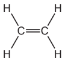
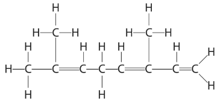
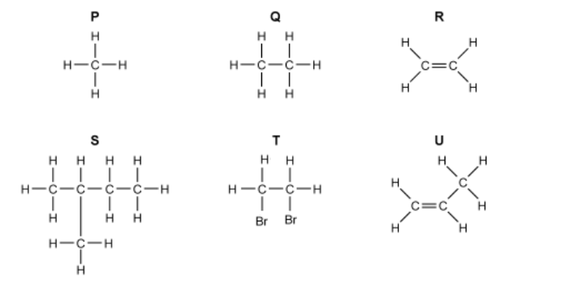
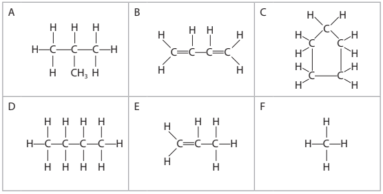

# Exam Questions — Alkenes
**4. Organic Chemistry** · Edexcel IGCSE Science (Double Award) (4SD0) — 17/Chemistry
> Source: [https://www.savemyexams.com/igcse/science/edexcel/double-award/17/chemistry/topic-questions/organic-chemistry/alkenes/exam-questions/](https://www.savemyexams.com/igcse/science/edexcel/double-award/17/chemistry/topic-questions/organic-chemistry/alkenes/exam-questions/) · 9 questions · total 51 marks

## Q1 — easy — 4 marks · exam-questions

### 1((a)) — 3 marks — command: multiple — structured — from paper 2022 · Jan2C
This question is about the unsaturated hydrocarbon, ethene.

The displayed formula of ethene is

i) State the meaning of the term hydrocarbon.

(2)

ii) Give the reason why ethene is described as unsaturated.

(1)

### 1((b)) — 1 mark — multiple_choice — from paper 2022 · Jan2C
Ethene is bubbled through bromine water until there is no further colour change.

Which of these is the appearance of the solution formed?
- **A.** colourless
- **B.** orange
- **C.** purple
- **D.** red

## Q2 — medium — 1 marks · exam-questions

### 1() — 1 mark — multiple_choice
Which of the following molecules is an alkene?
- **A.** C6H10
- **B.** C4H10
- **C.** C5H10
- **D.** C6H14

## Q3 — medium — 14 marks · exam-questions

### 3((a)) — 4 marks — command: complete — structured — from paper 2020 · Nov1CR
This question is about alkenes and alkanes.

Complete the table by giving the missing information about the alkene with the molecular formula C3H6

| ** Molecular formula** | C3H6 |
|---|---|
| ** Name** |   |
| ** Empirical formula** |   |
| ** General formula** |   |
| ** Displayed formula** |   |

### 3((b)) — 3 marks — command: multiple — structured — from paper 2020 · Nov1CR
Alkenes are unsaturated compounds.

i) State what is meant by the term unsaturated.

(1)

ii) Describe a test to show that a compound is unsaturated.

(2)

### 3((c)) — 3 marks — command: multiple — structured — from paper 202 · Nov1CR
When the alkane methane reacts with chlorine, the products are chloromethane (CH3Cl) and hydrogen chloride gas.

i) Give a chemical equation for this reaction.

(1)

ii) What is the name of this type of reaction?

(1)

| **A** | addition |
|---|---|
| **B** | decomposition |
| **C** | neutralisation |
| **D** | substitution |

iii) State the condition needed for this reaction to occur.

(1)

### 3((d)) — 4 marks — command: multiple — structured — from paper 2020 · Nov1CR
When ethane reacts with chlorine, one of the products of the reaction has the formula C2H4Cl2 There are two isomers with this formula.

i) State what is meant by the term isomers.

(2)

ii) Draw the displayed formulae of the two isomers with the formula C2H4Cl2

(2)

| **Isomer 1** | **Isomer 2** |
|---|---|
|   |   |

## Q4 — medium — 1 marks · exam-questions

### 1() — 1 mark — multiple_choice
Bromine water is an orange-brown solution.

When shaken with bromine water, which of the following compounds would cause the solution to decolourise?
- **A.** C3H8
- **B.** C9H20
- **C.** C6H16
- **D.** C4H8

## Q5 — medium — 13 marks · exam-questions

### 6((a)) — 1 mark — command: calculate — structured — from paper 2022 · Jan1CR
Ocimene is an organic compound that gives some plants their particular smell.

The molecular formula of ocimene is C10H16

Calculate the relative formula mass (*M*r) of ocimene.

*M*r = ..............................

### 6((b)) — 2 marks — command: explain — structured — from paper 2022 · Jan1CR
Using ocimene as an example, explain what is meant by the term **empirical formula**.

### 6((c)) — 3 marks — command: explain — structured — from paper 2022 · Jan1CR
The displayed formula of ocimene is

Explain why ocimene is described as an unsaturated hydrocarbon.

### 6((d)) — 2 marks — command: multiple — structured — from paper 2022 · Jan1CR
Ocimene is an alkene.

i) Which of these types of reaction occurs between ocimene and bromine?

| **A** | addition |
|---|---|
| **B** | polymerisation |
| **C** | precipitation |
| **D** | substitution |

(1)

ii) Many alkenes have the general formula CnH2n

Suggest why ocimene does not have this general formula.

(1)

### 6((e)) — 2 marks — command: complete — structured — from paper 2022 · Jan1CR
Ocimene can take part in combustion reactions.

Complete the equation for the complete combustion of ocimene.

C10H16 + .......... O2 → .............................. + ..............................

### 6((f)) — 3 marks — command: multiple — structured — from paper 2022 · Jan1CR
Two different products can form during the incomplete combustion of ocimene.

One product is a solid and the other is a poisonous gas.

i) Identify these two products.

(2)

ii) State why the gas produced is poisonous.

(1)

## Q6 — medium — 1 marks · exam-questions

### 1() — 1 mark — multiple_choice
The structures of some organic compounds are shown below.

Compound R can be converted to compound T by reacting it with bromine.

What kind of reaction is this?
- **A.** Substitution
- **B.** Displacement
- **C.** Combustion
- **D.** Addition

## Q7 — medium — 1 marks · exam-questions

### 1() — 1 mark — multiple_choice
The displayed formula of alkene **Y** is shown below:

What is the name of alkene **Y**?
- **A.** Ethene
- **B.** Propene
- **C.** Butene
- **D.** Pentene

## Q8 — medium — 1 marks · exam-questions

### 1() — 1 mark — multiple_choice
Name the product formed from the reaction between ethene and chlorine.
- **A.** Chloroethane
- **B.** Chloroethene
- **C.** Dichloroethane
- **D.** Dichloroethene

## Q9 — hard — 15 marks · exam-questions

### 8((a)) — 5 marks — command: multiple — structured — from paper 2022 · Jan1C
The table shows the structures of six organic compounds.

i) Give the letter of a compound not shown as a displayed formula.

(1)

ii) Give the letter of a saturated compound with the general formula CnH2n

(1)

iii) Name compound E.

(1)

iv) Explain why compound A and compound D are isomers.

(2)

### 8((b)) — 2 marks — command: multiple — structured — from paper 2022 · Jan1C
Compound F reacts with bromine in the presence of ultraviolet radiation.

i) Complete the equation for the reaction.

(1)

CH4 + Br2 →

ii) Give the name of this type of reaction.

(1)

### 8((c)) — 5 marks — command: multiple — structured — from paper 2022 · Jan1C
i) Another compound, G, has this percentage composition by mass.

C = 37.8%   H = 6.3%   Cl = 55.9%

Show by calculation that the empirical formula of compound G is C2H4Cl

(3)

ii) The relative formula mass (*M*r) of G is 127

Determine the molecular formula of G.

(2)

molecular formula = ..............................

### 8((d)) — 3 marks — command: multiple — structured — from paper 2022 · Jan1C
Compound E is used to make an addition polymer.

i) Complete the equation to show part of the polymer formed from two molecules of compound E.

(2)

ii) Give one problem caused by the disposal of addition polymers.

(1)
