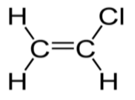
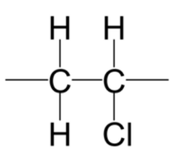
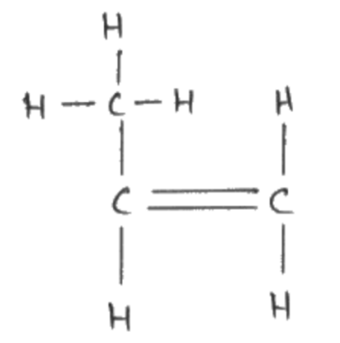
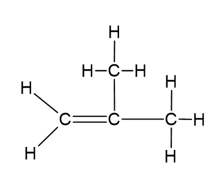
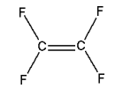

# Mark Schemes — Synthetic polymers
**4. Organic Chemistry** · Edexcel IGCSE Science (Double Award) (4SD0) — 17/Chemistry

## Q1 — medium — 1 marks · exam-questions

### 1() — 1 marks
**Correct answer: B** — 

**Final answer:** **The correct answer is B**

- In addition polymers, the repeat unit always has two carbons in the chain and the other atoms are side groups drawn above or below the chain
- Each carbon across the double bond in the monomer has a -CH3 group and -H attached, so the polymer must also have these as side groups
- A is incorrect as the chain of the repeat unit is four carbons long instead of two
- C is incorrect as one carbon in the chain has two Hs instead of a CH3 and H
- D is incorrect as the chain of the repeat unit is four carbons long instead of two

## Q2 — medium — 13 marks · exam-questions

### 6((a)) — 3 marks
The empirical formula of chloroethene can be shown to be C2H3Cl as follows:

- Dividing percentages by atomic masses: C: 38.4/12 **AND **H: 4.8/1 **AND **Cl: 56.8/35.5; **[1 mark]**
- Correct results of divisions: C: 3.2 **AND **H: 4.8 **AND** Cl: 1.6; **[1 mark]**
- Obtaining ratio by dividing results by smallest value: C: 3.2/1.6 (= 2) **AND **H: 4.8/1.6 (= 3) **AND** Cl: 1.6/1.6 (= 1); **[1 mark]**

**Alternative method**

- Calculating *M*r of C2H3Cl:  C2H3Cl (= 24 + 3 + 35.5) = 62.5; **[1 mark]**
- Working for finding ratio of each element: C: 24/62.5 **AND **H: 3/62.5 **AND **Cl: 35.5/62.5; **[1 mark]**
- Evaluation of correct percentages: all x 100 C = 38.4(%) **AND **H = 4.8(%) **AND **Cl = 56.8(%); **[1 mark]**

**[Total: 3 marks]**

- *To calculate the empirical formula when given percentages, it is easiest to assume that you have 100 g of the sample, then you can workout the number of moles of each element in 100 g by using the **M**r**:*

|   | > *C* | > *H* | > *Cl* |
|---|---|---|---|
| > *Calculate the number of moles of each element in 100 g (%/**M**r**)* | $\frac{38.4}{12}\,=3.2$ | $\frac{4.8}{1}\,=4.8$ | $\frac{56.8}{35.5}\,=1.6$ |
| > *Divide by the smallest number to find the smallest ratio* | > * 3.2/1.6 = 2* | > * 4.8/1.6 = 3* | > * 1.6/1.6 = 1* |

- *The empirical formula is therefore C**2**H**3**Cl*

### 5((b)) — 5 marks
i) The formula of iron(III) chloride is:

- FeCl3; **[1 mark] **
*allow Fe**3+**Cl**3**-*

ii) The purpose of using a catalyst is:

- To increase the rate of the reaction / to speed up the reaction; **[1 mark] **
*allow references to (providing reaction pathway of) lower activation energy*

iii) The meaning of the term exothermic is:

- Gives out heat (energy) / thermal energy;** [1 mark] **
*Do not accept energy on its own* *ignore reference to negative ΔH*

iv) The type of reaction that occurs in stage 1 between ethene and chlorine is:

- A / addition;** [1 mark]**

v) The chemical equation for the decomposition of dichloromethane is:

- C2H4Cl2 → C2H3Cl + HCl; **[1 mark]**

**[Total: 5 marks]**

- *This question pulls on your knowledge from many different areas of the course and demonstrates how you need to know the definitions of many different terms*
- *In stage 1, the double bond of ethene opens up and chlorine adds across it, causing an addition reaction*
- *In part (v), the reaction may be unfamiliar to you but you are giving the names of the reactants and products*

  - *You are also given the formulae of dichloromethane and chloroethene, and you should know the formula of hydrogen chloride*
  - *This information is sufficient to be able to construct the chemical equation*

### 6((c)) — 5 marks
i) The displayed formula of chloroethene is:

- Chloroethene:  ; **[1 mark]**

The repeat unit of poly(chloroethene) is:

- Correct displayed formula with single bond between C atoms; **[1 mark]**
- Extension bonds shown on C atoms; **[1 mark]** 
*If double bond shown in repeat unit, max 1 mark* *ignore brackets / n* *More than one correct repeat unit with extension bonds scores 1 mark out of M2/M3*

ii) A dot‐and‐cross diagram to represent a molecule of chloroethene is:

- 2 shared pairs between C atoms;** [1 mark]**
- Rest of structure fully correct; **[1 mark] **
*accept any combination on of dots and crosses*
*ignore inner shells even if incorrect* *M2 is dependent on M1*

**[Total: 5 marks]**

- *Polymerisation is the process where lots (poly-) of links / monomers join together to form a long chain*
- *Addition polymerisation involves breaking open the C=C bond of monomers, joining the monomers together and forms only the polymer *
- *To draw the polymer from the monomer*

  1. *Draw a copy of the monomer*
  2. *Replace the carbon=carbon double bond with a carbon-carbon single bond*
  3. *Add brackets around the molecule *
  4. *Add one continuation / extension bond from each carbon to outside the bracket*
  5. *Add **n** after the brackets (bottom right)*
- *Whilst this question doesn't require the brackets and n, in some instances this is required, so it is best to add these in *
- *When drawing dot-and-cross diagrams, you can add a circle to represent the electron shell or leave it out, as per this mark scheme*
- *Remember**: Check that the electron shell of each atom is full*

## Q3 — medium — 1 marks · exam-questions

### 1() — 1 marks
**Correct answer: A** — They are inert

**Final answer:** **The  correct answer is A**

- Addition polymers contain strong covalent bonds and are essentially inert at ordinary temperatures
- They cannot be broken down by bacteria so are not biodegradable
- They are usually sent to landfill or incinerated which both negatively impact the environment

## Q4 — medium — 13 marks · exam-questions

### 9((a)) — 4 marks
i) The completed table should contain:

- (Empirical formula): CH2; **[1 mark]**
- (General formula): CnH2n; **[1 mark]**

*Allow subscript and superscript numbers, capital letters and letters other than n*

ii) Two other characteristics of a homologous series are:

Any **two** from:

- Each member differs from the next by a CH2 group; **[1 mark]**
- (Each member has) the same functional group; **[1 mark]**
- (Each member has) similar/ same chemical properties / similar/ same (chemical) reactions; **[1 mark]**
- Trend in physical properties (between successive members)/ named physical property trend; **[1 mark]**

*Do not allow 'similar/ same physical properties'*

**[Total: 4 marks]**

- *Molecular formula show how many of each type of atom is actually present in a particular molecule, the empirical formula is the simplest ratio of atoms and the general formula could be applied to find the formulae of others in that homologous series*
- *The general formula should be written as given with subscript numbers and n, but variations are sometimes accepted, as is the case here. Try to learn the standard format to be safe!*

### 9((b)) — 8 marks
i) The type of reaction is:

- Addition/ additional; **[1 mark]**

ii) The completed diagram should be:

- Single bond between the two carbons, 4 hydrogens joined by single bonds; **[1 mark]**
- Trailing bonds through the brackets and the n to the right (n in any position outside the bracket to the right of the structure); **[1 mark]**

*Allow capital N*

iii)

Any **five** from (including at least one advantage or disadvantage):

- Poly(ethene) is cheaper than polymers from corn starch; **[1 mark]**
- Poly(ethene) is stronger than polymers from corn starch; **[1 mark]**
- Poly(ethene) frees up land to grow food crops; **[1 mark]**
- Poly(ethene) comes from (cracking of certain fractions from) crude oil; **[1 mark]**
- Poly(ethene) is non-renewable **OR** Ethene is a finite source; **[1 mark]**
- Poly(ethene) is inert; **[1 mark]**
- Poly(ethene) is non-biodegradable; **[1 mark]**
- Poly(ethene) takes longer to decompose; **[1 mark]**
- Disposal of poly(ethene) is a problem (in landfill); **[1 mark]**
- Poly(ethene) causes problems with litter; **[1 mark]**
- Burning poly(ethene) (could) create toxic fumes / greenhouse gases; **[1 mark]**

**[Total: 8 marks]**

- *Addition reactions have a clue in the name; molecules are added together to make one product.*
- *They need a double bond so that one bond can break and one can remain, so the trailing bonds shown are from that broken double bond*
- *If you need to draw it from scratch then start with the carbons that have the double bond, add trailing bonds, then branched groups and brackets*
- *When you are given information to analyse make sure you look at both sides of the argument; only talking about advantages or disadvantages will mean you get a maximum of 3 marks on this question*

### 9((c)) — 1 marks
The monomer is:

- Diagram that shows every bond; **[1 mark]**

**[Total: 1 mark]**

- *When drawing monomers from repeat units, put a double bond between the carbons which have the trailing bonds and remove the trailing bonds*
- *If you leave the trailing bonds in place that is incorrect and you will not get the marks*

## Q5 — medium — 1 marks · exam-questions

### 1() — 1 marks
**Correct answer: B** — Addition polymers are unsaturated as they are made by combining molecules which contain a carbon double bond

**Final answer:** **The correct answer is B**

- Addition polymers are formed by the joining up of many monomers and only occurs in monomers that contain C=C bonds

  - One of the bonds in each C=C bond breaks and forms a bond with the adjacent monomer with the polymer being formed containing single bonds only
  - Compounds containing single bonds only are saturated compounds

## Q6 — medium — 1 marks · exam-questions

### 1() — 1 marks
**Correct answer: A** — 

**Final answer:** **The correct answer is A**

- Monomers that make addition polymers show a double bond and the side groups on the chain must correspond to the side groups on the monomer
- This polymer has CH3 and Cl on adjacent carbons so the monomer must be the same
- **B** is incorrect as three carbons are shown in the chain of the monomer instead of two
- **C** is incorrect as the monomer is missing a Cl side group
- **D** is incorrect as there is a missing double bond in the monomer

## Q7 — medium — 1 marks · exam-questions

### 1() — 1 marks
**Correct answer: C** — A large molecule made from many small molecules

**Final answer:** **The correct answer is C**

- Polymers are large molecules made from many small molecules called monomers
- The monomers must contain a carbon-carbon double bond which is broken when the molecules are joined together

## Q8 — hard — 15 marks · exam-questions

### 8((a)) — 4 marks
i)  What is meant by the term isomers:

- Isomers are molecules / compounds with the same molecular formulae; **[1 mark]**
- With different structural / displayed formulae; **[1 mark]**

ii)  The displayed formulae of two isomers of Q:

|   **[1 mark]** |   **[1 mark]** |
|---|---|

*Alternative:*

|  |
|---|

**[Total: 4 marks]**

- *You don't need to get the bond angles correct in these drawings to get the marks*

### 8((b)) — 5 marks
i)  Whether the molecule is an unsaturated hydrocarbon:

- The molecule is unsaturated as it contains (carbon to carbon) double bond;** [1 mark]**
- The molecule not a hydrocarbon as contains oxygen; **[1 mark]**

ii)  The type of polymerisation that occurs in the formation of the polymer:

- Addition;** [1 mark]**

iii)  Completing the equation for the polymerisation reaction:

- Correct repeat unit;** [1 mark]**
- Using continuation bonds, the bracket and n;** [1 mark]**

**[Total: 5 marks]**

- *The bonds do not have to go through the brackets to get the second mark*
- *The n can be anywhere after the bracket*

### 8((c)) — 6 marks
i)  The mass, in kg, of carbon dioxide formed if all the octane in the fuel tank undergoes complete combustion.

- Calculation of mass of octane;** [1 mark]**

- Calculation of *M**r* of C8H18 and CO2; **[1 mark]**
- Showing the link between mass / mol of C8H18 and mass/mol CO2;** [1 mark]**
- The calculation of mass of CO2 in g; **[1 mark]**
- The calculation of mass CO2 in kg; **[1 mark]**

*Example calculation:*

- 50 x 700 = 35 000 (g)

*- M**r *of C8H18 = 114 and Mr CO2 = 44 - 114g C8H18 produces (8 x 44 =) 352 (g) CO2

- 35 000 g C8H18 produces $\frac{35000\times352}{114}$= 108 070.2 (g)

- CO2  = 108 (kg)

*Alternative method using moles:*

- 50 x 700 = 35 000 (g) *- M**r *of C8H18 = 114 and Mr CO2 = 44 - n (C8H18) = $\frac{35000}{114}$ = 307.0175 mol - so n (CO2) = 8 x 307.0175 = 2456.14 mol mass CO2 = 2 456.14 x 44 = 108 070.2 (g) - CO2 = 108 (kg)

ii)  An environmental problem caused by carbon dioxide is:

- Global warming / climate change;** [1 mark]**

**[Total: 6 marks]**

- *You can use moles or reacting masses to solve these calculations, but make sure you don't round off until the end of the calculation*
- *Follow the data if you are not sure about decimal places or significant figures; the data has three significant figures so quote three in your answer*

  - *You would get credit for 2 significant figures, but not less than that or more than 3*

## Q9 — hard — 3 marks · exam-questions

### 8((a)) — 2 marks
i) The name of the monomer is:

- Chloroethene; **[1 mark] ** 
*Accept vinyl chloride*

ii) The addition polymer formed from this monomer is:

- Poly(chloroethene);** [1 mark] ** *Accept polyvinyl chloride* *Ignore PVC*

**[Total: 2 marks]**

- *The carbon chain contains two carbon chains therefore 'eth' must be included in the name *
- *There is a double bond between the two carbon chains, so the name will contain ethene *
- *The monomer contains a chlorine atom, so the prefix 'chloro' must be used *

  - *Therefore the monomer is chloroethene *
- *Also, when it becomes a polymer, the name changes by the addition of 'poly' in front *

  - *polychloroethene *

### 8((b)) — 1 marks
The displayed formula of the monomer is:

;** [1 mark] **

*Ignore bond angles*

**[Total: 1 mark] **

- *The monomer has a similar structure to the polymer*

  - *The differences are*
  
    - *A monomer must contain a double bond between the two carbon atoms (C=C)*
    - *A polymer repeat unit shows bonds extended from each carbon atom *
  - *The four groups from the two carbon atoms remain the same*
