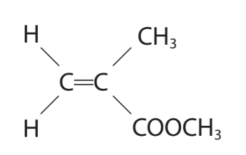
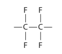

# Exam Questions — Synthetic polymers
**4. Organic Chemistry** · Edexcel IGCSE Science (Double Award) (4SD0) — 17/Chemistry
> Source: [https://www.savemyexams.com/igcse/science/edexcel/double-award/17/chemistry/topic-questions/organic-chemistry/synthetic-polymers/exam-questions/](https://www.savemyexams.com/igcse/science/edexcel/double-award/17/chemistry/topic-questions/organic-chemistry/synthetic-polymers/exam-questions/) · 9 questions · total 49 marks

## Q1 — medium — 1 marks · exam-questions

### 1() — 1 mark — multiple_choice
The following molecule can undergo addition polymerisation.

What is the correct repeat unit?

- **A.** 
- **B.** 
- **C.** 
- **D.** 

## Q2 — medium — 13 marks · exam-questions

### 6((a)) — 3 marks — command: show — structured — from paper 2019 · Ju1CR
Poly(chloroethene) is a polymer.

It is made from its monomer, chloroethene.

Chloroethene has the percentage composition by mass

C = 38.4%      H = 4.8%      Cl = 56.8%

Show, by calculation, that the empirical formula of chloroethene is C2H3Cl

### 5((b)) — 5 marks — command: multiple — structured — from paper 2019 · Ju1CR
The molecular formula of chloroethene is also C2H3Cl

Chloroethene can be prepared by a two‐stage process.

In stage 1, ethene reacts with chlorine in the presence of an iron(III) chloride catalyst to form dichloromethane.

The reaction is exothermic.

C2H4 + Cl2 → C2H4Cl2

i) Give the formula of iron(III) chloride.

(1)

ii) State the purpose of using a catalyst.

(1)

iii) State the meaning of the term **exothermic**.

(1)

iv) What type of reaction occurs in stage 1 between ethene and chlorine?

| ☐ | **A** | addition |
|---|---|---|
| ☐ | **B** | displacement |
| ☐ | **C** | neutralisation |
| ☐ | **D** | substitution |

(1)

v) In stage 2, dichloroethane decomposes into chloroethene and hydrogen chloride. Give a chemical equation for this reaction.

(1)

### 6((c)) — 5 marks — command: multiple — structured — from paper 2019 · Ju1CR
i) Draw the displayed formula of

- chloroethene
- the repeat unit of poly(chloroethene)

| chloroethene | repeat unit of poly(chloroethene) |
|---|---|

(3)

ii) Draw a dot‐and‐cross diagram to represent a molecule of chloroethene. Show only the outer electrons of each atom.

(2)

## Q3 — medium — 1 marks · exam-questions

### 1() — 1 mark — multiple_choice
Why do addition polymers not biodegrade easily?
- **A.** They are inert
- **B.** They contain ionic bonding
- **C.** They are unsaturated molecules
- **D.** They have high density

## Q4 — medium — 13 marks · exam-questions

### 9((a)) — 4 marks — command: multiple — structured — from paper 2020 · Ja1CR
This question is about alkenes and polymers.

Ethene (C2H4) can be represented by different types of formula.

i) Complete the table by giving the missing information.

(2)

| **Molecular formula ** | C2H4 |
|---|---|
| **Empirical formula** |   |
| **General formula** |   |

ii) Ethene is a member of the homologous series of alkenes. All members of the same homologous series have the same general formula. Give two other characteristics of a homologous series.

(2)

1. ............................................................................ 
2. ............................................................................

### 9((b)) — 8 marks — command: multiple — structured — from paper 2020 · Ja1CR
Ethene is used to make poly(ethene).

i) State the type of polymerisation used to form poly(ethene).

(1)

ii) Complete the equation for the polymerisation of ethene.

(2)

iii) Poly(ethene) is used to make plastic bags. Corn starch from plants can also be used to make polymers for plastic bags. The table gives some information about poly(ethene) and polymers made from corn starch.

|   | **Polymers** | **Polymers from corn starch** |
|---|---|---|
| **Cost per tonne** | £1500 | £3700 |
| **Relative strength** | 100 | 50 |
| **Time to decompose** | estimated 450 years | 3-6 months |

Use the information in the table and your knowledge to discuss the advantages and disadvantages of using poly(ethene) to make plastic bags.

(5)

### 9((c)) — 1 mark — command: draw — structured — from paper 2020 · Ja1CR
The diagram shows the repeat unit of another polymer.

Draw the displayed formula of the monomer used to make this polymer.

## Q5 — medium — 1 marks · exam-questions

### 1() — 1 mark — multiple_choice
Which of the following statements about polymers is **NOT **correct?
- **A.** Polymers can be recycled but it is a difficult and expensive process
- **B.** Addition polymers are unsaturated as they are made by combining molecules which contain a carbon double bond
- **C.** Poly(ethene) is formed by the addition polymerisation of ethene monomers
- **D.** Incinerating polymers contributes to climate change

## Q6 — medium — 1 marks · exam-questions

### 1() — 1 mark — multiple_choice
The structure of a polymer is shown below.

What is the correct monomer?

- **A.** 
- **B.** 
- **C.** 
- **D.** 

## Q7 — medium — 1 marks · exam-questions

### 1() — 1 mark — multiple_choice
Which statement is the correct description of a polymer?
- **A.** The atoms within a monomer
- **B.** A large saturated hydrocarbon
- **C.** A large molecule made from many small molecules
- **D.** A large unsaturated molecule

## Q8 — hard — 15 marks · exam-questions

### 8((a)) — 4 marks — command: multiple — structured — from paper 2021 · Ja1CR
i) Organic compounds can exist as isomers.

Explain what is meant by the term isomers.

(2)

ii) Organic compound Q reacts with bromine, without the presence of ultraviolet radiation, to form the compound C4H8Br2.

Draw the displayed formulae of two isomers of Q.

|   |   |
|---|---|

(2)

### 8((b)) — 5 marks — command: multiple — structured — from paper 2021 · Ja1CR
An acrylic polymer can be formed from molecules with this structure.

i) A student describes the molecule as an unsaturated hydrocarbon.

Explain whether this is a correct description.

(2)

ii) Name the type of polymerisation that occurs in the formation of the polymer.

(1)

iii) Complete the equation for the polymerisation reaction.

(2)

### 8((c)) — 6 marks — command: multiple — structured — from paper 2021 · Ja1CR
Octane is a compound in petrol.

The equation for the complete combustion of octane is

C8H18 + 12.5O2 → 8CO2 + 9H2O

i) The fuel tank of a car contains 50.0 dm3 of octane.

Calculate the mass, in kg, of carbon dioxide formed if all the octane in the fuel

tank undergoes complete combustion.

[mass of 1 dm3 of octane = 700 g]

mass = ................................................kg

(5)

ii) State an environmental problem caused by carbon dioxide.

(1)

## Q9 — hard — 3 marks · exam-questions

### 8((a)) — 2 marks — command: name — structured — from paper 2017 · Specimen2C
Polymers can be classified as addition polymers or condensation polymers.

An addition polymer can be formed from the monomer CH2=CHCl

i) Name this monomer.

(1)

ii) Name the addition polymer formed from this monomer.

(1)

### 8((b)) — 1 mark — command: draw — structured — from paper 2017 · Specimen2C
The diagram shows the repeat unit of a different addition polymer.

Draw the displayed formula of the monomer used to make this polymer.
