# Mark Schemes — Rates of Reaction
**3. Physical Chemistry** · Edexcel IGCSE Science (Double Award) (4SD0) — 17/Chemistry

## Q1 — medium — 5 marks · exam-questions

### 8((a)) — 1 marks
The balance readings have negative values because:

- One reaction product is a gas and so escapes from the flask;** [1 mark] **

**[Total: 1 mark] **

- *If a product is escaping the reaction vessel, the mass will decrease, though as shown the mass change will be very small *

### 8((b)) — 2 marks
i) **One** mistake the students could have made to produce this result is

Any **one** of the following

- Balance reading recorded too late; **[1 mark] **
- Acid concentration greater than recorded;** [1 mark] **

ii) The relationship shown in the graph is:

- Loss in mass is directly proportional to acid concentration; **[1 mark] **

**[Total: 2 marks] **

- *The anomalous result is higher than expected (as shown in the graph) so you need to think about how this has occurred*
- *The mass lost is greater than expected, meaning the reaction has been allowed to proceed for a longer period of time or the acid used has a greater concentration than thought*
- *The higher the concentration the faster the rate of reaction *
- *A straight line graph shows that the relationship between the two variables plotted is proportional*

  - *A straight line that goes through the **origin **shows that the relationship is **directly **proportional*

### 8((c)) — 2 marks
An increase in concentration increases the rate of reaction because:

- More particles in the same volume; **[1 mark]**
- So collide more frequently (with malachite);** [1 mark]  ***Accept particles closer together*

**[Total: 2 marks] **

- *Increasing the concentration of a solution will increase the rate of reaction *
- *This is because there will be more reactant particles in a given volume, allowing more frequent and successful collisions per second*
- *In your answer you must state 'frequency' implying that the number of collisions per unit time increases *

## Q2 — medium — 14 marks · exam-questions

### 7((a)) — 1 marks
The name of the precipitate that forms is:

- Sulfur; **[1 mark]**

**[Total: 1 mark]**

- *Precipitates are solid*
- *Sulfur is the only solid formed during this reaction*

### 7((b)) — 2 marks
Two other factors that the student should keep constant are:

Any **one **of the following:

- Concentration of hydrochloric acid; **[1 mark] ***Volume or amount is not sufficient for the mark*
- Concentration of sodium thiosulfate; **[1 mark] ***Volume or amount is not sufficient for the mark*
- Height of the eye above flask; **[1 mark]**
- Size of flask; **[1 mark]**
- The colour / darkness of the black cross; **[1 mark]**

**[Total: 2 marks]**

- *For questions like this, you should focus on the equipment and the method to identify the control variables - factors that you should keep the same so that the experiment produces repeatable and reproducible results*
- *The 'amount' of chemicals used is the first, and possibly most obvious, factor BUT amount and volume are not sufficient to gain the marks, you need to be specific to that experiment*

  - *You need to talk about concentrations of solutions if these are used*
  
    - *If it clear that the concentration is the independent variable, then you can gain the mark for talking about volume*
  - *Although it is not relevant to this experiment, you should talk about the mass and surface area of solids if they are used*
- *If you consider the dependent variable (time taken for the cross to disappear) then you should recognise that the black cross and the depth of liquid above it are factors*

  - *Thicker, darker crosses will require more solid to form and block it out compared to thinner, paler crosses*
  - *Using the same total volume of liquids, the depth of liquid in a 100 cm**3** conical flask will be greater than the depth for a 500 cm**3** conical flask, which means that the 100 cm**3** will obscure the cross more easily*

### 7((c)) — 1 marks
One reason why the results might not be as accurate at temperatures higher than 60 °C is:

- The sodium thiosulfate solution would cool down 
**OR **
The sodium thiosulfate would not remain at the required temperature 
**OR **
There are larger (percentage) errors in the times recorded when the reaction is quicker / hotter 
**OR **
Short times lead to less accurate readings / measurements; **[1 mark]**

**[Total: 1 mark]**

- *The results show that as temperature increases, the time taken for this reaction decreases*

  - *As the temperature increases, there could be a bigger error in the results*
  
    - *At 60 **o**C, a 2 second difference between the observed and actual results gives an 8.3 % error*
    - *At 20 **o**C, the same difference gives a 0.5 % error*
- * Materials cool on a curve (Physics)*

  - *Hotter materials lose (heat) energy quicker per second or minute than the same material at a lower temperature*
  - *This means that the hotter a material is, the less likely it is to remain at that temperature*

### 7((d)) — 2 marks
The plotted graph with curve of best fit is:

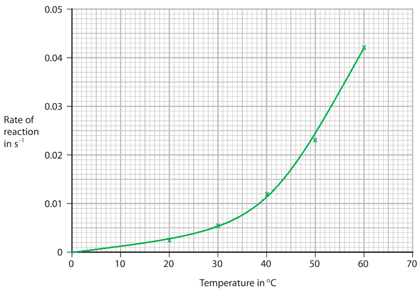

- All points plotted correctly (to the nearest grid line);** [1 mark]**
- Appropriate curve of best fit drawn; **[1 mark]** *The curve from 0 - 20 and above 60 is ignored*

**[Total: 2 marks]**

- *Practice drawing graphs as it is an expected skill and examiners have become stricter about the points that you are plotted*

  - *Some mark schemes will allow ± half a square*
  - *Some mark schemes are to the nearest grid line*
  - *Some mark schemes will allow one plotting error*
  - *Some mark schemes may allow no errors although this is rare*

### 7((e)) — 5 marks
i) The of the reaction at 45 °C is:

- Line on at 45 oC; **[1 mark]**
- 0.017 
**OR **
Value from student's graph with expected values in the range of 0.016 - 0.017 with a tolerance of ±0.0005;** [1 mark]** 
*Allow correct values based on your graph*

ii) The time that it would take for the cross not to be seen at 45 °C is:

- Time $=\frac{1}{\mathrm{rate}}=\frac{1}{0.017}$ 
**OR **
Time `begin mathsize 14px style equals 1 over rate equals fraction numerator 1 over denominator part space open parentheses straight i close parentheses space answer end fraction end style`; **[1 mark]**
- Time = 58.8; **[1 mark] **
*Commonly expected answers are:*

  - *62.5 from a rate of 0.016*
  - *60.6 from a rate of 0.0165*
  - *58.8 from a rate of 0.017*

iii) The relationship between rate of reaction and temperature shown by the graph is:

- As the temperature increases, the rate or reaction increases  
**OR**
There is a positive correlation; **[1 mark]** 
*Linear and directly proportional are not accepted answers *

**[Total: 5 marks]**

- *Along with plotting graphs, you also need to be able to read values off graphs and potentially use them in relevant calculations*

### 7((f)) — 3 marks
In terms of particle collision theory, the effect that increasing the temperature has on the rate of a reaction is:

- The (mean) <u>kinetic</u> energy of the particles increases 
**OR **
The particles gain <u>kinetic</u> energy / move faster; **[1 mark] **
*Vibrate more or faster is not accepted*
- This leads to more <u>frequent</u> successful collisions 
**OR  **
This leads to more successful collisions <u>per second / per unit time</u> 
**OR **
This leads to more <u>frequent</u> collisions between particles that have energy greater than the activation energy; **[1 mark] **
*Reference must be made to the frequency of collisions or collisions per unit time to achieve this mark*
- Therefore, the rate (of reaction) increases 
**OR **
The reaction is faster / speeds up; **[1 mark]**

**[Total: 3 marks]**

- *Most students lose marks on this question because they don't talk about the **kinetic** energy of the particles and the frequency of the collisions*
- *Regardless of the factor (temperature, pressure, concentration or surface area) the reasons that any reaction gets quicker, in terms of collision theory, is:*

  - *There are more frequent collisions / more collisions per unit time*
  - *This leads to more successful collisions*
  
    - *The easiest way to cover both of these points is to say that there are more frequent successful collisions / more successful collisions per unit time*
  - *This causes the rate of reaction to increase*
- *For temperature the additional factor is that a greater number of particles have more energy for collisions to occur with an energy greater than or equal to activation energy at a higher temperature, which further accelerates rate*

## Q3 — medium — 1 marks · exam-questions

### 1() — 1 marks
**Correct answer: C** — The activation energy increases

**Final answer:** **The correct answer is C.**

- When the temperature is decreased the particles move more slowly and collide with less energy
- The frequency of collisions decreases
- Fewer particles have the minimum energy to react because the mean energy of particles is lower
- The activation energy remains unchanged by the change in temperature

  - The only way to change the activation energy of a reaction is to use a catalyst which provides an alternative pathway with a lower activation energy

## Q4 — medium — 15 marks · exam-questions

### 11((a)) — 4 marks
i) The test for oxygen gas is:

- A glowing splint relights; **[1 mark]**

ii) A method to show that solid manganese(IV) oxide is a catalyst in this reaction and not a reactant:

- Filter out manganese(IV) oxide / solid; **[1 mark]**
- Leave to dry; **[1 mark]**
- The mass should be the same / 1 g of manganese(IV) oxide / solid; **[1 mark]**

**[Total: 4 marks]**

- *Don't confuse the tests for oxygen and hydrogen gas*

  - *Hydrogen produces a squeaky pop with a **lit **splint whereas oxygen will **relight** a glowing splint*
- *A catalyst is not used up during the reaction, so there will be the same amount present before and after the reaction*

  - *As manganese(IV) oxide is insoluble, it will remain as a solid in the reaction mixture so can easily be filtered, dried and re-weighed*

### 11((b)) — 9 marks
i) The mean (average) rate of reaction, in cm3 / s, in the first 120 s is:

- 280 ÷ 120;** [1 mark]**
- 2.33 (cm3 / s);** [1 mark]**

ii) The rate of reaction is greatest at the start of the reaction because:

- The concentration of hydrochloric acid is greatest / greatest number of particles (of zinc / hydrochloric acid) **OR** The surface area of zinc is greatest; **[1 mark]**]
- Therefore there are more collisions;** [1 mark]**
- Per unit time;** [1 mark]**

iii)The curve you would expect to see in the experiment at a higher temperature is:

- The curve is above original and starts at 0;** [1 mark]**
- The curve goes flat at same volume (410 cm3);** [1 mark]**

iv) The rate of reaction is greater if the same mass of zinc powder is used instead of zinc lumps because:

- There is a greater surface area;** [1 mark]**
- So there will be more collisions per unit time / more frequent collisions;** [1 mark]**

**[Total: 9 marks]**

- *To find the mean rate of reaction, use the graph to find the volume of hydrogen collected in 120 s, which is approximately 280 cm*
- *In this case, the rate is calculated by:*

  - *rate = volume of gas collected ÷ time taken to collect*
  - *rate = 280 ÷ 120 = 2.33 cm**3 **/ s*
- *At higher temperatures, the rate will be quicker*
- *The steeper the curve, the quicker the reaction so the new curve in part (iii) will be above the original line but still starting at the origin*
- *There is no change to the amount of reactants, so the amount of hydrogen given off will remain the same, but it will be collected in a shorter amount of time*
- *Remember**: When explaining why the rate increases using collision theory, don't just state it is because there are 'more collisions', always qualify this by giving some reference to time, e.g. more **frequent **collisions*

### 11((c)) — 2 marks
To show that hydrochloric acid is in excess:

- 8.46 × 10-3 mol of zinc; **[1 mark]**
- Therefore 1.69 × 10-2 mol hydrochloric acid is needed (which is less than 2.50 × 10-2 mol); **[1 mark]** 

**OR**
- 1.25 × 10-2 mol of zinc are needed; **[1 mark]**
- Therefore 0.8(13) g of zinc is needed (and there is only 0.55 g); **[1 mark]**

**[Total: 2 marks]**

- *To find which reactant is in excess you need to know the number of moles of each reactant and the reacting ratio*
- *The number of moles of zinc is calculated by: mass ÷ **A**r** = 0.55 ÷ 65 = 8.46 × 10**-3 **mol*
- *Using the balanced symbol equation, you can see that 1 mole of zinc will react with 2 moles of hydrochloric acid*

  - *So, 8.46 × 10**-3 **moles of zinc will react with 2 x 8.46 × 10**-3 **= 1.69 × 10**-2** moles of hydrochloric acid*
- *The question tells you that 2.50 x 10**-2** moles of hydrochloric acid are present, which is more than enough than is needed to react with 0.55 g of zinc and hydrochloric acid is in excess*

## Q5 — medium — 15 marks · exam-questions

### 9((a)) — 2 marks
A cotton wool plug increases the accuracy of the student’s results because:

- It prevents acid splashing out **OR **It allows only carbon dioxide / gas to leave the flask; **[1 mark] ***Solid leaving the flask is ignored Gas leaving the flask is not accepted*
- So, the decrease in mass is more accurate / closer to the actual value **OR **So, the decrease in mass is only due to loss of the gas; **[1 mark]**

**[Total: 2 marks]**

- *The decrease in mass is due to the loss of carbon dioxide*
- *This means that the reaction vessel needs to be able to allow gas to escape while keeping anything else in*
- *It is unlikely that the solid would escape, so the cotton wool bung must be to keep the acid in*

### 9((b)) — 2 marks
The completed equation for the reaction with state symbols is:

CaCO3 **(s)** + 2HCl **(aq)** → CaCl2 (aq) + H2O **(l)** + CO2 **(g) **

- Correct state symbols for the reactants;** [1 mark]**
- Correct state symbols for the products; **[1 mark]**

**[Total: 2 marks]**

- *You should know the state symbols for all four chemicals *

### 9((c)) — 7 marks
i) A reason why there are some calcium carbonate chips remaining in the flask when the reaction stops is:

- The (hydrochloric) acid has all reacted; **[1 mark]**

ii) The student would know when the reaction has stopped because:

- The mass stays the same / stops decreasing **OR **The fizzing / effervescence stops **OR **The curve (on the graph) levels off / plateaus; **[1 mark]**

iii) The amount, in moles, of carbon dioxide produced during the reaction is:

- 0.98; **[1 mark]**
- $\frac{0.98}{44}$ = 0.022; **[1 mark]**

iv) The rate of reaction, in grams per second, at time 60 seconds is:

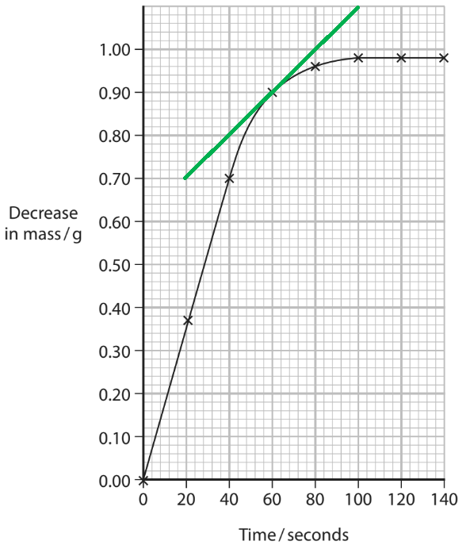

- Tangent shown on graph; **[1 mark]**
- Calculation using the tangent, e.g. $\frac{0.4}{80}$; **[1 mark]**
- Evaluation of calculation = 0.005 (g / s);** [1 mark]** *Expected answers are in the range of 0.005 - 0.006 Answers in the range of 0.005 - 0.006 with a tangent shown on the graph score all 3 marks*

**[Total: 7 marks]**

- *The reaction will stop when one of the reactants has been used up*

  - *Since there are some calcium carbonate chips left, then the acid must be the reactant that is used up*
- *In terms of experimental observations, the reaction stopping can be seen by the fizzing stopping or there being no further decrease in mass*

  - *This will show on the graph as the curve levelling out*
- *Remember: **Rate of reaction = gradient of the tangent = *$\frac{\mathrm{change} \mathrm{in}y}{\mathrm{change} \mathrm{in}x}$

### 9((d)) — 4 marks
i) The relationship between the initial rate of reaction and percentage concentration of the original hydrochloric acid is:

- The rate of reaction increases as the percentage concentration increases; **[1 mark]**
- The rate of reaction is (directly) proportional to the percentage concentration; **[1 mark]**

ii) Changing the concentration of hydrochloric acid affects the initial rate of reaction by:

- Changing the number of particles (in a given volume / per unit volume) **OR **Having particles closer together or further apart; **[1 mark]**
- Which changes the number of collisions per unit time **OR **Changes the frequency of collisions; **[1 mark]**

**[Total: 4 marks]**

- *Tip: **When you are asked to describe the relationship, start your sentence with the word **"as" *

  - *As the percentage concentration of original hydrochloric acid increases, the initial rate of reaction increases proportionally*
- *Concentration is about the number of particles in a given volume / per unit volume *

  - *Changing the concentration will change the number of particles*
  - *This means that there may be more or fewer collisions per second / per unit of time*
  - *This results in a faster or slower reaction*
  - *Careful:** When you are explaining how a factor affects the rate, make sure you mention ideas about "per unit time" / frequency, and "per unit volume" as examiners are usually looking for these specifically to be able to award the marks*

## Q6 — medium — 1 marks · exam-questions

### 1() — 1 marks
**Correct answer: C** — Measuring cylinder, delivery tube, stopwatch

**Final answer:** **The correct answer is C.**

- The rate of reaction can be measured by monitoring the volume of gas collected, so either a gas syringe or an inverted measuring cylinder connected to the reaction vessel via a delivery tube would be needed
- Time must also be recorded, so a stopwatch is essential

## Q7 — medium — 13 marks · exam-questions

### 5((a)) — 3 marks
i) Using the cotton wool increases the accuracy of this investigation because:

- It stops the acid (spray) leaving the flask / only gas can escape / so the only cause of mass loss is gas or words to that effect; **[1 mark]** *reject stops gas escaping* *reject references to substances / impurities / gases entering flask*
- As (without the cotton wool) mass loss would be too large / (with cotton wool) the mass does not decrease by more than it should; **[1 mark]**

ii) Mass is lost from the flask because:

- B / gas is given off; **[1 mark]**

**[Total: 3 marks]**

- *Marble chips are made from calcium carbonate which reacts with hydrochloric acid to form calcium chloride, water and carbon dioxide*
- *This method is a way of monitoring a reaction in which a gas is produced that you need to be aware of*
- *In part (ii)*

  - *A is incorrect as particles moving does not result in mass loss*
  - *C is incorrect as heat energy being produced does not result in mass loss*
  - *D is incorrect as marble chips dissolving does not result in mass loss*

### 5((b)) — 2 marks
The correct state symbols in the equation are:

CaCO3 (**s**) + 2HCl (**aq**) → CaCl2 (**aq**) + H2O (**l**) + CO2 (**g**)

- All 5 state symbols correct scores **[2 marks]**
- 3 or 4 state symbols correct scores **[1 mark]**

**[Total: 2 marks]**

- *Marble chips (CaCO**3**) are a solid*
- *The term dilute tells you that hydrochloric acid is in an aqueous solution as water has been added to it*
- *All chloride salts (except silver chloride and lead(II) chloride) are soluble so calcium chloride will be in aqueous solution*
- *Water is not an aqueous solution but a liquid (water cannot be dissolved in itself!)*
- *Carbon dioxide is a gas*
- *You would have given credit if you had used capital letters*

### 5((c)) — 2 marks
The curve that would be obtained when smaller marble chips are used is:

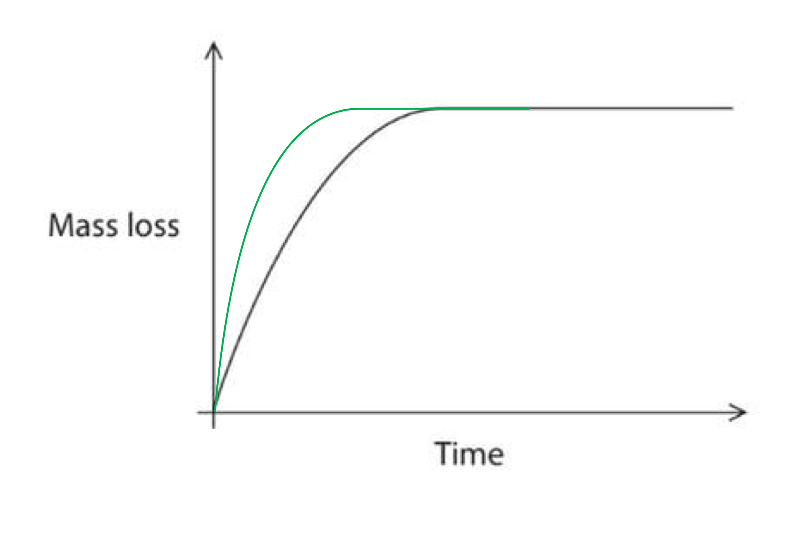

- Curve steeper than the original curve; **[1 mark]**
- Levels off at the same mass loss / place as the original curve; **[1 mark]**

**[Total: 2 marks]**

- *With smaller marble chips, the surface area increases leading to a quicker rate of reaction*
- *This is shown on the graph by a steeper initial gradient*
- *The total mass lost remains the same as the volume of hydrochloric acid used has remained the same, and this is the limiting reactant so it dictates the amount of product formed*

### 5((d)) — 6 marks
i) Increasing the concentration of the hydrochloric acid would:

- Increase the rate of reaction; **[1 mark]**
- (Because) there are more particles in the same volume / closer together; **[1 mark]**
- More (successful) collisions per unit time / more frequent (successful) collisions; **[1 mark]** 
*Ignore "chance" or "probability" of collisions*
*Allow "collisions per second"*
*Max 1 mark if there is any reference to particles moving faster or having more energy (this implies a confusion with temperature)*

ii) Increasing the temperature would:

- Increase the rate of reaction; **[1 mark]**
- As the (mean kinetic) energy of particles increases / particles move faster / have energy greater than (or equal to) the activation energy; **[1 mark]**
- More successful collisions per unit time 
**OR**
more frequent successful collisions 
**OR**
more frequent collisions between particles having ≥ activation energy; **[1 mark]**
*Requires reference to "successful" collisions or activation energy; "more frequent collisions" alone is insufficient here*
*Allow "More particles have energy ≥ activation energy"*
*Ignore "vibrate more"*

**[Total: 6 marks]**

- *When using collision theory to explain why the rate of reaction changes, remember not to just state that it increases due to 'more collisions'; you must give a reference to time within your response as rate is a measure of how many successful collisions there are per second*

## Q8 — medium — 14 marks · exam-questions

### 4((a)) — 1 marks
The balanced equation is:

- **2**H2O2 → **2**H2O + (**1**)O2; **[1 mark] **

**[Total: 1 mark] **

- *You are awarded marks for using multiples or fractions e.g. ½O**2*
- *To balance the equation:*

  - *H**2**O**2** → H**2**O + O**2** there are 2 oxygen atoms on the left and 3 oxygen atoms on the right hand side*
  - *Therefore add 2 in front of both H**2**O**2** and H**2**O to balance *
  - *2H**2**O**2** → 2H**2**O + O**2 **now there are equal numbers of each atom *

### 4((b)) — 1 marks
The test for oxygen is:

- Relights a glowing splint / spill; **[1 mark] **

**[Total: 1 mark] **

- *You need to know the tests for the following gases:*

  - *Hydrogen, oxygen, ammonia, chlorine and carbon dioxide *

### 4((c)) — 1 marks
A catalyst is added because:

- It speeds up / increases the rate of the reaction; **[1 mark] **

**[Total: 1 mark]**

- *The rate of decomposition of hydrogen peroxide is relatively slow, therefore a catalyst is added to speed up the reaction*
- *A catalyst speeds up a reaction by giving an alternative pathway that has a lower activation energy *

### 4((d)) — 6 marks
i) The completed graph is:

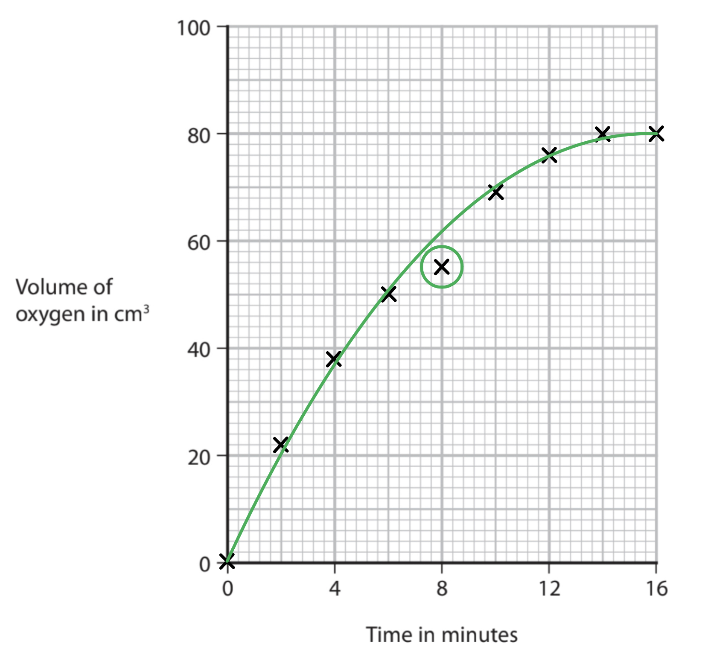

- All points plotted correctly; **[1 mark] **

ii) The anomalous result is:

- Point at 8 minutes circled; **[1 mark]**

iii) The line of best fit is:

- Smooth curve of best fit; **[1 mark] **

iv) The student's mistake was:

- Took the reading too soon / before 8 minutes; **[1 mark] **

v) The volume of oxygen gas formed at three minutes is:

- Vertical line on graph drawn to curve from 3 mins; **[1 mark]**
- Value obtained from candidate’s graph;** [1 mark] **

**Final answer:** **[Total: 6 marks] **

- *When plotting a graph:*

  - *Check the scale; on this graph*
  
    - *Every 5th small square on the x-axis is equivalent to 2 minutes *
    - *Every small square on the y-axis is equivalent to 2 cm**3** of oxygen gas*
  - *Plot with 'x's not '•'s as otherwise your plots will be covered up by the line of best fit and you will not be awarded the mark*
  - *Your line of best fit should follow the pattern on the plots, on this graph the line of best fit must be a smooth curve*
- *To gain the marks for part (v) you must draw two lines as shown below*

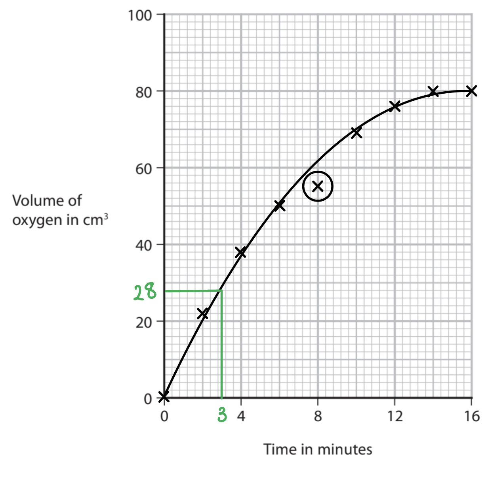

### 4((e)) — 5 marks
i) The expected curve is:

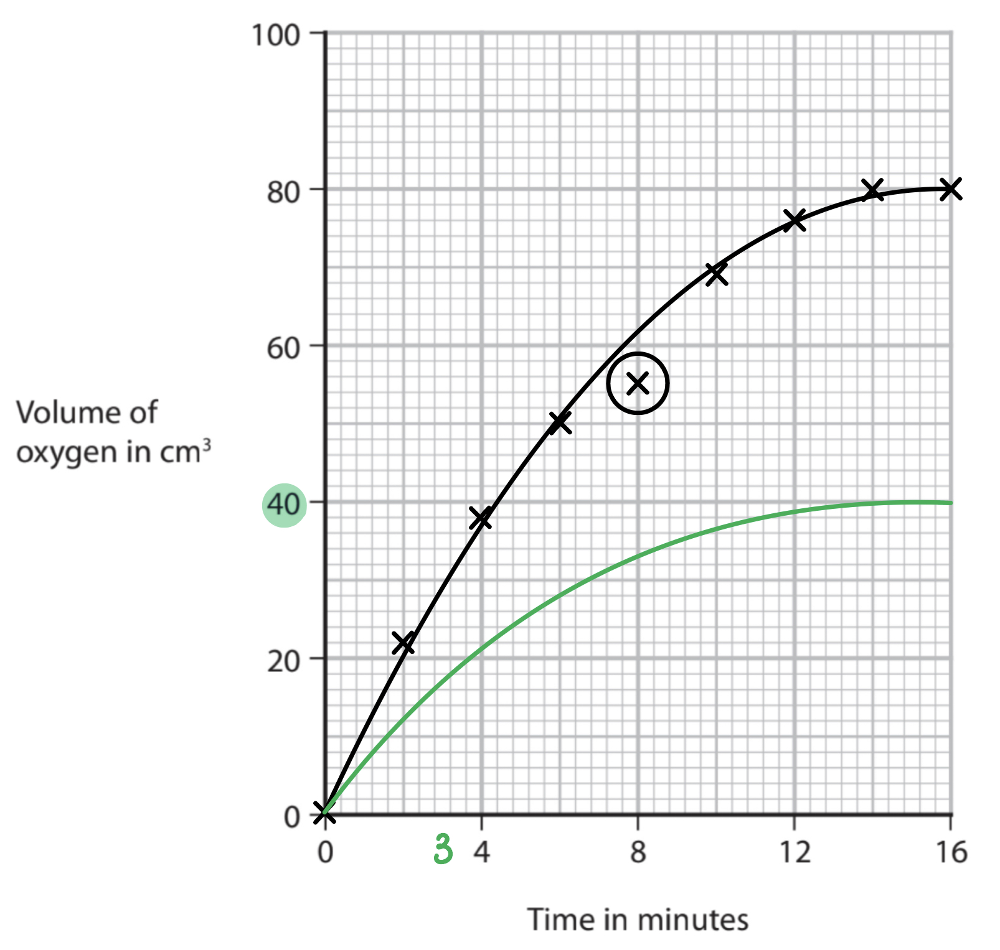

- Curve drawn on graph that is less steep than curve of student’s results; **[1 mark]**
- Curve levels off at 40 cm3; **[1 mark] **

ii) Halving the concentration affects the rates of reaction by:

An explanation that links the following three points

- Reaction is slower; **[1 mark] **
- Fewer particles / molecules (in the same volume); **[1 mark] **
- Fewer collisions per unit time; **[1 mark] **

**[Total: 5 marks] **

- *Halving the concentration of hydrogen peroxide means that there are half the number of hydrogen peroxide particles, therefore only half the volume of oxygen will be produced *

  - *80 ÷ 2 = 40 cm**3*
- *You should be able to explain how changing temperature, concentration (pressure), surface area and the addition of a catalyst will affect the rate of reaction *

## Q9 — medium — 1 marks · exam-questions

### 1() — 1 marks
**Correct answer: C** — Catalysts are not chemically changed during the course of the reaction

**Final answer:** **The correct answer is C**

- C / Catalysts are not chemically changed during the course of the reaction
- A catalyst is chemically unchanged by the end of the reaction but it can undergo changes during the reaction and then return to the original form

  - This also explains why the mass of a catalyst should remain unchanged at the end of the reaction
- Catalysts are added to reactions to speed up the rate of reaction by providing an alternative reaction pathway requiring lower activation energy

## Q10 — medium — 12 marks · exam-questions

### 6((a)) — 3 marks
i)  A chemical equation for this reaction:

Zn + 2HCl → ZnCl2 + H2

- Correctly symbols and formulae;** [1 mark]**
- Correctly balanced equation; **[1 mark]**

ii)  A test for hydrogen gas:

- A lighted splint makes a squeaky pop; **[1 mark]**

**[Total: 3 marks]**

- *Make sure you write what you mean- stating the 'pop test' without any detail would not get you the mark*

### 6((b)) — 3 marks
i)  To find the minimum volume of acid needed to react with all of the zinc:

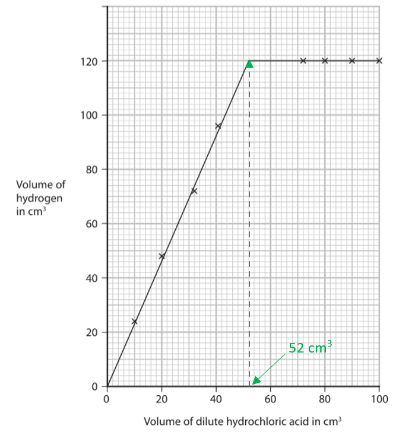

- Correct value from graph: 51.5-52.5 cm3; **[1 mark]**

ii)  The volume of hydrogen that would be collected using 15 cm3 of this acid:

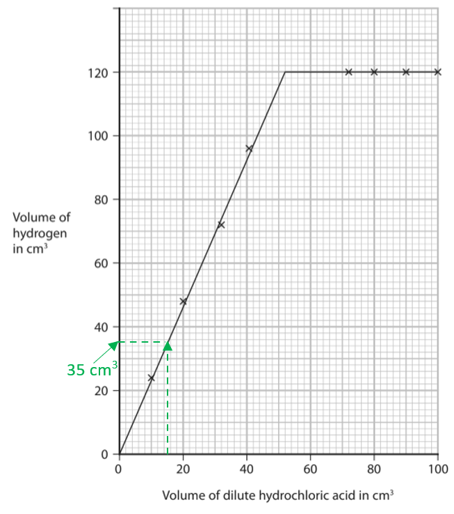

- Show a vertical line from 15 cm3 acid to graph line; **[1 mark]**
- The volume hydrogen from graph is multiplied by 2, e.g. 35 cm3 x 2 = 70 cm3; **[1 mark]**

**OR**

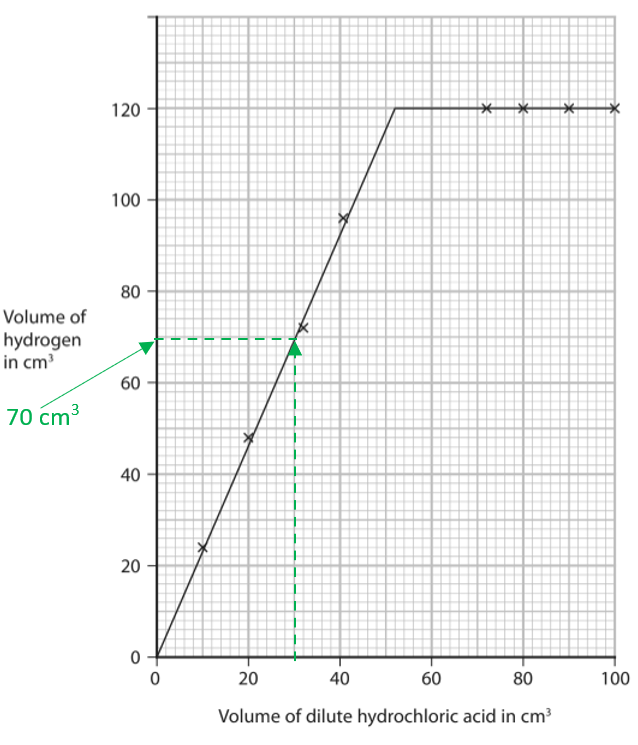

- Show a vertical line from 30 cm3 acid to graph line; **[1 mark]**
- Read volume hydrogen from graph, e.g. 70 cm3;** [1 mark]**

**[Total: 3 marks]**

- *Since the acid concentration has doubled, the number of moles in a given volume will also have doubled*
- *The volume of gas given off will also double, so all you need to do is find the volume on the original graph corresponding to 15 cm**3** and double it*
- *Alternatively you can double the volume of acid and read the corresponding volume of gas directly from the graph*
- *You would be allowed a value between 68-70 cm**3** which is not a great deal, so be careful to measure accurately from the graph*
- *Use a ruler or other straight edge to locate your vertical tie lines*

### 6((c)) — 3 marks
How increasing the concentration of the hydrochloric acid affects the rate of reaction:

- An increase in concentration means more (acid) particles / (hydrogen) ions / H+ in same volume; **[1 mark]**
- Therefore there are more (successful) collisions per second / unit time; **[1 mark]**
- **The rate of reaction increases; [1 mark]**

**[Total: 3 marks]**

- *You must use the correct terminology here of you will lose marks, e.g. using molecules when you mean ions or particles will cost you a mark*
- *Talking about more frequent collisions is another way to gain the second mark*
- *However, you must not state that the particles are moving faster or have more energy - that only happens with an increase in temperature, so mentioning those would lose you the second and third mark.*

### 6((d)) — 3 marks
One other way in which the rate of reaction between zinc and hydrochloric acid can be affected:

- Increase/decreasing the surface area can affect the rate; **[1 mark]**
- The increase surface area is achieved by using smaller pieces of zinc;** [1 mark]**
- There are more (successful) collisions per second / unit time (so the rate increases); **[1 mark]**

**[Total: 3 marks]**

- *You can express the second mark as an increase in the frequency of collisions*

## Q11 — medium — 15 marks · exam-questions

### 8((a)) — 1 marks
The completed equation for the reaction is:

- Zn (s) + H2SO4 (aq) → ZnSO4 (aq) + H2 (g); **[1 mark]**

**[Total: 1 mark]**

- *From the information and diagram in the question, you should be able to definitively give the state symbols of:*

  - *Zinc = solid as you are using granules*
  - *Hydrogen = gas *
- *You should know that acids are aqueous solutions*
- *This leaves the zinc sulfate *

  - *This must be aqueous as all sulfates are soluble except for barium, calcium and lead(II)*

### 8((b)) — 5 marks
i) The completed graph is:

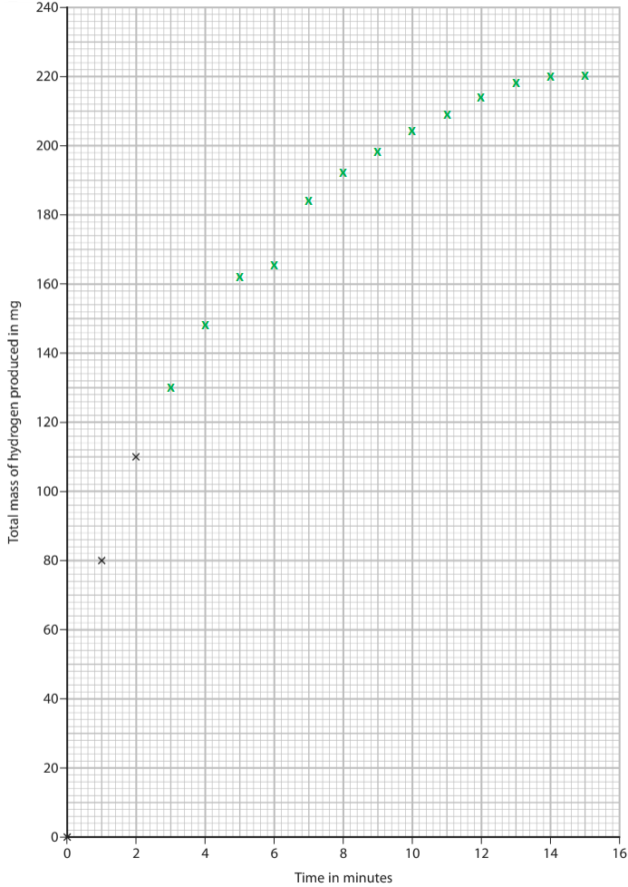

- All points correctly plotted (within ± half a square); **[1 mark]**

ii) The anomalous result is:

- The point at 6 minutes identified; **[1 mark]**

iii) The curve of best fit is:

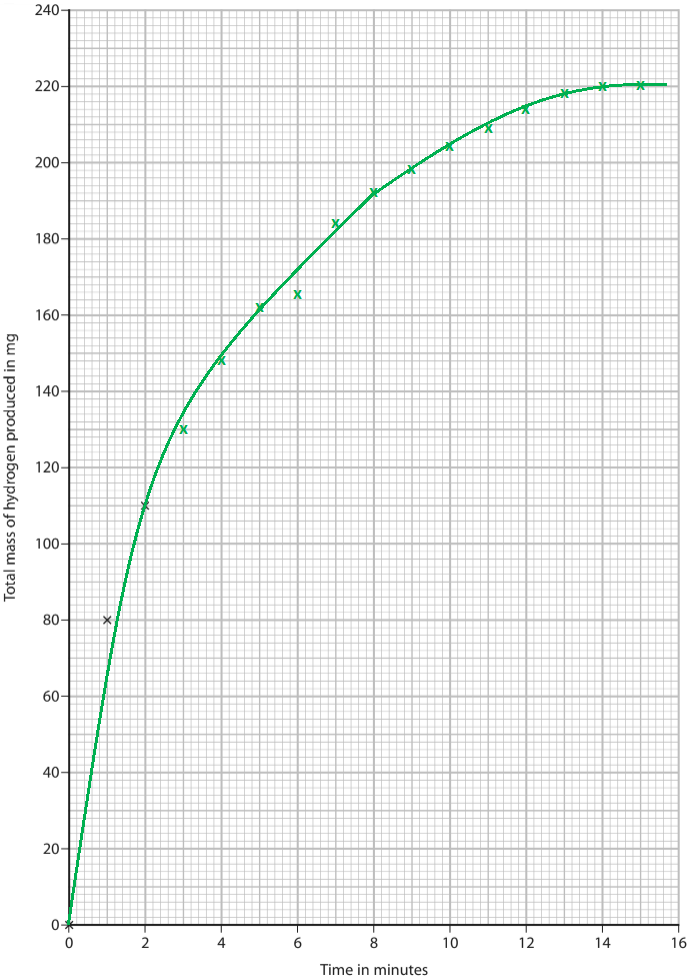

- Smooth curve of best fit; **[1 mark]**

iv) A possible reason for the anomalous result is:

- The student took the reading too soon **OR **The student took the reading before 6 minutes; **[1 mark]**

v) A more likely value for this result is:

- Value correctly read off from graph at x = 6 minutes; **[1 mark]** *Expected value is around 172 mg*

**[Total: 5 marks]**

- *Drawing graphs is an expected skill, so if you aren't confident then take some time to practice*
- *Anomalous results are ones that don't fit the pattern of the line / curve of best fit*
- *Common reasons for anomalous results include misreading results and taking measurements too early / late*

  - *You can either ignore anomalous results or repeat the experiment if you have the time / equipment to check the results*

### 8((c)) — 3 marks
i) How the shape of the curve shows how the rate of the reaction changes as time increases:

- The curve becomes less steep **OR **The gradient of the curve decreases; **[1 mark]**
- So the rate of reaction decreases; **[1 mark] ***The second mark is dependent on a correct first statement about the gradient of the curve*

ii) A conclusion the student could make from this observation is:

- The sulfuric acid was in excess **OR **Not all the sulfuric acid has reacted **OR **Zinc was the limiting reagent **OR **Zinc was not in excess; **[1 mark]**

**[Total: 3 marks]**

- *The gradient of the curve is directly linked to the rate of the reaction*

  - *This means that you need to make a statement about what happens to the gradient of the curve and then an associated statement about the rate of reaction*
- *If there is no zinc left at the end of the reaction, then the zinc is the limiting reagent or the sulfuric acid is in excess*

### 8((d)) — 3 marks
It is difficult to predict how the rate of reaction in this experiment compares with the rate of reaction in the first experiment, because:

- Using magnesium would make the reaction faster / increase the rate (as it is more reactive than zinc); **[1 mark]**
- Using less concentrated acid would make the reaction slower / decrease the rate (as there are less acid particles available for reaction);** [1 mark]** *Ideas about surface area and particle energy / speed are not accepted for either of the first two marks*
- It would be difficult / impossible to know if / how the rate will increase or decrease overall **OR **It would be difficult / impossible to know which change has more effect **OR **It would be difficult / impossible to predict the overall effect of changing two variables / factors at the same time **OR **It would be difficult / impossible to know if the changes cancel each other out; **[1 mark]**

**[Total: 3 marks]**

- *Any science investigation requires that you change only one variable / factor at a time *
- *Otherwise, you cannot determine which variable / factor caused any change in the results*

  - *This is especially true when the variables / factors will cause opposing changes, e.g. one causes an increase in rate and the other causes a decrease in rate*

### 8((e)) — 3 marks
Increasing the temperature affects the rate of a reaction by:

- Higher temperature means that the particles have more (kinetic) energy **OR **Higher temperature means that more particles have the required activation energy / energy greater than the activation energy / *E*$\geq$*E*a **OR** Higher temperature means that the particles are moving faster; **[1 mark]**
- So, there are more (successful) collisions per unit time **OR **So, there are more frequent (successful) collisions;** [1 mark]**
- (Therefore,) the rate of reaction increases; **[1 mark]**

**[Total: 3 marks]**

- *The basic explanation is that the particles are moving faster, which means that they collide more and the rate of reaction increases*

  - *This will not achieve full marks because there are some key points that examiners are looking for to award some of the marks*
- *An improved basic explanation that will achieve full marks is:*

  - *The particles are moving faster, which means that they collide more frequently and successfully and the rate of reaction increases*
  - *The inclusion of frequency of collisions is an absolutely key marking point*

## Q12 — medium — 1 marks · exam-questions

### 1() — 1 marks
**Correct answer: A** — 

**Final answer:** **The correct answer is A**

- The volume of hydrogen gas collected will increase as the reaction progresses
- The rate of reaction will decrease during the reaction as the reactant particles are used up; the gradient of the curve decreases
- The reaction ends when all of the magnesium is used up and no more gas is produced; the graph levels off

## Q13 — medium — 1 marks · exam-questions

### 1() — 1 marks
**Correct answer: C** — To prevent the acid from leaving the conical flask

**Final answer:** **The correct answer is C.**

- In this rate of reaction investigation, the change in mass of the contents of the flask as carbon dioxide is produced is monitored with time
- The cotton wool will allow gases to pass through it but will absorb any acid which may splash onto it during the reaction
- The mass of the reaction vessel will decrease with time as the carbon dioxide is given off and the rate can be determined

## Q14 — medium — 1 marks · exam-questions

### 1() — 1 marks
**Correct answer: B** — The rate of reaction speeds up during the reaction

**Final answer:** **The correct answer is B.**

- As the reaction progresses, the reactants are used up
- There are less frequent collisions between reactant particles as there are fewer reactant particles in a given volume
- The rate of reaction decreases
- A is incorrect as the volume of gas produced has levelled off at 30 seconds indicating that the reaction is complete
- C is incorrect as the volume of gas produced levels off at 60 cm3

## Q15 — medium — 1 marks · exam-questions

### 1() — 1 marks
**Correct answer: D** — Increase the volume of hydrochloric acid solution used

**Final answer:** **The correct answer is D.**

- Hydrochloric acid is already in excess in this reaction, so increasing the volume of the solution will not increase the rate of the reaction
- Increasing the temperature of the acid will increase the rate of the reaction as the particles will have more kinetic energy leading to more frequent successful collisions
- Increasing the surface area of the magnesium pieces will increase the rate of reaction as there will be more particles available to react which will lead to more frequent successful collisions
- Increasing the concentration of the acid will increase the rate of reaction as there will be more particles per unit volume leading to more frequent successful collisions

## Q16 — hard — 12 marks · exam-questions

### 13((a)) — 2 marks
i) The completed graph with points plotted is:

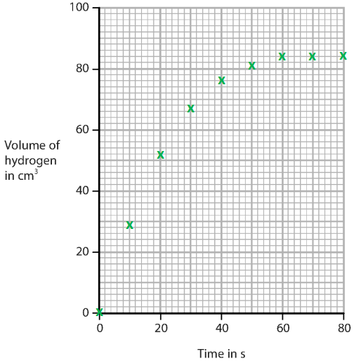

- All points plotted correctly to ± half a square; **[1 mark]**

ii) The curve of best fit is:

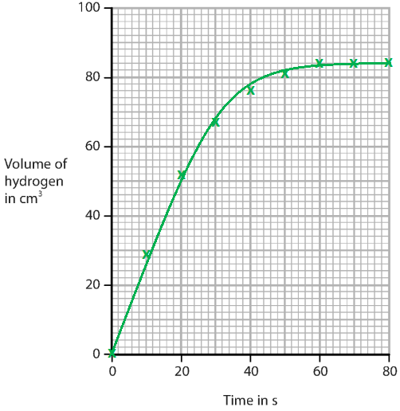

- Appropriate curve of best fit drawn for the points that are plotted; **[1 mark]**

**[Total: 2 marks]**

- *Plotting graphs is an expected skill so make sure you practice drawing graphs*

  - *Focus on making sure that you are plotting every point correctly *
  - *Lines or curves of best should go through as many points as possible or have a roughly equal number of points above and below the line*

### 13((b)) — 4 marks
i) Curve Y is:

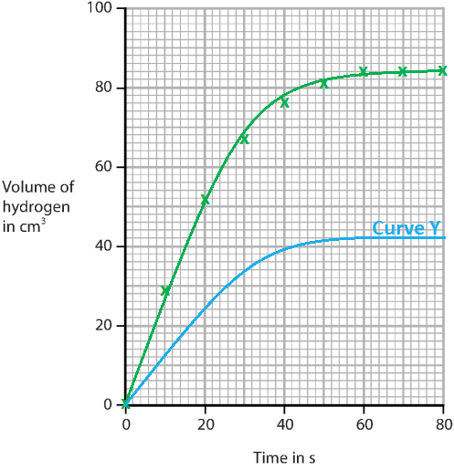

- Curve Y starts at the origin  **AND **Is always below the original curve; **[1 mark]**
- Curve Y levels off at 42 cm3 ± half a square; **[1 mark]**

ii) Curve Z is:

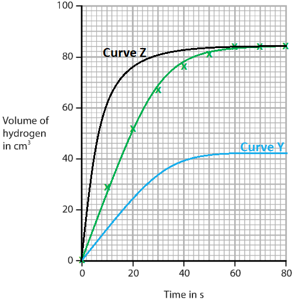

- Curve Z starts at the origin  **AND **Is always above the original curve; **[1 mark]**
- Curve Z levels off at 84 cm3 ± half a square; **[1 mark]**

**[Total: 4 marks]**

- *The experiment for curve Y is using half the mass of magnesium so it will be able to produce half the volume of hydrogen *
- *The experiment for curve Z uses the same amount of magnesium and acid so it will produce the same volume of hydrogen*

  - *It uses a higher temperature so it will release the same volume of hydrogen quicker, which means that it has a steeper gradient*

### 13((c)) — 1 marks
The volume collected is less than the expected volume because:

- Some gas escapes before the bung is replaced / before the syringe is connected *Some gas escapes on its own is not sufficient for the mark *
**OR** The magnesium is impure/ has an oxide coating *Magnesium doesn't fully react / reaction doesn't go to completion is ignored *
**OR **
Some gas dissolves in the solution / acid / water; **[1 mark]**

**[Total: 1 mark]**

- *When you are asked questions about results not appearing as expected, you should look at the diagram or method for the experiment *

  - *In this experiment, the amount of gas being produced is being measured*
  - *So, you should look at the diagram and ask yourself where can some gas be lost*
  - *Gas can be lost by:*
  
    - *Dissolving into the liquid*
    - *Being lost while the delivery tube is connected*

### 13((d)) — 2 marks
It is **not** necessary to use a measuring cylinder in this experiment because:

- The acid is in excess; **[1 mark]**
- Therefore, there a precise / accurate volume is not needed;** [1 mark]**

**[Total: 2 marks]**

- *A measuring cylinder would be used to measure the volume of dilute hydrochloric acid in this experiment *
- *The very first line of the entire question tells you that the acid is in excess, which means that there is no need to measure the volume precisely / accurately*

### 13((e)) — 3 marks
The rate of reaction decreases during each of the experiments because:

- The concentration of the acid / hydrogen ions / H+ decreases 
**OR **
There are fewer hydrogen ions / H+ in the same volume 
**OR **
The surface area of the magnesium decreases; **[1 mark]**
- Therefore, there are fewer (successful) collisions **[1 mark]**
- Per second / per unit time; **[1 mark]** 
*There are less frequent (successful) collisions or the (successful) collision rate is slower / lower scores both the second and third mark*

**[Total: 3 marks]**

- *The most common correct answers to this question focused on the idea of decreasing concentration*

  - *It appeared that most students were more confident applying their knowledge of collision theory to the concentration of acid than the surface area of the magnesium *
- *As the reaction progresses, the hydrogen ions form hydrogen gas*

  - *This leads to a decrease in the concentration of hydrogen ions*
  - *A lower concentration means that there are less collisions per second / unit time and, therefore, less successful collisions per second / unit time*
  - *Consequently, the rate of reaction is slower*
  - *Careful: **Make sure that you talk about the frequency of collision or include per second / per unit time in your answer as you will not achieve full marks otherwise*

## Q17 — hard — 14 marks · exam-questions

### 9((a)) — 4 marks
i) The mass of the contents of the flask decreases because:

- Carbon dioxide / CO2 / gas is released; **[1 mark]**

ii) The purpose of the cotton wool is:

- Prevent acid / liquid / solution / spray from escaping; **[1 mark]**

iii) Sulfuric acid is not a suitable acid to use in this investigation because:

An explanation that links at least two of the following points:

- (Insoluble) calcium sulfate forms; **[1 mark]**
- The calcium sulfate forms a layer / coating on the marble chips; **[1 mark]**
- Which slows down / prevents / stops the reaction; **[1 mark]** *The final mark can only be awarded with the first or second marking point*

**[Total: 4 marks]**

- *In these reactions, cotton wool is used to allow the gas to escape but contain the reactants*

  - *It is unlikely that the marble chips will escape as they should sink to the bottom of the flask*
- *If sulfuric acid was used, then the reaction would be:*

  - *Calcium carbonate + sulfuric acid → calcium sulfate + carbon dioxide + water*
  - *Calcium sulfate is insoluble and can coat the marble chips, which will stop them from being able to react*

### 9((b)) — 6 marks
i) The shape of the graph:

Alternative 1:

- The curve is steep / steepest at the start; **[1 mark]**
- Because the concentration (of the acid) is highest 
**OR **
Because this is when there are the most (acid) particles in the solution;** [1 mark]**
- The curve becomes less steep because the acid becomes more dilute 
**OR **
The curve becomes less steep because the concentration (of the acid) decreases 
**OR **
The curve becomes less steep because there are less (acid) particles in the solution; **[1 mark]**
- The curve levels off / plateaus because the acid has been used up / fully reacted; **[1 mark]**

Alternative 2:

- The curve is steep / steepest at the start; **[1 mark]**
- Because the reaction is fastest at the start; **[1 mark]**
- The curve becomes less steep because the reaction slows down; **[1 mark]**
- The curve levels off / plateaus because the acid has been used up / fully reacted; **[1 mark]**

ii) The curve the student would obtain is:

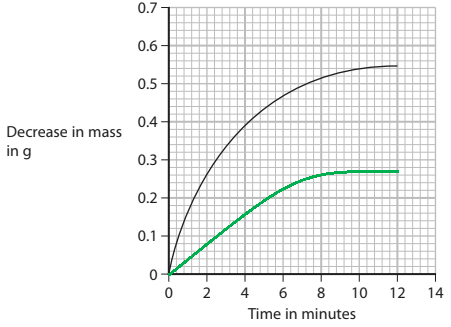

- Curve levels off at 0.27 g ± half a small square; **[1 mark]**
- Curve starts at the origin / (0,0) and remains below the original curve; **[1 mark]**

**[Total: 6 marks]**

- *To explain the shape of the curve, you first need to describe it*

  - *Steep at the start*
  - *Steepness decreases*
  - *Levels off*
- *Then you need to add the reasons for these points, which can in terms of reacting particles (collision theory style) or in terms of the rate or reaction as shown in the two alternative answers*

### 9((c)) — 4 marks
In terms of rate of reaction, increasing the temperature:

- Increases the rate of reaction; **[1 mark]**

Explanation:

Any **three** of the following:

- The particles gain (kinetic) energy 
**OR **
The particles move faster;** [1 mark]**
- (So,) there are more collisions per unit time 
**OR **
(So,) there are more frequent successful collisions;** [1 mark]**
- (So,) there are more collision / particles with energy above the activation energy / *E* ≥ *E*a; **[1 mark]**
- (So,) there are more successful collisions;** [1 mark]**

**[Total: 4 marks]**

- *Tip:** MFSC - simple statements like **M**ore **F**requent **S**uccessful **C**ollisions can help maximise your marks for this standard response to a rates question:*

  - *The particles gain energy. So, there are more frequent, successful collisions which cause the rate of reaction to increase*

## Q18 — hard — 7 marks · exam-questions

### 5((a)) — 1 marks
One other property of a catalyst is:

- A catalyst is chemically unchanged at the end of the reaction 
**OR** 
(it provides alternative route for reaction of) lower activation energy 
**OR** 
not used up in reaction; **[1 mark] **

**[Total: 1 mark] **

- *Catalysts can be extracted after a reaction and then reused*
- *This makes them really useful*
- *They are also powdered to further increase the rate of reaction as the surface area is greater*

### 5((b)) — 6 marks
Description including **six **of the following points:

- Do experiment using hydrogen peroxide solution only / without X/Y/Z; **[1 mark] **
- Use known volume of hydrogen peroxide solution; **[1 mark] **
- (And) measure time for certain volume of oxygen gas to be collected 
**OR **
Measure volume of gas collected in a certain time period; **[1 mark]**
- Repeat using same volume of hydrogen peroxide solution; **[1 mark]**
- With known mass/amount of solid X (then Y, then Z); **[1 mark]**
- Measure time for same volume of oxygen gas to be collected 
**OR **
Measure volume of gas collected in same time period (with solid/X/Y/Z present); **[1 mark]**
- After reaction (remove solid/X/Y/Z by filtration and dry) find mass of solid/X/Y/Z /check if mass unchanged; **[1 mark]**
- Reference to reduced time (for certain volume of oxygen gas to be collected) 
**OR** 
Increased volume of gas (collected in a certain time period) means X/Y/Z (possible) catalyst; **[1 mark] **

**[Total: 6 marks] **

- *This is a practical that you should be familiar with which is why it has been asked as an extended response question*
- *Make sure you make reference to specific measurements and your method is clear*

  - *Clear enough for someone to follow it and gain an accurate set of results  *
