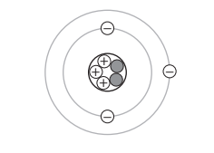
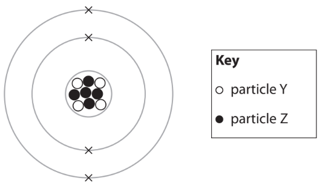
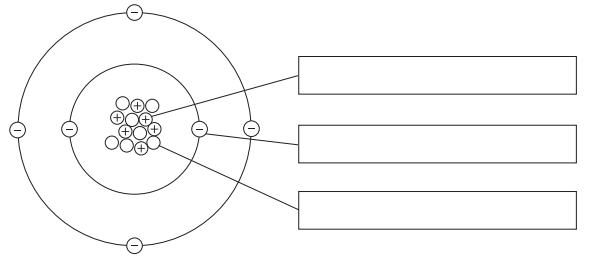
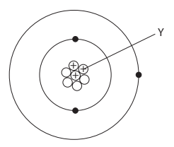
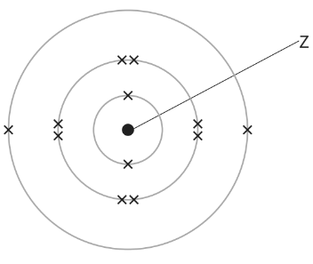
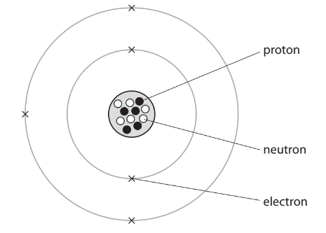

# Exam Questions — Atomic Structure
**1. Principles of Chemistry** · Edexcel IGCSE Science (Double Award) (4SD0) — 17/Chemistry
> Source: [https://www.savemyexams.com/igcse/science/edexcel/double-award/17/chemistry/topic-questions/principles-of-chemistry/atomic-structure/exam-questions/](https://www.savemyexams.com/igcse/science/edexcel/double-award/17/chemistry/topic-questions/principles-of-chemistry/atomic-structure/exam-questions/) · 15 questions · total 78 marks

## Q1 — easy — 5 marks · exam-questions

### 1((a)) — 1 mark — command: name — structured — from paper 2017 · Specimen1C
The diagram shows the structure of an atom.

Name the central part of an atom.

### 1((b)) — 1 mark — command: name — structured — from paper 2017 · Specimen1C
Name the positively charged particles in an atom.

### 1((c)) — 1 mark — command: state — structured — from paper 2017 · Specimen1C
State how the diagram shows that this atom is neutral.

### 1((d)) — 1 mark — command: give — structured — from paper 2017 · Specimen1C
Give the mass number of this atom.

### 1((e)) — 1 mark — command: give — structured — from paper 2017 · Specimen1C
Give the name of the element containing this atom. Use the Periodic Table to help you.

## Q2 — easy — 11 marks · exam-questions

### 2((a)) — 4 marks — command: multiple — structured — from paper 2021 · Ju1C
Table 1 gives some information about three subatomic particles.

i) Complete Table 1 by giving the missing information.

(3)

| **Subatomic particle** | **Relative mass** | **Relative charge** |
|---|---|---|
| electron | 0.0005 |   |
| proton |   | +1 |
| neutron | 1 |   |

**Table 1**

ii) Give the name of the part of the atom containing protons and neutrons.

(1)

### 2((b)) — 4 marks — command: multiple — structured — from paper 2021 · Ju1C
Table 2 shows the numbers of protons, neutrons and electrons in the species U, V, W, X, Y and Z.

| **Species** | **Number of protons** | **Number of neutrons** | **Number of electrons** |
|---|---|---|---|
| U | 8 | 10 | 8 |
| V | 9 | 10 | 10 |
| W | 11 | 12 | 10 |
| X | 11 | 12 | 11 |
| Y | 12 | 12 | 12 |
| Z | 12 | 13 | 12 |

**Table 2**

Use the information in Table 2 to answer these questions.

Each species may be used once, more than once or not at all.

i) Give the letter of the species that has six electrons in its outer shell.

(1)

ii) Give the mass number of Z.

(1)

iii) Give the letter of the species that is a positive ion.

(1)

iv) Give the letters of the two species that are isotopes of the same element.

(1)

### 2((c)) — 3 marks — command: calculate — structured — from paper 2021 · Ju1C
A sample of neon contains two isotopes, 20Ne and 22Ne

The relative abundances of the two isotopes in the sample are

20Ne    91.2%           22Ne    8.80%

Calculate the relative atomic mass of this sample of neon.

Give your answer to one decimal place.

relative atomic mass = ..............................

## Q3 — easy — 6 marks · exam-questions

### 1((a)) — 1 mark — multiple_choice — from paper 2020 · Ja1CR
The diagram shows the particles in the atom of an element.

Particle Y is a proton.

What is particle Z?
- **A.** an electron
- **B.** a molecule
- **C.** a neutron
- **D.** a nucleus

### 1((b)) — 1 mark — multiple_choice — from paper 2020 · Ja1CR
Which of these has the smallest mass?
- **A.** an electron
- **B.** a neutron
- **C.** a nucleus
- **D.** a proton

### 1((c)) — 1 mark — multiple_choice — from paper 2020 · Ja1CR
What is the mass number of this atom?
- **A.** 4
- **B.** 5
- **C.** 9
- **D.** 13

### 1((d)) — 1 mark — multiple_choice — from paper 2020 · Ja1CR
What is the atomic number of the atom in part a)?
- **A.** 4
- **B.** 5
- **C.** 9
- **D.** 13

### 1((e)) — 2 marks — command: multiple — structured — from paper 2020 · Ja1CR
i) Identify the element that contains this atom.

(1)

ii) State what is formed when this atom loses its outer shell electrons.

(1)

## Q4 — easy — 6 marks · exam-questions

### 1((a)) — 3 marks — command: label — structured — from paper 2019 · Ju2C
The diagram shows the particles in an atom of an element.

The box gives the names of some particles.

Use words from the box to label the diagram.

### 1((b)) — 1 mark — command: give — structured — from paper 2019 · Ju2C
Give the mass number of this atom.

### 1((c)) — 2 marks — command: complete — structured — from paper 2019 · Ju2C
Complete the sentence about isotopes.

Isotopes are atoms that have the same number of ..............................................................

but have a different number of .............................................................. .

## Q5 — easy — 5 marks · exam-questions

### 1((a)) — 3 marks — command: multiple — structured — from paper 2021 · Ja2C
The diagram shows an atom of an element.

i) What is the name of the particle labelled Y?

(1)

| **A** | electron |
|---|---|
| **B** | ion |
| **C** | neutron |
| **D** | proton |

ii) Give the mass number of this atom.

(1)

iii) Name this element. Use the Periodic Table to help you.

(1)

### 1((b)) — 2 marks — command: give — structured — from paper 2020 · Ja2C
There are two isotopes of this element.

Give one way, in terms of sub-atomic particles, that these isotopes are the same and one way that they are different.

same ..........................................................................................................

..........................................................................................................

different ....................................................................................................................................................................................................................

## Q6 — medium — 1 marks · exam-questions

### 1() — 1 mark — multiple_choice
The diagram below shows two different atoms of hydrogen.

Which particle is furthest from the centre of each atom?
- **A.** proton
- **B.** electron
- **C.** neutron
- **D.** nucleus

## Q7 — medium — 8 marks · exam-questions

### 2((a)) — 5 marks — command: complete — structured — from paper 2020 · Jan1C
The diagram shows the electronic configuration of an atom of an element.

Complete the table by giving the missing information about this atom.

| name of the part of this atom labelled Z |   |
|---|---|
| number of protons in this atom |   |
| number of the group that contains this element |   |
| number of the period that contains this element |   |
| the charge on the ion formed from this atom |   |

### 2((b)) — 3 marks — command: calculate — structured — from paper 2020 · Ja1C
This element has three isotopes. The table shows the mass number and percentage abundance of each isotope in a sample of this element.

| **Mass number** | **Percentage abundance (%)** |
|---|---|
| 24 | 79.2 |
| 25 | 10.0 |
| 26 | 10.8 |

Calculate the relative atomic mass (*A*r) of this element. Give your answer to one decimal place.

## Q8 — medium — 1 marks · exam-questions

### 1() — 1 mark — multiple_choice
The diagram below shows two different atoms of hydrogen.

Which particle is missing from one of the diagrams?
- **A.** electron
- **B.** proton
- **C.** neutron
- **D.** nucleus

## Q9 — medium — 11 marks · exam-questions

### 5((a)) — 2 marks — command: complete — structured — from paper 2022 · Jan1C
Complete the table to show the relative mass and relative charge of a proton and a neutron.

|   | **Proton** | **Electron** | **Neutron** |
|---|---|---|---|
| **Relative mass** |   | 1/2000 |   |
| **Relative charge** |   | –1 |   |

### 5((b)) — 8 marks — command: multiple — structured — from paper 2022 · Jan1C
Magnesium has three isotopes.

i) State the meaning of the term **isotopes**.

(2)

ii) The symbol for an atom of one isotope of magnesium is

`begin mathsize 14px style Mg presubscript 12 presuperscript 26 end style`

Give the number of protons, neutrons and electrons in one atom of this isotope.

(2)

number of protons ..............................

number of neutrons ..............................

number of electrons ..............................

iii) A sample of magnesium contains these percentages of the three isotopes.

Mg‐24 = 79.00%   Mg‐25 = 10.00%   Mg‐26 = 11.00%

Use this information to show that the relative atomic mass of magnesium is 24.32

(2)

iv) One mole of magnesium has a mass of 24.32 g.

There are 6.022 × 1023 atoms in one mole.

Calculate the mass, in grams, of one atom of magnesium.

Give your answer to 4 significant figures.

(2)

mass = .............................................................. g

### 5((c)) — 1 mark — command: determine — structured — from paper 2022 · Jan1C
The equation for the reaction between magnesium and oxygen is

2Mg + O2 → 2MgO

Determine the maximum amount, in moles, of magnesium oxide that can be produced from 0.50 mol of magnesium and 0.20 mol of oxygen.

amount = .............................................................. mol

## Q10 — medium — 1 marks · exam-questions

### 1() — 1 mark — multiple_choice
The atomic structure of an unknown element is shown below.

What is the atomic number and mass number for the unknown element?
- **A.** Atomic number =  6           Mass number = 11
- **B.** Atomic number =  5           Mass number = 11
- **C.** Atomic number =  5           Mass number = 6
- **D.** Atomic number =  6           Mass number = 10

## Q11 — medium — 7 marks · exam-questions

### 4((a)) — 1 mark — command: state — structured — from paper 2022 · Jan1CR
State the meaning of the term** atomic number**.

### 4((b)) — 3 marks — command: multiple — structured — from paper 2022 · Jan1CR
An atom of element X contains 14 protons, 14 electrons and 15 neutrons.

i) Which of these is the mass number of this atom?

(1)

| **A** | 14 |
|---|---|
| **B** | 15 |
| **C** | 28 |
| **D** | 29 |

ii) Explain which group of the Periodic Table element X belongs to.

(2)

### 4((c)) — 3 marks — command: calculate — structured — from paper 2022 · Jan1CR
The table shows the composition of a sample of a different element, Y, containing three isotopes.

| **Mass number of isotope** | ** Percentage of isotope in sample** |
|---|---|
| 32 | 95.0 |
| 33 | 0.75 |
| 34 | 4.25 |

Using information from the table, calculate the relative atomic mass (*A*r) of this sample of element Y.

Give your answer to one decimal place.

* A*r = ..............................

## Q12 — medium — 1 marks · exam-questions

### 1() — 1 mark — multiple_choice
The table shows information about the two isotopes of boron.

| **Isotope** | **Number of protons** | **Number of neutrons** | **Percentage isotope in sample** |
|---|---|---|---|
| 1 | 5 | 5 | 19 |
| 2 | 5 | 6 | 81 |

The relative atomic mass of this sample of boron is:
- **A.** 10.1
- **B.** 10.8
- **C.** 11.5
- **D.** 11.8

## Q13 — medium — 7 marks · exam-questions

### 2((a)) — 5 marks — command: complete — structured — from paper 2019 · Ju2CR
The diagram represents an atom of boron.

Use information from the diagram to complete the table. The first row has been done for you.

| atomic number | 5 |
|---|---|
| mass number |   |
| number of neutrons |   |
| group in the Periodic Table that contains boron |   |
| period in the Periodic Table that contains boron |   |
| electronic configuration of an atom of boron |   |

### 2((b)) — 2 marks — command: calculate — structured — from paper 2019 · Ju2CR
Boron has two isotopes, boron-10 and boron-11.

A sample of boron contains 18.7% of boron-10 and 81.3% of boron-11.

Calculate the relative atomic mass of this sample of boron.

## Q14 — medium — 1 marks · exam-questions

### 1() — 1 mark — multiple_choice
Which box contains only atoms?
- **A.** 
- **B.** 
- **C.** 
- **D.** 

## Q15 — medium — 7 marks · exam-questions

### 2((a)) — 1 mark — multiple_choice — from paper 2020 · N2CR
Thallium, Tl, is an element in Group 3 and Period 6 of the Periodic Table.

The atomic number of thallium is 81

How many electrons are there in the outer shell of an atom of thallium?
- **A.** 3
- **B.** 6
- **C.** 13
- **D.** 81

### 2((b)) — 1 mark — multiple_choice — from paper 2020 · N2CR
A thallium ion has a charge of 3+

How many electrons are there in this thallium ion?
- **A.** 3
- **B.** 78
- **C.** 81
- **D.** 84

### 2((c)) — 5 marks — command: multiple — structured — from paper 2020 · N2CR
A sample of thallium contains two isotopes.

The table shows the mass number and percentage abundance of each isotope in the sample.

| **Isotope** | **Mass number** | **Percentage abundance (%)** |
|---|---|---|
| thallium-203 | 203 | 30.80 |
| thallium-205 | 205 | 69.20 |

i) Give the number of protons and the number of neutrons in one atom of the thallium-205 isotope.

(2)

number of protons: ......................................................................

number of neutrons:  ...................................................................

ii) Calculate the relative atomic mass of this sample of thallium.

Give your answer to one decimal place.

(3)
