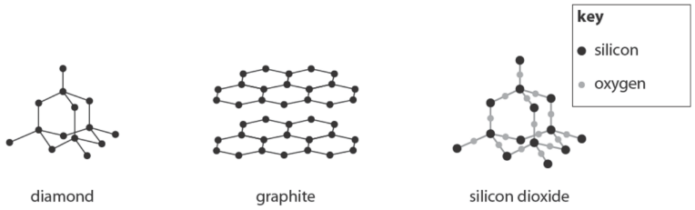
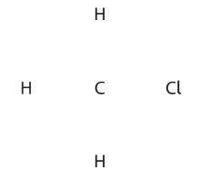
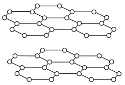
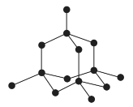
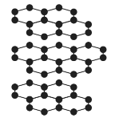
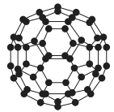
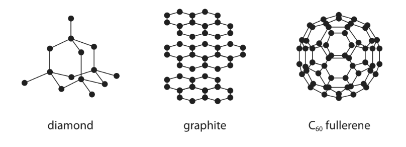

# Exam Questions — Covalent Bonding
**1. Principles of Chemistry** · Edexcel IGCSE Science (Double Award) (4SD0) — 17/Chemistry
> Source: [https://www.savemyexams.com/igcse/science/edexcel/double-award/17/chemistry/topic-questions/principles-of-chemistry/covalent-bonding/exam-questions/](https://www.savemyexams.com/igcse/science/edexcel/double-award/17/chemistry/topic-questions/principles-of-chemistry/covalent-bonding/exam-questions/) · 12 questions · total 81 marks

## Q1 — medium — 6 marks · exam-questions

### 7((a)) — 2 marks — command: explain — structured — from paper 2019 · Ju1C
Diamond, graphite and silicon dioxide all have giant covalent structures.

The diagram shows the structures of these three substances.

Explain why silicon dioxide has a high melting point.

### 7((b)) — 2 marks — command: explain — structured — from paper 2019 · Ju1C
Explain why graphite conducts electricity.

### 7((c)) — 2 marks — command: state — structured — from paper 2019 · Ju1C
State why diamond is hard but graphite is soft.

## Q2 — medium — 11 marks · exam-questions

### 8((a)) — 3 marks — command: multiple — structured — from paper 2020 · Ja1C
Carbon dioxide changes directly from a solid to a gas without becoming a liquid.

i) Give the name of the change of state from solid to gas.

(1)

ii) Describe the test for carbon dioxide gas.

(2)

### 8((b)) — 2 marks — command: explain — structured — from paper 2020 · Ja1C
Carbon dioxide is a simple molecular covalent substance. Explain why carbon dioxide turns from a solid to a gas at a very low temperature.

### 8((c)) — 6 marks — command: explain — structured — from paper 2020 · Ja1C
Diamond and graphite are both giant covalent substances made up of carbon atoms.

- diamonds are used in cutting tools
- graphite is used in pencils to make marks on paper

Explain, with reference to structure and bonding, why each substance is suitable for its particular use.

## Q3 — medium — 12 marks · exam-questions

### 5((a)) — 2 marks — command: explain — structured — from paper 2020 · Nov1C
Chlorine, bromine and iodine are elements in the Periodic Table.

Explain how the position of these elements in the Periodic Table depends on their electronic configurations.

### 5((b)) — 8 marks — command: multiple — structured — from paper 2020 · Nov1C
Chlorine reacts with methane to form CH3Cl and HCl

i) State the condition necessary for this reaction.

(1)

ii) Give the equation for this reaction.

(1)

iii) The bonds in a molecule of CH3Cl are covalent.

Explain, in terms of electrostatic attractions, what is meant by a covalent bond.

(2)

iv) Draw a dot‐and‐cross diagram for a molecule of CH3Cl

Show only the outer electrons of the atoms.

(2)

v) CH3Cl has a simple molecular structure.

Explain why CH3Cl has a low boiling point.

(2)

### 5((c)) — 2 marks — command: explain — structured — from paper 2020 · Nov1C
Graphite is another substance that contains covalent bonds.

The diagram shows the structure of graphite.

Most covalent substances do not conduct electricity.

Explain why graphite is able to conduct electricity.

## Q4 — medium — 9 marks · exam-questions

### 10((a)) — 4 marks — command: multiple — structured — from paper 2022 · Jan1C
This question is about substances with covalent bonds.

i) Draw a dot and cross diagram to show the outer shell electrons in a molecule of nitrogen, N2

(2)

ii) Describe the forces of attraction in a covalent bond.

(2)

### 10((b)) — 5 marks — command: multiple — structured — from paper 2022 · Jan1C
The diagram shows three different structures of carbon.

|  |  |  |
|---|---|---|
| Structure A | Graphite | C60 Fullerene |

i) Name structure A.

(1)

ii) Graphite and C60 fullerene contain covalent bonds, but have different structures.

Explain why C60 fullerene has a much lower melting point than graphite.

Refer to structure and bonding in your answer.

(4)

## Q5 — medium — 1 marks · exam-questions

### 1() — 1 mark — multiple_choice
Carbon dioxide contains covalent bonds.

The covalent bonds in a molecule of carbon dioxide can be represented by a dot-and-cross diagram.

Which is the correct dot-and-cross diagram for carbon dioxide?
- **A.** 
- **B.** 
- **C.** 
- **D.** 

## Q6 — medium — 11 marks · exam-questions

### 9((a)) — 3 marks — command: explain — structured — from paper 2019 · Ju1CR
Diamond is a naturally‐occurring form of carbon. It has a giant molecular structure. Explain, with reference to its structure and bonding, why diamond has a high melting point.

### 9((b)) — 3 marks — command: multiple — structured — from paper 2019 · Ju1CR
C60 fullerene is another form of carbon. The diagram shows a molecule of C60 fullerene.

i) Explain why C60 fullerene has a much lower melting point than diamond.

(2)

ii) C60 fullerene is used by doctors when injecting medicines into their patients. C60 fullerene allows medicines, which might damage some parts of the body, to reach the part of the body where they are needed.

Suggest why C60 fullerene is suitable for this purpose.

(1)

### 9((c)) — 5 marks — command: explain — structured — from paper 2019 · Ju1CR
Graphite is another naturally‐occurring form of carbon. Graphite can be used in pencils because it is soft and can leave marks on paper. Graphite can also be used as a conductor of electricity. Explain why graphite is soft and conducts electricity. Refer to structure and bonding in your answer.

## Q7 — medium — 11 marks · exam-questions

### 10((a)) — 4 marks — command: multiple — structured — from paper 2020 · Ja1CR
This question is about carbon and its compounds.

i) Draw a dot-and-cross diagram to show the outer shell electrons in a molecule of carbon dioxide, CO2.

(2)

ii) The atoms in carbon dioxide are held together by covalent bonds. Describe the forces of attraction in a covalent bond.

(2)

### 10((b)) — 7 marks — command: explain — structured — from paper 2020 · Ja1CR
The diagram shows three different structures of carbon.

i) Explain why graphite conducts electricity.

(2)

ii) Explain why diamond has a much higher melting point than C60 fullerene. Refer to structure and bonding in your answer.

(5)

## Q8 — medium — 1 marks · exam-questions

### 1() — 1 mark — multiple_choice
Silicon dioxide, SiO2, and silicon(IV) chloride, SiCl4, are both covalently bonded compounds.

The table below shows the melting point and boiling point of these compounds.

| **Compound** | **Melting point / ****o**** C** | **Boiling point / ****o**** C** |
|---|---|---|
| Silicon dioxide | 1710 | 2230 |
| Silicon(IV) chloride | -69 | 58 |

Which statement is **not** correct about the two compounds?
- **A.** at room temperature silicon dioxide is a solid and silicon(IV) chloride is a liquid
- **B.** silicon dioxide has a giant covalent structure
- **C.** silicon(IV) chloride has a lower melting point as it has fewer covalent bonds to overcome
- **D.** silicon(IV) chloride has a simple molecular structure

## Q9 — medium — 11 marks · exam-questions

### 8((a)) — 2 marks — command: which — structured — from paper 2020 · Nov1CR
This question is about some compounds of the elements in Group 4 of the Periodic Table.

When carbon dioxide dissolves in water, a weak acid forms.

i) Which of these could be the pH of this weak acid?

(1)

| **A** | 1 |
|---|---|
| **B** | 5 |
| **C** | 7 |
| **D** | 9 |

ii) Which of these is a correct statement about acids?

(1)

| **A** | acids contain OH− ions |
|---|---|
| **B** | acids are electron donors |
| **C** | acids are proton acceptors |
| **D** | acids are proton donors |

### 8((b)) — 2 marks — command: multiple — structured — from paper 2020 · Nov1CR
When lead(II) carbonate is heated, lead(II) oxide and carbon dioxide form.

i) Give the name of this type of reaction.

(1)

ii) Complete the equation for this reaction.

(1)

PbCO3 → .............................................. + ..............................................

### 8((c)) — 7 marks — command: multiple — structured — from paper 2020 · Nov1CR
Silicon dioxide, SiO2, and silicon(IV) chloride, SiCl4, are both covalently bonded compounds. The table shows the melting and  boiling points of these two compounds, and the physical state of silicon dioxide at room temperature.

| **Compound** | **Melting point in °C** | **Boiling point in °C** | **Physical state at** **room temperature** |
|---|---|---|---|
| SiO2 | 1710 | 2230 | solid |
| SiCl4 | −69 | 58 |   |

i) Complete the table by giving the physical state of silicon(IV) chloride at room temperature.

(1)

ii) Explain, in terms of structure and bonding, why silicon dioxide has a much higher melting point than silicon(IV) chloride.

(6)

## Q10 — medium — 1 marks · exam-questions

### 1() — 1 mark — multiple_choice
The diagram shows the structures of three substances that have giant covalent structures.

Which does **not **provide the correct explanation of the property of a substance?

|   | **Substance** | **Property** | **Explanation** |
|---|---|---|---|
| **A** | graphite | conducts electricity | its ions are free to move through the layers |
| **B** | diamond | hard | each carbon atom is covalently bonded to four other carbon atoms |
| **C** | silicon dioxide | high melting point | it has many strong covalent bonds which require a large amount of energy to break |
| **D** | graphite | soft | its layers can slide over each other |
- **A.** 
- **B.** 
- **C.** 
- **D.** 

## Q11 — medium — 1 marks · exam-questions

### 1() — 1 mark — multiple_choice
Ammonia, NH3, is a small covalent molecule.

How many **non-bonding**, outer-shell electrons are present in one molecule of ammonia?
- **A.** 0
- **B.** 2
- **C.** 5
- **D.** 6

## Q12 — hard — 6 marks · exam-questions

### 9((a)) — 2 marks — command: show — structured — from paper 2019 · Ju1C
Halon 1301 is a compound used in some fire extinguishers.

Halon 1301 has the percentage composition by mass of

C 8.05%   Br 53.69%   F 38.26%

Show, by calculation, that the empirical formula of this compound is CBrF3

### 9((b)) — 2 marks — command: draw — structured — from paper 2019 · Ju1C
The diagram shows the displayed formula of a molecule of Halon 1301.

Draw a dot-and-cross diagram to show all the outer electrons in this molecule.

### 9((c)) — 2 marks — command: explain — structured — from paper 2019 · Ju1C
The boiling point of Halon 1301 is —58°C.

Explain why Halon 1301 has a low boiling point.
