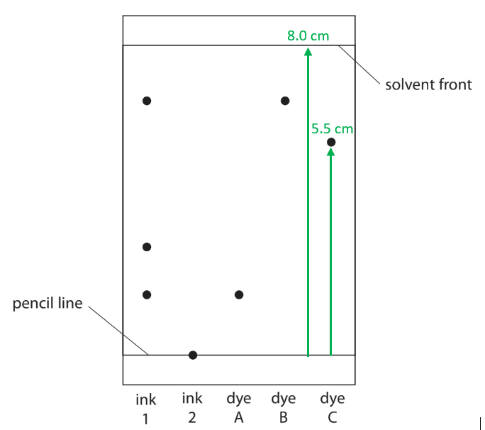
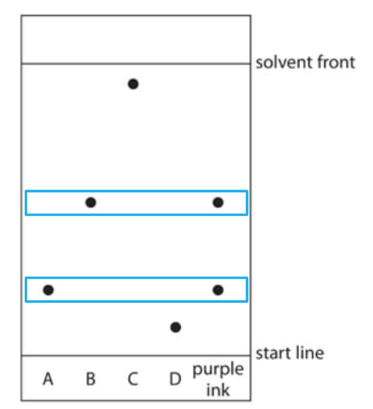
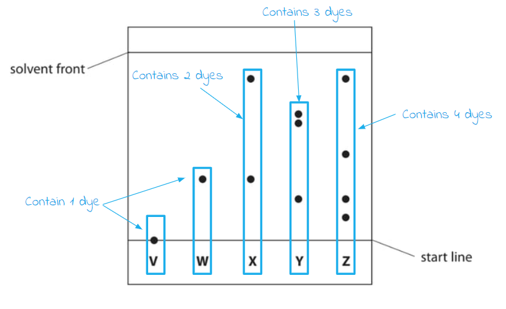
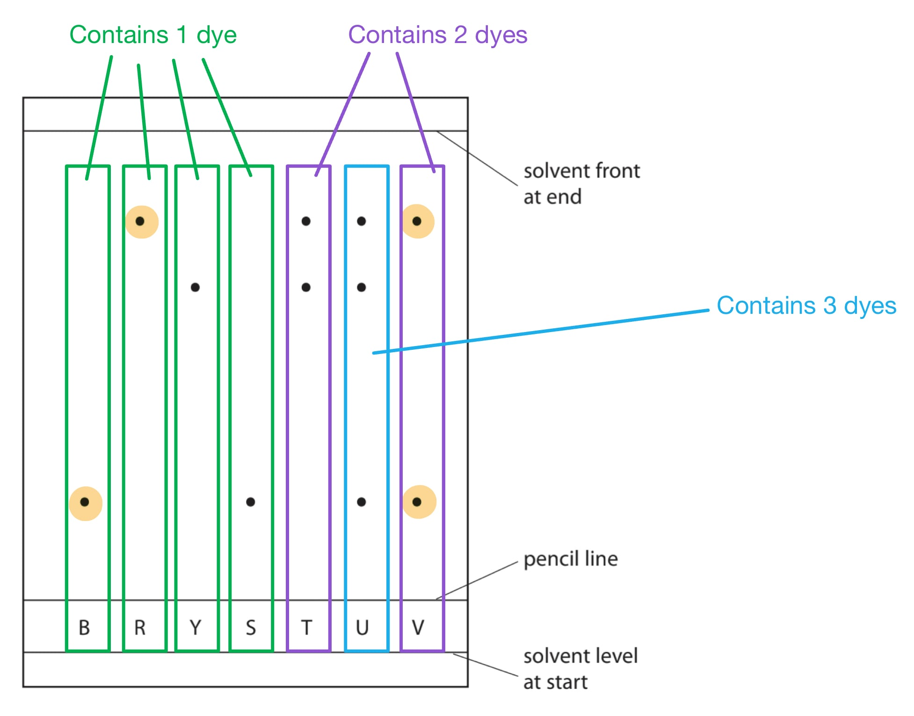

# Mark Schemes — Elements, Compounds & Mixtures
**1. Principles of Chemistry** · Edexcel IGCSE Science (Double Award) (4SD0) — 17/Chemistry

## Q1 — easy — 7 marks · exam-questions

### 2((a)) — 4 marks
i) The two boxes that represent an element are:

- Boxes 1 **AND **2; **[1 mark]**
- Because they both have only one type of atom / molecule; **[1 mark]**

ii) The two boxes that represent a mixture are:

- Boxes 3 **AND **5; **[1 mark]**
- Because they both have two different molecules; **[1 mark]**

**[Total: 4 marks] **

- *In this question, the elemental symbols have been used to show the atoms and molecules*

  - *e.g. H-H, H-O-H*
- *It is also common for the question to give shaded circles to represent different atoms and molecules *
- *Remember**: An element only contains 1 type of atom which means that it has one type of elemental symbol*

  - *In this case, H-H and He*
- *The mixtures will contain more than one type of atom to make up the molecule*
- *The molecules will not have chemical bonds between them*

### 2((b)) — 3 marks
i) Separating water from sodium chloride solution would be done by:

- Simple distillation;** [1 mark]**

ii) Separating the blue dye from a mixture of blue and red dyes would be done by:

- Chromatography; **[1 mark] **

iii) Separating potassium nitrate from potassium nitrate solution would be done by:

- Crystallisation; **[1 mark]**

**[Total: 3 marks] **

- *All of the scenarios given are mixtures and different methods are required to isolate the given compound*
- *If water needs to be collected from a mixture of sodium chloride solution we need to use simple distillation*

  - *The water would be evaporated by heating and the water vapour can then be collected and condensed *
- *Chromatography is a simple method that can be used to separate different dyes or pigments *
- *If potassium nitrate (crystals) are to be isolated from potassium nitrate solution (note that all nitrate salts are soluble) then we can heat the solution*

  - *Water does not need to be collected so we can just let it evaporate or heat until crystals form*

## Q2 — easy — 7 marks · exam-questions

### 1((a)) — 3 marks
i) The method to separate a single food dye from a mixture of food dyes is:

- Chromatography; **[1 mark]**

ii) The method to separate gasoline from crude oil is:

- Fractional distillation; **[1 mark]**

iii) The method to separate water from copper(II) sulfate solution is:

- Simple distillation; **[1 mark]**

**[Total: 3 marks]**

- *You should be aware of the various separation techniques that can be used:*

  - *Filtration - separating an insoluble solid from a liquid*
  - *Simple distillation - separating a mixture of liquids by boiling point*
  - *Fractional distillation - separating a mixture of liquids by boiling point*
  
    - *The mixture commonly contains a large number of components or components with relatively close boiling points*
  - *Chromatography - separating a mixture of liquids by solubility*
  - *Crystallisation - separating a soluble solid from a solution*

### 1((b)) — 2 marks
This molecule is a compound because:

- It contains two different atoms / elements; **[1 mark]**
- That are (chemically) joined / bonded together; **[1 mark]** *Descriptions of bonding are accepted*

**[Total: 2 marks]**

- *The basic definition of a compound is a chemical that contains two or more different types of atom / elements that are chemically joined together*

### 1((c)) — 2 marks
i) The number of different elements in C3H5N3O9 is:

- Four / 4; **[1 mark]**

ii) The number of atoms in a molecule of C3H5N3O9 is:

- Twenty / 20; **[1 mark]**

**[Total: 2 marks]**

- *To determine the number of elements in the compound, you simply count the number of unique chemical symbols from the Periodic Table*

  - *You can treat it as count the capital letters*
- *In the molecular formula, each small number belongs to the element before it, e.g.*

  - *C**3** means 3 carbons*
  - *H**5** means 5 hydrogens*
  - *N**3** means 3 nitrogens*
  - *O**9** means 9 oxygens*
  - *3 + 5 + 3 + 9 = 20*

## Q3 — easy — 6 marks · exam-questions

### 1((a)) — 3 marks
i) The method used to obtain pure water from sea water is:

- Simple distillation; **[1 mark]**

ii) The method used to separate the dyes in a food colouring is:

- Chromatography; **[1 mark]**

iii) The method used to obtain ethanol from a mixture of ethanol and water is:

- Fractional distillation; **[1 mark]**

**[Total: 3 marks] **

- *You should know about different separation techniques*

  - *Simple Distillation - used to separate a liquid and **soluble solid** from a solution (e.g., water from a solution of salt water) or a pure liquid from a mixture of liquids*
  - *Fractional Distillation - used to separate two or more liquids that are **miscible** with one another (e.g., ethanol and water from a mixture of the two)*
  - *Filtration - used to separate an **undissolved solid** from a mixture of the solid and a liquid / solution ( e.g., sand from a mixture of sand and water)*
  - *Crystallisation - separate a **dissolved solid** from a solution, when the solid is much more soluble in a hot solvent than in a cold solvent*
  - *Paper Chromatography - used to separate substances that have **different* *solubilities** in a given solvent (e.g., different coloured inks that have been mixed to make black ink)*

### 1((b)) — 3 marks
The completed sentences are:

- When salt is added to water and stirred until no more will **dissolve**, a saturated solution forms; **[1 mark]**
- The salt is the **solute**; **[1 mark]**
- The water is the **solvent**; **[1 mark]**

**[Total: 3 marks] **

- *You should know the difference between these terms and be able to use them correctly in extended response questions*

## Q4 — easy — 6 marks · exam-questions

### 1((a)) — 1 marks
A metallic element is:

- Copper;** [1 mark]**

**[Total: 1 mark]**

- *If you imagine a staircase going down and to the right with the top step being aluminium, then the metals are generally to the left of that staircase*

### 1((b)) — 1 marks
A compound is:

- Glucose or water; **[1 mark]**

**[Total: 1 mark]**

- *Remember:** Compounds contain more than one element chemically joined together*

  - *Glucose contains carbon, hydrogen and oxygen*
  - *Water contains hydrogen and oxygen*

### 3((c)) — 1 marks
A mixture is:

- Air; **[1 mark]**

**[Total: 1 mark]**

- *Air is a mixture of nitrogen and oxygen and a few other gases*

### 1((d)) — 1 marks
An element that is a gas at room temperature is:

- Nitrogen 
**OR **
Oxygen; **[1 mark]**

**[Total: 1 mark]**

- *All the Noble gases are obviously gases*
- *Fluorine and chlorine are the gaseous (at room temperature) halogens*
- *Oxygen, nitrogen and hydrogen are also gases (at room temperature)*

### 1((e)) — 1 marks
An element that forms a basic oxide is:

- Copper; **[1 mark]**

**[Total: 1 mark]**

- *Metals form basic oxides*
- *Non-metals for acidic or neutral oxides*.

### 1((f)) — 1 marks
Two elements that are in the same group of the Periodic Table are:

- Oxygen and sulfur; **[1 mark]**

**[Total: 1 mark]**

- *If elements are in the same group of the Periodic Table, then they are in the same column*

## Q5 — easy — 7 marks · exam-questions

### 2((a)) — 2 marks
What conclusions can be made about the composition of ink 1:

Any **two** from:

- Ink 1 contains three dyes; **[1 mark]**
- Dye A is present in ink 1; **[1 mark]**
- Dye B is present in ink 1; **[1 mark]**
- Dye C is not present in ink 1; **[1 mark]**

**[Total: 2 marks]**

- *You need to be able to interpret chromatograms*
- *Remember:** The number of components in a sample can be found by working vertically*
- *Remember: **The components of different samples can be compared by working horizontally*

### 2((b)) — 2 marks
i)  One conclusion that can be made about ink 2:

- Ink 2 does not dissolve in water;

**OR**

- Ink 2 does not contain any of the dyes A, B or C; **[1 mark]**

ii)  How the student could change the experiment to find the composition of ink 2:

- The student could repeat the experiment using a different solvent; **[1 mark]**

**[Total: 2 marks]**

- *When spots do not move from the baseline that tells you that the substance does not dissolve in that solvent*
- *The further the spot moves the more soluble it is*
- *Another suitable solvent could be something like ethanol*

### 2((c)) — 3 marks
The Rf value of dye C to 2 significant figures:

- Spot distance: 5.4 - 5.6 
**AND **
Solvent distance: 7.9 - 8.1; **[1 mark]**
- Rf = $\frac{\mathrm{distance} \mathrm{move} \mathrm{by} \mathrm{spot}}{\mathrm{distance} \mathrm{moved} \mathrm{by} \mathrm{solvent}}=\frac{5.5}{8.0}$; **[1 mark]**
- 0.69; **[1 mark]**

**[Total: 3 marks]**

- *You can get full credit for an answer without workings, but workings marks are available if you calculated the final R**f** value incorrectly*

## Q6 — easy — 8 marks · exam-questions

### 3((a)) — 2 marks
Two things that should be the same in both experiments so that the students can compare their results fairly are:

Any **two** of the following:

- Same solvent / water; **[1 mark]**
- (Same type of chromatography) paper;** [1 mark]**
- Use of pencil for the start line / baseline; **[1 mark]**
- All spots on the start line / baseline; **[1 mark]**
- Same distance travelled by the solvent / water;** [1 mark]**

**[Total: 2 marks]**

- *Chromatography is an all-time examiner favourite because there are so many little details that are missed*
- *This question also shows how examiners can use the idea of a fair test in their questions but you will not gain marks for using 'fair test' in your answers as it is not specific enough*
- *The best answers for this question will focus on control variables - things you should keep the same, which is why the solvent and chromatography paper are the first two answers *

### 3((b)) — 3 marks
i) The following conclusion can be made about dye C:

- It is insoluble (in the solvent / water); **[1 mark]**

ii) The *R**f* value that cannot be correct is:

- Student 2's dye D result / 1.20; **[1 mark]**
- (Because) *R**f* values cannot be greater than 1 
**OR **
(Because) *R**f* values must be less than 1; **[1 mark]**

**[Total: 3 marks]**

- *This question tests some points of chromatography that you are expected to know but may not have been specifically told*

  - *The **R**f** value is basically a measure of how far a dye / sample travels*
  - *Insoluble dyes / samples will always have an **R**f** value of 0 because they don't move*
  - *The solvent front has an **R**f** value of 1, which is the furthest that any dye / sample can travel*
  - *Therefore, it is not possible to have an **R**f** value above 1*

### 3((c)) — 3 marks
The *R**f* value for this food dye is:

- *R**f* = $\frac{9.7}{12}$; **[1 mark]**
- *R**f* = 0.808; **[1 mark]**
- *R**f* = 0.81 (to 2 s.f.); **[1 mark]**

**[Total: 3 marks]**

- *As this is a calculation question, there are some extra marking points:*

  - *Errors in the distance used (9.7) for the calculation don't score the first mark but can score the second and third marks by error carried forward *
  - *0.808 without working scores both of the first 2 marks*
  - *0.81 without working scores all 3 marks*
- *The most common error on **R**f** calculations is to have the numbers wrong, i.e. *$\frac{12}{9.7}$, *which gives a final answer that is greater than 1 / not possible*
- *Remember: **R**f** = *$\frac{\mathrm{distance} \mathrm{travelled} \mathrm{by} \mathrm{sample}}{\mathrm{distance} \mathrm{travelled} \mathrm{by} \mathrm{solvent}}$

## Q7 — easy — 5 marks · exam-questions

### 1((a)) — 1 marks
The element that burns with a lilac flame is:

- Potassium; **[1 mark]**

**[Total: 1 mark]**

- *This is one of the flame colours that you must learn*

### 1((b)) — 1 marks
The technique used to separate the mixture of colours in black ink is:

- Chromatography;** [1 mark]**

**[Total: 1 mark]**

- *Remember:** Chromatography is used to separate miscible liquids by solubility*

### 1((c)) — 3 marks
i) The compound is:

- Sodium chloride / NaCl; **[1 mark]**

ii) The mixture is:

- Air; **[1 mark]**

iii) The non‐metal element that is a solid at room temperature is:

- Sulfur / S; **[1 mark]**

**[Total: 3 marks]**

- *Remember**: A compound is two different types of atom chemically bonded whereas in a mixture the elements and compounds in a mixture are not chemically bonded *
- *Air consists of elements including oxygen and nitrogen, and compounds including carbon dioxide  *
- *You should know that sulfur is a non-metal solid but if not could do it by process of elimination- neon and bromine are not solids and therefore sulfur must be*

## Q8 — easy — 6 marks · exam-questions

### 1((a)) — 4 marks
i) The mixture is:

- B / Box 2; **[1 mark]**

ii) The two boxes which represent elements are:

- C / Boxes 1 and 3; **[1 mark]**

iii) Box 5 represents a compound because:

- (Box 5 shows) two (different) elements; **[1 mark]**
- Chemically bonded / joined;** [1 mark]**

**[Total: 4 marks]**

- *A mixture is a substance made up of different elements or compounds not chemically bonded together *
- *Boxes 1 and 3 are elements as they contain only one type of atom, represented by circles of the same colour*
- *Box 4 has a compound, represented by circles of different colours*
- *Box 2 has 2 different elements not chemically bonded together, whereas in box 5, the different elements are bonded together*

### 1((b)) — 2 marks
i) Elements in the Periodic Table are arranged by:

- C / increasing number of protons; **[1 mark]**

ii) Elements in the same group have the same number of:

- A / electrons in outer shell; **[1 mark]**

**[Total: 2 marks]**

- *The groups are the vertical columns in the Periodic Table, indicating the number of electrons in the outer shell *
- *Rows in the Periodic Table are known as periods and represent the number of shells*

## Q9 — medium — 1 marks · exam-questions

### 1() — 1 marks
**Correct answer: C** — a mixture of elements

**The correct answer is C**

- The sample of air is described as an Mixture of elements.
- The diagram shows that air is made of molecules of nitrogen and oxygen
- The molecules contain the same kind of atom so they are elements
- Air is therefore a mixture of elements

## Q10 — medium — 8 marks · exam-questions

### 4((a)) — 4 marks
Two mistakes the student made when setting up the experiment are:

Mistake 1:

- The baseline has been drawn in ink / not been drawn in pencil; **[1 mark]**
- It will contaminate / interfere with the results 
**OR **
It will produce other colours 
**OR **
It will (also) move up the paper 
**OR **
It will mix with the ink samples; **[1 mark]**

Mistake 2:

- The water (level) is above the ink spots / baseline 
**OR **
The water (level) is too high 
**OR **
The water (level) should be below the ink spots / baseline; **[1 mark]**
- The ink samples will mix with the water 
**OR **
The ink samples will dissolve in the water  
**OR **
The ink samples will wash off the (chromatography / filter) paper;** [1 mark]**

**[Total: 4 marks]**

- *Questions about the process of chromatography are frequently asked in exam questions because there are so many easy mistakes that are commonly made*

  - *Even though this is a practical that you will probably have done since starting high school*
- *Examiners will commonly be looking for pencil baselines, water / solvent levels below the baseline, sample spots not being too close*

### 4((b)) — 4 marks
i) The number of colours that ink D contains is:

- 3;** [1 mark]**

ii) The inks that could be mixed together to make ink D are:

- A and B; **[1 mark]**

iii) The ink that is insoluble in water is:

- C; **[1 mark]**
- (Because,) it did not move / stayed on the baseline;** [1 mark]**

**[Total:  4 marks]**

- *When you are asked about the components of an individual sample, you should work vertically*

  - *Ink D has three spots directly / vertically above it, so it contains three colours*
- *When you are asked to compare samples, you should work horizontally*

  - *Ink A contains one colour which is at the same level as the middle spot of ink D*
  - *Ink B contains two colours which are at the same level as the top and bottom spots of ink D*
- *If a sample does not move from the baseline, then it is insoluble in the solvent being used*

  - *You would have to change the solvent to make it move, which could result in other samples not moving*

## Q11 — medium — 9 marks · exam-questions

### 5((a)) — 4 marks
The completed table giving the correct method for each separation is:

| **Separation** | **Method** |
|---|---|
| insoluble solid from a liquid | filtration; **[1 mark]** |
| pure water from a solution | simple / fractional distillation; **[1 mark]** |
| liquid from a mixture of liquids with different boiling points | fractional distillation; **[1 mark]** |
| soluble solid from a solution | crystallisation; **[1 mark]** |

**[Total: 4 marks]**

- *You need to know all of these separation methods and when to use them*

### 5((b)) — 4 marks
i) The dyes that are contained in the purple ink are:

- A **AND** B; **[1 mark]**
- Because they are the same height / moved the same distance up the paper as the spots in the purple ink **OR **
Because they have the same *R*f values as the spots in the purple ink; **[1 mark]**

ii) The dye that is least soluble in the solvent is:

- D; **[1 mark]**
- Because the spot is closest to the start line / travelled the least distance (from the start line) 
**OR **
Because the spot has the lowest *R*f value; **[1 mark]**

**[Total: 4 marks]**

- *When using a chromatogram to identify dyes/inks from other samples, look at the spot horizontally to see if any match up*

- *From this you can see that:*

  - *The spot from the purple ink nearer the top of the paper matches a spot with sample B*
  - *The spot from the purple ink nearer the bottom of the paper matches a spot with sample A*
- *The distance the substances travel is determined by their solubility:*

  - *The more soluble they are in the solvent, the higher up the paper they travel*
  - *The less soluble they are, the shorter the distance they travel up the paper*
  - *If they are insoluble in the solvent used, they will remain on the start line*

### 5((c)) — 1 marks
The distance the food dye moves from the start line is:

- 120 × 0.72; **[1 mark]**
- 86 / 86.4 (mm); **[1 mark]**

**[Total: 2 marks]**

- *The R**f** value is calculated by the equation:*

  - *R**f** = *$\frac{\mathrm{distance} \mathrm{travelled} \mathrm{by} \mathrm{substance}}{\mathrm{distance} \mathrm{travelled} \mathrm{by} \mathrm{solvent}}$

- *In this question, you are given the R**f** value but need to calculate the distance travelled by the substance (the food dye)*
- *Substitute the values that you know into the equation for the R**f** value:*

  - $0.72=\frac{\mathrm{distance} \mathrm{travelled} \mathrm{by} \mathrm{food} \mathrm{dye}}{120}$

- *Rearrange to make the distance travelled by the food dye the subject:*

  - $\mathrm{distance} \mathrm{travelled} \mathrm{by} \mathrm{food} \mathrm{dye}=0.72\times120=86.4$

- *The units will be in mm*

## Q12 — medium — 1 marks · exam-questions

### 1() — 1 marks
**Correct answer: D** — 

**The correct answer is D**

- Fractional distillation is used to separate a mixture of liquids, particularly where the boiling points are quite close
- A shows filtration apparatus which is for separating a solid from a mixture of a solid and liquid
- B shows an evaporating basin for separating a solvent from a solution containing a dissolved solid
- C shows simple distillation apparatus which is best for separating a liquid from a solution

  - You could use it for a mixture of alcohol and water, but the distillate would not be very pure and would contain a lot of water
  - Note the question asks for the *most *suitable apparatus

## Q13 — medium — 10 marks · exam-questions

### 4((a)) — 7 marks
i) The student should complete the experiment after putting a spot of each food colouring on the paper by:

Any **three** of the following:

- Pour some solvent into a beaker / chromatography tank; **[1 mark]**
- Place the paper in the solvent so that the food colourings are above the level of the solvent;** [1 mark]** 
*The first two marks can be scored from a correctly labelled diagram*
- Leave the paper until the solvent reaches the level shown in the diagram 
**OR **
Leave the paper until the solvent has moved to near the top of the paper; **[1 mark]**
- Take the paper out and leave it to dry; **[1 mark]**

ii) The number of dyes in food colouring H is:

- One / 1; **[1 mark]**

iii) Food colouring F does not move during the experiment because:

- It is insoluble in the solvent  
**OR **
It does not dissolve in the solvent; **[1 mark]**

iv) The two food colourings that contain the dye that is likely to be the most soluble in the solvent are:

- E **AND **H; **[1 mark]**
- (Because) they contain the dye that travelled the furthest 
**OR **
(Because) they contain the dye that is closest to the solvent front 
**OR **
(Because) they contain the dye that has the largest Rf value; **[1 mark]**

**[Total: 7 marks]**

- *You need to be able to describe how to perform a chromatography experiment as this is a common exam question*
- *To determine the number of dyes in a sample, you should work vertically upwards from each sample's starting position, e.g.:*

  - *E contains 2 dyes*
  - *F contains 1 insoluble dye (as it doesn't move)*
  - *G contains 1 dye*
  - *H contains 1 dye*
- *Remember: *

  - *The more soluble a compound is, the further it will travel*
  - *In contrast, insoluble compounds will not move from the baseline / starting line*

### 4((b)) — 3 marks
The food colouring that contains a dye with an Rf value closest to 0.67 is:

- Dye G; **[1 mark]**

Working:

- Distance moved by the solvent = 3.2;** [1 mark]**
- Use of the Rf equation to calculate the distance required for an Rf value of 0.67: 
0.67 = $\frac{x}{3.2}$ 
So, x = 0.67 x 3.2 
*x *= 2.1; **[1 mark]**

**[Total: 3 marks****]**

- *Most chromatography calculation questions require you to determine the R**f** value of a particular spot using the R**f** equation:*

  - *R**f** = *$\frac{\mathrm{distance} \mathrm{travelled} \mathrm{by} \mathrm{the} \mathrm{sample}}{\mathrm{distance} \mathrm{travelled} \mathrm{by} \mathrm{the} \mathrm{solvent}}$
- *But, like this question, you can be expected to rearrange and apply the equation in slightly different ways*

## Q14 — medium — 8 marks · exam-questions

### 7((a)) — 1 marks
**Correct answer: C** — 1 and 3 only

**Final answer:** **The correct answer is C**

- A precipitate will form in 1 and 3 only.
- A precipitate of calcium sulfate will form in tube 1
- No precipitate will form in tube 2 as both products are soluble in water
- A precipitate of copper(II) carbonate will form in tube 3

### 7((b)) — 7 marks
i) The colour of the precipitate of silver chloride is:

- White;**[1 mark]**

ii) A method that the student could use to obtain pure, dry crystals of sodium nitrate is:

Any **five** of the following:

- Filter the solution; **[1 mark]**
- Heat / boil the solution / filtrate; **[1 mark]** 
*If all of the water is removed from the filtrate / solution, then a maximum of two marks can be awarded*
- Until crystals form in a cooled sample / on a glass rod 
**OR **
Until the crystallisation point / crystals start to form 
**OR **
Until some of the water has been removed / evaporated; **[1 mark]**
- Leave the solution to crystallise; **[1 mark]*** *
*This mark is dependent on the solution / filtrate being heated*
- Filter / decant the filtrate / solution; **[1 mark]**
- Dry the crystals between paper towel / in an oven / in a dessicator 
**OR **
Leave the crystals to dry; **[1 mark]** 
*Any direct method of heating, e.g. Bunsen burner does not achieve this mark Formation of silver chloride can score a maximum of 2 marks - one for filtering and one for drying*

iii) An advantage of mixing solutions containing equal amounts, in moles, of silver nitrate and sodium chloride is:

Any **one **of the following:

- To ensure the silver nitrate and sodium chloride are fully reacted; **[1 mark]**
- To ensure the reactants are all reacted / nothing is left unreacted; **[1 mark]**
- So that neither reagent is in excess; **[1 mark]**
- To make sure the products only contained silver chloride and sodium nitrate; **[1 mark]**
- To ensure the highest possible yield; **[1 mark]**
- To ensure that the sodium nitrate (crystals) are pure; **[1 mark]**
- If either chemical was in excess, then this would contaminate the sodium nitrate (crystals); **[1 mark]**

**[Total: 7 marks]**

- *You should know the colours of the precipitates of silver nitrate with the chloride, bromide and iodide ions*

  - *Chloride = white*
  - *Bromide = cream*
  - *Iodide = yellow*
  - *They get progressively more coloured as you move down the group *
  - *Or, if you arrange the ions and the colours side by side in alphabetical order, you will have the correct pairs:*
- *Methods to obtain pure, dry crystals is an Edexcel examiner favourite due to the level of detail required to score maximum marks*
- *For this reaction, you want to add equimolar amounts of the two chemicals so that the reaction is complete and no reactants are left over to contaminate the crystals / product*

## Q15 — medium — 1 marks · exam-questions

### 1() — 1 marks
**Correct answer: C** — 0.35

**Final answer:** **The correct answer is C**

- The *R**f* value of substance A is 0.35.
- To determine the *R**f*  value you use the formula

$\text{R}_{f}\text{=}\frac{\mathrm{distance} \mathrm{travelled} \mathrm{by} \mathrm{substance}}{\mathrm{distance} \mathrm{travelled} \mathrm{by} \mathrm{solvent}}$

- Choose the centre of the spot to measure from
- The baseline sits at 0.8 cm and the solvent front is at 7.9 cm so the distance the solvent has travelled is 7.1 cm
- The middle of the spot sits at 3.3 cm, so substance A has travelled 2.5 cm

## Q16 — medium — 15 marks · exam-questions

### 3((a)) — 4 marks
The student should set up and carry out her paper chromatography experiment as follows:

A description / diagram which makes reference to the following points

- Put (separate) spots of each of the inks on the (pencil) line; **[1 mark]**
- Pour some solvent into the bottom of the beaker; **[1 mark]**
- Place the paper in the beaker so that the spots are (just) above the level of the solvent; **[1 mark]** 
*Do not allow if words and diagram contradict each other*
- Leave until the solvent has risen up the paper (to the top / near the top and then take paper out); **[1 mark]** *allow leave until inks stopped separating* *allow leave until spots / dyes stopped moving* *ignore references to leaving for a specified length of time* *Allow water for solvent throughout* *If diagram show solvent above pencil line, only M1 and M2 can be scored* *Allow words to that effect for each mark*

**[Total: 4 marks]**

- *Paper chromatography is a common technique so you should know the necessary steps to perform this method*

### 3((b)) — 2 marks
The line on the paper is drawn in pencil rather than in ink because:

- The ink would / might dissolve in the solvent / water 
**OR** 
The pencil would not dissolve in the solvent / water; **[1 mark]**
- The ink would interfere with / get mixed up with / contaminate the results  
**OR **
The ink would produce spots / other colours 
**OR** 
The pencil would not interfere with / get mixed up with / contaminate the results 
**OR **
The pencil would not produce spots / other colours; **[1 mark]**

**[Total: 2 marks]**

- *For 2 marks, you need to state what would happen if the line was drawn in ink (i.e. it would dissolve in the solvent) **AND** explain why that is a problem*

### 3((c)) — 6 marks
For all parts, allow blob / dot / mark for spot

i) The ink that contains a dye that is insoluble in the solvent is:

- V; **[1 mark]**
- (Because) it stayed on the start line / did not move; **[1 mark]**

ii) The two inks that contain the dye that is likely to be the most soluble in the solvent are:

- X **AND **Z; **[1 mark]**
- (Because) they both have a dye / spot that travelled the furthest (up the paper) 
**OR **
(Because,) they both have a spot that is closest to the solvent front 
**OR **
(Because,) they have the highest *R*f vvalue; **[1 mark]**

iii) The two inks that may contain only one dye are:

- V **AND **W; **[1 mark]**
- (Because) they both only form one spot (on the paper) **OR **
(Because,) W only has one spot and you cannot tell about V (as it does not move / is insoluble) 
**OR **
The other inks / X, Y, Z form more than one spot; **[1 mark]**

**[Total: 6 marks]**

- *In parts (ii) and (iii), you cannot get the second mark without scoring the first mark *

  - *You might see this written as M2 DEP M1 on mark schemes*
- *Remember**: To identify the number of spots in a sample, work vertically*

- *Those dyes that are insoluble in the solvent used will not travel up the paper*
- *The more soluble the dye is in the solvent, the further it will travel up the paper*

### 3((d)) — 3 marks
the *R*f value for the dye in ink Y is:

- $R_{f}=\frac{\mathrm{distance} \mathrm{travelled} \mathrm{by} \mathrm{substance}}{\mathrm{distance} \mathrm{travelled} \mathrm{by} \mathrm{solvent}}=\frac{4.3}{6.5}$; **[1 mark]** 
*Allow 1 mark if correct equation for finding R*f *value is seen*
- *R*f = 0.6615; **[1 mark]**
- Final answer, *R*f = 0.66 to <u>2 significant figures</u>; **[1 mark]**

**[Total: 3 marks]**

- *A final answer of 0.66 with no working scores all 3 marks*
- *As the **R**f** value is a ratio of how far the substance has travelled compared with the solvent, the value cannot be greater than 1 as the substance cannot travel further than the solvent*
- *If you end up with a value that is greater than 1, check that you have divided the distance travelled by the substance by the distance travelled by the solvent - this is a common mistake*

## Q17 — medium — 5 marks · exam-questions

### 1((a)) — 1 marks
**Correct answer: B** — filtration

**The correct answer is **** ****B**

- B filtration is the correct answer because it will enable sand to be separated from salt solution
- A is not correct because crystallisation will not enable sand to be separated from salt solution
- C is not correct because fractional distillation will not enable sand to be separated from salt solution
- D is not correct because simple distillation will not enable sand to be separated from salt solution

### 1((b)) — 4 marks
i) The labels are:

- X is a thermometer; **[1 mark] **
- Y is a (Liebig) condenser;** [1 mark]**
- Z is a beaker; **[1 mark]**

ii) The substance remaining in the flask is:

- Salt: **[1 mark]**

**[Total: 4 marks] **

- *You should know about different separation techniques*

  - *Simple Distillation - used to separate a liquid and **soluble solid** from a solution (e.g., water from a solution of salt water) or a pure liquid from a mixture of liquids*
  - *Fractional Distillation - used to separate two or more liquids that are **miscible** with one another (e.g., ethanol and water from a mixture of the two)*
  - *Filtration - used to separate an **undissolved solid** from a mixture of the solid and a liquid / solution ( e.g., sand from a mixture of sand and water)*
  - *Crystallisation - separate a **dissolved solid** from a solution, when the solid is much more soluble in hot solvent than in cold*
  - *Paper Chromatography - used to separate substances that have **different* *solubilities** in a given solvent (e.g., different coloured inks that have been mixed to make black ink)*

## Q18 — medium — 1 marks · exam-questions

### 1() — 1 marks
**Correct answer: A** — stationary: chromatography papermobile: water

**The correct answer is A**

- The stationary and mobile phases for this experiment are: stationary= chromatography paper, mobile= water
- In paper chromatography, the mobile phase is the solvent and is therefore the water
- The stationary phase is the chromatography paper

## Q19 — medium — 7 marks · exam-questions

### 2((a)) — 1 marks
**Correct answer: A** — substance S

**The correct answer is A**** **

- A substance S is the correct answer because S only contains one dye as it produces only one spot
- B is not correct because T does not only contain one dye as it produces two spots
- C is not correct because U does not only contain one dye as it produces three spots
- D is not correct because V does not only contain one dye as it produces two spots

### 2() — 2 marks
The pure food dyes are in substance V are:

- (V contains) blue and red
**OR**
Allow **B** and **R**; **[1 mark]** If S is listed allow the mark as long as blue and red / B and R are given
Reject if Yellow / Y is listed
- (because the) spots are at the same height; **[1 mark]**

**[Total: 2 marks] **

- *If you stated S you would be allowed the mark as long as blue and red / B and R are given*
- *The number of dyes each sample contains is counted vertically *
- *The dyes contained in V match those in B and R, these are compared horizontally *

### 2((c)) — 4 marks
i) To calculate the *R**f* value:

- Correct measurement of distance moved by spot Y; **[1 mark]**
- Correct measurement of distance moved by solvent; **[1 mark]**
- Use and evaluation of *R**f* =$\frac{\mathrm{distance} \mathrm{moved} \mathrm{by} \mathrm{spot}Y}{\mathrm{distance} \mathrm{moved} \mathrm{by} \mathrm{solvent}}$; **[1 mark]**

ii) The chromatogram suggests that the yellow food dye Y is less soluble in the solvent than the red food dye R by:

- Spot from yellow food dye / Y does not move as far; **[1 mark]**
- As spot from red food dye / R; **[1 mark]**

**[Total: 5 marks] **

- *Use your ruler to measure the distance*

  - *make sure you take the measurement from the pencil line for the movement of the dye*
  
    - *5.7-6.1 cm is acceptable *
  - *make sure you take the measurement from the solvent front for the movement of the solvent*
  
    - *8.7-9.1 cm is acceptable *
- *The more soluble the dye, the further it will travel up the paper*
- *If it is insoluble it will not travel at all*

## Q20 — medium — 1 marks · exam-questions

### 1() — 1 marks
**Correct answer: B** — filtration

**The correct answer is **** ****B**

- (B) Filtration
- A sand-salt solution mixture consists of a solid and liquid so she must use filtration to separate the sand

## Q21 — medium — 9 marks · exam-questions

### 2((a)) — 2 marks
Two changes the student should make are:

- The level of the water must be below the dyes / start line; **[1 mark]**
- The start line must be drawn in pencil; **[1 mark]**

**[Total: 2 marks]**

- *You should be familiar with the set up of a chromatography equipment*
- *The start line must be drawn in pencil as ink will run up the chromatography paper with your sample*
- *If the water is above the dyes, it will cause them to dissolve in the water*

### 2((b)) — 7 marks
i)The chromatogram shows:

Any **two** conclusions from:

Dye E:

- Contains (dye) B and (dye) D; **[1 mark]**
- Contains an unknown dye; **[1 mark]**
- Does not contain A or C; **[1 mark]**
- Contains three dyes; **[1 mark]**

Explanation:

- 1 mark for a correct explanation of given conclusion for the green food colouring; **[1 mark]** 
e.g. (explanation for M1) because has spots at same level (as B and D);  
e.g. (explanation for M2) because has a spot at different level (from A B C D) e.g. (explanation for M3) because has no spots at same level (as A and C)

ii) The *R*f value is:

- (Distance moved by solvent correctly measured)= 9.5 cm ±2 cm; **[1 mark]**
- Use of equation $\frac{\mathrm{Distance} \mathrm{moved} \mathrm{by} \mathrm{dye}}{\mathrm{Distance} \mathrm{moved} \mathrm{by} \mathrm{solvent}}$; **[1 mark]** 
e.g. $\frac{6.2}{9.5}$
- Evaluation of *R*f; **[1 mark]** 
e.g. $\frac{6.2}{9.5}=0.65(3)$

iii) Dye A does not move because:

- It is not soluble in water; **[1 mark]**

**[Total: 7 marks]**

- *To determine which dyes are present in the green food colouring, look to see whether the dots are horizontally in line with one another, in this case, B and D*
- *The number of dots for the green food colouring indicates the total number of dyes present*
- *In the case of the green food colouring, there are three dots so the substance contains three dyes and is a mixture*
- *One dot would indicate the sample is pure*
- *When the solvent moves over the dyes, they will dissolve in the solvent and be carried up the paper*
- *If the sample has not moved, this is due to it not being soluble in that particular solvent, sometimes a different solvent can be used *
- *You must learn the equation to calculate the **R**f** value, and remember, your answer should always be less than 1*
- *Make sure you read the question carefully, as sometimes you could be asked to provide the distances moved by the solvent and dyes in mm *

## Q22 — hard — 14 marks · exam-questions

### 14((a)) — 1 marks
The acid is warmed in stage 2 to:

- Speed up / increases the rate of reaction; **[1 mark]**

**[Total: 1 mark]**

- *Warming suggests that energy is being supplied to the acid*
- *An increase in thermal energy means that particles are moving faster, colliding more frequently and leading to a faster rate of reaction*

### 14((b)) — 1 marks
The student would know that the copper(II) oxide is in excess in stage 4 because:

- (The copper(II) oxide / it) stops disappearing / dissolving 
**OR **
The mixture turns cloudy (black)* *
**OR **
Some (black) solid / copper(II) oxide settles (at the bottom of the beaker); **[1 mark]**

**[Total: 1 mark]**

- *The copper(II) oxide is the insoluble base / solid*
- *It is being added to the acid and reacting to use the acid up*
- *Once all the acid has been used up, the copper(II) oxide will simply remain in the solution*

### 14((c)) — 1 marks
The mixture is filtered in stage 5 to:

- Remove any unreacted / excess copper(II) oxide 
**OR **
Separate the copper(II) sulfate solution from the unreacted / excess copper(II) oxide; **[1 mark]**

**[Total: 1 mark]**

- *In your answer, you can use the word solid instead of copper(II) oxide*
- *You should know that filtering is performed to remove an insoluble solid from a liquid / solution*

### 14((d)) — 1 marks
The colour of the filtrate obtained in stage 5 is:

- Blue; **[1 mark]**

**[Total: 1 mark]**

- *The reaction of copper(II) oxide with sulfuric acid forms copper(II) sulfate and water*
- *You are expected to know that copper(II) sulfate solution is blue*

### 14((e)) — 5 marks
A student could obtain a pure, dry sample of hydrated copper(II) sulfate crystals from the filtrate in stage 6 by:

- Heating / boiling the filtrate / solution; **[1 mark]**
- Until crystals form in a cooled sample / on a glass rod 
**OR **
Until the crystallisation point / crystals start to form 
**OR **
Until some of the water has been removed; **[1 mark]**
- Leave the solution to crystallise; **[1 mark]**
- Filter / decant the filtrate / solution; **[1 mark]**
- Dry the crystals between paper towel / in an oven / in a dessicator 
**OR **
Leave the crystals to dry; **[1 mark]**

**[Total: 5 marks]**

- *Crystallisation is a common technique covered in longer exam questions*
- *It has some common extra marking points:*

  - *Step 1 - If all of the water is removed from the filtrate / solution, then a maximum of one mark can be awarded*
  - *Step 3 - If the filtrate / solution is completely evaporated, then a maximum of three marks can be awarded*
  - *Step 5 - Any direct method of heating, e.g. Bunsen burner does not achieve this mark*
  - *Step 5 - This final mark cannot be awarded if the crystals are washed after they have been dried*
- *The basic steps are:*

  - *Heat the solution*
  - *Until some water boils off*
  - *Leave the solution to cool*
  - *Filter the crystals*
  - *Dry the crystals*
- *A large number of students will:*

  - *Boil the solution to dryness / remove all the water - this produces powder rather than crystals, assuming that they do not thermally decompose*
  - *Forget to mention about crystals forming*
  - *Filter, dry and then wash the crystals - they will dissolve back into a solution*

### 14((f)) — 5 marks
i) To show that the maximum possible mass of CuSO4.5H20 crystals that can be obtained is about 30 g:

Method 1:

- Moles of CuO = $\frac{9.54}{79.5}$ 
**OR **
Moles of CuO = 0.120 (moles); **[1 mark]**
- Mass of CuSO4.5H2O = 0.120 x 249.5 
**OR **
Mass of CuSO4.5H2O = 29.94 (g);**[1 mark]**
- Final answer = 29.9 (g); **[1 mark]**

Method 2:

- 79.95 → 249.5 (g); **[1 mark]**
- 9.94 → $\frac{249.5}{79.5}\times9.54$ 
**OR **
29.94; **[1 mark]**
- Final answer = 29.9 (g); **[1 mark]**

ii) To calculate the percentage yield of CuSO4.5H2O:

- $\frac{23.92}{29.9}\times100$; **[1 mark]** 
*The correct use of the final answer from part (i) can score both marks*
- 80%; **[1 mark]**

**[Total: 5 marks]**

- *In part (i)*

  - *An answer of 29.94 with no working scores 2 marks*
  - *An answer of 29.9 with no working scores all 3 marks*
- *In part (ii)*

  - *Any number of significant figures can be given*
  - *The correct answer with no working scores 2 marks*
- *There are two possible approaches to this reacting masses question:*

  1. *The moles approach*
  
    - *Calculating the moles of CuO in 9.54 g *
    - *Use the equation to determine that 1 mole of CuO makes 1 mole of CuSO**4**.5H**2**O*
    - *Apply the number of moles of CuO to CuSO**4**.5H**2**O to calculate the mass*
  2. *The ratio / scaling approach*
  
    - *From the equation, 1 mole of CuO makes 1 mole of CuSO**4**.5H**2**O*
    - *You are given the mass, so you know that 79.5 g of CuO makes 249.5 g of CuSO**4**.5H**2**O*
    - *Scale this down to 1 g of CuO by dividing both numbers by 79.5*
    - *Then scale it up to 9.54 g of CuO by multiplying both numbers by 9.54 and therefore get the mass of CuSO**4**.5H**2**O made*

## Q23 — hard — 13 marks · exam-questions

### 10((a)) — 2 marks
The word equation for this reaction is:

red lead oxide → lead(II) oxide + oxygen

- Lead(II) oxide; **[1 mark]**
- Oxygen; **[1 mark]**

**[Total: 2 marks]**

- *Using the information in the question, you should deduce that the yellow solid is lead(II) oxide / PbO*

  - *2Pb**3**O**4** → 6PbO + O**2*
- * You can deduce that the gas is likely to be oxygen as this is the only potential gas from the elements involved in the reaction (Pb and O)*

### 10((b)) — 3 marks
The calculation to show that the empirical formula of this compound is PbO2:

- Lead: $\frac{86.6}{207}$ **AND **Oxygen: $\frac{13.4}{16}$; **[1 mark]**
- Lead: 0.42 **AND **Oxygen: 0.84; **[1 mark]**
- Lead: `begin mathsize 14px style open parentheses fraction numerator 0.42 over denominator 0.42 end fraction close parentheses end style` = 1 **AND **Lead: `begin mathsize 14px style open parentheses fraction numerator 0.84 over denominator 0.42 end fraction close parentheses end style`= 2; **[1 mark]**

**[Total: 3 marks]**

- *Empirical formula calculations follow the same steps regardless of the compound*
- *1* |   | > *Write the elements* | > *Pb* | > *O* |
|---|---|---|---|
| > *2* | > *Write the values from the question (can be % or g)* | > *86.6* | > *13.4* |
| > *3* | > *Write the atomic mass* | > *207* | > *16* |
| > *4* | $\frac{\mathrm{Value}}{\mathrm{Atomic} \mathrm{mass}}$ | > *0.42* | > *0.84* |
| > *5* | > *Ratio (divide the answers by the smallest value)* | > $\frac{0.42}{0.42}$* = 1* | > $\frac{0.84}{0.42}$* = 2* |
| > *6* | > *Write the empirical formula* | > *Pb* | *O**2* |
- *Edexcel like to give questions asking you to prove an empirical formula and these are answered surprisingly badly, even though you have the final answer to work towards*

### 10((c)) — 8 marks
i) The completed chemical equation for the reaction is:

Pb3O4 **(s)** + 4HNO3 **(aq)** → **2**Pb(NO3)2 (aq) + PbO2 (s) + **2**H2O (l)

- Correct state symbols for reactants; **[1 mark]**
- Correct balancing for products; **[1 mark]**

ii) The student could obtain a pure dry sample of lead(II) nitrate crystals by:

- Warm / heat the nitric acid; **[1 mark]** 
*Boil is not accepted*
- Add / mix in / react the (red) lead oxide / Pb3O4; **[1 mark]** *Comments about stirring and the use of excess red lead oxide are ignored*
- Filter (the mixture) to get lead(II) nitrate solution 
**OR **
Filter to remove the lead(IV) oxide / PbO2  
**OR **
Filter to remove (any unreacted / excess) red lead oxide / Pb3O4; **[1 mark]**

Plus, any **three** of the following:

- Heat / boil the (lead(II) nitrate) solution / filtrate; **[1 mark]** 
*No further marks can be scored if the lead(II) nitrate solution / filtrate is boiled to dryness*
- Until crystals form in a cooled sample / on a  glass rod 
**OR **
Until saturation / crystallisation point 
**OR **
Until crystals start to form 
**OR **
To remove <u>some</u> of the water; **[1 mark]**
- Leave the solution to cool / form more crystals; **[1 mark]**
- Filter / decant the crystals / lead(II) nitrate; **[1 mark]**
- Dry the crystals in a <u>warm</u> oven / with filter paper / with paper towels; **[1 mark]** 
*This mark cannot be awarded if the oven is hot or the crystals are heated directly, e.g. with a Bunsen burner This mark cannot be awarded if the crystals are washed after they have been dried*

**[Total: 8 marks]**

- *You are told that Pb**3**O**4** is solid and are expected to know that nitric acid is aqueous*
- *Describing how to crystallise is a common extended response question for Edexcel*
- *Examiners are very specific about the marking points, especially once the solution has been made*

  - *The bulk of the marks for a crystallisation question can be gained using the following bullet points: *
  
    - *Heat the solution until crystals start to form*
    - *Leave the solution to cool*
    - *Filter the crystals*
    - *Dry the crystals in a warm oven*
