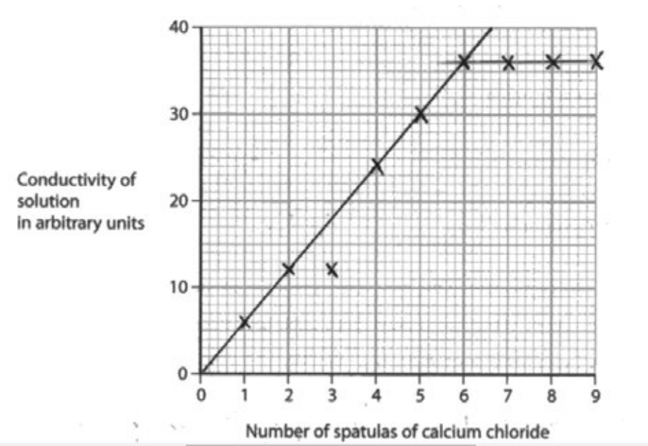

# Mark Schemes — Ionic Bonding
**1. Principles of Chemistry** · Edexcel IGCSE Science (Double Award) (4SD0) — 17/Chemistry

## Q1 — medium — 9 marks · exam-questions

### 6((a)) — 3 marks
The changes in the electronic configuration of the atoms of sodium and oxygen to form the ions in sodium oxide are:

- Sodium loses electrons;** [1 mark]**
- Oxygen gains electrons; **[1 mark]**
- Sodium loses 1 / an electron 
**AND **
Oxygen gains 2 electrons 
**OR** 
Both atoms become ions with the configuration of 2.8; **[1 mark]**

**[Total: 3 marks]**

- *Tip:** Be specific when describing the changes that occur during ionic bonding, for example:*

  - *Each sodium atom loses one electron to become a 1+ ion with the electronic configuration of 2.8*
  - *Each oxygen atom gains two electrons to become a 2– ion with the electronic configuration of 2.8*

### 6((b)) — 1 marks
The relative formula mass (*M*r) of sodium oxide, Na2O, is:

- 62; **[1 mark]**

**[Total: 1 mark]**

- *To calculate the relative formula mass of sodium oxide, you add up the atomic masses of all the component atoms*

  - *23 + 23 +16 = 62*

### 6((c)) — 2 marks
Solid sodium oxide does not conduct electricity because:

Any **two** from:

- (Sodium oxide has) ions / (giant) ionic structure; **[1 mark]**
- Ions / electrons cannot flow / move; **[1 mark]**
- No delocalised electrons;** [1 mark]**

**[Total: 2 marks]**

- *It is a more commonly asked question as to which states conduct electricity for differently bonded substances, but this question is asking for why, and in detail, so make sure that multiple distinct points are made*
- *Whether a substance conducts electricity comes down to if charged particles can move through the structure:*

  - *For ionic substances, this is ions *
  - *For metals and some giant covalent structures such as graphite, this is electrons*
  - *Do not mix these examples up!*

### 6((c)) — 2 marks
A test to show that sodium oxide contains sodium ions is:

- Flame test; **[1 mark]** *A description of performing a flame test is accepted*
- Yellow / orange / yellow-orange colour flame (is seen with sodium ions); **[1 mark]**

**[Total: 2 marks]**

- *One test for metal ions is the flame test*
- *You need to know the colours of the common metals for flame tests:*

  - *Lithium ion = red*
  - *Sodium ion = yellow*
  - *Potassium ion = lilac*
  - *Calcium ion = orange / red*
  - *Copper ion = green*

### 6((e)) — 1 marks
The completed equation for the reaction of sodium oxide to form sodium metal and sodium peroxide, Na2O2 is:

- 2Na2O → 2Na + Na2O2; **[1 mark]**

**[Total: 1 mark]**

- *Starting from the sodium oxide reactant Na**2**O →*
- *You are told that the products are sodium metal and sodium peroxide Na**2**O → **Na + Na**2**O**2** *
- *There is one reactant oxygen and two product oxygens, so double the sodium oxide reactant to balance the oxygen atoms **2**Na**2**O → Na + Na**2**O**2** *
- *This gives you 4 reactant sodiums and three product sodium, doubling the sodium metal resolves this imbalance  2Na**2**O → **2**Na + Na**2**O**2** *

## Q2 — medium — 1 marks · exam-questions

### 1() — 1 marks
**Correct answer: C** — K2SO4

**Final answer:** **The  correct answer is C**

- Potassium is in Group 1 so will lose one electron to become a 1+ ion
- A sulfate ion has a 2- charge
- In order to produce a neutral compound, two potassium ions are needed for every one sulfate ion
- K2SO4 is the formula for potassium sulfate

## Q3 — medium — 14 marks · exam-questions

### 8((a)) — 3 marks
What happens when calcium reacts with chlorine to form the ionic compound calcium chloride, CaCl2 in terms of electrons is:

- Calcium loses electrons;** [1 mark]**
- Chlorine gains electrons; **[1 mark]**
- Two atoms of chlorine each gain one electron **OR** Calcium loses 2 electrons and chlorine gains 1 electron;** [1 mark]**

*If 'chlorine molecules' are gaining electrons do not award M3*

*Allow 1 mark from M1 and M2 for 'electron transfer from chlorine to calcium' without specifying the number of electrons*

*Any reference to sharing electrons or covalent or metallic bonding scores 0*

**[Total: 3 marks]**

- *There are three marks here, so you need to make sure you are referring to what happens to each of the atoms and do so with the numbers of electrons moving rather than general statements*

### 8((b)) — 4 marks
Test for Ca2+ ions:

- Flame test (allow description of a flame test); **[1 mark]**
- Orange-red flame colour / brick red flame; **[1 mark]** 

**OR**
- Add sodium hydroxide;** [1 mark]**
- (Slight) white precipitate;** [1 mark]**

Test for Cl- ions:

- Add silver nitrate; **[1 mark]**
- White precipitate; **[1 mark]**

*Marks for colour depend on the correct test*

*Do not allow a mention of any acid other than nitric acid*

**[Total: 4 marks]**

- *The flame test is easier to recall but both tests are equally valid*
- *The tests for halide ions are also standard ones you need to recall; the precipitate colour changes for different halides*

### 8((c)) — 5 marks
i) The graph should be:

- All points correct ± half a square; **[2 marks]**
- 2 straight lines of best fit ignoring the anomalous point; **[1 mark] ***One plotting error only scores [1 mark]*

ii) The trend shown on the graph for the first six spatulas of calcium chloride added is:

- The conductivity is (directly) proportional (to the number of spatulas of calcium chloride added) 
**OR** 
The conductivity increases (as the number of spatulas of calcium chloride increases); **[1 mark]**

iii)

Any **one** from:

- The student took the reading before adding the calcium chloride; **[1 mark]**
- The student forgot to stir the mixture / did not stir the mixture properly;** [1 mark]**

*Ignore any references to human error*

**[Total: 5 marks]**

- *Make sure you plot points using crosses rather than dots, which can get lost under a best fit line*
- *Refer to the terms on the axis when describing a graph's shape; you can use 'er' 'er' statements, so the great**er** value of x means a great**er** or less**er** value of y...*
- *When looking at types of error make sure you focus on the method given and see if there are any steps where errors could easily be made*

### 8((d)) — 2 marks
Another way to make calcium chloride conduct electricity is:

- Heat (the calcium chloride);** [1 mark]**
- Until molten / melts; **[1 mark]**

**[Total: 2 marks]**

- *You need to know that ionic compounds conduct when dissolved (as in part (c)) or molten (melted), but not when solid*

## Q4 — medium — 1 marks · exam-questions

### 1() — 1 marks
**Correct answer: B** — substance **X**

**Final answer:** **The correct answer is B.**

- Ionic substances have high melting and boiling points due to the presence of strong electrostatic forces acting between the oppositely charged ions
- These forces act in all directions and a lot of energy is required to overcome them
- Ionic compounds can conduct electricity in the molten state as they have ions that can move and carry charge
- They cannot conduct electricity in the solid state as the ions are in fixed positions within the lattice and are unable to move

## Q5 — medium — 8 marks · exam-questions

### 1() — 3 marks
The different roles of electrons in the formation of lithium chloride and hydrogen chloride

*Lithium chloride:*

- The lithium (atom) loses electron; **[1 mark]**
- The chlorine (atom) gaining an electron; **[1 mark]**

*Hydrogen chloride:*

- Involves sharing a pair of electrons (one electron from each atom); **[1 mark]**

**[Total: 3 marks]**

- *The command word here is describe, but you can support your answer with dot and cross diagrams *
- *However, they must be correct and not contradict your descriptions*

### 7((b)) — 5 marks
Why lithium chloride has a higher melting point than hydrogen chloride:

*Any ****five**** of the following:*

*Lithium chloride:*

- Lithium chloride has a giant (ionic) structure; **[1 mark]**
- There are strong (electrostatic) forces of attraction; **[1 mark]**
*allow strong bonds*
- That occur between oppositely charged ions; **[1 mark]**

*Hydrogen chloride:*

- Has a simple molecular structure; **[1 mark]**
*Mentioning "molecules" or "intermolecular forces" does NOT gain this mark*
- There are weak intermolecular forces of attraction; **[1 mark]**
*allow weak forces between the molecules*
- Therefore more (heat/thermal) energy is needed to overcome forces/break bonds in lithium chloride (than the  intermolecular forces in hydrogen chloride); **[1 mark]**

**[Total: 5 marks]**

- *Good words to use here would be to talk about lattices and strong bonds between positive and negative ions in lithium chloride*
- *You can get credit for referring to weak bonds between the molecules in hydrogen chloride, but chemists normally call them intermolecular forces as they are considerably weaker than covalent bonds*
- *You will lose credit if you refer to molecules or atoms in lithium chloride or mention covalent bonds or intermolecular forces*
- *If it is not clear what bonds you are talking about in hydrogen chloride and imply covalent bonds are broken you will lose the mark*
- *Make sure you use comparative  language e.g. 'more energy' rather than 'alot of energy' for the final marking point*

## Q6 — medium — 1 marks · exam-questions

### 1() — 1 marks
**Correct answer: A** — 

**Final answer:** **The correct arrangement of electrons in lithium sulfide is A**

- Lithium is a Group 1 metal so has one electron in its outer shell

  - It will lose one outer electron to another atom to gain a full outer shell of electrons
  - A positive lithium ion with the charge 1+ is formed
  - It now has 2 electrons in its outer shell which is complete as the shell closest to the nucleus can hold a maximum of 2 electrons
- Sulfur is a Group 6 non-metal so will need to gain two electrons to have a full outer shell of electrons

  - One electron will be transferred from the outer shell of a lithium atom to the outer shell of the sulfur atom
  - A second electron will be transferred from the outer shell of another lithium atom to the outer shell of the sulfur atom
  - A sulfur atom will gain two electrons to form a negatively charged sulfide ion with a charge of 2-

## Q7 — medium — 14 marks · exam-questions

### 5((a)) — 1 marks
One property of metals is:

Any **one **of the following:

- Good conductors of heat; **[1 mark]**
- Good conductors of electricity; **[1 mark]**
- Malleable; **[1 mark]**
- Ductile; **[1 mark]**
- High density; **[1 mark]**
- Have basic oxides / hydroxides;** [1 mark]**
- High melting point; **[1 mark]**
- Sonorous;** [1 mark]**
- Shiny; **[1 mark]**
- Hard; **[1 mark]**
- Strong; **[1 mark]**

**[Total: 1 mark]**

- *The most common correct answer to this question is about metals being good conductors of electricity*

  - *Careful: **Good conductor on its own may not be enough to achieve the mark*

### 5((b)) — 2 marks
The difference in the movement of particles in liquid mercury and in a solid metal is:

- In mercury, the particles can move / flow; **[1 mark]** *Comments about the spacing and energy of the particles are ignored*
- In solid metals, the particles do not move 
**OR**
In solid metals, the particles vibrate around / are in fixed positions; **[1 mark]**

**[Total: 2 marks]**

- *This question is not actually asking about metals*

  - *Mercury is included as an example of a liquid but the idea of different metals is a distraction from the main question*
- *It is asking you to compare the movement of particles in a liquid and a solid*

### 5((c)) — 2 marks
i) One observation made during the combustion of magnesium metal is:

- (Bright) white flame / light 
**OR **
Forms a white powder / solid / ash; **[1 mark]**

ii) One chemical property of the product of combustion that can be used to classify magnesium as a metal is:

- (The product / magnesium oxide) is basic / a base 
**OR **
(The product / magnesium oxide) neutralises acids 
**OR **
(The product / magnesium oxide) reacts with / dissolves in acid
**OR **
(The product / magnesium oxide) produces an alkali when it is added to water; **[1 mark]**

**[Total: 2 marks]**

- *The main observation for the combustion of magnesium is a memorable bright white light*
- *The product of combustion is magnesium oxide*

  - *Magnesium + oxygen → magnesium oxide*
  - *2Mg + O**2** → 2MgO*
- *Magnesium oxide is a base, which means that it will:*

  - *React with / neutralise acids*
  - *Produce an alkaline solution (of magnesium hydroxide) when added to water*

### 5((d)) — 9 marks
i) One reason why the reaction needs to be done in the absence of air is:

- The magnesium / sulfur would react with oxygen 
**OR **
Magnesium oxide would form 
**OR**
Sulfur dioxide would form ; **[1 mark]**

ii) The ions in magnesium sulfide are formed by:

- Magnesium losing 2 electrons (to sulfur);** [1 mark]**
- Sulfur gaining two electrons (from magnesium); **[1 mark]** *Two electrons are transferred from magnesium to sulfur scores both of these marks*
- The magnesium ion is 2+ / Mg2+  
**AND** 
The sulfur / sulfide ion is 2- / S2–; **[1 mark]**

iii) Magnesium sulfide has a very high melting point because:

- There are strong (electrostatic) forces of attraction 
**OR **
There are strong ionic bonds; **[1 mark]** *Talking about the forces between atoms or molecules / intermolecular forces or covalent bonding means that the first two marks cannot be awarded*
- Between magnesium ions / Mg2+ and sulfide ions / S2– 
**OR **
Between oppositely charged ions 
**OR**
Between positive and negative ions; **[1 mark]**
- Large amounts of (heat / thermal) energy are required to overcome the (electrostatic) forces of attraction 
**OR **
Large amounts of (heat / thermal) energy are required to break the bonds; **[1 mark] **

iv) The chemical equation for the reaction of magnesium sulfide with hydrochloric acid to form magnesium chloride and hydrogen sulfide gas, H2S, is:

MgS + 2HCl → MgCl2 + H2S

- All chemical formulae correct;** [1 mark]**
- Correct balancing;** [1 mark]**

**[Total: 9 marks]**

- *The main focus of this question is ionic bonding*
- *To correctly answer how ions are formed and achieve all the associated marks, you should:*

  - *State how many electrons the metal loses AND the ion that it becomes*
  - *State how many electrons the nonmetal gains AND the ion that it becomes*
- *Careful: **Melting points (and boiling points) can cause confusion*

  - *They are to do with forces of attraction, NOT the bonding*
  - *In ionic compounds, melting points are about the large amounts of energy required to overcome the strong electrostatic forces of attraction between oppositely charged ions*
  
    - *These forces of attraction between oppositely charged ions are basically the ionic bonds - which is where the relatively common misconception comes from*
  - * In covalent compounds, melting points are about the intermolecular forces of attraction and the amounts of energy required to overcome them*
  
    - *There are some exceptions, such as diamond, where covalent bonds need to break*

## Q8 — medium — 1 marks · exam-questions

### 1() — 1 marks
**Correct answer: C** — Electrostatic attraction between oppositely charged ions

**Final answer:** **The correct answer is C.**

- The positive and negatively charged ions are held together by the strong electrostatic forces of attraction
- This is what holds ionic compounds together

## Q9 — medium — 1 marks · exam-questions

### 1() — 1 marks
**Correct answer: D** — An oxide ion has an electronic configuration of 2.6

**Final answer:** **The incorrect statement is D.**

- An oxygen atom has the electronic configuration of 2.6
- Oxygen gains two electrons to form the oxide ion
- An oxide ion will have the electronic configuration 2.8

## Q10 — hard — 9 marks · exam-questions

### 4((a)) — 4 marks
i) The missing formulae are:

|   | **Mg****2+** | **Al****3+** | **NH****4****+** |
|---|---|---|---|
| **S****2-** | MgS | Al2S3 | **(NH****4****)****2****S**; **[1 mark]** |
| **NO****3****-** | **Mg(NO****3****)****2**; **[1 mark]** | Al(NO3)3 | NH4NO3 |
| **CO****3****2-** | MgCO3 | **Al****2****(CO****3****)****3**; **[1 mark]** | (NH4)2CO3 |

ii) The name of the compound with the formula NH4NO3 is:

- Ammonium nitrate; **[1 mark]**

**[Total: 4 marks]**

- *Make sure the total positive and negative charges cancel each other out so that the compound is neutral overall*

  - *Example:** Mg**2+** x **1** = 2+ and NO**3**-** x **2** = 2-, so the formula is **Mg(NO**3**)**2*
- *NH**4**+ **is an ammonium ion; NO**3**-** **is a nitrate ion, therefore the resulting compound is ammonium nitrate*

### 4((b)) — 5 marks
i) The meaning of the term **ionic bond** is:

- Electrostatic (force of) attraction / electrostatic force; **[1 mark]**
- Between oppositely charged ions / positive and negative ions / cations and anions; **[1 mark]**

ii) The arrangement of the electrons in the ions of sodium oxide:

- Correct electron arrangement of both sodium ions; **[1 mark]**
- Correct electron arrangement of the oxide ion; **[1 mark]**
*If only outer shells shown correctly scores 1 mark* *Accept dots in place of crosses or any combination of dots and crosses*
- Correct charges on all ions (with or without brackets); **[1 mark]**

**[Total: 5 marks]**

- *Sometimes only the outer electrons are required, however, in this case, **ALL **of the electrons need to be drawn - read the question carefully - unless it specifically states to draw the outer electrons only, it is best to show all the electrons*
- *Sodium is in Group 1 so will lose its outer electron to form a 1+ ion*
- *Oxygen is in Group 6 so will gain 2 electrons (one electron from 2 different sodium atoms) to form a 2- ion*
