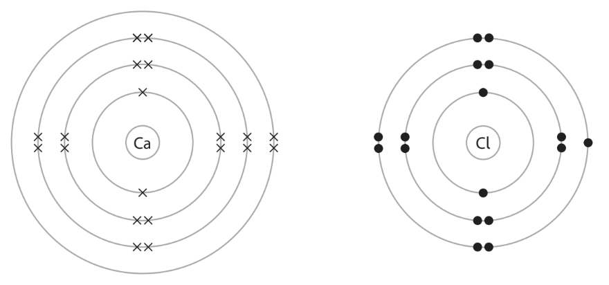
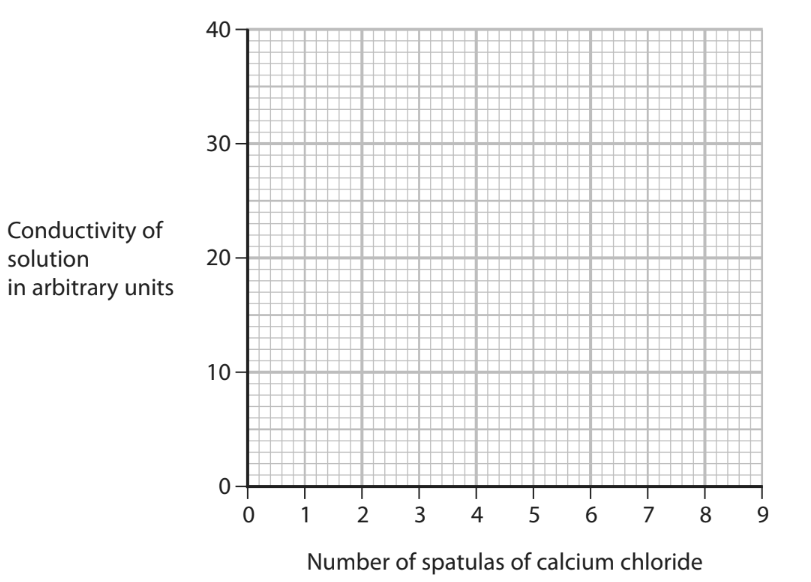

# Exam Questions — Ionic Bonding
**1. Principles of Chemistry** · Edexcel IGCSE Science (Double Award) (4SD0) — 17/Chemistry
> Source: [https://www.savemyexams.com/igcse/science/edexcel/double-award/17/chemistry/topic-questions/principles-of-chemistry/ionic-bonding/exam-questions/](https://www.savemyexams.com/igcse/science/edexcel/double-award/17/chemistry/topic-questions/principles-of-chemistry/ionic-bonding/exam-questions/) · 10 questions · total 59 marks

## Q1 — medium — 9 marks · exam-questions

### 6((a)) — 3 marks — command: describe — structured — from paper 2022 · Jan1C
This question is about sodium oxide, Na2O

The diagram shows the electronic configuration of atoms of sodium and oxygen.

|  |  |
|---|---|
| Sodium | Oxygen |

Describe the changes in the electronic configuration of the atoms of sodium and oxygen to form the ions in sodium oxide.

### 6((b)) — 1 mark — command: calculate — structured — from paper 2022 · Jan1C
Calculate the relative formula mass (*M*r) of sodium oxide, Na2O, using information from the Periodic Table.

*M*r = ..............................

### 6((c)) — 2 marks — command: explain — structured — from paper 2022 · Ja1C
Explain why solid sodium oxide does not conduct electricity.

### 6((c)) — 2 marks — command: give — structured — from paper 2022 · Jan1C
Give a test to show that sodium oxide contains sodium ions.

### 6((e)) — 1 mark — command: complete — structured — from paper 2022 · Ja42
When sodium oxide is heated it reacts to form sodium metal and sodium peroxide, Na2O2

Complete the equation for this reaction.

Na2O →

## Q2 — medium — 1 marks · exam-questions

### 1() — 1 mark — multiple_choice
What is the formula of potassium sulfate?
- **A.** K2(SO4)2
- **B.** K(SO4)2
- **C.** K2SO4
- **D.** KSO4

## Q3 — medium — 14 marks · exam-questions

### 8((a)) — 3 marks — command: describe — structured — from paper 2020 · Ja1CR
The diagram shows the arrangement of electrons in an atom of calcium and in an atom of chlorine.

Describe, in terms of electrons, what happens when calcium reacts with chlorine to form the ionic compound calcium chloride, CaCl2

### 8((b)) — 4 marks — command: describe — structured — from paper 2020 · Ja1CR
Describe tests to show that an aqueous solution of calcium chloride contains calcium ions and chloride ions.

calcium ions: ...................................................................... chloride ions:  ......................................................................

### 8((c)) — 5 marks — command: multiple — structured — from paper 2020 · Ja1CR
Solid calcium chloride does not conduct electricity. Aqueous solutions of calcium chloride do conduct electricity. A student uses this method to investigate how the conductivity of a solution changes when calcium chloride is dissolved in pure water.

Step 1 add 100 cm3 of pure water to a beaker

Step 2 add one spatula of solid calcium chloride to the beaker Step 3 stir the solution 
Step 4 measure the conductivity of the solution 
Step 5 repeat until nine spatulas of solid calcium chloride have been added

The table shows the student’s results.

| **Number of spatulas of calcium chloride** | **Conductivity of solution in arbitrary units** |
|---|---|
| 0 | 0 |
| 1 | 6 |
| 2 | 12 |
| 3 | 12 |
| 4 | 24 |
| 5 | 30 |
| 6 | 36 |
| 7 | 36 |
| 8 | 36 |
| 9 | 36 |

i) Plot the results on the grid and draw two straight lines of best fit. Ignore the anomalous result.

(3)

ii) State the trend shown on the graph for the first six spatulas of calcium chloride.

(1)

iii) Suggest an error the student could have made to cause the anomalous result.

(1)

### 8((d)) — 2 marks — command: describe — structured — from paper 2020 · Ja1CR
Describe another way to make solid calcium chloride conduct electricity.

## Q4 — medium — 1 marks · exam-questions

### 1() — 1 mark — multiple_choice
The table below shows the properties of four substances, **W**,** X**, **Y** and **Z**.

| **Substance** | **Melting point** | **Boiling point ** | **Conducts electricity when** |
|---|---|---|---|

|   | **/ ****o ****C** | **/ ****o ****C** | **solid ** | **liquid** |
|---|---|---|---|---|
| **W** | 3410 | 5930 | yes | yes |
| **X** | 801 | 1413 | no | yes |
| **Y** | 3550 | 4830 | no | no |
| **Z** | -91 | 98 | no | no |

Use the information in the table to identify the substance that is an ionic compound.
- **A.** substance **W**
- **B.** substance **X**
- **C.** substance **Y**
- **D.** substance **Z**

## Q5 — medium — 8 marks · exam-questions

### 1() — 3 marks — command: describe — structured — from paper 2021 · Ja1CR
The formation of ions and covalent bonds involves electrons.

The table gives the electronic configurations of atoms of hydrogen, lithium and chlorine.

| **Element ** | **Electronic configuration of atom** |
|---|---|
| hydrogen | 1 |
| lithium | 2.1 |
| chlorine | 2.8.7 |

Describe the different roles of electrons in the formation of

- ions in lithium chloride
- covalent bonds in hydrogen chloride

### 7((b)) — 5 marks — command: explain — structured — from paper 2021 · Ja1CR
Explain why lithium chloride has a higher melting point than hydrogen chloride.

Refer to structure and bonding in your answer.

## Q6 — medium — 1 marks · exam-questions

### 1() — 1 mark — multiple_choice
Which of the following dot-and-cross diagrams shows the correct arrangement of electrons in lithium sulfide?
- **A.** 
- **B.** 
- **C.** 
- **D.** 

## Q7 — medium — 14 marks · exam-questions

### 5((a)) — 1 mark — command: state — structured — from paper 2022 · Jan1CR
This is a question about metals and their compounds.

State one property of metals.

### 5((b)) — 2 marks — command: describe — structured — from paper 2022 · Jan1CR
Mercury is the only metal that is liquid at room temperature.

Describe the difference in the movement of particles in liquid mercury and in a solid metal.

### 5((c)) — 2 marks — command: state — structured — from paper 2022 · Jan1CR
Magnesium is a metal that burns in air.

i) State one observation made during the combustion of magnesium metal.

(1)

ii) State one chemical property of the product of combustion that can be used to classify magnesium as a metal.

(1)

### 5((d)) — 9 marks — command: multiple — structured — from paper 2022 · Jan1CR
In the absence of air, magnesium reacts with sulfur to form the ionic compound magnesium sulfide, MgS

i) Give a reason why the reaction needs to be done in the absence of air.

(1)

ii) Describe, in terms of electrons, the formation of the ions in magnesium sulfide.

Give the charges on the ions.

(3)

iii) Explain why magnesium sulfide has a very high melting point.

(3)

iv) Magnesium sulfide reacts with hydrochloric acid to form magnesium chloride and hydrogen sulfide gas, H2S

Give the chemical equation for this reaction.

(2)

## Q8 — medium — 1 marks · exam-questions

### 1() — 1 mark — multiple_choice
Which of the statements describes ionic bonding?
- **A.** Electrostatic attraction between atoms
- **B.** Electrostatic attraction between positively charged particles and delocalised electrons
- **C.** Electrostatic attraction between oppositely charged ions
- **D.** Electrostatic attraction between the nuclei of two atoms and a shared pair of electrons

## Q9 — medium — 1 marks · exam-questions

### 1() — 1 mark — multiple_choice
The diagram shows the electronic configurations of an atom of lithium and an atom of oxygen.

Which statement is **not** correct about the changes in electronic configuration that occur when lithium and oxygen react to form lithium oxide, Li2O?
- **A.** Two lithium atoms each lose one electron
- **B.** One oxygen atom gains 2 electrons
- **C.** A lithium ion has an electronic configuration of 2
- **D.** An oxide ion has an electronic configuration of 2.6

## Q10 — hard — 9 marks · exam-questions

### 4((a)) — 4 marks — command: multiple — structured — from paper 2020 · Ja1C
This question is about ionic compounds.

The table shows the formulae of some positive and negative ions, and the formulae of some compounds containing these ions.

|   | **Mg****2+** | **Al****3+** | **NH****4****+** |
|---|---|---|---|
| **S****2-** | MgS | Al2S3 |   |
| **NO****3****-** |   | Al(NO3)3 | NH4NO3 |
| **CO****3****2-** | MgCO3 |   | (NH4)2CO3 |

i) Complete the table by giving the three missing formulae.

[3]

ii) Give the name of the compound with the formula NH4NO3

[1]

### 4((b)) — 5 marks — command: multiple — structured — from paper 2020 · Ja1C
Sodium oxide, Na2O, is an ionic compound. The sodium and oxide ions are held together by ionic bonds.

i) State the meaning of the term **ionic bond**.

[2]

ii) The diagram shows the arrangement of the electrons in a sodium atom and in an oxygen atom.

Draw diagrams in the boxes to show the arrangement of the electrons in the ions of sodium oxide.  Include the charges on the ions.

[3]

