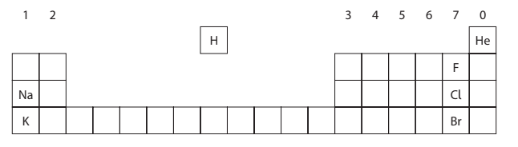
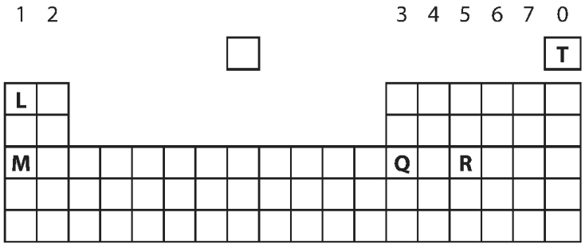

# Exam Questions — The Periodic Table
**1. Principles of Chemistry** · Edexcel IGCSE Science (Double Award) (4SD0) — 17/Chemistry
> Source: [https://www.savemyexams.com/igcse/science/edexcel/double-award/17/chemistry/topic-questions/principles-of-chemistry/the-periodic-table/exam-questions/](https://www.savemyexams.com/igcse/science/edexcel/double-award/17/chemistry/topic-questions/principles-of-chemistry/the-periodic-table/exam-questions/) · 11 questions · total 39 marks

## Q1 — easy — 7 marks · exam-questions

### 1((a)) — 5 marks — command: multiple — structured — from paper 2020 · Nov1C
This question is about chemical elements.

Use the Periodic Table to help you answer this question.

i) Identify the element with atomic number 5

(1)

ii) Give the symbol of a metallic element in Period 3

(1)

iii) Identify the element whose atoms contain 14 protons.

(1)

iv) Identify the element whose atoms have the electronic configuration 2.5

(1)

v) Give the name of the compound formed between oxygen and the element with atomic number 13

(1)

### 1((b)) — 2 marks — command: which — structured — from paper 2020 · Nov1C
The position of an element in the Periodic Table can be used to predict its properties.

i) Which group contains elements that are all unreactive?

(1)

| **A** | Group 2 |
|---|---|
| **B** | Group 5 |
| **C** | Group 6 |
| **D** | Group 0 |

ii) Which of these is the least reactive element in Group 1?

(1)

| **A** | caesium |
|---|---|
| **B** | lithium |
| **C** | potassium |
| **D** | sodium |

## Q2 — easy — 7 marks · exam-questions

### 1((a)) — 5 marks — command: complete — structured — from paper 2021 · Ju1C
The box shows the names of some substances.

| \| bromine \| carbon dioxide \| copper \| iodine \| \|---\|---\|---\|---\| \| methane \| nitrogen \| sulfur dioxide \| water \| |
|---|

Complete the table by choosing substances from the box that match the description.

Each substance may be used once, more than once or not at all.

| **Description** | **Substance** |
|---|---|
| a good conductor of electricity |   |
| an element that has a basic oxide |   |
| a substance used as a fuel |   |
| a major cause of acid rain |   |
| a non‐metallic element that is a solid at room temperature |   |

### 1((b)) — 2 marks — command: describe — structured — from paper 2021 · Ju1C
Describe a test for carbon dioxide.

## Q3 — easy — 5 marks · exam-questions

### 2((a)) — 4 marks — command: give — structured — from paper 2020 · Nov1CR
The diagram shows the positions of some elements in the Periodic Table.

Use symbols from this table to answer these questions.

Each symbol may be used once, more than once or not at all.

i) Give the symbol of a metal.

(1)

ii) Give the symbol of a noble gas.

(1)

iii) Give the symbol of a liquid at room temperature.

(1)

iv) Give the symbols of the two elements in Period 3

(1)

......................................... and .........................................

### 2((b)) — 1 mark — command: deduce — structured — from paper 2020 · Nov1CR
Deduce the electronic configuration of Na.

## Q4 — easy — 6 marks · exam-questions

### 1((a)) — 3 marks — command: name — structured — from paper 2021 · Jun2C
Use the Periodic Table to help you answer this question.

i) Name the element with atomic number 14

(1)

ii) Name the element with a relative atomic mass of 11

(1)

iii) Name the element in Group 2 and Period 3

(1)

### 1((b)) — 3 marks — command: multiple — structured — from paper 2021 · Jun2C
i) Determine the number of neutrons in a phosphorus atom with mass number 31

(1)

ii) State the electronic configuration of an aluminium atom.

(1)

iii) State why neon is unreactive.

(1)

## Q5 — medium — 1 marks · exam-questions

### 1() — 1 mark — multiple_choice
What is the electronic configuration of silicon?

- **A.** 2,4
- **B.** 2,2,4
- **C.** 2,2,8
- **D.** 2,8,4

## Q6 — medium — 4 marks · exam-questions

### 2((a)) — 1 mark — command: give — structured — from paper 2019 · Ju1C
The diagram shows part of the Periodic Table, with elements represented by the letters L, M, Q, R and T.

The letters in the diagram represent elements but are not their chemical symbols.

Give the letter from the diagram that represents a noble gas.

### 2((b)) — 1 mark — command: state — structured — from paper 2019 · Ju1C
Elements L and M are in the same group.

State why they have similar chemical reactions.

### 2((c)) — 2 marks — command: explain — structured — from paper 2019 · Ju1C
An atom of element Q has 31 protons.

Use this information to explain how you can determine the number of protons in an atom of element R.

## Q7 — medium — 1 marks · exam-questions

### 1() — 1 mark — multiple_choice
Which diagram shows the electronic configuration of a nitrogen atom?
- **A.** 
- **B.** 
- **C.** 
- **D.** 

## Q8 — medium — 5 marks · exam-questions

### 5((a)) — 1 mark — multiple_choice — from paper 2019 · Ju1C
In 1937, an airship full of hydrogen gas flew from Germany to America.

(Source: © Michael Rosskothen/Shutterstock)

Which property of hydrogen makes it a suitable gas to use in an airship?
- **A.** colourless
- **B.** insoluble in water
- **C.** low density
- **D.** no smell

### 5((b)) — 2 marks — command: explain — structured — from paper 2019 · Ju1C
Explain why helium is now used in airships instead of hydrogen.

### 5((c)) — 2 marks — command: multiple — structured — from paper 2019 · Ju1C
Hydrogen is used to manufacture ammonia, NH3

Hydrogen is reacted with nitrogen using an iron catalyst.

i) Give a chemical equation for this reaction.

(1)

ii) State why a catalyst is used in this reaction.

(1)

## Q9 — medium — 1 marks · exam-questions

### 1() — 1 mark — multiple_choice
The diagram shows part of the periodic table, with elements represented by the letters M, Q, R and T. The letters in the diagram represent elements but are not their chemical symbols.

Use the Periodic Table to help you answer this question.

Which of these statements is true?
- **A.** T and Q form acidic oxides
- **B.** M conducts electricity
- **C.** M is a non-metal element
- **D.** R is a gaseous non-metal element

## Q10 — medium — 1 marks · exam-questions

### 1() — 1 mark — multiple_choice
The following elements are found in group 0 of the periodic table.

**He   Ne   Ar   Kr   Xe   Rn**

What explains their similar chemical and physical properties?
- **A.** They have the same number of valence electrons
- **B.** They are all gases
- **C.** They have the same number of protons and electrons
- **D.** They have full outer shells

## Q11 — medium — 1 marks · exam-questions

### 1() — 1 mark — multiple_choice
Which element, T, Q, R, or M has the electronic configuration 2,8,3?

- **A.** element M
- **B.** element Q
- **C.** element T
- **D.** element R
