# Mark Schemes — Motion in the Universe
**8. Astrophysics** · Edexcel IGCSE Science (Double Award) (4SD0) — 17/Physics

## Q1 — easy — 3 marks · exam-questions

### 1((a)) — 1 marks
**Correct answer: C** — Planet

**Final answer:** **The correct answer is ****C ****because:**

- Path X is circular
- Path X is around the Sun
- Therefore path X must be the orbit of a planet

### 1((a)) — 1 marks
**Correct answer: A** — Comet

**Final answer:** **The correct answer is ****A ****because:**

- Path Y is highly elliptical
- Path Y is around the Sun
- Therefore path Y must be the orbit of a comet

### 1((b)) — 1 marks
**Correct answer: C** — Gravitational force

**Final answer:** **The correct answer is ****C ****because:**

- The force which holds object in space in orbit is gravitational force

Whilst an answer of 'gravity' might be accepted in the exam, it is not in fact correct. The correct term is 'gravitational force'.

## Q2 — easy — 1 marks · exam-questions

### 6((a)) — 1 marks
**Correct answer: D** — The Sun

**Final answer:** **The correct answer is ****D**** because:**

- The Sun is found at the centre of the Solar System

## Q3 — easy — 1 marks · exam-questions

### 3((a)) — 1 marks
**Correct answer: C** — The Solar System

**Final answer:** **The correct answer is ****C**** because:**

- The Solar System is a number of planets orbiting the Sun, a star

## Q4 — easy — 6 marks · exam-questions

### 3((b)) — 1 marks
A diagram which would score 1 mark is:

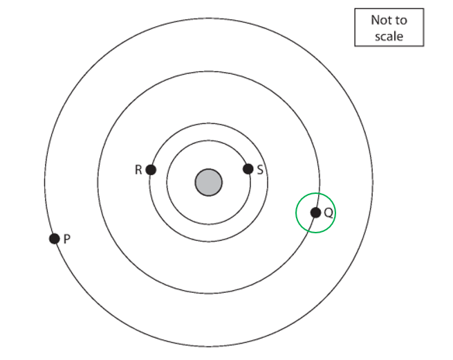

- A small circle, centred on planet Q; **[1 mark]**

**[Total: 1 mark]**

### 3((c)) — 2 marks
A diagram to show the orbit of a comet which would score two marks is:

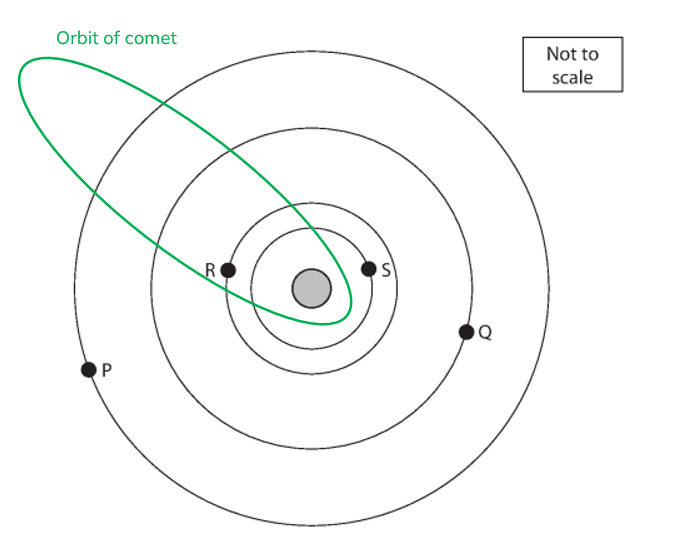

- Oval, hyperbola, or open ellipse shape; **[1 mark]**
- Star is at one 'end' of the orbit; **[1 mark]**

**[Total: 2 marks]**

### 3((d)) — 1 marks
Suggest why planets nearer to the star take less time to orbit the star:

- There is a smaller orbital path / distance travelled for close planets; **[1 mark]**

**OR**

- Close planets move at a faster speed; **[1 mark]**

**[Total: 1 mark]**

### 3((e)) — 2 marks
(i) To find maximum distance between the planets:

State when maximum distance is found:

- Maximum distance is found when the planets are on opposite sides of the star

Calculate this distance:

- Maximum distance = 200 million + 50 million = 250 million km **[1 mark]**

(ii) To find minimum distance between the planets:

State when minimum distance is found:

- Minimum distance is found when the planets are on the same side of the star

Calculate this distance:

- Minimum distance = 200 million − 50 million = 150 million km **[1 mark]**

**[Total: 2 marks]**

> *Diagrams which show these two points are:*

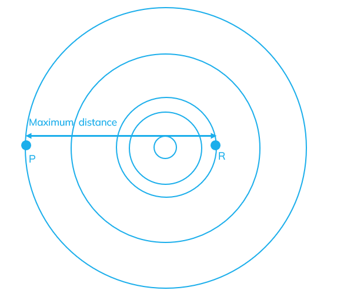

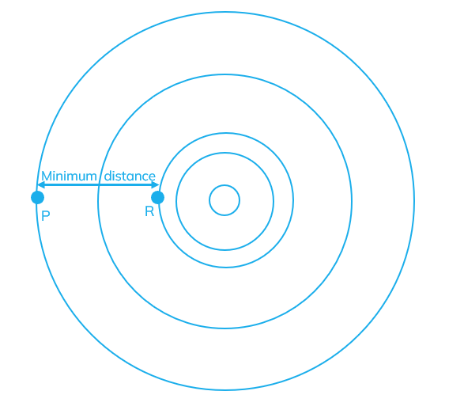

## Q5 — easy — 5 marks · exam-questions

### 10((a)) — 2 marks
A difference between the orbit of a moon and the orbit of a planet is:

- A moon orbits a planet; **[1 mark]**
- Whilst a planet orbits a star/ the Sun; **[1 mark]**

**[Total: 2 marks]**

### 10((b)) — 3 marks
List the known quantities:

- Radius of the Moon's orbit, 385 000 km
- Time taken for Moon's orbit, *t* = 27 days

From the equation sheet:

- $Orbitalspeed=\frac{2π\timesorbitalradius}{timeperiod}$          $V=\frac{2\timesπ\timesr}{T}$

Substitute values into orbital speed equation:

- *v *= $\frac{2π\times385000}{27}$ **[1 mark]**
- *v* = 89 593.568 = 90 0000 **[1 mark] **km/day **[1 mark]**

**[Total: 3 marks]**

> *This question has not asked for a specific unit, so don't make it too complicated for yourself! Normally, speed is in m/s if the distance is given in metres (m) and the time in seconds (s). In the Astrophysics topic, these units are less commonly used due to the time scales and distances we are dealing with.*

> *Therefore, you do not need to do any unit conversions here if you just state your units as km/day from the orbital radius given as km and the time of the orbit in days. Any matching units will be accepted even if you do conversions, say, to m/s, but you are a lot more likely to make an error this way! *

## Q6 — medium — 1 marks · exam-questions

### 6((a)) — 1 marks
**Correct answer: C** — Week 9

**Final answer:** **The correct answer is ****C**** because:**

- The distance between the comet in week 9 and the Earth in week 9 is the smallest

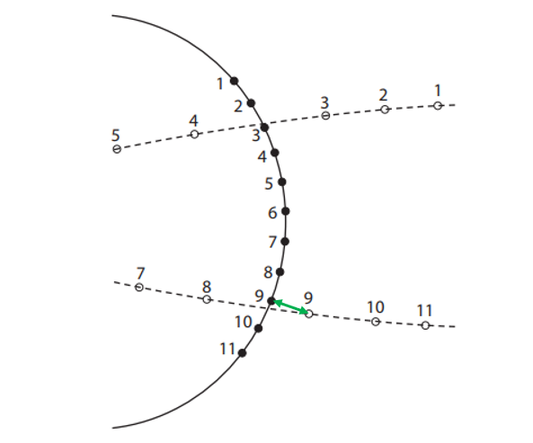

## Q7 — medium — 1 marks · exam-questions

### 10((a)) — 1 marks
**Correct answer: B** — Galaxy -  Solar system - Sun - planet

**Final answer:** **The correct answer is ****B**** because:**

- The galaxy is the largest option in the list
- The Solar System is found in the galaxy

  - Therefore it is smaller
- The Sun is found in the Solar System

  - Therefore it is smaller
- The planet is the smallest option in the list

## Q8 — medium — 1 marks · exam-questions

### 3() — 1 marks
**Correct answer: C** — Planet S makes more orbits than P

**Final answer:** **The correct answer is ****C**** because:**

- Planet P has the longest orbital time because it has to travel a longer distance and planets further from the star move more slowly.
- Therefore, in the time for planet P to make one complete orbit, planet S will have made more than one

**A **is incorrect as Planet R is further from the star than planet S therefore it will complete **fewer** orbits

** B **is incorrect as Planet R is closer to the star than planet Q therefore it will complete **more** orbits.

** D **is incorrect as Planet Q is closer to the star than planet P therefore it will complete **more** orbits.

## Q9 — medium — 4 marks · exam-questions

### 2((a)) — 1 marks
State the force which causes planets and comets to orbit the sun?

- Gravity; **[1 mark]**

**[Total: 1 mark]**

> *Calling the force 'gravity' will be accepted, although the correct description is the 'gravitational force'.*

### 2((b)) — 3 marks
(i) A completed diagram which would score one mark is:

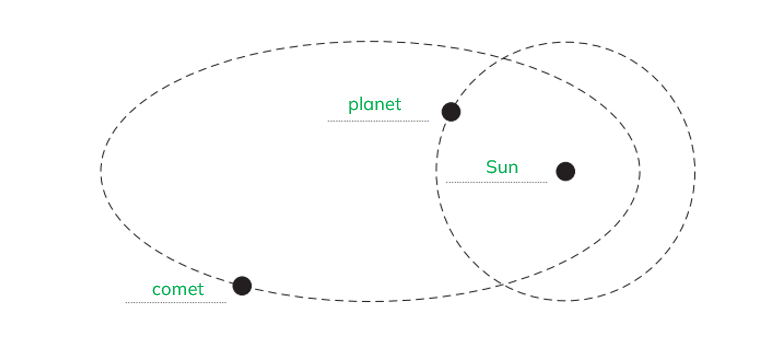

- One mark for <u>all three</u> correctly labelled; **[1 mark]**

(ii) To explain why it is possible for a planet and a comet in our Solar System to collide:

Any **two** from:

- The orbits cross / meet / intersect; **[1 mark]**
- The comet and the planet can be at the same place at the same time; **[1 mark]**
- The orbital time periods are different / they are orbiting at different speeds; **[1 mark]**

**[Total: 3 marks]**

> *Remember that orbits can be different shapes, but always go around another body.*

> *The orbit of a planet is **circular **and around the Sun. The orbit of a comet is **elliptical **and around the Sun. The Sun is found at the **centre of a circular orbit**, or at **one focus of an elliptical orbit**.*

## Q10 — medium — 9 marks · exam-questions

### 6((a)) — 3 marks
(i) A completed path for the comet between week 5 and week 7 which would score one mark is:

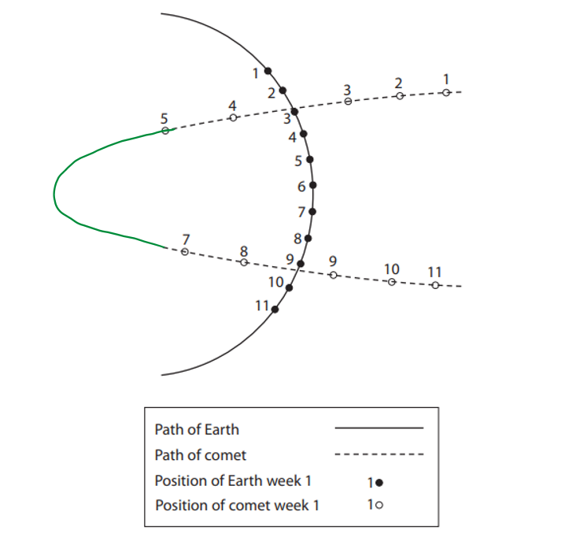

- Orbit behind the Sun completed correctly; **[1 mark]**

(ii) To show the position of the Sun:

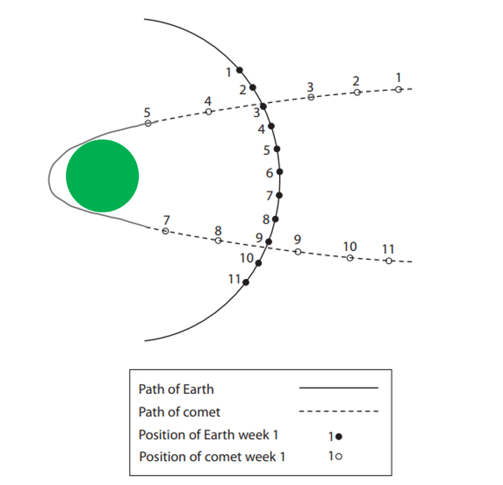

- X marked in the area shown by the green circle; **[1 mark]**

(iii) Suggest why the astronomer did not observe the comet during week 6:

Any **one **from:

- Comet was behind / near the Sun; **[1 mark]**
- Comet was obscured / eclipsed by Sun; **[1 mark]**
- Light from comet could not reach astronomer; **[1 mark]**
- Sun is too bright to allow observation; **[1 mark]**
- People should not look directly at the Sun; **[1 mark]**

**[Total: 3 marks]**

### 6((a)) — 3 marks
(i) The diagram shows that the speed of the comet changes as it moves from position 1 to position 5 because:

Any **two **from:

- The time interval between observations is the same; **[1 mark]**
- But between observations, the distances are different; **[1 mark]**
- Speed = distance ÷ time (hence) speed changes as distance changes; **[1 mark]**

(ii) The speed of the comet changes because:

**EITHER an argument involving energy:**

- The comet transfers energy between gravitational potential energy (GPE) and kinetic energy (KE) stores **AND**
- As the comet approaches the Sun, GPE transfers to KE, hence speed increases **AND**
- As the comet moves away from the Sun, KE transfers to GPE, hence speed decreases; **[1 mark]**

**OR an argument involving force:**

- The comet is pulled by the Sun's gravitational force **AND**
- This force is greater closer to the Sun **AND**
- Therefore, the speed of the comet is greater nearer the Sun; **[1 mark]**

**[Total: 3 marks]**

### 6((b)) — 3 marks
To calculate the orbital speed of the Earth in kilometres per hour:

List the known quantities:

- Orbital time of the Earth = 365 days
- Radius of the Earth's orbit = 150 000 000 km

From the equation sheet:

- $v=\frac{2πr}{T}$

Convert from days to hours:

- 1 day = 24 hours
- 365 days = 8760 hours **[1 mark]**

Substitute in known values into the equation:

- $v=\frac{2πr}{T}=\frac{2π\times150000000}{8760}$ **[1 mark]**

Calculate *v*:

- *v* = 107 588 = 108 000 km / hr **[1 mark]**

**[Total: 3 marks]**

> *If you don't convert days into hours then the answer will be 2 582 130 which would score 2 marks.*

> *If 60 is used instead of 24 to convert days to hours the answer will be 43 036 which would score 2 marks.*

## Q11 — medium — 8 marks · exam-questions

### 2((a)) — 4 marks
One astronomical object smaller than the Earth is:

Any one from:

- Asteroid; **[1 mark]**
- Meteor(ite); **[1 mark]**
- (Artificial) satellite; **[1 mark]**
- A moon; **[1 mark]**
- Comet; **[1 mark]**
- Named planet(Mercury **OR **Venus **OR **Mars); **[1 mark]**
- Dwarf planet e.g. Pluto; **[1 mark]**
- Neutron star; **[1 mark]**
- White dwarf; **[1 mark]**

Two astronomical objects larger than the Earth are:

Any two from:

- (The) Universe; **[1 mark]**
- Galaxy; **[1 mark]**
- Solar system; **[1 mark]**
- Star / Sun; **[1 mark]**
- A named planet (Jupiter **OR **Saturn **OR **Neptune); **[1 mark]**
- A different named planet; **[1 mark]**

The Milky Way is:

- Galaxy; **[1 mark]**

**[Total: 4 marks]**

### 2((b)) — 4 marks
(i) State the name of the force that causes the comet to orbit the Sun:

- <u>Gravitational force</u> is the force that causes the comet to orbit the Sun; **[1 mark]**

(ii) State at which of the points shown the force on the comet is greatest:

The force is greatest when the comet is closest to the Sun:

- This is point B on the diagram; **[1 mark]**

(iii) Draw an arrow at point D to show the direction of the force acting on the comet:

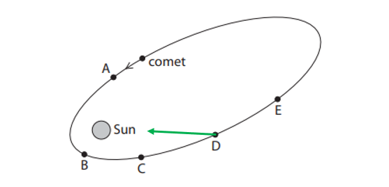

- An arrow pointing directly towards the Sun; **[1 mark]**

(iv) State at which of the points shown the comet has the greatest kinetic energy:

- The comet has the greatest kinetic energy when the force on it is greatest and the gravitational potential energy is smallest
- Therefore the greatest kinetic energy is when the comet is closest to the Sun
- This is point B; **[1 mark]**

**[Total: 4 marks]**

## Q12 — medium — 8 marks · exam-questions

### 4((a)) — 3 marks
To calculate the average orbital speed of Mercury:

List the known quantities:

- Time of orbit of Mercury = 88 days
- Average radius of Mercury's orbit = 58 000 000 km

From the equation sheet:

- $v=\frac{2πr}{T}$

Substitute in known values into the equation:

- $v=\frac{2πr}{T}=\frac{2π\times58000000}{88}$ **[1 mark]**

Calculate *v*:

- *v* = 4 138 560 = 4 140 000 **[1 mark]**

State the unit:

- km / day **[1 mark]**

**[Total: 3 marks]**

> *You can also convert to metres, hours, seconds etc.*

> *The correct answers are:*

- *47 930 m / s*
- *47.930 km / s*
- *172 439 596 m / hr*
- *172 548.596 km / hr*

> *The key is that the unit must match the calculation - but don't make it complicated if you don't have to! Keeping it in km and days is perfectly fine unless you're asked to give it in a different unit.*

### 4((b)) — 2 marks
(i) State the force that causes comets and planets to orbit the Sun:

- Gravitational force; **[1 mark]**

(ii) A diagram to show the orbit of a typical comet which would obtain one mark is:

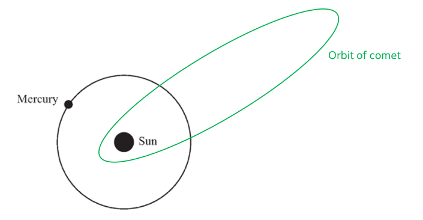

- Oval / elliptical orbit drawn, with the sun at one end; **[1 mark]**

**[Total: 2 marks]**

### 4((b)) — 3 marks
(i) The point at which the comet travels the fastest is:

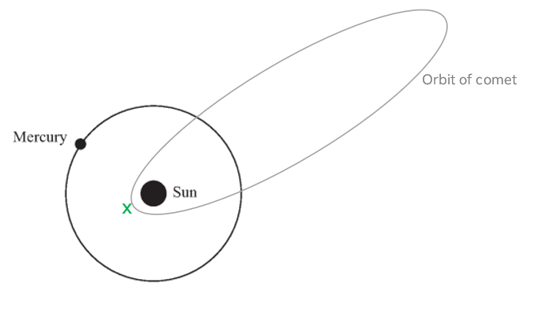

- X marked at point closest to the Sun; **[1 mark]**

(ii) The comet travels fastest at point X because:

**EITHER an argument involving energy:**

Any **two **from:

- Energy transfers from the comet's gravitational potential energy (GPE) store to it's kinetic energy (KE) store; **[1 mark]**
- As the comet approaches the Sun, GPE transfers to KE, (hence the comet's) speed increases; **[1 mark]**
- Therefore, KE is greatest when the comet is at point X / closest to the Sun; **[1 mark]**

**OR an argument involving force:**

Any **two **from:

- The gravitational force on the comet changes with distance from the Sun; **[1 mark]**
- As the comet approaches the Sun, the gravitational force increases, (hence the comet's) speed increases; **[1 mark]**
- Therefore, the gravitational force is greatest when the comet is at point X / closest to the Sun; **[1 mark]**

**[Total: 3 marks]**

## Q13 — hard — 11 marks · exam-questions

### 9((a)) — 1 marks
The force that keeps the telescope in orbit around the Earth:

- Gravity; **[1 mark]**

**[Total: 1 mark]**

> *'Gravity' will be accepted in your exam, although the fully correct answer is 'the gravitational force'.*

### 9((b)) — 4 marks
(i) Calculate the radius of the orbit of the Hubble Space Telescope:

List the known quantities:

- Distance above the Earth, *d *= 560 km
- Radius of the Earth, *r* = 6400 km

Calculate the radius of the orbit:

- Radius of orbit, $R=radiusoftheEarth+heightabovethesurface$
- Therefore, $R=6400+560$
- *R* = 6960 km; **[1 mark]**

(ii) Calculate the orbital speed giving the answer in m/s:

List the known quantities:

- Orbital radius, *R* = 6960 km
- Time to complete one orbit, *T* = 96 minutes

Convert the non-standard units to SI units:

- Orbital radius, *R* = 6960 km, therefore $R=6960\times1000=6960\times10^{3}m$

**AND**

- Time period, *T* = 96 minutes, therefore $T=96\times60=5760\mathrm{seconds}$ ** [1 mark]**

From the equation sheet:

- $orbitalspeed=\frac{2π\timesorbitalradius}{timeperiod}\,$

Substitute the values and calculate:

- $orbitalspeed=\frac{2π\times6960\times10^{3}}{5760}=7592\,$** [1 mark]**

Round to correct significant figures and include the units:

- Orbital speed = 7 592** [1 mark]**
- Units = m/s** [1 mark]**

**[Total: 4 marks]**

### 9((b)) — 3 marks
The reason why the Chandra Telescope moves faster when it orbits nearer to Earth:

Any **three **points from:

- The total energy (gravitational potential and kinetic energy) of an object in orbit is conserved; **[1 mark]**
- Gravitational potential energy is proportional to the object's distance from the surface of the Earth; **[1 mark]**
- Therefore, when an object is closer to the Earth, its gravitational potential energy is lower, so its kinetic energy must be higher; **[1 mark]**
- Kinetic energy is proportional to velocity squared, so if kinetic energy is larger, velocity will also be larger; **[1 mark]**

**[Total: 3 marks]**

### 9((b)) — 3 marks
(i) The type of wave that includes X-rays and visible light is:

- The electromagnetic spectrum; **[1 mark]**

(ii) Two differences between X-rays and visible light are:

Any **two **from:

- X-rays are higher frequency; **[1 mark]**
- X-rays are shorter wavelength; **[1 mark]**
- X-rays are higher energy; **[1 mark]**
- X-rays are more penetrating; **[1 mark]**
- X-rays are more ionising; **[1 mark]**

**[Total: 3 marks]**

> *You may have answered part (ii) by saying that visible light had lower frequency, less energy and so on. This is still, of course, correct.*

> *As a useful strategy, answer questions like this one as a bullet-point list and stick to saying either 'x-rays are' or 'visible light is' but don't swap between the two. If you do then you risk repeating yourself.*

> *For example, stating that:*

- *x-rays have higher frequency*
- *visible light has lower frequency*

> *Is a repeat of one point and so only worth one mark, even though there are two statements.*

## Q14 — hard — 5 marks · exam-questions

### 10((a)) — 1 marks
A property of electromagnetic waves that makes microwaves suitable for communications with a satellite in space:

- They travel at the same speed / the speed of light (so can travel large distances quickly); **[1 mark]**

**[Total: 1 mark]**

### 10((b)) — 4 marks
To calculate the orbital radius:

List the known quantities:

- Time to orbit the Earth, *t *= 24 hours
- Orbital speed, *s* = 3.1 km/s

Convert the non-standard units for time to SI units to match the units of speed:

- Time = 24 hours
- Therefore $t=24\times60\times60=86400\mathrm{seconds}$ ** [1 mark]**

From the formula sheet:

- $orbitalspeed=\frac{2π\timesorbitalradius}{timeperiod}\,$

Rearrange to make orbital radius the subject:

- $orbitalradius=\frac{orbitalspeed\timestimeperiod}{2π}\,$

Substitute the values and calculate:

- $orbitalradius=\frac{3.1\times86400}{2π}=42628\,$** [1 mark]**

Round to correct significant figures and include the units:

- Orbital radius = 42 600** [1 mark]**
- Units = km** [1 mark]**

**[Total: 4 marks]**

## Q15 — hard — 8 marks · exam-questions

### 10((b)) — 3 marks
(i) State two similarities between the orbits of Earth and Mars:

Any **two** from:

- The (orbit) shapes are both (approximately) circular / elliptical / oval; **[1 mark]**
- Both planets orbit the same star / the Sun; **[1 mark]**
- Both planets have a similar plane of orbit; **[1 mark]**
- Both planets have the same direction of orbit; **[1 mark]**

(ii) State one difference between the orbits of Earth and Mars:

Any **one** from:

- They have different orbital radii;** [1 mark]**
- The Earth has a smaller orbital radius than Mars (or vice versa);** [1 mark]**
- They have different orbital periods; **[1 mark]**
- The Earth completes one orbit in a shorter time period than Mars (or vice versa); **[1 mark]**
- They have different orbital speeds; **[1 mark]**
- The Earth has a faster orbital speed than Mars (or vice versa); **[1 mark]**

**[Total: 3 marks]**

### 10((c)) — 3 marks
To calculate the orbital speed of Deimos in kilometres per day:

List the known quantities:

- Orbital time period of Deimos = 1.26 days
- Radius of the Earth's orbit = 23 500 km

From the equation sheet:

- $v=\frac{2πr}{T}$

Substitute in known values into the equation:

- $v=\frac{2πr}{T}=\frac{2π\times23500}{1.26}$ **[1 mark]**

Calculate v:

- *v* = 117 000 **[1 mark]**

State the answer to 2 significant figures:

- *v* = 120 000 km / day **[1 mark]**

**[Total: 3 hours]**

> *If the question asks for the answer to be to a specific number of significant figures, do make sure you round to this value as it will be worth a mark!*

### 10((d)) — 2 marks
Max **one** mark for:

- The orbital radii of the two moons are different; **[1 mark]**

Max **two** marks for:

- The orbital radius of Enceladus is <u>larger</u> **OR** the orbital radius of Enceladus is ten times <u>larger</u>; **[1 mark]**

**[Total: 2 marks]**

> *A larger orbital radius will mean a larger circumference of orbit. Therefore, if the speed is larger but the time period is the same then the distance travelled (the circumference) must be greater as *$speed\proptodistance$*.*

## Q16 — hard — 9 marks · exam-questions

### 6((b)) — 2 marks
To calculate the orbital speed of the Earth in km / day:

List the known quantities:

- Time of orbit of Mars = 690 days
- Radius of Mars's orbit = 250 000 000 km

From the equation sheet:

- $v=\frac{2πr}{T}$

Substitute in known values into the equation:

- $v=\frac{2πr}{T}=\frac{2π\times250000000}{690}$ **[1 mark]**

Calculate *v*:

- *v* = 2 300 000 km / day **[1 mark]**

**[Total: 2 marks]**

### 6((b)) — 2 marks
To explain why the distance between Earth and Mars is not constant:

Any** two** from:

- They are both moving at different speeds; **[1 mark]**
- Calculating the speed of the Earth and comparing it with the speed of Mars

  - $v=\frac{2πr}{T}=\frac{2π\times150000000}{365}=2580000$ km / day
  - This is faster than the speed of Mars; **[1 mark]**
- They have different orbital radii; **[1 mark]**
- They have variable relative motion

  - For example, both are on the same side of the Sun and then after a period of time they are on opposite sides of the Sun; **[1 mark]**

A diagram which would illustrate the last two points is:

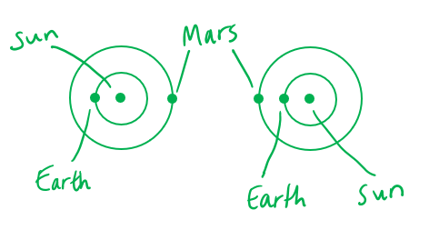

**[Total: 2 marks]**

### 6((c)) — 3 marks
To show that when the planets are 170 000 000 km apart, it takes about 600 s for light to travel this distance:

List the known quantities:

- Speed of light = 300 000 km / s
- Distance = 170 000 000 km

Recall the equation linking speed, distance and time

- $\mathrm{speed}=\frac{\mathrm{distance}}{\mathrm{time}}$

Substitute in known values:

- $300000=\frac{170000000}{t}$**[1 mark]**

Rearrange the equation:

- $t=\frac{170000000}{300000}$ **[1 mark]**

Calculate *t*:

- *t* = 567 s which is about 600 s **[1 mark]**

**[Total: 3 marks]**

> *For 'show that' questions, full working must be seen to gain the marks.*

### 6((c)) — 2 marks
The speed of the vehicle on Mars is kept low because:

Any **two** from the following points:

Effect of low speed on driving:

- Low speed reduces stopping distance / helps to avoid obstacles; **[1 mark]**

Effect of low speed on a collision:

- Momentum / low speed / low (kinetic) energy <u>reduces damage</u> if a collision occurs; **[1 mark]**

Value of the time delay:

- The images are 600 s delayed (from c), therefore the total delay = 1200 s; **[1 mark]**

Effect of the time delay:

- Time delay can affect reaction time / stopping distance / steering; **[1 mark]**

**[Total: 2 marks]**

## Q17 — hard — 12 marks · exam-questions

### 10((a)) — 1 marks
To find which planet has about the same diameter as the Earth:

- Locate the diameter of the Earth on the table:

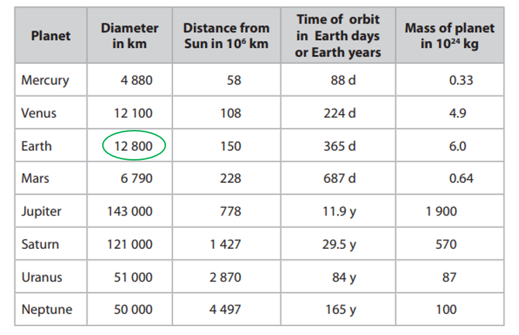

- Locate the closest value to this in the table:

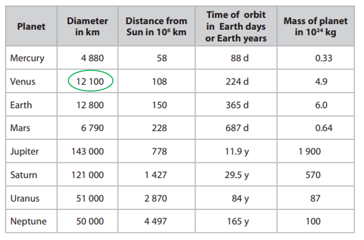

- Therefore the planet with about the same diameter as the Earth is Venus; **[1 mark]**

**[Total: 1 mark]**

### 10((b)) — 1 marks
State a reason why Jupiter has the largest gravitational field strength:

- Jupiter has the largest mass; **[1 mark]**

**[Total: 1 mark]**

### 10((c)) — 4 marks
(i) State the equation linking density, mass and volume:

- $\mathrm{density}=\frac{\mathrm{mass}}{\mathrm{volume}}$ **[1 mark]**

**OR**

- $ρ=\frac{m}{V}$ **[1 mark]**

(ii) To calculate the density of Neptune:

List the known quantities:

- Diameter of Neptune = 50 000 km
- Mass of Neptune = 100 × 1024 kg

Equations given in part (i) or the question:

- $ρ=\frac{m}{V}$
- $volume=\frac{4πr^{3}}{3}$

Calculate radius from the diameter:

- Diameter = 2 × radius
- 50 000 = 2 × radius
- radius = 25 000 km** [1 mark]**

Substitute in known values into the equation for density:

- $ρ=\frac{m}{V}=\frac{m}{\frac{4πr^{3}}{3}}=\frac{3m}{4πr^{3}}$
- `rho equals fraction numerator 3 m over denominator 4 pi r cubed end fraction equals fraction numerator 3 cross times open parentheses 100 cross times 10 to the power of 24 close parentheses over denominator 4 cross times pi cross times open parentheses 25 space 000 close parentheses cubed end fraction` **[1 mark]**

Calculate density:

- ρ = 1.5 × 1012 (kg / km3) **[1 mark]**

**[Total: 4 marks]**

> *If diameter is used instead of radius then the answer obtained will be 1.9 × 10**11**. This would gain 2 marks.*

### 10((d)) — 3 marks
To calculate the orbital speed of the Earth in kilometres per second:

List the known quantities:

- Orbital time of the Earth = 365 days
- Radius of the Earth's orbit = 150 × 106 km

From the equation sheet:

- $v=\frac{2πr}{T}$

Convert from days to seconds:

- 1 day = 24 × 60 × 60 seconds
- 365 days = 31 536 000 seconds **[1 mark]**

Substitute in known values into the equation:

- $v=\frac{2πr}{T}=\frac{2π\times150000000}{31536000}$ **[1 mark]**

Calculate *v*:

- *v* = 29.9 km / s **[1 mark]**

**[Total: 3 hours]**

### 10((e)) — 3 marks
To evaluate the statement 'the smaller the planet, the shorter its period of orbit':

Any **three** from the following:

State the link between period and time of orbit:

- Period of orbit = time of orbit; **[1 mark]**

Give detail from the table:

- The first three planets in the table appear to agree with the statement as their orbital period increases as the diameter increases; **[1 mark]**

**OR**

- (The statement is incorrect because) the remaining planets prove the statement to be incorrect as the orbital period does not increase as the diameter increases; **[1 mark]**

Use data to compare at least 2 named planets, for example:

- The diameter of Jupiter is almost 3 times larger than that of Neptune, but its orbital period is almost 14 times smaller; **[1 mark]**

State what orbital period does depend on:

- Orbital period depends on distance from the Sun; **[1 mark]**

**[Total: 3 marks]**

> *The example comparing Jupiter and Neptune is just one option, you could compare Jupiter to Saturn or Uranus, or Saturn to Uranus or Neptune for example.*
