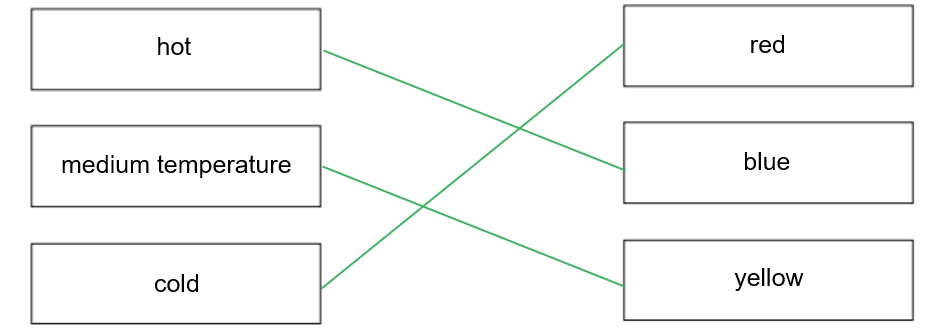

# Mark Schemes — Stellar Evolution
**8. Astrophysics** · Edexcel IGCSE Science (Double Award) (4SD0) — 17/Physics

## Q1 — easy — 7 marks · exam-questions

### 1() — 3 marks
A correct sentence using the words from the box to complete the gaps is:

- A very dense **neutron** star is left behind; **[1 mark]**
- When a large red **super giant** star blows up; **[1 mark]**
- In an explosion called a **supernova**; **[1 mark]**

**[Total: 3 marks]**

### 2() — 1 marks
**Correct answer: D** — Colour

**Final answer:** **The correct answer is ****D ****because: **

- Stars are classified according to their colour

- Warm objects emit infrared and extremely hot objects emit visible light as well

  - Therefore, the **colour** they emit depends on how **hot** they are

### 3() — 3 marks
A diagram with lines drawn correctly should look like this:

- Line drawn from hot to blue; **[1 mark]**
- Line drawn from medium temperature to yellow; **[1 mark]**
- Line drawn from cold to red;** [1 mark]**

**[Total: 3 marks]**

## Q2 — easy — 5 marks · exam-questions

### 1() — 2 marks
(i) The name of the force that pulls the dust and gas together is:

- Gravitational (force); **[1 mark]**

(ii) Smaller masses which may form are called:

- Planets; **[1 mark]**

**[Total: 2 marks]**

### 2() — 3 marks
A diagram with the correct labels should look like this:

- **Nebula** in the first gap; **[1 mark]**
- **Main sequence star**** **in the second gap; **[1 mark]**
- **White dwarf**** **in the third gap; **[1 mark]**

**[Total: 3 marks]**

## Q3 — easy — 10 marks · exam-questions

### 1() — 3 marks
Stars are formed when:

- Enough dust and gas from space; **[1 mark]**
- Is pulled together; **[1 mark]**
- By gravitational attraction; **[1 mark]**

**[Total: 3 marks]**

### 2() — 3 marks
(i) The correct sentence is:

- Nuclear **fusion** releases energy inside stars;** [1 mark]**

(ii) The correct sentence is:

- A star is stable during the 'main sequence' period in its life because the **forces ****[1 mark]**
- Within it are **balanced**** ****[1 mark]**

** **

**[Total: 3 marks]**

### 3() — 4 marks
The correct stages of the life cycle of the large star after the main sequence are:

- **Red giant / supergiant** on the first line; **[1 mark]**
- **Supernova** on the second line; **[1 mark]**
- **Neutron star** in one of the boxes on the final line; **[1 mark]**
- **Black hole** in the other box on the final line; **[1 mark]**

**[Total: 4 marks]**

## Q4 — medium — 7 marks · exam-questions

### 1() — 1 marks
The process described in the diagram is:

- The life cycle of a solar mass star / a star with a similar mass to the Sun; **[1 mark]**

**[Total: 1 mark]**

### 2() — 1 marks
**Correct answer: D** — 

**Final answer:** **The correct answer is ****D**** because:**

- The process described in stage 3 is nuclear** fusion**

  - This is when smaller nuclei join together to form a larger nucleus

- Helium nuclei are formed when hydrogen nuclei join together

  - The smaller nucleus is hydrogen
  - The larger nucleus is helium

- This is option **D**

**A & C** are incorrect as nuclear fusion takes place in stars, not fission. Fission involves very large, unstable nuclei splitting into smaller, more stable nuclei

**B** is incorrect as hydrogen consists of a singular proton, whereas helium contains 2 protons and 2 neutrons making it the larger nucleus

### 3() — 1 marks
**Correct answer: B** — stage 3

**Final answer:** **The correct answer is ****B**** because:**

- Stage 3 is the **main sequence** stage
- This is the most stable stage

  - This is because the energy released when hydrogen nuclei fuse to become helium is high enough to overcome inward gravitational forces
  - Hence, these fusion reactions prevent the star from collapsing
  - This stage ends when the supply of hydrogen in the core runs out, and this can take an extremely long time depending on the mass of the star

- This stage can last anywhere from a few billion (solar mass stars) to hundreds of billions of years (stars with much lower masses than solar mass)

### 4() — 4 marks
(i) The name of the life cycle stage in stage 4 is:

- Red (super)giant;** [1 mark]**

(ii) In stage 4:

- Hydrogen runs out / is used up;** [1 mark]**
- Nuclei larger than helium nuclei are formed;** [1 mark]**
- The (outer layers of the) star expands and becomes more red (in colour);** [1 mark]**

**[Total: 4 marks]**

> *Remember that **fusion** occurs in **stars*

> *Fusion happens when **smaller nuclei** (smaller than iron) fuse together to form **larger nuclei*

## Q5 — medium — 11 marks · exam-questions

### 1() — 4 marks
The colour classification of stars from hottest to coolest is as follows:

| **Colour** | **Number** |
|---|---|
| Yellow-white | **Final answer:** **4** |
| Blue | **Final answer:** **1** |
| Red | **Final answer:** **7** |
| Yellow | **Final answer:** **5** |
| Yellow-orange | **Final answer:** **6** |
| White | **Final answer:** **3** |
| Blue-white | **Final answer:** **2** |

- Correct order:

  - **Hottest  **blue, blue-white, white, yellow-white, yellow, yellow-orange, red  **Coolest**

- Blue = 1 and red = 7; **[1 mark]**
- Yellow = 5 and white = 3; **[1 mark]**
- Yellow-white = 4 and blue-white = 2; **[1 mark]**
- Yellow-orange = 6; **[1 mark]**

**[Total: 4 marks]**

### 2() — 5 marks
(i) Identify the coolest stage of a star's life cycle:

- Red giant; **[1 mark]**

Explain why this is the coolest stage:

- Astronomical objects cool as they expand **OR **red is the coolest temperature / the lowest energy of visible light; **[1 mark]**

(ii) Identify the final stage of a star larger than the Sun's life cycle:

- White dwarf; **[1 mark]**

Explain why the colour of the star is white:

- The outer layers of the red giant are ejected (forming a planetary nebula); **[1 mark]**
- The core shrinks / becomes unstable / collapses to form a white dwarf; **[1 mark]**

**[Total: 5 marks]**

### 3() — 2 marks
Stars like the Sun are formed when:

- A giant cloud of gas and dust** OR** a star forming nebula; **[1 mark]**
- Is condensed / pulled into a smaller volume by gravity; **[1 mark]**

**[Total: 2 marks]**

## Q6 — medium — 8 marks · exam-questions

### 1() — 2 marks
The similarities between main sequence stars are:

- Fusion takes place in their cores; **[1 mark]**
- Hydrogen is fused into helium; **[1 mark]**

**[Total: 2 marks]**

### 2() — 2 marks
A table with ticks (**✓**) in the correct place to identify the correct statements regarding the relationship between a star's colour and its surface temperature looks like this:

| **Statement** | **Correct (✓)** |
|---|---|
| red stars have a relatively high temperature |   |
| blue stars have a relatively high temperature | **✓** |
| yellow stars have a relatively low temperature | **✓** |
| blue-white stars have a relatively low temperature |   |

- Blue stars have a relatively high temperature; **[1 mark]**
- Yellow stars have a relatively low temperature; **[1 mark]**

**[Total: 2 marks]**

### 3() — 4 marks
(i) A star with a temperature of 7000 K is:

- Canopus; **[1 mark]**

(ii) A star with a temperature of 2000 K is:

- Betelgeuse; **[1 mark]**

(iii) The largest star is likely to be:

- Betelgeuse; **[1 mark]**
- (Because it is likely to be) a red giant; **[1 mark]**

**[Total: 4 marks]**

- *Betelgeuse is bigger because it has a temperature of **2000 K*

  - *Hence, it is **red** in colour*
  - *So, must be a **red giant*
  - *A star is at its **largest **when it is a **red giant **or** supergiant*

## Q7 — hard — 16 marks · exam-questions

### 1() — 8 marks
(i) The object that forms in stage 2 is a:

- Protostar; **[1 mark]**
- (This forms when) the force of gravity / gravitational attraction pulls the cloud of <u>dust and gas</u> together; **[1 mark]**

- The greater the mass (of the dust and gas), the <u>greater</u> the gravitational force / force due to gravity;** [1 mark]**
- The greater the separation (between the dust and gas) the <u>smaller</u> the gravitational force / force due to gravity;** [1 mark]**

** **

(ii) The object that forms in stage 4 is a:

- Red giant; **[1 mark]**
- (This forms when) hydrogen runs out / is used up (in the star's core); **[1 mark]**
- (As a result, the core contracts and heats up so) fusion begins to produce nuclei larger than helium; **[1 mark]**
- The (outer layers of the) star expands and becomes a <u>red giant</u>; **[1 mark]**

**[Total: 8 marks]**

### 2() — 1 marks
**Correct answer: C** — 109 to 1011 years

**Final answer:** **The correct answer is ****C**** because:**

- Stage 3 describes the **main sequence** stage
- This stage can last anywhere from

  - A few billion years (for solar mass stars) - about 109 years
  - Up to hundreds of billions of years (for stars with much lower masses than solar mass) - about 1011 years

- So, for a low-mass star, the timescale of stage 3 is anywhere between 109 to 1011 years

  - This is option **C**

### 3() — 2 marks
The star in stage 3 remains stable for billions of years because:

- The radiation pressure and gravity / gravitational attraction are balanced / in equilibrium; **[1 mark]**
- There is sufficient / a large amount of hydrogen / fuel to last a very long time;** [1 mark]**

**[Total: 2 marks]**

> *It is important to note here that it would **not **be** **correct to write that the radiation pressure and gravity are **equal**, make sure you are clear that they are **balanced*

### 4() — 5 marks
Compare and contrast the final stages in the life cycles of low-mass and high-mass stars:

- Stage 4 = after the main sequence ends
- Stage 5 = end of the star's life

The similarities in stage 4 for low-mass and high-mass stars are:

Any **one** from:

- (This stage is triggered because) hydrogen runs out / is used up **OR **fusion reactions decrease; **[1 mark]**
- In both, the inner core shrinks / heats up / fusion starts again; **[1 mark]**
- In both, the outer part of the star expands; **[1 mark]**
- In both, the surface temperature decreases / becomes more red; **[1 mark]**

The differences in stage 4 for low-mass and high-mass stars are:

Any **one** from:

- High mass stars become <u>red supergiants</u> (whereas a low-mass star becomes a red giant); **[1 mark]**
- A red supergiant is much larger (than a red giant); **[1 mark]**
- A red supergiant will run out of nuclear fuel much faster than a red giant **OR** stage 4 is much shorter for high-mass stars; **[1 mark]**

The similarities in stage 5 for low-mass and high-mass stars are:

Any **one** from:

- (This stage is triggered because) all nuclear fuel runs out / is used up **OR **fusion reactions stop permanently; **[1 mark]**
- In both, the outer layers of the star spread out into space; **[1 mark]**
- In both, fusion takes place using elements heavier than hydrogen; **[1 mark]**

The differences in stage 5 for low-mass and high-mass stars are:

Any **one** from:

- In low-mass stars, fusion stops after helium is used up; **[1 mark]**
- In high-mass stars, fusion of heavier elements occurs (up to iron); **[1 mark]**
- Low-mass stars become white dwarfs; **[1 mark]**
- White dwarfs will gradually cool (until they become black dwarfs); **[1 mark]**
- High-mass stars explode in a supernova; **[1 mark]**
- (After supernova) it either becomes a black hole or a neutron star (depending on mass); **[1 mark]**

**[Total: 5 marks]**

- *Questions where you have to **compare two things** are tricky*
- *In your answer you must mention:*

  - *Both processes*
  - *Similarities*
  - *Differences*

## Q8 — hard — 9 marks · exam-questions

### 1() — 4 marks
(i) State the differences in mass between the stars:

- Proxima Centauri has a much lower mass than the Sun **AND**
- VY Canis Majoris has a much higher mass than the Sun; **[1 mark]**

(ii) Different masses affect the time a star remains stable in the following ways:

- Stars with lower masses (than the Sun) / Proxima Centauri will remain stable for a much longer time (than the Sun); **[1 mark]**
- Stars with higher masses (than the Sun) / VY Canis Majoris will remain stable for a much shorter time (than the Sun); **[1 mark]**
- (This is because) fusion in (the cores of) higher mass stars uses up hydrogen much faster than lower mass stars; **[1 mark]**

**[Total: 4 marks]**

### 2() — 5 marks
The evolution of the Sun & Proxima Centauri after they leave the main sequence:

Any **two** from:

- Both (Proxima Centauri and the Sun) will expand and become red giants; **[1 mark]**
- Then they will become white dwarfs; **[1 mark]**
- The white dwarfs will gradually cool (until they become black dwarfs); **[1 mark]**

The evolution of the VY Canis Majoris after leaving the main sequence:

Any **three** from:

- VY Canis Majoris will become a red supergiant; **[1 mark]**
- Then it will explode in a supernova; **[1 mark]**
- The remaining star will either be a black hole or a neutron star (depending on mass); **[1 mark]**
- The black hole does not emit light; **[1 mark]**
- The neutron star is small, produces no new heat and cools slowly;** [1 mark]**

**[Total: 5 marks]**
