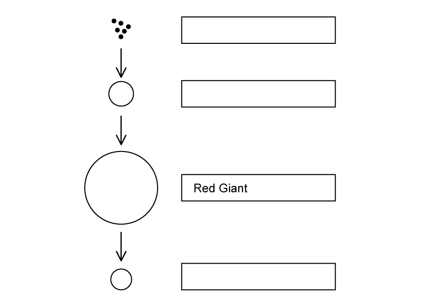
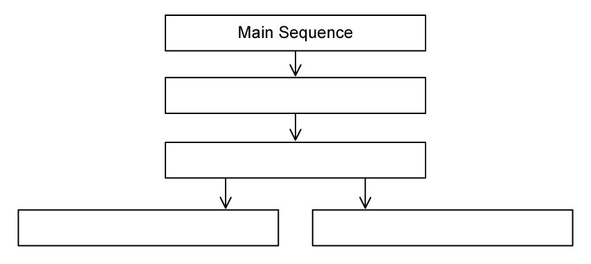

# Exam Questions — Stellar Evolution
**8. Astrophysics** · Edexcel IGCSE Science (Double Award) (4SD0) — 17/Physics
> Source: [https://www.savemyexams.com/igcse/science/edexcel/double-award/17/physics/topic-questions/astrophysics/stellar-evolution/exam-questions/](https://www.savemyexams.com/igcse/science/edexcel/double-award/17/physics/topic-questions/astrophysics/stellar-evolution/exam-questions/) · 8 questions · total 73 marks

## Q1 — easy — 7 marks · exam-questions

### 1() — 3 marks — command: add — structured
The sentence gives information about the life cycle of a star.

Add words from the box in the gaps to make a sentence that is correct.

| **neutron** | **supernova** | **super giant** | **dwarf ** | **momentum** |
|---|---|---|---|---|

A very dense .................................. star is left behind when a large red .................................. star blows up in an explosion called a ..................................

### 2() — 1 mark — multiple_choice
Which of the following statements is a property used to classify stars?
- **A.** Radius
- **B.** Distance from the Earth
- **C.** The times when it is visible to observers on Earth
- **D.** Colour

### 3() — 3 marks — command: draw — structured
Draw lines between the colour and the temperature to show the correct colour and temperature of the stars.

## Q2 — easy — 5 marks · exam-questions

### 1() — 2 marks — command: state — structured
This paragraph is from a website.

| *A star forms when enough dust and gas are pulled together. Masses smaller than a star may also be formed when dust and gas are pulled together.* |
|---|

(i) State the name of the force that pulls the dust and gas together.

**[1]**

(ii) State the name of the *mass smaller than a star that may form when the gas and dust are pulled together*.

**[1]**

### 2() — 3 marks — command: label — structured
The diagram shows part of the life cycle of a star with a similar mass to the Sun.

| **black dwarf             nebula             fusion             white dwarf             main sequence star** |
|---|

Use words from the box to label the stages in the life cycle.

## Q3 — easy — 10 marks · exam-questions

### 1() — 3 marks — command: describe — structured
Describe how stars are formed.

### 2() — 3 marks — command: add — structured
Add words from the box in the gaps to make the sentences correct.

| **decay            balanced            fission             resultant forces            fusion          forces** |
|---|

**                                                  **

(i) Nuclear ...................................... releases energy inside stars.

**[1]**

** **

(ii) A star is stable during the 'main sequence' period in its life because the ...................................... within it are ...................................... **.**

**[2]**

### 3() — 4 marks — command: complete — structured
The life cycle of a star after the 'main sequence' period depends on the size of the star.  A particular star is much larger in size than the Sun.

Complete the stages of the life cycle of this star.

## Q4 — medium — 7 marks · exam-questions

### 1() — 1 mark — command: identify — structured
The diagram shows some incomplete notes about a stellar process. An astronomer left the notes to a colleague for them to decipher.

Identify the process described in the diagram.

### 2() — 1 mark — multiple_choice
The colleague wants to include some extra detail in stage 3.

Which of the following correctly describes the physical process outlined in stage 3 and the 'smaller nuclei' and 'bigger nuclei' that are mentioned?** **

|   | **physical process** | **smaller nucleus** | **larger nucleus** |
|---|---|---|---|
| **A** | nuclear fission | hydrogen | helium |
| **B** | nuclear fusion | helium | hydrogen |
| **C** | nuclear fission | helium | hydrogen |
| **D** | nuclear fusion | hydrogen | helium |
- **A.** 
- **B.** 
- **C.** 
- **D.** 

### 3() — 1 mark — multiple_choice
The longest stage in this process is
- **A.** stage 2
- **B.** stage 3
- **C.** stage 4
- **D.** stage 5

### 4() — 4 marks — command: multiple — structured
(i) State the name given to the star in stage 4.

**[1]** ** **

(ii) Explain what happens in stage 4.

**[3]**

## Q5 — medium — 11 marks · exam-questions

### 1() — 4 marks — command: place — structured
The colour of visible light a star emits tells us how hot or cold it is.

The table contains the colour classifications of the visible light emitted from stars.

Place a number from 1 − 7 in each box to put them in order from hottest (1) to coolest (7).

| **Colour** | **Number** |
|---|---|
| Yellow-white |   |
| Blue |   |
| Red |   |
| Yellow |   |
| Yellow-orange |   |
| White |   |
| Blue-white |   |

### 2() — 5 marks — command: explain — structured
(i) Identify and explain the coolest stage of a star's life cycle.

**[2]**

(ii) Identify and explain the final stage and colour in the life cycle of a star similar in size to the Sun.

**(3)**

### 3() — 2 marks — command: explain — structured
Explain how stars like the Sun are formed.

## Q6 — medium — 8 marks · exam-questions

### 1() — 2 marks — command: describe — structured
Most of the stars in the universe are main sequence stars, including the sun.

Describe the similarities between main sequence stars.

### 2() — 2 marks — command: add — structured
The table gives some statements about the relationship between a star's colour and its surface temperature.

Add ticks (**✓**) to the table to show which two statements are correct.

| **Statement** | **Correct (✓)** |
|---|---|
| red stars have a relatively high temperature |   |
| blue stars have a relatively high temperature |   |
| yellow stars have a relatively low temperature |   |
| blue-white stars have a relatively low temperature |   |

### 3() — 4 marks — command: multiple — structured
The table shows the colour and surface temperature of several known stars.

| **Colour** | **Surface Temperature (K)** | **Example** |
|---|---|---|
| red | < 3500 | Betelgeuse |
| orange | 3500 - 5000 | Aldebaran |
| yellow | 5000 - 6000 | Sun |
| yellow-white | 6000 - 7500 | Canopus |
| white | 7500 - 10 000 | Vega |
| blue-white | 10 000 - 25 000 | Rigel |
| blue | > 25 000 | 10 Lacertae |

(i) Identify a star with a temperature of 7000 K.

**[1]**

(ii) Identify a star with a temperature of 2000 K.

**[1]**

(iii) State and explain which of the stars you identified is likely to be the largest.

**[2]**

## Q7 — hard — 16 marks · exam-questions

### 1() — 8 marks — command: explain — structured
The table shows the 5 stages of the life cycle of a star that has a similar mass to the Sun.

| **Stage 1** | Initially, there is a massive cloud of dust and gas in space. |
|---|---|
| **Stage 2** |   |
| **Stage 3** | Hydrogen nuclei join together to make helium nuclei |
| **Stage 4** |   |
| **Stage 5** | The star eventually becomes unstable. An outer layer of dust and gas is ejected leaving behind a core. The core collapses due to gravity. |

(i) State and explain what happens in stage 2 of the diagram.

Include specific references to the relationships between

- the masses of the bodies involved and the forces acting between them
- the separation of the bodies involved and the forces acting between them

**[4]**

(ii) State and explain what happens in stage 4 of the diagram.

**[4]**

### 2() — 1 mark — multiple_choice
The timescale of stage 3 is in the order of
- **A.** 105 to 106 years
- **B.** 106 to 107 years
- **C.** 109 to 1011 years
- **D.** 1012 to 1015 years

### 3() — 2 marks — command: explain — structured
Explain why the star remains stable during stage 3 for the length of time you selected in part (b).

### 4() — 5 marks — command: contrast — structured
For stars with much larger masses than our Sun, stages 1 to 3 are almost exactly the same as lower mass stars. For the later stages, 4 and 5, the processes begin to differ.

Compare and contrast the final two stages in stars with much larger masses than our Sun and stars with similar masses to our Sun.

## Q8 — hard — 9 marks · exam-questions

### 1() — 4 marks — command: multiple — structured
The table contains information on the mass of different stars.

| **Star Name** | **Star Mass / kg** |
|---|---|
| Earth's Sun | 1.989 × 1030 |
| Proxima Centauri | 2.446 × 1029 |
| VY Canis Majoris | 3.381 × 1031 |

(i) Compare the masses of Proxima Centauri and VY Canis Majoris to the Sun.

**[1]**

(ii) Explain how these differences will affect the time these stars can remain stable.

**[3]**

### 2() — 5 marks — command: describe — structured
Describe what will happen to each of the stars after they leave the main sequence stage.
