# Mark Schemes — Current, Potential Difference & Resistance
**2. Electricity** · Edexcel IGCSE Science (Double Award) (4SD0) — 17/Physics

## Q1 — easy — 3 marks · exam-questions

### 1((a)) — 1 marks
**Correct answer: A** — 

**Final answer:** **The correct answer is ****A ****because:**

- This is the electrical symbol for a switch

**B** is incorrect as this is a diode

**C** is incorrect as this is a bulb

**D** is incorrect as this is a variable resistor

### 2() — 1 marks
**Correct answer: B** — 

**Final answer:** **The correct answer is ****B ****because:**

- A component that only allows current to flow in one direction is called a diode
- The electrical symbol for a diode is shown by **B**

**A** is incorrect as this is a switch

**C** is incorrect as this is a bulb

**D** is incorrect as this is a variable resisto*r*

### 3() — 1 marks
**Correct answer: D** — 

**Final answer:** **The correct answer is ****D**** because:**

- The component that can have its resistance varied by varying the length of wire is called a variable resistor
- The electrical symbol for a variable resistor is shown by **D**

**A** is incorrect as this is a switch

**B** is incorrect as this is a diode

**C** is incorrect as this is a bulb

## Q2 — easy — 6 marks · exam-questions

### 1((a)) — 3 marks
A diagram that would score 3 marks should look like this:

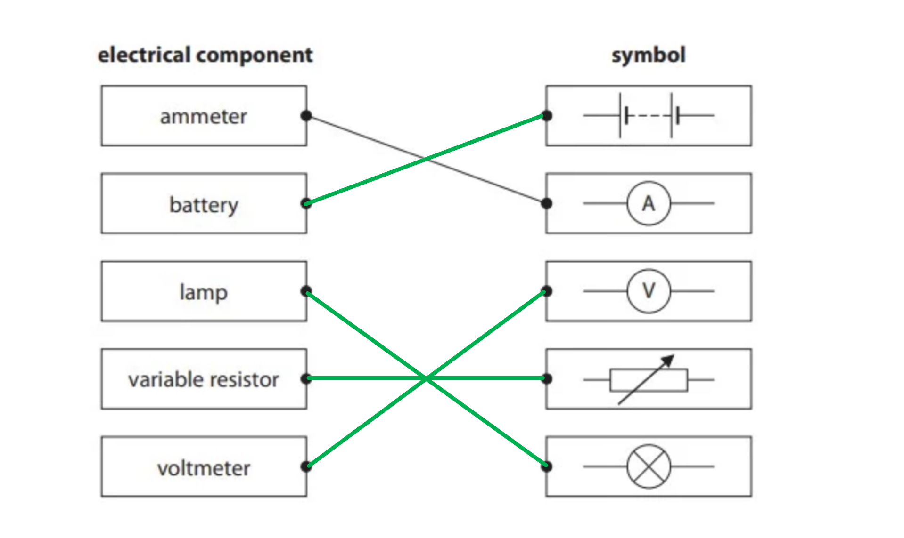

- All **4 lines** drawn correctly scores **3 marks**
- Any **2 lines** drawn correctly scores **2 marks**
- Any **1 line** drawn correctly scores **1 mark**

**[Total: 3 marks]**

### 1((b)) — 2 marks
(i) The component with changing resistance in different light intensities is a:

- Light dependent resistor / LDR; **[1 mark]**

(ii) The component with changing resistance in different temperatures is a:

- Thermistor; **[1 mark]**

### 5((a)) — 1 marks
**Correct answer: D** — 

**Final answer:** **The correct answer is ****D ****because:**

- This is the symbol for a thermistor

**A** is incorrect as this is a fuse

**B** is incorrect as this is a fixed resistor

**C** is incorrect as this is a variable resistor

## Q3 — easy — 7 marks · exam-questions

### 6((a)) — 3 marks
(i) The equation linking voltage, current and resistance:

- Voltage = current × resistance **OR**** ***V *= *IR ***[1 mark]**

(ii) Show that the current in the heater is about 10 A when it is working:

List the known quantities:

- Resistance, *R *= 22 Ω
- Voltage, *V *= 230 V

Rearrange and substitute in the known quantities:

- $V=IR\RightarrowI=\frac{V}{R}$
- $I=\frac{230}{22}$ **[1 mark]**
- $I$= 10.45 A **[1 mark]**

**[Total: 3 marks]**

> *In part (i) you can give your answer in any rearrangement but it is best to remember Ohm's Law in the form given. *

### 6((b)) — 4 marks
(i) The washing machine is fitted with a fuse because:

Any **two **from:

- (The fuse is a) safety device / reduces danger / reduces (electrical) hazards;** [1 mark]**
- In case there is a fault / short circuit;** [1 mark]**
- To control excessive current / current more than 13 A (from entering the appliance);** [1 mark]**
- To prevent (wire / appliance) from overheating;** [1 mark]**

(ii) It would not** **be sensible to replace the 13 A fuse with a 2 A fuse because:

- The total current (in the motor and the heater) is <u>more than 2 A</u>; **[1 mark]**
- A 2 A fuse would blow / melt / need to be replaced quickly; **[1 mark]**

**[Total: 4 marks]**

> *In your answer to part (ii) you will not be given a mark for referring to electric shock. You need to be more specific. *

## Q4 — easy — 2 marks · exam-questions

### 1() — 1 marks
The quantity defined as the rate of flow of charge is:

- <u>Current</u>; **[1 mark]**

**[Total: 1 mark]**

### 2() — 1 marks
The quantity defined as the energy transferred per unit charge passed is:

- Voltage / potential difference; **[1 mark]**

**[Total: 1 mark]**

## Q5 — easy — 8 marks · exam-questions

### 1() — 1 marks
The name of these particles is:

- The particles which flow in the wires of a circuit are <u>electrons</u>; **[1 mark]**

**[Total: 1 mark]**

### 2() — 4 marks
(i) To measure the total current in the circuit:

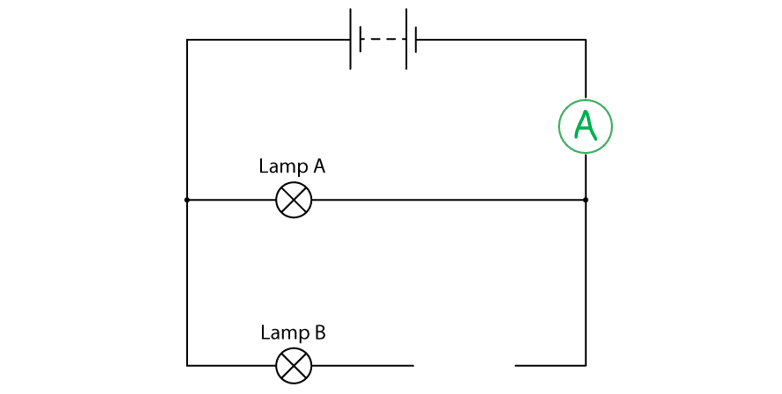

- Ammeter drawn in series with the power supply; **[1 mark]**

(ii) To vary the current in lamp B only:

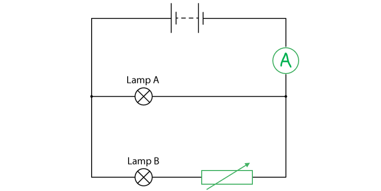

- Variable resistor drawn in series with lamp B; **[1 mark]**

(iii) To measure the voltage across lamp B:

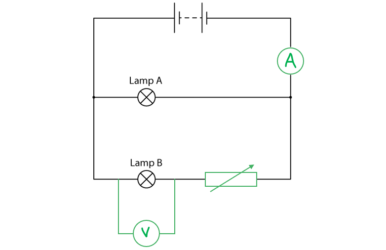

- Voltmeter symbol; **[1 mark]**
- In parallel with lamp B; **[1 mark]**

**[Total: 4 marks]**

> *It is important you are able to draw and recognise a whole range of electric circuit symbols as part of your Physics course. Use the revision notes to help with this. Make sure you know that an ammeter should always be placed in series (next to components) and a voltmeter should be placed in parallel (over the top of components). *

### 3() — 3 marks
(i) The equation linking voltage, current and resistance is:

- Voltage = Current × Resistance **OR ***V *= *IR ***[1 mark]**

(ii) Calculate the resistance of lamp A:

List the known quantities:

- Current, *I *= 0.20 A
- Voltage, *V *= 6.0 V

Rearrange and substitute the known quantities into the equation:

- $V=IR\RightarrowR=\frac{V}{I}$
- $R=\frac{6.0}{0.2}$ **[1 mark]**
- Resistance, *R *= 30 Ω **[1 mark]**

**[Total: 3 marks]**

> *Being able to rearrange equations in Physics is a really important skill. Have a look at how to rearrange Ohm's Law to make resistance the subject. *

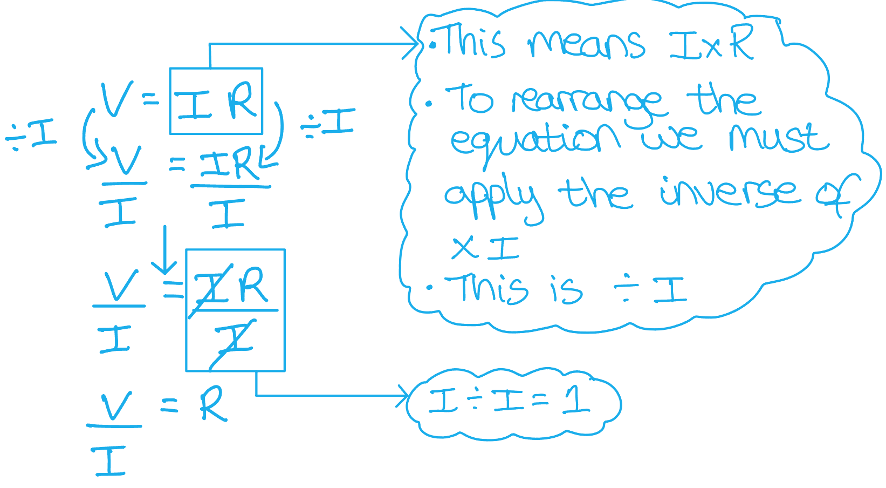

## Q6 — medium — 1 marks · exam-questions

### 2((b)) — 1 marks
**Correct answer: A** — negatively charged electrons

**Final answer:** **The correct answer is ****A ****because:**

- Current is caused by the flow of electrons
- Electrons have a negative charge

**B **is incorrect as protons are positively charged and found in the nucleus, so are not free to move within the conductor

**C **is incorrect as electrons are negatively charged

**D **is incorrect as protons are found in the nucleus, so are not free to move within the conductor

## Q7 — medium — 6 marks · exam-questions

### 11((b)) — 4 marks
(i) The equation linking charge, current and time is:

- $\mathrm{Current}=\frac{\mathrm{charge}}{\mathrm{time}}$ **OR **$I=\frac{Q}{t}$ **[1 mark]**

(ii) Calculate the amount of charge needed to recharge the battery fully, and give the unit:

List the known quantities:

- Current, *I* = 400 mA
- Time, *t* = 3.5 hours

Convert the known quantities to SI units:

- Current, $I=\frac{400}{1000}=0.4$ A
- Time, $t=3.5\times60\times60=12600$ s

Rearrange the equation to make charge, *Q*,  the subject and substitute in the known values:

- $Q=It$
- $Q=0.4\times12600$ **OR**
- $Q=\frac{400}{1000}\times3.5\times60\times60$ **[1 mark]**

Calculate the answer:

- $Q=5040$ **[1 mark]**

Provide the correct unit:

- C / Coulomb **[1 mark]**

**[Total: 4 marks]**

> *For part (i) you will still get the mark if you provide the equation correctly rearranged, for example *$Q=It$* or *$t=\frac{Q}{I}$*.*

> *For part (ii), the first mark is awarded for the correct substitution of known values, not for the rearranging of the equation, so if you provided the equation in its rearranged form, you will still get this mark. However, there is not a mark awarded here for the conversion of units into SI units, so this step can be performed separately or built into the calculation. *

### 11((c)) — 2 marks
Explain how moving the charger into the shade affects the time needed to recharge the battery fully:

- A longer charging time will be needed; **[1 mark]**

Because:

Any **one **from:

- $P=IV$ **[1 mark]**
- A lower current is supplied; **[1 mark]**
- Charged is supplied at a lower rate; **[1 mark]**
- The rate of charging is lower; **[1 mark]**
- There is less energy available; **[1 mark]**

**[Total: 2 marks]**

## Q8 — medium — 9 marks · exam-questions

### 8((a)) — 5 marks
(i) State the amount of energy transferred when one coulomb of charge passes through a potential difference of 385 V:

- Potential difference is the energy transferred per coulomb of charge

  - Therefore, energy transferred = potential difference

- Energy transferred = 385 J **[1 mark]**

(ii) Show that the total amount of energy transferred to the battery is about 70 MJ:

List the known quantities:

- Charge, *Q* = 180 000 C
- Potential difference, *V* = 385 V

Recall the equation for energy transferred:

- $E=QV$

Substitute in the known values to calculate the energy transferred:

- $E=180000\times385$ **[1 mark]**
- *E* = 69 300 000 / 69 000 000 (J) **OR**** ***E* = 69 (MJ) **[1 mark]**

(iii) Explain why the amount of energy transferred from the mains supply is more than 70 MJ:

- Some of the <u>energy</u> is <u>wasted</u> / <u>lost</u>; **[1 mark]**
- As <u>heat</u> to the surroundings / wires; **[1 mark]**

**[Total: 5 marks]**

### 8((b)) — 4 marks
(i) State the equation linking charge, current and time:

- Charge = current × time **OR **$Q=It$ **[1 mark]**

(ii) Calculate the average charging current in the battery:

List the known quantities:

- Time, *t* = 110 minutes
- Charge, *Q* = 180 000 C

Rearrange the equation from part (i) to make current the subject:

- $I=\frac{Q}{t}$ **[1 mark]**

Convert time into SI units:

- $t=110\times60=6600$ s

Substitute in the known values to calculate *I*:

- $I=\frac{180000}{6600}$ **[1 mark]**
- *I* = 27 (A) **[1 mark]**

**[Total: 4 marks]**

> *Remember that when stating an equation, you will get the mark if you give the equation in its rearranged form, as long as the rearrangement is correct!*

> *For calculations involving conversions of units, such as minutes into seconds, you can perform this step separately or you can perform it during the calculation. For example: *$I=\frac{180000}{110\times60}$

## Q9 — medium — 9 marks · exam-questions

### 5((a)) — 3 marks
A diagram that would score 3 marks should look like this:

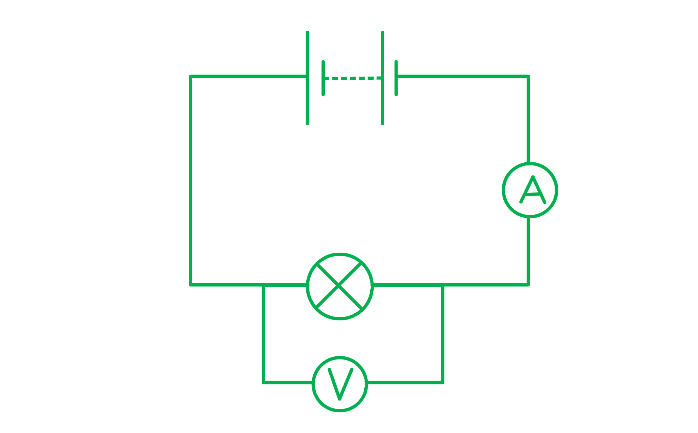

- Series circuit containing a <u>lamp and a power supply</u> using the correct symbols; **[1 mark]**
- Ammeter in series with the lamp and <u>battery</u>; **[1 mark]**
- Voltmeter in parallel across the lamp; **[1 mark]**

**[Total: 3 marks]**

> *It is important to read this question carefully. It says a battery and not a cell. So your diagram should reflect this. *

### 5((a)) — 1 marks
The relationship between voltage, current and resistance is:

- Voltage = current × resistance **OR ***V *= *IR ***[1 mark]**

**[Total: 1 mark]**

> *You can provide your answer as any correct rearrangement of this equation but it is best to remember the equation in this form. You can give your answer as words or symbols.*

### 5((a)) — 3 marks
List the known quantities:

- Voltage, *V *= 6.0 V

Recall the equation for current, voltage and resistance from part (b):

- Voltage = current × resistance

Rearrange the equation:

- $Resistance=\frac{Voltage}{Current}$

Obtain the value of the current from the graph:

- Current when the voltage is 6 V = 1.5 A **[1 mark]**

Substitute in the known quantities:

- $R=\frac{6}{1.5}$

Calculate the resistance:

- $R=4$**[1 mark]**

State the unit for resistance:

- Ohms (Ω) **[1 mark]**

**[Total: 3 marks]**

### 5((a)) — 2 marks
A graph that should score 2 marks would look like this:

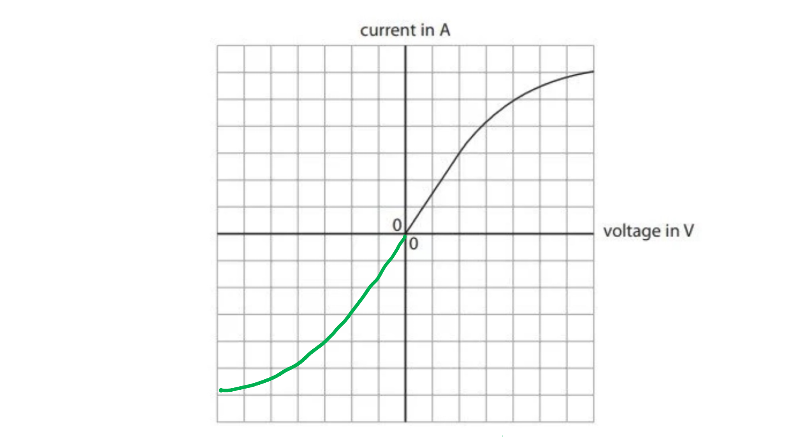

- The graph follows the <u>same curved shape</u> but in the opposite direction, initially straight and then curving gently; **[1 mark]**
- The graph begins to level out of the curve one row of squares from the bottom of the grid and does so with roughly one square before the edge of the graph paper; **[1 mark]**

**[Total: 2 marks]**

## Q10 — medium — 9 marks · exam-questions

### 1() — 3 marks
The correct circuit, with an ammeter and voltmeter, is as follows:

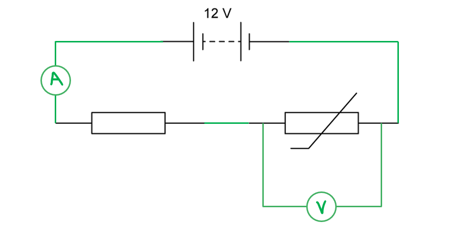

- Correct symbols for ammeter and voltmeter; **[1 mark]**
- Ammeter connected in series with battery, thermistor and resistor; **[1 mark]**
- Voltmeter connected in parallel with the thermistor; **[1 mark]**

**[Total: 3 marks]**

### 2() — 3 marks
(i) The relationship between voltage, current and resistance is:

- Voltage = current × resistance **OR ***V *= *IR ***[1 mark]**

(ii) Calculate the voltage across the 5 kΩ resistor:

List the known quantities:

- Current,* I* = 0.8 mA = 0.8 × 10−3 A
- Resistance, *R* = 5 kΩ = 5 × 103 Ω

Use the relationship between voltage, current and resistance to calculate voltage:

- *V* = *I* × *R* = (0.8 × 10−3) × (5 × 103) **[1 mark]**
- Voltage = 4 V **[1 mark]**

**[Total: 3 marks]**

### 3() — 3 marks
Determine if the voltage reading is consistent with the manufacturer's value of resistance:

List the known quantities:

- Current, *I* = 0.8 mA (from part b)
- Voltage across thermistor, *V* = 8 V

Determine the resistance of the thermistor:

- $V=IR\RightarrowR=\frac{V}{I}$
- $R=\frac{8}{0.8\times10^{-3}}$ **[1 mark]**
- *R* = 10 000 Ω = 10 kΩ **[1 mark]**

Write a concluding statement:

- The measured value of resistance, 10 kΩ, is not consistent with the manufacturer's value of 12 kΩ; **[1 mark]**

**[Total: 3 marks]**

## Q11 — hard — 6 marks · exam-questions

### 5() — 1 marks
**Correct answer: B** — 

**Final answer:** **The correct answer is ****B ****because:**

- A voltmeter must always be placed in parallel

  - This eliminates options **C **and **D**

- It must be placed in parallel with the component in the circuit it is measuring the voltage of

  - In this question, it is the LDR
  - This eliminates option **A**

- An ammeter must always be placed in series with the other components in the circuit

  - Hence the correct answer must be option **B**

### 2() — 5 marks
(a) Show that the resistance of the fixed resistor is about 120 Ω:

List the known quantities:

- Total voltage in circuit, $V_{total}$ = 12 V
- Total current in circuit, $I_{total}$ = 45 mA = 45 × 10−3 A
- Resistance of LDR, $R_{LDR}$ = 150 Ω

Determine the total resistance in the circuit:

- Voltage = current × resistance; **[1 mark]**
- $V_{total}=I_{total}\timesR_{total}\RightarrowR_{total}=\frac{V_{total}}{I_{total}}$
- $R_{total}=\frac{12}{45\times10^{-3}}$ **[1 mark]**
- $R_{total}$ = 267 Ω **[1 mark]**

Determine the resistance across the fixed resistor:

- For resistors in parallel:  $R_{total}=R_{1}+R_{2}\RightarrowR_{total}=R_{LDR}+R_{fixed}$
- $R_{fixed}=R_{total}-R_{LDR}$
- $R_{fixed}$ = 267 – 150 **[1 mark]**
- $R_{fixed}$ = 117 Ω **[1 mark]**

**[Total: 5 marks]**

- *Another perfectly valid method would be to calculate the voltage of the LDR and use this to calculate the voltage of the fixed resistor*
- *Remember, for components in series circuits:*

  - *The voltage is shared between them*
  - *The current is the same in each of them*

- *This means that the following equations apply:*

  - $V_{LDR}=I_{total}\timesR_{LDR}$
  - $V_{fixed}=I_{total}\timesR_{fixed}$

## Q12 — hard — 14 marks · exam-questions

### 8((a)) — 10 marks
(i) State the equation linking voltage, current and resistance:

- Voltage = current × resistance **OR **$V=IR$ **[1 mark]**

(ii) Calculate the potential difference across the 4.0 Ω resistor:

List the known quantities:

- Current, *I* = 1.2 A
- Resistance, *R* = 4.0 Ω

Substitute the known values in to the equation from part (i) to calculate the potential difference :

- $V=1.2\times4.0$ **[1 mark]**
- V = 4.8 (V) **[1 mark]**

(iii) Show that the voltage across the heater coil is about 7 V:

List the known quantities:

- The total voltage across the circuit is 12 V (from the power supply)
- The voltage across the resistor is 4.8 V (from part (ii))

Calculate the voltage across the heater coil:

- Voltage across heater coil = total voltage − voltage across resistor
- Voltage across heater coil = 12 − 4.8 **[1 mark]**
- Voltage across heater coil = 7.2 (V) **[1 mark]**

(iv) Calculate the energy transferred to the heater coil in 5.0 minutes:

List the known quantities:

- Current, *I* = 1.2 A (from part (ii))
- Voltage across the heating coil, *V* = 7.2 V (from part (ii))
- Time, *t* = 5.0 mins

From the equation sheet:

- Energy transferred = current × voltage × time or *E *= *I* × *V* × *t*

Convert time into SI units:

- $5.0\times60=300$ s **[1 mark]**

Substitute the known values into the equation to calculate *E*:

- $E=1.2\times7.2\times300$ **[1 mark]**
- E = 2600 (J) **[1 mark]**

(v) Explain why the temperature reaches a steady value:

- The rate of energy loss; **[1 mark]**
- Is equal to the rate of energy supply; **[1 mark]**

**[Total: 10 marks]**

> *Remember that for **state the equation** questions like part (i), you can give the equation in any arrangement - as long as it is correct! An equation triangle alone is not enough to get you the mark though. If you are struggling to remember the equation, look at the values given in the question, it will most likely be an equation that contains the variables they are giving you in the question stem. *

> *For part (v) you need to include the idea of energy losses from the water. If heat energy is transferred to the water at the same rate that heat energy is transferred away from the water, then the water will remain at a steady temperature. As long as you convey this idea, you will get both marks. *

### 8((b)) — 4 marks
(i) Complete the table by placing a tick (✔) in the correct boxes:

**One** mark for two correct ticks:

(ii) Describe the advantages and disadvantages of design X when used as a heater in a car window:

Any **three** from:

- An advantage of series circuits is that they have fewer wires; **[1 mark]**
- An disadvantage of series circuits is that they have higher resistance values;** [1 mark]**
- A disadvantage of series circuits is that if one component fails, the whole circuit fails; **[1 mark]**
- A disadvantage of series circuits is that there is no control of individual components (either they are all on, or they are all off); **[1 mark]**

**[Total: 4 marks]**

## Q13 — hard — 8 marks · exam-questions

### 1() — 3 marks
Calculate the energy transferred to an electron when it passes through a voltage of 180 kV:

List the known quantities:

- Charge of an electron, *q* = 1.6 × 10–19 C
- Voltage, *V* = 180 kV = 180 000 V

Use the definition of voltage to determine the energy transferred:

- Energy (transferred) = charge × voltage **OR** $E=q\timesV$ **[1 mark]**
- *E* = (1.6 × 10–19) × 180 000 **[1 mark]**
- Energy transferred = 2.9 × 10–14 J **[1 mark]**

**[Total: 3 marks]**

### 2() — 5 marks
List the known quantities:

- Charge of an electron, *q* = 1.6 × 10–19 C
- Total charge, *Q* = 3.5 × 10–8 C
- Time taken, *t* = 0.56 ms = 0.56 × 10–3 s

(i) Calculate the number of electrons on the van der Graaff generator:

- If the total charge is *Q* and the charge of one electron is *q* then the number of electrons is $\frac{Q}{q}$
- Number of electrons = $\frac{3.5\times10^{-8}}{1.6\times10^{-19}}$ **[1 mark]**
- Number of electrons = 2.2 × 1011 **[1 mark]**

(ii) Calculate the mean (average) current in the air:

- Charge = current × time **OR** $Q=I\timest$ **[1 mark]**
- $Q=I\timest\RightarrowI=\frac{Q}{t}$
- $I=\frac{3.5\times10^{-8}}{0.56\times10^{-3}}$ **[1 mark]**

Give the final answer with its corresponding unit:

- Mean current = 6.3 × 10–5 **[1 mark]** A **[1 mark] ** **OR**
- Mean current = 0.063 **[1 mark]** mA **[1 mark] ** **OR**
- Mean current = 63 **[1 mark]** μA **[1 mark]**

**[Total: 5 marks]**

## Q14 — hard — 9 marks · exam-questions

### 1() — 1 marks
**Correct answer: D** — resistance stays the same

**Final answer:** **The correct answer is ****D**** because:**

- The relationship between current, voltage and resistance is $V=IR$
- This means for a graph of $I$ against $V$, the gradient will equal $\frac{changeinI}{changeinV}=\frac{1}{R}$

  - In other words, $R=\frac{1}{gradient}$

- The I−V graph of the resistor is a straight line, therefore, the gradient is **constant**
- This means increasing the voltage will **not **change the value of the resistance

  - Hence, option **D** is correct

It's always good practice to calculate some values from the graph if you're not sure how the value of resistance changes

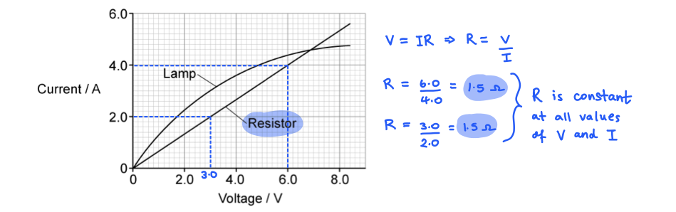

### 2() — 1 marks
**Correct answer: A** — resistance increases

**Final answer:** **The correct answer is ****A**** because:**

- The relationship between current, voltage and resistance is $V=IR$
- This means for a graph of $I$ against $V$, the gradient will equal $\frac{changeinI}{changeinV}=\frac{1}{R}$

  - In other words, $R=\frac{1}{gradient}$

- The I−V graph of the lamp is a curve with a **decreasing** gradient
- This means the higher the voltage, the smaller the gradient will be
- Therefore, the value of the resistance will **increase** (because resistance and the gradient are **inversely** proportional)

  - Hence, option **A** is correct

Remember: the gradient of the I−V graph is equal to $\frac{1}{R}$

So, if you want to check values to confirm this, it's better to calculate two different values of $\frac{V}{I}$to get a direct value for resistance, otherwise you might calculate $\frac{4.4}{6.0}$ = 0.7 and mistakenly think that resistance is decreasing

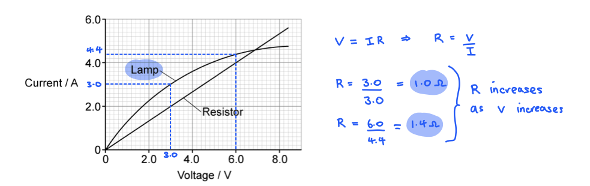

### 3() — 5 marks
(i) Calculate the resistance of the lamp when *V* = 6.0 V:

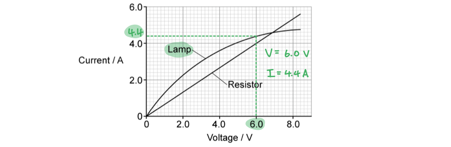

- (From the graph) current in lamp = 4.4 A **[1 mark]**

Rearrange the equation for resistance, voltage and current:

- $V=IR\RightarrowR=\frac{V}{I}$
- $R=\frac{6.0}{4.4}$ **[1 mark]**
- Resistance* *= 1.4 Ω **[1 mark]**

(ii) Calculate the current from the supply:

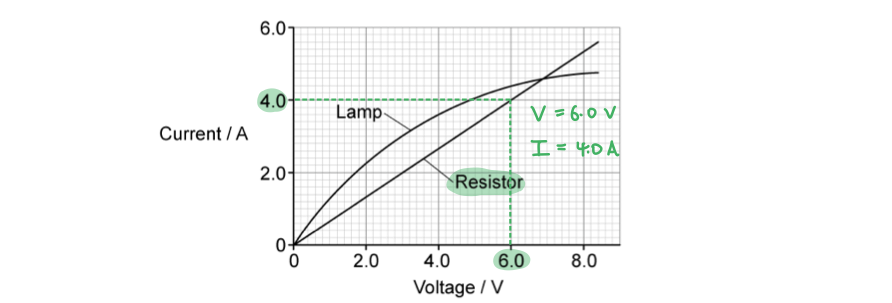

- (From the graph) current in the resistor = 4.0 A **[1 mark]**

Calculate the total current in the parallel circuit:

- Total current = current in lamp + current in resistor
- Total current = 4.4 + 4.0
- Total current = 8.4 A **[1 mark]**

**[Total: 5 marks]**

> *When you are given a graph and then asked to make a calculation all the information you need will be available from the graph.*

> *Draw straight lines on the graph to obtain an accurate value for current. *

> *Remember that in **parallel **circuits, the **current **is** split** between the components and the** voltage **is the** same** in each*

### 4() — 2 marks
Calculate the total voltage across the lamp and the resistor in series:

List the known quantities:

- Current in the circuit, *I *= 4.0 A

Use the graph to obtain the voltage across the lamp and resistor when the current is 4.0 A:

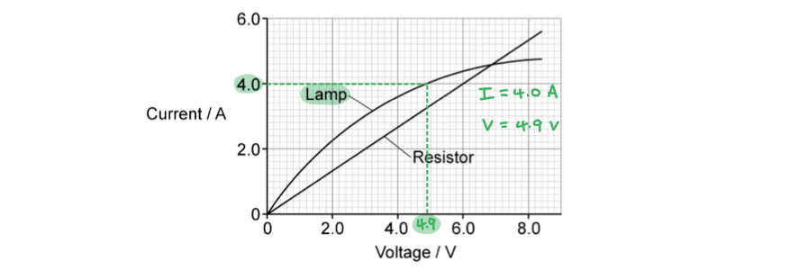

- Voltage across the resistor = 6.0 V
- Voltage across the lamp = 4.9 V **[1 mark]**

Calculate the total p.d. in the series circuit:

- Total voltage = voltage across lamp + voltage across resistor
- Total voltage = 4.9 + 6.0
- Total voltage = 10.9 V **[1 mark]**

**[Total: 2 marks]**

> *In part (c) you have already used the graph to see that when the p.d. is 6.0 V then the current is 4.0 A in the resistor.*

> *Therefore, you do not need to use the graph to find this information again. This can save you a bit of time! *

> *Be careful to read the question carefully, now the question is talking about a series circuit, so remember that in **series **circuits, the **voltage **is** split** between the components and the** current **is the** same** in each*

## Q15 — hard — 15 marks · exam-questions

### 1() — 4 marks
Draw a circuit diagram showing an LED in series with a battery and a fixed resistor:

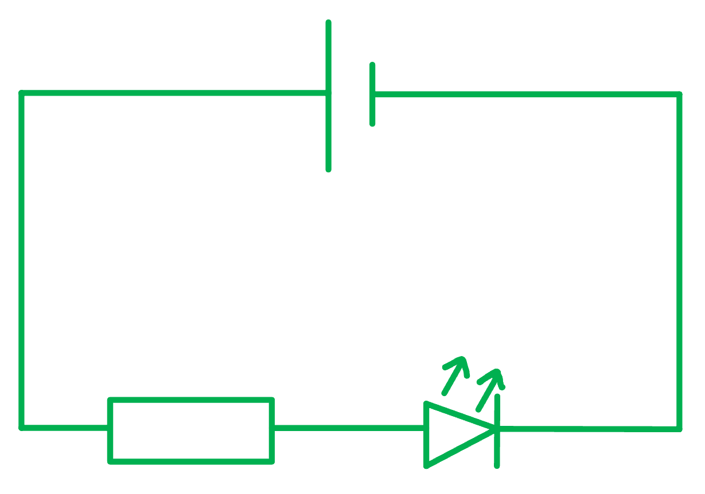

- Correct symbol for LED; **[1 mark]**
- Correct symbols for battery and fixed resistor; **[1 mark]**
- All components drawn in series; **[1 mark]**
- LED drawn the correct way around ('pointing' towards the negative terminal); **[1 mark]**

**[Total: 4 marks]**

> *Use a ruler and a sharp pencil to draw accurate circuit diagrams. Sloppy diagrams are unlikely to get full marks!*

> *The LED must be drawn the correct way around:*

- *Current from the power supply will travel from the **positive** side of the battery*
- *Then through the **fixed resistor** *
- *Before the diode, pointing towards the **negative** terminal of the battery*

> *Current travels from positive to negative whilst electrons move the opposite way.*

### 2() — 6 marks
(i) The readings of current and voltage can be obtained by:

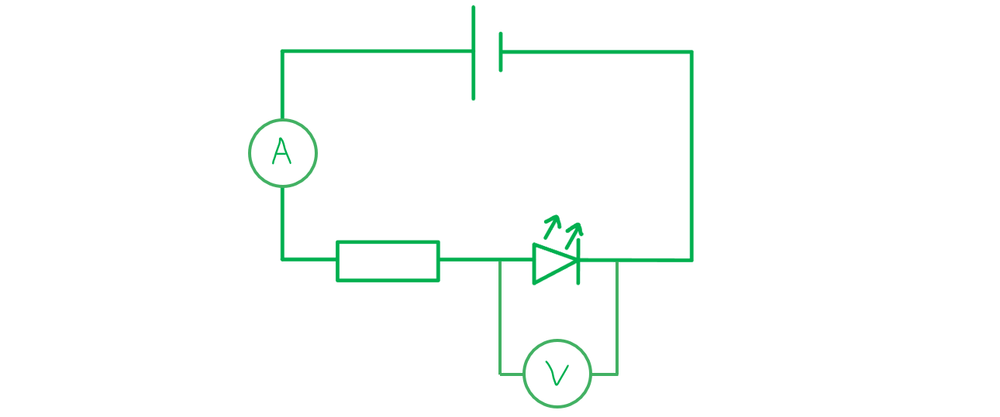

- Ammeter drawn in series with LED; **[1 mark]**
- Voltmeter drawn in parallel with LED <u>only</u>; **[1 mark]**

(ii) Calculate the value of the resistance of the LED when lit:

List the known quantities:

- Potential difference, *V *= 3.1 V
- Current, *I *= 0.030 A

Substitute the known quantities into the equation to calculate *R*:

- Voltage = current × resistance **OR** $V=IR$
- $V=IR\RightarrowR=\frac{V}{I}$
- $R=\frac{3.1}{0.03}$ **[1 mark]**
- *R *= 103.33 = 100 Ω **[1 mark]**

(iii) The effects of adding another LED in series would be:

- (The ammeter reading of) current will decrease; **[1 mark]**
- (The voltmeter reading of) voltage will decrease; **[1 mark]**

**[Total: 6 marks]**

> *In part (iii), it's important to remember that the overall current in the circuit will decrease if more components are added in series. This is because we are adding more resistance to the circuit. *

> *The voltage will decrease across the first LED because the total voltage from the supply will be shared between three components rather than two.*

### 3() — 5 marks
List the known quantities:

- Voltage of the power supply = 12 V
- Voltage across the lamp = 3.2 V
- Voltage across heater = *V*
- Current through the lamp, *I *= 1.5 A

(i) Calculate the resistance of the heater:

- In a series circuit:

  - Total Voltage (power supply) = Voltage (lamp) + Voltage (heater)

Calculate the voltage across the heater, *V*:

- 12 = 3.2 + *V ***[1 mark]**
- *V* = 12 − 3.2 = 8.8 V

Calculate the resistance using the following equation:

- $V=IR\RightarrowR=\frac{V}{I}$
- $R=\frac{8.8}{1.5}$ **[1 mark]**
- *R *= 5.9 Ω **[1 mark]**

** **

(ii) Calculate the power of the heater:

- Power = current × voltage **OR** $P=IV$
- Power = 8.8 × 1.5 **[1 mark]**
- Power = 13.2 W **[1 mark]**

**[Total: 5 marks]**

> *Read the question carefully, if it is asking about the heater make sure you use the information related to the heater. *
