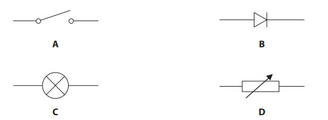
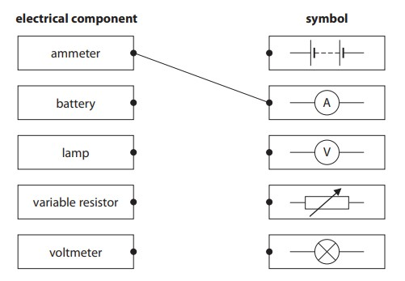
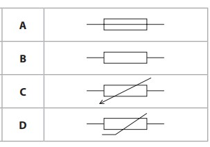
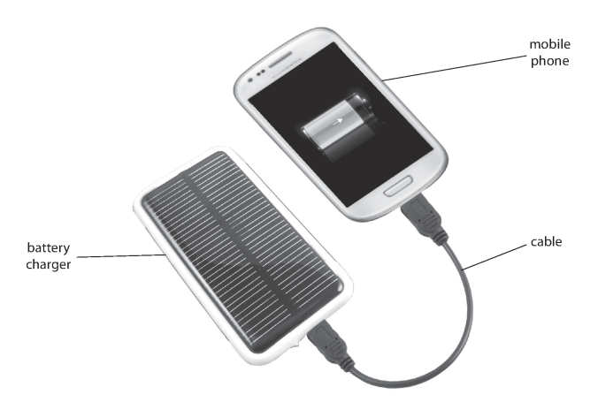
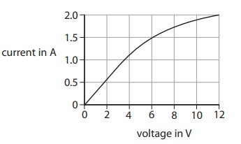
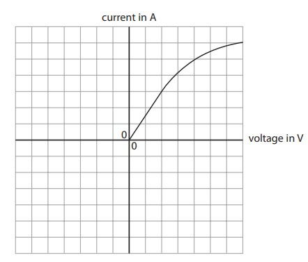
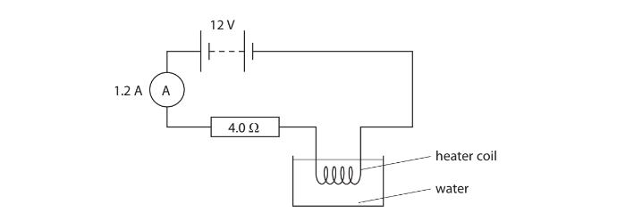
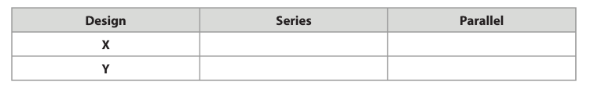
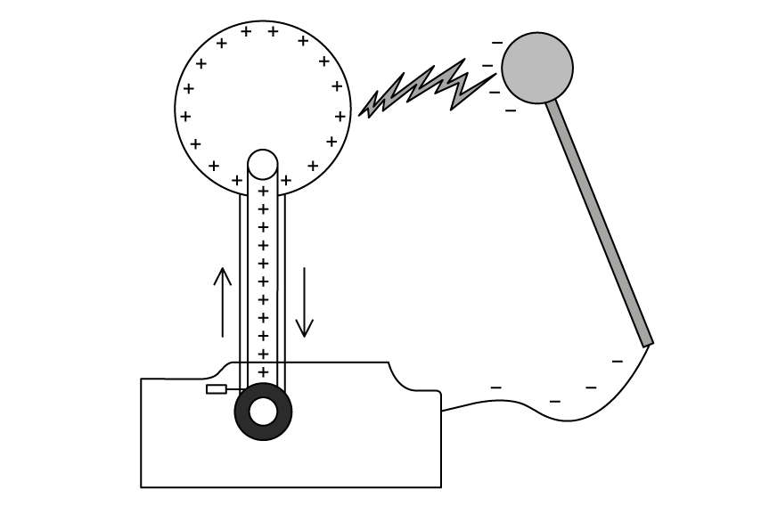
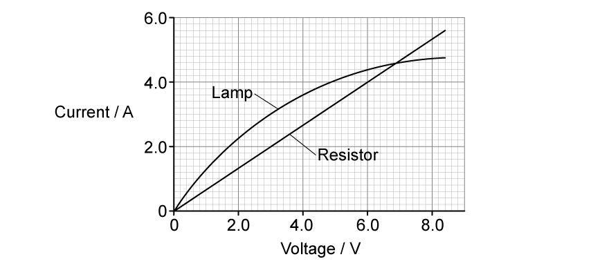

# Exam Questions — Current, Potential Difference & Resistance
**2. Electricity** · Edexcel IGCSE Science (Double Award) (4SD0) — 17/Physics
> Source: [https://www.savemyexams.com/igcse/science/edexcel/double-award/17/physics/topic-questions/electricity/current-potential-difference-and-resistance/exam-questions/](https://www.savemyexams.com/igcse/science/edexcel/double-award/17/physics/topic-questions/electricity/current-potential-difference-and-resistance/exam-questions/) · 15 questions · total 112 marks

## Q1 — easy — 3 marks · exam-questions

### 1((a)) — 1 mark — multiple_choice — from paper January 2012 · 1P
The diagram shows some electrical circuit symbols.

Which symbol represents a switch?
- **A.** 
- **B.** 
- **C.** 
- **D.** 

### 2() — 1 mark — multiple_choice
Which of the symbols in (a) represents a component that only allows current to flow in one direction?
- **A.** 
- **B.** 
- **C.** 
- **D.** 

### 3() — 1 mark — multiple_choice
Which of the symbols in (a) represents a component that can have its resistance varied by varying the length of wire?
- **A.** 
- **B.** 
- **C.** 
- **D.** 

## Q2 — easy — 6 marks · exam-questions

### 1((a)) — 3 marks — command: draw — structured — from paper June 2016 · 1PR
This question is about electrical components.

Draw a straight line from each electrical component to its correct symbol.

One has been done for you.

### 1((b)) — 2 marks — command: name — structured — from paper June 2016 · 1PR
(i) Name an electrical component whose resistance decreases when it is moved into brighter light.

**[1]**

(ii) Name an electrical component whose resistance decreases as its temperature increases.

**[1]**

### 5((a)) — 1 mark — multiple_choice — from paper June 2015 · 2PR
Which of the following is the correct symbol for a thermistor?

- **A.** 
- **B.** 
- **C.** 
- **D.** 

## Q3 — easy — 7 marks · exam-questions

### 6((a)) — 3 marks — command: multiple — structured — from paper June 2012 · 2P
A washing machine has an electric motor and an electric heater.

The resistance of the heater is 22 Ω.

The mains voltage is 230 V.

(i) State the equation linking voltage, current and resistance.

**[1]**

(ii) Show that the current in the heater is about 10 A when it is working.

**[2]**

### 6((b)) — 4 marks — command: explain — structured — from paper June 2012 · 2P 
The washing machine is fitted with a fuse rated at 13 A.

(i) Explain why the washing machine is fitted with a fuse.

**[2]**

(ii) When the motor is working, the current in it is 1.74 A.

Explain why it would **not **be sensible to replace the 13 A fuse with a 2 A fuse.

**[2]**

## Q4 — easy — 2 marks · exam-questions

### 1() — 1 mark — command: which — structured
Which quantity is defined as the rate of flow of charge?

### 2() — 1 mark — command: which — structured
Which quantity is defined as the energy transferred per unit charge passed?

## Q5 — easy — 8 marks · exam-questions

### 1() — 1 mark — command: what — structured
The current in the wires of a circuit is a flow of particles.

What is the name of these particles?

### 2() — 4 marks — command: draw — structured
A student sets up an electrical circuit. The diagram shows part of this circuit.

Complete the circuit diagram by drawing circuit symbols for three devices so that the student can

(i) Measure the total current in the circuit

**[1]**

(ii) Vary the current in the lamp B only

**[1]**

(iii) Measure the voltage across lamp B.

**[2]**

### 3() — 3 marks — command: multiple — structured
The current in lamp A is 0.20 A. The voltage across lamp A is 6.0 V.

(i) State the equation linking voltage, current and resistance.

**[1]**

(ii) Calculate the resistance of lamp A.

resistance = ......................................................Ω**[2]**

## Q6 — medium — 1 marks · exam-questions

### 2((b)) — 1 mark — multiple_choice — from paper Jan 2016 · 1P
The current in a metalic conductor is a flow of
- **A.** negatively charged electrons
- **B.** negatively charged protons
- **C.** positively charged electrons
- **D.** positively charged protons

## Q7 — medium — 6 marks · exam-questions

### 11((b)) — 4 marks — command: multiple — structured — from paper Jan 2014 · 1
The photograph shows a solar-powered battery charger connected to a mobile phone.

When the battery charger is used, it transfers light energy from the Sun to the battery of the mobile phone.

It takes 3.5 hours to recharge the battery fully. The average current supplied by the charger is 400 mA.

(i) State the equation linking charge, current and time.

**[1]**

(ii) Calculate the amount of charge needed to recharge the battery fully, and give the unit.

**[3]**

### 11((c)) — 2 marks — command: explain — structured — from paper Jan 2014 · 1P
If the charger is moved into the shade, the output power decreases. The voltage across the charger stays the same.

Explain how moving the charger into the shade affects the time needed to recharge the battery fully.

## Q8 — medium — 9 marks · exam-questions

### 8((a)) — 5 marks — command: multiple — structured — from paper Jan 2016 · 2P
An electric vehicle has a rechargeable battery.

The battery is recharged by connecting it to a charging station.

©Epattlomer

The battery voltage is 385 V.

(i) State the amount of energy transferred when one coulomb of charge passes through a potential difference of 385 V.

**  ** **   ** energy transferred = ............................. J**[1]**

(ii) Show that, when a charge of 180 000 C passes through the battery, the total amount of energy transferred to the battery is about 70 MJ.

**[2]**

(iii) During the charging process, energy is also transferred to the charging station from the mains supply.

Explain why the amount of energy transferred from the mains supply is more than 70 MJ.

**[2]**

### 8((b)) — 4 marks — command: multiple — structured — from paper 2016 January · 2P
Charging takes 110 minutes and causes a total charge of 180 000 C to pass through the battery.

(i) State the equation linking charge, current and time.

**[1]**

(ii) Calculate the average charging current in the battery.

**  **current = ........................ A**[3]**

## Q9 — medium — 9 marks · exam-questions

### 5((a)) — 3 marks — command: draw — structured — from paper January 2016 · 1P
A student investigates the resistance of a lamp.

The student uses a circuit that contains an ammeter, a battery, a lamp and a voltmeter to determine the resistance of the lamp.

Draw a circuit diagram to show how he should connect the apparatus.

### 5((a)) — 1 mark — command: state — structured — from paper January 2016 · 1P
State the relationship between voltage, current and resistance.

### 5((a)) — 3 marks — command: calculate — structured — from paper January 2016 · 1P
The student obtains this graph for a filament lamp.

Calculate the resistance of the lamp when the voltage is 6.0 V.

Give the unit.

** **resistance = ............................. unit = ........................

### 5((a)) — 2 marks — command: sketch — structured — from paper January 2016 · 1P
The student reverses the battery connections and then repeats his measurements.

On the axes below, sketch the graph that he would obtain.

Part of the graph has been done for you.

## Q10 — medium — 9 marks · exam-questions

### 1() — 3 marks — command: complete — structured
A student is investigating the variation of resistance and temperature in a thermistor. The diagram shows part of the circuit the student intends to use.

Complete the circuit diagram to show how the student should connect the apparatus, including a voltmeter and an ammeter.

### 2() — 3 marks — command: multiple — structured
The student chooses a fixed resistor with a resistance of 5 kΩ. The reading on the ammeter is 0.8 mA.

(i) State the equation linking voltage, current and resistance.

**[1]**

(ii) Calculate the voltage across the 5 kΩ resistor.

Voltage = ............................... V**[2]**

### 3() — 3 marks — command: determine — structured
The manufacturer's guide states that the thermistor has a resistance of 12 kΩ at room temperature.

The student wants to confirm the accuracy of this value before starting the investigation.

At room temperature, the voltmeter shows a reading of 8 V.

Determine if this reading is consistent with the manufacturer's value of resistance.

## Q11 — hard — 6 marks · exam-questions

### 5() — 1 mark — multiple_choice — from paper June 2015 · 2PR
The diagram shows an electric circuit containing a fixed resistor and an LDR.

A student plans to use a voltmeter and an ammeter in his circuit.

How should the student connect the voltmeter and the ammeter within the circuit?

|   | **Voltmeter** | **Ammeter** |
|---|---|---|
| **A** | in parallel across the power supply | in parallel across the LDR |
| **B** | in parallel across the LDR | in series with the LDR |
| **C** | in series with the power supply | in series with the LDR |
| **D** | in series with the LDR | in parallel across the LDR |
- **A.** 
- **B.** 
- **C.** 
- **D.** 

### 2() — 5 marks — command: show — structured
When the LDR is illuminated, its resistance is 150 Ω.

Show that the resistance of the fixed resistor is about 120 Ω.

## Q12 — hard — 14 marks · exam-questions

### 8((a)) — 10 marks — command: multiple — structured — from paper Jan 2012 · 1P
The diagram shows a heater coil and a resistor connected to a 12 V battery and an ammeter.

The ammeter reading is 1.2 A.

(i) State the equation linking voltage, current and resistance.

**[1]**

(ii) Calculate the voltage across the 4.0 Ω resistor.

**    ** voltage = ................... V**[2]**

(iii) Show that the voltage across the heater coil is about 7 V.

**[2]**

(iv) Calculate the energy transferred to the heater coil in 5.0 minutes.

**  ** energy transferred = ................... J**[3]**

(v) At first, the temperature of the water increases. After a while, the temperature reaches a steady value below the boiling point of water.

Explain why the temperature reaches a steady value.

**[2]**

### 8((b)) — 4 marks — command: multiple — structured — from paper Jan 2012 · 1P
Resistors can be used as heating elements in the rear windows of cars. The diagram shows two possible designs.

(i) Complete the table by placing a tick (✔) in the correct boxes.

**[1]**

(ii) Describe the advantages and disadvantages of design X when used as a heater in a car window.

**[3]**

## Q13 — hard — 8 marks · exam-questions

### 1() — 3 marks — command: calculate — structured
The diagram shows a van der Graaff generator, a device that can reach extremely high voltages.

Calculate the energy transferred to an electron when it passes through a voltage of 180 kV.

Charge of an electron = 1.6 × 10–19 C

** **energy transferred = ................................................... J

### 2() — 5 marks — command: calculate — structured
When the van der Graaff generator is fully charged, it stores 3.5 × 10–8 C of charge.

(i) Calculate the number of electrons stored on a fully charged van der Graaff generator.

number of electrons = .................................................**[2]**

(ii) The charge on the generator discharges through the air as a spark.

The charge takes a time of 0.56 ms to leave the generator.

Calculate the mean (average) current in the air. Give the unit.

mean current = ....................................... unit .................**[4]**

## Q14 — hard — 9 marks · exam-questions

### 1() — 1 mark — multiple_choice
The diagram shows a current-voltage graph for a resistor and for a lamp.

The voltage applied to the resistor is increased.

What is the effect on the resistance of the **resistor**?
- **A.** resistance increases
- **B.** resistance decreases
- **C.** resistance increases and decreases
- **D.** resistance stays the same

### 2() — 1 mark — multiple_choice
The voltage applied to the lamp is increased.

What is the effect on the resistance of the **lamp**?
- **A.** resistance increases
- **B.** resistance decreases
- **C.** resistance increases and decreases
- **D.** resistance stays the same

### 3() — 5 marks — command: calculate — structured
The p.d. across the lamp is 6.0 V.

(i) Calculate the resistance of the lamp.

resistance = ......................................................... Ω**[3]**

(ii) The lamp and the resistor are connected in parallel to a 6.0 V supply. Calculate the current from the supply.

current = ......................................................... A**[2]**

### 4() — 2 marks — command: calculate — structured
The lamp and the resistor are connected in series to another power supply. The current in the circuit is 4.0 A.

Calculate the total voltage across the lamp and the resistor.

voltage = ......................................................... V

## Q15 — hard — 15 marks · exam-questions

### 1() — 4 marks — command: draw — structured
A light-emitting diode (LED) is a diode that emits light when there is a current in it.

Draw a circuit diagram showing an LED, connected so that it is lit, in series with a battery and a fixed resistor.

### 2() — 6 marks — command: multiple — structured
The voltage across the LED when lit is 3.1 V and the current in the LED is 0.030 A.

(i) Add to the diagram in (a) to show how these readings were obtained.

**[2]**

(ii) Calculate the value of the resistance of the LED when lit.

resistance = ......................................................... Ω**[2]**

(iii) An identical LED is connected in series with the first LED.

State and explain the effect on the readings of voltage and current.

**[2]**

### 3() — 5 marks — command: calculate — structured
The diagram shows a power supply with a voltage of 12 V connected in series with a lamp and a heater.

The voltage across the lamp is 3.2 V and the current in the lamp is 1.5 A.

(i) Calculate the resistance of the heater.

resistance = ......................................................... Ω**[3]**

(ii) Calculate the power of the heater.

power = ......................................................... W**[2]**
