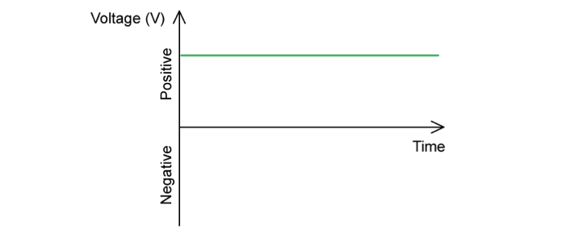
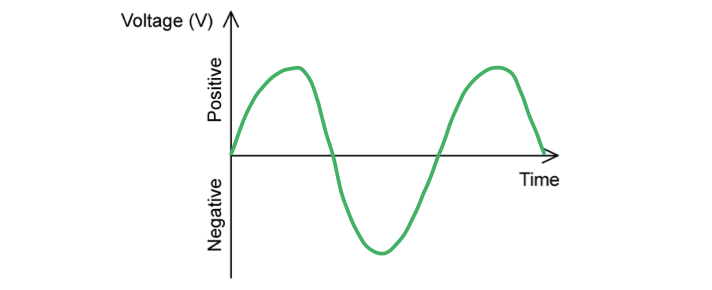
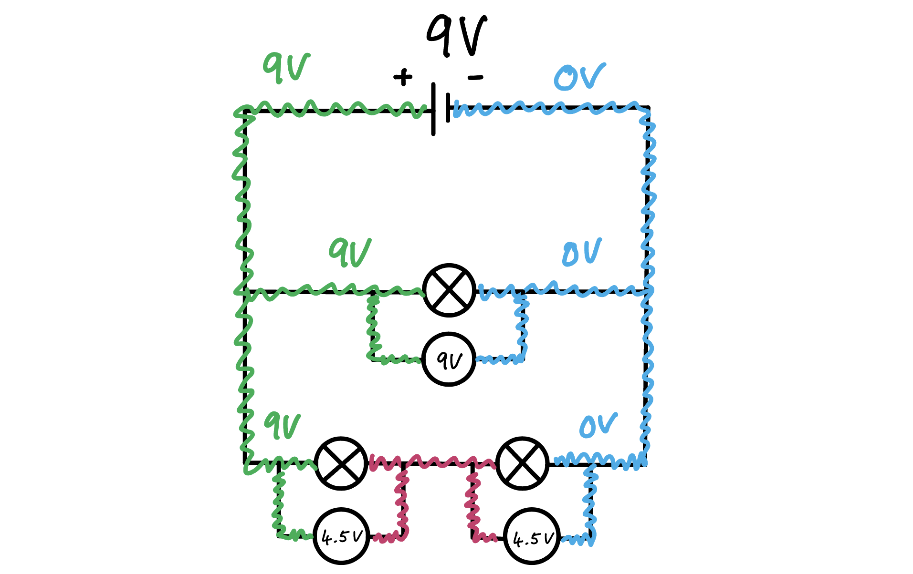

# Mark Schemes — Electrical Power & Mains Electricity
**2. Electricity** · Edexcel IGCSE Science (Double Award) (4SD0) — 17/Physics

## Q1 — easy — 3 marks · exam-questions

### 1() — 1 marks
**Correct answer: C** — 

**Final answer:** **The correct answer is ****C**** because:**

- The wire on the right (next to the fuse) is the **live** wire

### 2() — 1 marks
**Correct answer: A** — 

**Final answer:** **The correct answer is ****A**** because:**

- The wire in the middle (with the stripy pattern) is the **Earth** wire

### 3() — 1 marks
**Correct answer: B** — 

**Final answer:** **The correct answer is ****B**** because:**

- The wire on the left is the **neutral** wire

## Q2 — easy — 14 marks · exam-questions

### 1() — 3 marks
(i) The relationship between power, current and voltage is:

- Power = current × voltage **OR ***P *= *IV ***[1 mark]**

(ii) Calculate the current in the television:

List the known quantities:

- Power in the TV, *P *= 110 W
- Mains voltage, *V *= 230 V

Rearrange and substitute the known quantities into the equation:

- $P=IV\RightarrowI=\frac{P}{V}$
- $I=\frac{110}{230}$ **[1 mark]**
- *I *= 0.48 A **[1 mark]**

**[Total: 3 marks]**

> *In part (i) you can provide your answer in any rearranged form of the equation but this form is the easiest to remember. *

### 2() — 8 marks
(i) The correctly drawn lines are as follows:

- *One mark for each correct line drawn*

(ii) The correct sentences are:

- The wires in the oven cable are **thicker** than the wires in the lamp cable because **AND**
- They carry a **higher** current than the lamp cable; **[1 mark]**
- They have a **lower** resistance than the lamp cable; **[1 mark]**

- The lamp cable has two wires, which is **safe** to use because **AND**
- The wires of the lamp have double **insulation**;** ****[1 mark]**
- The wires of the lamp are cased in **plastic**, which is a good **insulator**; **[1 mark]**

**[Total: 8 marks]**

### 3() — 3 marks
Calculate the energy transferred by the lamp in 3000 seconds:

List the known quantities:

- Time, *t *= 3000 s
- Current in the lamp, *I *= 0.17 A
- Mains voltage, *V *= 230 V

Substitute the quantities into the equation to calculate the energy transferred, *E*:

- Energy transferred = current × voltage × time **OR*** E *= *I *×* V *×* t ***[1 mark]**
- Energy transferred = 0.17 × 230 × 3000 **[1 mark]**
- Energy transferred = 117 300 = 117 000 J **[1 mark]**

**[Total: 3 marks]**

## Q3 — easy — 4 marks · exam-questions

### 7((b)) — 1 marks
The fuse that should be used with the hairdryer is:

- The <u>7 A</u> fuse should be used with the hairdryer; **[1 mark]**

**[Total: 1 mark]**

> *When choosing an appropriate fuse, always choose the next largest value of current available*

### 7() — 1 marks
The 7 A fuse is the best choice because:

- (The fuse must be) the closest value above the current required (in the circuit); **[1 mark]**

**[Total: 1 mark]**

### 7() — 2 marks
The hairdryer is still safe to use because:

Any** two** from:

- The plastic coating is an electrical insulator; **[1 mark]**
- The coating does not conduct electricity; **[1 mark]**
- The hairdryer is double insulated; **[1 mark]**
- There is no risk of shock / electrocution;** [1 mark]**

**[Total: 2 marks]**

## Q4 — easy — 6 marks · exam-questions

### 1() — 2 marks
The correct graph for d.c. is as follows:

- Voltage is positive **OR** negative only; **[1 mark]**
- Horizontal line drawn; **[1 mark]**

**[Total: 2 marks]**

### 2() — 2 marks
The correct graph for a.c. is as follows:

- Voltage has positive **AND** negative values; **[1 mark]**
- Correct curve drawn; **[1 mark]**

**[Total: 2 marks]**

### 3() — 2 marks
The correct answers are:

|   | **True only for d.c** | **True only for a.c.** | **True for both** |
|---|---|---|---|
| The current always flows in the same direction | **Final answer:** **✓** |   |   |
| A transformer is used to supply this to domestic buildings |   | **✓** |   |

- *One mark for each correct tick*

**[Total: 2 marks]**

## Q5 — easy — 7 marks · exam-questions

### 1() — 1 marks
It would be dangerous if the live wire touched the case of the kettle because:

- There is a risk of electric shock / being electrocuted; **[1 mark]**

**[Total: 1 mark]**

### 2() — 3 marks
(i) The relationship between power, current and voltage is:

- Power = current × voltage **OR ***P *= *IV ***[1 mark]**

(ii) Calculate the current in the kettle:

List the known quantities:

- Power in the kettle, *P *= 2.5 kW = 2500 W
- Mains voltage, *V *= 230 V

Rearrange and substitute the known quantities into the equation:

- $P=IV\RightarrowI=\frac{P}{V}$
- $I=\frac{2500}{230}$ **[1 mark]**
- *I *= 10.87 A **[1 mark]**

**[Total: 3 marks]**

### 3() — 3 marks
(i) The relationship between voltage, current and resistance is:

- Voltage = current × resistance **OR ***V *= *IR ***[1 mark]**

(ii) Calculate the resistance of the kettle:

List the known quantities:

- Current in the kettle, *I *= 10.87 A
- Mains voltage, *V *= 230 V

Rearrange and substitute the known quantities into the equation:

- $V=IR\RightarrowR=\frac{V}{I}$
- $R=\frac{230}{10.87}$ **[1 mark]**
- *R *= 21.2 Ω **[1 mark] ** **OR**
- *R* = 20.9 Ω** [1 mark] **if *I* = 11 A used

**[Total: 3 marks]**

## Q6 — medium — 1 marks · exam-questions

### 2((b)) — 1 marks
**Correct answer: D** — 13 A

**Final answer:** **The correct answer is ****D**** because:**

- The voltage will remain the same because the kettle will be plugged into the mains supply

  - Therefore, *V* = 230 V
- The power has doubled

  - Therefore, *P* = 2 × 960  = 1920 W
- Power = current × voltage or $P=IV$

  - Rearranging to solve for current gives, $I=\frac{P}{V}$
  - $I=\frac{1920}{230}$
  - *I *= 8.3 A
- A suitable fuse would be one that is higher than the current

  - Therefore, the only suitable option is 13 A
  - This is answer **D**

## Q7 — medium — 1 marks · exam-questions

### 1((a)) — 1 marks
**Correct answer: B** — no earth connection

**Final answer:** **The correct answer is ****B ****because:**

- If there is a fault in an electrical device then double insulation can protect the user from an excessive current
- This is usually done by the earth wire
- So, the correct answer is **B **

## Q8 — medium — 1 marks · exam-questions

### 1((b)) — 1 marks
**Correct answer: C** — the circuit cannot overheat if there is a fault

**Final answer:** **The correct answer is ****C ****because:**

- A fuse is found inside the plug of an appliance
- Current first passes through the fuse before passing into the appliance
- When the current passing into the appliance is too high, the fuse will melt (blow) and break the circuit
- This means the circuit inside the appliance cannot overheat if there is a fault
- So, the correct answer is **C **

## Q9 — medium — 14 marks · exam-questions

### 7((a)) — 2 marks
- All (lamps) can be switched (on and off) separately / independent of each other; **[1 mark]**
- Other (lamps) will stay lit when one bulb blows / breaks / stops working; **[1 mark]**

**[Total: 2 marks]**

### 7((a)) — 4 marks
(i) To state the purpose of the 5 A fuse in the circuit from part (a):

Any **one **from:

- To prevent overheating in the circuit / appliance / wiring / lamps; **[1 mark]**
- To switch off the circuit; **[1 mark]**
- To prevent current exceeding a certain value (of 5A); **[1 mark]**

(ii) To explain how a fuse works:

- (If / when the) current exceeds the stated value **OR **
- The current is too high; **[1 mark]**
- The fuse (overheats and) melts; **[1 mark]**
- This breaks the circuit / stops the current / turns the circuit off; **[1 mark]**

**[Total: 4 marks]**

### 7() — 4 marks
(i) To state the equation linking power, current and voltage:

- Power = current × voltage **OR **
- *P *= *IV ***[1 mark]**

(ii) To calculate the current in the computer:

List the known quantities:

- Voltage, *V *= 230 V
- Power, *P *= 0.25 kW

Recall the equation for power, current and voltage from part (i):

- *P *= *IV*

Rearrange the equation to make current, *I* the subject:

- $I=\frac{P}{V}$ **[1 mark]**

Convert the units for power from kW to W:

- 1 kw = 1000 W
- So, 0.25 kW = 0.25 × 1000 = 250 W

Substitute the known quantities into the equation:

- $I=\frac{250}{230}$ **[1 mark]**

Calculate the value of the current, *I:*

- Current = 1.1 A **[1 mark]**

**[Total: 4 marks]**

> *In part (i) it is possible to give your answer in words or in symbols in any rearrangement. It is easiest to remember this equation for Ohm's Law in this form. *

### 7() — 4 marks
(i) To suggest the most suitable fuse value for the computer and give a reason for your answer:

Most suitable fuse value:

- 3 A; **[1 mark]**

Reason:

- Fuse (value should be) a little bigger than the current; **[1 mark]**

(ii)  To state two advantages of using a circuit breaker instead of a fuse:

Any **two** from:

- Circuit breakers can be reset; **[1 mark]**
- Circuit breakers work instantly **OR **
- Fuses do not work instantly; **[1 mark]**
- (Circuit breakers) do not require an earth wire; **[1 mark]**
- Circuit breakers are more sensitive; **[1 mark]**

**[Total: 4 marks]**

## Q10 — medium — 7 marks · exam-questions

### 6((a)) — 3 marks
(i) To state the equation linking voltage, current and resistance:

- Voltage = current × resistance **OR**
- *V *= *IR ***[1 mark]**

(ii) To show that the current in the heater is about 10 A when it is working:

List the known quantities:

- Resistance, *R *= 22 Ω
- Voltage, *V *= 230 V

Recall the equation linking voltage, current and resistance from part (i):

- *V *= *IR*

Rearrange the equation to make current, *I, *the subject and substitute in the known quantities:

- $I=\frac{V}{R}$
- $I=\frac{230}{22}$ **[1 mark]**

Calculate the value of the current, *I,* to at least 3 s.f.

- *I *= 10.45 A **[1 mark]**

**[Total: 3 marks]**

> *In part (i) you can give your answer in any rearrangement but it is best to remember Ohm's Law in the form given. *

### 6((b)) — 4 marks
(i) To explain why the washing machine is fitted with a fuse:

Any **two **from:

- (The fuse is a) safety device / reduces danger / reduces (electrical) hazards; ** [1 mark]**
- In case their is a fault / short circuit; ** [1 mark]**
- To control excessive current / current more than 13 A (from entering the appliance); ** [1 mark]**
- To prevent (wire / appliance) from overheating;** [1 mark]**

(ii) To explain why it would **not **be sensible to replace the 13 A fuse with a 2 A fuse:

- The total current (in the motor and the heater) is more than 2 A; **[1 mark]**
- A 2 A fuse would blow / melt / need to be replaced / a circuit would be broken; **[1 mark]**

**[Total: 4 marks]**

> *In your answer to part (ii) you will not be given a mark for referring to electric shock. You need to be more specific. *

## Q11 — medium — 3 marks · exam-questions

### 9((b)) — 1 marks
State the equation linking power, current and voltage:

- Power = current × voltage **OR**
- $P=IV$ **[1 mark]**

**[Total: 1 mark]**

> *Remember that when you are asked to state an equation, you may give the equation in its rearranged form and still get the mark, as long as the rearrangement is correct. *

### 9((b)) — 2 marks
Calculate the maximum power available from the motor:

List the known quantities:

- Current, *I* = 4000 A
- Voltage, *V* = 600 V

Recall the equation from part (a):

- $P=IV$

Substitute the known vales into the equation from part (i) to calculate:

- $P=4000\times600$
- *P* = 2 400 000 W **[1 mark]**

Convert to MW:

- $P=\frac{2400000}{1000000}$
- *P* = 2.4 (MW) **[1 mark]**

**[Total: 2 marks]**

## Q12 — medium — 8 marks · exam-questions

### 3((a)) — 2 marks
(i) State the equation linking power, current and voltage:

- Power = current × voltage **OR**
- $P=IV$ **[1 mark]**

(ii) Complete the table by inserting the missing value:

List the known quantities:

- Power, *P* = 700 W
- Voltage, *V* = 240 V

Rearrange the power equation to make current the subject:

- $I=\frac{P}{V}$

Substitute in the known values to calculate the current:

- $I=\frac{700}{240}$
- I = 2.9 (A) / 2.92 (A) / 2.916 (A) **[1 mark]**

**[Total: 2 marks]**

> *Remember that when stating an equation, you will still get the mark if you provide the equation in its rearranged form, as long as the rearrangement is correct. *

### 3((b)) — 6 marks
(i) Describe how the fuse protects the cable:

Any **three** from:

- If the current gets too high / above 13 A; **[1 mark]**
- The fuse wire melts / breaks; **[1 mark]**
- Which breaks the circuit / switches off; **[1 mark]**
- Preventing the cable from over heating; **[1 mark]**

(ii) Explain why a 5 A fuse is not suitable for this extension cable:

- A 5 A fuse would blow / melt / cut the power; **[1 mark]**

Give a reason for this:

Any **one** from:

- The cable can't be fully extended; **[1 mark]**
- A 5 A fuse limits the use of the extension cable; **[1 mark]**
- A 5 A fuse would mean the cable can't exceed 1200 W; **[1 mark]**
- A 5 A fuse would mean that the cable can't reach 10 A / its maximum working value; **[1 mark]**

(iii) Suggest why the maximum recommended current is lower when the cable is coiled up:

- To prevent the cable over heating; **[1 mark]**

**[Total: 6 marks]**

## Q13 — medium — 7 marks · exam-questions

### 9((a)) — 4 marks
(i) State the voltage across each lamp in the series circuit:

- The lamps are connected in series, therefore the potential difference is shared across the lamps
- There are 20 lamps and the total potential difference is 9V

  - Therefore, the 9 V are shared across the 20 lamps
  - $V=\frac{9}{20}=0.45$ (V) **[1 mark]**

(ii) State the equation linking power, current and voltage:

- Power = current × voltage **OR**
- $P=IV$ **[1 mark]**

(iii) Show that the current in the circuit is about 3 A:

List the known quantities:

- Power per lamp, *P* = 1.5 W
- Voltage per lamp, *V* = 0.45 V (from part (i))

Rearrange the equation from part (ii) to make *I* the subject:

- $I=\frac{P}{V}$

Substitute in the known values to calculate the current:

- $I=\frac{1.5}{0.45}$ **[1 mark]**
- I = 3.3 (A)** [1 mark]**

**[Total: 4 marks]**

> *Remember that for lamps with the same power rating, potential difference / voltage is shared equally between lamps in series. For lamps in parallel, the potential difference across the lamps is the same as the total potential difference of the circuit. You can see it clearly if you colour in the branches of the circuit! Here is a simple circuit with one lamp arranged in parallel, and two lamps arranged in series.*

> *So, for the circuit in the question, the 9 V is shared equally between the 20 lamps arranged in series. *

### 9((b)) — 3 marks
Calculate the total energy transferred during this time:

List the known quantities:

- Current, *I* = 3.3 A
- Voltage,* V* = 9 V
- Time, *t* = 7 hours per day for 5 days

From the equation sheet:

- Energy transferred = current × voltage × time / $E=I\timesV\timest$

Convert time into SI units:

- $7\times5\times60\times60=126000$ s **[1 mark]**

Substitute the known values into the equation:

- $E=3.3\times9\times126000$ **[1 mark]**
- *E* = 3 742 000 (J) **[1 mark]**

**[Total: 3 marks]**

> *You will only be penalised once for an error in a calculation. For example, if you calculated a value in part (a) that was incorrect, you would lose marks in part (a). If you used that same incorrect value as part of your calculation in part (b), you would not lose marks for that value being incorrect. If your calculation is correct in part (b), you will still get full marks. *

## Q14 — medium — 9 marks · exam-questions

### 2((a)) — 3 marks
(i) State the equation linking power, current and voltage:

- Power = current × voltage **OR**
- $P=IV$ **[1 mark]**

(ii) Show that the current in the kettle is about 4 A:

List the known quantities:

- Power, *P* = 960 W
- Voltage, *V* = 230 V

Rearrange the equation from part (i) to solve for *I:*

- $I=\frac{P}{V}$

Substitute the known values into the equation to calculate current:

- $I=\frac{960}{230}$ **[1 mark]**
- I = 4.2 (A) / 4.17 (A) **[1 mark]**

**[Total: 3 marks]**

> *Remember that when stating an equation, you will still get the marks if the equation is given in its rearranged form as long as the rearrangement is correct. *

### 2((b)) — 3 marks
Explain how earthing and a fuse can protect the person using the kettle if there is a fault:

Any **three** from:

- The large / surge of current in the earth wire (will be directed to Earth via a low resistance path);** [1 mark]**
- The fuse will blow / melt / break; **[1 mark]**
- The circuit is broken; **[1 mark]**
- The risk of (electric) shock is reduced / prevented; **[1 mark]**

**[Total: 3 marks]**

> *Many electrical appliances have metal cases which poses a potential safety hazard. If a live wire (inside the appliance) came into contact with the case, the case would become electrified and anyone who touched it would risk being electrocuted. When this happens, it causes a surge of current in the earth wire and hence also in the live wire. The earth wire is an additional safety wire that can reduce this risk. The earth wire provides a low resistance path to the earth. The high current through the fuse causes it to melt and break. This cuts off the supply of electricity to the appliance, making it safe.*

### 2((c)) — 3 marks
Explain how she could use one of these fuses to check that the label is correct:

- She would need to measure the current using an ammeter; **[1 mark]**
- She would need to vary the current in the fuse by using a variable resistor / variable power supply; **[1 mark]**
- She would need a way to determine that the fuse has broken, such as:

  - a lamp going out **OR**
  - a motor stops running **OR**
  - current falls to zero on the ammeter; **[1 mark]**

**[Total: 3 marks]**

> *Any sensible suggestion of determining that the fuse has broken would get you the mark, such a buzzer stops buzzing etc.*

## Q15 — medium — 11 marks · exam-questions

### 6((b)) — 7 marks
(i) Calculate the output voltage of the generator:

List the known quantities:

- Energy transferred, *E* = 39 MJ
- Time,* t* = 1 min
- Current,* I* = 490 A

From the equation sheet:

- $E=IVt$

Convert time into SI units:

- 1 min = 60 s **[1 mark]**

Convert energy into SI units:

- Mega (M) = 1 000 000
- Therefore, 39 MJ = 39 000 000 J

Rearrange equation to make *V* the subject:

- $V=\frac{E}{It}$

Substitute in the known values to calculate *V*:

- $V=\frac{39000000}{490\times60}$ **[1 mark]**
- V = 1300 (V) / 1.3 kV **[1 mark]**

(ii) Explain why electrical energy is transmitted using very high voltages:

Any** four** from:

- High voltage means low current; **[1 mark]**
- $P=IV$ / $P=I^{2}R$ **[1 mark]**
- Less energy is lost from the wires with a lower current; **[1 mark]**
- This makes the energy transfer more efficient; **[1 mark]**
- Thinner wires can be used **OR**
- Energy can be transmitted over greater distances; **[1 mark]**

**[Total: 7 marks]**

### 6((c)) — 4 marks
(i) Explain the meaning of 50 Hz alternating current:

- Current that changes direction (continuously); **[1 mark]**
- 100 times per second;** [1 mark]**

(ii) Explain why the d.c. from the generator must be changed to a.c. before it is transmitted:

- Transformers change the voltage / current; **[1 mark]**
- Transformers use alternating current (to induce a changing magnetic field); **[1 mark]**

**[Total: 4 marks]**

## Q16 — medium — 7 marks · exam-questions

### 3((a)) — 2 marks
(i) State the name of component X:

- Fuse; **[1 mark]**

(ii) State an advantage of using a parallel circuit for lighting:

- The lamps can be switched on and off independently; **[1 mark]**

**[Total: 2 marks]**

### 3((b)) — 2 marks
Explain what is meant by an alternating current:

- The current changes direction; **[1 mark]**
- Continuously; **[1 mark]**

**[Total: 2 marks]**

### 3((c)) — 3 marks
Calculate the amount of energy transferred by the low-energy lamp in 7 hours:

List the known quantities:

- Current, *I* = 0.12 A
- Voltage, *V* = 230 V
- Time, *t* = 7 hours

From the equation sheet:

- $E=IVt$

Convert time into SI units:

- $7\times60\times60=25200$ s **[1 mark]**

Substitute the known values into the equation:

- $E=0.12\times230\times25200$ **[1 mark]**

Calculate *E*:

- *E* = 700 000 (J) / 695 520 (J) **[1 mark]**

**[Total: 3 marks]**

## Q17 — medium — 6 marks · exam-questions

### 4() — 6 marks
Any** three** hazards and their associated amplifying detail:

- (The) <u>water</u> supply (can be dangerous) if it comes into contact with the electricity / electrical components / electrical appliances; **[1 mark]**
- (Water is a good conductor of electricity, so) this can cause an <u>electric shock</u>; **[1 mark]**

- Electrical devices with a heating element (such as a toaster, kettle or the iron) will reach <u>high temperatures</u> when supplied with electricity; **[1 mark]**
- (The plastic) insulation (around the electrical wires) can melt and cause a fire **OR **(There is a) risk of <u>burns</u>; **[1 mark]**

- Damaged electrical equipment / faulty electrical equipment (could be dangerous); **[1 mark]**
- Exposed live wires / components can cause an <u>electrical shock</u>; **[1 mark]**

- Overloaded cables / sockets; **[1 mark]**
- (Can cause a) <u>fire</u>; **[1 mark]**

- <u>Trailing cables</u> (on the floor);** [1 mark]**
- (This can create a) <u>trip hazard</u>; **[1 mark]**

- Misuse (of certain) equipment (e.g. inserting metal objects in the toaster / an exposed heating element); **[1 mark]**
- (This can cause an) <u>electrical shock</u>; **[1 mark]**

**[Total: 6 marks]**

## Q18 — hard — 1 marks · exam-questions

### 7((c)) — 1 marks
**Correct answer: D** — 

**Final answer:** **The correct answer is ****D ****because:**

- Ohm's Law states that: *V *= *IR*
- Electrical power is equal to: *P* = *VI*
- Therefore, power and resistance are related by the equation:

  - $P=\frac{V^{2}}{R}$

- The resistance of the fixed resistor is constant

  - So, power is directly proportional to the voltage squared

- Hence, the graph of power against voltage will show the following relationship:

  - Increasing
  - Non-linear / Squared

- Hence, the correct answer is **D **

## Q19 — hard — 1 marks · exam-questions

### 3((c)) — 1 marks
**Correct answer: B** — 

**Final answer:** **The correct answer is ****B**** because:**

- The voltage across each parallel branch is the same

  - Therefore, the voltage across the low-energy lamp is the same as it was for lamp Y
  - This discounts rows **A** and **C**
- Since power = voltage × current, for the power to be lower in the low energy lamp, the current must be lower than it was for lamp Y

  - This is row **B**

## Q20 — hard — 12 marks · exam-questions

### 6((a)) — 4 marks
(i) To state the equation linking power, current and voltage:

- Power = current × voltage **OR**
- *P *= *IV ***[1 mark]**

(ii) To calculate the current in the heater:

List the known quantities:

- Power, *P *= 2000 W
- Voltage, *V *= 230 V

Recall the equation for power from part (i):

- $P=IV$

Rearrange the equation for power to make current, *I * the subject:

- $I=\frac{P}{V}$

Substitute the known quantities and calculate current:

- $I=\frac{2000}{230}$ **[1 mark]**
- *I *= 8.7 A **[1 mark]**

(iii) To state the size of fuse to be used with the heater:

- Fuses come in three different sizes, 3 A, 5 A and 13 A
- The fuse must be higher than the current required by the appliance
- So a <u>13 A</u> fuse must be used with the heater; **[1 mark]**

**[Total: 4 marks]**

> *In part (i) of the question, it is possible to obtain the marks for stating a rearranged version of the equation. It is, however, easier if you remember the equation in this form during your revision. *

### 6((b)) — 2 marks
Advantage of connecting in series:

- (A single switch is) able to control both (heating elements); **[1 mark]**

Advantage of connecting in parallel:

- (Each heating element is) controlled individually (by its own switch); **[1 mark]** **OR**
- If one element fails the other will continue to work; **[1 mark]**

**[Total: 2 marks]**

> *This question is asking for specific advantages of using either a parallel or series circuit. This means you need to comment on how using either circuit can be useful. You should not comment on voltage or current in these types of circuit. This is not what the question is asking.*

> *Making sure you are clear on the differences between series and parallel circuits and which one is which is super important as no marks are awarded for mixing them up. *

### 6((c)) — 6 marks
(i) An earth wire acts as a safety feature because:

Any **four** from:

- The earth wire is connected to the (metal) casing (of the appliance); **[1 mark]**
- This provides a low resistance path (to the earth); **[1 mark]**
- If the casing becomes live / the live wire touches the case; **[1 mark]**
- Then there is a large current in the <u>earth wire;</u> **[1 mark]**
- (Hence) the fuse breaks / melts / blows; **[1 mark]**
- (So,) the circuit switches off / current stops / supply cuts off / acts as a circuit breaker; **[1 mark]**

(ii) The heater should be fitted with an earth wire because:

Any **two** from:

- (The oven has a) metal case; **[1 mark]**
- Metal / the metallic case conducts electricity; **[1 mark]**
- (The earth wire) prevents the user from (getting an) electric shock; **[1 mark]**

**[Total: 6 marks]**

> *In part (i) it is important to understand that the earth wire provides a low resistance route for the electricity to reach the ground. It is not sufficient to say that the live wire takes the electricity to the ground.*

## Q21 — hard — 5 marks · exam-questions

### 2((a)) — 2 marks
Explain how an earth connection protects the user:

Any **two** from:

- A fault can cause the metal casing to become live;** [1 mark]**
- The earth connection provides a low resistance path; **[1 mark]**
- The current will flow to Earth via the earth connection rather than through the user; **[1 mark]**
- The fuse will melt and break the circuit; **[1 mark]**

**[Total: 2 marks]**

### 2((b)) — 3 marks
Determine the fuses required for the soldering irons and evaluate the use of a 3 A fuse:

List the known quantities:

- Voltage, *V*A = 230 V
- Power, *P*A = 30 W
- Voltage, *V*B = 24 V
- Power, *P*B = 70 W

Calculate the current for soldering irons A and B:

- Power = current × voltage **or** $P=IV$
- $P=IV\RightarrowI=\frac{P}{V}$
- $I_{A}=\frac{30}{230}=0.13$ A
- $I_{B}=\frac{70}{24}=2.92$ A
- *I*A = 0.13 A **AND** *I*B = 2.92 A **[1 mark]**

Recall the rule for fuses:

- The fuse rating must be **greater than** the ideal current; **[1 mark]**

Evaluate the use of a 3 A fuse:

- 3 A is much larger than 0.13 A, so a 3 A fuse would not be a good choice for soldering iron A **AND**
- 2.92 A is very close to 3 A, so a 3 A fuse would not be a good choice for soldering iron B; **[1 mark]**

**[Total: 3 marks]**

- *Remember that fuses usually come in 3 A, 5 A and 13 A values.*

  - *If the fuse rating is too low, it will break the circuit even when an acceptable current is flowing through*
  - *If the fuse rating is too high, it will not break the circuit in enough time before damage occurs*

- *The general rule of thumb is to choose the fuse rating above the ideal current value*

  - *However, in this example, these are exceptions to that rule!*

- *For soldering iron A, 3 A is much larger than the ideal current of 0.13 A*

  - *Therefore, the fuse will not break the circuit until the current reaches 3 A. This is high enough for damage to occur.*

- *For soldering iron B, 3 A is not high enough*

  - *Therefore, the fuse may break the circuit when the current flows around 2.92 A*

- *This is an **application question**, testing your understanding and your ability to recognise that these instances are exceptions to the rule*

## Q22 — hard — 15 marks · exam-questions

### 9((a)) — 5 marks
(i) The correct readings shown on the meters would be:

- Current = 2 A; **[1 mark]**
- Voltage = 12 V; **[1 mark]**

(ii) To show that the energy supplied to the heater in 20 minutes is about 30 000 J:

List the known quantities:

- Time, *t *= 20 minutes
- Current, *I *= 2 A
- Voltage, *V *= 12 V

From the equation sheet:

- Energy transfer, *E *= *V *× *I *× *t *

Convert the units for time from minutes into seconds:

- There are 60 seconds in 1 minute
- So, in 20 minutes there are 20 × 60 = 1200 seconds; **[1 mark]**

Substitute the known quantities into the equation for energy transfer:

- *E *= 12 × 2 × 1200 **[1 mark]**

Calculate the energy supplied to the heater, *E*:

- *E *= 28 800 J **[1 mark]**

**[Total: 5 marks]**

### 9((b)) — 5 marks
(i) State the equation linking efficiency, useful energy output and total energy input:

- $Efficiency=\frac{Usefulenergyoutput}{Totalenergyinput}$ **[1 mark]**

(ii) To calculate the efficiency of heating the aluminium block:

List the known quantities:

- Energy output = 22 000 J
- Energy input = 30 000 J (from part a)

Recall the equation for efficiency from part (i):

- $Efficiency=\frac{Usefulenergyoutput}{Totalenergyinput}$

Substitute the known quantities into the equation:

- $Efficiency=\frac{22000}{30000}$ **[1 mark]**

Calculate the efficiency of heating the aluminium block:

- $Efficiency=0.73$ **OR**
- `E f f i c i e n c y space equals space 73 percent sign` **[1 mark]**

(iii) Suggest why the efficiency of the heater will be higher than this value:

- The calculation of useful energy does not allow for the energy lost; **[1 mark]**

(iv) State one way in which the student could increase the efficiency of heating the aluminium block:

- Insulate the block (to reduce energy loss); **[1 mark]**

**[Total: 5 marks]**

### 9((c)) — 5 marks
(i) To explain the shape of the graph in section A:

- Energy is required to raise the temperature of the <u>heater</u>; **[1 mark]** **OR **
- Time is required for energy to transfer between the heater and the thermometer; **[1 mark]**

(ii) To explain the shape of the graph in section B:

- Heat transfers through the block by <u>conduction</u>; **[1 mark]**
- The input (energy) is greater than the output (energy); **[1 mark]**

(iii) To explain the shape of the graph in section C:

Any **two **from:

- Energy is lost to the surroundings; **[1 mark]**
- By radiation; **[1 mark]**
- At a higher rate; **[1 mark]**
- Most of the heat supplied is lost; **[1 mark]** **OR **
- Energy input and output are nearly equal; **[1 mark]**

**[Total: 5 marks]**

## Q23 — hard — 15 marks · exam-questions

### 2((a)) — 2 marks
Give two reasons why the lamps are wired in parallel:

Any **two** from:

- The lights will work independently; **[1 mark]**
- The lights all get the voltage; **[1 mark]**
- Different areas of the house can have different currents / brightness / light intensities; **[1 mark]**

**[Total: 2 marks]**

### 2((b)) — 1 marks
**Correct answer: D** — 1.38 A

**Final answer:** **The correct answer is ****D**** because:**

- The total current (at point P) is the sum of the current in all the branches
- $I=0.26+0.43+0.17+0.26+0.26$
- *I* = 1.38 A

**[Total: 1 mark]**

### 2((c)) — 3 marks
Explain how the fuse protects the circuit:

Any **three **from:

- When the currents exceeds the value of the fuse; **[1 mark]**
- The fuse wire melts; **[1 mark]**
- Cutting off the current; **[1 mark]**
- Preventing the wires in the circuit from overheating; **[1 mark]**

**[Total: 3 marks]**

### 2((d)) — 6 marks
((i) State the equation linking power, current and voltage:

- Power = current × voltage **OR **$P=IV$** [1 mark]**

(ii) Calculate the power of lamp L. You can assume the mains voltage is 230 V:

List the known quantities:

- Voltage, *V* = 230 V
- Current in lamp L, *I* = 0.26 A

Substitute the known values into the equation from part (i):

- $P=0.26\times230$ **[1 mark]**
- *P* = 59.8 W **[1 mark]**

(iii) Calculate the amount of energy transferred by lamp L in 3 minutes. Give the unit:

Recall the relationship between power, energy and time:

- $P=\frac{E}{t}$ therefore, $E=Pt$

Convert time into SI units:

- $3\times60=180$ s

Substitute the known values into the equation to calculate energy transferred:

- $E=59.8\times180$ **[1 mark]**
- *E* = 10764 = 11 000 **[1 mark]**

Give the unit:

- J / Joules **[1 mark]**

**[Total: 6 marks]**

> *Remember that when stating an equation, you will still get the marks if the equation is given in its rearranged form as long as the rearrangement is correct.*

### 2((e)) — 3 marks
(i) Complete the table by putting a tick (**✓**) in the box if the lamp is lit and a cross (**х**) in the box if the lamp is not lit;

| **S****1**** position** | **S****2**** position** | **Lamp lit (✓ or х)** |
|---|---|---|
| W | X | **Final answer:** **✓** |
| W | Y | **Final answer:** **х** |
| Z | X | **Final answer:** **х** |
| Z | Y | **Final answer:** **✓** |

- *2 marks for all four correct*
- *1 mark for three correct*
- *0 marks for less than three correct*

(ii) Suggest where this circuit would be useful in a house:

Any **one** from:

- Corridor; **[1 mark]**
- Stairs; **[1 mark]**
- Basement / cellar; **[1 mark]**
- Bedroom; **[1 mark]**
- Kitchen; **[1 mark]**
- Room with two doorways; **[1 mark]**

**[Total: 3 marks]**

> *For part (ii), any reasonable suggestion of where a two way switching scenario would be useful in a home would be accepted.*
