# Exam Questions — Electrical Power & Mains Electricity
**2. Electricity** · Edexcel IGCSE Science (Double Award) (4SD0) — 17/Physics
> Source: [https://www.savemyexams.com/igcse/science/edexcel/double-award/17/physics/topic-questions/electricity/electrical-power-and-mains-electricity/exam-questions/](https://www.savemyexams.com/igcse/science/edexcel/double-award/17/physics/topic-questions/electricity/electrical-power-and-mains-electricity/exam-questions/) · 23 questions · total 158 marks

## Q1 — easy — 3 marks · exam-questions

### 1() — 1 mark — multiple_choice
The diagram shows the inside of a three-pin plug.

Which one is the live wire?
- **A.** 
- **B.** 
- **C.** 
- **D.** 

### 2() — 1 mark — multiple_choice
From the diagram in (a), which one is the Earth wire?
- **A.** 
- **B.** 
- **C.** 
- **D.** 

### 3() — 1 mark — multiple_choice
From the diagram in (a), which one is the neutral wire?
- **A.** 
- **B.** 
- **C.** 
- **D.** 

## Q2 — easy — 14 marks · exam-questions

### 1() — 3 marks — command: multiple — structured
The table shows information about three electrical appliances.

| **Appliance** | **Power in W** | **Current in A** |
|---|---|---|
| lamp | 40 | 0.17 |
| oven | 2200 | 9.6 |
| television | 110 |   |

(i) State the relationship between power, current and voltage.

**[1]**

(ii) Calculate the current in the television.

You may assume that the mains voltage is 230 V.

** ** current = ............................................... A**[2]**

### 2() — 8 marks — command: multiple — structured
The photographs show the different cables used for the oven and the lamp.

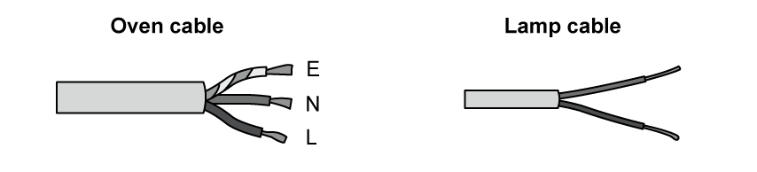

(i) Draw lines to complete the following statements

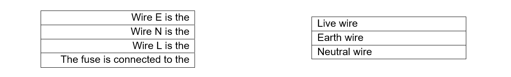

**[4]**

(ii) Complete the following sentences by circling the correct words

The wires in the oven cable are **thinner / thicker** than the wires in the lamp cable because:

1. They carry a **higher / lower** current than the lamp cable
2. They have a **higher / lower** resistance than the lamp cable

The lamp cable has two wires, which is **safe / not safe** to use, because:

1. The wires of the lamp have double **conducting power / insulation**.
2. The wires of the lamp are cased in **metal / plastic**, which is a good **conductor / insulator**.

**[4]**

### 3() — 3 marks — command: calculate — structured
The lamp is switched on for 3000 seconds.

Calculate the energy transferred by the lamp in this time.

** **

energy transferred = ............................................... J

## Q3 — easy — 4 marks · exam-questions

### 7((b)) — 1 mark — command: what — structured — from paper January 2012 · 1P
A hairdryer is connected to the mains supply and takes a current of 5.5 A.

| 3 A | 7 A | 5 A | 13 A |
|---|---|---|---|

What fuse should be used with the hairdryer?

### 7() — 1 mark — command: explain — structured — from paper January 2012 · 1P
Explain your answer to part (a).

### 7() — 2 marks — command: explain — structured — from paper January 2012 · 1P
The hairdryer has a plastic case so there is no need for an earth wire connection in the plug.

Explain why the hairdryer is still safe to use.

## Q4 — easy — 6 marks · exam-questions

### 1() — 2 marks — command: draw — structured
Batteries supply direct current (d.c).

Another type of current is alternating current (a.c).

Draw the voltage-time graph for a d.c. supply on the graph below.

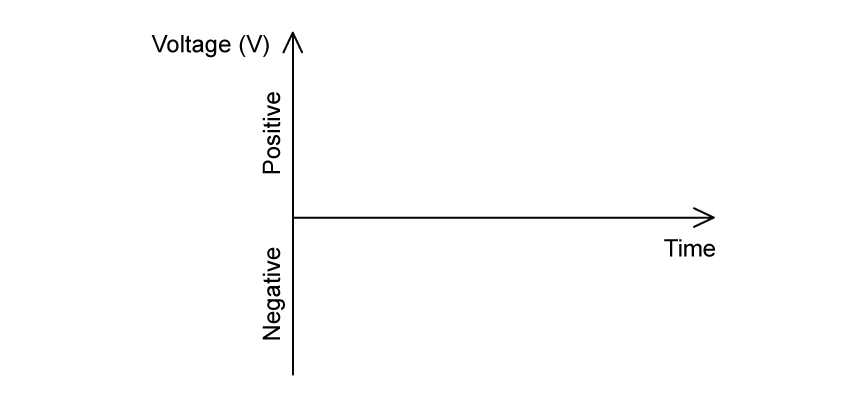

### 2() — 2 marks — command: draw — structured
Draw the voltage-time graph for an a.c. supply on the graph below.

### 3() — 2 marks — command: place — structured
Each statement in the table below may be true about d.c, true about a.c, or true for both d.c and a.c.

Place a tick in the correct box in each row.

|   | **True only for d.c** | **True only for a.c.** | **True for both** |
|---|---|---|---|
| The current always flows in the same direction |   |   |   |
| A transformer is used to supply this to domestic buildings |   |   |   |

## Q5 — easy — 7 marks · exam-questions

### 1() — 1 mark — command: explain — structured
The diagram shows a kettle. The kettle uses electric current to heat water.

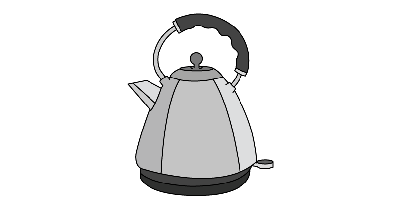

The kettle has a metal case.

Explain why it would be dangerous for the live wire from the electric cable to touch the case of the kettle.

### 2() — 3 marks — command: multiple — structured
The kettle uses mains power to function.

(i)State the relationship between power, current and voltage

**[1]**

(ii) A label on the kettle says that its power output is 2.5 kW if used with a 230 V supply.

Show that the current in the kettle is about 11 A.

**[2]**

### 3() — 3 marks — command: multiple — structured
(i) State the relationship between voltage, current and resistance.

**[1]**

(ii) Calculate the resistance of the kettle.

resistance .......................................... Ω**[2]**

## Q6 — medium — 1 marks · exam-questions

### 2((b)) — 1 mark — multiple_choice — from paper Jun 2015 · 2P
An electric kettle is connected to the 230 V mains supply. The power of the kettle is 960 W.

Another kettle has twice as much power. It is connected to the same mains supply.

Which of these fuse ratings should be used for this kettle?
- **A.** 1 A
- **B.** 3 A
- **C.** 5 A
- **D.** 13 A

## Q7 — medium — 1 marks · exam-questions

### 1((a)) — 1 mark — multiple_choice — from paper January 2015 · 1P
Double insulation is needed for safety when there is
- **A.** no circuit breaker
- **B.** no earth connection
- **C.** no fuse
- **D.** no switch

## Q8 — medium — 1 marks · exam-questions

### 1((b)) — 1 mark — multiple_choice — from paper January 2015 · 1P
A fuse is used so that
- **A.** an earth connection is not needed
- **B.** the appliances are more efficient
- **C.** the circuit cannot overheat if there is a fault
- **D.** the user cannot touch a live wire

## Q9 — medium — 14 marks · exam-questions

### 7((a)) — 2 marks — command: state — structured — from paper June 2014 · 1PR
The diagram shows the lighting circuit in an office.

State two advantages of connecting lamps in parallel rather than series.

### 7((a)) — 4 marks — command: multiple — structured — from paper June 2014 · 1PR
(i) What is the purpose of the 5 A fuse in the circuit from part (a)?

**[1]**

(ii) Explain how a fuse works.

**[3]**

### 7() — 4 marks — command: multiple — structured — from paper June 2014 · 1PR
A label on one of the office computers includes this information.

| 230 V                                                                                        0.25 kW |
|---|

(i) State the equation linking power, current and voltage.

**[1]**

(ii) Use the information on the label to calculate the current in the computer.

current = ............................................... A**[3]**

### 7() — 4 marks — command: multiple — structured — from paper June 2014 · 1PR
(i) Fuses are available with values of 1A, 3A, 10A and 13A.

Suggest the most suitable fuse value for the computer.

Give a reason for your answer.

**[2]**

(ii) Some circuits use a circuit breaker instead of a fuse.

State two advantages of using a circuit breaker instead of a fuse.

**[2]**

## Q10 — medium — 7 marks · exam-questions

### 6((a)) — 3 marks — command: multiple — structured — from paper June 2012 · 2P
A washing machine has an electric motor and an electric heater.

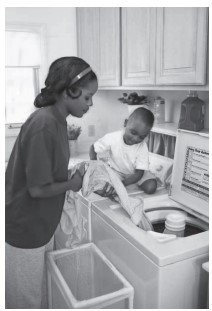

The resistance of the heater is 22 Ω.

The mains voltage is 230 V.

(i) State the equation linking voltage, current and resistance.

**[1]**

(ii) Show that the current in the heater is about 10 A when it is working.

**[2]**

### 6((b)) — 4 marks — command: explain — structured — from paper June 2012 · 2P 
The washing machine is fitted with a fuse rated at 13 A.

(i) Explain why the washing machine is fitted with a fuse.

**[2]**

(ii) When the motor is working, the current in it is 1.74 A.

Explain why it would **not **be sensible to replace the 13 A fuse with a 2 A fuse.

**[2]**

## Q11 — medium — 3 marks · exam-questions

### 9((b)) — 1 mark — command: state — structured — from paper Jun 2016 · 1P
The photograph shows a machine at a coal mine.

© Andrew Curtis

The machine lifts up containers of coal from the mine and lowers empty containers down.

The machine uses an electric motor connected to a 600 V d.c. supply. The maximum current in the motor is 4000 A.

State the equation linking power, current and voltage.

### 9((b)) — 2 marks — command: calculate — structured — from paper 2016 June ·  1P
Calculate the maximum power available from the motor.

** ** maximum power = ............................. MW

## Q12 — medium — 8 marks · exam-questions

### 3((a)) — 2 marks — command: multiple — structured — from paper Jan 2014 · 1P
The photograph shows an extension cable on a reel.

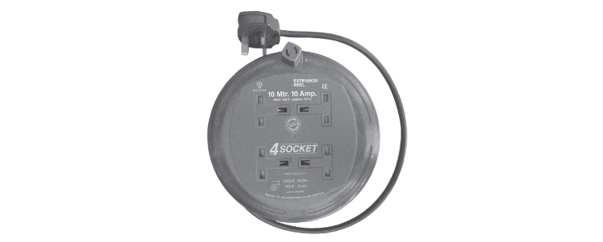

There is a warning label on the reel.

| WARNING  maximum allowable power  when cable fully extended - 2400 W, 240 V  when cable coiled up - 700 W, 240 V |
|---|

(i) State the equation linking power, current and voltage.

**[1]**

(ii) Complete the table by inserting the missing value.

| **Power in W** | **Voltage in V** | **Current in A** |
|---|---|---|
| 700 | 240 |   |
| 2400 | 240 | 10 |

**[1]**

### 3((b)) — 6 marks — command: multiple — structured — from paper Jan 2014 · 1P
The extension cable is fitted with a 13 A fuse.

(i) Describe how the fuse protects the cable.

**[3]**

(ii) Explain why a 5 A fuse is not suitable for this extension cable.

**[2]**

(iii) Suggest why the maximum recommended current is lower when the cable is coiled up.

**[1]**

## Q13 — medium — 7 marks · exam-questions

### 9((a)) — 4 marks — command: multiple — structured — from paper Jun 2013 · 1PR
The diagram shows some lamps connected together. There are 20 small lamps connected in series with a 9 V supply.

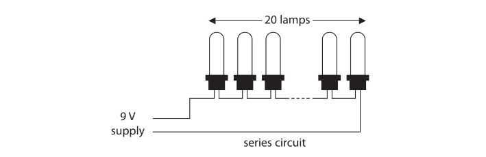

(i) What is the voltage across each lamp in the series circuit?

**[1]**

(ii) Each lamp has a power of 1.5 W. State the equation linking power, current and voltage.

**[1]**

(iii) Show that the current in the circuit is about 3 A.

**[2]**

### 9((b)) — 3 marks — command: calculate — structured — from paper Jun 2013 · 1PR
The lamps are on for 7 hours a day for 5 days. Calculate the total energy transferred during this time.

** ** Energy transferred = ........................... J

## Q14 — medium — 9 marks · exam-questions

### 2((a)) — 3 marks — command: multiple — structured — from paper Jun 2015 · 2P
An electric kettle is connected to the 230 V mains supply. The power of the kettle is 960 W.

(i) State the equation linking power, current and voltage.

**[1]**

(ii) Show that the current in the kettle is about 4 A.

**[2]**

### 2((b)) — 3 marks — command: explain — structured — from paper Jun 2015 · 2P
The 960 W kettle is earthed and fitted with a fuse.

Explain how this can protect the person using the kettle if there is a fault.

### 2((c)) — 3 marks — command: explain — structured — from paper Jun 2015 · 2P
A student has a pack of fuses labelled 2 A.

Explain how she could use one of these fuses to check that the label is correct.

## Q15 — medium — 11 marks · exam-questions

### 6((b)) — 7 marks — command: multiple — structured — from paper Jun 2013 · 2P
A wind turbine generates electricity for the National Grid.

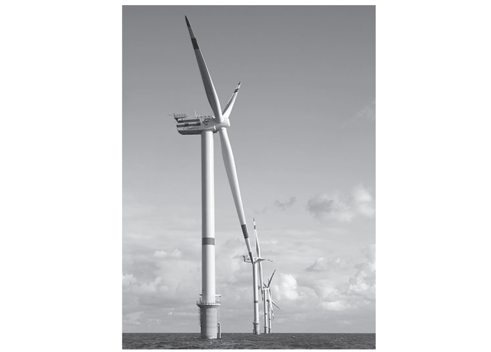

The generator in the wind turbine transfers 39 MJ of energy in 1 minute. The generator current is 490 A.

(i) Calculate the output voltage of the generator.

** ** Voltage = .................................. V**[3]**

(ii) The generator output voltage is then increased to 132 kV for transmission.

Explain why electrical energy is transmitted using very high voltages.

**[4]**

### 6((c)) — 4 marks — command: explain — structured — from paper Jun 2013 · 2P
The generator provides a direct current (d.c.). This d.c. is changed to an alternating current (a.c.). The frequency of the alternating current is 50 Hz.

(i) Explain the meaning of 50 Hz alternating current.

**[2]**

(ii) Explain why the d.c. from the generator must be changed to a.c. before it is transmitted.

**[2]**

## Q16 — medium — 7 marks · exam-questions

### 3((a)) — 2 marks — command: state — structured — from paper Jun 2015 · 1P
The diagram shows a lighting circuit in a house.

(i) State the name of component X.

**[1]**

(ii) The lamps are connected in parallel. State an advantage of using a parallel circuit for lighting.

**[1]**

### 3((b)) — 2 marks — command: explain — structured — from paper Jun 2015 · 1P
The lighting circuit is connected to a mains supply that provides an alternating current.

Explain what is meant by an alternating current.

### 3((c)) — 3 marks — command: calculate — structured — from paper Jun 2015 · 1P
Lamp Y is removed and replaced with a low-energy lamp.  When the low-energy lamp is connected to a 230 V supply, the current in it is 0.12 A.

Calculate the amount of energy transferred by the low-energy lamp in 7 hours.

** ** Energy transferred = .................................. J

## Q17 — medium — 6 marks · exam-questions

### 4() — 6 marks — command: discuss — structured — from paper June 2015 · 1P
A kitchen has a water supply, an electricity supply and electric lighting.

There are several electrical appliances in the kitchen including a toaster, a kettle, a clothes iron, a microwave oven and a dishwasher.

Discuss three hazards of using electricity in this kitchen.

## Q18 — hard — 1 marks · exam-questions

### 7((c)) — 1 mark — multiple_choice — from paper June 2014 · 1PR
The graphs show some ways that power (*P*) can vary with voltage (*V*). Which is the correct graph for a fixed resistor?

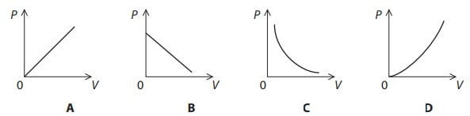
- **A.** 
- **B.** 
- **C.** 
- **D.** 

## Q19 — hard — 1 marks · exam-questions

### 3((c)) — 1 mark — multiple_choice — from paper Jun 2015 · 1P
The diagram shows a lighting circuit in a house.

Lamp Y is removed and replaced with a low-energy lamp. When the low energy lamp is connected to a 230 V supply, the current in it is 0.12 A.

The low-energy lamp gives the same amount of light as lamp Y, but uses much less power.

Which row of the table compares the low-energy lamp correctly to lamp Y?

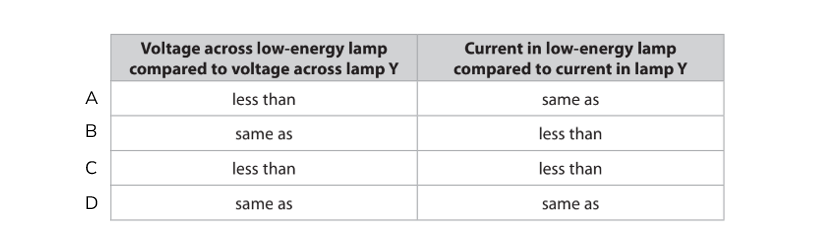
- **A.** 
- **B.** 
- **C.** 
- **D.** 

## Q20 — hard — 12 marks · exam-questions

### 6((a)) — 4 marks — command: multiple — structured — from paper June 2014 · 1P
The photograph shows an electric heater.

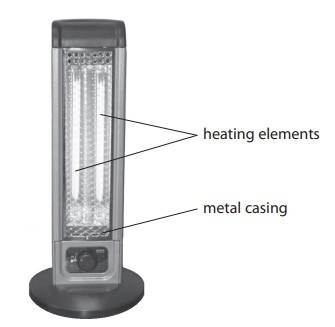

The power of the heater is 2000 W.

The heater is connected to a 230 V mains supply.

(i) State the equation linking power, current and voltage.

**[1]**

(ii) Calculate the current in the heater.

** ** current = ............................................... A**[2]**

(iii) What size fuse should be used with the heater?

**[1]**

### 6((b)) — 2 marks — command: describe — structured — from paper June 2014 · 1P
The two heating elements can be connected in series or in parallel.

Describe an advantage of each method.

### 6((c)) — 6 marks — command: multiple — structured — from paper June 2014 · P1
Some electrical appliances are fitted with an earth wire.

(i) Describe how an earth wire acts as a safety feature.

**[4]**

(ii) Explain why this heater should be fitted with an earth wire.

**[2]**

## Q21 — hard — 5 marks · exam-questions

### 2((a)) — 2 marks — command: explain — structured — from paper Jun 2013 · 2P
A soldering iron is a tool used when joining electronic components in a circuit. It has an electric heater.

Soldering iron A operates when connected to the mains supply.

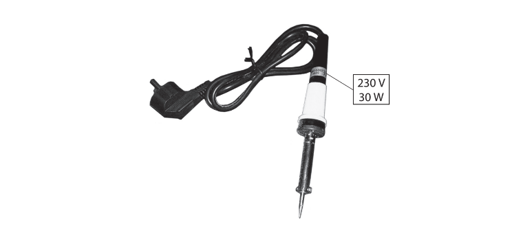

Soldering iron A

Soldering iron A is labelled 230 V, 30 W.

This soldering iron has an earth connection. Explain how an earth connection protects the user.

### 2((b)) — 3 marks — command: evaluate — structured — from paper Jun 2013 · 2P
Soldering iron B is connected to a low voltage power supply.

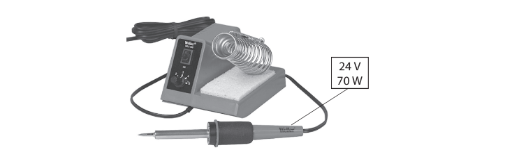

Soldering iron B

Soldering iron B is labelled 24 V, 70 W.

A student says:

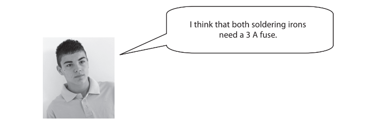

Use information from the soldering iron labels to evaluate this statement.

## Q22 — hard — 15 marks · exam-questions

### 9((a)) — 5 marks — command: multiple — structured — from paper January 2013 · 1P
A student uses an electric heater to investigate efficiency.

He places the heater in an aluminium block, switches the heater on and measures the temperature of the block each minute for 20 minutes.

The student wants to calculate the electrical energy supplied to the heater.

(i) Complete the table by recording the readings shown on the meters below.

**[2]**

(ii) Show that the energy supplied to the heater in 20 minutes is about 30 000 J.

**[3]**

### 9((b)) — 5 marks — command: multiple — structured — from paper January 2013 · 1P
The student is told that only 22 000 J are used to raise the temperature of the aluminium block by 25 °C.

(i) State the equation linking efficiency, useful energy output and total energy input.

**[1]**

(ii) Calculate the efficiency of heating the aluminium block.

** **Efficiency = ............................................... **[2]**

(iii) The efficiency of the heater will be higher than this value.

Suggest why.

**[1]**

(iv) State one way in which the student could increase the efficiency of heating the aluminium block.

**[1]**

### 9((c)) — 5 marks — command: explain — structured — from paper January 2013 · 1P
The graph shows how the temperature of the block increases from 20 °C to 45 °C during the investigation.

Use ideas about heat transfer to help you explain the shape of the graph in:

(i) section A

**[1]**

(ii) section B

**[2]**

(iii) section C

**[2]**

## Q23 — hard — 15 marks · exam-questions

### 2((a)) — 2 marks — command: give — structured — from paper Jun 2015 · 1PR
The diagram shows part of a lighting circuit in a house. The circuit is protected by fuse F.

Give two reasons why the lamps are wired in parallel.

### 2((b)) — 1 mark — multiple_choice — from paper Jun 2015 · 1PR
What is the current at P?
- **A.** 0.17 A
- **B.** 0.26 A
- **C.** 0.43 A
- **D.** 1.38 A

### 2((c)) — 3 marks — command: explain — structured — from paper Jun 2015 · 1PR
Explain how the fuse protects the circuit.

### 2((d)) — 6 marks — command: multiple — structured — from paper Jun 2015 · 1PR
(i) State the equation linking power, current and voltage.

**[1]**

(ii) Calculate the power of lamp L. You can assume the mains voltage is 230 V.

** ** Power = .................... W  **[2]**

(iii) Calculate the amount of energy transferred by lamp L in 3 minutes. Give the unit.**         **

Energy transferred = .......................... unit .................** [3]**

### 2((e)) — 3 marks — command: multiple — structured — from paper Jun 2015 · 1PR
This diagram shows another lighting circuit.

(i) Complete the table by putting a tick (**✓**) in the box if the lamp is lit and a cross (**х**) in the box if the lamp is not lit.

| **S****1**** position** | **S****2**** position** | **Lamp lit (✓ or х)** |
|---|---|---|
| W | X |   |
| W | Y |   |
| Z | X |   |
| Z | Y |   |

**[2]**

(ii) Suggest where this circuit would be useful in a house.

**[1]**
