# Exam Questions — Energy Stores & Transfers
**4. Energy Resources & Energy Transfers** · Edexcel IGCSE Science (Double Award) (4SD0) — 17/Physics
> Source: [https://www.savemyexams.com/igcse/science/edexcel/double-award/17/physics/topic-questions/energy-resources-and-energy-transfers/energy-stores-and-transfers/exam-questions/](https://www.savemyexams.com/igcse/science/edexcel/double-award/17/physics/topic-questions/energy-resources-and-energy-transfers/energy-stores-and-transfers/exam-questions/) · 20 questions · total 121 marks

## Q1 — easy — 1 marks · exam-questions

### 1() — 1 mark — multiple_choice
William Herschel was a scientist who investigated infrared radiation. He passed electromagnetic radiation from the Sun through a triangular glass prism.

Hershel used a thermometer to detect infrared radiation.

He coloured the surface of the thermometer to make it more effective.

Which colour surface would work best?
- **A.** black
- **B.** red
- **C.** silver
- **D.** white

## Q2 — easy — 1 marks · exam-questions

### 1((a)) — 1 mark — multiple_choice — from paper Jun 2014 · 2PR
Which of these is a unit for energy?
- **A.** joule
- **B.** kilogram
- **C.** newton
- **D.** watt

## Q3 — easy — 8 marks · exam-questions

### 1((b)) — 4 marks — command: complete — structured — from paper Jun 2014 · 2PR
The diagram shows a cell connected to a lamp.

Use words from the box to complete the sentences.

| chemical         heating         nuclear         mechanically  thermal         radiation         magnetic |
|---|

Each word may be used once, more than once, or not at all.

Energy from the ....................... store of the cell is transferred electrically to the ................................ store of the bulb.

Energy is dissipated by ............................ and ............................ to the surroundings.

### 1((c)) — 4 marks — command: multiple — structured — from paper Jun 2014 · 2PR
This is the Sankey energy diagram for a low energy lamp.

(i) Calculate the amount of thermal energy wasted in the lamp.

[1]

Thermal energy = ............................... J

(ii) State the equation linking efficiency, useful energy output and total energy input.

[1]

(iii) Calculate the efficiency of the lamp.

[2]

Efficiency = ...................................

## Q4 — easy — 1 marks · exam-questions

### 1((a)) — 1 mark — multiple_choice — from paper Jan 2014 · 1P
The diagram shows typical values for the percentage energy losses from a house.

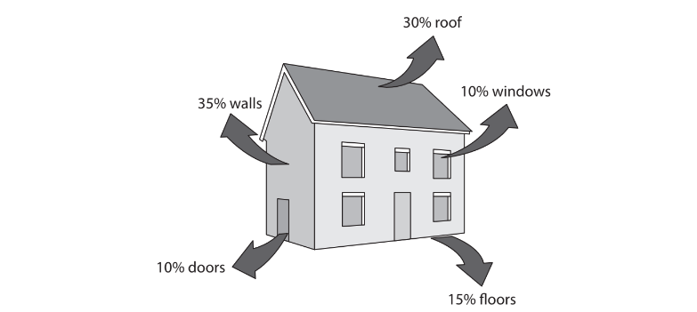

Most energy is lost through
- **A.** the floors
- **B.** the roof
- **C.** the walls
- **D.** the windows

## Q5 — easy — 1 marks · exam-questions

### 1((b)) — 1 mark — multiple_choice — from paper Jan 2014 · 1P
The diagram shows typical values for the percentage energy losses from a house.

The total percentage energy loss from the roof and the windows is
- **A.** 10%
- **B.** 20%
- **C.** 30%
- **D.** 40%

## Q6 — medium — 4 marks · exam-questions

### 9() — 4 marks — command: explain — structured — from paper June 2015 · 1P
A student has two computer hard drives.

One is black and one is white.

The student places the white hard drive on top of the black one as shown in photograph A.

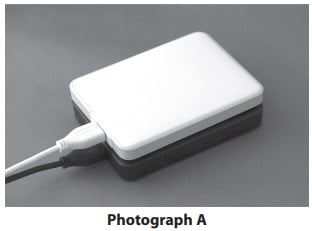

The student connects both hard drives to a computer so that they receive the same amount of electrical power. The temperature of the hard drives rises as they work.

The student then rearranges the hard drives so that the black one is on top as shown in photograph B.

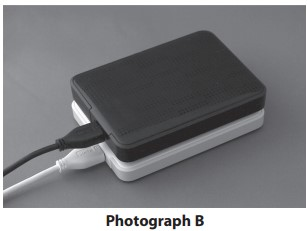

The hard drives are still working, but their temperature is lower than before.

Explain why the hard drives work at a lower temperature when the black one is on top.

## Q7 — medium — 12 marks · exam-questions

### 12((a)) — 4 marks — command: describe — structured — from paper Jan 2012 · 1P
This question is about three different methods used to cook potatoes.

On a traditional cooker, a potato is placed in water in a pan on top of a hot plate.

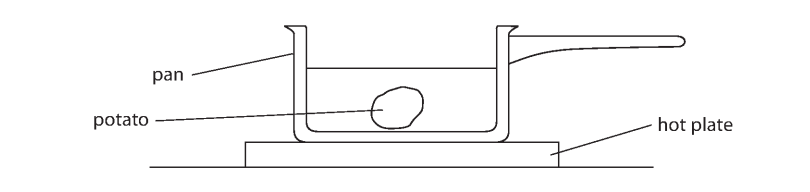

Describe how energy is transferred from the hot plate to heat up all of the potato.

### 12((b)) — 3 marks — command: explain — structured — from paper Jan 2012 · 1P
A microwave cooker is often said to ‘cook the food from the inside’.

Explain whether this statement is true by describing how energy is transferred to heat up all of the potato.

### 12((c)) — 5 marks — command: describe — structured — from paper Jan 2012 · 1P
In an induction cooker, there is a coil under the surface of the cooker.

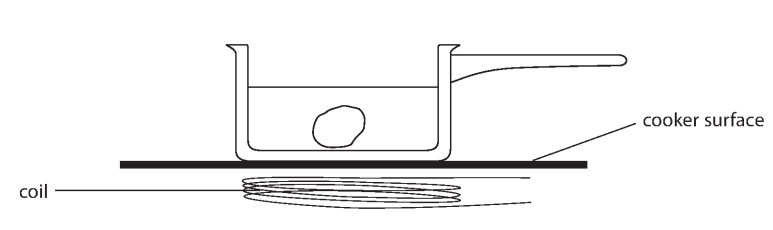

A potato is placed in water in a metal pan.

An alternating current is switched on in the coil under the pan.

The coil does not heat the surface of the cooker.

Describe how energy is transferred to heat up all of the potato.

## Q8 — medium — 3 marks · exam-questions

### 9((a)) — 2 marks — command: draw — structured — from paper 2014 June · 1PR
John Leslie was a scientist who investigated heat and thermometers.

He experimented with a hollow metal cube. The cube had different surfaces on each side and was filled with boiling water.

A student uses a modern version of Leslie’s cube to investigate how the surface of a hot object affects the radiation emitted.

She uses a cube with four different vertical surfaces.

She fills the cube with boiling water so that the temperature of each surface is the same.

She uses the radiation sensor to measure the radiation emitted from each surface.

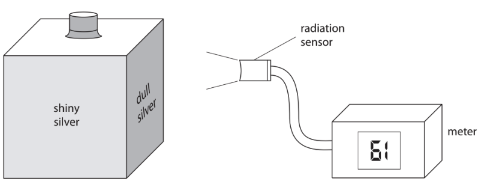

The student’s results are shown below.

Draw a line linking each surface colour with its correct meter reading.

One has been done for you.

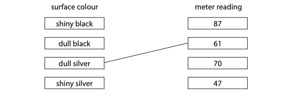

### 9((a)) — 1 mark — command: what — structured — from paper 2014 June · 1PR
The temperature of each surface is the same, but the radiation sensor gives a different reading for each surface.

What can you conclude from this?

## Q9 — medium — 4 marks · exam-questions

### 8((a)) — 4 marks — command: explain — structured — from paper 2016 June · 2P
A cooling tower is designed to transfer thermal energy away from a power station.

© Copyright Alan Murray-Rust

Thermal energy from the power station warms the air inside the cooling tower. Air enters through holes at the bottom of the cooling tower and leaves through the top.

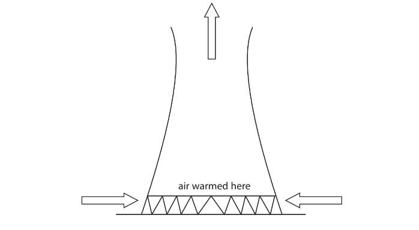

Explain why the air moves as shown by the arrows.

## Q10 — medium — 3 marks · exam-questions

### 8((b)) — 3 marks — command: describe — structured — from paper Jan 2015 · 1P
Water from a reservoir can be used to generate electricity on a large scale. Describe the energy transfers involved in this process.

## Q11 — medium — 6 marks · exam-questions

### 10() — 6 marks — command: describe — structured — from paper Jun 2016 · 1PR
The diagram shows a metal device for cooking potatoes. Potatoes are pushed onto the metal spikes.

The photograph shows two potatoes cooking in an electric oven. The inside of the oven is black. The heating element is at the bottom of the oven.

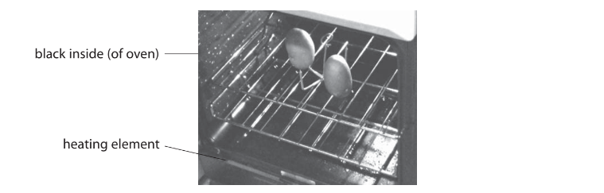

Describe the different ways in which energy is transferred to cook the potatoes.

## Q12 — medium — 6 marks · exam-questions

### 2((b)) — 1 mark — command: what — structured — from paper Jun 2014 · 1P
The diagram shows some electrical appliances.

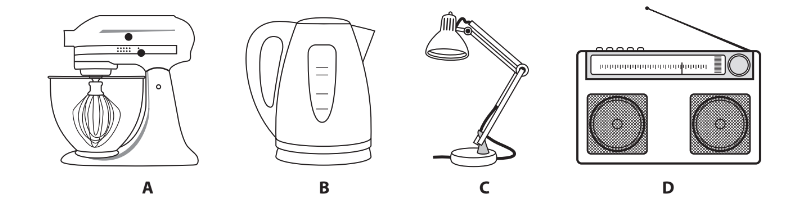

In all the appliances, energy is conserved. What is meant by the phrase **energy is conserved**?

### 2((c)) — 5 marks — command: multiple — structured — from paper Jun 2014 · 1P
(i) The lamp has an efficiency of 20%. Explain what this means.

**[2]**

(ii) Draw a labelled Sankey diagram for the lamp.

**[3]**

## Q13 — medium — 5 marks · exam-questions

### 7((a)) — 4 marks — command: explain — structured — from paper Jun 2012 · 1P
A student feels cold at night and decides to sleep under a thick woollen blanket.

Explain how the woollen blanket helps to keep the student warm.

### 7((b)) — 1 mark — command: explain — structured — from paper Jun 2012 · 1P
The student says

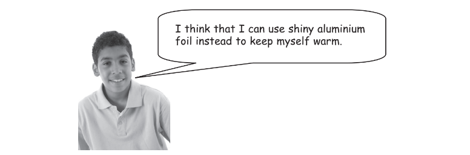

Do you agree with the student? Explain why.

## Q14 — hard — 12 marks · exam-questions

### 12((a)) — 2 marks — command: discuss — structured — from paper June 16 · 1P
Polar bears have thick fur to keep them warm.

This photograph of a polar bear was taken using visible light.

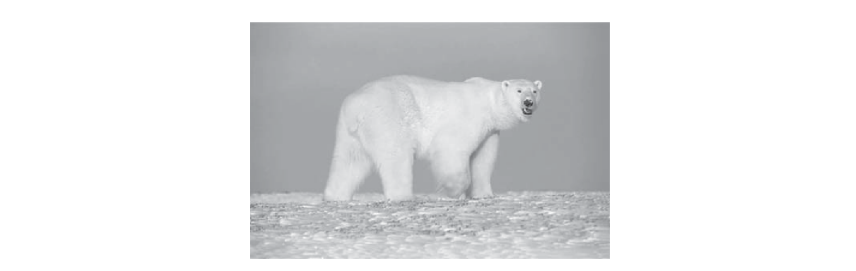

The diagram shows a thermal image of the same scene.

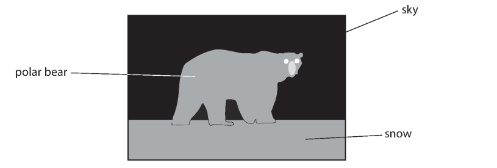

Darker colours in this image indicate lower temperatures.

Discuss what information the image gives about the temperatures of the objects shown.

### 12((b)) — 5 marks — command: multiple — structured — from paper Jun 16 · 1
The polar bear’s fur includes short hairs and longer hairs. These longer hairs are hollow and contain air.

(i) Explain how its fur reduces the amount of thermal energy lost by the polar bear.

**[2]**

(ii) Underneath its white fur, a polar bear has black skin.

Discuss how these colours affect the overall amount of thermal energy lost by the polar bear’s body.

**[3]**

### 12((c)) — 5 marks — command: multiple — structured — from paper Jun 2016 · 1P
The diagram shows another image of the same scene.

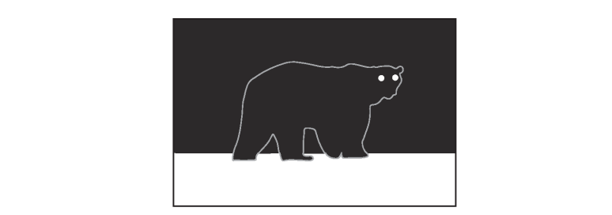

The image was made during the day using ultraviolet rays from the Sun. Brighter colours in this image indicate larger amounts of ultraviolet radiation. The grey line is added to show the position of the polar bear.

(i) Compare the absorption and reflection of ultraviolet rays by the objects shown in the image.

**[2]**

(ii) Suggest why the sky appears dark, even though the Sun emits ultraviolet rays.

**[1]**

(iii) The hollow hairs in polar bear fur are transparent tubes filled with air. It was thought that these hairs could act like optical fibres and guide ultraviolet rays down to the polar bear’s skin.

It is now known that this idea is **incorrect**. The ultraviolet rays do **not** reach the polar bear’s skin.

The diagram shows an ultraviolet ray entering the air inside a hollow hair.

Suggest why this radiation does not pass down to the polar bear’s skin.

**[2]**

## Q15 — hard — 2 marks · exam-questions

### 12((c)) — 2 marks — command: show — structured — from paper June 2012 · 1P
The photograph shows equipment used for generating electricity from renewable sources.

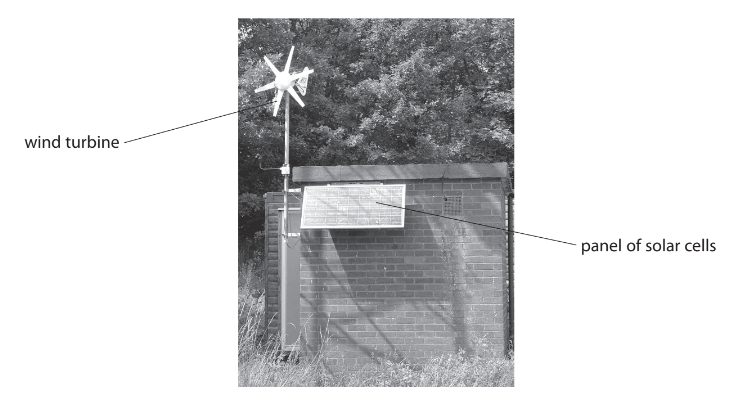

The Sankey diagram shows the energy transferred by the panel of solar cells.

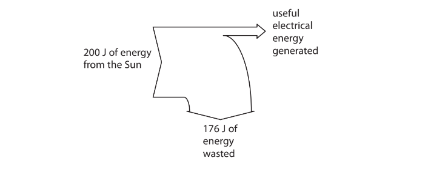

Show that the efficiency of the panel of solar cells is 12%.

## Q16 — hard — 6 marks · exam-questions

### 3((b)) — 4 marks — command: explain — structured — from paper Jun 2013 · 2P
James Dewar was a scientist who investigated liquid oxygen.

Dewar invented a special flask for storing liquid oxygen in the laboratory. It was designed to reduce heat flow from the air outside to the liquid oxygen inside. The flask had two glass walls with a vacuum between them. The inside glass surfaces were each covered with a thin layer of shiny metal. The diagram shows a cross section of the flask.

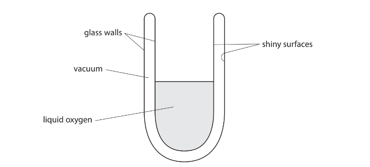

(i) Explain how the shiny surfaces reduce the thermal energy transferred to the liquid oxygen from the laboratory.

**[2]**

(ii) Explain how the vacuum reduces the thermal energy transferred to the liquid oxygen from the laboratory.

**[2]**

### 3((c)) — 2 marks — command: suggest — structured — from paper Jun 2013 · 2P
Dewar’s flask did not have a lid when it was holding liquid oxygen.

Suggest why a lid was not needed.

## Q17 — hard — 10 marks · exam-questions

### 9((a)) — 5 marks — command: explain — structured — from paper June 2014 · 1P
The diagram shows how air moves near the coast on a warm day.

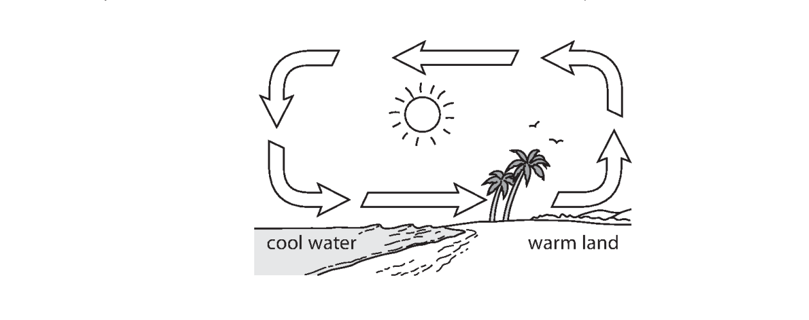

Explain why air moves as shown on the diagram.

### 5((a)) — 5 marks — command: describe — structured — from paper January 2015 · 1P
The diagram shows a chimney over a furnace.

A coal fire is burning in the furnace.

Air moves into the furnace and up the chimney.

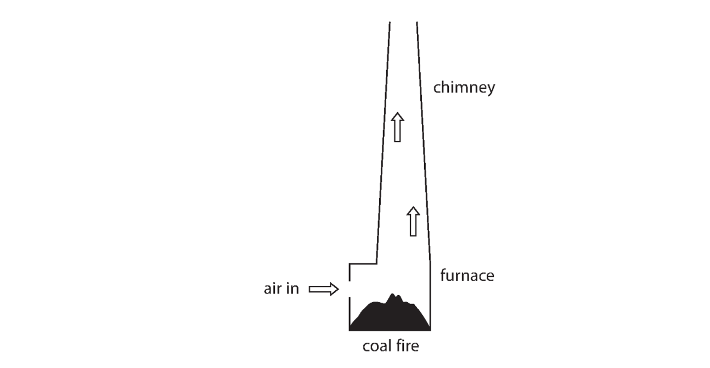

Describe how the process of convection causes this air movement.

## Q18 — hard — 15 marks · exam-questions

### 9((a)) — 5 marks — command: multiple — structured — from paper January 2013 · 1P
A student uses an electric heater to investigate efficiency.

He places the heater in an aluminium block, switches the heater on and measures the temperature of the block each minute for 20 minutes.

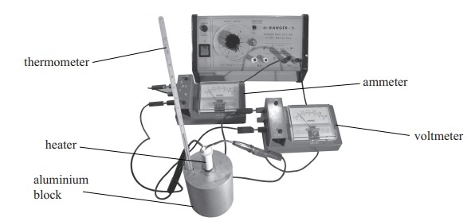

The student wants to calculate the electrical energy supplied to the heater.

(i) Complete the table by recording the readings shown on the meters below.

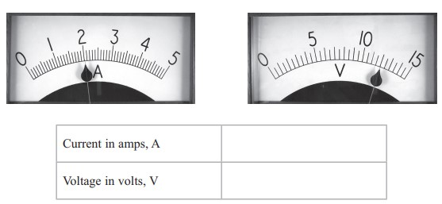

**[2]**

(ii) Show that the energy supplied to the heater in 20 minutes is about 30 000 J.

**[3]**

### 9((b)) — 5 marks — command: multiple — structured — from paper January 2013 · 1P
The student is told that only 22 000 J are used to raise the temperature of the aluminium block by 25 °C.

(i) State the equation linking efficiency, useful energy output and total energy input.

**[1]**

(ii) Calculate the efficiency of heating the aluminium block.

Efficiency = ............................................... **[2]**

(iii) The efficiency of the heater will be higher than this value.

Suggest why.

**[1]**

(iv) State one way in which the student could increase the efficiency of heating the aluminium block.

**[1]**

### 9((c)) — 5 marks — command: explain — structured — from paper January 2013 · 1P
The graph shows how the temperature of the block increases from 20 °C to 45 °C during the investigation.

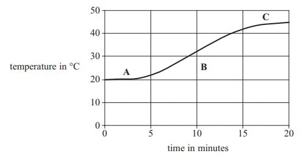

Use ideas about heat transfer to help you explain the shape of the graph in:

(i) section **A**,

**[1]**

(ii) section **B**,

**[2]**

(iii) section **C**,

**[2]**

## Q19 — hard — 12 marks · exam-questions

### 10((a)) — 5 marks — command: multiple — structured — from paper Jan 2012 · 1P
A shopping centre has escalators to move people between floors.

A man of mass 78 kg steps on to an escalator. The escalator lifts him a height of 5.0 m.

(i) State the equation linking gravitational potential energy, mass, g and height.

**[1]**

(ii) Show that the gravitational potential energy gained by the man is about 4000 J.

**[2]**

(iii) State the work done on the man and give the unit.

** **Work done = ............................... Unit ..............................**[2]**

### 10((b)) — 4 marks — command: multiple — structured — from paper Jan 2012 · 1P
The escalator is powered by a 7.5 kW electric motor.

(i) State the equation linking efficiency, useful energy output and total energy input.

**[1]**

(ii) The escalator lifts 30 people each minute. Each person has a mass of 78 kg. Calculate the efficiency of the escalator.

**[3]**

### 10((c)) — 3 marks — command: draw — structured — from paper Jan 2012 · 1P
Another escalator has an efficiency of 20%.

Its input power is 15 kW.

Draw a Sankey diagram for this escalator.

## Q20 — hard — 9 marks · exam-questions

### 12((a)) — 6 marks — command: multiple — structured — from paper Jan 2016 · 1P
An experimental solar updraft tower (SUT) was built in the south of Spain. This part of Spain has little rainfall and is hot in summer months. The SUT was used as a 50 kW electricity generator.

The diagram shows the component parts of the tower. The cover allows visible light to pass through but traps infrared. Rows of blocks under the cover absorb thermal radiation.

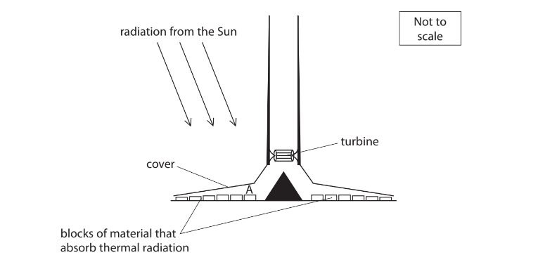

(i) Explain what happens to the air at A just under the cover.

**[3]**

(ii) On the diagram, mark the directions of the air movements over the blocks of material and through the turbine.

**[2]**

(iii) State the name of this effect.

**[1]**

### 12((c)) — 3 marks — command: suggest — structured — from paper Jan 2016 · 1P
(i) Suggest why the SUT generates most electricity during daylight hours.

**[1]**

(ii) Suggest why there are blocks of material that absorb thermal radiation in the SUT.

**[1]**

(iii) Suggest an alternative to these blocks that would improve the total energy output of the SUT.

**[1]**
