# Exam Questions — Movement & Position
**1. Forces & Motion** · Edexcel IGCSE Science (Double Award) (4SD0) — 17/Physics
> Source: [https://www.savemyexams.com/igcse/science/edexcel/double-award/17/physics/topic-questions/forces-and-motion/movement-and-position/exam-questions/](https://www.savemyexams.com/igcse/science/edexcel/double-award/17/physics/topic-questions/forces-and-motion/movement-and-position/exam-questions/) · 15 questions · total 131 marks

## Q1 — easy — 3 marks · exam-questions

### 1((a)) — 1 mark — multiple_choice — from paper June 2016 · 1P
A toy car rolls down a ramp and hits a cushion.

The graph shows how its velocity changes with time.

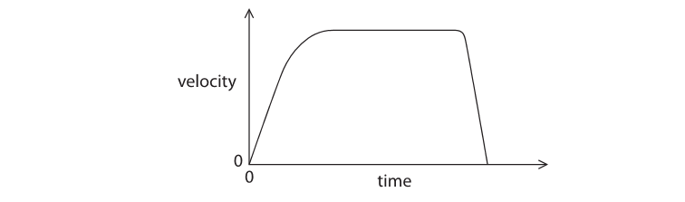

Constant velocity on the graph is shown by
- **A.** the area under the line
- **B.** the horizontal part of the line
- **C.** the sloping line at the end
- **D.** the sloping line at the start

### 1((b)) — 1 mark — multiple_choice — from paper June 2016 · 1P
The distance travelled is shown by
- **A.** the area under the line
- **B.** the horizontal part of the line
- **C.** the sloping line at the end
- **D.** the sloping line at the start

### 1((c)) — 1 mark — multiple_choice — from paper June 2016 · 1P
The average speed of the toy car is given by
- **A.** the change in speed divided by the time taken
- **B.** the distance moved divided by the time taken
- **C.** the time taken divided by the change in speed
- **D.** the time taken divided by the distance moved

## Q2 — easy — 11 marks · exam-questions

### 2((a)) — 2 marks — command: multiple — structured — from paper June 2015 · 1P
A bus travels along a straight road.

The graph shows how the velocity of the bus changes during a short journey.

(i) State the velocity of the bus after 25 s.

[1]

velocity = .............................m/s

(ii) How long is the bus stationary during its journey?

[1]

time = .............................s

### 2((b)) — 4 marks — command: multiple — structured — from paper June 2015 · 1P
(i) State the equation linking acceleration, change in velocity and time taken.

[1]

(ii) Calculate the acceleration of the bus during the first 10 seconds.

Give the unit.

[3]

acceleration = .......................... unit ..........................

### 2((c)) — 3 marks — command: multiple — structured — from paper June 2015 · 1P
(i) State the equation linking average speed, distance moved and time taken.

[1]

(ii) The bus moves a total distance of 390 m during the journey.

Calculate the average speed of the bus.

[2]

average speed = ......................... m/s

### 2((d)) — 2 marks — command: explain — structured — from paper June 2015 · 1P
The bus travels further in the first 30 seconds of its journey than it does during the last 30 seconds.

Explain how the graph shows this.

## Q3 — easy — 8 marks · exam-questions

### 2((a)) — 2 marks — command: state — structured — from paper 2012 January · 2P
Two students, Jenny and Cho, are investigating motion. Jenny walks in a straight line. Cho measures the distance Jenny has walked at 10 s intervals.

State two measuring instruments the students should use.

### 2((b)) — 3 marks — command: draw — structured — from paper 2012 January · 2P
The table shows their measurements.

| **Time in s** | **Distance walked in m** |
|---|---|
| 0 | 0 |
| 10 | 14 |
| 20 | 19 |
| 30 | 24 |
| 40 | 29 |
| 50 | 30 |
| 60 | 31 |

Draw a graph of distance against time for this data.

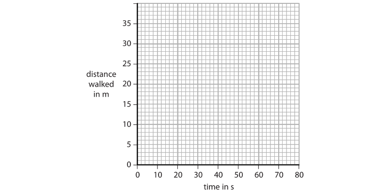

### 2((c)) — 1 mark — command: how — structured — from paper Jan 2012 · 2P
How far had Jenny walked after 35 s?

Distance walked = ................................... m

### 2((d)) — 2 marks — command: multiple — structured — from paper 2012 January · 2P
(i) Describe how Jenny's speed changed during the investigation.

[1]

(ii) What feature of the graph shows this change?

[1]

## Q4 — easy — 17 marks · exam-questions

### 1() — 7 marks — command: explain — structured
The velocity-time graph shows how the velocity of a motorcycle changes with time.

State and explain which part of the graph shows that the motorcycle has

(i) A constant velocity.

[2]

(ii) A constant acceleration.

[3]

(iii) A constant deceleration.

[2]

### 2() — 7 marks — command: multiple — structured
(i) State the formula linking acceleration, change in velocity and time taken.

[1]

(ii) Calculate the acceleration of the motorcycle between 0 and 10 seconds.

[3]

acceleration = ............................................................ m/s2

(iii) Show that the distance travelled by the motorbike between 0 and 10 seconds is about 108 m.

[3]

distance = ............................................................ m

### 3() — 3 marks — command: calculate — structured
Calculate the total distance travelled by the motorbike.

distance = .............................................................. m

## Q5 — easy — 6 marks · exam-questions

### 1() — 1 mark — multiple_choice
The following graphs **A** to **D** show the variation of displacement and velocity with time for different objects.

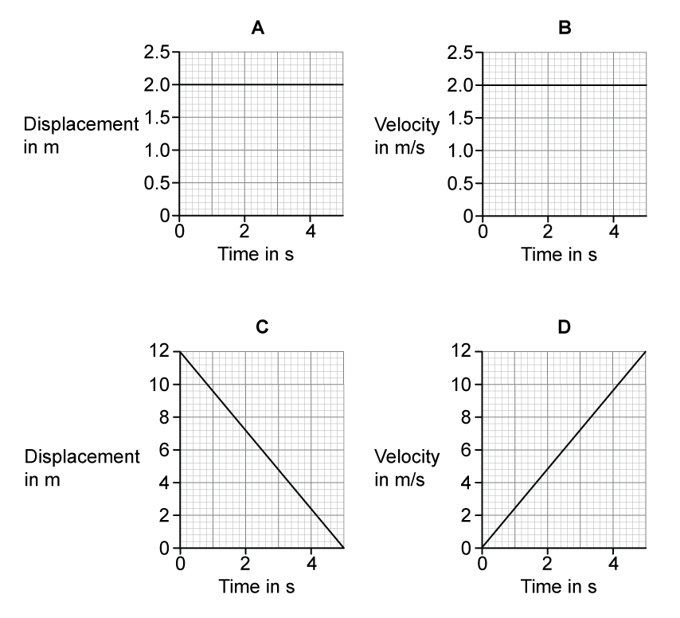

Which of these graphs represents an object moving with a constant velocity of 2 m/s?
- **A.** 
- **B.** 
- **C.** 
- **D.** 

### 2() — 1 mark — multiple_choice
Which of the graphs in (a) represents an object which is **not** moving?
- **A.** 
- **B.** 
- **C.** 
- **D.** 

### 3() — 1 mark — multiple_choice
Which of the graphs in (a) represents an object moving with a velocity of 2.4 m/s after 2 seconds?
- **A.** 
- **B.** 
- **C.** 
- **D.** 

### 4() — 3 marks — command: calculate — structured
Calculate the distance travelled by the object shown in graph **D** after 5 seconds.**  **

distance = .............................................................. m

## Q6 — medium — 10 marks · exam-questions

### 10((a)) — 7 marks — command: multiple — structured — from paper June 2013 · 1P
An aeroplane takes two minutes to travel the short distance between airports on two islands.

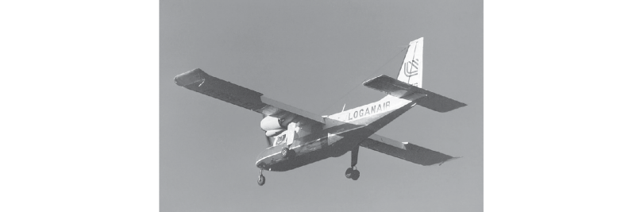

The graph shows how the speed of the aeroplane changes as it

- takes off
- flies across the sea
- lands on the other island

When it is flying across the sea, the aeroplane travels at a constant speed.

Use the graph to answer the following questions.

(i) State the value of the constant speed.

[1]

speed = ..................................... m/s

(ii) Calculate the acceleration of the aeroplane at the start of the journey and give the unit.

[3]

acceleration = ............................... unit ...................

(iii) Calculate the total distance that the aeroplane travels.

[3]

distance = ..................................... m

### 10((b)) — 3 marks — command: explain — structured — from paper June 2013 · 1P
Each airport has a runway that is about 500 m long.

When it lands, the speed of the aeroplane is 40 m/s.

Explain why the airline should not use an aeroplane that has more mass and needs a higher speed for landing.

## Q7 — medium — 6 marks · exam-questions

### 16((c)) — 3 marks — command: calculate — structured — from paper June 2012 · 1P
Graph **1** shows how the velocity of a car changes with time.

Calculate the distance the car travels in the first four seconds.

distance = ............................................... m

### 16((d)) — 3 marks — command: multiple — structured — from paper June 2012 · 1P
As the car travels further along the track its acceleration changes as shown in graph **2**.

(i) State which feature of graph **2** shows how the acceleration changes.

[1]

(ii) The acceleration changes even though the driving force does **not** change.

Suggest **two** possible reasons for this change in acceleration.

[2]

## Q8 — medium — 12 marks · exam-questions

### 5((a)) — 2 marks — command: multiple — structured — from paper 2014 January · 1P
A student investigates the motion of a toy car as it moves freely down a slope.

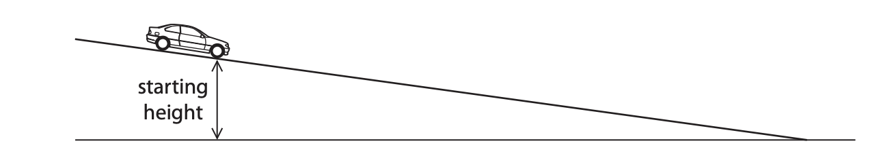

The student wants to find the link between the starting height of the car and the speed of the car at the bottom of the slope.

(i) State the independent variable in this investigation.

**[1]**

(ii) Suggest a link between the starting height of the car and its speed at the bottom of the slope.

**[1]**

### 5((b)) — 2 marks — command: describe — structured — from paper 2014 January · 1P
Describe how the student should measure the starting height of the car.

### 5((c)) — 5 marks — command: multiple — structured — from paper 2014 January · 1P
The student describes how she will find the speed of the car at the bottom of the slope.

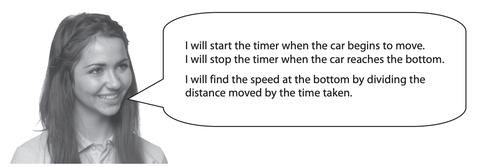

(i) Explain why the student will not be able to calculate the correct speed using this method.

**[2]**

(ii) Describe how the student should take the measurements needed to find the speed of the car at the bottom of the slope.

You should name any additional equipment needed.

**[3]**

### 5((d)) — 3 marks — command: suggest — structured — from paper 2014 January · 1P
The student repeats the experiment using the same equipment and the same starting height.

She finds out that the time taken for the car to move down the slope is not exactly the same for each experiment.

Suggest three reasons why the student gets different results when she repeats the experiment.

## Q9 — medium — 6 marks · exam-questions

### 11((a)) — 3 marks — command: find — structured — from paper 2012 January ·  1P
The graph shows how the velocity of an aircraft changes as it accelerates along a runway.

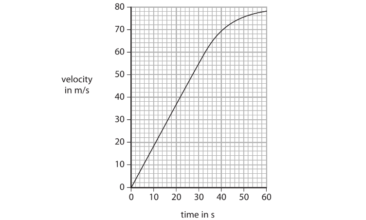

Use the graph to find the average acceleration of the aircraft.** **

acceleration = ............................................................. m/s2

### 11((b)) — 3 marks — command: explain — structured — from paper 2012 January ·  1P
Explain why the acceleration is not constant, even though the engines produce a constant force.

## Q10 — medium — 10 marks · exam-questions

### 8((a)) — 5 marks — command: calculate — structured — from paper 2013 January · 1P
The Apollo 15 mission landed on the Moon in 1971.

The astronaut David Scott dropped a hammer and a feather.

They were released from rest at the same time and from the same height.

The hammer and the feather landed at the same time.

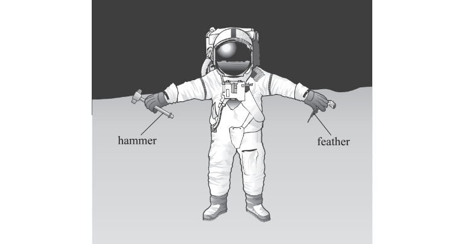

The graph shows how the velocity of the hammer changed with time.

(i) Use the graph to calculate the acceleration due to gravity on the Moon.

Give the unit.

Acceleration = .......... unit .................**[3]**

(ii) Use the graph to calculate the height the hammer was dropped from.

Height = .................................... m**[2]**

### 8((b)) — 1 mark — command: suggest — structured — from paper 2013 January · 1P
The gravitational field strength is smaller on the Moon than on the Earth.

Suggest why.

### 8((c)) — 4 marks — command: explain — structured — from paper 2013 January · 1P
If the same experiment is carried out on Earth, air resistance affects both objects.

The feather reaches the ground after the hammer, even though the force of air resistance is smaller on the feather than on the hammer.

Explain why the feather reaches the ground after the hammer.

## Q11 — hard — 10 marks · exam-questions

### 5((a)) — 2 marks — command: describe — structured — from paper June 2013 · 1PR
A student cycles to school.

The graph shows the stages A to G of the journey.

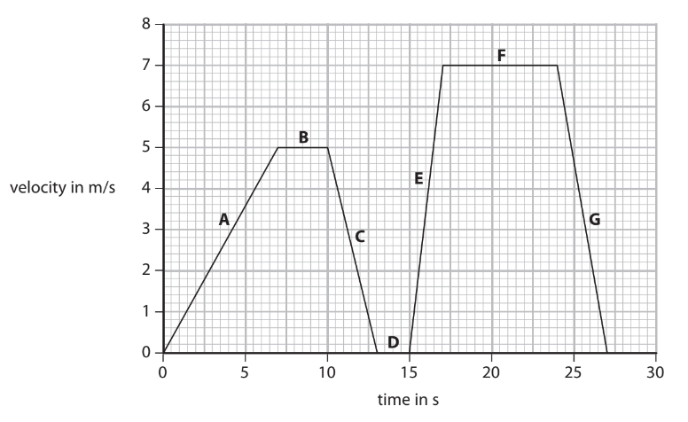

Describe the motion of the student during stages B and D.

| Stage | Description |
|---|---|
| B |   |
| D |   |

### 5((b)) — 1 mark — command: state — structured — from paper June 2013 · 1PR
State how the graph shows that the acceleration for stage E is greater than the acceleration for stage A.

### 5((c)) — 4 marks — command: calculate — structured — from paper June 2013 · 1PR
Calculate the distance that the student travels in the last 10 s of the journey.

### 5((d)) — 3 marks — command: show — structured — from paper June 2013 · 1PR
The total distance travelled is 106.5 m.

Show that the average speed of the journey is about 4 m/s.

## Q12 — hard — 7 marks · exam-questions

### 4((a)) — 3 marks — command: multiple — structured — from paper Jan 2015 · 1P
The diagram shows some people waiting in a queue at a supermarket.

The queue moves forward each time a person leaves the checkout.

Person X spends seven minutes in the queue before reaching the checkout.

The graph shows how distance changes with time for person X.

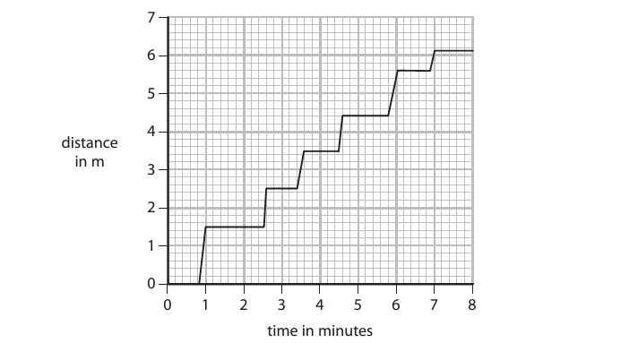

(i) Determine the initial length of the queue.

initial length = .......................................................... m**[1]**

(ii) Explain how you could use the graph to work out the number of times person X is stationary.

**[2]**

### 4((b)) — 4 marks — command: multiple — structured — from paper Jan 2015 · 1P
(i) State the equation linking average speed, distance moved and time taken.

**[1]**

(ii) Calculate the average speed of person X in the queue.

Give the unit.

average speed = ............................. unit .........................**[3]**

## Q13 — hard — 9 marks · exam-questions

### 4((c)) — 5 marks — command: multiple — structured — from paper 2015 January · 1P
The diagram shows an air track that can be used to investigate motion.

Air comes out through a series of small holes in the air track.

A small glider floats on a cushion of air.

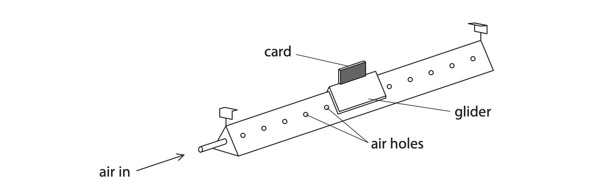

(i) The diagram below shows the glider at rest on the air track.

Complete the diagram to show the forces acting on the glider.

Label the forces. One force arrow has been drawn for you.

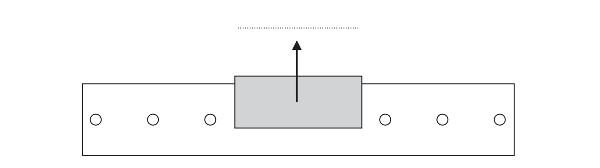

**[3]**

(ii) Explain what effect the cushion of air has on the movement of the glider.

**[2]**

### 4((b)) — 4 marks — command: multiple — structured — from paper 2016 January · 1P
Two light gates connected to a data logger are placed above the air track so that the card will pass through them.

The glider moves at a constant speed to the right.

The length of the card is 8.3 cm.

The card takes 314 ms to pass through the first light gate.

(i) State the relationship between average speed, distance moved and time taken.

**[1]**

(ii) Calculate the average speed of the card as it passes through the first light gate.

average speed = ............................................. cm/s**[2]**

(iii) State the time taken for the card to pass through the second light gate.

time taken = .............................................ms**[1]**

## Q14 — hard — 11 marks · exam-questions

### 4((a)) — 2 marks — command: what — structured — from paper 2016 January · 1P
A student investigates the speed of different toy cars as they roll down a slope.

A student makes this prediction.

'The more weight a toy car has the faster it will roll down the slope.'

(i) What is the independent variable in the student's prediction?

**[1]**

(ii) What is the dependent variable in the student's prediction?

**[1]**

### 4((b)) — 2 marks — command: state — structured — from paper 2016 January · 1P
State two factors that the students should keep constant in his investigation.

### 4((c)) — 2 marks — command: put — structured — from paper 2016 January · 1P
Put ticks (✓) in the boxes to show which pieces of apparatus the student needs for his investigation.

One has been done for you.

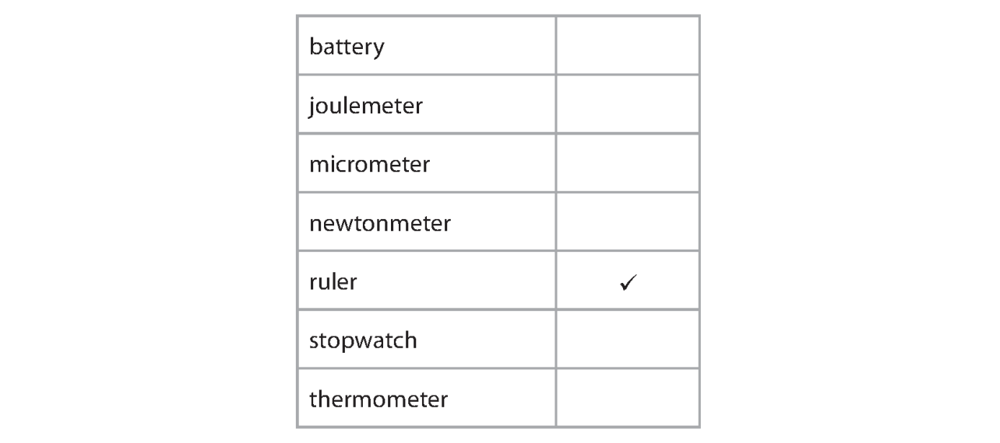

### 5((a)) — 5 marks — command: describe — structured — from paper 2014 January · 1P
Describe what the student should do to test his prediction that the more weight the toy car has, the faster it will roll down the slope.

## Q15 — hard — 5 marks · exam-questions

### 5() — 5 marks — command: describe — structured — from paper June 2013 · 1P
A racing cyclist practises by riding around a track.

A student wants to find the average speed of the cyclist.

Describe a method that the student could use to find the average speed.
