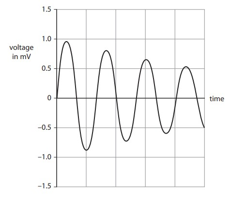
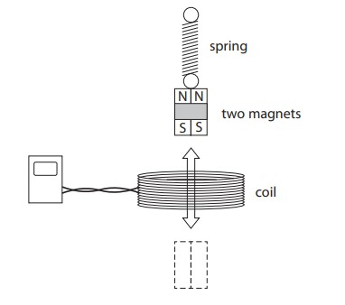

# Exam Questions — Electromagnetic Induction
**6. Magnetism & Electromagnetism** · Edexcel IGCSE Science (Double Award) (4SD0) — 17/Physics
> Source: [https://www.savemyexams.com/igcse/science/edexcel/double-award/17/physics/topic-questions/magnetism-and-electromagnetism/electromagnetic-induction/exam-questions/](https://www.savemyexams.com/igcse/science/edexcel/double-award/17/physics/topic-questions/magnetism-and-electromagnetism/electromagnetic-induction/exam-questions/) · 5 questions · total 29 marks

## Q1 — medium — 5 marks · exam-questions

### 7((b)) — 3 marks — command: multiple — structured — from paper January 2013 · 2P
A laptop battery charger contains a step-down transformer.

This transformer is designed to reduce the voltage from 230 V to 12 V.

The primary current is 0.25 A.

(i) State the equation linking primary voltage, primary current, secondary voltage and secondary current for a transformer.

**[1]**

(ii) Calculate the secondary current, assuming that the transformer is 100% efficient.

secondary current = ............................................... A **[2]**

### 7((c)) — 2 marks — command: suggest — structured — from paper January 2013 · 2P
A student notices that the charger becomes warm when it is working.

Suggest how this will affect the output of the transformer.

## Q2 — medium — 4 marks · exam-questions

### 3((b)) — 4 marks — command: explain — structured — from paper Jun 2014 · 1PR
The diagram shows an electric motor and the direction of current.

Explain how the current produces movement of the coil.

## Q3 — hard — 5 marks · exam-questions

### 11((a)) — 3 marks — command: multiple — structured — from paper June 2012 · 1P
Photograph **E **shows a rechargeable torch.

When a student shakes the torch, the magnet moves through the coil and back again.

This induces a voltage across the ends of the coil.

The voltage is used to provide current to recharge the battery.

(i) Explain why a voltage is induced.

**[2]**

(ii) State **one **way to increase this voltage.

**[1]**

### 11((b)) — 2 marks — command: explain — structured — from paper June 2012 · 1P
Photograph **F **shows the components inside the torch.

The torch uses a light-emitting diode (LED) to provide light.

The manufacturer of the torch states that

"An LED is a more efficient source of light than a filament lamp."

Explain this statement in terms of energy transfer.

## Q4 — hard — 8 marks · exam-questions

### 14((a)) — 5 marks — command: multiple — structured — from paper January 2015 · 1P
A student investigates how to produce a voltage. He hangs a magnet from a spring, above a coil that is connected to a data logger.

The student pulls the magnet through the coil to X and then releases it.

The magnet moves up and down through the coil.

The data logger produces this graph of voltage against time.

(i) Explain why the data logger records a varying voltage.

**[2]**

(ii) Which feature of the graph shows that the voltage is alternating?

**[1]**

(iii) Suggest why the voltage changes as shown by the graph.

**[2]**

### 14((b)) — 3 marks — command: sketch — structured — from paper January 2015 · 1P
The student repeats the experiment using two magnets taped together.

Compared to one magnet, these two magnets take a longer time to move up and down.

The dotted line on the grid shows the original graph for one magnet.

On the same grid, sketch the graph that would be produced using two magnets.

## Q5 — hard — 7 marks · exam-questions

### 13((a)) — 4 marks — command: explain — structured — from paper June 2013  · 1PR
The diagram shows a magnet held above a coil. The coil is connected to a voltmeter.

The magnet is released and falls into the coil.

(i) Explain why the voltmeter shows a reading.

**[2]**

(ii) The magnet is released from a greater height. How does this affect the voltmeter? Explain your answer.

**[2]**

### 13((b)) — 3 marks — command: state — structured — from paper June 2013 · 1PR
State how the voltmeter reading changes when the same magnet

(i) moves more slowly into the coil.

**[1]**

(ii) moves into a coil with more turns.

**[1]**

(iii) is reversed so the S-pole enters the coil first.

**[1]**
