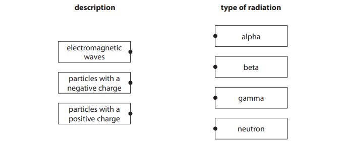
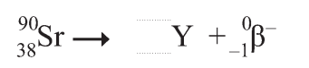
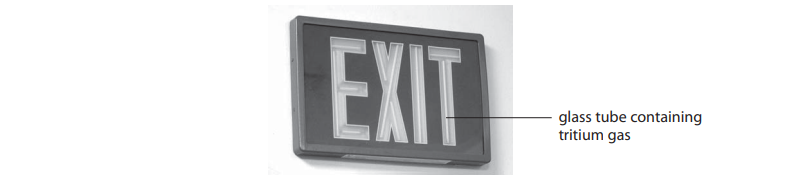
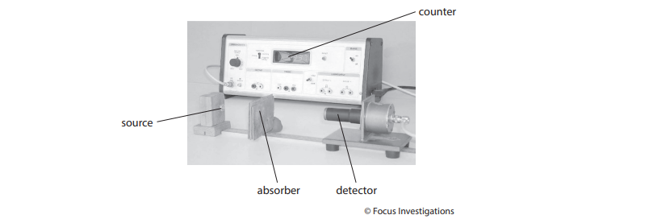
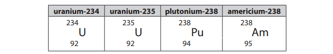
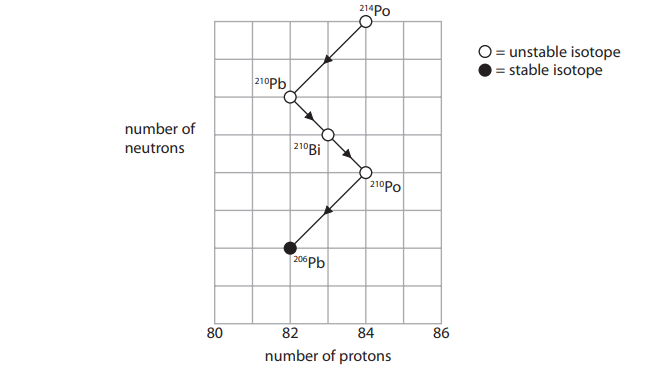
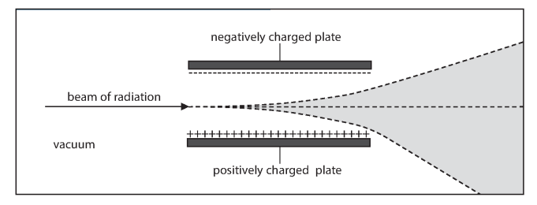

# Exam Questions — Properties of Radiation
**7. Radioactivity & Particles** · Edexcel IGCSE Science (Double Award) (4SD0) — 17/Physics
> Source: [https://www.savemyexams.com/igcse/science/edexcel/double-award/17/physics/topic-questions/radioactivity-and-particles/properties-of-radiation/exam-questions/](https://www.savemyexams.com/igcse/science/edexcel/double-award/17/physics/topic-questions/radioactivity-and-particles/properties-of-radiation/exam-questions/) · 27 questions · total 93 marks

## Q1 — easy — 1 marks · exam-questions

### 1((a)) — 1 mark — multiple_choice — from paper 2013 January · 1P
Carbon-14 is a radioactive isotope of carbon.

It has the symbol

The number of nucleons in a carbon-14 nucleus is
- **A.** 6
- **B.** 8
- **C.** 14
- **D.** 20

## Q2 — easy — 1 marks · exam-questions

### 1((b)) — 1 mark — multiple_choice — from paper 2013 January · 1P
When carbon-14 decays it emits a beta particle.

What is a beta particle?
- **A.** An electron
- **B.** A neutron
- **C.** A nucleus
- **D.** A proton

## Q3 — easy — 1 marks · exam-questions

### 1((b)) — 1 mark — multiple_choice — from paper 2013 June · 2PR
Which of these is the same as an electron?
- **A.** Alpha particle
- **B.** Beta particle
- **C.** Gamma ray
- **D.** X-ray

## Q4 — easy — 6 marks · exam-questions

### 4((a)) — 2 marks — command: what — structured — from paper 2014 June · 1P
Sodium-24 is a radioactive isotope.

What are isotopes?

### 4((b)) — 4 marks — command: multiple — structured — from paper 2014 June · 1P
Sodium-24 decays by emitting beta particles.

(i) Describe the nature of a beta particle.

**[1]**

(ii) Name a piece of equipment that can be used to detect beta particles.

**[1]**

(iii) Describe how a detector can be used with sheets of lead, aluminium and paper to show that a sample of sodium-24 emits beta particles.

**[2]**

## Q5 — easy — 4 marks · exam-questions

### 7((a)) — 3 marks — command: draw — structured — from paper 2016 January · 1P
Scientists use the term radiation in different ways.

Sometimes radiation means streams of particles and sometimes radiation means high frequency waves.

Draw a straight line from each description to the type of radiation it describes.

### 7((d)) — 1 mark — command: state — structured — from paper 2016 June · 1P
People who work with ionising radiation need to measure the amount of radiation they are exposed to. For many years, a film badge was used to detect the radiation.

State the name of another device that can be used to detect alpha radiation.

## Q6 — easy — 2 marks · exam-questions

### 12((b)) — 2 marks — command: what — structured — from paper 2014 January · 1P
The radioactive nuclei in a source emit beta radiation.

What effect does the emission of a beta particle have on a nucleus?

## Q7 — easy — 3 marks · exam-questions

### 1((a)) — 2 marks — command: complete — structured — from paper 2013 January · 2P
There are different types of ionising radiation.

| Type of ionising radiation | Charge | Emitted by |
|---|---|---|
| alpha particle |   | unstable nuclei |
| beta particle | - | unstable nuclei |
| gamma ray | 0 |   |

Complete the table to show the properties of each type.

### 1((c)) — 1 mark — command: complete — structured — from paper 2013 January · 2P
A radioactive source contains strontium-90.

A strontium-90 nucleus emits a beta particle.

Complete the equation to show how strontium-90 decays.

## Q8 — medium — 3 marks · exam-questions

### 8((a)) — 1 mark — multiple_choice — from paper 2012 June · 1P
Radon is a gas produced by some types of rocks.

Radon is a natural source of radioactivity.

What is the name for this radioactivity?
- **A.** Chain reaction
- **B.** Background radiation
- **C.** Radioactive dating
- **D.** Radiotherapy

### 8((c)) — 1 mark — multiple_choice — from paper 2012 June · 1P
Radon-222 and radon-220 are both isotopes of radon. A nucleus of radon-222 has 86 protons.

How many protons are there in a nucleus of radon-220?
- **A.** 86
- **B.** less than 86
- **C.** more than 86
- **D.** none

### 8((c)) — 1 mark — multiple_choice — from paper 2012 June · 1P
Radon-222 and radon-220 are both isotopes of radon. A nucleus of radon-222 has 136 neutrons.

How many neutrons are there in a nucleus of radon-220?
- **A.** 86
- **B.** 134
- **C.** 136
- **D.** 220

## Q9 — medium — 1 marks · exam-questions

### 1((a)) — 1 mark — multiple_choice — from paper 2013 January · 1P
Vanadium-50 is an isotope of vanadium.

It has the symbol `space presubscript 23 presuperscript 50 straight V`

The number of neutrons in a vanadium-50 nucleus is
- **A.** 23
- **B.** 27
- **C.** 33
- **D.** 50

## Q10 — medium — 4 marks · exam-questions

### 1((a)) — 1 mark — multiple_choice — from paper 2016 June · 2P
Which of these particles has the largest mass?
- **A.** Alpha particle
- **B.** Beta particle
- **C.** Neutron
- **D.** Proton

### 1((a)) — 1 mark — multiple_choice — from paper 2016 June · 2P
Which of these particles has the largest charge?
- **A.** Alpha particle
- **B.** Beta particle
- **C.** Neutron
- **D.** Proton

### 1((c)) — 1 mark — multiple_choice — from paper 2016 June · 2P
The maximum range of a beta particle in air is about
- **A.** 50 mm
- **B.** 50 cm
- **C.** 50 m
- **D.** 50 km

### 1((d)) — 1 mark — multiple_choice — from paper 2016 June · 2P
When a nucleus emits a beta particle
- **A.** The nucleon number decreases by 1
- **B.** The nucleon number increases by 1
- **C.** The proton number decreases by 1
- **D.** The proton number increases by 1

## Q11 — medium — 1 marks · exam-questions

### 1((a)) — 1 mark — multiple_choice — from paper 2013 June · 2P
When an unstable nucleus emits an alpha particle, its atomic (proton) number
- **A.** Increases by 1
- **B.** Stays the same
- **C.** Decreases by 2
- **D.** Decreases by 4

## Q12 — medium — 1 marks · exam-questions

### 1((b)) — 1 mark — multiple_choice — from paper 2013 June · 2PR
Which of these has a mass (nucleon) number of 4?
- **A.** Alpha particle
- **B.** Beta particle
- **C.** Gamma ray
- **D.** X-ray

## Q13 — medium — 1 marks · exam-questions

### 1((b)) — 1 mark — multiple_choice — from paper 2013 June · 2PR
Which of these is the most ionising?
- **A.** Alpha particle
- **B.** Beta particle
- **C.** Gamma ray
- **D.** X-ray

## Q14 — medium — 1 marks · exam-questions

### 1((a)) — 1 mark — multiple_choice — from paper 2013 June · 2P
When an unstable nucleus emits an alpha particle, its mass (nucleon) number
- **A.** Increases by 1
- **B.** Stays the same
- **C.** Decreases by 2
- **D.** Decreases by 4

## Q15 — medium — 2 marks · exam-questions

### 1((a)) — 1 mark — multiple_choice — from paper 2014 January · 2P
The atomic (proton) number for iodine-131 is
- **A.** 0
- **B.** 53
- **C.** 78
- **D.** 131

### 1((a)) — 1 mark — multiple_choice — from paper 2014 January · 2P
lodine-131 is a radioactive isotope that emits beta particles.

The equation for this decay is

The mass (nucleon) number for Xe is
- **A.** −1
- **B.** 0
- **C.** 53
- **D.** 131

## Q16 — medium — 1 marks · exam-questions

### 1((b)) — 1 mark — multiple_choice — from paper 2013 January · 2P
Which of these describes what happens to the strontium-90 nucleus when it emits a beta particle?
- **A.** The number of protons stays the same
- **B.** The number of protons increases
- **C.** The number of neutrons stays the same
- **D.** The number of neutrons increases

## Q17 — medium — 8 marks · exam-questions

### 9((a)) — 6 marks — command: multiple — structured — from paper 2016 June · 1PR
Tritium is an isotope of hydrogen that decays by emitting beta particles. It is used in some luminous signs.

The symbol for tritium is `H presubscript 1 presuperscript 3`.

(i) Determine the number of protons and the number of neutrons in a single atom of tritium.

**[2]**

(ii) Describe three differences between an alpha particle and a beta particle.

**[3]**

(iii) Suggest why tritium cannot emit alpha particles.

**[1]**

### 9((b)) — 2 marks — command: suggest — structured — from paper 2016 June · 1PR
Tritium is used in this luminous sign.

In this sign

- The letters are made up of glass tubes containing tritium gas
- The inside of each tube is coated with a phosphor
- The phosphor emits light when beta particles hit it

Suggest why this sign is safe to use even though beta particles are ionising and can be dangerous.

## Q18 — medium — 11 marks · exam-questions

### 12((a)) — 2 marks — command: put — structured — from paper 2015 June · 1PR
A teacher uses this apparatus to demonstrate radioactivity to his students.

The teacher needs to take some safety precautions.

Put one tick (✓) on each row to show whether the safety precaution is needed or not. Two have been done for you.

| safety precaution | needed | not needed |
|---|---|---|
| not touch the source with bare hands | **✓** |   |
| use tongs |   |   |
| wear gloves |   | **✓** |
| wear googles |   |   |
| students sit at least two metres away |   |   |
| wear a lead apron |   |   |
| store source in a lead box |   |   |

### 12((b)) — 3 marks — command: multiple — structured — from paper 2015 June · 1PR
The teacher uses this method to investigate radioactivity.

- Place the detector 10 cm from the radioactive source
- Record the count with different absorbent materials between the source and the detector
- Repeat the investigation using a different radioactive source
- Also repeat the investigation without a source

The table shows his results.

| Source used | Counts in 30 s for each material |   |   |   |   |   |
|---|---|---|---|---|---|---|
|   | **5 mm of aluminium** | **5 mm of lead** | **0.2 mm of paper** | **5 mm of plastic** | **5 mm of stone** | **5 mm of wood** |
| barium-133 | 3 843 | 1 989 | not taken | 4 551 | 10 408 | 4 557 |
| strontium-90 | 14 | 15 | 42 770 | 182 | 13 | 331 |
| none | 15 | 15 | 14 | 15 | 14 | 15 |

(i) State why the teacher keeps the distance constant between the source and the detector.

**[1]**

(ii) Explain why there is a reading when no source is used.

**[2]**

### 12((b)) — 6 marks — command: multiple — structured — from paper 2015 June · 1PR
(i) Explain which of the materials the teacher used is the best absorber of radiation.

**[3]**

(ii) A student makes this conclusion.

'Stone is the worst absorber of radiation.'

Evaluate this conclusion

**[3]**

## Q19 — medium — 14 marks · exam-questions

### 6((b)) — 3 marks — command: which — structured — from paper 2014 June · 1PR
The table describes the nuclei of four atoms.

| uranium-234 | uranium-235 | plutonium-238 | americium-238 |
|---|---|---|---|
| `straight U presubscript 92 presuperscript 234` | `straight U presubscript 92 presuperscript 235` | `Pu presubscript 94 presuperscript 238` | `Am presubscript 95 presuperscript 238` |

(i) Which two nuclei have the same number of protons?

**[1]**

(ii) Which two nuclei have the same number of nucleons?

**[1]**

(iii) Which two nuclei have the same number of neutrons?

**[1]**

### 6((c)) — 3 marks — command: explain — structured — from paper 2014 June · 1PR
All of the nuclei are unstable and have a different half-life.

(i) Explain what is meant by the term unstable.

**[1]**

(ii) Explain what is meant by the term half-life

**[2]**

### 6((d)) — 5 marks — command: multiple — structured — from paper 2014 June · 1PR
When plutonium decays, it emits an alpha particle and a gamma ray.

(i) Complete the decay equation for plutonium-238.

`Pu presubscript 94 presuperscript 238 space rightwards arrow space straight alpha presubscript square presuperscript 4 space plus space straight X presubscript square presuperscript square space plus space straight gamma presubscript 0 presuperscript square`

**[4]**

(ii) Use information from the table in part (a) to identify element X.

**[1]**

### 6((e)) — 3 marks — command: multiple — structured — from paper 2014 June · 1PR
The nucleus of americium-238 can absorb an electron. When this happens, one of the protons in the nucleus becomes a neutron.

This equation describes the process.

`straight p presubscript 1 presuperscript 1 space plus space straight e presubscript negative 1 end presubscript presuperscript 0 space rightwards arrow straight n presubscript 0 presuperscript 1`

(i) Describe how this process affects the proton number and the nucleon number of the nucleus that absorbs the electron.

**[2]**

(ii) Identify the new nucleus formed by this process.

**[1]**

## Q20 — medium — 5 marks · exam-questions

### 8() — 5 marks — command: explain — structured — from paper 2012 June · 2P
The table shows the nature of alpha and beta particles.

Explain why alpha particles and beta particles have different penetrating powers.

## Q21 — hard — 1 marks · exam-questions

### 11((a)) — 1 mark — multiple_choice — from paper 2015 June · 1P
A doctor uses gamma radiation to produce an image of a person's brain.

A radioactive isotope called technetium-99m is used in this process.

Technetium-99m emits gamma rays and has a short half-life.

Gamma radiation consists of
- **A.** Electromagnetic waves
- **B.** Negatively charged particles
- **C.** Positively charged particles
- **D.** Unstable atoms

## Q22 — hard — 1 marks · exam-questions

### 6((a)) — 1 mark — multiple_choice — from paper 2014 June · 1PR
The table describes the nuclei of four atoms.

Atoms contain electrons.

Which nucleus needs the largest number of electrons to form a neutral atom?
- **A.** Uranium-234
- **B.** Uranium-235
- **C.** Plutonium-238
- **D.** Americium-238

## Q23 — hard — 1 marks · exam-questions

### 1((a)) — 1 mark — multiple_choice — from paper 2013 January · 1P
Tellurium-120 is an isotope of tellurium.

It has the symbol `Te presubscript 52 presuperscript 120`

The number of protons, neutrons and electrons in a neutral tellurium-120 atom is
- **A.** p = 120n = 52e = 120
- **B.** p = 120n = 68e = 68
- **C.** p = 52n = 120e = 120
- **D.** p = 52n = 68e = 52

## Q24 — hard — 1 marks · exam-questions

### 1((b)) — 1 mark — multiple_choice — from paper 2016 June · 2P
Compared to a beta particle, an alpha particle
- **A.** Causes less ionisation
- **B.** Has less charge
- **C.** Has less mass
- **D.** Has less penetrating power

## Q25 — hard — 9 marks · exam-questions

### 14((a)) — 3 marks — command: multiple — structured — from paper 2013 June · 1PR
The grid shows the number of neutrons and the number of protons in some isotopes formed during successive radioactive decays.

(i) What are isotopes?

**[2]**

ii) Why are some isotopes described as stable?

**[1]**

### 14((b)) — 4 marks — command: multiple — structured — from paper 2013 June · 1PR
(i) Use the grid in part (a) to calculate the number of neutrons in a `Po presubscript blank presuperscript 210` nucleus.

**[1]**

(ii) Describe what happens to the number of protons and the number of neutrons when a nucleus of `Pb presubscript blank presuperscript 210` decays to form `Bi presubscript blank presuperscript 210`.

**[2]**

(iii)  State the type of decay that occurs when `Pb presubscript blank presuperscript 210` decays to form `Bi presubscript blank presuperscript 210`.

**[1]**

### 14((c)) — 2 marks — command: explain — structured — from paper 2013 June · 1PR
Explain why the mass (nucleon) number and the atomic (proton) number do not change when a gamma ray is emitted from a nucleus.

## Q26 — hard — 5 marks · exam-questions

### 2((a)) — 2 marks — command: complete — structured — from paper 2015 January · 1P
Alpha particles, beta particles and gamma rays have different properties.

Complete the table by ticking the correct type of radiation for each property. The first one has been done for you.

| Property | Type of radiation |   |   |
|---|---|---|---|
|   | **alpha particles** | **beta particles** | **gamma rays** |
| most ionising | **✓** |   |   |
| largest mass |   |   |   |
| most penetrating |   |   |   |
| highest speed |   |   |   |
| negatively charged |   |   |   |

### 2((b)) — 3 marks — command: multiple — structured — from paper 2015 January · 1P
The symbol for the structure of an alpha particle is

`straight alpha presubscript 2 presuperscript 4`

(i) State the number of neutrons and the number of protons in an alpha particle.

**[2]**

(ii) Suggest why alpha radiation is more ionising than beta or gamma radiation.

**[1]**

## Q27 — hard — 4 marks · exam-questions

### 2((a)) — 4 marks — command: put — structured — from paper 2015 June · 1PR
Scientists use deflection in an electric field to help distinguish between different types of radiation.

The diagram shows a beam containing several types of radiation. This beam travels in a vacuum between two charged plates.

Some of the radiation is deflected upwards, some is deflected downwards, and some are not deflected at all.

Put one tick in each row to show the correct deflection for each type of radiation.

One has been done for you.

| Type of radiation | Deflected upwards | Deflected downwards | Not deflected |
|---|---|---|---|
| alpha | **✓** |   |   |
| beta |   |   |   |
| gamma |   |   |   |
| neutrons |   |   |   |
| protons |   |   |   |
