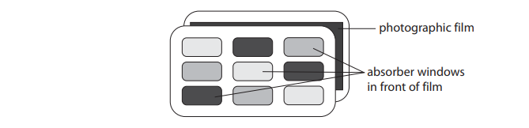
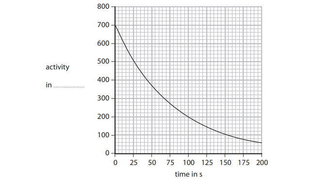
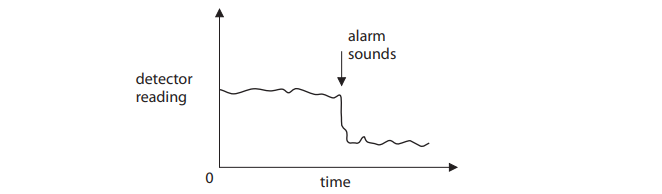
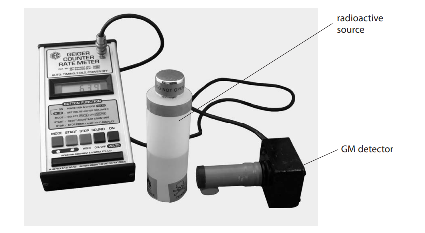
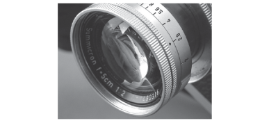
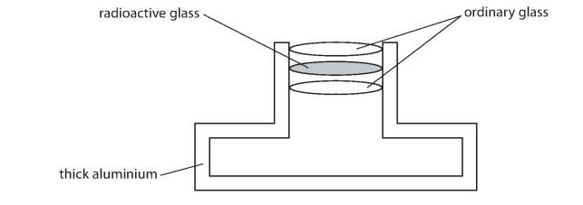
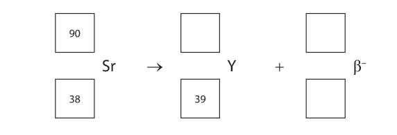
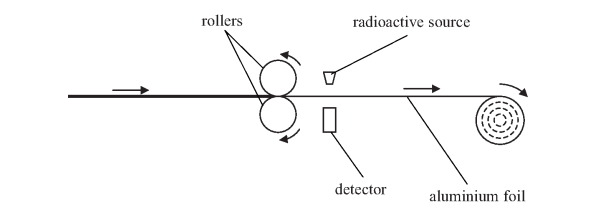
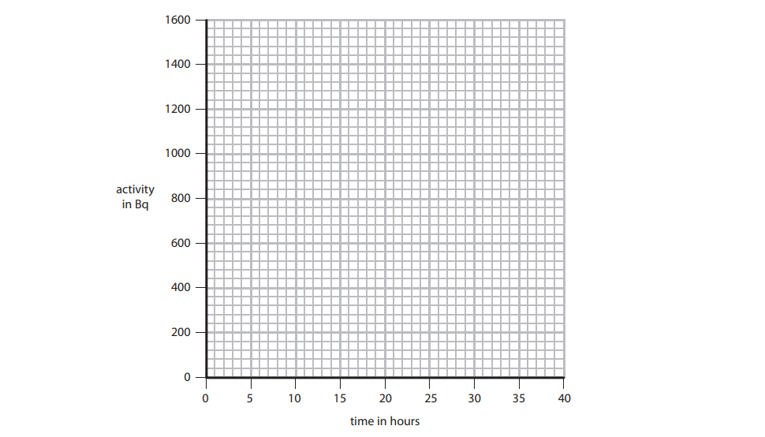

# Exam Questions — Radioactivity, Uses & Dangers
**7. Radioactivity & Particles** · Edexcel IGCSE Science (Double Award) (4SD0) — 17/Physics
> Source: [https://www.savemyexams.com/igcse/science/edexcel/double-award/17/physics/topic-questions/radioactivity-and-particles/radioactivity-uses-and-dangers/exam-questions/](https://www.savemyexams.com/igcse/science/edexcel/double-award/17/physics/topic-questions/radioactivity-and-particles/radioactivity-uses-and-dangers/exam-questions/) · 18 questions · total 121 marks

## Q1 — easy — 1 marks · exam-questions

### 1((a)) — 1 mark — multiple_choice — from paper 2013 June · 2PR
Which of these is measured in becquerel (Bq)?
- **A.** Activity
- **B.** Frequency
- **C.** Half-life
- **D.** Radiation

## Q2 — easy — 6 marks · exam-questions

### 7((b)) — 3 marks — command: multiple — structured — from paper 2016 January · 1P
Alpha, beta and gamma radiations are described as ionising.

(i) Complete the table to show alpha, beta and gamma radiations in order of increasing ionisation.

| least ionising $------------------------\rightarrow$most ionising |   |   |
|---|---|---|
|   |   |   |

**[1]**

(ii) Describe two ways in which these ionising radiations can cause harm.

**[2]**

### 7((c)) — 3 marks — command: complete — structured — from paper 2016 January · 1P
People who work with ionising radiations need to measure the amount of radiation they are exposed to. For many years, a film badge was used to detect the radiation.

The diagram shows how a film badge is constructed.

Complete the table to show if alpha, beta and gamma radiations penetrate each material. Some have been done for you.

Use the words ‘goes through’ or ‘stopped’.

|   | 0.1 cm paper | 0.5 cm aluminium | 0.5 cm lead |
|---|---|---|---|
| alpha radiation |   |   | stopped |
| beta radiation |   | stopped |   |
| gamma radiation | goes through |   |   |

## Q3 — easy — 9 marks · exam-questions

### 1() — 2 marks — command: state — structured
Radioactivity is used in PET scanners in hospitals.

PET scanners are used to diagnose cancer.

State **two** precautions that hospital staff might take when working with radioactivity.

### 2() — 2 marks — command: state — structured
State **two** other uses of radioactivity, apart from treatment or diagnosis of cancer.

### 3() — 3 marks — command: complete — structured
The diagram shows a machine which makes aluminium foil.

The machine uses a radioactive source to measure the thickness of the foil.

The radioactive source emits beta particles. The output from the detector indicates the thickness of the foil.

Complete the following sentences by highlighting the correct answer.

If the aluminium foil gets too thin, the count rate at the detector** increases / decreases**.

This sends a signal to a computer to push the rollers **closer together / further apart**.

Beta particles are used because they **can / cannot **pass through aluminium.

### 4() — 2 marks — command: give — structured
Give **two** reasons why gamma is the most suitable type of radiation for sterilising medical equipment.

## Q4 — easy — 9 marks · exam-questions

### 1() — 1 mark — command: state — structured
State the definition of half-life.

### 2() — 3 marks — command: multiple — structured
The half-life of cobalt-60 is 5 years.

The count rate of a sample of cobalt-60 is 100 counts per minute.

(i) How many half-lives are there in 10 years?

**[1]**

(ii) Calculate the count rate of the cobalt-60 sample after 10 years.

**[2]**

### 3() — 5 marks — command: explain — structured
A radioactive isotope can be used as a tracer in a patient’s body. It is monitored by a radiation detector outside the body.

Four possible radioactive isotopes are shown in the table

| **Radioactive isotope** | **Type of radiation emitted** | **Half-life** |
|---|---|---|
| Radon‐222 | Alpha | 3.8 days |
| Iodine‐131 | Gamma | 8 days |
| Cobalt‐60 | Gamma | 5 years |
| Americium-241 | Alpha | 470 years |

(i) Doctors wear a lead apron when they use radioactive isotopes.

Explain why.

**[2]**

(ii) Which radioactive isotope from the table is best to use as a medical tracer?

Tick **(✓) one** box.

| **Radon-222** | `begin mathsize 20px style square end style` |
|---|---|
| **Iodine-131** | `square` |
| **Cobalt-60** | `square` |
| **Americium-241** | `square` |

Explain your answer.

**[3]**

## Q5 — easy — 5 marks · exam-questions

### 1() — 1 mark — multiple_choice
Radioactive materials are usually stored in containers lined with metal. This is done to reduce the amount of radiation being emitted, and to protect people nearby.

Which of the following metals can be used for this purpose?
- **A.** Aluminium
- **B.** Lead
- **C.** Copper
- **D.** Steel

### 2() — 1 mark — multiple_choice
The risk caused by working with radioactive sources can be minimised by various methods.

Which of the following methods would **not** minimise this risk?
- **A.** Store the sources in lead-lined boxes
- **B.** Minimise the amount of time spent handling the sources
- **C.** Keep the source hot
- **D.** Keep the source as far away as possible, for example, using a pair of tongs

### 3() — 1 mark — command: state — structured
A student carried out an experiment to find the half-life of a radioactive substance.  Their results are shown in the table below.

| **time (s)** | **count-rate (counts / s)** |
|---|---|
| 0 | 300 |
| 20 | 200 |
| 40 | 150 |
| 60 | 100 |
| 80 | 75 |

State the half-life of the substance.

### 4() — 2 marks — command: define — structured
Define and state the unit for the activity of a radioactive sample.

## Q6 — medium — 7 marks · exam-questions

### 8((b)) — 2 marks — command: explain — structured — from paper 2012 June · 1P
There are two sources of alpha radiation in some houses:

- Radon gas in the air
- Solid americium in a smoke alarm

The alpha particles from radon are a greater risk to health then the alpha particles from americium.

Explain why.

### 8((d)) — 5 marks — command: multiple — structured — from paper 2012 June · 1P
The graph shows how the activity of a sample of radon-220 changes with time.

(i) Complete the graph by adding the missing unit for activity.

**[1]**

(ii) Explain what is meant by the term half-life.

**[2]**

(iii) Use the graph to find a value for the half-life of radon-220.

Half-life = .................................................... s**[2]**

## Q7 — medium — 4 marks · exam-questions

### 2((c)) — 2 marks — command: why — structured — from paper 2015 January · 1P
A smoke alarm contains a source of alpha particles and a detector.

The alpha particles reach the detector through a sample of air from the room.

The alarm sounds if there is a sudden drop in the detector reading.

This graph shows changes in the detector reading.

(i) Why is the detector reading never zero?

**[1]**

(ii) Why is the detector reading never constant?

**[1]**

### 2((c)) — 2 marks — command: suggest — structured — from paper 2015 January · 1P
Suggest why fewer alpha particles reach the detector if there is a fire.

## Q8 — medium — 13 marks · exam-questions

### 6((a)) — 4 marks — command: multiple — structured — from paper 2012 January · 1P
A teacher shows his class how to investigate the half-life of a radioactive source.

The readings from the counter need to be corrected for background radiation.

(i) State one source of background radiation.

**[1]**

(ii) Describe the method the teacher should use to correct for background radiation.

**[3]**

### 6((b)) — 6 marks — command: multiple — structured — from paper 2012 January · 1P
Every half a minute, the teacher records the count rate. He corrects for background radiation and produces this results table.

| Time  in minutes | Corrected count rate  in Bq |
|---|---|
| 0 | 49 |
| 0.5 | 30 |
| 1.0 | 24 |
| 1.5 | 18 |
| 2.0 | 15 |
| 2.5 | 11 |
| 3.0 | 10 |
| 3.5 | 9 |
| 4.0 | 5 |
| 4.5 | 6 |

(i) Draw a graph of corrected count rate against time for these results.

**[5]**

(ii) Use your graph to estimate the half-life for this material.

Half-life = .................................................. minutes**[1]**

### 6((c)) — 3 marks — command: explain — structured — from paper 2012 January · 1P
The isotope technetium-99 is a gamma emitter with a half-life of 6 hours. It is used as a radioactive tracer in medicine.

The technetium-99 is injected into a patient’s bloodstream and carried around the body by the blood. The radiation it emits is detected outside the body.

Explain why technetium-99 is suitable for use as a tracer in this way.

## Q9 — medium — 5 marks · exam-questions

### 7((a)) — 2 marks — command: complete — structured — from paper 2015 June · 2P
The photograph shows an old camera lens that contains several pieces of glass.

One of the pieces of glass includes a radioactive isotope, thorium-232.

Thorium-232 undergoes alpha decay and produces an isotope of radium, Ra.

Complete the equation for this decay.

`Th presubscript 90 presuperscript 232 space rightwards arrow space Ra presubscript square presuperscript square space plus space straight alpha presubscript square presuperscript 4`

### 7((b)) — 3 marks — command: suggest — structured — from paper 2015 June · 1P
The radioactive glass also emits beta particles from a different isotope.

The diagram shows the position of the radioactive glass in the camera.

Amateur astronomers sometimes remove an old camera lens to use as a lens in a homemade telescope.

(i) Suggest why it is safe to use radioactive glass in the camera as shown.

**[1]**

(ii) Suggest why an astronomer should not use a lens with radioactive glass close to their eye.

**[2]**

## Q10 — medium — 6 marks · exam-questions

### 6((a)) — 1 mark — command: explain — structured — from paper 2016 Jan · 2P
A teacher investigates the half-life of a radioactive isotope that decays quickly.

The teacher measures the background activity.

Explain how this value should be used in the investigation.

### 6((b)) — 2 marks — command: explain — structured — from paper 2016 January · 2P
Explain what is meant by the term half-life.

### 6((c)) — 3 marks — command: multiple — structured — from paper 2016 January · 2P
The graph shows how the activity of a sample of the radioactive isotope changes with time.

(i) Use the graph to find the half-life of the isotope.

[2]

Half-life = ................................... s

(ii) The teacher takes a new reading every 20 s.

Suggest why the teacher measures the activity so frequently.

[1]

## Q11 — medium — 9 marks · exam-questions

### 7((a)) — 5 marks — command: multiple — structured — from paper 2015 January · 2P
An unstable isotope of strontium has a half-life of 28.8 years.

It is a beta emitter and can be represented by this symbol.

`Sr presubscript 38 presuperscript 90`

(i) What is the mass number of this isotope?

**[1]**

(ii) Explain the meaning of the term half-life.

**[2]**

(iii) A person can absorb strontium atoms, which stay in their bones.

Explain why strontium-90 in the bones is a serious health hazard.

**[2]**

### 7((b)) — 4 marks — command: multiple — structured — from paper 2015 January · 2P
When a strontium-90 nucleus emits a beta particle, it decays to form yttrium-90.

(i) Complete the equation for this decay.

**[2]**

(ii) Yttrium-90 is also an unstable isotope.

Explain why strontium-90 and yttrium-90 can both be described as isotopes, even though they have different numbers of protons.

**[2]**

## Q12 — medium — 2 marks · exam-questions

### 1((b)) — 2 marks — command: explain — structured — from paper 2014 January · 2P
lodine-131 is used to treat thyroid cancer. This radioactive isotope is allowed to enter the tumour.

Explain why iodine-131 is suitable for this treatment.

## Q13 — medium — 3 marks · exam-questions

### 1((b)) — 3 marks — command: explain — structured — from paper 2013 January · 2P
The diagram shows a machine which makes aluminium foil.

The machine uses a radioactive source to measure the thickness of the foil.

The radioactive source emits beta particles. The output from the detector indicates the thickness of the foil.

Explain why beta particles are used, rather than alpha particles or gamma rays.

## Q14 — hard — 1 marks · exam-questions

### 1((c)) — 1 mark — multiple_choice — from paper 2013 January · 1P
Carbon-14 has a half-life of 5700 years. A sample of cloth contains 6.0 g of carbon-14.

What mass of carbon-14 will remain in the cloth after 11 400 years?
- **A.** 1.5 g
- **B.** 2.0 g
- **C.** 2.5 g
- **D.** 3.0 g

## Q15 — hard — 6 marks · exam-questions

### 9((c)) — 4 marks — command: multiple — structured — from paper 2016 June · 1PR
The graph shows how the activity of tritium in a luminous sign varies with time.

![Graph of activity in counts per minute against time in years for the tritium in a luminous sign. The vertical axis is labelled activity in counts per minute, scaled from 0 to 1200 in steps of 200 on a fine grid. The horizontal axis is labelled time in years, scaled from 0 to 40 in steps of 10. A smooth curve starts at 1200 counts per minute at 0 years and falls steeply at first and then more gradually, passing about 700 counts per minute at 10 years, about 420 at 20 years and about 260 at 30 years, and reaching about 150 counts per minute at 40 years.](assets/011-graph-of-activity-in-counts-per-minute-against-t.png)

(i) Explain what is meant by the term half-life.

[2]

(ii) Use the graph to estimate the half-life of tritium.

Show your working.

[2]

### 9((d)) — 2 marks — command: evaluate — structured — from paper 2016 June · 1PR
The manufacturer of the luminous sign claims that the sign will work for more than 20 years. The minimum activity required for the tubes to emit sufficient light is 400 counts per minute.

Evaluate the manufacturer’s claim.

## Q16 — hard — 9 marks · exam-questions

### 11((a)) — 2 marks — command: what — structured — from paper 2015 June · 1P
What is meant by the term half-life?

### 11((b)) — 2 marks — command: suggest — structured — from paper 2015 June · 1P
A doctor uses gamma radiation to produce an image of a person's brain.

A radioactive isotope called technetium-99m is used in this process. Technetium-99m emits gamma rays and has a short half-life.

The doctor injects a solution of technetium-99m into the patient. A detector outside the patient received gamma radiation to form the image.

Suggest why isotopes that emit alpha particles or beta particles are not suitable for this use.

### 11((c)) — 5 marks — command: multiple — structured — from paper 2015 June · 1P
Technitium-99m has a half-life of 6 hours. A sample of technitium-99 has an activity of 420 MBq.

(i) Explain why the activity of a radioactive sample reduces with time.

**[2]**

(ii) Calculate the activity of the technitium-99m sample after 24 hours.

Activity = ..............................................MBq **[3]**

## Q17 — hard — 9 marks · exam-questions

### 4((c)) — 3 marks — command: sketch — structured — from paper 2014 June · 1P
A sample of sodium-24 has an activity of 1400 Bq. The half-life of sodium-24 is 15 hours.

On the axes, sketch a graph to show how the activity of this sample changes over the next 40 hours.

### 4((d)) — 6 marks — command: multiple — structured — from paper 2014 June · 1P
Granite is a rock. It contains a radioactive isotope of uranium that decays very slowly.

(i) Explain how scientists can use this radioactivity to find the age of a piece of granite.

**[4]**

(ii) Suggest why the age of a piece of granite could not be found using a uranium isotope with a half-life of 15 hours.

**[2]**

## Q18 — hard — 17 marks · exam-questions

### 12((a)) — 5 marks — command: multiple — structured — from paper 2014 January · 1P
A scientist placed a radioactive source in front of a Geiger-Muller detector and measured the count rate every 20 minutes.

The table shows her data.

| Time  in minutes | Count rate  in counts per minute | Corrected count rate  in counts per minute |
|---|---|---|
| 0 | 660 | 630 |
| 20 | 462 | 432 |
| 40 | 330 | 300 |
| 60 | 240 | 210 |
| 80 | 180 | 150 |
| 100 | 142 | 112 |

The scientist corrects the count rate readings to allow for background radiation.

(i) State two sources of background radiation.

**[2]**

(ii) Describe how the scientist should measure the background radiation and correct the count rate readings.

**[3]**

### 12((a)) — 7 marks — command: multiple — structured — from paper 2014 January · 1P
(i) Plot a graph of the corrected count rate against time and draw the curve of best fit.

**[5]**

(ii) Use your graph to find the half-life of the radioactive source.

half-life = ...................................................... minutes**[2]**

### 12((b)) — 5 marks — command: multiple — structured — from paper 2014 January · 1P
The scientist needs to reduce the risks when working with radioactive sources.

(i) Explain why radioactive sources can be dangerous.

**[2]**

(ii) Describe how the risks of working with radioactive sources can be reduced.

**[3]**
