# Exam Questions — Ideal Gases
**5. Solids, Liquids & Gases** · Edexcel IGCSE Science (Double Award) (4SD0) — 17/Physics
> Source: [https://www.savemyexams.com/igcse/science/edexcel/double-award/17/physics/topic-questions/solids-liquids-and-gases/ideal-gases/exam-questions/](https://www.savemyexams.com/igcse/science/edexcel/double-award/17/physics/topic-questions/solids-liquids-and-gases/ideal-gases/exam-questions/) · 20 questions · total 159 marks

## Q1 — easy — 2 marks · exam-questions

### 1() — 1 mark — multiple_choice
This question is about temperature and pressure in gases.

A sealed boiling tube contains gas.

The boiling tube is heated.

As the temperature increases, the particles in the gas
- **A.** expand
- **B.** collide with the container walls with more force
- **C.** move closer together
- **D.** have a lower average speed

### 2() — 1 mark — multiple_choice
The boiling tube is then placed in an ice bath.

As the temperature decreases, the particles in the gas
- **A.** expand
- **B.** move slower
- **C.** evaporate
- **D.** move faster

## Q2 — easy — 9 marks · exam-questions

### 1() — 1 mark — multiple_choice
The diagram shows a syringe which contains air.

The piston is pushed in. The volume and pressure in the syringe change.

How do the volume and pressure of the air change when the piston is pushed in?
- **A.** Volume decreases and pressure decreases
- **B.** Volume increases and pressure decreases
- **C.** Volume decreases and pressure increases
- **D.** Volume increases and pressure increases

### 2() — 4 marks — command: complete — structured
The passage below is about kinetic theory.

Complete the sentences.

Molecules in a gas are in constant random motion at ............... speeds.

Random motion means that the molecules do not travel in a specific path and undergo sudden changes in their motion if they collide with the ............... of its container or with other ................. .

The random motion of tiny particles in a fluid is known as .................. motion.

### 3() — 4 marks — command: state — structured
(i) State what is meant by the term **absolute zero**.

**[2]**

(ii) State the value of absolute zero including a unit.

absolute zero = ...................... unit ...............**[2]**

## Q3 — easy — 9 marks · exam-questions

### 1() — 1 mark — multiple_choice
The diagram shows a bicycle pump with a moveable piston containing air.

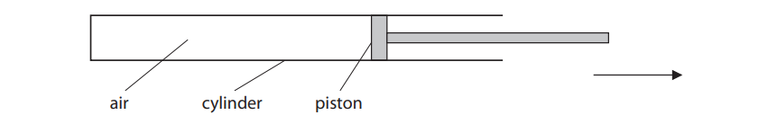

The arrow indicates the direction in which the piston is moved.

Which of the following increases as the piston is moved?
- **A.** the rate at which air particles collide with the walls of the cylinder
- **B.** the pressure of the air inside the cylinder
- **C.** the mass of the air inside the cylinder
- **D.** the volume of the air inside the cylinder

### 2() — 4 marks — command: multiple — structured
A bicycle tyre is inflated using a hand pump.

The air inside the tube exerts an outward force on the wall of the tube.

It takes 3.2 litres of air from the atmosphere to inflate the empty tube to a pressure of 360 000 Pa.

Atmospheric pressure is 100 000 Pa.

((i) State the angle that the outward force makes with the wall of the tube.

**[1]**

(ii) State the equation linking the initial pressure, initial volume, final pressure and final volume.

**[1]**

(iii) Calculate the final volume of air inside the tube once inflated. ** **

final volume = ................................... L**[2]**

### 3() — 4 marks — command: complete — structured
When a bicycle pump is used to inflate the tube, the air in the bicycle pump gets warm.

Complete the sentences by circling the correct words

When the air in the bicycle pump is compressed, the **volume / pressure **of the gas decreases and the **volume / pressure** increases.

This is because the particles are moving in less space and collide **more often / less often / the same amount**.

The **increased / decreased** pressure leads to an increase in temperature. This is because the temperature is a measure of the average **kinetic / potential / thermal** energy of particles.

When the air in the bicycle pump is compressed, this** increases / decreases** the energy in the **kinetic / potential / thermal** store of the air particles and contributes to the overall **kinetic / potential / thermal **energy stored in the system, this is why the bicycle pump gets warm.

## Q4 — easy — 5 marks · exam-questions

### 1() — 1 mark — multiple_choice
The particles of a gas exert a pressure on the walls of a container.

Which of the following rows correctly describes the relationship between pressure and the number of particle collisions with the walls of the container every second?

|   | **pressure** | **number of collisions with the walls of the container every second** |
|---|---|---|
| **A** | increases | stays the same |
| **B** | increases | increases |
| **C** | decreases | stays the same |
| **D** | decreases | increases |
- **A.** 
- **B.** 
- **C.** 
- **D.** 

### 2() — 1 mark — command: convert — structured
A digital thermometer gives a temperature reading of 19°C.

Convert this temperature to kelvin.

### 3() — 3 marks — command: multiple — structured
A small container contains helium gas at high pressure. It comes with a label stating the pressure and volume of the helium gas inside.

The helium gas from one small container is pumped into a large balloon which fills a final volume of 1100 cm3.

(i) State the equation linking the initial pressure, initial volume, final pressure and final volume of a gas.

**[1]**

(ii) Calculate the final pressure of the gas in the large balloon.

final pressure = .............................. MPa**[2]**

## Q5 — easy — 10 marks · exam-questions

### 1() — 2 marks — command: state — structured
State what is meant by an **ideal gas**.

### 2() — 5 marks — command: complete — structured
The molecules of an ideal gas move around rapidly in a container as shown in the diagram.

Complete the following sentences by circling the correct words

1. If the temperature of the gas increases, the kinetic energy of the molecules **increases** / **decreases**, hence, the average velocity of the molecules **increases** / **decreases**.
2. As a result, the frequency of the collisions **increases** / **decreases**.
3. This leads to a **larger** / **smaller** change in momentum in each collision.
4. Since force is **directly** / **inversely** proportional to the change in momentum, a greater change in momentum leads to an **increase** / **decrease** in the force exerted by the molecules **on** / **by** the walls of the container.
5. Since pressure is **directly** / **inversely** proportional to the force, this leads to an **increase** / **decrease** in the pressure of the gas.

### 3() — 3 marks — command: sketch — structured
On the axes below, sketch a graph of pressure against temperature for a constant volume of gas. Clearly mark the value of absolute zero on your graph.

## Q6 — medium — 4 marks · exam-questions

### 4((b)) — 1 mark — command: what — structured — from paper 2016 June · 2PR
A fission reactor is cooled with helium gas. The gas enters the reactor at 500°C.

What is this temperature in kelvin?

### 4((b)) — 3 marks — command: calculate — structured — from paper 2016 June · 2PR
Helium gas enters the reactor at a pressure of 8.40 MPa and leaves the reactor at a temperature of 1170 K.

Calculate the pressure of the helium gas as it leaves the reactor.

[Assume the volume of the gas does not change.]

## Q7 — medium — 6 marks · exam-questions

### 2((b)) — 2 marks — command: describe — structured — from paper Jun 2014 · 2PR
This question is about temperature and pressure in gases.

Describe what happens to the average kinetic energy of particles as the temperature decreases from 10 K towards 0 K.

### 2((c)) — 4 marks — command: multiple — structured — from paper Jun 2014 · 2PR
(i) Convert a temperature of 27 °C into kelvin (K).

temperature = ............................. K**[1]**

(ii) The gas in a cylinder has a pressure of 210 kPa at a temperature of 27°C.

Calculate the new pressure when the temperature of the gas rises to 81°C.

pressure = ............................ kPa**[3]**

## Q8 — medium — 12 marks · exam-questions

### 10((a)) — 9 marks — command: multiple — structured — from paper January 2016 · 1P
Aneroid barometers are used to measure air pressure.

A student makes a model aneroid barometer as shown.

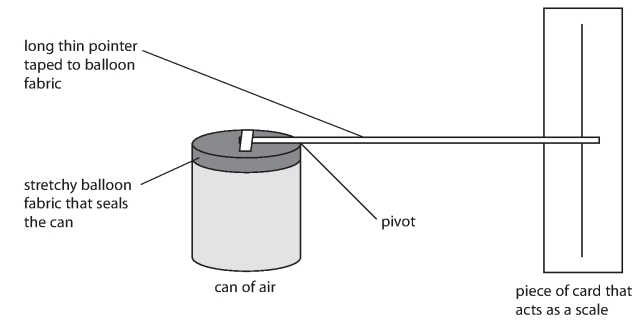

(i) The balloon fabric is attached to the can to stop the air escaping.

Explain how the air inside the can causes a pressure on the balloon fabric.

**[3]**

(ii) The balloon fabric is tight and flat.

The pointer is horizontal as shown.

Explain what happens to the different parts of the model when the atmospheric pressure increases. [You may assume that the temperature remains constant.]

**[4]**

(ii) Suggest two ways that the model could be altered to increase its sensitivity to changes in atmospheric pressure.

**[2]**

### 10((b)) — 3 marks — command: multiple — structured — from paper January 2016 · 1P
The student heats the air in her can by placing the can in a water bath.

(i) State how this affects the reading shown by the pointer.

**[1]**

(ii) Explain why this happens.

**[2]**

## Q9 — medium — 9 marks · exam-questions

### 10((a)) — 3 marks — command: explain — structured — from paper January 2013 · 1P
Compressed air from a can is used to clean computer keyboards.

Use ideas about particles to explain how a gas causes a pressure on the inside of a container.

### 10((b)) — 3 marks — command: multiple — structured — from paper January 2013 · 1P
The can has a warning sign on it.

| **WARNING**  Pressurised container  Do not expose to temperatures above 50°C |
|---|

(i) How would increasing the temperature of the compressed air affect the pressure in the can?

**[1]**

(ii) Explain your answer.

**[2]**

### 10((c)) — 3 marks — command: calculate — structured — from paper January 2013 · 1P
The can has a volume of 400 cm3 and the pressure of the compressed air inside is 5 times atmospheric pressure.

Calculate the volume that the air would occupy if it were all released to atmospheric pressure. ** **

volume = ..................................... cm3

## Q10 — medium — 7 marks · exam-questions

### 3((a)) — 2 marks — command: complete — structured — from paper June 2013 · 1PR
Temperature can be measured using different scales.

Complete the table by inserting the missing temperatures.

| **Temperature** | **Boiling point of**  **liquid nitrogen** | **Boiling point of water** |
|---|---|---|
| in °C |   | 100 |
| in Kelvin | 77 |   |

### 3((b)) — 5 marks — command: multiple — structured — from paper June 2013 · 1PR
Some students measure the volume of a sample of gas at different temperatures.

The table below shows their results.

| Temperature  in **°**C | Volume  in litres |
|---|---|
| -20 | 0.95 |
| 0 | 0.85 |
| 50 | 1.20 |
| 80 | 1.30 |
| 100 | 1.40 |

(i) Draw a graph to show how the volume of gas varies with temperature.

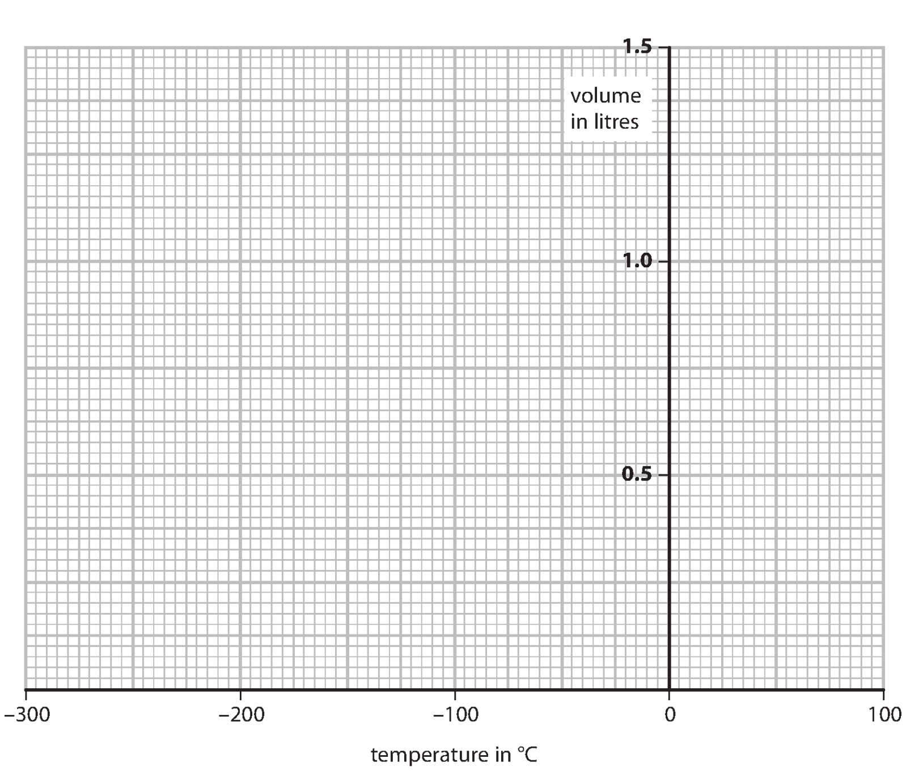

**[3]**

(ii) Circle the anomalous point on your graph.

**[1]**

(iii) Use your graph to find the temperature of the gas when its volume is zero.

Temperature = ..................................... °C**[1]**

## Q11 — medium — 9 marks · exam-questions

### 3((a)) — 2 marks — command: add — structured — from paper June 2016 · 1PR
The diagram shows some gas particles in a container.

The piston can be moved in or out to change the volume of the gas.

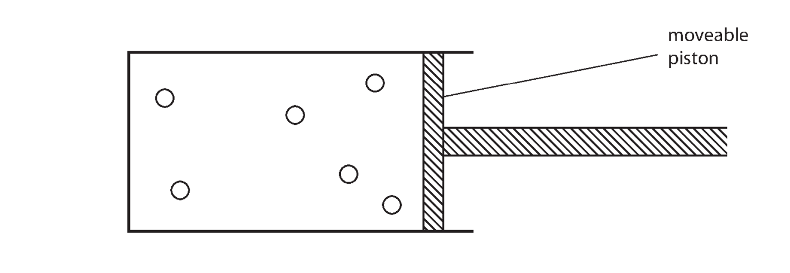

Add arrows to the diagram to show the random motion of the gas particles.

### 3((b)) — 3 marks — command: explain — structured — from paper June 2016 · 1PR
Explain how the motion of the gas particles produces a pressure inside the container.

### 3((c)) — 1 mark — command: state — structured — from paper June 2016 · 1PR
State what would happen to the pressure if you pushed the piston into the container without changing the temperature.

### 3((d)) — 3 marks — command: place — structured — from paper June 2016 · 1PR
When the gas in the container is heated, the piston moves outwards. Place ticks (✓) against the three correct statements.

| **Statement** | **Tick(✓)** |
|---|---|
| the gas particles get bigger |   |
| the mass of the gas particles stays the same |   |
| the gas particles move faster |   |
| the average distance between the gas particles increases |   |
| the temperature of the gas decreases |   |

## Q12 — medium — 11 marks · exam-questions

### 8((a)) — 1 mark — command: describe — structured — from paper June 2015 · 1P
A hot air balloon is filled with air through an opening.

The air is heated using a burner.

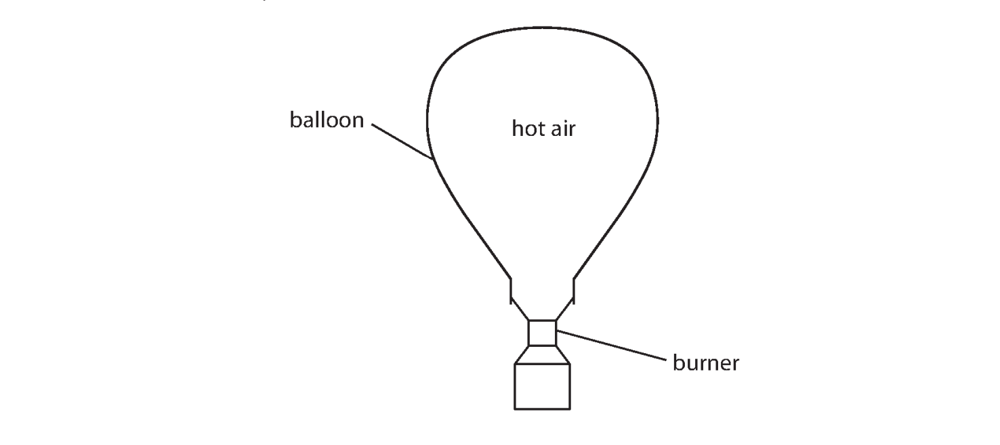

Describe the effect of an increase in temperature on the average speed of the air molecules.

### 8((b)) — 3 marks — command: explain — structured — from paper June 2015 · 1P
The hot air causes a pressure on the inside of the balloon.

Use ideas about molecules to explain how the hot air causes this pressure.

### 8((c)) — 1 mark — command: give — structured — from paper June 2015 · 1P
Give a reason why the hottest air rises to the top of the balloon.

### 8((d)) — 4 marks — command: multiple — structured — from paper June 2015 · 1P
The average density of the hot air in the balloon is 0.95 kg/m3. The volume of this air is 2800 m3.

(i) State the equation linking density, mass and volume.

**[1]**

(ii) Calculate the mass of hot air in the balloon.

Mass of hot air = .......................... kg**[3]**

### 8((e)) — 2 marks — command: suggest — structured — from paper June 2015 · 1P
As the balloon climbs higher, the air pressure outside it decreases.

(i) Suggest a reason for this change in the outside air pressure.

**[1]**

(ii) Suggest how the decrease in air pressure outside the balloon affects the hot air inside.

**[1]**

## Q13 — medium — 4 marks · exam-questions

### 8((b)) — 1 mark — command: state — structured — from paper June 2016 · 2P
All gases above absolute zero exert a pressure on the walls of their container.

State the value of absolute zero in °C.

### 8((a)) — 3 marks — command: explain — structured — from paper June 2015 · 1PR
All gases above absolute zero exert a pressure on the walls of their container.

Explain, in terms of its molecules, how a gas exerts a pressure on the walls of its container.

## Q14 — hard — 7 marks · exam-questions

### 6((a)) — 6 marks — command: multiple — structured — from paper June 2013 · 1PR
A spray-can contains gas particles that are constantly moving.

(i) How do the gas particles produce a pressure on the walls of the spray-can?

**[3]**

(ii) A student presses the button and some liquid leaves the can.

The student concludes

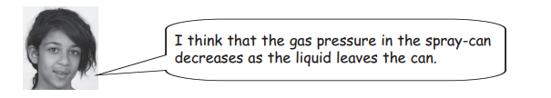

Evaluate this conclusion.

**[3]**

### 6((b)) — 1 mark — command: what — structured — from paper June 2013 · 1PR
What happens to the average speed of the gas particles when the spray-can is warmed by the sun on a hot day?

## Q15 — hard — 8 marks · exam-questions

### 14((a)) — 2 marks — command: calculate — structured — from paper June 2012 · 1P
The diagram shows a can that produces whipped cream using gas at high pressure.

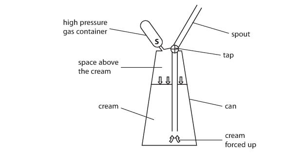

The volume of the high pressure gas container is 10 cm3.

The pressure of the gas is 10 000 kPa.

When the seal at S is broken, the gas is released into the space above the cream.

The gas expands to a total volume of 270 cm3.

Calculate the new pressure of the gas.

pressure = ..................................... kPa

### 14((b)) — 3 marks — command: explain — structured — from paper June 2012 · 1P
As the gas expands into the space above the cream, its temperature decreases. Using ideas about molecules, explain how this affects the pressure of the gas.

### 14((c)) — 3 marks — command: suggest — structured — from paper June 2012 · 1P
Some of the gas molecules dissolve into the cream.

(i) Suggest how this affects the pressure of the gas in the space above the cream.

**[2]**

(ii) When the tap is opened, the pressure of the gas forces the cream out of the spout.

The pressure outside the can is less than it is inside.

Suggest what happens to the dissolved gas as the cream leaves the can.

**[1]**

## Q16 — hard — 6 marks · exam-questions

### 7((b)) — 3 marks — command: explain — structured — from paper January 2015 · 1P
The photograph shows a car tyre that needs to be inflated.

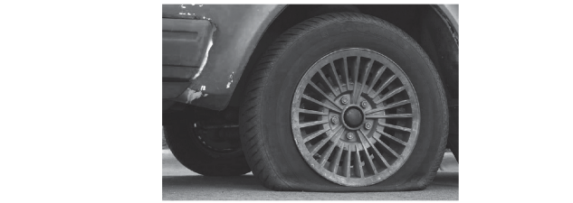

Author: Ildar Sagdejev

The tyre exerts a pressure on the road of 270 kPa.

Use ideas about molecules to explain why the air inside the tyre exerts pressure.

### 7((c)) — 3 marks — command: explain — structured — from paper January 2015 · 1P
Air is pumped into the tyre to inflate it.

This increases the temperature and the pressure of the air in the tyre.

Use ideas about molecules to explain why the air pressure in the tyre increases.

## Q17 — hard — 10 marks · exam-questions

### 13((a)) — 6 marks — command: multiple — structured — from paper January 2014 · 1P
A diver breathes air from a cylinder when he is under water.

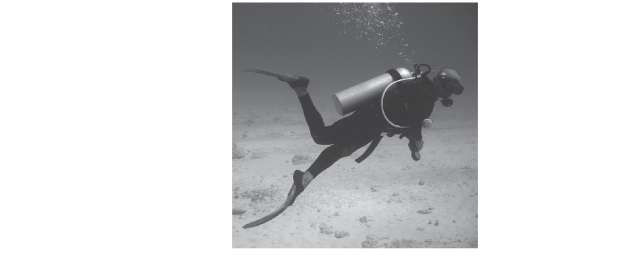

(i) The cylinder contains 8 litres of air at 200 times atmospheric pressure.

The air is released from the cylinder at normal atmospheric pressure.

The diver needs 16 litres of air per minute.

Calculate the maximum amount of time that the diver can breathe under water using this cylinder.

time = ..................................... minutes**[4]**

(ii) When the diver breathes out, bubbles are released.

Suggest why the bubbles expand as they rise to the surface.

**[2]**

### 13((b)) — 4 marks — command: multiple — structured — from paper January 2014 · 1P
A student wants to investigate how the volume of a balloon changes with pressure.

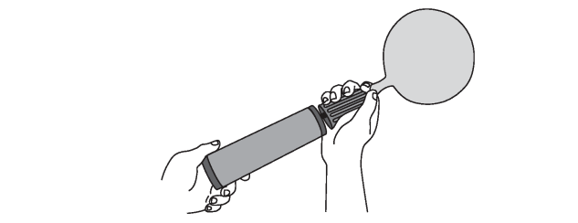

(i) Suggest how the student could measure the volume of an inflated balloon.

**[2]**

(ii) The student plans to measure the pressure of the air in the balloon.

| To measure the pressure in the balloon I will count how many times I push the pump. The same amount of air goes into the balloon with each push.  When there is twice as much air in the balloon the pressure will be twice as high, so the pressure will be proportional to the number of times I push the pump. |
|---|

Explain why the student’s plan will not work.

**[2]**

## Q18 — hard — 10 marks · exam-questions

### 7((a)) — 4 marks — command: explain — structured — from paper January 2012 · 2P
A student blows up two balloons to the same size.

She puts one balloon into a freezer.

After a while, the student compares the two balloons.

The balloon that has been cooled is smaller.

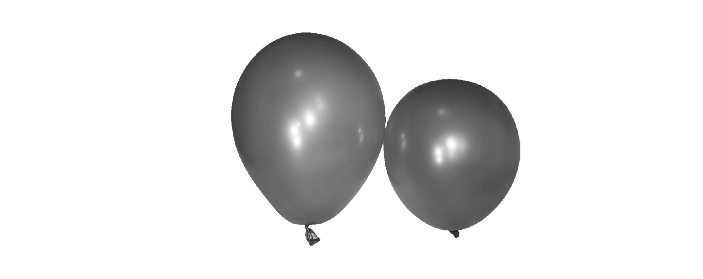

Use ideas about particles to explain why the cooled balloon is smaller.

### 7((b)) — 6 marks — command: suggest — structured — from paper January 2012 · 2P
The student decides to investigate the link between temperature and the size of the balloon.

She writes a plan.

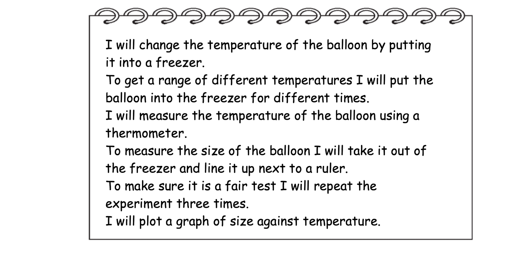

There are several faults in the student's plan.

Identify **three** of these faults and suggest an improvement to correct each one.

## Q19 — hard — 9 marks · exam-questions

### 4((a)) — 3 marks — command: calculate — structured — from paper June 2016 · 1P
A diver works in the sea on a day when the atmospheric pressure is 101 kPa and the density of the seawater is 1028 kg/m3.

The diver uses compressed air to breathe under water.

1700 litres of air from the atmosphere is compressed into a 12-litre gas cylinder.

The compressed air quickly cools to its original temperature.

Calculate the pressure of the air in the cylinder.

pressure = .......................... kPa

### 4((b)) — 4 marks — command: multiple — structured — from paper June 2016 · 1P
(i) State the equation linking pressure difference, depth, density  and *g*.

**[1]**

(ii) Calculate the increase in pressure when the diver descends from the surface to a depth of 11 m.

increase in pressure = .......................... kPa**[2]**

(iii) Calculate the total pressure on the diver at a depth of 11 m.

Assume that the atmospheric pressure remains at 101 kPa.

total pressure = .......................... kPa**[1]**

### 4((c)) — 2 marks — command: explain — structured — from paper June 2016 · 1P
As the diver breathes out, bubbles of gas are released and rise to the surface.

The bubbles increase in volume as they rise.

Explain this increase in volume.

## Q20 — hard — 12 marks · exam-questions

### 12((a)) — 3 marks — command: multiple — structured — from paper June 2016 · 1PR
A student uses this apparatus to investigate the pressure and volume inside a sealed gas syringe.

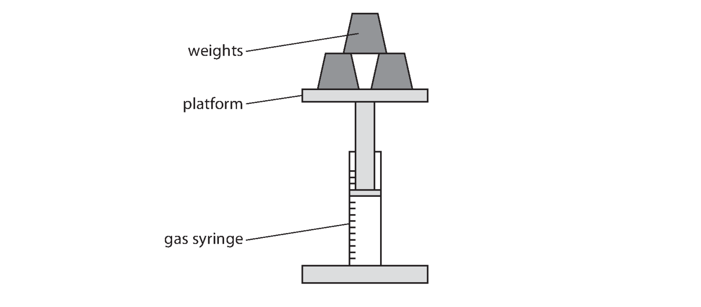

She takes readings of the volume as she increases the pressure (loading) and as she decreases the pressure (unloading).

These are her results.

| Pressure  in kPa | Volume of gas in cm**3** |   |   |
|---|---|---|---|
| **loading** | **unloading** | **average**  **(mean)** |   |
| 100 | 50 | 50 | 50 |
| 90 | 56 | 55 | 55.5 |
| 84 | 60 | 60 | 60 |
| 55 | 90 |   | 92 |
| 60 | 85 | 83 | 84 |
| 50 | 101 | 101 | 101 |

(i) Complete the table by filling in the missing value.

**[1]**

(ii) Suggest why the student takes readings for increasing the pressure and for decreasing the pressure.

**[2]**

### 12((b)) — 6 marks — command: multiple — structured — from paper June 2016 · 1PR
The student plots this graph.

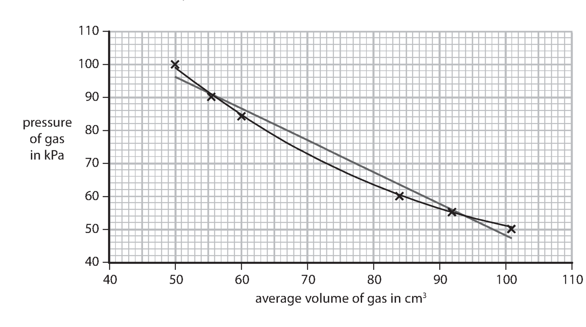

(i) Suggest a reason why the axes do not start from the origin (0,0).

**[1]**

(ii) The student has drawn both a straight line of best fit and a curve of best fit.

Discuss which line is correct for this investigation.

**[2]**

(iii) Suggest a way that the student could make this experiment valid (a fair test).

**[1]**

(iv)Suggest two ways in which the student could improve the quality of her data.

**[2]**

### 12((c)) — 3 marks — command: evaluate — structured — from paper June 2016 · 1PR
The student concludes that her data validates the relationship between pressure and volume of a fixed mass of gas.

Use data from this table to evaluate her conclusion.

| **Pressure **  **in kPa** | **Average volume**  **in cm****3** | **Space for calculations** |
|---|---|---|
| 100 | 50 |   |
| 90 | 55.5 |   |
| 84 | 60 |   |
| 55 | 92 |   |
| 60 | 84 |   |
| 50 | 101 |   |
