# Exam Questions — Waves & The Electromagnetic Spectrum
**3. Waves** · Edexcel IGCSE Science (Double Award) (4SD0) — 17/Physics
> Source: [https://www.savemyexams.com/igcse/science/edexcel/double-award/17/physics/topic-questions/waves/waves-and-the-electromagnetic-spectrum/exam-questions/](https://www.savemyexams.com/igcse/science/edexcel/double-award/17/physics/topic-questions/waves/waves-and-the-electromagnetic-spectrum/exam-questions/) · 38 questions · total 154 marks

## Q1 — easy — 1 marks · exam-questions

### 3() — 1 mark — multiple_choice — from paper June 2016 1P · 1P
Different types of waves are used in hospitals. Some of the waves used are electromagnetic.

Which of these properties is the same for all electromagnetic waves?
- **A.** Amplitude
- **B.** Frequency
- **C.** Speed in free space
- **D.** Wavelength in free space

## Q2 — easy — 1 marks · exam-questions

### 10() — 1 mark — multiple_choice — from paper January 2014 · 1P
Which of these statements is correct?
- **A.** Microwaves always travel faster than radio waves.
- **B.** Microwaves always travel slower than radio waves.
- **C.** Microwaves and radio waves travel at the same speed in a vacuum.
- **D.** Microwaves and radio waves travel at the same speed in all materials.

## Q3 — easy — 1 marks · exam-questions

### 1() — 1 mark — multiple_choice — from paper 2014 June · 1PR
The diagram shows part of a water wave.

Which letter represents the amplitude?
- **A.** 
- **B.** 
- **C.** 
- **D.** 

## Q4 — easy — 1 marks · exam-questions

### 1() — 1 mark — multiple_choice — from paper 2013 June · 1PR
The diagram shows a water wave.

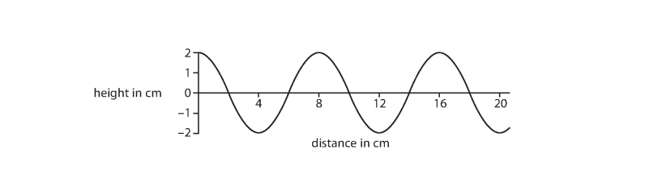

What is the amplitude of the wave?
- **A.** 1 cm
- **B.** 2 cm
- **C.** 4 cm
- **D.** 8 cm

## Q5 — easy — 1 marks · exam-questions

### 2() — 1 mark — multiple_choice — from paper 2013 June · 1PR
Some types of wave are used in hospitals.

A scanner uses one type of wave to check for broken bones. What type of wave is emitted by the scanner?
- **A.** infrared
- **B.** microwave
- **C.** ultrasound
- **D.** x-rays

## Q6 — easy — 3 marks · exam-questions

### 4() — 1 mark — multiple_choice — from paper 2015 June · 1PR
Which of the following electromagnetic waves has the shortest wavelength?
- **A.** infrared
- **B.** microwaves
- **C.** ultraviolet
- **D.** visible light

### 4() — 1 mark — multiple_choice — from paper 2015 June · 1PR
Which of these statements about electromagnetic waves is not correct?
- **A.** electromagnetic waves are longitudinal
- **B.** electromagnetic waves can transfer energy
- **C.** electromagnetic waves can travel between stars
- **D.** electromagnetic waves travel at the same speed in free space

### 4() — 1 mark — multiple_choice — from paper 2015 June · 1PR
Which of the following is a use for x-rays?
- **A.** broadcasting television
- **B.** cooking a potato
- **C.** looking at the internal structure of objects
- **D.** looking through night vision goggle

## Q7 — easy — 2 marks · exam-questions

### 1() — 1 mark — multiple_choice — from paper 2012 June · 1P
The Sun emits different types of electromagnetic waves.

Which of the following properties is the same for all the waves?
- **A.** amplitude
- **B.** frequency
- **C.** speed
- **D.** wavelength

### 1() — 1 mark — multiple_choice — from paper 2012 June · 1P
Which type of electromagnetic wave causes sunburn and snow blindness?
- **A.** gamma rays
- **B.** infrared
- **C.** radio waves
- **D.** ultraviolet

## Q8 — easy — 1 marks · exam-questions

### 1((b)) — 1 mark — multiple_choice — from paper 2015 June · 2P
All types of electromagnetic radiation from the Sun are emitted with
- **A.** the same amplitude
- **B.** the same frequency
- **C.** the same speed
- **D.** the same wavelength

## Q9 — easy — 1 marks · exam-questions

### 1((a)) — 1 mark — multiple_choice — from paper 2012 January · 2P
The diagram shows a wave on the sea.

Which letter shows the amplitude of the wave?
- **A.** 
- **B.** 
- **C.** 
- **D.** 

## Q10 — easy — 5 marks · exam-questions

### 2((b)) — 3 marks — command: draw — structured — from paper 2013 June · 1PR
Describe one difference between transverse and longitudinal waves.

Draw a labelled diagram to help your answer.

### 2((c)) — 2 marks — command: state — structured — from paper 2013 June · 1PR
State two properties that are the same for all electromagnetic waves.

## Q11 — easy — 7 marks · exam-questions

### 2((a)) — 1 mark — command: arrange — structured — from paper 2013 June · 1P
The Earth receives different types of electromagnetic waves from the Sun.

These include

- infrared
- ultraviolet
- visible light

Complete the table by arranging these three types of electromagnetic wave in order of decreasing wavelength.

| longest wavelength $---------------\rightarrow$shortest wavelength |   |   |
|---|---|---|
|   |   |   |

### 2((b)) — 2 marks — command: name — structured — from paper 2013 June · 1P
Name two other types of electromagnetic wave.

### 2((c)) — 4 marks — command: state — structured — from paper 2013 June · 1P
Ultraviolet waves are useful, but they can be dangerous.

(i) State two uses of ultraviolet waves.

**[2]**

(ii) State two dangers of ultraviolet waves.

**[2]**

## Q12 — easy — 7 marks · exam-questions

### 1((a)) — 2 marks — command: complete — structured — from paper 2012 June · 1P
The names of two parts of the electromagnetic spectrum are missing.

| radio waves | **A** | infrared | visible light | ultraviolet | **B** | gamma rays |
|---|---|---|---|---|---|---|

Complete the table with the names of the missing parts.

|   | **Name** |
|---|---|
| **A** |   |
| **B** |   |

### 1((a)) — 2 marks — command: state — structured — from paper 2016 January · 1P
The Sun emits visible light, infrared and ultraviolet that travel through space and reach the surface of the Earth.

State two similarities between visible light, infrared and ultraviolet.

### 1((b)) — 2 marks — command: state — structured — from paper 2016 January · 1P
Too much exposure to infrared and ultraviolet can cause damage to the human body.

State the damage that each can cause.

### 1((c)) — 1 mark — command: which — structured — from paper 2016 January · 1P
Seven colours can be seen in the visible light spectrum.

Which colour has the longest wavelength?

## Q13 — easy — 2 marks · exam-questions

### 1((b)) — 2 marks — command: calculate — structured — from paper 2012 January · 2P
A man watches some waves pass his boat.

He sees the crest of the waves pass him every 5 s.

Calculate the frequency of these waves.

frequency = ............................ Hz

## Q14 — medium — 1 marks · exam-questions

### 10() — 1 mark — multiple_choice — from paper January 2014 · 1P
Microwaves are part of the electromagnetic spectrum.

Which part of the electromagnetic spectrum has longer wavelengths than microwaves?
- **A.** gamma rays
- **B.** radio waves
- **C.** ultraviolet light
- **D.** visible light

## Q15 — medium — 1 marks · exam-questions

### 1() — 1 mark — multiple_choice — from paper June 2014 · 1PR
The diagram shows part of a water wave.

Which letter represents the wavelength?
- **A.** 
- **B.** 
- **C.** 
- **D.** 

## Q16 — medium — 1 marks · exam-questions

### 1() — 1 mark — multiple_choice — from paper 2013 June · 1PR
The diagram shows a water wave.

What is the wavelength of the wave?
- **A.** 2 cm
- **B.** 4 cm
- **C.** 8 cm
- **D.** 20 cm

## Q17 — medium — 1 marks · exam-questions

### 1((b)) — 1 mark — multiple_choice — from paper 2014 June · 1P
The table shows the main sections of the electromagnetic spectrum.

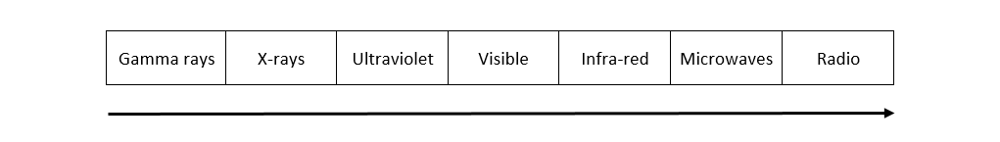

The arrow below the table shows the direction of
- **A.** increasing wave amplitude
- **B.** increasing wave frequency
- **C.** increasing wave speed
- **D.** increasing wavelength

## Q18 — medium — 1 marks · exam-questions

### 3() — 1 mark — multiple_choice — from paper 2016 June · 2PR
Which of these electromagnetic radiations has a frequency greater than ultraviolet?
- **A.** infrared
- **B.** gamma rays
- **C.** radio waves
- **D.** visible light

## Q19 — medium — 1 marks · exam-questions

### 1((a)) — 1 mark — multiple_choice — from paper 2012 January · 2P
The diagram shows a wave on the sea.

Which letter shows the wavelength of the wave?
- **A.** 
- **B.** 
- **C.** 
- **D.** 

## Q20 — medium — 7 marks · exam-questions

### 1((a)) — 2 marks — command: state — structured — from paper 2014 June · 1PR
Water waves are transverse waves. Other waves can be longitudinal.

State a similarity and a difference between a transverse wave and a longitudinal wave.

### 1((b)) — 5 marks — command: write — structured — from paper 2014 June 1PR1 · 1PR
A student writes some sentences about electromagnetic waves. Their teacher underlines a mistake in each sentence.

In the table, write a suitable correction for each mistake.

The first one has been done for you.

| **Sentence** | **Correction** |
|---|---|
| Electromagnetic waves travel at <u>3 × 10</u><u>−2</u> m/s in a vacuum. | 3 × 108 |
| <u>Sound</u> waves are electromagnetic. |   |
| <u>Infra-red</u> waves are the most harmful to people. |   |
| <u>Gamma</u> waves are used for heating up food. |   |
| <u>Radio waves</u> have the highest frequency. |   |
| <u>Gamma</u> waves have the longest wavelength. |   |

## Q21 — medium — 5 marks · exam-questions

### 4() — 2 marks — command: describe — structured — from paper 2015 June · 1PR
Gamma radiation is used in hospitals even though it can be dangerous.

Describe one use of gamma radiation in hospitals.

### 4() — 3 marks — command: multiple — structured — from paper 2015 June · 1PR
(i) Explain the risks to patients and doctors of using gamma radiation.

**[2]**

(ii) State one way of reducing the risks to a doctor who uses gamma radiation.

**[1]**

## Q22 — medium — 8 marks · exam-questions

### 1((a)) — 4 marks — command: state — structured — from paper 2014 June · 1P
The table shows the main sections of the electromagnetic spectrum.

(i) State two sections of the spectrum that are used for communications.

**[2]**

(ii) State two sections of the spectrum that are used for cooking.

**[2]**

### 1((c)) — 4 marks — command: multiple — structured — from paper 2014 June · 1P
A radio station broadcasts at a frequency of 200 kHz.

The wavelength of the radio waves is 1500 m.

(i) State the equation linking wave speed, frequency and wavelength.

**[1]**

(ii) Calculate the speed of these radio waves and give the unit.

speed = ...................... unit ........**[3]**

## Q23 — medium — 5 marks · exam-questions

### 1((a)) — 3 marks — command: complete — structured — from paper 2015 June · 2P
The chart lists some electromagnetic radiations.

| radio | microwave | infrared | visible  light | ultraviolet | x-ray | gamma |
|---|---|---|---|---|---|---|

Complete the table by giving one radiation from the chart from each use.

You may give each radiation once, more than once, or not at all.

| Use for radiation | **Type of radiatio**n |
|---|---|
| cooking |   |
| treating cancer |   |
| identifying broken bones |   |

### 1((c)) — 2 marks — command: add — structured — from paper 2015 June · 2P
William Herschel was a scientist who investigated infrared radiation. He passed electromagnetic radiation from the Sun through a triangular glass prism. The prism refracted different radiations by different amounts.

The paths of yellow and blue visible light rays are shown in the diagram.

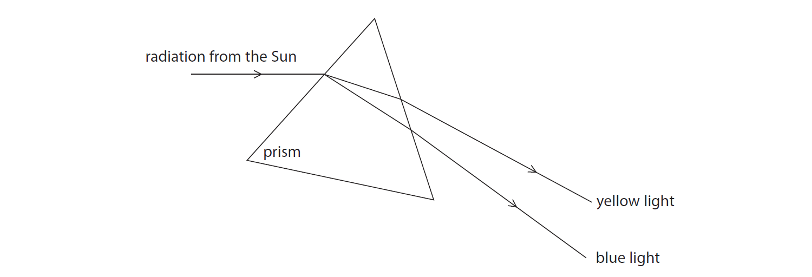

Add to the diagram to show how the prism refracts an infrared ray.

## Q24 — medium — 7 marks · exam-questions

### 8((a)) — 3 marks — command: state — structured — from paper 2015 January · 2P
A pulsar is a type of star.

We receive radiation from a pulsar in regular short bursts called pulses.

Some pulsars emit radio waves. Other pulsars emit x-rays.

(i) State a property of waves that is the same for radio waves and x-rays.

**[1]**

(ii) State two properties of waves that are different for radio waves and x-rays.

**[2]**

### 8((b)) — 4 marks — command: multiple — structured — from paper 2015 January · 2P
The graph shows five pulses of the signal from a pulsar.

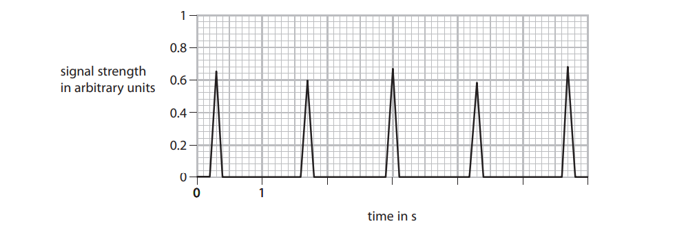

(i) Use the graph to estimate the average time between each pulse.

**[2]**

(ii) Calculate the frequency of the pulses in the signal.

Give the unit.

frequency = .......................... units ...........**[2]**

## Q25 — medium — 10 marks · exam-questions

### 4((a)) — 2 marks — command: multiple — structured — from paper June 2016 · 1PR
A teacher demonstrates different types of wave.

She uses a spring to demonstrate longitudinal waves.

(i) Draw arrows on the diagram to show the directions in which the teacher moves her hand.

**[1]**

(ii) Give an example of a longitudinal wave.

**[1]**

### 4((b)) — 8 marks — command: multiple — structured — from paper June 2016 · 1PR
The teacher then demonstrates transverse waves.

She fixes a vertical rod in a pond. She places a small wooden ring on the rod.

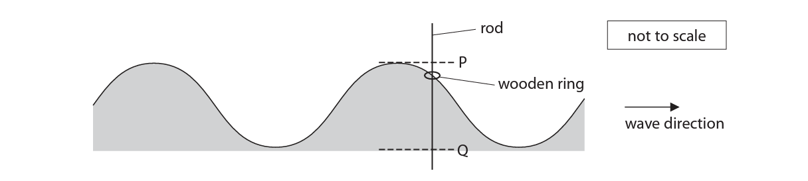

The ring floats on the water and moves up and down the rod as waves go past.

(i) On the diagram, draw a line to show one wavelength.

Label your line with the letter W.

**[1]**

(ii) The distance from P to Q is 5.0 cm.

Determine the amplitude of the wave.

**[1]**

(iii) The wooden ring reaches point P every 15 s.

Calculate the frequency of the wave.

Give the unit.

frequency = ....................... unit ...........**[3]**

(iv) Explain how the movement of the wooden ring demonstrates that this wave is transverse.

**[2]**

(v) The wave shown is a water wave.

Give a different example of a transverse wave.

**[1]**

## Q26 — medium — 4 marks · exam-questions

### 7((a)) — 1 mark — command: what — structured — from paper 2013 June · 2PR
Some waves travel across the sea.

They all have the same wavelength.

What is meant by the term wavelength?

### 7((b)) — 3 marks — command: multiple — structured — from paper 2013 June · 2PR
The waves travel across the sea at 3.0 m/s and have a frequency of 1.5 Hz.

(i) State the equation linking wave speed, frequency and wavelength.

**[1]**

(ii) Calculate the wavelength of the waves

wavelength = ........................... m **[2]**

## Q27 — medium — 6 marks · exam-questions

### 6() — 2 marks — command: calculate — structured — from paper 2015 June · 2PR
The diagram represents a microwave travelling in free space from point A to point B.

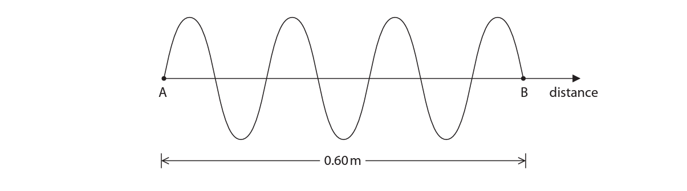

The distance from A to B is 0.60 m.

Calculate the wavelength of this microwave.

**  **wavelength = ................................**   **

### 6() — 4 marks — command: multiple — structured — from paper 2015 June · 2PR
(i) State the equation linking wave speed, frequency and wavelength.

**[1]**

(ii) Calculate the frequency of this microwave.

[speed of microwave in free space = 3.0 × 108 m/s]

**[3]**

## Q28 — medium — 5 marks · exam-questions

### 2((a)) — 3 marks — command: multiple — structured — from paper 2012 June · 2P
A microphone is connected to an oscilloscope to display a sound wave.

The diagram shows the trace on the oscilloscope screen.

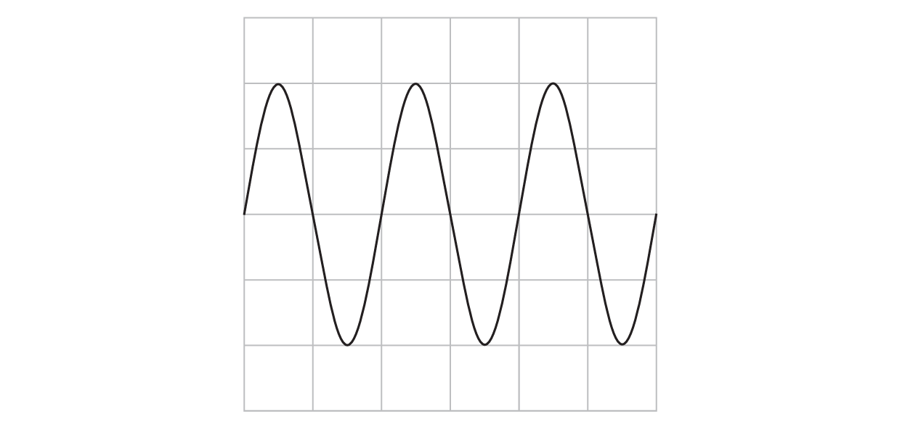

The oscilloscope settings are:

Y direction: 1 square = 1 V

X direction: 1 square = 0.001 s

(i) How many time periods are shown on the trace?

**[1]**

(ii) What is the frequency of the sound wave?

**[2]**

### 2((b)) — 2 marks — command: sketch — structured — from paper 2012 June · 2P
On the grid below, sketch the trace of a sound wave with a smaller amplitude and a higher frequency than the wave shown by the dotted line.

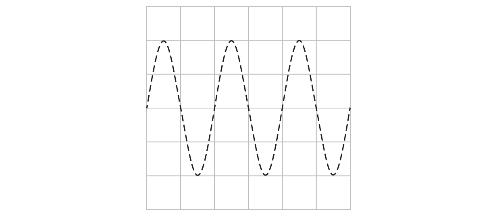

## Q29 — medium — 7 marks · exam-questions

### 6((b)) — 3 marks — command: multiple — structured — from paper 2013 January · 2P
In 1901, Marconi received the first radio signal across the Atlantic Ocean.

The frequency of Marconi’s radio wave was 820 kHz and the wavelength was 366 m.

(i) State the equation linking wave speed, frequency and wavelength for radio waves.

**[1]**

(ii) Calculate the speed of the radio waves Marconi received.

speed of radio waves = .................................. m/s**[2]**

### 6((c)) — 1 mark — command: what — structured — from paper 2013 January · 2P
Some people do not believe that Marconi received 820 kHz radio waves.

They think that the frequency was really twice as much: 1640 kHz.

If these people are correct, what wavelength radio waves did Marconi receive?

wavelength = .......................... m

### 6((d)) — 3 marks — command: explain — structured — from paper 2013 January · 2P
Other people do not think Marconi received a radio signal across the Atlantic Ocean at all.

They think the radio waves he received were really caused by electrostatic discharges from storm clouds.

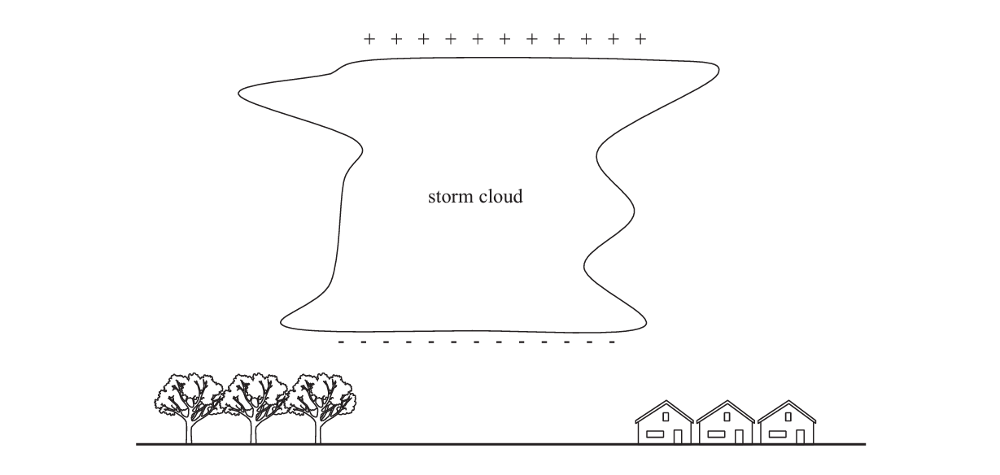

Explain what happens when a storm cloud discharges.

## Q30 — hard — 1 marks · exam-questions

### 2() — 1 mark — multiple_choice — from paper 2013 June · 1PR
A scanner uses one type of wave to check for broken bones.

An image of the bone is seen because the waves from the scanner are
- **A.** absorbed by the bone
- **B.** reflected by the bone
- **C.** refracted by the bone
- **D.** transmitted by the bone

## Q31 — hard — 1 marks · exam-questions

### 2() — 1 mark — multiple_choice — from paper 2014 June · 1PR
Ultrasound waves are also used to produce images.

This is an ultrasound image of a fetus surrounded by fluid.

The ultrasound image is caused by waves which bounce off the fetus.

This is an example of waves that are
- **A.** absorbed
- **B.** reflected
- **C.** refracted
- **D.** repelled

## Q32 — hard — 1 marks · exam-questions

### 5() — 1 mark — multiple_choice — from paper June 2013 · 2P
A student has some LEDs connected in a circuit. They emit light of different colours.

The different colours of light are waves which must have:
- **A.** the same amplitude in free space
- **B.** the same frequency in free space
- **C.** the same speed in free space
- **D.** the same wavelength in free space

## Q33 — hard — 1 marks · exam-questions

### 2((a)) — 1 mark — multiple_choice — from paper 2016 June · 2P
A remote control emits infrared waves to operate a television.

The television receives infrared waves and radio waves.

It emits light waves and sound waves.

Which type of wave has the highest frequency?
- **A.** infrared
- **B.** light
- **C.** radio
- **D.** sound

## Q34 — hard — 6 marks · exam-questions

### 7((a)) — 1 mark — command: what — structured — from paper 2013 January · 1P
A student is listening to a radio.

The radio is powered by batteries that provide a direct current (d.c.).

What is direct current?

### 7((b)) — 5 marks — command: multiple — structured — from paper 2013 January · 1P
Radio waves are part of the electromagnetic spectrum.

(i) Suggest a property of radio waves that makes them suitable for use in communication.

**[1]**

(ii) Complete the table to show uses and possible harmful effects of some other parts of the electromagnetic spectrum.

| **Part of the electromagnetic spectrum** | **Use** | **Possible harmful effect on people ** |
|---|---|---|
| Microwaves |   |   |
| Gamma |   |   |

**[4]**

## Q35 — hard — 9 marks · exam-questions

### 2((a)) — 3 marks — command: multiple — structured — from paper June 2016 · 1P
Different types of waves are used in hospitals.

(i) Draw a line linking each type of electromagnetic wave with its use.

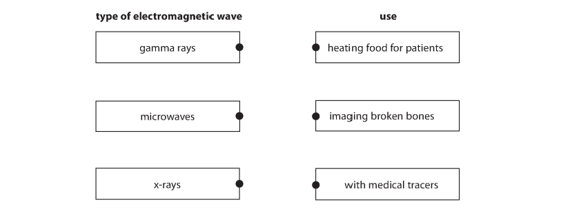

**[2]**

(ii) Electromagnetic waves are transverse.

Describe how the vibrations of a transverse wave relate to the direction in which the wave travels.

**[1]**

### 2((b)) — 4 marks — command: explain — structured — from paper June 2016 · 1P
Another type of wave used in hospitals is ultrasound. Ultrasound waves are used to make images of internal organs.

A scanner emits an ultrasound wave into the patient and records any reflections.

(i) The scanner records the time from when a wave is emitted to when its reflection is received.

A technician calculates the depth of the reflection using the equation

`d e p t h space equals space 1 half cross times open parentheses s p e e d space o f space u l t r a s o u n d space i n space p a t i e n t space cross times t i m e space r e c o r d e d space b y space s c a n n e r close parentheses`Explain why the technician uses the value $\frac{1}{2}$ in the equation.

**[2]**

(ii) An ultrasound wave travels faster in the patient than it does in air.

Explain how a change in speed affects the wavelength of the ultrasound wave.

**[2]**

### 2((c)) — 2 marks — command: explain — structured — from paper June 2016 · 1PR
Name one type of wave that is used in cancer treatment and explain what it does during the treatment.

## Q36 — hard — 10 marks · exam-questions

### 3((a)) — 4 marks — command: multiple — structured — from paper 2014 June · 1PR
Ultrasound waves are sound waves with a very high frequency. They are often used for medical purposes.

Dentists use ultrasound waves to clean patients’ teeth.

The diagram shows an ultrasound cleaner removing plaque from teeth.

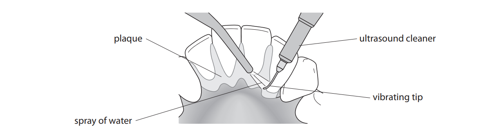

The tip of the ultrasound cleaner vibrates 96 million times per second and is sprayed with water.

(i) State the frequency of the ultrasound emitted by the cleaner and give the unit.

** **frequency = ....................... unit .....**[2]**

(ii) Suggest how the cleaner removes plaque.

**[1]**

(iii) Suggest why water is sprayed on the tip of the cleaner.

**[1]**

### 3((b)) — 4 marks — command: multiple — structured — from paper 2014 June · 1PR
(i) State the equation linking wave speed, frequency and wavelength.

**[1]**

(ii) The ultrasound waves have a wavelength of 0.00044 m and travel at a speed of 1540 m/s in the fluid.

Calculate the frequency, in MHz, of the ultrasound waves.

**[3]**

### 3((c)) — 2 marks — command: suggest — structured — from paper 2014 June · 1PR
Other waves also have medical uses.

Ultraviolet waves are used by doctors to cure some skin conditions.

Suggest two differences between ultrasound waves and ultraviolet waves.

## Q37 — hard — 8 marks · exam-questions

### 4((a)) — 2 marks — command: add — structured — from paper 2013 June · 2P
An LED needs a minimum voltage to make it emit light.

The student investigates this minimum voltage using the circuit shown.

The student uses a voltmeter to measure the voltage across the LED.

Add this voltmeter to the circuit diagram.

### 5() — 4 marks — command: plot — structured — from paper June 2013 · 2P
The student gradually increases the voltage across the LED and records the minimum voltage at which the LED emits light.

The results for some different LEDs are shown in the table.

| Colour of light from LED | Minimum voltage in V |
|---|---|
| Red | 1.7 |
| Blue | 3.6 |
| Yellow | 2.1 |
| Orange | 2.0 |
| Green | 3.0 |

Display the results of the student's investigation on the grid.

### 5() — 2 marks — command: evaluate — structured — from paper June 2013 · 2P
The student concludes:

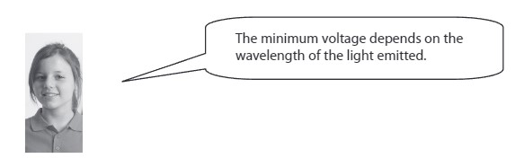

Evaluate the student's conclusion.

## Q38 — hard — 14 marks · exam-questions

### 13((a)) — 3 marks — command: multiple — structured — from paper June 2015 · 1P
Waves can travel on water, through air or in a vacuum.

The diagram shows the side-view of a wave on the surface of water.

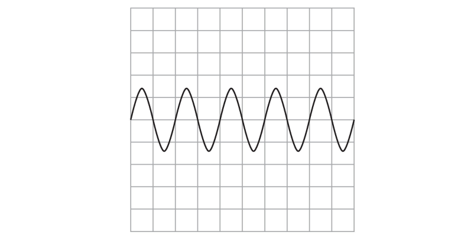

Each square on the grid represents 1 cm x 1 cm.

(i) State the wavelength of the wave shown.

**[1]**

(ii) On the grid sketch the trace of a wave travelling at the same speed, but with a larger amplitude and a lower frequency.

**[2]**

### 13((b)) — 5 marks — command: describe — structured — from paper June 2015 · 1P
Two students investigate the speed of sound waves in air.

They use a stopwatch that shows times to the nearest 0.1 s.

They use an outdoor running track as their measure of distance.

The track is straight and 100 m long.

Describe what else they must do to obtain a value for the speed of sound.

### 13((c)) — 4 marks — command: multiple — structured — from paper June 2015 · 1P
(i) State the equation linking wave speed, frequency and wavelength.

**[1]**

(ii) The speed of radio waves is 300 000 000 m/s.

A radio wave has a frequency of 31 MHz.

Calculate the wavelength of this radio wave.

wavelength = .......................... **[3]**

### 13((d)) — 2 marks — command: why — structured — from paper June 2015 · 1P
A sound wave and a radio wave have the same wavelength.

State why they have different frequencies.
